# API参考

<cite>
**本文档中引用的文件**  
- [app.go](file://app.go)
- [options.go](file://options.go)
- [config/config.go](file://config/config.go)
- [config/options.go](file://config/options.go)
- [transport/transport.go](file://transport/transport.go)
- [transport/http/server.go](file://transport/http/server.go)
- [transport/grpc/server.go](file://transport/grpc/server.go)
- [middleware/middleware.go](file://middleware/middleware.go)
- [middleware/recovery/recovery.go](file://middleware/recovery/recovery.go)
- [middleware/logging/logging.go](file://middleware/logging/logging.go)
- [middleware/metrics/metrics.go](file://middleware/metrics/metrics.go)
- [middleware/tracing/tracing.go](file://middleware/tracing/tracing.go)
- [config/file/file.go](file://config/file/file.go)
- [config/env/env.go](file://config/env/env.go)
- [registry/registry.go](file://registry/registry.go)
</cite>

## 目录
1. [应用管理](#应用管理)
2. [配置管理](#配置管理)
3. [传输层](#传输层)
4. [中间件](#中间件)
5. [注册中心](#注册中心)

## 应用管理

`app.go` 文件提供了应用程序生命周期管理的核心功能。`App` 结构体是应用程序组件生命周期的管理器，通过 `New` 函数创建并接收一系列 `Option` 配置项来定制应用行为。

`App` 实现了 `AppInfo` 接口，提供对应用ID、名称、版本、元数据和端点的访问。`Run` 方法执行所有在应用生命周期中注册的 `OnStart` 钩子，启动所有服务器，并在接收到终止信号时优雅地停止。

**Section sources**
- [app.go](file://app.go#L20-L213)
- [options.go](file://options.go#L14-L130)

## 配置管理

### Config 接口
`config/config.go` 文件定义了 `Config` 接口，是配置管理的核心。它提供了加载、扫描、获取值、监听和关闭配置的功能。

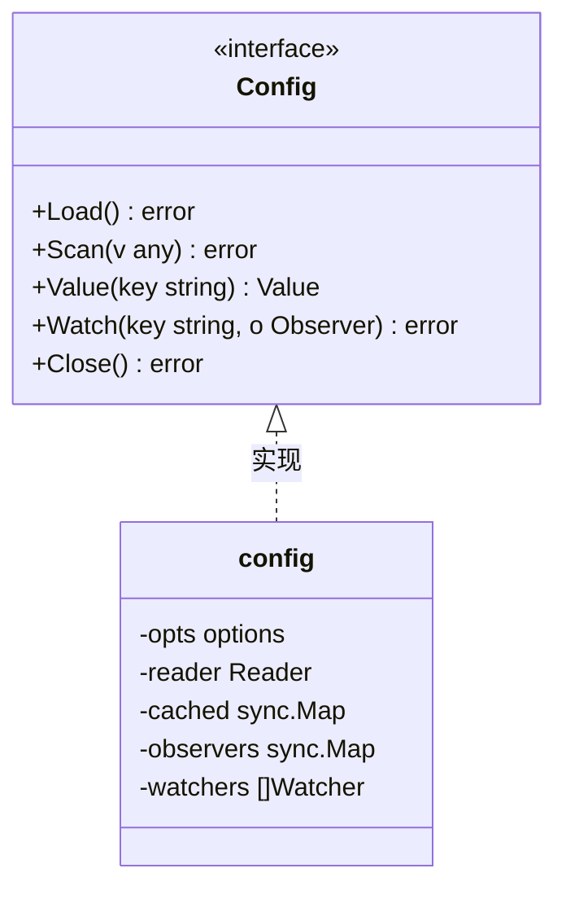

**Diagram sources **
- [config/config.go](file://config/config.go#L28-L34)

### 配置选项
`config/options.go` 文件定义了配置选项，允许通过 `Option` 函数定制配置行为。`WithSource` 用于指定配置源，`WithDecoder` 用于指定解码器，`WithResolver` 用于指定解析器，`WithMergeFunc` 用于指定合并函数。

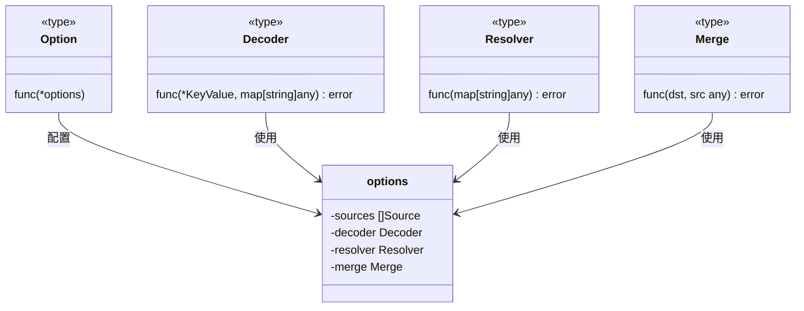

**Diagram sources **
- [config/options.go](file://config/options.go#L22-L29)

### 文件配置源
`config/file/file.go` 文件实现了从文件系统加载配置的 `Source`。`NewSource` 函数创建一个新的文件源，可以是单个文件或目录。

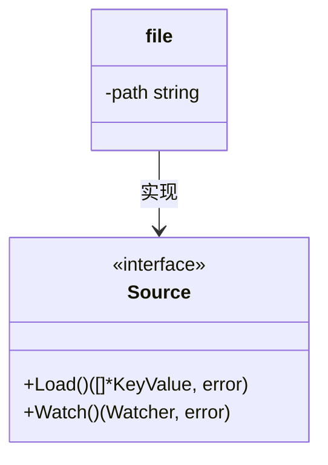

**Diagram sources **
- [config/file/file.go](file://config/file/file.go#L14-L16)

### 环境变量配置源
`config/env/env.go` 文件实现了从环境变量加载配置的 `Source`。`NewSource` 函数创建一个新的环境变量源，可以指定前缀来过滤环境变量。

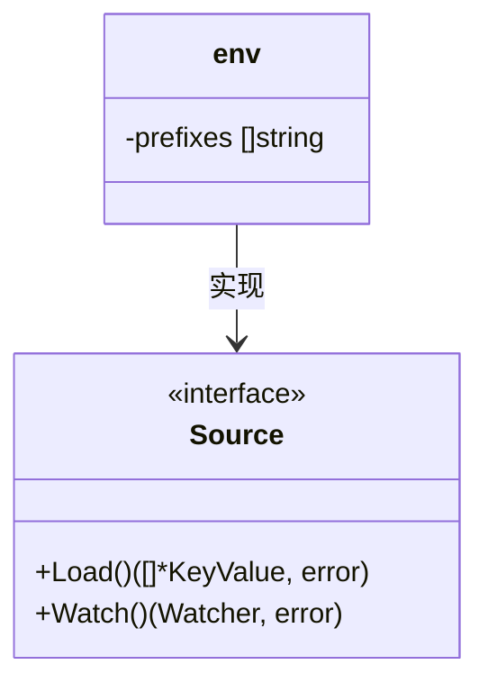

**Diagram sources **
- [config/env/env.go](file://config/env/env.go#L10-L12)

## 传输层

### 传输接口
`transport/transport.go` 文件定义了传输层的核心接口。`Server` 接口表示传输服务器，`Endpointer` 接口表示注册中心端点，`Header` 接口表示传输头，`Transporter` 接口表示传输上下文值。

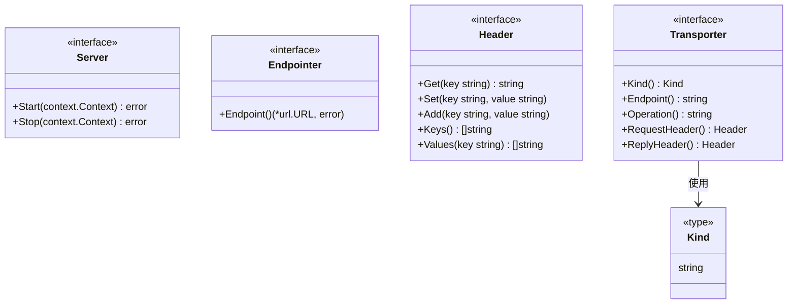

**Diagram sources **
- [transport/transport.go](file://transport/transport.go#L16-L57)

### HTTP 服务器
`transport/http/server.go` 文件实现了 HTTP 服务器。`Server` 结构体包装了 `http.Server`，并提供了丰富的配置选项，如网络、地址、超时、中间件、过滤器、请求解码器、响应编码器等。

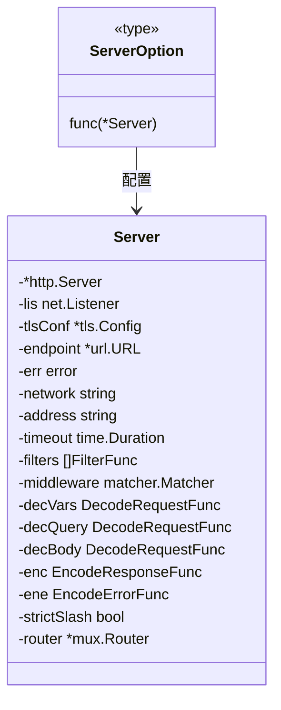

**Diagram sources **
- [transport/http/server.go](file://transport/http/server.go#L157-L175)

### gRPC 服务器
`transport/grpc/server.go` 文件实现了 gRPC 服务器。`Server` 结构体包装了 `grpc.Server`，并提供了丰富的配置选项，如网络、地址、超时、中间件、流中间件、拦截器、TLS 配置等。

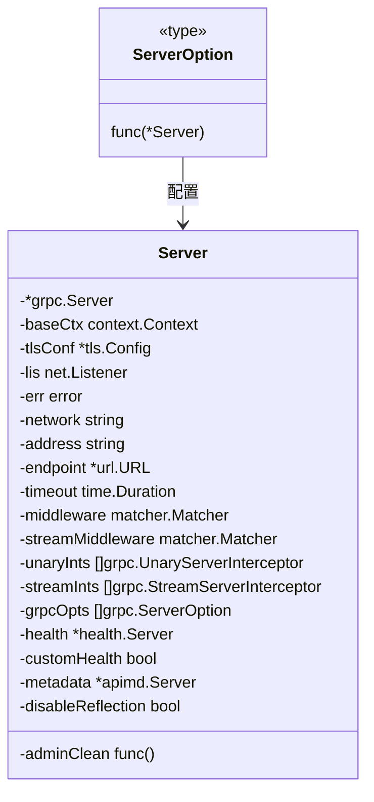

**Diagram sources **
- [transport/grpc/server.go](file://transport/grpc/server.go#L131-L151)

## 中间件

### 中间件基础
`middleware/middleware.go` 文件定义了中间件的基础。`Handler` 是由中间件调用的处理函数，`Middleware` 是 HTTP/gRPC 传输中间件。

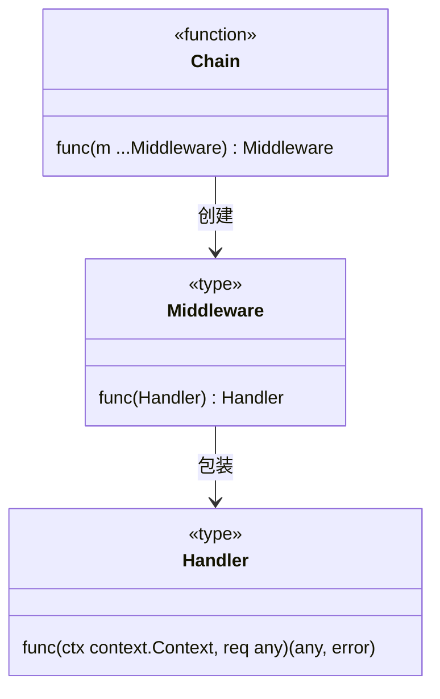

**Diagram sources **
- [middleware/middleware.go](file://middleware/middleware.go#L8-L11)

### 恢复中间件
`middleware/recovery/recovery.go` 文件实现了恢复中间件，用于从任何 panic 中恢复。`Recovery` 函数返回一个服务器中间件，可以在发生 panic 时记录错误并返回预定义的错误。

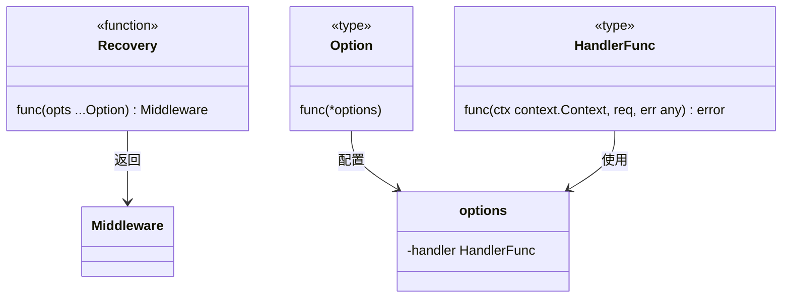

**Diagram sources **
- [middleware/recovery/recovery.go](file://middleware/recovery/recovery.go#L37-L38)

### 日志中间件
`middleware/logging/logging.go` 文件实现了日志中间件。`Server` 和 `Client` 函数分别返回服务器和客户端日志中间件，记录请求的详细信息。

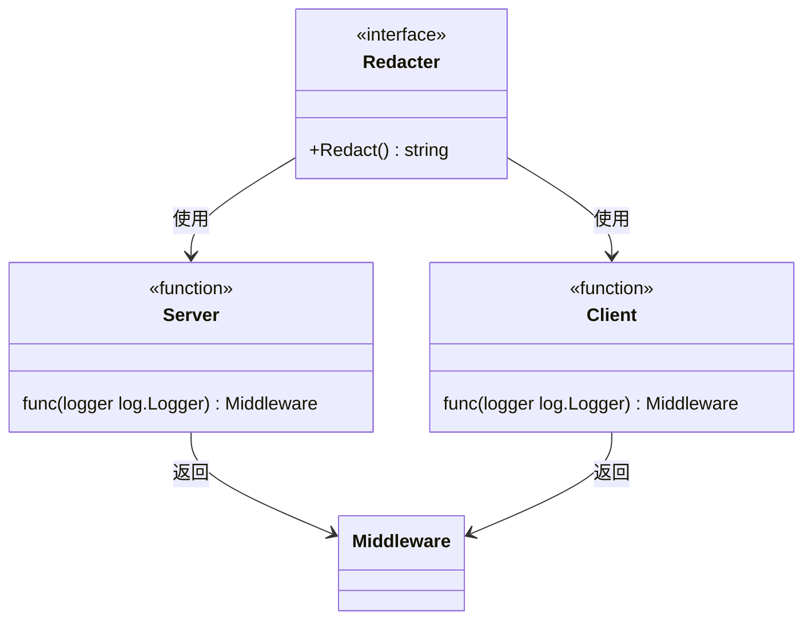

**Diagram sources **
- [middleware/logging/logging.go](file://middleware/logging/logging.go#L23-L24)

### 指标中间件
`middleware/metrics/metrics.go` 文件实现了指标中间件。`Server` 和 `Client` 函数分别返回服务器和客户端指标中间件，用于记录请求的指标。

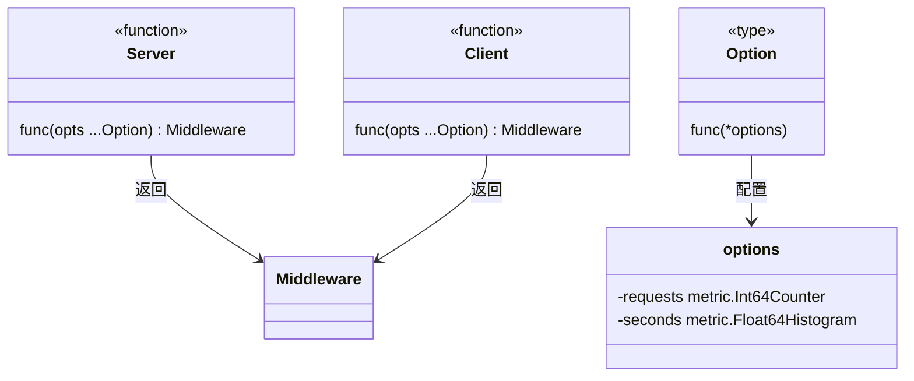

**Diagram sources **
- [middleware/metrics/metrics.go](file://middleware/metrics/metrics.go#L102-L103)

### 追踪中间件
`middleware/tracing/tracing.go` 文件实现了追踪中间件。`Server` 和 `Client` 函数分别返回服务器和客户端追踪中间件，用于记录请求的追踪信息。

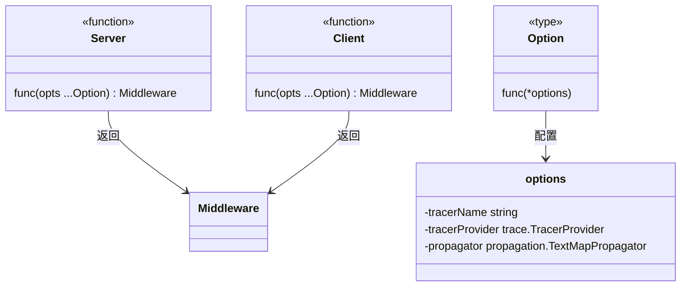

**Diagram sources **
- [middleware/tracing/tracing.go](file://middleware/tracing/tracing.go#L47-L48)

## 注册中心

### 注册与发现
`registry/registry.go` 文件定义了服务注册与发现的核心接口。`Registrar` 接口用于服务注册，`Discovery` 接口用于服务发现，`Watcher` 接口用于监听服务实例的变化。

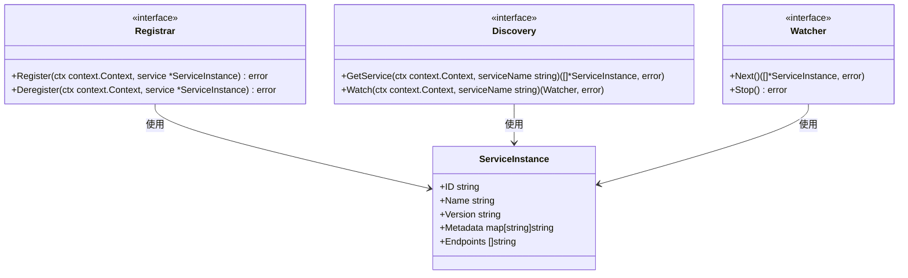

**Diagram sources **
- [registry/registry.go](file://registry/registry.go#L10-L23)