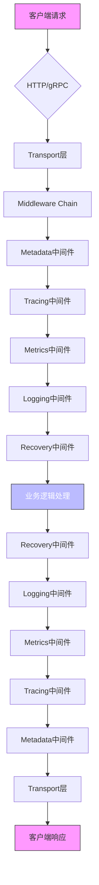

# 中间件系统API

<cite>
**本文档中引用的文件**  
- [middleware.go](file://middleware/middleware.go)
- [middleware_test.go](file://middleware/middleware_test.go)
- [tracing.go](file://middleware/tracing/tracing.go)
- [metrics.go](file://middleware/metrics/metrics.go)
- [recovery.go](file://middleware/recovery/recovery.go)
- [logging.go](file://middleware/logging/logging.go)
- [metadata.go](file://middleware/metadata/metadata.go)
- [transport.go](file://transport/transport.go)
- [server.go](file://transport/http/server.go)
- [interceptor.go](file://transport/grpc/interceptor.go)
- [context.go](file://internal/context/context.go)
- [metadata.go](file://metadata/metadata.go)
</cite>

## 目录
1. [中间件核心概念](#中间件核心概念)
2. [HandlerFunc与Chain函数](#handlerfunc与chain函数)
3. [内置中间件配置与使用](#内置中间件配置与使用)
4. [中间件链式调用示例](#中间件链式调用示例)
5. [上下文传递与元数据处理](#上下文传递与元数据处理)
6. [自定义中间件开发规范](#自定义中间件开发规范)
7. [中间件执行流程图](#中间件执行流程图)

## 中间件核心概念

Kratos框架的中间件系统为HTTP和gRPC服务提供了统一的拦截和处理机制。中间件在请求处理流程中扮演着关键角色，允许开发者在不修改业务逻辑的情况下添加横切关注点，如日志记录、错误恢复、指标收集和分布式追踪等功能。

中间件系统基于函数式编程思想设计，通过高阶函数实现功能的组合和复用。每个中间件都是一个函数，接收一个处理函数并返回一个新的处理函数，从而形成一个处理链。这种设计模式使得中间件可以灵活地组合和嵌套，满足不同场景的需求。

**Section sources**
- [middleware.go](file://middleware/middleware.go#L7-L11)
- [transport.go](file://transport/transport.go#L36-L57)

## HandlerFunc与Chain函数

### HandlerFunc类型定义

`HandlerFunc`是中间件系统的核心类型，定义了中间件处理函数的基本签名。它接收一个上下文和任意类型的请求参数，返回任意类型的响应和错误。这种设计使得中间件可以处理各种类型的请求和响应，具有很好的通用性和灵活性。

```go
type Handler func(ctx context.Context, req any) (any, error)
```

### Chain函数组合模式

`Chain`函数是中间件组合的核心工具，它接收多个中间件作为参数，并返回一个新的中间件。这些中间件按照后进先出的顺序被调用，即最后添加的中间件最先执行。这种设计确保了中间件的执行顺序符合预期，使得前置处理和后置处理能够正确地嵌套。

```go
func Chain(m ...Middleware) Middleware {
	return func(next Handler) Handler {
		for i := len(m) - 1; i >= 0; i-- {
			next = m[i](next)
		}
		return next
	}
}
```

**Section sources**
- [middleware.go](file://middleware/middleware.go#L8-L21)
- [middleware_test.go](file://middleware/middleware_test.go#L12-L61)

## 内置中间件配置与使用

### Tracing中间件

Tracing中间件用于实现分布式追踪功能，支持OpenTelemetry标准。通过配置选项可以自定义追踪器的行为。

#### 采样率设置

Tracing中间件通过OpenTelemetry的采样器来控制追踪的采样率。可以通过配置`WithTracerProvider`选项来设置自定义的追踪提供者，其中包含采样策略。

```go
// WithPropagator 设置追踪传播器
func WithPropagator(propagator propagation.TextMapPropagator) Option

// WithTracerProvider 设置追踪提供者
func WithTracerProvider(provider trace.TracerProvider) Option

// WithTracerName 设置追踪器名称
func WithTracerName(tracerName string) Option
```

**Section sources**
- [tracing.go](file://middleware/tracing/tracing.go#L15-L44)

### Metrics中间件

Metrics中间件用于收集服务的性能指标，支持OpenTelemetry度量标准。通过配置选项可以自定义指标的收集方式。

#### 指标收集配置

Metrics中间件提供了灵活的指标配置选项，可以自定义请求计数器和响应时间直方图。

```go
// WithRequests 设置请求计数器
func WithRequests(c metric.Int64Counter) Option

// WithSeconds 设置响应时间直方图
func WithSeconds(histogram metric.Float64Histogram) Option

// DefaultRequestsCounter 创建默认请求计数器
func DefaultRequestsCounter(meter metric.Meter, histogramName string) (metric.Int64Counter, error)

// DefaultSecondsHistogram 创建默认响应时间直方图
func DefaultSecondsHistogram(meter metric.Meter, histogramName string) (metric.Float64Histogram, error)
```

**Section sources**
- [metrics.go](file://middleware/metrics/metrics.go#L35-L65)

### Recovery中间件

Recovery中间件用于捕获和处理服务运行时的panic，防止服务崩溃。通过配置选项可以自定义错误恢复策略。

#### 错误恢复策略

Recovery中间件提供了自定义恢复处理函数的选项，允许开发者根据具体需求处理panic。

```go
// HandlerFunc 恢复处理函数
type HandlerFunc func(ctx context.Context, req, err any) error

// WithHandler 设置恢复处理函数
func WithHandler(h HandlerFunc) Option
```

**Section sources**
- [recovery.go](file://middleware/recovery/recovery.go#L20-L34)

### Logging中间件

Logging中间件用于记录服务的请求和响应日志。通过实现`Redacter`接口可以控制敏感信息的输出。

```go
// Redacter 定义如何记录对象
type Redacter interface {
	Redact() string
}
```

**Section sources**
- [logging.go](file://middleware/logging/logging.go#L17-L20)

## 中间件链式调用示例

### HTTP服务器中间件配置

在HTTP服务器中，可以通过`Middleware`选项配置中间件链：

```go
srv := http.NewServer(
	http.Middleware(
		middleware.Chain(
			tracing.Server(),
			logging.Server(logger),
			recovery.Recovery(),
			metrics.Server(),
		),
	),
)
```

### gRPC服务器中间件配置

在gRPC服务器中，中间件通过拦截器机制实现：

```go
srv := grpc.NewServer(
	grpc.Middleware(
		middleware.Chain(
			tracing.Server(),
			logging.Server(logger),
			recovery.Recovery(),
			metrics.Server(),
		),
	),
)
```

### 自定义中间件组合

开发者可以根据具体需求自定义中间件的组合顺序：

```go
// 创建自定义中间件链
customChain := middleware.Chain(
	metadata.Server(),
	tracing.Server(),
	logging.Server(logger),
	recovery.Recovery(
		recovery.WithHandler(func(ctx context.Context, req, err any) error {
			// 自定义错误处理逻辑
			return errors.InternalServer("RECOVERY", "service internal error")
		}),
	),
	metrics.Server(
		metrics.WithRequests(requestsCounter),
		metrics.WithSeconds(secondsHistogram),
	),
)

// 在服务器中使用自定义中间件链
srv := http.NewServer(
	http.Middleware(customChain),
)
```

**Section sources**
- [server.go](file://transport/http/server.go#L66-L69)
- [interceptor.go](file://transport/grpc/interceptor.go#L70-L89)

## 上下文传递与元数据处理

### 上下文传递机制

Kratos框架使用Go的`context`包实现上下文传递，确保请求的生命周期内可以携带和传递相关信息。

```go
// Merge 合并两个上下文
func Merge(parent1, parent2 context.Context) (context.Context, context.CancelFunc)
```

### 元数据处理流程

元数据中间件负责处理请求头中的元数据，支持服务间传递自定义信息。

```go
// WithConstants 设置常量元数据
func WithConstants(md metadata.Metadata) Option

// WithPropagatedPrefix 设置传播前缀
func WithPropagatedPrefix(prefix ...string) Option
```

元数据处理遵循以下流程：
1. 从请求头中提取以指定前缀开头的键值对
2. 将提取的元数据注入到服务器上下文中
3. 在客户端请求时，将服务器上下文中的元数据写入请求头

**Section sources**
- [context.go](file://internal/context/context.go#L22-L38)
- [metadata.go](file://middleware/metadata/metadata.go#L30-L42)
- [metadata.go](file://metadata/metadata.go#L77-L114)

## 自定义中间件开发规范

### 开发规范

开发自定义中间件需要遵循以下规范：

1. 实现`middleware.Middleware`接口
2. 正确处理上下文传递
3. 确保错误被正确传播
4. 遵循中间件的执行顺序

### 前后置逻辑处理

自定义中间件应正确处理请求的前后置逻辑：

```go
func CustomMiddleware() middleware.Middleware {
	return func(handler middleware.Handler) middleware.Handler {
		return func(ctx context.Context, req any) (reply any, err error) {
			// 前置处理逻辑
			startTime := time.Now()
			ctx = context.WithValue(ctx, "request_start", startTime)
			
			// 调用下一个处理函数
			reply, err = handler(ctx, req)
			
			// 后置处理逻辑
			latency := time.Since(startTime)
			log.Printf("Request latency: %v", latency)
			
			return reply, err
		}
	}
}
```

### 集成方式

自定义中间件可以通过以下方式集成到服务中：

1. 直接在服务器选项中配置
2. 通过中间件链组合
3. 使用选择器按条件应用

**Section sources**
- [middleware.go](file://middleware/middleware.go#L11-L12)
- [selector_test.go](file://middleware/selector/selector_test.go#L139-L140)

## 中间件执行流程图



**Diagram sources**
- [middleware.go](file://middleware/middleware.go#L14-L21)
- [transport.go](file://transport/transport.go#L76-L95)