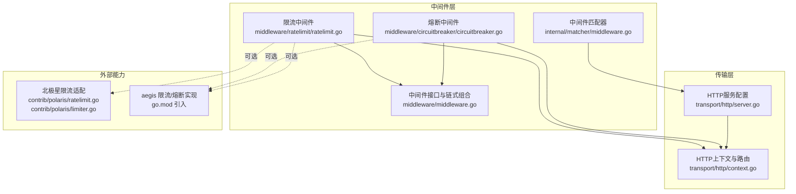
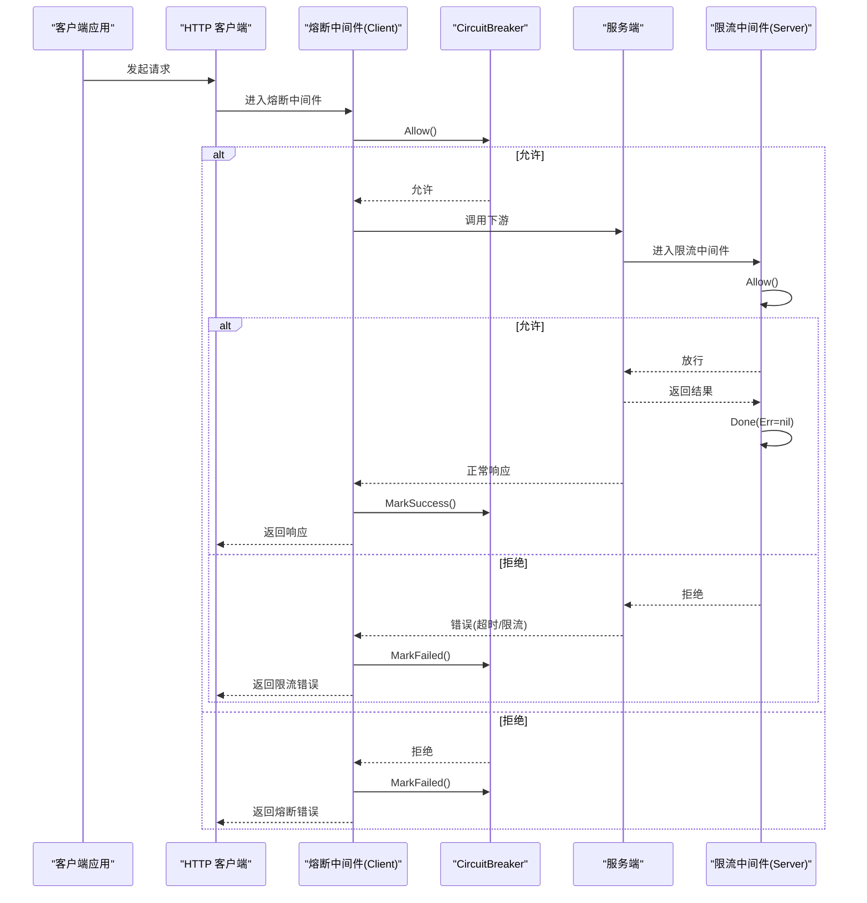
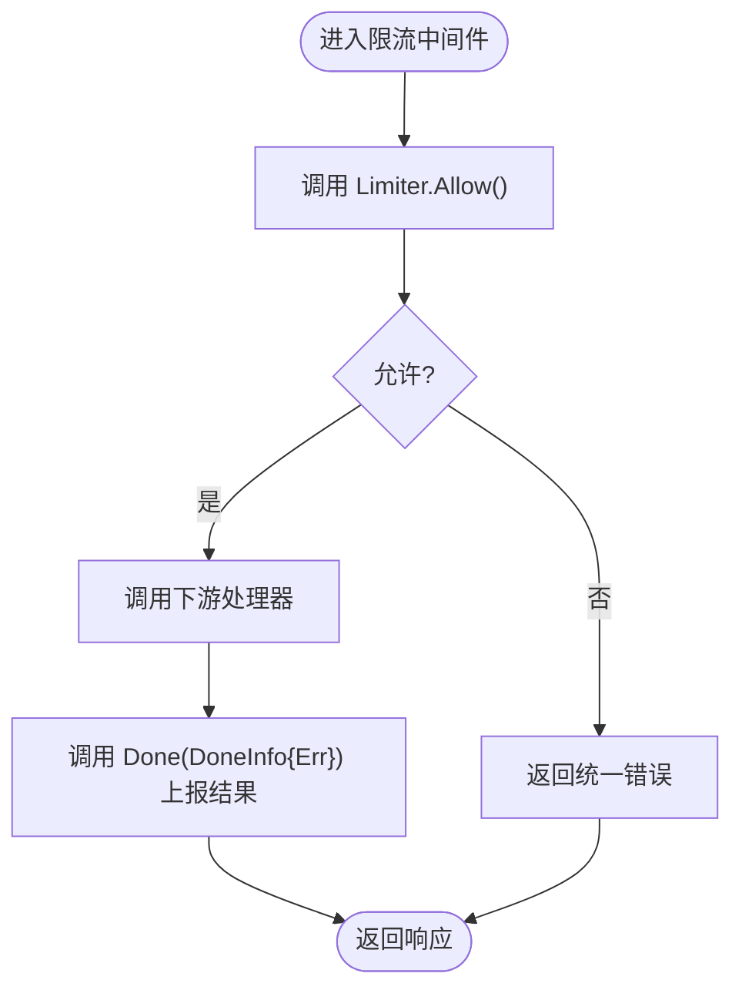
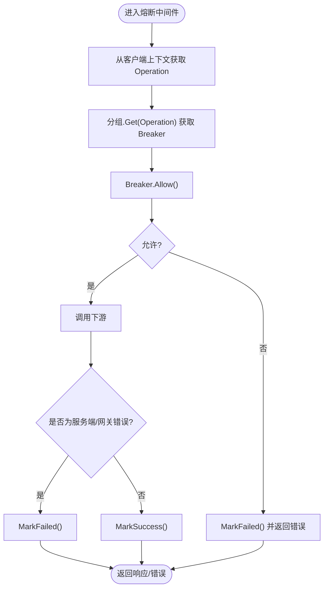
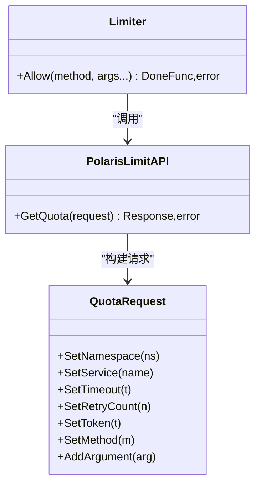
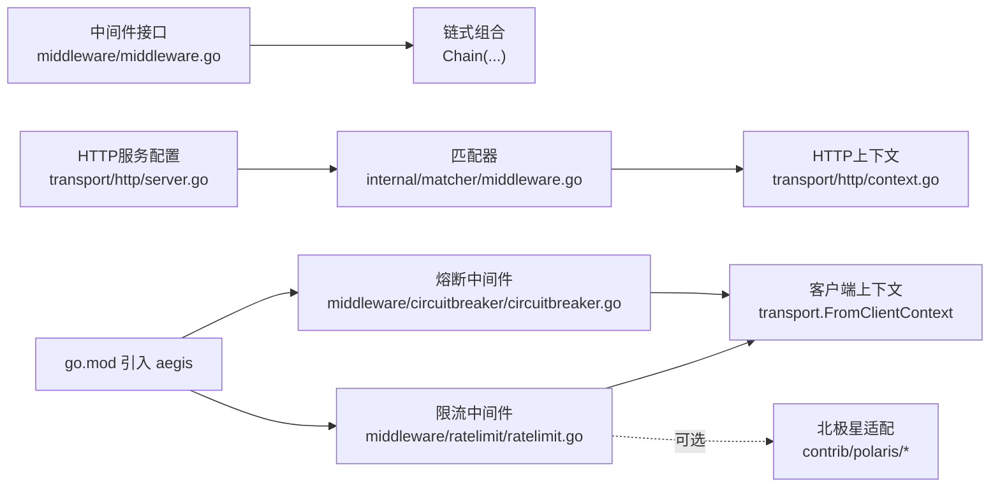

# 安全中间件

<cite>
**本文引用的文件列表**
- [middleware/ratelimit/ratelimit.go](file://middleware/ratelimit/ratelimit.go)
- [middleware/ratelimit/ratelimit_test.go](file://middleware/ratelimit/ratelimit_test.go)
- [middleware/circuitbreaker/circuitbreaker.go](file://middleware/circuitbreaker/circuitbreaker.go)
- [middleware/circuitbreaker/circuitbreaker_test.go](file://middleware/circuitbreaker/circuitbreaker_test.go)
- [middleware/middleware.go](file://middleware/middleware.go)
- [internal/matcher/middleware.go](file://internal/matcher/middleware.go)
- [transport/http/context.go](file://transport/http/context.go)
- [transport/http/server.go](file://transport/http/server.go)
- [contrib/polaris/ratelimit.go](file://contrib/polaris/ratelimit.go)
- [contrib/polaris/limiter.go](file://contrib/polaris/limiter.go)
- [go.mod](file://go.mod)
- [README.md](file://README.md)
</cite>

## 目录
1. [简介](#简介)
2. [项目结构](#项目结构)
3. [核心组件](#核心组件)
4. [架构总览](#架构总览)
5. [组件详解](#组件详解)
6. [依赖关系分析](#依赖关系分析)
7. [性能与基准](#性能与基准)
8. [故障排查指南](#故障排查指南)
9. [结论](#结论)
10. [附录](#附录)

## 简介
本文件面向需要在高并发场景下保障系统弹性的开发者，系统性梳理 Kratos 框架中的安全中间件：限流与熔断。重点覆盖：
- 限流中间件的令牌桶算法实现与可插拔策略
- 速率配置、突发容量、限流键提取等参数说明
- 熔断中间件的熔断策略与半开探测机制
- 在高并发场景下组合使用两种中间件的最佳实践
- 性能基准与生产环境配置建议

## 项目结构
围绕安全中间件的相关模块主要分布在 middleware、contrib/polaris、transport/http 以及内部匹配器与链式调用工具中。下图给出与本文相关的模块关系概览。

图表来源
- [middleware/ratelimit/ratelimit.go](file://middleware/ratelimit/ratelimit.go#L1-L52)
- [middleware/circuitbreaker/circuitbreaker.go](file://middleware/circuitbreaker/circuitbreaker.go#L1-L74)
- [middleware/middleware.go](file://middleware/middleware.go#L1-L21)
- [internal/matcher/middleware.go](file://internal/matcher/middleware.go#L1-L62)
- [transport/http/context.go](file://transport/http/context.go#L56-L101)
- [transport/http/server.go](file://transport/http/server.go#L58-L166)
- [contrib/polaris/ratelimit.go](file://contrib/polaris/ratelimit.go#L1-L53)
- [contrib/polaris/limiter.go](file://contrib/polaris/limiter.go#L1-L105)
- [go.mod](file://go.mod#L1-L49)

章节来源
- [middleware/ratelimit/ratelimit.go](file://middleware/ratelimit/ratelimit.go#L1-L52)
- [middleware/circuitbreaker/circuitbreaker.go](file://middleware/circuitbreaker/circuitbreaker.go#L1-L74)
- [middleware/middleware.go](file://middleware/middleware.go#L1-L21)
- [internal/matcher/middleware.go](file://internal/matcher/middleware.go#L1-L62)
- [transport/http/context.go](file://transport/http/context.go#L56-L101)
- [transport/http/server.go](file://transport/http/server.go#L58-L166)
- [contrib/polaris/ratelimit.go](file://contrib/polaris/ratelimit.go#L1-L53)
- [contrib/polaris/limiter.go](file://contrib/polaris/limiter.go#L1-L105)
- [go.mod](file://go.mod#L1-L49)

## 核心组件
- 限流中间件（Server）
  - 默认采用 bbr 限流器；可通过选项注入自定义 Limiter 实现
  - 对请求执行 Allow，若被拒绝则返回统一错误码
  - 成功放行后，通过 Done 回调上报错误状态以更新限流器内部统计
- 熔断中间件（Client）
  - 基于分组按操作名（Operation）选择对应的 CircuitBreaker
  - 允许时直接放行；拒绝时本地标记失败并返回统一错误码
  - 执行下游后根据错误类型决定 MarkSuccess 或 MarkFailed

章节来源
- [middleware/ratelimit/ratelimit.go](file://middleware/ratelimit/ratelimit.go#L1-L52)
- [middleware/circuitbreaker/circuitbreaker.go](file://middleware/circuitbreaker/circuitbreaker.go#L1-L74)

## 架构总览
下图展示客户端侧熔断与服务端侧限流在一次请求中的交互流程。

图表来源
- [middleware/circuitbreaker/circuitbreaker.go](file://middleware/circuitbreaker/circuitbreaker.go#L44-L74)
- [middleware/ratelimit/ratelimit.go](file://middleware/ratelimit/ratelimit.go#L31-L52)
- [transport/http/context.go](file://transport/http/context.go#L56-L101)

## 组件详解

### 限流中间件（Server）
- 功能要点
  - 默认使用 bbr 限流器；可通过 WithLimiter 注入自定义 Limiter
  - 请求进入时调用 Allow，若返回错误则直接拒绝并返回统一错误
  - 放行后调用下游处理，并在最后通过 Done 回传错误状态，用于限流器内部统计
- 关键参数与扩展点
  - 自定义 Limiter：通过 WithLimiter 注入任意实现 ratelimit.Limiter 的实例
  - Done 回调：DoneInfo 中携带错误状态，供限流器更新统计
- 使用建议
  - 在高并发场景下优先使用支持动态调整的 Limiter 实现
  - 结合北极星限流适配器，按方法名与请求参数进行精细化限流键提取

图表来源
- [middleware/ratelimit/ratelimit.go](file://middleware/ratelimit/ratelimit.go#L31-L52)

章节来源
- [middleware/ratelimit/ratelimit.go](file://middleware/ratelimit/ratelimit.go#L1-L52)
- [middleware/ratelimit/ratelimit_test.go](file://middleware/ratelimit/ratelimit_test.go#L1-L65)

### 熔断中间件（Client）
- 功能要点
  - 基于分组按 Operation 获取对应 CircuitBreaker
  - Allow 失败时本地标记失败并返回统一错误
  - 执行下游后根据错误类型决定 MarkSuccess 或 MarkFailed
- 关键参数与扩展点
  - 分组策略：WithGroup 可注入自定义分组；默认使用 sre.NewBreaker
  - 按操作名隔离：通过 transport.Operation() 作为键进行分组
- 使用建议
  - 将不同下游服务或不同操作路径分别配置独立熔断器，避免相互影响
  - 配合指标监控，观察错误率、半开探测成功率，动态调整阈值与恢复时间

图表来源
- [middleware/circuitbreaker/circuitbreaker.go](file://middleware/circuitbreaker/circuitbreaker.go#L44-L74)

章节来源
- [middleware/circuitbreaker/circuitbreaker.go](file://middleware/circuitbreaker/circuitbreaker.go#L1-L74)
- [middleware/circuitbreaker/circuitbreaker_test.go](file://middleware/circuitbreaker/circuitbreaker_test.go#L1-L81)

### 北极星限流适配（可选）
- 能力概述
  - 提供基于北极星的远程限流能力，支持按方法名与请求参数（头/查询）构造限流键
  - 通过 Limiter 实现 Allow 接口，内部调用北极星 LimitAPI 获取配额
- 关键参数
  - 命名空间、服务名、超时、重试次数、令牌数等
  - 方法名与请求参数（Header/Query）参与限流键生成
- 使用建议
  - 在多租户或多实例场景下，结合命名空间与服务名实现全局一致的限流策略
  - 注意网络抖动与超时配置，避免因限流接口异常导致业务降级

图表来源
- [contrib/polaris/limiter.go](file://contrib/polaris/limiter.go#L1-L105)
- [contrib/polaris/ratelimit.go](file://contrib/polaris/ratelimit.go#L1-L53)

章节来源
- [contrib/polaris/limiter.go](file://contrib/polaris/limiter.go#L1-L105)
- [contrib/polaris/ratelimit.go](file://contrib/polaris/ratelimit.go#L1-L53)

## 依赖关系分析
- 中间件接口与链式组合
  - 中间件统一接口为 func(Handler) Handler，通过 Chain 将多个中间件串联
- 传输层集成
  - HTTP 服务端在路由匹配时，会根据 Operation 或路径选择中间件链
  - 客户端上下文通过 transport.FromClientContext 获取 Operation，用于熔断分组
- 外部能力
  - 限流与熔断底层能力来自 aegis 库，通过 go.mod 引入

图表来源
- [middleware/middleware.go](file://middleware/middleware.go#L1-L21)
- [transport/http/server.go](file://transport/http/server.go#L58-L166)
- [internal/matcher/middleware.go](file://internal/matcher/middleware.go#L1-L62)
- [transport/http/context.go](file://transport/http/context.go#L56-L101)
- [middleware/circuitbreaker/circuitbreaker.go](file://middleware/circuitbreaker/circuitbreaker.go#L44-L74)
- [middleware/ratelimit/ratelimit.go](file://middleware/ratelimit/ratelimit.go#L31-L52)
- [go.mod](file://go.mod#L1-L49)

章节来源
- [middleware/middleware.go](file://middleware/middleware.go#L1-L21)
- [transport/http/server.go](file://transport/http/server.go#L58-L166)
- [internal/matcher/middleware.go](file://internal/matcher/middleware.go#L1-L62)
- [transport/http/context.go](file://transport/http/context.go#L56-L101)
- [middleware/circuitbreaker/circuitbreaker.go](file://middleware/circuitbreaker/circuitbreaker.go#L1-L74)
- [middleware/ratelimit/ratelimit.go](file://middleware/ratelimit/ratelimit.go#L1-L52)
- [go.mod](file://go.mod#L1-L49)

## 性能与基准
- 当前仓库未包含显式的性能基准测试数据。建议在实际环境中通过压测工具对以下关键路径进行评估：
  - 单机 QPS 与 P99 延迟
  - 限流器在高并发下的 CPU 占用与内存分配
  - 熔断器在错误率变化下的切换延迟与半开探测成功率
- 基准测试建议
  - 使用稳定流量与突发流量混合压测，观察限流与熔断协同表现
  - 记录拒绝率、错误率、超时率与吞吐量，定位瓶颈
  - 对比不同 Limiter 实现（如 bbr 与北极星）在不同负载下的差异
- 生产环境配置建议
  - 限流
    - 速率与突发：根据 SLA 设定峰值与突发窗口，避免误杀正常流量
    - 键提取：优先使用更细粒度的键（如用户标识、来源 IP、方法名），减少“连坐”效应
  - 熔断
    - 错误率阈值：结合业务特性设置合理阈值，避免误触发
    - 熔断时长：根据下游恢复时间设定，确保半开探测能真实反映健康状况
    - 半开探测：控制探测频率与并发，避免对下游造成额外压力
  - 组合使用
    - 先限流后熔断：在入口处先做限流，再在跨服务调用时做熔断
    - 分层治理：对不同路径/服务配置差异化策略，避免全局一刀切

[本节为通用指导，不直接分析具体文件，故无章节来源]

## 故障排查指南
- 限流相关
  - 现象：大量 429 错误
  - 排查要点
    - 检查 Limiter 是否正确注入与初始化
    - 核对限流键提取逻辑（方法名、头、查询参数）是否符合预期
    - 观察 Done 回调是否被调用，确认统计更新正常
- 熔断相关
  - 现象：大量 503 错误
  - 排查要点
    - 检查 Operation 是否正确传递到客户端上下文
    - 确认分组是否按 Operation 正确获取对应 Breaker
    - 观察 MarkSuccess/MarkFailed 是否按预期触发，避免误判
- 组合使用
  - 若同时启用限流与熔断，需关注两者之间的相互影响
  - 建议在压测中模拟极端场景，验证拒绝策略与恢复策略的有效性

章节来源
- [middleware/ratelimit/ratelimit.go](file://middleware/ratelimit/ratelimit.go#L1-L52)
- [middleware/circuitbreaker/circuitbreaker.go](file://middleware/circuitbreaker/circuitbreaker.go#L1-L74)
- [middleware/ratelimit/ratelimit_test.go](file://middleware/ratelimit/ratelimit_test.go#L1-L65)
- [middleware/circuitbreaker/circuitbreaker_test.go](file://middleware/circuitbreaker/circuitbreaker_test.go#L1-L81)

## 结论
- 限流与熔断是保障系统弹性的两大基石。Kratos 提供了简洁而强大的中间件抽象，配合 aegis 与可选的北极星适配，能够满足从单机到分布式多租户的多样化需求。
- 在高并发场景下，建议优先采用细粒度限流键与合理的突发策略，再配合熔断器的错误率阈值与半开探测，形成“入口限流 + 跨服务熔断”的双层防护。
- 实际部署中应结合压测与监控，持续优化阈值与时长，确保在保护系统的同时尽量减少对正常流量的影响。

[本节为总结性内容，不直接分析具体文件，故无章节来源]

## 附录

### 速率配置与突发容量
- 速率与突发容量由 Limiter 实现决定。默认 bbr 限流器在中间件中创建，可通过 WithLimiter 注入自定义实现。
- 若使用北极星适配，速率与突发可通过命名空间、服务名、令牌数等参数进行集中管理。

章节来源
- [middleware/ratelimit/ratelimit.go](file://middleware/ratelimit/ratelimit.go#L1-L52)
- [contrib/polaris/limiter.go](file://contrib/polaris/limiter.go#L1-L105)

### 限流键提取
- 默认 Server 限流中间件仅使用 Limiter.Allow() 的返回值进行放行/拒绝判断。
- 北极星适配支持从请求头与查询参数构造限流键，从而实现更精细的限流策略。

章节来源
- [middleware/ratelimit/ratelimit.go](file://middleware/ratelimit/ratelimit.go#L1-L52)
- [contrib/polaris/ratelimit.go](file://contrib/polaris/ratelimit.go#L1-L53)

### 熔断策略与半开探测
- 默认使用 sre.NewBreaker，支持错误率阈值、熔断时长与半开探测。
- 客户端侧通过 transport.Operation() 作为键进行分组，确保不同操作路径的熔断状态相互隔离。

章节来源
- [middleware/circuitbreaker/circuitbreaker.go](file://middleware/circuitbreaker/circuitbreaker.go#L1-L74)

### 在高并发场景下的组合实践
- 入口限流：在 HTTP 服务端启用限流中间件，按方法名与请求参数进行限流键提取
- 跨服务熔断：在客户端启用熔断中间件，按 Operation 进行分组，结合错误类型标记成功/失败
- 监控与告警：结合指标与日志，观测拒绝率、错误率与恢复时间，动态调整策略

章节来源
- [transport/http/context.go](file://transport/http/context.go#L56-L101)
- [transport/http/server.go](file://transport/http/server.go#L58-L166)
- [internal/matcher/middleware.go](file://internal/matcher/middleware.go#L1-L62)