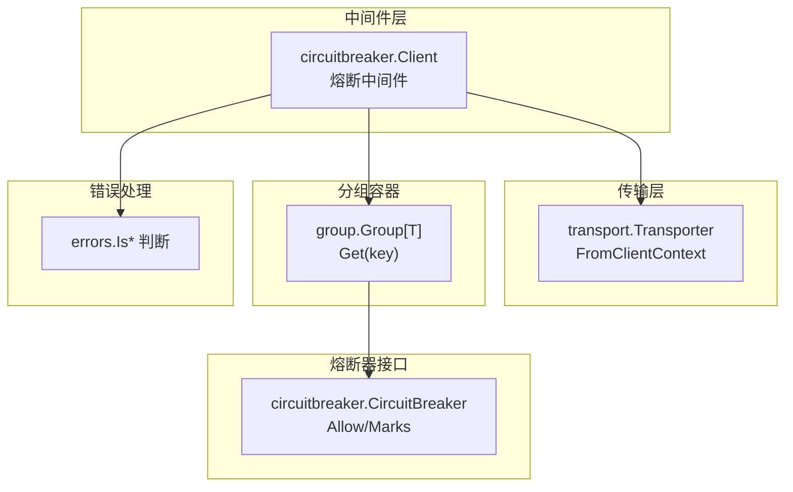
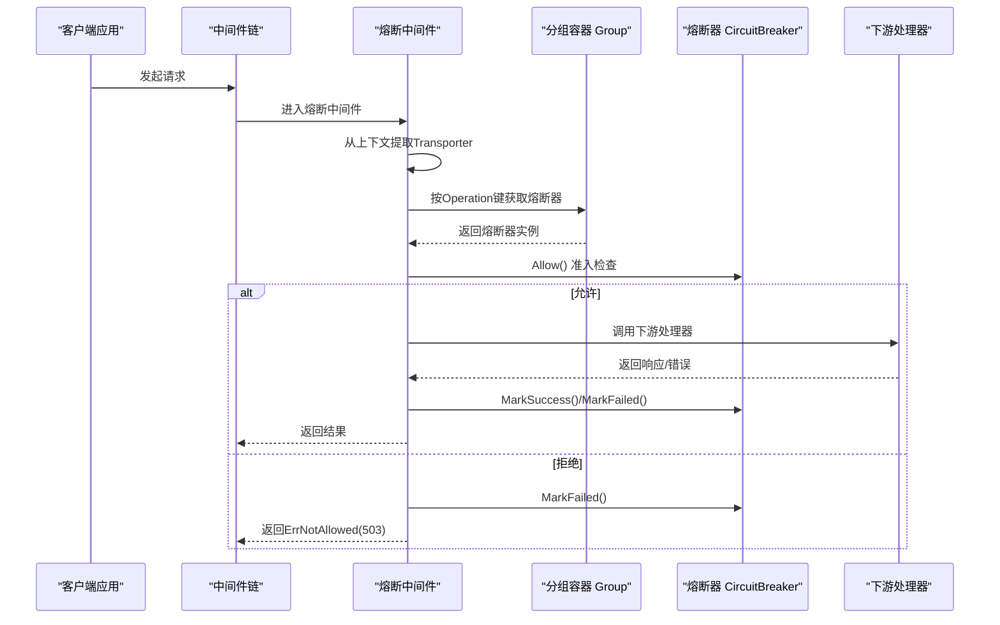
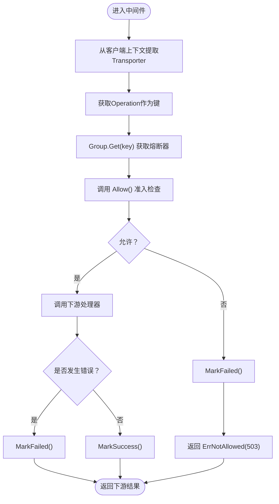
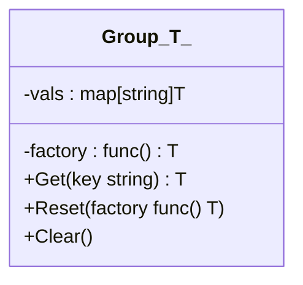
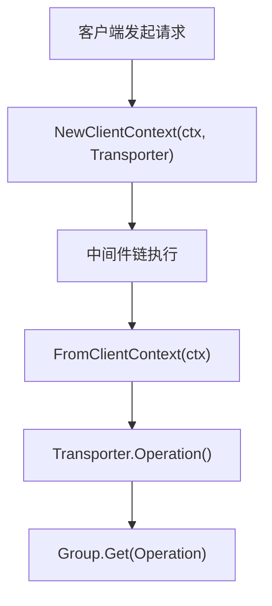
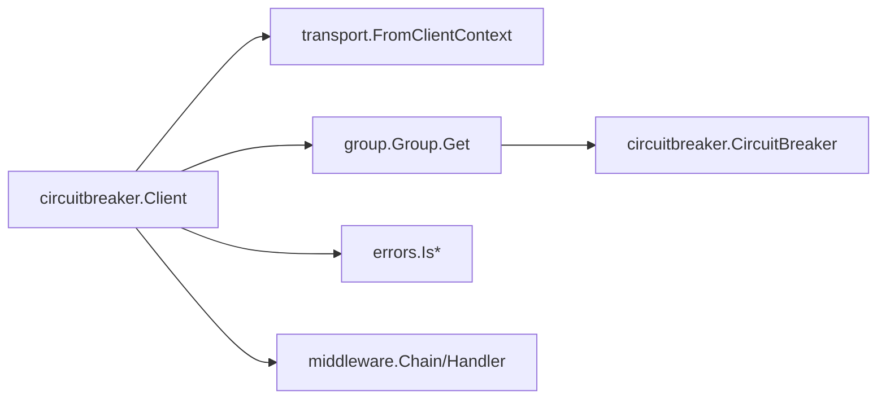

# 熔断中间件

<cite>
**本文引用的文件**
- [middleware/circuitbreaker/circuitbreaker.go](file://middleware/circuitbreaker/circuitbreaker.go)
- [middleware/circuitbreaker/circuitbreaker_test.go](file://middleware/circuitbreaker/circuitbreaker_test.go)
- [internal/group/group.go](file://internal/group/group.go)
- [transport/transport.go](file://transport/transport.go)
- [errors/errors.go](file://errors/errors.go)
- [middleware/middleware.go](file://middleware/middleware.go)
</cite>

## 目录
1. [简介](#简介)
2. [项目结构](#项目结构)
3. [核心组件](#核心组件)
4. [架构总览](#架构总览)
5. [详细组件分析](#详细组件分析)
6. [依赖关系分析](#依赖关系分析)
7. [性能与稳定性考量](#性能与稳定性考量)
8. [故障排查指南](#故障排查指南)
9. [结论](#结论)
10. [附录：配置与最佳实践](#附录配置与最佳实践)

## 简介
本文件面向Kratos框架中的熔断中间件，聚焦于circuitbreaker包的SRE（Search, Recommendation, and Advertising）熔断策略实现。文档将系统性说明：
- Client中间件如何基于group.Group按Operation维度管理不同熔断器实例
- 如何从上下文中提取transport信息并定位对应熔断器
- 熔断器三态（关闭、打开、半开）的准入检查与MarkSuccess/MarkFailed触发条件
- WithGroup与WithCircuitBreaker配置项的使用场景及扩展思路
- 处理ErrNotAllowed错误（503 Service Unavailable）的客户端重试策略建议
- 对系统稳定性的影响评估与生产环境关键参数配置建议

## 项目结构
围绕熔断中间件的相关文件组织如下：
- middleware/circuitbreaker：熔断中间件实现与测试
- internal/group：通用分组容器，按键懒加载缓存对象
- transport：传输层抽象与上下文读取工具
- errors：统一错误类型与判断工具
- middleware：中间件链式调用接口定义

图表来源
- [middleware/circuitbreaker/circuitbreaker.go](file://middleware/circuitbreaker/circuitbreaker.go#L44-L74)
- [transport/transport.go](file://transport/transport.go#L86-L95)
- [internal/group/group.go](file://internal/group/group.go#L29-L49)
- [errors/errors.go](file://errors/errors.go#L1-L153)

章节来源
- [middleware/circuitbreaker/circuitbreaker.go](file://middleware/circuitbreaker/circuitbreaker.go#L1-L75)
- [internal/group/group.go](file://internal/group/group.go#L1-L68)
- [transport/transport.go](file://transport/transport.go#L1-L96)
- [errors/errors.go](file://errors/errors.go#L1-L153)
- [middleware/middleware.go](file://middleware/middleware.go#L1-L22)

## 核心组件
- 熔断中间件Client：在请求前执行Allow准入检查；根据返回结果决定是否拒绝或继续；在请求完成后依据错误类型标记成功或失败
- 分组容器Group：按Operation键懒加载并缓存熔断器实例，避免重复创建
- 传输上下文：从客户端上下文中提取Transporter，获取Operation作为分组键
- 错误判断：基于统一错误类型判断内部错误、服务不可用、网关超时等

章节来源
- [middleware/circuitbreaker/circuitbreaker.go](file://middleware/circuitbreaker/circuitbreaker.go#L44-L74)
- [internal/group/group.go](file://internal/group/group.go#L29-L49)
- [transport/transport.go](file://transport/transport.go#L86-L95)
- [errors/errors.go](file://errors/errors.go#L1-L153)

## 架构总览
熔断中间件在客户端调用链中拦截请求，按Operation维度选择对应的熔断器实例进行准入控制，并在响应后根据错误类型更新状态。

图表来源
- [middleware/circuitbreaker/circuitbreaker.go](file://middleware/circuitbreaker/circuitbreaker.go#L54-L73)
- [transport/transport.go](file://transport/transport.go#L86-L95)
- [internal/group/group.go](file://internal/group/group.go#L29-L49)

## 详细组件分析

### 组件A：熔断中间件Client
- 功能要点
  - 默认使用SRE策略的熔断器工厂创建Group
  - 支持通过WithGroup注入自定义Group
  - 支持通过WithCircuitBreaker注入自定义生成函数以集成其他熔断算法
  - 从客户端上下文提取Transporter，使用Operation作为键获取熔断器
  - Allow失败时直接拒绝并返回ErrNotAllowed（503），同时标记失败
  - 请求完成后，若为内部错误、服务不可用、网关超时则标记失败，否则标记成功

- 关键流程图（准入与标记）

图表来源
- [middleware/circuitbreaker/circuitbreaker.go](file://middleware/circuitbreaker/circuitbreaker.go#L54-L73)
- [errors/errors.go](file://errors/errors.go#L1-L153)

章节来源
- [middleware/circuitbreaker/circuitbreaker.go](file://middleware/circuitbreaker/circuitbreaker.go#L44-L74)
- [middleware/circuitbreaker/circuitbreaker_test.go](file://middleware/circuitbreaker/circuitbreaker_test.go#L1-L81)
- [errors/errors.go](file://errors/errors.go#L1-L153)

### 组件B：分组容器Group
- 功能要点
  - 懒加载：首次访问某键时才创建实例
  - 缓存：已创建实例会缓存在内存中，后续访问复用
  - 并发安全：读写锁保护vals映射
  - 可重置：支持替换工厂并清空已有实例

- 类图（简化）

图表来源
- [internal/group/group.go](file://internal/group/group.go#L1-L68)

章节来源
- [internal/group/group.go](file://internal/group/group.go#L1-L68)

### 组件C：传输上下文与Operation键
- 功能要点
  - 提供客户端/服务端上下文封装与提取
  - Transporter接口包含Operation方法，用于标识具体操作（如HTTP路径或gRPC全限定方法）
  - 中间件通过FromClientContext获取Transporter，从而得到Operation键

- 流程图（上下文提取）

图表来源
- [transport/transport.go](file://transport/transport.go#L86-L95)

章节来源
- [transport/transport.go](file://transport/transport.go#L1-L96)

### 组件D：错误类型与判断
- 功能要点
  - 提供统一错误类型与错误码映射
  - 提供Is*系列判断函数，用于识别内部错误、服务不可用、网关超时等

- 使用场景
  - 在熔断中间件中用于区分“应计入失败”的错误类别

章节来源
- [errors/errors.go](file://errors/errors.go#L1-L153)

## 依赖关系分析
- 熔断中间件依赖
  - transport：从客户端上下文提取Transporter
  - internal/group：按Operation键管理熔断器实例
  - errors：判断错误类型以决定标记成功或失败
  - middleware：中间件链式调用接口

图表来源
- [middleware/circuitbreaker/circuitbreaker.go](file://middleware/circuitbreaker/circuitbreaker.go#L44-L74)
- [transport/transport.go](file://transport/transport.go#L86-L95)
- [internal/group/group.go](file://internal/group/group.go#L29-L49)
- [errors/errors.go](file://errors/errors.go#L1-L153)
- [middleware/middleware.go](file://middleware/middleware.go#L1-L22)

章节来源
- [middleware/circuitbreaker/circuitbreaker.go](file://middleware/circuitbreaker/circuitbreaker.go#L1-L75)
- [transport/transport.go](file://transport/transport.go#L1-L96)
- [internal/group/group.go](file://internal/group/group.go#L1-L68)
- [errors/errors.go](file://errors/errors.go#L1-L153)
- [middleware/middleware.go](file://middleware/middleware.go#L1-L22)

## 性能与稳定性考量
- 性能特性
  - Group懒加载与缓存避免了频繁创建熔断器实例，降低CPU与内存抖动
  - Operation键粒度细，可针对不同接口独立治理，提升整体稳定性
- 稳定性影响
  - Allow失败即拒绝并标记失败，有助于快速阻断异常流量，防止雪崩
  - MarkSuccess/MarkFailed仅在下游返回错误时才更新，正常响应不计为失败，减少误判
- 参数建议（生产环境）
  - 错误率阈值：建议结合SLA设定，如错误率超过阈值进入打开态
  - 采样窗口：建议采用滑动时间窗，窗口大小需平衡实时性与统计稳定性
  - 半开探测间隔：建议设置为指数退避或自适应探测，避免过早放量导致二次崩溃
  - 熔断恢复策略：半开探测次数与成功率阈值需结合业务峰值与RT分布调整
  - 配置下发：建议通过集中配置中心动态调整，支持灰度与回滚

[本节为通用指导，无需特定文件引用]

## 故障排查指南
- 常见问题
  - 请求被直接拒绝（503）：检查熔断器状态与错误率阈值，确认是否因异常流量触发
  - Mark失败过多：核对下游错误类型判断逻辑，确保仅对真实失败标记失败
  - Operation键不匹配：确认客户端上下文是否正确注入Transporter，Operation是否符合预期
- 排查步骤
  - 启用日志与指标，观察熔断器状态变化与MarkSuccess/MarkFailed比例
  - 使用测试用例验证WithGroup与WithCircuitBreaker的行为
  - 校验错误类型判断是否覆盖所有需要纳入统计的错误

章节来源
- [middleware/circuitbreaker/circuitbreaker_test.go](file://middleware/circuitbreaker/circuitbreaker_test.go#L1-L81)
- [errors/errors.go](file://errors/errors.go#L1-L153)

## 结论
Kratos熔断中间件通过Group按Operation维度管理熔断器实例，结合SRE策略在客户端侧实现高效、细粒度的流量治理。其准入检查与标记逻辑清晰，易于扩展自定义熔断算法。配合合理的阈值与窗口参数，可在保障系统稳定性的前提下维持良好的吞吐与延迟表现。

[本节为总结性内容，无需特定文件引用]

## 附录：配置与最佳实践

### 配置项与使用场景
- WithGroup
  - 场景：需要完全接管熔断器生命周期与实例管理
  - 注意：传入nil不会改变默认行为，需显式注入自定义Group
- WithCircuitBreaker
  - 场景：希望以自定义生成函数集成其他熔断算法（如基于滑动窗口的策略）
  - 实现：通过该选项将自定义工厂包装为Group，保持按Operation键的分组能力

章节来源
- [middleware/circuitbreaker/circuitbreaker.go](file://middleware/circuitbreaker/circuitbreaker.go#L21-L36)

### 客户端重试策略建议（处理ErrNotAllowed）
- 策略要点
  - 将ErrNotAllowed视为临时性故障，采用指数退避重试
  - 限制最大重试次数与总超时时间，避免放大流量
  - 对不同Operation设置差异化重试策略，避免热点接口被反复冲击
  - 与熔断器状态联动：当熔断器处于打开态时，减少重试频率或直接降级

[本节为通用指导，无需特定文件引用]

### 生产环境关键参数配置指南
- 错误率阈值：建议从低到高逐步调优，结合SLA与历史数据确定
- 采样窗口：建议采用1分钟滑动窗口，兼顾实时性与统计稳定性
- 半开探测间隔：建议指数退避，如1s、2s、4s、8s循环
- 恢复策略：半开探测成功阈值与探测次数需结合业务峰值与RT分布
- 动态配置：通过配置中心下发，支持灰度与回滚

[本节为通用指导，无需特定文件引用]