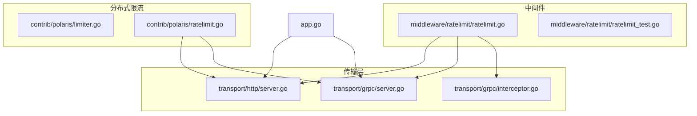
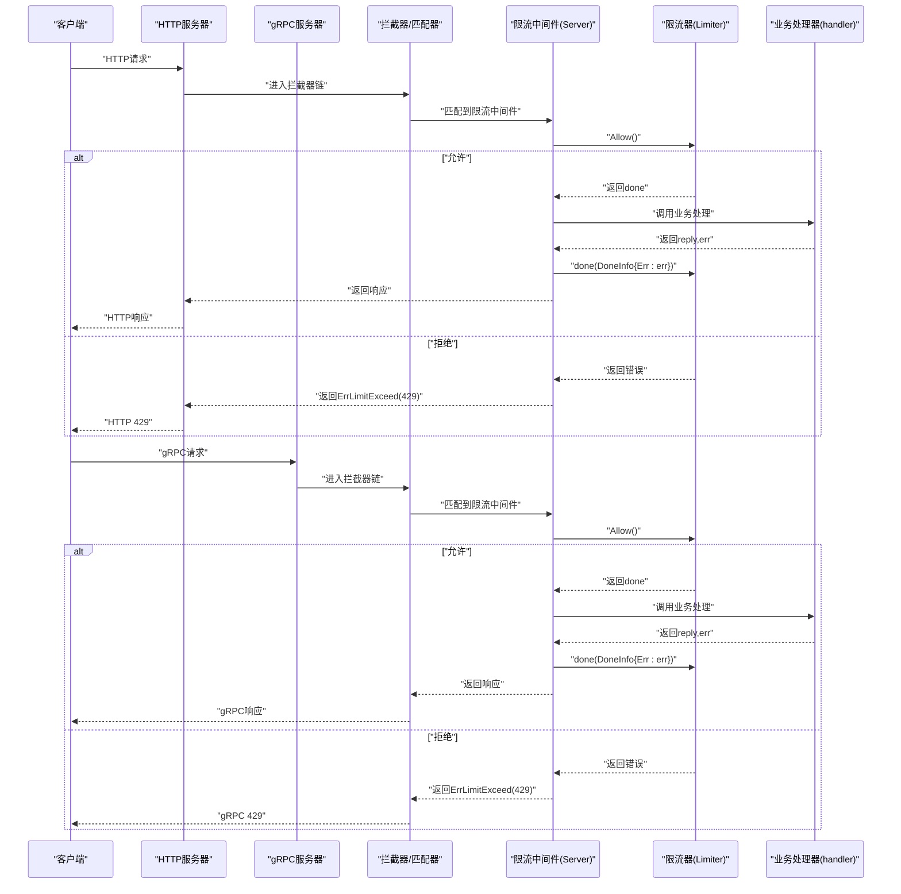
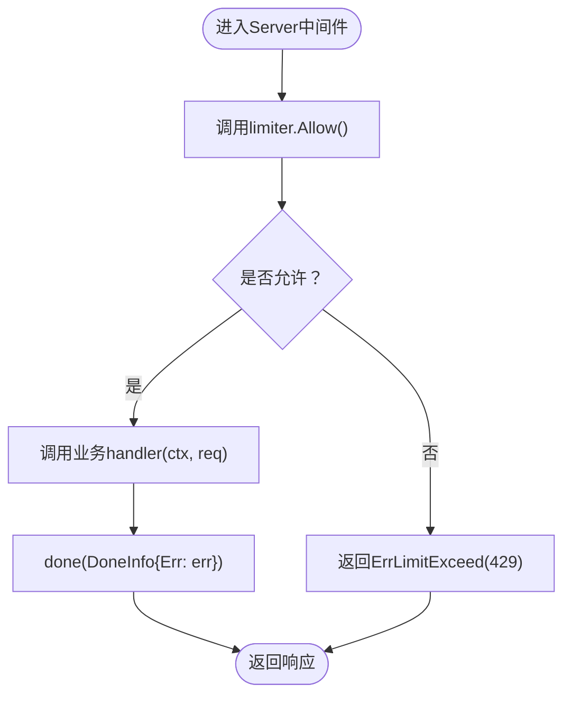
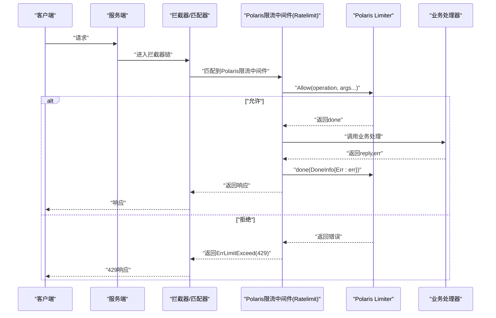
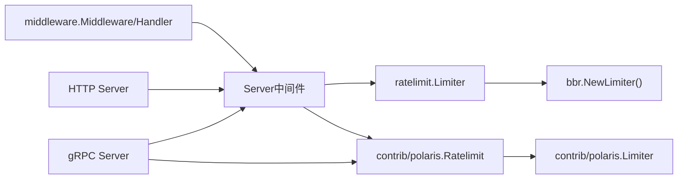

# 限流中间件

<cite>
**本文引用的文件**
- [middleware/ratelimit/ratelimit.go](file://middleware/ratelimit/ratelimit.go)
- [middleware/ratelimit/ratelimit_test.go](file://middleware/ratelimit/ratelimit_test.go)
- [contrib/polaris/limiter.go](file://contrib/polaris/limiter.go)
- [contrib/polaris/ratelimit.go](file://contrib/polaris/ratelimit.go)
- [transport/http/server.go](file://transport/http/server.go)
- [transport/grpc/server.go](file://transport/grpc/server.go)
- [transport/grpc/interceptor.go](file://transport/grpc/interceptor.go)
- [middleware/middleware.go](file://middleware/middleware.go)
- [app.go](file://app.go)
</cite>

## 目录
1. [简介](#简介)
2. [项目结构](#项目结构)
3. [核心组件](#核心组件)
4. [架构总览](#架构总览)
5. [详细组件分析](#详细组件分析)
6. [依赖分析](#依赖分析)
7. [性能考虑](#性能考虑)
8. [故障排查指南](#故障排查指南)
9. [结论](#结论)
10. [附录](#附录)

## 简介
本文件面向Kratos框架的限流中间件，聚焦于middleware/ratelimit包的实现机制，系统性阐述：
- 基于BBR（Bimodal Increase Rate Limiting）算法的限流器设计原理与实现要点
- 令牌桶与并发控制的结合方式
- Server中间件函数的调用流程：WithLimiter选项配置、限流器注入、请求准入控制（Allow）、结果回调（DoneInfo）
- 在HTTP与gRPC传输层中启用限流的实践路径
- 自定义Limiter实现分布式限流的思路（以Polaris为例）
- ErrLimitExceed错误语义与HTTP 429状态码映射关系
- 高并发场景下的性能优化建议与外部限流服务（如Redis）集成可能性

## 项目结构
限流中间件位于middleware/ratelimit目录，核心文件为ratelimit.go；配套测试位于ratelimit_test.go。同时，contrib/polaris提供了基于外部服务（Polaris）的分布式限流实现，可作为自定义Limiter的参考。

图表来源
- [middleware/ratelimit/ratelimit.go](file://middleware/ratelimit/ratelimit.go#L1-L52)
- [transport/http/server.go](file://transport/http/server.go#L1-L200)
- [transport/grpc/server.go](file://transport/grpc/server.go#L1-L200)
- [transport/grpc/interceptor.go](file://transport/grpc/interceptor.go#L1-L130)
- [contrib/polaris/limiter.go](file://contrib/polaris/limiter.go#L1-L106)
- [contrib/polaris/ratelimit.go](file://contrib/polaris/ratelimit.go#L1-L53)
- [app.go](file://app.go#L1-L200)

章节来源
- [middleware/ratelimit/ratelimit.go](file://middleware/ratelimit/ratelimit.go#L1-L52)
- [transport/http/server.go](file://transport/http/server.go#L1-L200)
- [transport/grpc/server.go](file://transport/grpc/server.go#L1-L200)
- [transport/grpc/interceptor.go](file://transport/grpc/interceptor.go#L1-L130)
- [contrib/polaris/limiter.go](file://contrib/polaris/limiter.go#L1-L106)
- [contrib/polaris/ratelimit.go](file://contrib/polaris/ratelimit.go#L1-L53)
- [app.go](file://app.go#L1-L200)

## 核心组件
- 中间件入口：Server(opts ...Option)返回Kratos中间件，用于在HTTP/gRPC服务端链路中插入限流逻辑
- 选项配置：WithLimiter(Limiter)注入自定义限流器，默认使用BBR限流器
- 错误语义：ErrLimitExceed封装HTTP 429“速率限制”错误
- 调用生命周期：Allow()决定准入，handler执行业务，DoneInfo回传结果状态给限流器

章节来源
- [middleware/ratelimit/ratelimit.go](file://middleware/ratelimit/ratelimit.go#L1-L52)
- [middleware/middleware.go](file://middleware/middleware.go#L1-L21)

## 架构总览
下图展示了HTTP与gRPC服务端在接入限流中间件时的整体调用链，以及与分布式限流中间件的关系。

图表来源
- [transport/http/server.go](file://transport/http/server.go#L1-L200)
- [transport/grpc/server.go](file://transport/grpc/server.go#L1-L200)
- [transport/grpc/interceptor.go](file://transport/grpc/interceptor.go#L1-L130)
- [middleware/ratelimit/ratelimit.go](file://middleware/ratelimit/ratelimit.go#L1-L52)
- [contrib/polaris/ratelimit.go](file://contrib/polaris/ratelimit.go#L1-L53)

## 详细组件分析

### 组件A：Server中间件与BBR限流器
- 默认行为：Server默认注入bbr.NewLimiter()，即BBR限流器
- 入口函数：Server(opts...)返回Kratos中间件，内部包装Handler
- 执行流程：
  - 调用limiter.Allow()进行准入判断
  - 若返回错误，则直接返回ErrLimitExceed（HTTP 429）
  - 若允许，则继续调用handler(ctx, req)，并将最终err通过DoneInfo回传给limiter.done()

图表来源
- [middleware/ratelimit/ratelimit.go](file://middleware/ratelimit/ratelimit.go#L1-L52)

章节来源
- [middleware/ratelimit/ratelimit.go](file://middleware/ratelimit/ratelimit.go#L1-L52)

### 组件B：WithLimiter选项与自定义限流器
- WithLimiter(Limiter)用于替换默认BBR限流器
- 测试验证了WithLimiter对options.limiter字段的覆盖行为

章节来源
- [middleware/ratelimit/ratelimit.go](file://middleware/ratelimit/ratelimit.go#L1-L52)
- [middleware/ratelimit/ratelimit_test.go](file://middleware/ratelimit/ratelimit_test.go#L1-L65)

### 组件C：分布式限流中间件（Polaris）
- Polaris提供的Limiter实现通过外部限流服务获取配额
- Ratelimit(l Limiter)中间件从传输上下文提取请求头与查询参数，构造模型参数后调用l.Allow(...)
- 当外部服务返回不允许时，返回ErrLimitExceed(429)

图表来源
- [contrib/polaris/ratelimit.go](file://contrib/polaris/ratelimit.go#L1-L53)
- [contrib/polaris/limiter.go](file://contrib/polaris/limiter.go#L1-L106)

章节来源
- [contrib/polaris/ratelimit.go](file://contrib/polaris/ratelimit.go#L1-L53)
- [contrib/polaris/limiter.go](file://contrib/polaris/limiter.go#L1-L106)

### 组件D：HTTP与gRPC传输层集成
- HTTP服务器：通过NewServer(..., Middleware(...))注入中间件，路由由gorilla/mux承载
- gRPC服务器：通过NewServer(..., Middleware(...), StreamMiddleware(...))注入中间件，拦截器负责将transport上下文注入到请求上下文
- 拦截器在进入业务处理前，会根据操作名匹配中间件链并执行

章节来源
- [transport/http/server.go](file://transport/http/server.go#L1-L200)
- [transport/grpc/server.go](file://transport/grpc/server.go#L1-L200)
- [transport/grpc/interceptor.go](file://transport/grpc/interceptor.go#L1-L130)

## 依赖分析
- 中间件契约：Kratos中间件接口定义Handler与Middleware类型，Server返回的中间件遵循该契约
- 限流器接口：Limiter.Allow()返回done与error；DoneInfo携带Err等信息
- 传输层依赖：HTTP与gRPC均通过匹配器将中间件链注入到请求处理流程

图表来源
- [middleware/middleware.go](file://middleware/middleware.go#L1-L21)
- [middleware/ratelimit/ratelimit.go](file://middleware/ratelimit/ratelimit.go#L1-L52)
- [contrib/polaris/ratelimit.go](file://contrib/polaris/ratelimit.go#L1-L53)
- [transport/http/server.go](file://transport/http/server.go#L1-L200)
- [transport/grpc/server.go](file://transport/grpc/server.go#L1-L200)

章节来源
- [middleware/middleware.go](file://middleware/middleware.go#L1-L21)
- [middleware/ratelimit/ratelimit.go](file://middleware/ratelimit/ratelimit.go#L1-L52)
- [contrib/polaris/ratelimit.go](file://contrib/polaris/ratelimit.go#L1-L53)

## 性能考虑
- 锁竞争规避
  - 限流器内部应尽量避免全局互斥锁；优先采用无锁或低争用的数据结构（例如原子计数、分段锁）
  - 对于需要统计的指标，可采用批量更新或延迟合并策略，减少频繁写入
- 并发控制与令牌桶
  - 将并发请求数与令牌桶容量解耦：并发控制用于保护资源，令牌桶用于平滑突发流量
  - 对于BBR类算法，建议将“拥塞窗口”与“突发容量”分离，避免在高并发下出现过度退避
- 合理设置突发容量
  - 突发容量应与业务峰值QPS、平均RT、实例数量相匹配，避免过小导致误杀，过大导致雪崩
- 外部限流服务集成
  - Redis：适合轻量级分布式限流，但需关注网络抖动与超时重试策略
  - Polaris等集中式限流：具备更丰富的规则与灰度能力，但需评估其可用性与延迟
- 中间件顺序
  - 将限流中间件置于鉴权、日志之后，确保限流统计覆盖真实请求

[本节为通用指导，不直接分析具体文件]

## 故障排查指南
- 429错误与ErrLimitExceed
  - 当limiter.Allow()返回错误时，Server中间件统一转换为ErrLimitExceed，HTTP层映射为429
  - 分布式限流中间件（Polaris）在外部配额不足时也会返回ErrLimitExceed
- 排查步骤
  - 确认限流中间件已正确注入到HTTP/gRPC服务端
  - 检查WithLimiter是否按预期注入自定义限流器
  - 对比限流器的Allow返回值与业务handler执行情况，确认done回调是否被调用
  - 若使用分布式限流，检查外部限流服务的可用性与配额阈值

章节来源
- [middleware/ratelimit/ratelimit.go](file://middleware/ratelimit/ratelimit.go#L1-L52)
- [contrib/polaris/ratelimit.go](file://contrib/polaris/ratelimit.go#L1-L53)
- [middleware/ratelimit/ratelimit_test.go](file://middleware/ratelimit/ratelimit_test.go#L1-L65)

## 结论
- Kratos限流中间件以简洁的Server接口为核心，通过WithLimiter支持灵活替换限流器实现
- 默认采用BBR限流器，兼顾吞吐与稳定性；也可通过自定义Limiter接入分布式限流服务
- 在HTTP与gRPC传输层中，中间件通过匹配器与拦截器无缝集成，形成统一的请求准入控制链路
- ErrLimitExceed与HTTP 429语义一致，便于统一错误处理与可观测性

[本节为总结性内容，不直接分析具体文件]

## 附录

### A. 使用示例（路径指引）
- 在HTTP服务中启用限流中间件
  - 参考路径：[transport/http/server.go](file://transport/http/server.go#L1-L200)
  - 关键点：通过NewServer(..., Middleware(...))注入中间件
- 在gRPC服务中启用限流中间件
  - 参考路径：[transport/grpc/server.go](file://transport/grpc/server.go#L1-L200)、[transport/grpc/interceptor.go](file://transport/grpc/interceptor.go#L1-L130)
  - 关键点：通过NewServer(..., Middleware(...), StreamMiddleware(...))注入中间件；拦截器负责将transport上下文注入
- 自定义Limiter实现分布式限流
  - 参考路径：[contrib/polaris/limiter.go](file://contrib/polaris/limiter.go#L1-L106)、[contrib/polaris/ratelimit.go](file://contrib/polaris/ratelimit.go#L1-L53)
  - 关键点：Ratelimit(l Limiter)中间件从传输上下文提取请求头与查询参数，构造模型参数后调用l.Allow(...)
- 应用启动与服务注册
  - 参考路径：[app.go](file://app.go#L1-L200)
  - 关键点：应用生命周期管理，包含服务启动、停止与注册流程

章节来源
- [transport/http/server.go](file://transport/http/server.go#L1-L200)
- [transport/grpc/server.go](file://transport/grpc/server.go#L1-L200)
- [transport/grpc/interceptor.go](file://transport/grpc/interceptor.go#L1-L130)
- [contrib/polaris/limiter.go](file://contrib/polaris/limiter.go#L1-L106)
- [contrib/polaris/ratelimit.go](file://contrib/polaris/ratelimit.go#L1-L53)
- [app.go](file://app.go#L1-L200)