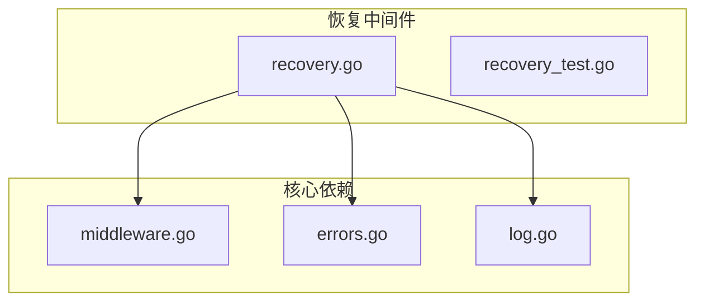
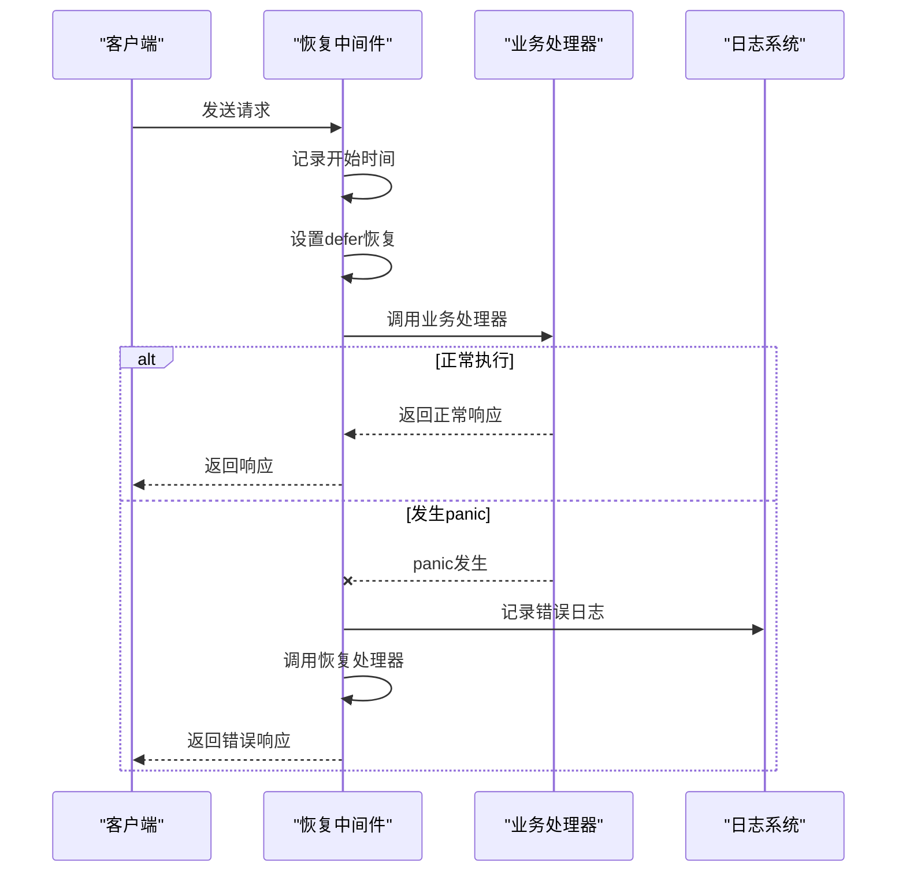
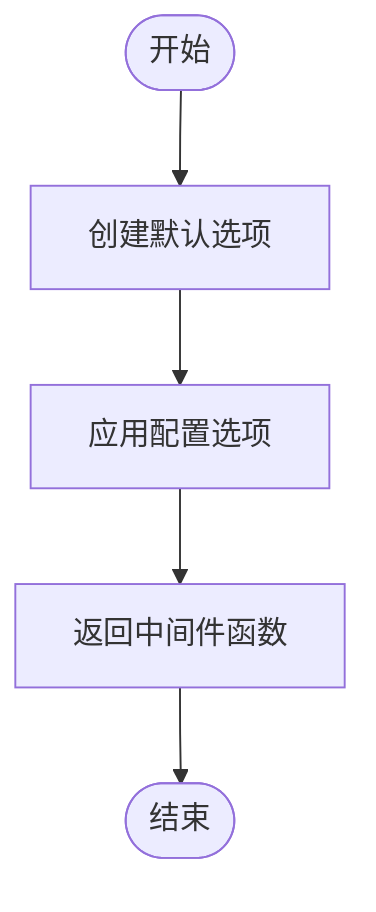
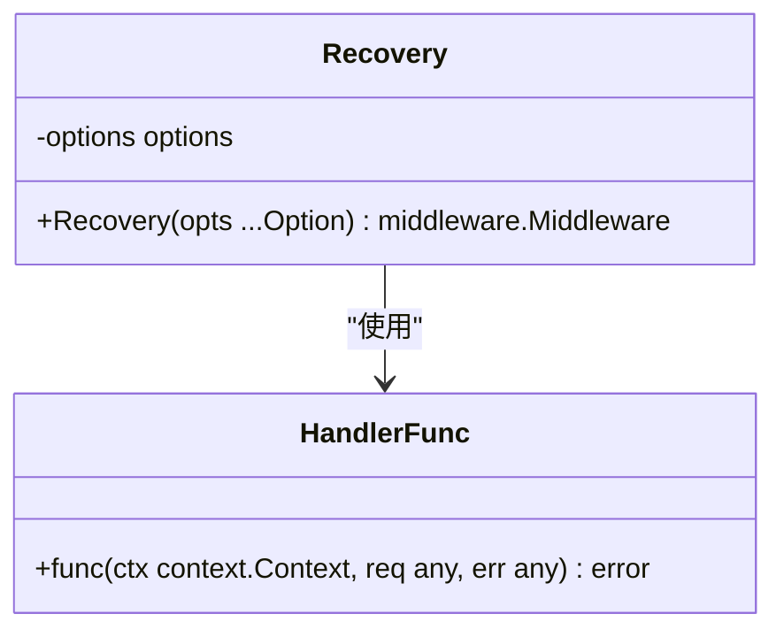
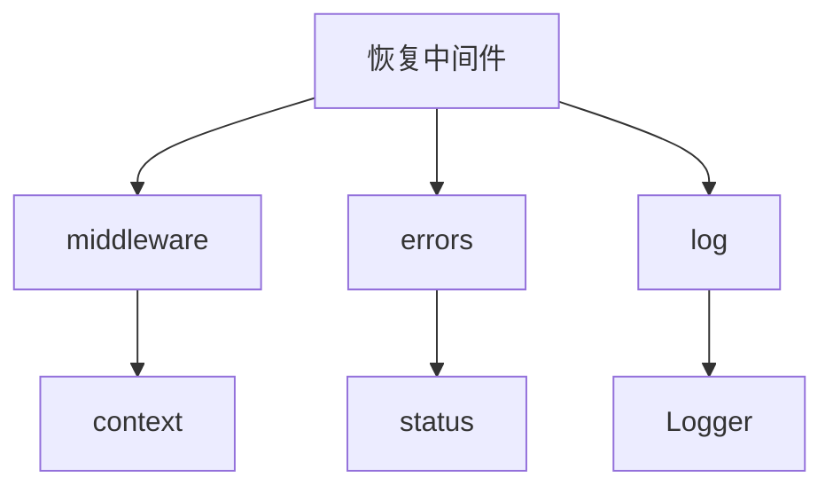

# 恢复中间件

<cite>
**本文档引用的文件**
- [recovery.go](file://middleware/recovery/recovery.go)
- [recovery_test.go](file://middleware/recovery/recovery_test.go)
- [middleware.go](file://middleware/middleware.go)
- [errors.go](file://errors/errors.go)
- [log.go](file://log/log.go)
- [server.go](file://transport/http/server.go)
</cite>

## 目录
1. [简介](#简介)
2. [项目结构](#项目结构)
3. [核心组件](#核心组件)
4. [架构概述](#架构概述)
5. [详细组件分析](#详细组件分析)
6. [依赖分析](#依赖分析)
7. [性能考虑](#性能考虑)
8. [故障排除指南](#故障排除指南)
9. [结论](#结论)

## 简介
恢复中间件是Kratos框架中的关键组件，用于处理服务器在处理请求过程中发生的panic异常。该中间件通过捕获panic并进行优雅处理，确保服务的稳定性和可靠性。本文档详细说明了recovery.go中定义的panic恢复机制，包括HandlerFunc类型的错误处理函数签名、自定义恢复处理器的实现方式、错误日志记录、监控告警和友好的错误响应。同时，文档还提供了配置示例，展示了如何根据不同的错误类型返回相应的HTTP状态码和错误消息，并说明了该中间件在中间件链中的推荐位置和性能影响评估。

## 项目结构
恢复中间件位于middleware/recovery目录下，包含recovery.go和recovery_test.go两个文件。recovery.go定义了核心的恢复机制，而recovery_test.go包含了相关的测试用例。该中间件依赖于框架的其他核心组件，如错误处理(errors)、日志记录(log)和通用中间件(middleware)。

**Diagram sources**
- [recovery.go](file://middleware/recovery/recovery.go#L1-L62)
- [middleware.go](file://middleware/middleware.go#L1-L21)
- [errors.go](file://errors/errors.go#L1-L153)
- [log.go](file://log/log.go#L1-L66)

**Section sources**
- [recovery.go](file://middleware/recovery/recovery.go#L1-L62)
- [recovery_test.go](file://middleware/recovery/recovery_test.go#L1-L42)

## 核心组件
恢复中间件的核心组件包括Recovery函数、HandlerFunc类型、WithHandler选项函数和Latency上下文键。Recovery函数是中间件的入口点，负责创建一个能够捕获panic的中间件实例。HandlerFunc定义了自定义恢复处理器的函数签名，允许用户根据需要定制错误处理逻辑。WithHandler选项函数用于配置自定义的恢复处理器，而Latency上下文键用于在请求上下文中存储请求延迟信息。

**Section sources**
- [recovery.go](file://middleware/recovery/recovery.go#L19-L62)

## 架构概述
恢复中间件的架构设计遵循Kratos框架的中间件模式，通过函数式编程的方式实现。中间件的核心是一个高阶函数，它接收一个处理函数并返回一个新的处理函数，这个新的处理函数包含了panic恢复的逻辑。当请求进入时，中间件会启动一个defer函数，该函数会在函数执行完毕后检查是否有panic发生。如果有panic，中间件会收集相关的堆栈信息，记录错误日志，并调用配置的恢复处理器来生成适当的错误响应。

**Diagram sources**
- [recovery.go](file://middleware/recovery/recovery.go#L46-L62)

## 详细组件分析

### Recovery函数分析
Recovery函数是恢复中间件的核心，它接受一系列选项并返回一个中间件实例。函数首先创建一个默认的选项结构，其中包含一个默认的恢复处理器。然后，它遍历所有提供的选项，应用它们来修改选项结构。最后，它返回一个闭包，这个闭包实现了中间件的逻辑。

**Diagram sources**
- [recovery.go](file://middleware/recovery/recovery.go#L37-L62)

### HandlerFunc类型分析
HandlerFunc类型定义了恢复处理器的函数签名，它接受上下文、请求和错误三个参数，并返回一个错误。这个设计允许恢复处理器访问请求的上下文信息，包括可能存储在上下文中的元数据，同时也能获取到导致panic的原始请求和panic值本身。

**Diagram sources**
- [recovery.go](file://middleware/recovery/recovery.go#L20-L21)

## 依赖分析
恢复中间件依赖于Kratos框架的多个核心组件。它依赖于middleware包来实现中间件模式，依赖于errors包来创建和处理错误，依赖于log包来记录错误日志。这些依赖关系确保了恢复中间件能够与框架的其他部分无缝集成。

**Diagram sources**
- [recovery.go](file://middleware/recovery/recovery.go#L3-L11)

**Section sources**
- [recovery.go](file://middleware/recovery/recovery.go#L1-L62)
- [middleware.go](file://middleware/middleware.go#L1-L21)
- [errors.go](file://errors/errors.go#L1-L153)
- [log.go](file://log/log.go#L1-L66)

## 性能考虑
恢复中间件对性能的影响主要体现在两个方面：正常请求的开销和panic发生时的处理成本。在正常情况下，中间件只是简单地记录开始时间和设置defer函数，这些操作的开销非常小。当panic发生时，中间件需要收集堆栈信息并记录日志，这会产生一定的性能开销。然而，由于panic是异常情况，这种开销在大多数应用场景中是可以接受的。

## 故障排除指南
在使用恢复中间件时，可能会遇到一些常见问题。例如，如果自定义恢复处理器没有正确配置，可能会导致错误信息不够详细。另外，如果日志系统配置不当，可能会导致错误日志无法正确记录。建议在生产环境中使用恢复中间件时，确保配置了适当的日志级别和输出目标。

**Section sources**
- [recovery.go](file://middleware/recovery/recovery.go#L54-L57)
- [recovery_test.go](file://middleware/recovery/recovery_test.go#L21-L27)

## 结论
恢复中间件是Kratos框架中确保服务稳定性的关键组件。通过捕获和处理panic异常，它能够防止服务因未处理的异常而崩溃。中间件的设计灵活，允许用户通过自定义恢复处理器来实现特定的错误处理逻辑。建议在所有生产环境中使用恢复中间件，并将其放置在中间件链的最外层，以确保能够捕获所有可能的panic。