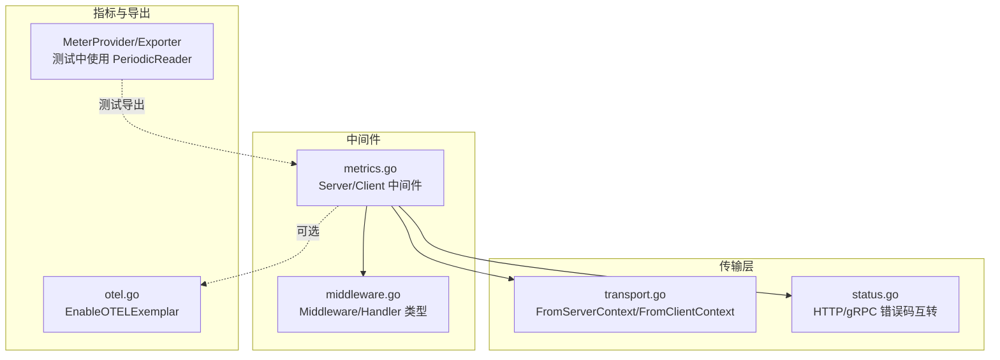
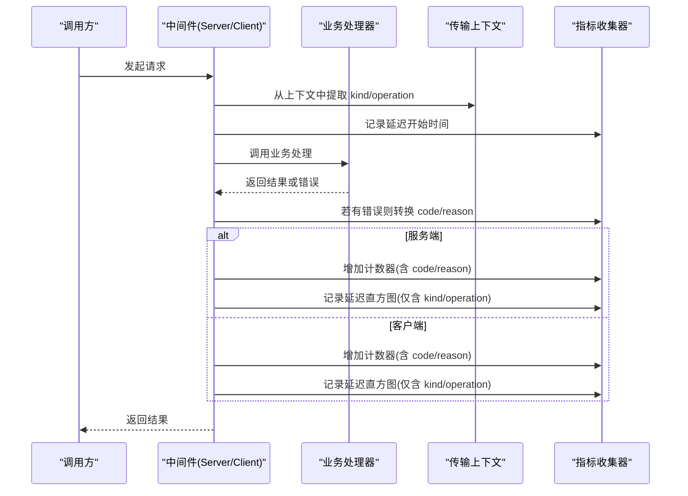
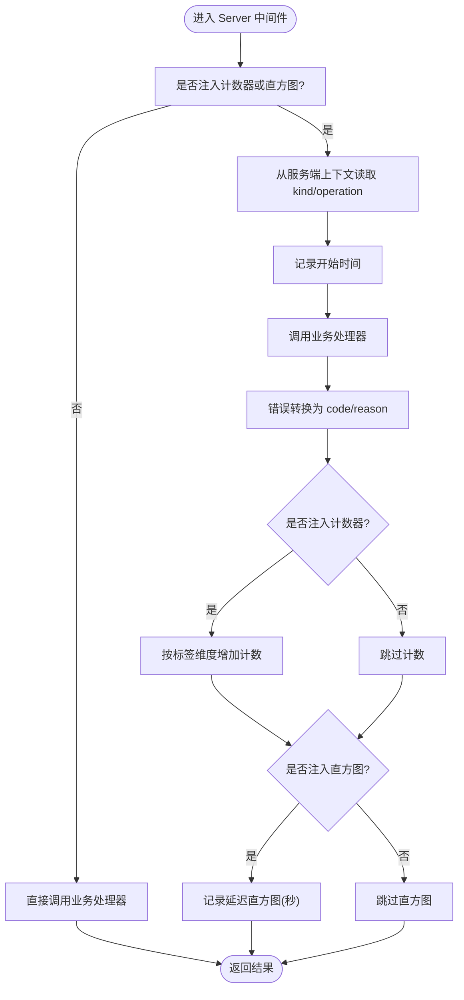
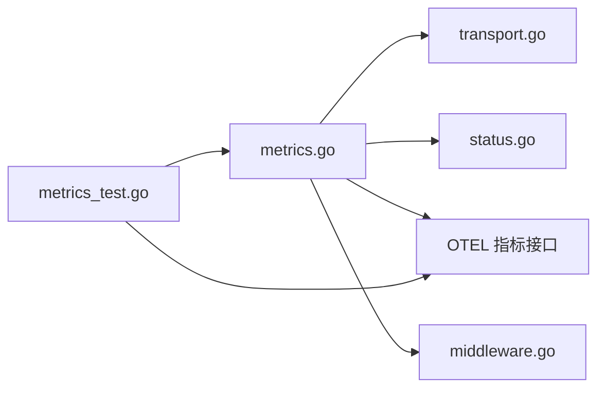

# 指标中间件

<cite>
**本文引用的文件列表**
- [metrics.go](file://middleware/metrics/metrics.go)
- [metrics_test.go](file://middleware/metrics/metrics_test.go)
- [otel.go](file://middleware/metrics/otel.go)
- [middleware.go](file://middleware/middleware.go)
- [transport.go](file://transport/transport.go)
- [status.go](file://transport/http/status/status.go)
</cite>

## 目录
1. [简介](#简介)
2. [项目结构](#项目结构)
3. [核心组件](#核心组件)
4. [架构总览](#架构总览)
5. [详细组件分析](#详细组件分析)
6. [依赖关系分析](#依赖关系分析)
7. [性能考量](#性能考量)
8. [故障排查指南](#故障排查指南)
9. [结论](#结论)
10. [附录](#附录)

## 简介
本文件深入解析 Kratos 指标中间件的指标收集机制，覆盖服务端与客户端两种模式。默认会采集两类指标：
- 请求计数器：<client/server>_requests_code_total，标签维度为 kind、operation、code、reason
- 请求延迟直方图：<client/server>_requests_seconds_bucket，标签维度为 kind、operation

中间件支持通过 WithRequests 和 WithSeconds 注入选项，注入自定义指标收集器；同时提供默认的 Int64Counter 与 Float64Histogram 构造函数及直方图视图配置，便于与 OpenTelemetry 生态集成。测试用例展示了在正常响应与错误情况下指标记录的行为。

## 项目结构
指标中间件位于 middleware/metrics 目录，核心文件如下：
- metrics.go：指标中间件实现、默认指标构造与直方图视图
- metrics_test.go：单元测试，验证指标标签、错误码映射、OTEL 集成
- otel.go：启用 OTEL 示例（Exemplars）
- middleware.go：中间件通用类型定义
- transport.go：传输层上下文读取工具（服务端/客户端）
- status.go：HTTP 与 gRPC 错误码互转

图表来源
- [metrics.go](file://middleware/metrics/metrics.go#L1-L211)
- [middleware.go](file://middleware/middleware.go#L1-L22)
- [transport.go](file://transport/transport.go#L1-L96)
- [status.go](file://transport/http/status/status.go#L1-L113)
- [otel.go](file://middleware/metrics/otel.go#L1-L8)
- [metrics_test.go](file://middleware/metrics/metrics_test.go#L67-L90)

章节来源
- [metrics.go](file://middleware/metrics/metrics.go#L1-L211)
- [middleware.go](file://middleware/middleware.go#L1-L22)
- [transport.go](file://transport/transport.go#L1-L96)
- [status.go](file://transport/http/status/status.go#L1-L113)
- [otel.go](file://middleware/metrics/otel.go#L1-L8)
- [metrics_test.go](file://middleware/metrics/metrics_test.go#L67-L90)

## 核心组件
- 选项注入
  - WithRequests：注入自定义 Int64Counter
  - WithSeconds：注入自定义 Float64Histogram
- 默认指标构造
  - DefaultRequestsCounter：返回 Int64Counter，单位为 {call}
  - DefaultSecondsHistogram：返回 Float64Histogram，单位为 s，显式桶边界
  - DefaultSecondsHistogramView：返回直方图视图，用于 MeterProvider 视图注册
- 中间件入口
  - Server：服务端中间件
  - Client：客户端中间件
- 标签维度
  - kind：传输类型（http/grpc 字符串）
  - operation：操作名（如 /pkg.Service/Method）
  - code：错误码（整数），来自错误转换
  - reason：错误原因字符串（来自业务错误对象）

章节来源
- [metrics.go](file://middleware/metrics/metrics.go#L35-L92)
- [metrics.go](file://middleware/metrics/metrics.go#L101-L211)

## 架构总览
下图展示服务端与客户端中间件在一次请求中的调用链与指标记录时机。

图表来源
- [metrics.go](file://middleware/metrics/metrics.go#L101-L211)
- [transport.go](file://transport/transport.go#L75-L95)
- [status.go](file://transport/http/status/status.go#L1-L113)

## 详细组件分析

### 服务端中间件（Server）
- 控制流
  - 若未注入任何指标收集器，则直接透传调用
  - 从服务端传输上下文读取 kind 与 operation
  - 记录开始时间
  - 执行业务处理器
  - 将错误转换为 code 与 reason
  - 若注入了计数器，则按标签维度增加计数
  - 若注入了直方图，则记录延迟（秒）
- 标签维度
  - kind、operation 来自传输上下文
  - code 来自错误转换
  - reason 来自业务错误对象
- 错误码转换
  - 默认 code 使用 gRPC OK
  - 若返回错误为业务错误对象，则使用其 Code 与 Reason

图表来源
- [metrics.go](file://middleware/metrics/metrics.go#L101-L157)
- [transport.go](file://transport/transport.go#L75-L95)
- [status.go](file://transport/http/status/status.go#L1-L113)

章节来源
- [metrics.go](file://middleware/metrics/metrics.go#L101-L157)

### 客户端中间件（Client）
- 控制流与服务端类似，但读取的是客户端传输上下文
- 标签维度相同：kind、operation、code、reason
- 计数器与直方图均按相同规则记录

图表来源
- [metrics.go](file://middleware/metrics/metrics.go#L159-L211)
- [transport.go](file://transport/transport.go#L75-L95)
- [status.go](file://transport/http/status/status.go#L1-L113)

章节来源
- [metrics.go](file://middleware/metrics/metrics.go#L159-L211)

### 指标与标签维度
- 默认指标名称
  - 服务端计数器：<server_requests_code_total>
  - 服务端延迟直方图：<server_requests_seconds_bucket>
  - 客户端计数器：<client_requests_code_total>
  - 客户端延迟直方图：<client_requests_seconds_bucket>
- 标签维度
  - kind：传输类型（http/grpc）
  - operation：服务全限定方法名
  - code：错误码（整数）
  - reason：错误原因字符串（业务错误对象）

章节来源
- [metrics.go](file://middleware/metrics/metrics.go#L18-L30)
- [metrics.go](file://middleware/metrics/metrics.go#L94-L99)

### 自定义指标收集器注入
- WithRequests：注入 Int64Counter，用于计数器
- WithSeconds：注入 Float64Histogram，用于延迟直方图
- 默认构造器
  - DefaultRequestsCounter：创建计数器并设置单位为 {call}
  - DefaultSecondsHistogram：创建直方图并设置单位为 s，以及显式桶边界
  - DefaultSecondsHistogramView：返回视图，用于 MeterProvider 的视图注册，确保直方图聚合使用指定桶边界

章节来源
- [metrics.go](file://middleware/metrics/metrics.go#L35-L92)

### 错误码转换逻辑
- 默认 code 使用 gRPC OK
- 若返回错误为业务错误对象，则使用其 Code 与 Reason
- HTTP/gRPC 错误码互转由 status 包提供，用于在不同传输层之间保持一致的错误语义

章节来源
- [metrics.go](file://middleware/metrics/metrics.go#L121-L133)
- [status.go](file://transport/http/status/status.go#L1-L113)

### 指标记录时机与延迟计算
- 记录时机
  - 业务处理器执行后立即进行错误转换
  - 若注入计数器：立即按标签维度增加计数
  - 若注入直方图：记录从开始到结束的耗时（秒）
- 延迟计算
  - 使用开始时间与当前时间差计算秒级延迟
  - 单位为秒，直方图单位也为 s

章节来源
- [metrics.go](file://middleware/metrics/metrics.go#L124-L153)
- [metrics.go](file://middleware/metrics/metrics.go#L177-L206)

### 与 Prometheus 等监控系统的集成
- 测试中展示了如何通过 OTEL SDK 的 MeterProvider 与 PeriodicReader 导出指标，这同样适用于 Prometheus 导出器
- 可以通过以下步骤集成：
  - 创建 MeterProvider 并注册直方图视图（使用 DefaultSecondsHistogramView）
  - 设置 PeriodicReader 或 Prometheus Exporter Reader
  - 在应用启动时初始化 OTEL Provider
- 启用 OTEL 示例（Exemplars）
  - 提供 EnableOTELExemplar 辅助函数，设置环境变量以启用示例追踪

章节来源
- [metrics_test.go](file://middleware/metrics/metrics_test.go#L67-L90)
- [otel.go](file://middleware/metrics/otel.go#L1-L8)

## 依赖关系分析
- 组件耦合
  - 中间件依赖传输上下文读取工具（服务端/客户端）
  - 错误转换依赖业务错误对象与 HTTP/gRPC 错误码互转
  - 指标收集依赖 OTEL 指标接口（Int64Counter、Float64Histogram）
- 外部依赖
  - OTEL SDK（meter、metric、sdk/metric）
  - Kratos 错误包与传输层

图表来源
- [metrics.go](file://middleware/metrics/metrics.go#L1-L211)
- [transport.go](file://transport/transport.go#L1-L96)
- [status.go](file://transport/http/status/status.go#L1-L113)
- [middleware.go](file://middleware/middleware.go#L1-L22)
- [metrics_test.go](file://middleware/metrics/metrics_test.go#L67-L90)

章节来源
- [metrics.go](file://middleware/metrics/metrics.go#L1-L211)
- [transport.go](file://transport/transport.go#L1-L96)
- [status.go](file://transport/http/status/status.go#L1-L113)
- [middleware.go](file://middleware/middleware.go#L1-L22)
- [metrics_test.go](file://middleware/metrics/metrics_test.go#L67-L90)

## 性能考量
- 指标记录开销
  - 计数器与直方图均为轻量级操作，通常不会成为瓶颈
  - 建议仅在需要时注入指标收集器，避免不必要的指标写入
- 标签基数控制
  - operation 与 kind 为有限集合，建议限制 operation 的动态值数量
  - code 与 reason 为业务可控，建议统一枚举与归一化策略
- 直方图桶边界
  - 默认桶边界针对常见延迟分布优化，可根据业务场景调整
- 导出频率
  - 在高并发场景下，合理设置导出周期，避免阻塞业务线程

## 故障排查指南
- 指标未出现
  - 确认已注入计数器或直方图
  - 确认 MeterProvider 已正确初始化并注册直方图视图
  - 检查导出器是否可用且运行正常
- 标签缺失
  - 确认传输上下文已正确设置（服务端/客户端）
  - 确认 operation 与 kind 能被正确提取
- 错误码不正确
  - 确认返回错误是否为业务错误对象
  - 检查 HTTP/gRPC 错误码互转逻辑
- 延迟异常
  - 确认开始时间记录位置正确
  - 检查是否在业务处理前后均发生错误导致提前返回

章节来源
- [metrics.go](file://middleware/metrics/metrics.go#L101-L211)
- [metrics_test.go](file://middleware/metrics/metrics_test.go#L136-L256)
- [transport.go](file://transport/transport.go#L75-L95)
- [status.go](file://transport/http/status/status.go#L1-L113)

## 结论
Kratos 指标中间件提供了简洁而强大的指标采集能力，默认支持服务端与客户端两种模式，标签维度清晰，错误码转换完善。通过 WithRequests 与 WithSeconds 可灵活注入自定义指标收集器，并结合 OTEL SDK 与直方图视图，可无缝对接 Prometheus 等监控系统。测试用例覆盖了正常与错误路径下的指标记录行为，便于验证与扩展。

## 附录
- 配置自定义指标收集器的参考路径
  - 注入计数器：[WithRequests](file://middleware/metrics/metrics.go#L35-L40)
  - 注入直方图：[WithSeconds](file://middleware/metrics/metrics.go#L42-L48)
  - 默认计数器构造：[DefaultRequestsCounter](file://middleware/metrics/metrics.go#L50-L55)
  - 默认直方图构造：[DefaultSecondsHistogram](file://middleware/metrics/metrics.go#L57-L66)
  - 直方图视图注册：[DefaultSecondsHistogramView](file://middleware/metrics/metrics.go#L68-L92)
  - 服务端中间件：[Server](file://middleware/metrics/metrics.go#L101-L157)
  - 客户端中间件：[Client](file://middleware/metrics/metrics.go#L159-L211)
  - OTEL 示例（Exemplars）：[EnableOTELExemplar](file://middleware/metrics/otel.go#L1-L8)
  - 测试导出器与视图注册：[metrics_test.go 初始化](file://middleware/metrics/metrics_test.go#L67-L90)
- 测试用例参考路径
  - 验证 WithRequests 注入：[TestWithRequests](file://middleware/metrics/metrics_test.go#L92-L113)
  - 验证 WithSeconds 注入：[TestWithSeconds](file://middleware/metrics/metrics_test.go#L114-L134)
  - 服务端指标记录（含错误与正常）：[TestServer](file://middleware/metrics/metrics_test.go#L136-L196)
  - 客户端指标记录（含错误与正常）：[TestClient](file://middleware/metrics/metrics_test.go#L198-L256)