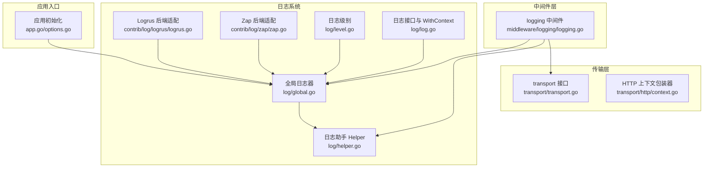
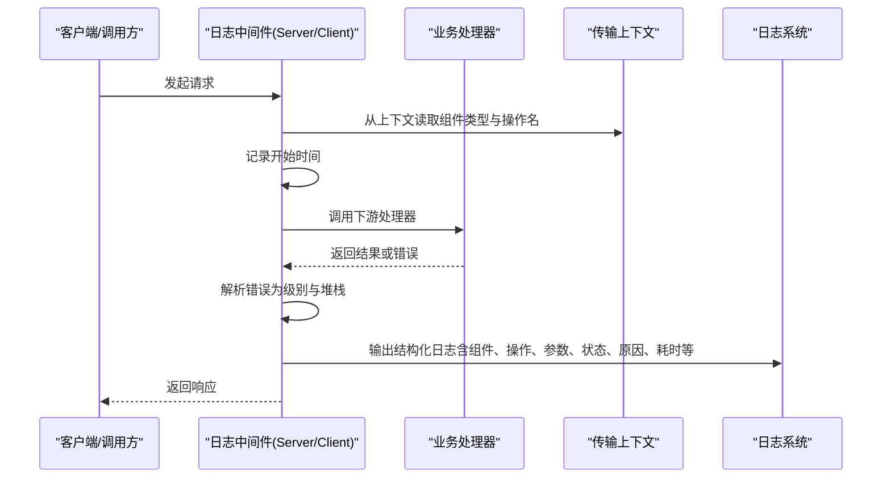
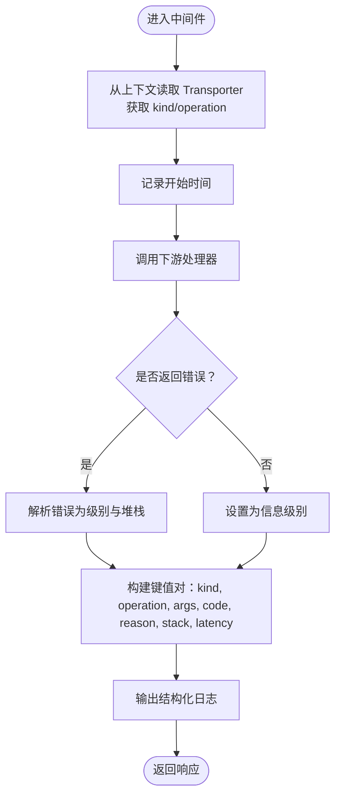
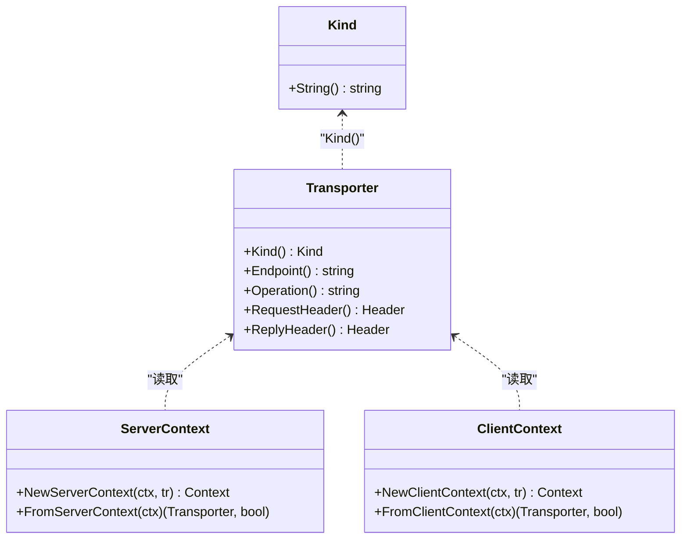
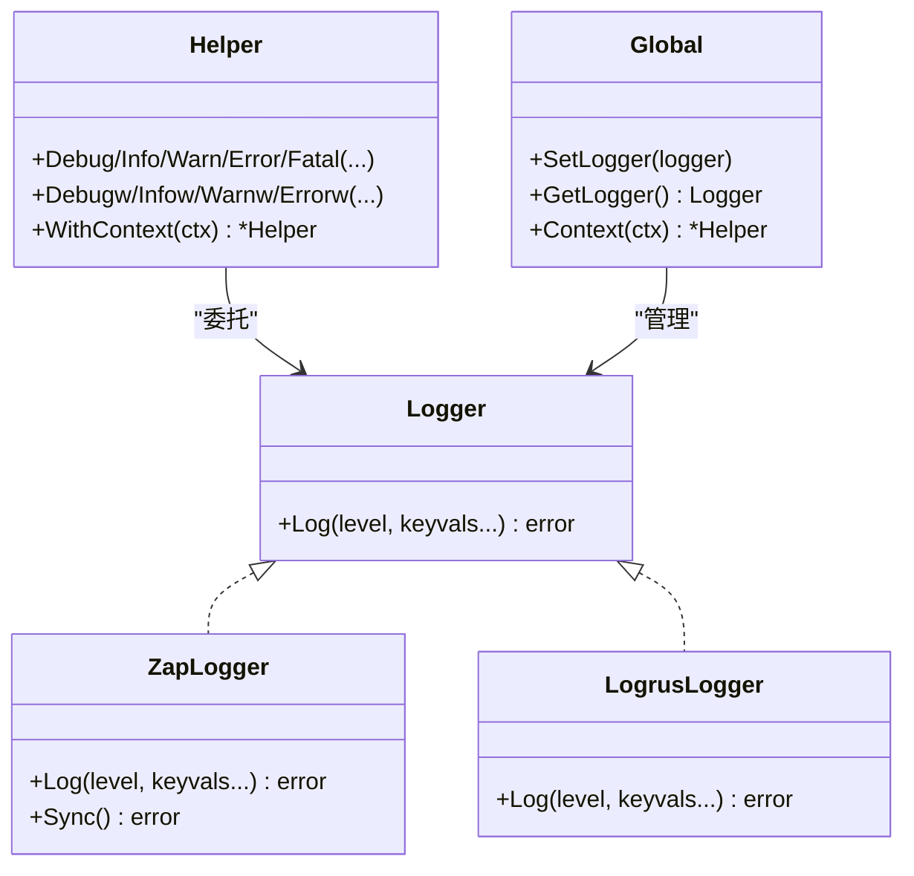
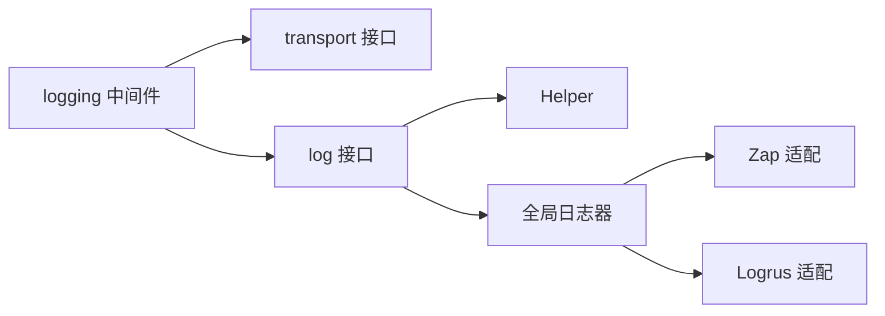

# 日志中间件

<cite>
**本文引用的文件**
- [middleware/logging/logging.go](file://middleware/logging/logging.go)
- [middleware/logging/logging_test.go](file://middleware/logging/logging_test.go)
- [transport/transport.go](file://transport/transport.go)
- [transport/http/context.go](file://transport/http/context.go)
- [log/log.go](file://log/log.go)
- [log/global.go](file://log/global.go)
- [log/helper.go](file://log/helper.go)
- [log/level.go](file://log/level.go)
- [contrib/log/zap/zap.go](file://contrib/log/zap/zap.go)
- [contrib/log/logrus/logrus.go](file://contrib/log/logrus/logrus.go)
- [app.go](file://app.go)
- [options.go](file://options.go)
</cite>

## 目录
1. [简介](#简介)
2. [项目结构](#项目结构)
3. [核心组件](#核心组件)
4. [架构总览](#架构总览)
5. [详细组件分析](#详细组件分析)
6. [依赖关系分析](#依赖关系分析)
7. [性能考量](#性能考量)
8. [故障排查指南](#故障排查指南)
9. [结论](#结论)
10. [附录](#附录)

## 简介
本文件系统性阐述 Kratos 框架中“日志中间件”的实现与使用，重点覆盖以下方面：
- 结构化日志记录：以键值对形式输出日志，包含时间戳、级别、组件类型、操作名、请求参数、状态码、原因、调用栈、耗时等字段。
- 上下文信息自动注入：从传输上下文中提取组件类型（HTTP/GRPC）与操作名（如服务全限定方法），并将其注入到日志中。
- 请求生命周期日志：在请求开始、处理完成、错误发生时分别记录日志，确保可观测性。
- 与 Kratos 日志系统集成：支持全局日志器、上下文日志器、日志级别、消息键等统一接口；兼容多种后端（Zap、Logrus 等）。
- 扩展能力：自定义日志格式与过滤器，通过示例展示中间件在实际请求处理中的日志输出效果。

## 项目结构
日志中间件位于 middleware/logging，围绕 Kratos 的中间件与传输层协作，结合日志子系统实现结构化日志输出。

图表来源
- [middleware/logging/logging.go](file://middleware/logging/logging.go#L1-L120)
- [transport/transport.go](file://transport/transport.go#L1-L96)
- [transport/http/context.go](file://transport/http/context.go#L1-L188)
- [log/global.go](file://log/global.go#L1-L130)
- [log/helper.go](file://log/helper.go#L1-L189)
- [log/log.go](file://log/log.go#L1-L66)
- [log/level.go](file://log/level.go#L1-L61)
- [contrib/log/zap/zap.go](file://contrib/log/zap/zap.go#L1-L81)
- [contrib/log/logrus/logrus.go](file://contrib/log/logrus/logrus.go#L1-L73)
- [app.go](file://app.go#L1-L213)
- [options.go](file://options.go#L1-L130)

章节来源
- [middleware/logging/logging.go](file://middleware/logging/logging.go#L1-L120)
- [transport/transport.go](file://transport/transport.go#L1-L96)
- [transport/http/context.go](file://transport/http/context.go#L1-L188)
- [log/global.go](file://log/global.go#L1-L130)
- [log/helper.go](file://log/helper.go#L1-L189)
- [log/log.go](file://log/log.go#L1-L66)
- [log/level.go](file://log/level.go#L1-L61)
- [contrib/log/zap/zap.go](file://contrib/log/zap/zap.go#L1-L81)
- [contrib/log/logrus/logrus.go](file://contrib/log/logrus/logrus.go#L1-L73)
- [app.go](file://app.go#L1-L213)
- [options.go](file://options.go#L1-L130)

## 核心组件
- 日志中间件（Server/Client）
  - 在请求进入前记录开始时间，在处理完成后根据错误情况决定日志级别，并输出结构化字段。
  - 从传输上下文读取组件类型与操作名，用于区分 HTTP/GRPC 与具体方法。
- 传输上下文
  - 提供 FromServerContext/FromClientContext 从上下文中提取 Transporter，从而获取 Kind 与 Operation。
- Kratos 日志系统
  - 全局日志器、Helper、With/WithContext、日志级别枚举与字符串映射。
- 后端适配
  - Zap 与 Logrus 的 Logger 实现，将键值对转换为对应后端的字段。

章节来源
- [middleware/logging/logging.go](file://middleware/logging/logging.go#L1-L120)
- [transport/transport.go](file://transport/transport.go#L1-L96)
- [log/global.go](file://log/global.go#L1-L130)
- [log/helper.go](file://log/helper.go#L1-L189)
- [log/log.go](file://log/log.go#L1-L66)
- [log/level.go](file://log/level.go#L1-L61)
- [contrib/log/zap/zap.go](file://contrib/log/zap/zap.go#L1-L81)
- [contrib/log/logrus/logrus.go](file://contrib/log/logrus/logrus.go#L1-L73)

## 架构总览
日志中间件在请求生命周期内扮演“横切关注点”，在处理前后统一输出结构化日志。其关键流程如下：

图表来源
- [middleware/logging/logging.go](file://middleware/logging/logging.go#L1-L120)
- [transport/transport.go](file://transport/transport.go#L1-L96)
- [log/helper.go](file://log/helper.go#L1-L189)
- [log/log.go](file://log/log.go#L1-L66)

## 详细组件分析

### 日志中间件（Server/Client）
- 功能要点
  - 统一记录“开始时间”、“组件类型(kind)”、“操作名(operation)”、“请求参数(args)”、“状态码(code)”、“原因(reason)”、“调用栈(stack)”、“耗时(latency)”。
  - 错误时以错误级别输出，成功时以信息级别输出。
  - 支持 Redacter 接口对请求参数进行脱敏输出。
- 关键实现路径
  - 中间件函数与字段注入：[middleware/logging/logging.go](file://middleware/logging/logging.go#L1-L120)
  - 参数提取策略（Redacter/Stringer/默认）：[middleware/logging/logging.go](file://middleware/logging/logging.go#L102-L111)
  - 错误级别与堆栈提取：[middleware/logging/logging.go](file://middleware/logging/logging.go#L113-L120)
- 测试验证
  - HTTP 场景（成功/失败）、参数提取策略、调用者位置一致性等：[middleware/logging/logging_test.go](file://middleware/logging/logging_test.go#L1-L236)

图表来源
- [middleware/logging/logging.go](file://middleware/logging/logging.go#L1-L120)

章节来源
- [middleware/logging/logging.go](file://middleware/logging/logging.go#L1-L120)
- [middleware/logging/logging_test.go](file://middleware/logging/logging_test.go#L1-L236)

### 传输上下文与元数据提取
- 传输接口
  - Transporter 定义 Kind、Endpoint、Operation、Header 等能力；Kind 包含 HTTP/GRPC。
  - 提供 NewServerContext/NewClientContext 与 FromServerContext/FromClientContext 用于上下文存取。
- HTTP 上下文包装器
  - 提供 Middleware 链接入口，按路由匹配中间件链。
- 在中间件中的使用
  - 通过 transport.FromServerContext/transport.FromClientContext 获取 Transporter，读取 Kind 与 Operation。

图表来源
- [transport/transport.go](file://transport/transport.go#L1-L96)
- [transport/http/context.go](file://transport/http/context.go#L1-L188)

章节来源
- [transport/transport.go](file://transport/transport.go#L1-L96)
- [transport/http/context.go](file://transport/http/context.go#L1-L188)

### Kratos 日志系统与后端集成
- 全局日志器
  - 提供 SetLogger/GetLogger，支持运行时替换日志器。
  - 提供 Context 方法，基于上下文生成 Helper。
- 日志助手 Helper
  - 提供 Debug/Info/Warn/Error/Fatal 及带键值对的 w 版本方法。
  - 支持 WithContext 切换上下文。
- 日志接口与上下文增强
  - Logger 接口统一 Log(level, keyvals...)。
  - With/WithContext 支持前缀字段与上下文 Valuer。
- 日志级别
  - Level 枚举与字符串映射，便于序列化与过滤。
- 后端适配
  - Zap：将 keyvals 转换为 zap.Field，按级别输出。
  - Logrus：将 keyvals 转换为 logrus.Fields，按级别输出。

图表来源
- [log/log.go](file://log/log.go#L1-L66)
- [log/global.go](file://log/global.go#L1-L130)
- [log/helper.go](file://log/helper.go#L1-L189)
- [log/level.go](file://log/level.go#L1-L61)
- [contrib/log/zap/zap.go](file://contrib/log/zap/zap.go#L1-L81)
- [contrib/log/logrus/logrus.go](file://contrib/log/logrus/logrus.go#L1-L73)

章节来源
- [log/log.go](file://log/log.go#L1-L66)
- [log/global.go](file://log/global.go#L1-L130)
- [log/helper.go](file://log/helper.go#L1-L189)
- [log/level.go](file://log/level.go#L1-L61)
- [contrib/log/zap/zap.go](file://contrib/log/zap/zap.go#L1-L81)
- [contrib/log/logrus/logrus.go](file://contrib/log/logrus/logrus.go#L1-L73)

### 应用初始化与日志器设置
- 应用启动时可通过选项设置全局日志器，随后所有日志输出均走该日志器。
- 通过 WithContext 可为特定上下文注入字段（如 trace-id），实现跨模块统一追踪。

章节来源
- [app.go](file://app.go#L1-L213)
- [options.go](file://options.go#L1-L130)
- [log/global.go](file://log/global.go#L1-L130)

## 依赖关系分析
- 中间件依赖
  - 依赖 transport 接口读取组件类型与操作名。
  - 依赖 log 接口输出结构化日志。
- 日志系统内部
  - Helper 委托 Logger；With/WithContext 提供上下文增强。
  - 全局日志器可被替换，影响所有子日志器。
- 后端适配
  - Zap/Logrus 实现 Logger 接口，将键值对映射为各自字段。

图表来源
- [middleware/logging/logging.go](file://middleware/logging/logging.go#L1-L120)
- [transport/transport.go](file://transport/transport.go#L1-L96)
- [log/log.go](file://log/log.go#L1-L66)
- [log/helper.go](file://log/helper.go#L1-L189)
- [log/global.go](file://log/global.go#L1-L130)
- [contrib/log/zap/zap.go](file://contrib/log/zap/zap.go#L1-L81)
- [contrib/log/logrus/logrus.go](file://contrib/log/logrus/logrus.go#L1-L73)

章节来源
- [middleware/logging/logging.go](file://middleware/logging/logging.go#L1-L120)
- [transport/transport.go](file://transport/transport.go#L1-L96)
- [log/log.go](file://log/log.go#L1-L66)
- [log/helper.go](file://log/helper.go#L1-L189)
- [log/global.go](file://log/global.go#L1-L130)
- [contrib/log/zap/zap.go](file://contrib/log/zap/zap.go#L1-L81)
- [contrib/log/logrus/logrus.go](file://contrib/log/logrus/logrus.go#L1-L73)

## 性能考量
- 时间开销
  - 中间件仅在处理前后进行一次时间采样与一次日志写入，开销极低。
- 字符串格式化
  - 参数提取优先采用 Redacter/Stringer，避免不必要的反射格式化。
- 后端选择
  - Zap/Logrus 均支持按级别过滤，建议在生产环境开启相应级别阈值，减少无效日志输出。
- 上下文字段
  - 使用 WithContext 注入字段时，尽量控制字段数量与大小，避免过度膨胀日志体积。

## 故障排查指南
- 日志未输出
  - 检查是否设置了全局日志器（应用启动时通过选项设置）。
  - 检查日志级别是否高于当前输出级别。
- 字段缺失
  - 确认请求参数实现了 Redacter 或 Stringer 接口，否则将回退到默认格式。
- 调用栈为空
  - 错误为空时不会输出堆栈字段，属预期行为。
- 上下文未注入 TraceId
  - 使用 WithContext 注入字段，并确保在日志器上启用该字段。

章节来源
- [log/global.go](file://log/global.go#L1-L130)
- [log/helper.go](file://log/helper.go#L1-L189)
- [middleware/logging/logging.go](file://middleware/logging/logging.go#L1-L120)

## 结论
日志中间件通过统一的结构化输出与上下文元数据注入，为 Kratos 应用提供了清晰、一致且可扩展的日志能力。配合全局日志器与多种后端适配，可在不同环境下灵活落地。建议在生产环境中：
- 明确日志级别与过滤策略；
- 对敏感参数实现 Redacter；
- 使用 WithContext 注入统一追踪字段；
- 在中间件链中合理放置日志中间件，确保覆盖关键路径。

## 附录

### 日志条目标准格式
- 字段清单（键名均为字符串，值为任意类型）
  - kind：组件类型（"server"/"client"）
  - component：传输组件类型（"http"/"grpc"）
  - operation：操作名（如服务全限定方法）
  - args：请求参数（经 Redacter/Stringer/默认格式化）
  - code：状态码（整型）
  - reason：错误原因（字符串）
  - stack：错误堆栈（字符串，错误时输出）
  - latency：耗时（秒，浮点数）

章节来源
- [middleware/logging/logging.go](file://middleware/logging/logging.go#L1-L120)

### 与 Kratos 日志系统集成步骤
- 设置全局日志器
  - 在应用启动时通过选项设置日志器，随后所有日志输出将走该实现。
- 使用上下文日志器
  - 通过 WithContext 为特定上下文注入字段（如 trace-id），再输出日志。
- 选择后端
  - 使用 Zap 或 Logrus 的适配器实现 Logger 接口，无缝替换后端。

章节来源
- [app.go](file://app.go#L1-L213)
- [options.go](file://options.go#L1-L130)
- [log/log.go](file://log/log.go#L1-L66)
- [log/global.go](file://log/global.go#L1-L130)
- [contrib/log/zap/zap.go](file://contrib/log/zap/zap.go#L1-L81)
- [contrib/log/logrus/logrus.go](file://contrib/log/logrus/logrus.go#L1-L73)

### 自定义日志格式与过滤器
- 自定义格式
  - 通过实现 Logger 接口，将键值对映射为自定义格式（如 JSON、CSV）。
- 过滤器
  - 使用日志系统提供的过滤能力（如按级别过滤），或在自定义 Logger 中实现过滤逻辑。
- 示例参考
  - 测试用例展示了参数提取策略与调用者位置一致性校验，可作为扩展自定义日志器的参考。

章节来源
- [middleware/logging/logging_test.go](file://middleware/logging/logging_test.go#L1-L236)
- [log/helper.go](file://log/helper.go#L1-L189)
- [log/log.go](file://log/log.go#L1-L66)