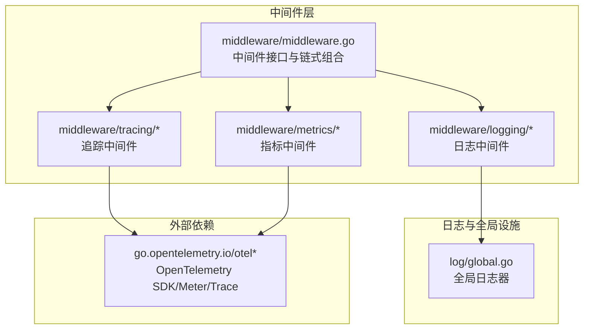
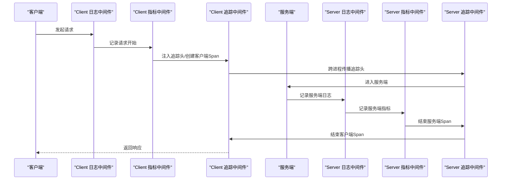
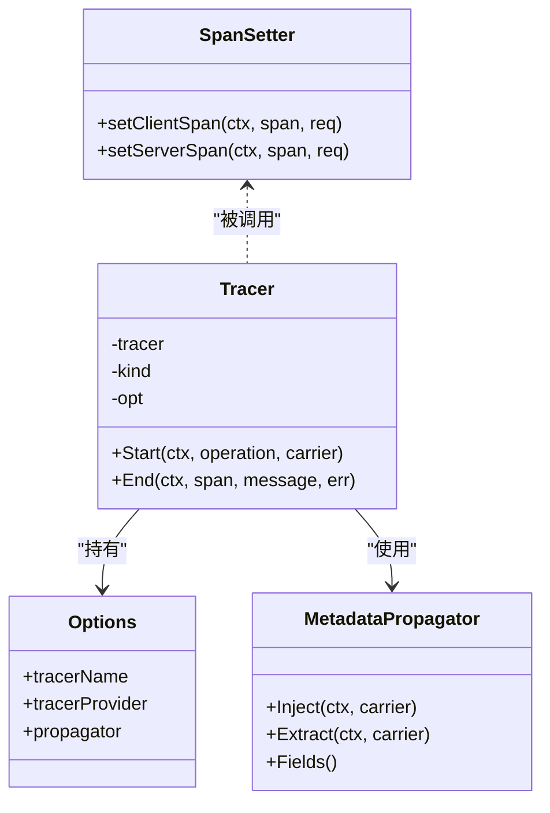
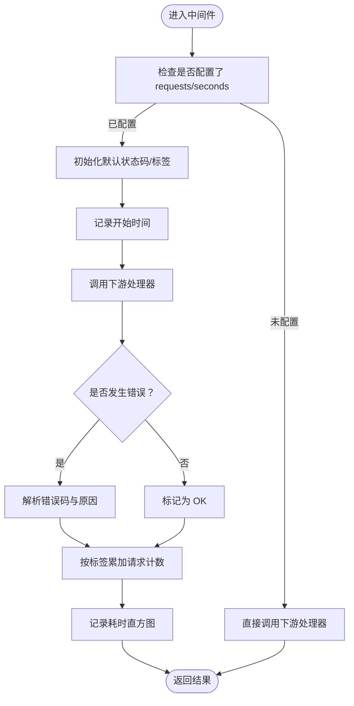
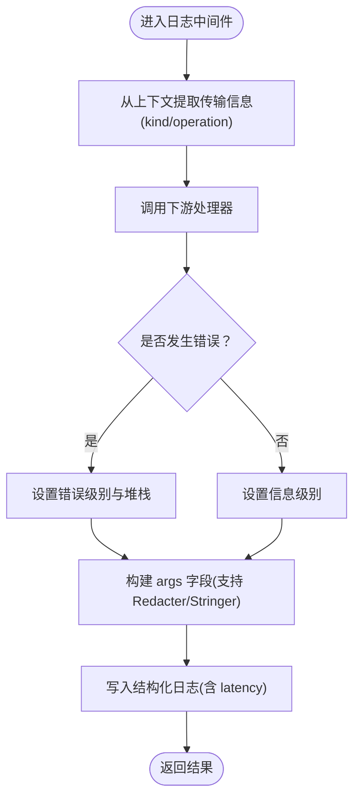
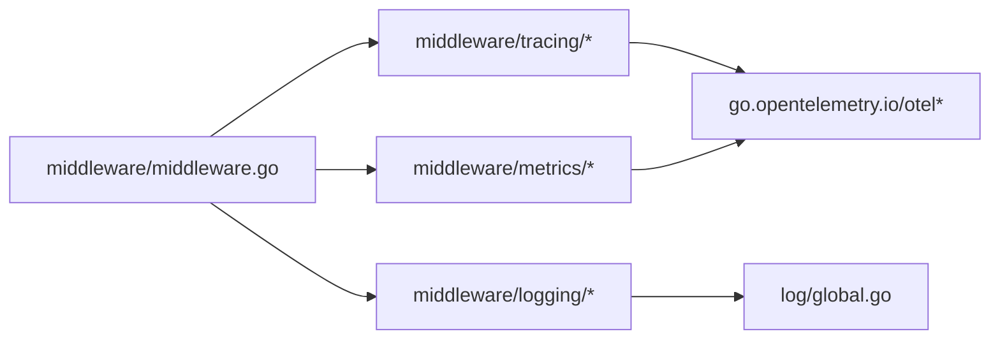

# 监控中间件

<cite>
**本文引用的文件列表**
- [middleware/tracing/tracing.go](file://middleware/tracing/tracing.go)
- [middleware/tracing/tracer.go](file://middleware/tracing/tracer.go)
- [middleware/tracing/span.go](file://middleware/tracing/span.go)
- [middleware/tracing/metadata.go](file://middleware/tracing/metadata.go)
- [middleware/tracing/statshandler.go](file://middleware/tracing/statshandler.go)
- [middleware/metrics/metrics.go](file://middleware/metrics/metrics.go)
- [middleware/metrics/otel.go](file://middleware/metrics/otel.go)
- [middleware/logging/logging.go](file://middleware/logging/logging.go)
- [middleware/middleware.go](file://middleware/middleware.go)
- [log/global.go](file://log/global.go)
- [go.mod](file://go.mod)
</cite>

## 目录
1. [引言](#引言)
2. [项目结构](#项目结构)
3. [核心组件](#核心组件)
4. [架构总览](#架构总览)
5. [详细组件分析](#详细组件分析)
6. [依赖关系分析](#依赖关系分析)
7. [性能考量](#性能考量)
8. [故障排查指南](#故障排查指南)
9. [结论](#结论)
10. [附录：端到端使用示例](#附录端到端使用示例)

## 引言
本文件系统性梳理 Kratos 框架中的监控中间件，围绕“追踪（tracing）、指标（metrics）、日志（logging）”三大支柱，给出可操作的配置与使用说明，并通过序列图与流程图帮助读者快速建立端到端的可观测性链路。内容覆盖：
- 追踪中间件如何集成 OpenTelemetry，包含采样策略、追踪头传播、Span 属性注入等关键参数。
- 指标中间件的指标采集机制，包括默认收集的请求延迟与调用次数，以及自定义指标扩展方式。
- 日志中间件的结构化日志输出格式与上下文信息自动注入能力。
- 组合使用三者形成完整的监控链路示例。

## 项目结构
监控中间件位于 middleware 子目录下，分别对应 tracing、metrics、logging 三个子包；同时依赖统一的中间件接口与传输层抽象。

图表来源
- [middleware/middleware.go](file://middleware/middleware.go#L1-L22)
- [middleware/tracing/tracing.go](file://middleware/tracing/tracing.go#L1-L97)
- [middleware/metrics/metrics.go](file://middleware/metrics/metrics.go#L1-L211)
- [middleware/logging/logging.go](file://middleware/logging/logging.go#L1-L120)
- [log/global.go](file://log/global.go#L1-L130)
- [go.mod](file://go.mod#L1-L49)

章节来源
- [middleware/middleware.go](file://middleware/middleware.go#L1-L22)
- [go.mod](file://go.mod#L1-L49)

## 核心组件
- 追踪中间件（tracing）
  - 提供 Server/Client 两种形态，基于 OpenTelemetry TracerProvider 与 TextMapPropagator 实现跨进程传播。
  - 支持通过选项函数配置 TracerProvider、Propagator、Tracer 名称。
  - 自动注入 HTTP/GRPC 的语义属性与消息大小等元数据。
- 指标中间件（metrics）
  - 默认采集服务端/客户端请求计数与请求耗时直方图，标签包含 kind、operation、code、reason 等。
  - 支持自定义 Int64Counter 与 Float64Histogram，并提供默认构造与视图配置。
  - 提供启用 OTEL exemplar 的环境变量开关。
- 日志中间件（logging）
  - 输出结构化日志，包含 kind、component、operation、args、code、reason、stack、latency 等字段。
  - 自动从上下文提取错误级别与堆栈信息，支持 Redacter 接口进行敏感信息脱敏。

章节来源
- [middleware/tracing/tracing.go](file://middleware/tracing/tracing.go#L1-L97)
- [middleware/tracing/tracer.go](file://middleware/tracing/tracer.go#L1-L83)
- [middleware/tracing/span.go](file://middleware/tracing/span.go#L1-L153)
- [middleware/metrics/metrics.go](file://middleware/metrics/metrics.go#L1-L211)
- [middleware/metrics/otel.go](file://middleware/metrics/otel.go#L1-L8)
- [middleware/logging/logging.go](file://middleware/logging/logging.go#L1-L120)

## 架构总览
下图展示了三者在一次请求生命周期中的协作关系：日志中间件负责记录结构化日志；指标中间件负责统计调用次数与耗时；追踪中间件负责生成与传播 Span，并将关键属性注入到日志与指标中。

图表来源
- [middleware/logging/logging.go](file://middleware/logging/logging.go#L1-L120)
- [middleware/metrics/metrics.go](file://middleware/metrics/metrics.go#L1-L211)
- [middleware/tracing/tracing.go](file://middleware/tracing/tracing.go#L1-L97)
- [middleware/tracing/tracer.go](file://middleware/tracing/tracer.go#L1-L83)
- [middleware/tracing/span.go](file://middleware/tracing/span.go#L1-L153)

## 详细组件分析

### 追踪中间件（Tracing）
- 配置项与传播
  - 通过 WithTracerProvider、WithPropagator、WithTracerName 设置 TracerProvider、TextMapPropagator 与 Tracer 名称。
  - 默认 Propagator 使用复合传播器，包含 Metadata、Baggage、TraceContext，确保跨进程传播。
  - 在 Server 端使用 Extract 解析上游传入的追踪上下文，在 Client 端使用 Inject 注入追踪头。
- Span 属性注入
  - 客户端/服务端根据传输类型（HTTP/GRPC）注入语义属性，如 HTTP 方法、路由、目标路径、远程地址或 gRPC 对端地址。
  - 自动设置 RPC 系统、服务名、方法名、消息大小等属性。
  - 错误时记录错误事件与状态码，成功时标记为 OK。
- 上下文 Valuer
  - 提供 TraceID()/SpanID() Valuer，便于日志中间件自动注入追踪标识。

图表来源
- [middleware/tracing/tracer.go](file://middleware/tracing/tracer.go#L1-L83)
- [middleware/tracing/tracing.go](file://middleware/tracing/tracing.go#L1-L97)
- [middleware/tracing/metadata.go](file://middleware/tracing/metadata.go#L1-L47)
- [middleware/tracing/span.go](file://middleware/tracing/span.go#L1-L153)

章节来源
- [middleware/tracing/tracing.go](file://middleware/tracing/tracing.go#L1-L97)
- [middleware/tracing/tracer.go](file://middleware/tracing/tracer.go#L1-L83)
- [middleware/tracing/metadata.go](file://middleware/tracing/metadata.go#L1-L47)
- [middleware/tracing/span.go](file://middleware/tracing/span.go#L1-L153)

### 指标中间件（Metrics）
- 默认指标
  - 请求计数器：按 kind、operation、code、reason 聚合。
  - 请求耗时直方图：按 kind、operation 聚合，单位秒，默认桶边界覆盖常见延迟范围。
- 自定义扩展
  - 可通过 WithRequests/WithSeconds 注入自定义 Counter/Histogram。
  - 提供 DefaultRequestsCounter、DefaultSecondsHistogram、DefaultSecondsHistogramView 用于快速构建默认指标。
  - 提供 EnableOTELExemplar 开启 OTEL exemplar，便于关联时间序列与追踪样本。
- 采集时机
  - 服务端/客户端均在处理前记录开始时间，异常时解析错误原因与状态码，结束后累加计数与记录耗时。

图表来源
- [middleware/metrics/metrics.go](file://middleware/metrics/metrics.go#L1-L211)
- [middleware/metrics/otel.go](file://middleware/metrics/otel.go#L1-L8)

章节来源
- [middleware/metrics/metrics.go](file://middleware/metrics/metrics.go#L1-L211)
- [middleware/metrics/otel.go](file://middleware/metrics/otel.go#L1-L8)

### 日志中间件（Logging）
- 输出字段
  - 包含 kind、component、operation、args、code、reason、stack、latency 等键值。
- 上下文注入
  - 自动从上下文提取错误级别与堆栈信息；当存在错误时以错误级别输出。
  - 支持 Redacter 接口对请求体进行脱敏输出；若实现 fmt.Stringer 则使用其字符串表示。
- 全局日志器
  - 借助 log/global.go 中的全局日志器与 Helper，保证日志输出的一致性与可配置性。

图表来源
- [middleware/logging/logging.go](file://middleware/logging/logging.go#L1-L120)
- [log/global.go](file://log/global.go#L1-L130)

章节来源
- [middleware/logging/logging.go](file://middleware/logging/logging.go#L1-L120)
- [log/global.go](file://log/global.go#L1-L130)

## 依赖关系分析
- 外部依赖
  - OpenTelemetry SDK/Trace/Metric：追踪与指标采集的基础。
  - gRPC/HTTP 传输层：提供请求上下文与元数据访问。
- 内部依赖
  - middleware/middleware.go 定义中间件接口与链式组合。
  - tracing 与 metrics 依赖 transport 抽象获取 kind、operation、header 等信息。
  - logging 依赖 log/global.go 提供的全局日志器与 Helper。

图表来源
- [middleware/middleware.go](file://middleware/middleware.go#L1-L22)
- [middleware/tracing/tracing.go](file://middleware/tracing/tracing.go#L1-L97)
- [middleware/metrics/metrics.go](file://middleware/metrics/metrics.go#L1-L211)
- [middleware/logging/logging.go](file://middleware/logging/logging.go#L1-L120)
- [log/global.go](file://log/global.go#L1-L130)
- [go.mod](file://go.mod#L1-L49)

章节来源
- [go.mod](file://go.mod#L1-L49)

## 性能考量
- 指标直方图桶边界
  - 默认直方图采用常见延迟范围的显式桶边界，有助于在高并发场景下获得更精细的延迟分布观测。
- OTEL exemplar
  - 启用后可在时序数据中关联具体追踪样本，便于定位慢请求的根因。
- 追踪传播开销
  - 默认使用复合传播器，建议在高吞吐场景评估额外的头部大小与序列化成本。
- 日志输出
  - 建议结合 Redacter 对敏感请求体进行脱敏，避免日志泄露。

[本节为通用指导，不涉及特定文件分析]

## 故障排查指南
- 追踪头未传播
  - 检查是否正确设置 WithPropagator，确认 Server/Client 端使用相同传播器集合。
  - 确认上游是否调用 Inject，下游是否调用 Extract。
- TraceID/SpanID 不一致
  - 核对 Server/Client 中间件是否在同一 TracerProvider 下创建，且传播器一致。
- 指标缺失
  - 确认是否配置了 WithRequests/WithSeconds，或是否注册了默认视图。
  - 检查 MeterProvider 是否已设置，且周期性读取器正常工作。
- 日志字段不完整
  - 确认上下文中是否存在传输信息（kind/operation），以及错误对象是否可解析为 Kratos 错误。

章节来源
- [middleware/tracing/tracing.go](file://middleware/tracing/tracing.go#L1-L97)
- [middleware/tracing/tracer.go](file://middleware/tracing/tracer.go#L1-L83)
- [middleware/metrics/metrics.go](file://middleware/metrics/metrics.go#L1-L211)
- [middleware/logging/logging.go](file://middleware/logging/logging.go#L1-L120)

## 结论
通过将 tracing、metrics、logging 三者有机结合，Kratos 提供了开箱即用的端到端可观测性方案。追踪中间件负责跨进程链路贯通与属性注入；指标中间件提供关键业务度量与默认视图；日志中间件以结构化形式沉淀上下文与耗时信息。配合统一的中间件链式组合，开发者可以灵活地按需启用与扩展监控能力。

[本节为总结性内容，不涉及特定文件分析]

## 附录：端到端使用示例
以下示例展示如何在服务端与客户端同时启用三类中间件，形成完整的监控链路。示例仅描述步骤与关键配置点，不包含具体代码片段。

- 初始化 OpenTelemetry
  - 设置 TracerProvider 与 MeterProvider，必要时注册周期性读取器与视图。
  - 如需 OTEL exemplar，调用启用函数。
- 服务端
  - 使用 tracing.Server + logging.Server + metrics.Server 组合中间件。
  - 在日志器上注入 TraceID()/SpanID() Valuer，以便日志中自动携带追踪标识。
- 客户端
  - 使用 tracing.Client + logging.Client + metrics.Client 组合中间件。
  - 确保传播器一致，使下游服务可继承追踪上下文。
- 验证
  - 观察日志中是否包含 kind、component、operation、args、code、reason、stack、latency 等字段。
  - 观察指标中是否出现请求计数与耗时直方图，标签包含 kind、operation、code、reason。
  - 在分布式追踪系统中核对 TraceID 一致性与 Span 属性完整性。

章节来源
- [middleware/tracing/tracing.go](file://middleware/tracing/tracing.go#L1-L97)
- [middleware/tracing/tracer.go](file://middleware/tracing/tracer.go#L1-L83)
- [middleware/metrics/metrics.go](file://middleware/metrics/metrics.go#L1-L211)
- [middleware/metrics/otel.go](file://middleware/metrics/otel.go#L1-L8)
- [middleware/logging/logging.go](file://middleware/logging/logging.go#L1-L120)
- [middleware/middleware.go](file://middleware/middleware.go#L1-L22)
- [log/global.go](file://log/global.go#L1-L130)