# 追踪中间件

<cite>
**本文档引用的文件**
- [tracing.go](file://middleware/tracing/tracing.go)
- [tracer.go](file://middleware/tracing/tracer.go)
- [span.go](file://middleware/tracing/span.go)
- [metadata.go](file://middleware/tracing/metadata.go)
- [statshandler.go](file://middleware/tracing/statshandler.go)
- [transport.go](file://transport/transport.go)
- [server.go](file://transport/http/server.go)
- [client.go](file://transport/grpc/client.go)
- [metrics.go](file://middleware/metrics/metrics.go)
- [otel.go](file://middleware/metrics/otel.go)
</cite>

## 目录
1. [简介](#简介)
2. [项目结构](#项目结构)
3. [核心组件](#核心组件)
4. [架构概述](#架构概述)
5. [详细组件分析](#详细组件分析)
6. [依赖分析](#依赖分析)
7. [性能考虑](#性能考虑)
8. [故障排除指南](#故障排除指南)
9. [结论](#结论)

## 简介
Kratos框架的追踪中间件基于OpenTelemetry实现分布式追踪功能，为微服务架构提供端到端的请求追踪能力。该中间件支持服务端和客户端两种模式，能够自动创建和管理Span，实现追踪上下文的传播，并与Kratos的传输层无缝集成。中间件提供了灵活的配置选项，包括采样率设置、自定义属性注入等功能，同时支持与日志系统和指标系统的协同工作，为系统监控和故障排查提供全面的支持。

## 项目结构
Kratos框架的追踪中间件位于`middleware/tracing`目录下，与其他中间件组件共同构成了框架的核心功能模块。该中间件与传输层、日志系统和指标系统紧密协作，形成了完整的可观测性解决方案。

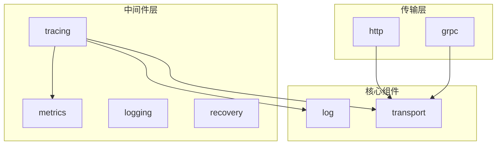

**Diagram sources**
- [tracing.go](file://middleware/tracing/tracing.go)
- [transport.go](file://transport/transport.go)
- [server.go](file://transport/http/server.go)
- [client.go](file://transport/grpc/client.go)

**Section sources**
- [tracing.go](file://middleware/tracing/tracing.go)
- [transport.go](file://transport/transport.go)

## 核心组件
追踪中间件的核心组件包括Tracer、Span管理器、上下文传播器和元数据处理器。这些组件协同工作，实现了分布式追踪的完整功能。中间件通过OpenTelemetry API与底层追踪系统交互，同时提供了与Kratos框架其他组件的集成接口。

**Section sources**
- [tracing.go](file://middleware/tracing/tracing.go)
- [tracer.go](file://middleware/tracing/tracer.go)
- [span.go](file://middleware/tracing/span.go)

## 架构概述
追踪中间件采用分层架构设计，上层为用户接口，中层为逻辑处理，底层为OpenTelemetry集成。这种设计使得中间件既保持了与OpenTelemetry的兼容性，又提供了针对Kratos框架的优化和扩展。

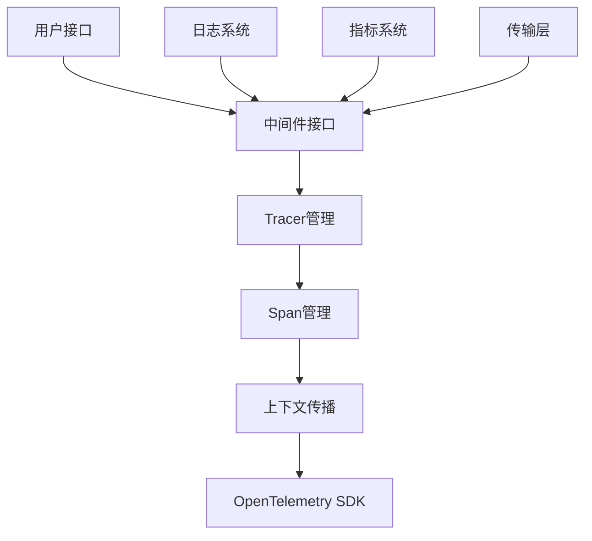

**Diagram sources**
- [tracing.go](file://middleware/tracing/tracing.go)
- [tracer.go](file://middleware/tracing/tracer.go)
- [span.go](file://middleware/tracing/span.go)
- [metadata.go](file://middleware/tracing/metadata.go)

## 详细组件分析

### 服务端与客户端中间件实现机制
追踪中间件提供了服务端和客户端两种实现，分别通过`Server`和`Client`函数创建。两种实现都基于相同的Tracer核心，但在Span创建和上下文处理上有所区别。

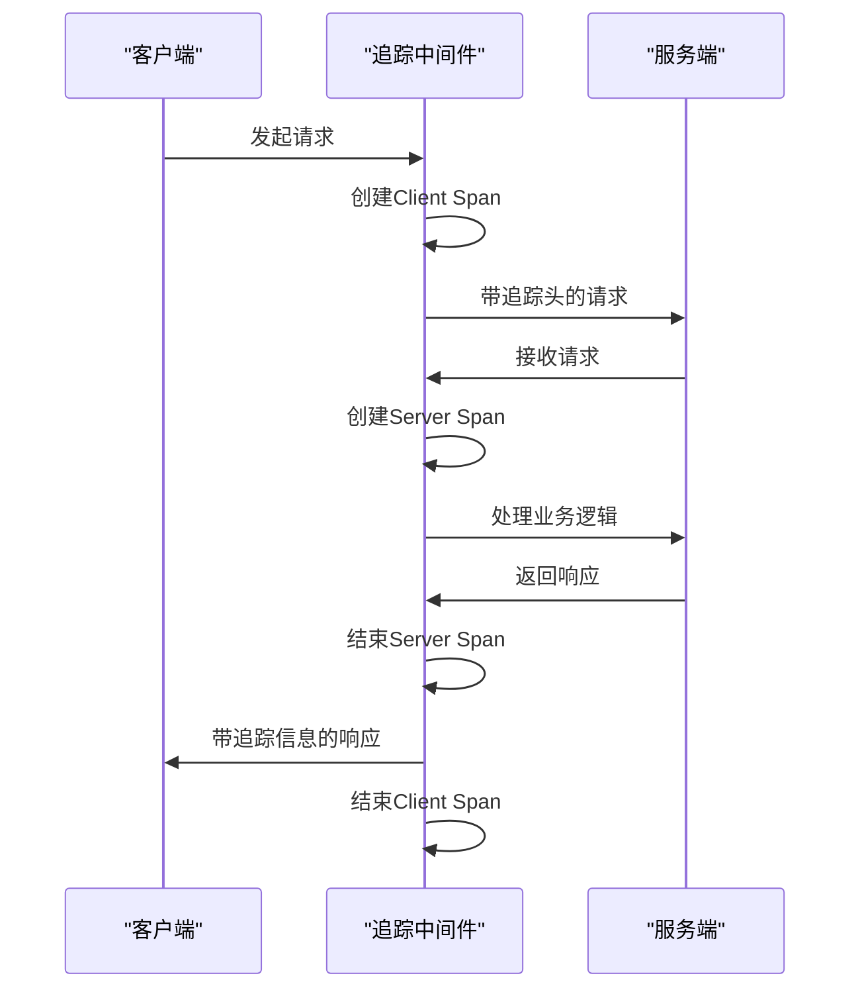

**Diagram sources**
- [tracing.go](file://middleware/tracing/tracing.go)
- [tracer.go](file://middleware/tracing/tracer.go)

**Section sources**
- [tracing.go](file://middleware/tracing/tracing.go#L46-L76)

### Span创建与上下文传播
Span的创建和上下文传播是追踪中间件的核心功能。服务端中间件在接收到请求时从请求头中提取追踪上下文，而客户端中间件在发送请求时将当前追踪上下文注入到请求头中。

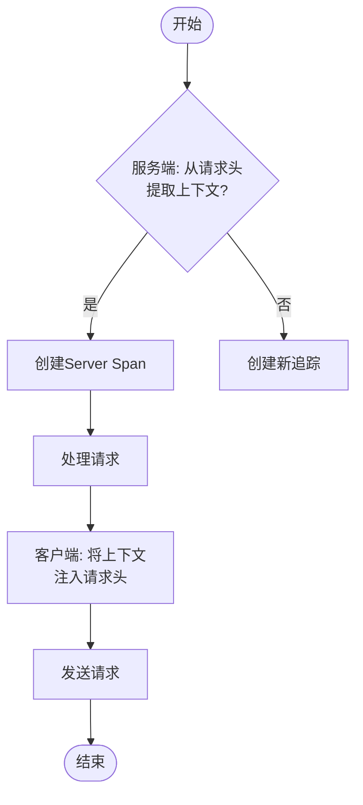

**Diagram sources**
- [tracer.go](file://middleware/tracing/tracer.go#L47-L59)
- [metadata.go](file://middleware/tracing/metadata.go)

**Section sources**
- [tracer.go](file://middleware/tracing/tracer.go#L47-L59)

### 操作名称提取与请求头注入
中间件通过Transport接口获取操作名称，并根据传输类型（HTTP或gRPC）提取相应的元数据。请求头注入则通过OpenTelemetry的TextMapPropagator实现，确保追踪信息在服务间正确传递。

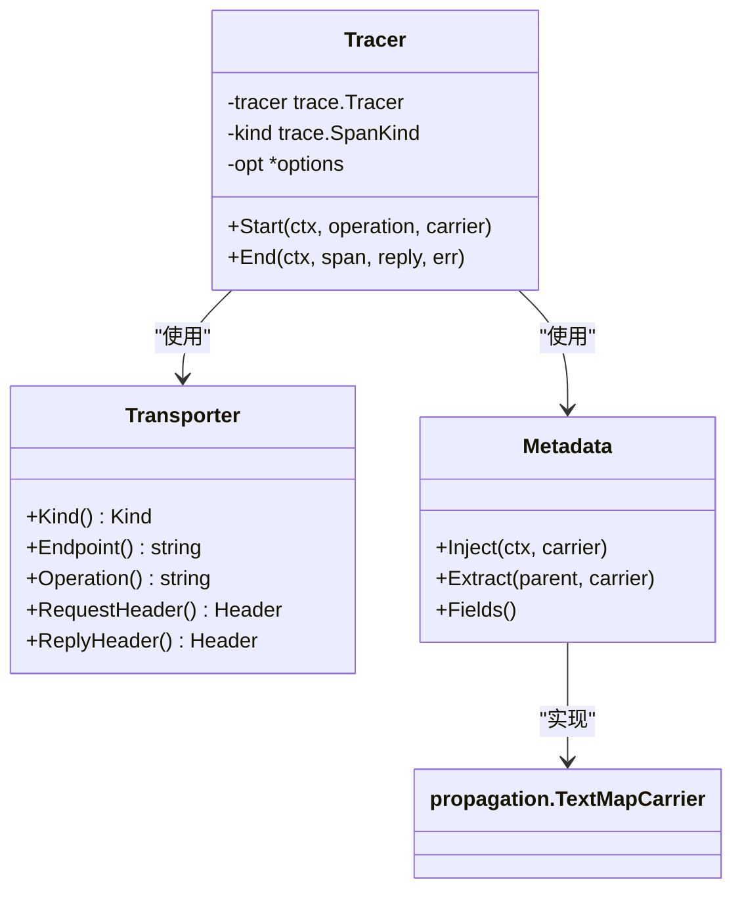

**Diagram sources**
- [tracing.go](file://middleware/tracing/tracing.go)
- [transport.go](file://transport/transport.go)
- [metadata.go](file://middleware/tracing/metadata.go)

**Section sources**
- [span.go](file://middleware/tracing/span.go#L20-L99)

### 采样率配置与追踪ID生成
追踪中间件支持通过配置指定采样率，控制追踪数据的收集密度。追踪ID和SpanID由OpenTelemetry SDK自动生成和管理，确保全局唯一性和正确的层级关系。

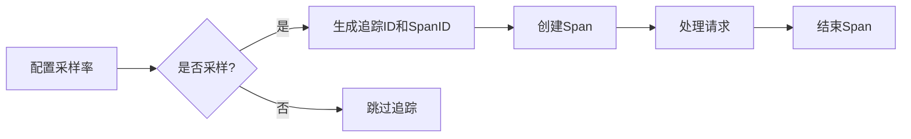

**Diagram sources**
- [tracer.go](file://middleware/tracing/tracer.go#L24-L44)
- [tracing_test.go](file://middleware/tracing/tracing_test.go#L79-L111)

**Section sources**
- [tracer.go](file://middleware/tracing/tracer.go#L24-L44)

### 自定义属性注入方法
中间件支持在Span中注入自定义属性，包括RPC系统类型、服务名称、方法名称、消息大小等。这些属性有助于在追踪系统中进行更精细的分析和过滤。

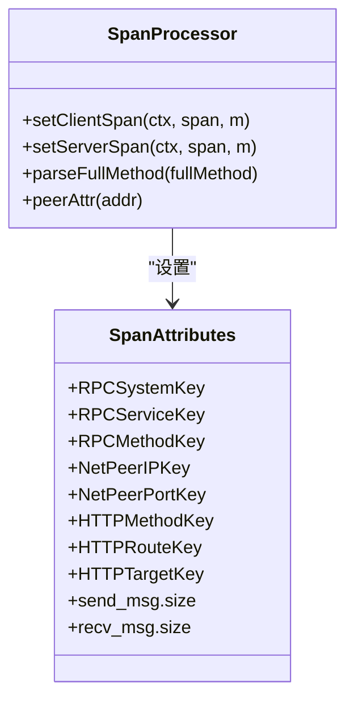

**Diagram sources**
- [span.go](file://middleware/tracing/span.go)
- [tracer.go](file://middleware/tracing/tracer.go#L62-L82)

**Section sources**
- [span.go](file://middleware/tracing/span.go)

### 与Kratos传输层集成示例
追踪中间件通过Transport接口与Kratos的HTTP和gRPC传输层集成。在HTTP服务器中，中间件作为过滤器链的一部分执行；在gRPC客户端中，中间件作为拦截器执行。

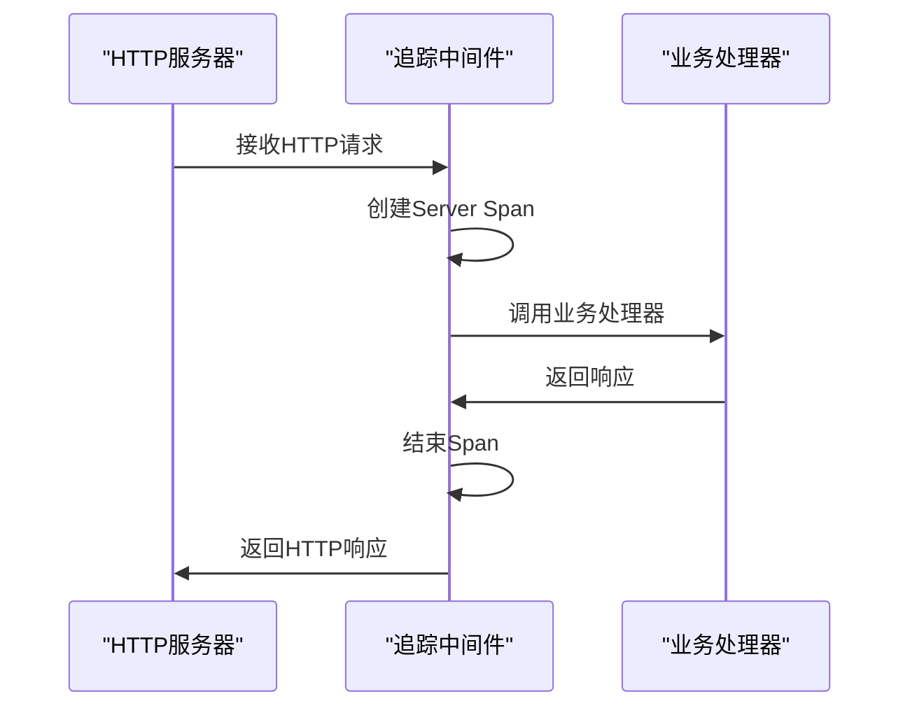

**Diagram sources**
- [server.go](file://transport/http/server.go#L157-L200)
- [client.go](file://transport/grpc/client.go#L153-L200)

**Section sources**
- [server.go](file://transport/http/server.go#L157-L200)
- [client.go](file://transport/grpc/client.go#L153-L200)

### 日志上下文自动注入
追踪中间件提供了TraceID()和SpanID()日志值提供器，可以将追踪上下文自动注入到日志中。这使得在日志系统中能够根据追踪ID关联分布式系统中的相关日志。

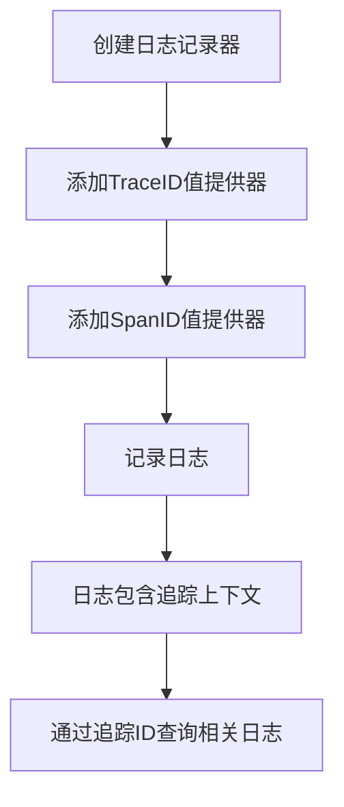

**Diagram sources**
- [tracing.go](file://middleware/tracing/tracing.go#L78-L96)
- [tracing_test.go](file://middleware/tracing/tracing_test.go#L126-L141)

**Section sources**
- [tracing.go](file://middleware/tracing/tracing.go#L78-L96)

### 错误处理与指标协同
当发生错误时，追踪中间件会将错误信息记录到Span中，并设置Span状态为错误。同时，中间件与metrics中间件协同工作，将错误信息反映在指标系统中，实现全面的监控覆盖。

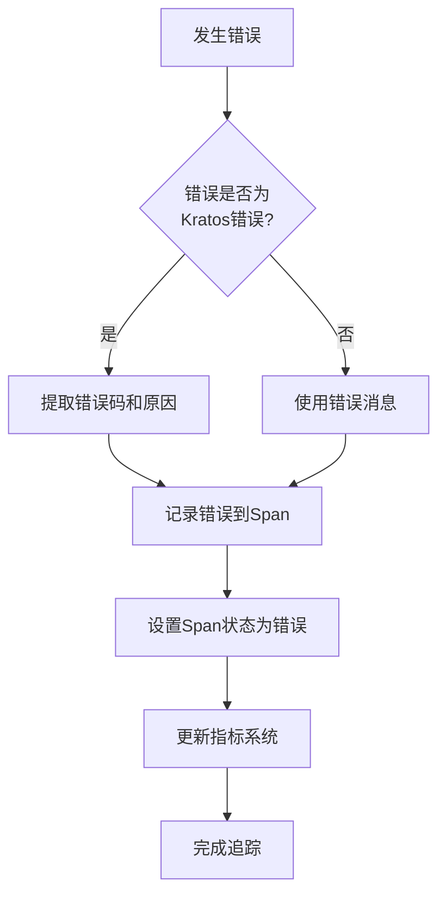

**Diagram sources**
- [tracer.go](file://middleware/tracing/tracer.go#L62-L72)
- [metrics.go](file://middleware/metrics/metrics.go#L101-L157)

**Section sources**
- [tracer.go](file://middleware/tracing/tracer.go#L62-L72)
- [metrics.go](file://middleware/metrics/metrics.go#L101-L157)

## 依赖分析
追踪中间件依赖于OpenTelemetry SDK、Kratos的传输层和日志系统。同时，它与metrics中间件存在协同关系，共同构建了完整的可观测性体系。

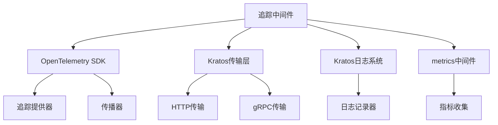

**Diagram sources**
- [go.mod](file://go.mod)
- [tracing.go](file://middleware/tracing/tracing.go)
- [metrics.go](file://middleware/metrics/metrics.go)

**Section sources**
- [go.mod](file://go.mod)
- [tracing.go](file://middleware/tracing/tracing.go)

## 性能考虑
追踪中间件在设计时考虑了性能影响，通过条件编译和懒加载等技术减少对正常请求处理的影响。采样机制可以有效控制追踪数据的生成量，避免对系统性能造成过大负担。

## 故障排除指南
当追踪功能出现问题时，可以通过检查追踪头是否正确传递、验证追踪提供器配置、确认中间件顺序等方式进行排查。测试文件中的示例代码也提供了验证追踪功能的参考方法。

**Section sources**
- [tracing_test.go](file://middleware/tracing/tracing_test.go)
- [tracer_test.go](file://middleware/tracing/tracer_test.go)

## 结论
Kratos框架的追踪中间件基于OpenTelemetry标准实现了完整的分布式追踪功能，具有良好的扩展性和兼容性。通过与框架其他组件的深度集成，为微服务架构提供了强大的可观测性支持，有助于提高系统的可维护性和稳定性。