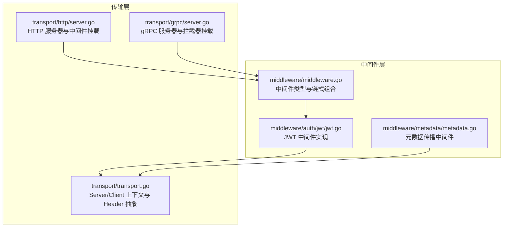
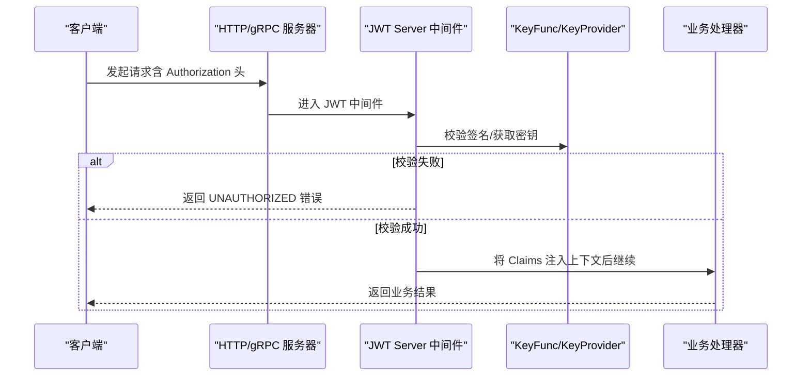
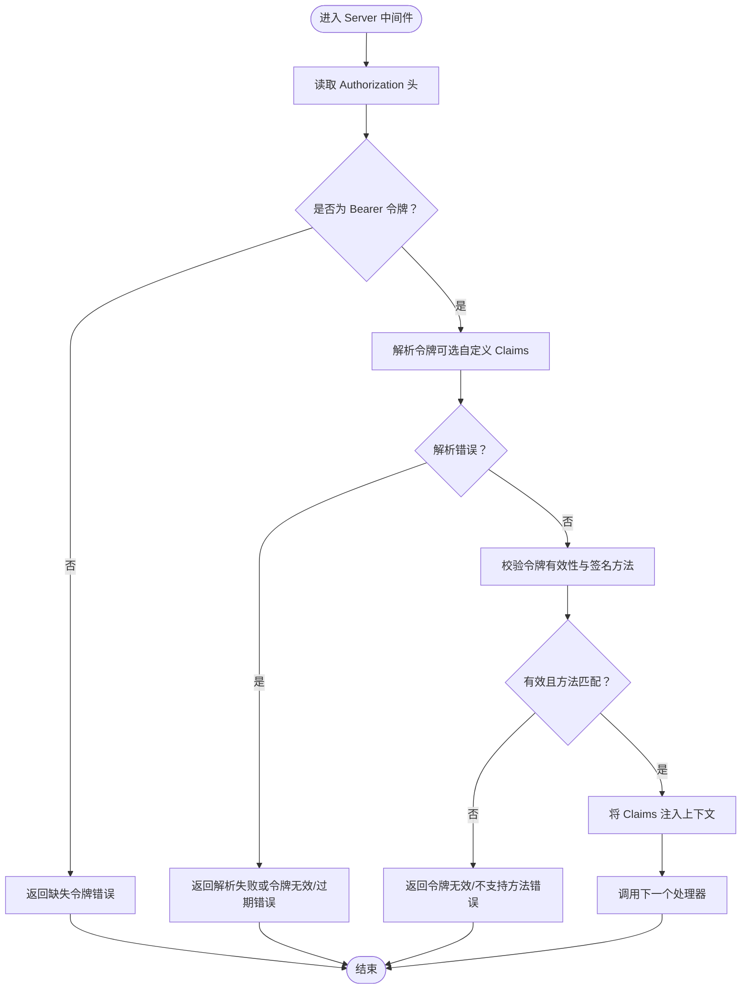
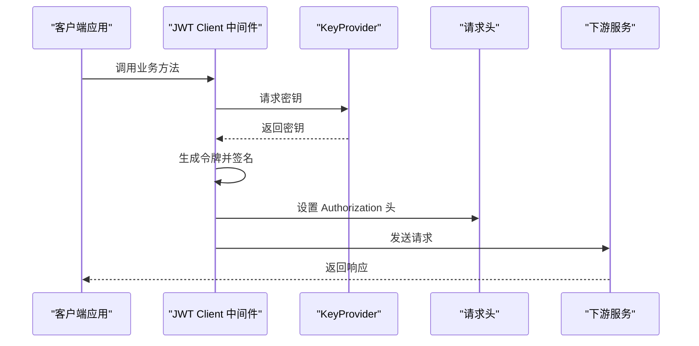
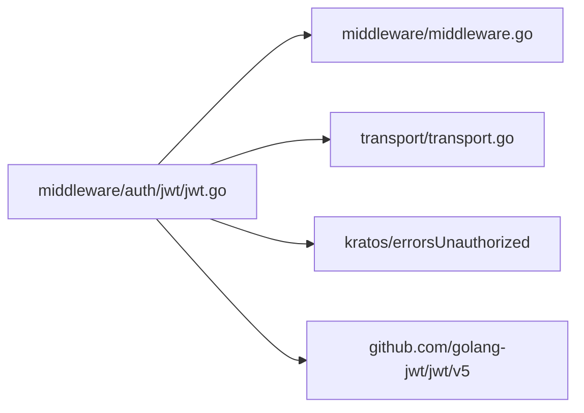

# 认证中间件

<cite>
**本文引用的文件**
- [jwt.go](file://middleware/auth/jwt/jwt.go)
- [jwt_test.go](file://middleware/auth/jwt/jwt_test.go)
- [middleware.go](file://middleware/middleware.go)
- [transport.go](file://transport/transport.go)
- [server.go（HTTP）](file://transport/http/server.go)
- [server.go（gRPC）](file://transport/grpc/server.go)
- [metadata.go](file://middleware/metadata/metadata.go)
</cite>

## 目录
1. [简介](#简介)
2. [项目结构](#项目结构)
3. [核心组件](#核心组件)
4. [架构总览](#架构总览)
5. [详细组件分析](#详细组件分析)
6. [依赖关系分析](#依赖关系分析)
7. [性能考量](#性能考量)
8. [故障排查指南](#故障排查指南)
9. [结论](#结论)
10. [附录：集成示例与最佳实践](#附录：集成示例与最佳实践)

## 简介
本文件系统性地文档化 Kratos 框架中的 JWT 认证中间件实现，重点说明：
- 如何通过 jwt.go 中的 Middleware 函数创建认证拦截器
- 公钥/私钥配置、令牌解析选项、自定义声明处理等配置参数
- 在 HTTP 和 gRPC 服务中集成 JWT 中间件的方式
- 如何从请求中提取令牌、验证签名并注入用户上下文
- 错误处理流程（令牌过期、签名无效等）
- 与元数据系统的集成方式，以及如何扩展支持其他认证方案

## 项目结构
JWT 认证中间件位于 middleware/auth/jwt 目录，围绕 Kratos 的中间件体系与传输层上下文协作工作：
- middleware/auth/jwt/jwt.go：JWT 中间件实现与选项配置
- middleware/auth/jwt/jwt_test.go：覆盖关键路径的单元测试
- middleware/middleware.go：中间件通用类型与链式组合
- transport/transport.go：传输层上下文（Server/Client）与 Header 抽象
- transport/http/server.go 与 transport/grpc/server.go：HTTP/gRPC 服务器侧中间件挂载点
- middleware/metadata/metadata.go：元数据传播中间件（可与 JWT 协同）

图表来源
- [middleware.go](file://middleware/middleware.go#L1-L22)
- [jwt.go](file://middleware/auth/jwt/jwt.go#L1-L178)
- [transport.go](file://transport/transport.go#L1-L96)
- [server.go（HTTP）](file://transport/http/server.go#L1-L200)
- [server.go（gRPC）](file://transport/grpc/server.go#L1-L200)
- [metadata.go](file://middleware/metadata/metadata.go#L1-L116)

章节来源
- [middleware.go](file://middleware/middleware.go#L1-L22)
- [jwt.go](file://middleware/auth/jwt/jwt.go#L1-L178)
- [transport.go](file://transport/transport.go#L1-L96)
- [server.go（HTTP）](file://transport/http/server.go#L1-L200)
- [server.go（gRPC）](file://transport/grpc/server.go#L1-L200)
- [metadata.go](file://middleware/metadata/metadata.go#L1-L116)

## 核心组件
- 中间件类型与链式组合
  - 中间件 Handler 与 Middleware 类型定义，以及 Chain 组合函数，为 JWT 中间件提供了统一的接入方式。
- JWT 选项与配置
  - WithSigningMethod：设置签名算法（默认 HS256）
  - WithClaims：注册自定义 Claims 解析工厂（注意并发安全）
  - WithTokenHeader：为客户端签发的令牌添加自定义头部字段
- 服务端与客户端中间件
  - Server：从请求头 Authorization 中解析 Bearer 令牌，校验签名与有效期，并将 Claims 注入上下文
  - Client：通过 Key Provider 获取密钥，生成签名令牌并写入 Authorization 头
- 上下文与错误码
  - NewContext/FromContext：在上下文中存取 Claims
  - 内置错误码：缺失令牌、签名函数缺失、令牌无效、过期、解析失败、不支持的签名方法、上下文错误、缺少 Token Provider、签名失败、取 Key 失败

章节来源
- [middleware.go](file://middleware/middleware.go#L1-L22)
- [jwt.go](file://middleware/auth/jwt/jwt.go#L1-L178)

## 架构总览
JWT 中间件在 HTTP/gRPC 两侧的工作流如下：
- HTTP 侧：通过 ServerOption 中间件挂载点，将 JWT Server 中间件加入请求处理链
- gRPC 侧：通过 gRPC Server 的拦截器链路，将 JWT Server 中间件加入请求处理链
- 客户端侧：通过 Client 中间件将签名后的令牌写入请求头

图表来源
- [jwt.go](file://middleware/auth/jwt/jwt.go#L78-L128)
- [server.go（HTTP）](file://transport/http/server.go#L66-L70)
- [server.go（gRPC）](file://transport/grpc/server.go#L68-L80)

## 详细组件分析

### JWT 服务端中间件（Server）
- 功能要点
  - 从传输上下文读取请求头，解析 Authorization 头是否为 Bearer 令牌
  - 使用传入的 KeyFunc 验证签名；若提供 WithClaims，则使用 ParseWithClaims 解析自定义 Claims
  - 校验令牌有效性与签名算法一致性
  - 成功后将 Claims 注入上下文，供后续业务使用
- 关键错误处理
  - 缺少 KeyFunc、缺失令牌、令牌无效、过期、解析失败、不支持的签名方法、上下文错误
- 并发与自定义 Claims
  - WithClaims 在 Server 场景需返回新的 Claims 实例以避免并发写入问题

图表来源
- [jwt.go](file://middleware/auth/jwt/jwt.go#L78-L128)

章节来源
- [jwt.go](file://middleware/auth/jwt/jwt.go#L78-L128)
- [jwt_test.go](file://middleware/auth/jwt/jwt_test.go#L177-L273)

### JWT 客户端中间件（Client）
- 功能要点
  - 通过 Key Provider 获取密钥，使用指定签名方法与 Claims 生成令牌
  - 可通过 WithTokenHeader 为令牌头部添加自定义字段
  - 将签名后的令牌写入 Authorization 头
- 关键错误处理
  - 缺少 Token Provider、取 Key 失败、签名失败、上下文错误

图表来源
- [jwt.go](file://middleware/auth/jwt/jwt.go#L130-L166)

章节来源
- [jwt.go](file://middleware/auth/jwt/jwt.go#L130-L166)
- [jwt_test.go](file://middleware/auth/jwt/jwt_test.go#L275-L320)

### 选项与配置参数
- WithSigningMethod(method)
  - 设置签名算法，默认 HS256
- WithClaims(f)
  - 提供 Claims 工厂函数；Server 场景每次返回新实例，Client 场景可复用以提升性能
- WithTokenHeader(header)
  - 为客户端签发的令牌头部添加自定义字段（如 kid、env 等）

章节来源
- [jwt.go](file://middleware/auth/jwt/jwt.go#L55-L77)

### 上下文与元数据集成
- 上下文注入与提取
  - NewContext：将 Claims 存入上下文
  - FromContext：从上下文中取出 Claims
- 元数据传播
  - 可结合 metadata 中间件在服务间传递元数据（如 x-md-* 前缀），JWT Claims 可作为业务上下文的一部分参与后续处理

章节来源
- [jwt.go](file://middleware/auth/jwt/jwt.go#L168-L178)
- [metadata.go](file://middleware/metadata/metadata.go#L1-L116)

## 依赖关系分析
JWT 中间件依赖于：
- 中间件通用类型与链式组合
- 传输层上下文（Server/Client）与 Header 抽象
- golang-jwt/jwt 库进行令牌解析与签名
- Kratos 错误模块返回标准 UNAUTHORIZED 错误

图表来源
- [jwt.go](file://middleware/auth/jwt/jwt.go#L1-L43)
- [middleware.go](file://middleware/middleware.go#L1-L22)
- [transport.go](file://transport/transport.go#L1-L96)

章节来源
- [jwt.go](file://middleware/auth/jwt/jwt.go#L1-L43)
- [middleware.go](file://middleware/middleware.go#L1-L22)
- [transport.go](file://transport/transport.go#L1-L96)

## 性能考量
- 自定义 Claims 的并发安全
  - Server 场景建议每次返回新的 Claims 实例，避免多协程共享导致竞态
- 客户端 Claims 复用
  - Client 场景可复用单个 Claims 实例以减少分配开销
- 签名算法选择
  - 默认 HS256，性能较好；如需跨服务共享密钥，可考虑 ES256 等非对称算法，但需权衡 CPU 开销
- Header 与上下文访问
  - 通过 transport 层抽象访问 Header，避免直接依赖具体协议细节，便于在 HTTP/gRPC 间复用

章节来源
- [jwt.go](file://middleware/auth/jwt/jwt.go#L62-L69)

## 故障排查指南
- 常见错误与定位
  - 缺失令牌：检查客户端是否正确设置 Authorization 头
  - KeyFunc 缺失：确认 Server 中间件已传入有效的 KeyFunc
  - 令牌无效/解析失败：检查令牌格式、签名算法与密钥是否匹配
  - 令牌过期：检查令牌有效期与服务器时间同步
  - 不支持的签名方法：确保服务端期望的签名方法与客户端一致
  - 上下文错误：确认请求是否来自正确的传输上下文
  - Token Provider 缺失：客户端中间件需要有效的 KeyProvider
  - 取 Key 失败/签名失败：检查 KeyProvider 实现与密钥可用性
- 单元测试参考
  - 测试覆盖了缺失令牌、令牌无效、过期、签名方法不匹配、KeyFunc 缺失、客户端 Provider 缺失、取 Key 失败等场景

章节来源
- [jwt.go](file://middleware/auth/jwt/jwt.go#L32-L43)
- [jwt_test.go](file://middleware/auth/jwt/jwt_test.go#L177-L387)

## 结论
JWT 认证中间件在 Kratos 中提供了简洁而强大的认证能力：
- 通过选项化配置支持多种签名算法与自定义 Claims
- 在 HTTP/gRPC 两侧均能无缝集成，遵循统一的中间件链式模型
- 与传输层上下文和元数据中间件协同，便于构建可观测与可追踪的服务
- 通过完善的错误码与测试用例，能够快速定位与修复常见问题

## 附录：集成示例与最佳实践

### 在 HTTP 服务中集成 JWT 中间件
- 步骤
  - 使用 HTTP Server 的 Middleware 选项挂载 JWT Server 中间件
  - 在业务处理器中通过 FromContext 获取 Claims，完成鉴权与授权逻辑
- 参考路径
  - 中间件挂载：[server.go（HTTP）](file://transport/http/server.go#L66-L70)
  - 服务端中间件实现：[jwt.go](file://middleware/auth/jwt/jwt.go#L78-L128)
  - 上下文提取：[jwt.go](file://middleware/auth/jwt/jwt.go#L168-L178)

章节来源
- [server.go（HTTP）](file://transport/http/server.go#L66-L70)
- [jwt.go](file://middleware/auth/jwt/jwt.go#L78-L128)
- [jwt.go](file://middleware/auth/jwt/jwt.go#L168-L178)

### 在 gRPC 服务中集成 JWT 中间件
- 步骤
  - 使用 gRPC Server 的 Middleware 选项挂载 JWT Server 中间件
  - 在业务处理器中通过 FromContext 获取 Claims
- 参考路径
  - 中间件挂载：[server.go（gRPC）](file://transport/grpc/server.go#L68-L80)
  - 服务端中间件实现：[jwt.go](file://middleware/auth/jwt/jwt.go#L78-L128)
  - 上下文提取：[jwt.go](file://middleware/auth/jwt/jwt.go#L168-L178)

章节来源
- [server.go（gRPC）](file://transport/grpc/server.go#L68-L80)
- [jwt.go](file://middleware/auth/jwt/jwt.go#L78-L128)
- [jwt.go](file://middleware/auth/jwt/jwt.go#L168-L178)

### 客户端集成与令牌注入
- 步骤
  - 使用 JWT Client 中间件，提供 KeyProvider 获取密钥
  - 中间件会自动将签名后的令牌写入 Authorization 头
- 参考路径
  - 客户端中间件实现：[jwt.go](file://middleware/auth/jwt/jwt.go#L130-L166)
  - 单元测试示例：[jwt_test.go](file://middleware/auth/jwt/jwt_test.go#L275-L320)

章节来源
- [jwt.go](file://middleware/auth/jwt/jwt.go#L130-L166)
- [jwt_test.go](file://middleware/auth/jwt/jwt_test.go#L275-L320)

### 与元数据系统的集成
- 步骤
  - 使用 metadata 中间件在服务间传播元数据（如 x-md-* 前缀）
  - JWT Claims 可作为业务上下文的一部分参与后续处理
- 参考路径
  - 元数据中间件实现：[metadata.go](file://middleware/metadata/metadata.go#L1-L116)
  - 传输层 Header 抽象：[transport.go](file://transport/transport.go#L1-L96)

章节来源
- [metadata.go](file://middleware/metadata/metadata.go#L1-L116)
- [transport.go](file://transport/transport.go#L1-L96)

### 扩展支持其他认证方案
- 方案一：基于 KeyFunc 的多算法支持
  - 通过 WithSigningMethod 与 KeyFunc 的组合，可支持 HS256、ES256 等算法
- 方案二：自定义中间件
  - 参照 JWT 中间件模式，实现新的中间件以适配 OAuth2、API Key 等方案
- 方案三：与网关/反向代理协作
  - 在边缘层完成认证，将用户信息注入到元数据或上下文中，服务端仅做透传校验

章节来源
- [jwt.go](file://middleware/auth/jwt/jwt.go#L55-L77)
- [middleware.go](file://middleware/middleware.go#L1-L22)