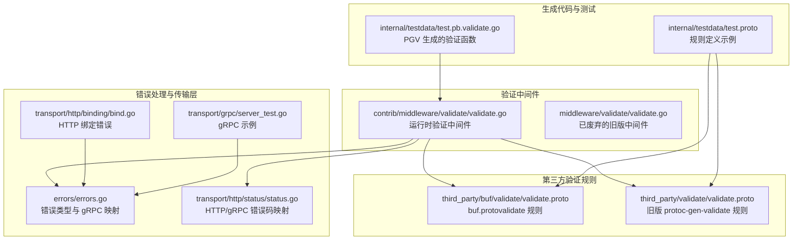
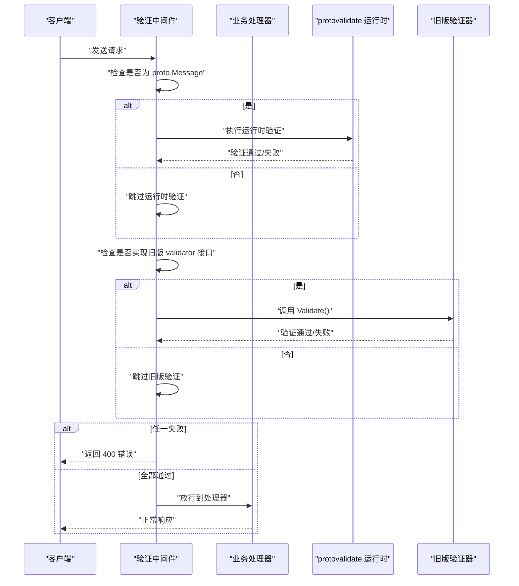
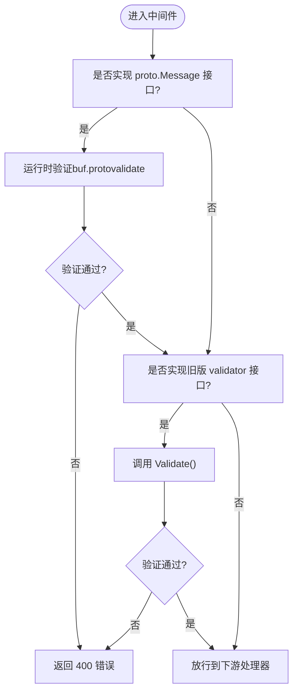
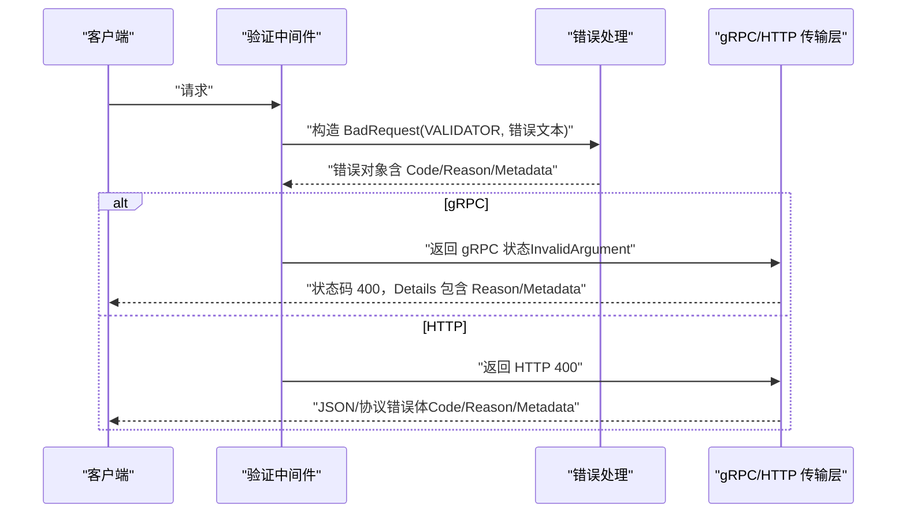
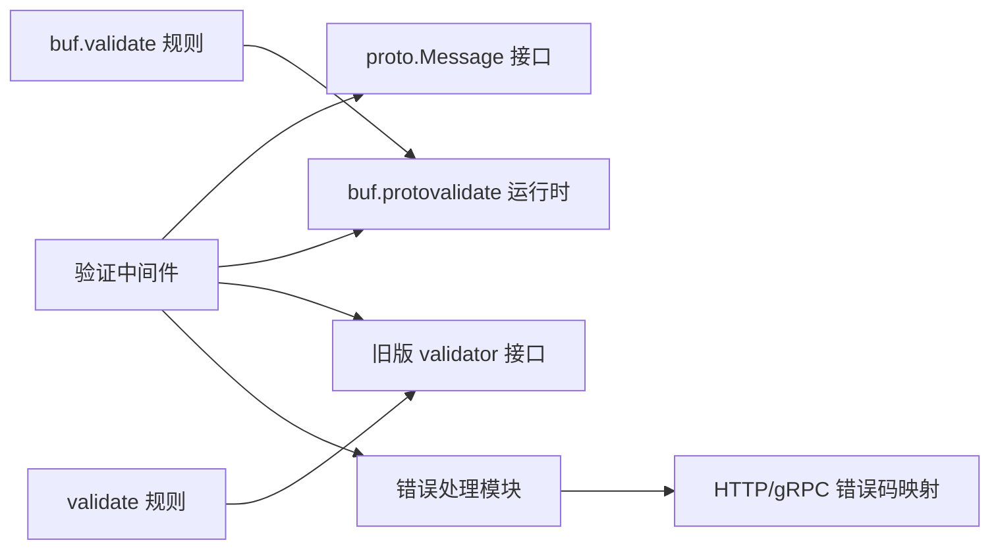

# 验证中间件

<cite>
**本文引用的文件列表**
- [contrib/middleware/validate/validate.go](file://contrib/middleware/validate/validate.go)
- [middleware/validate/validate.go](file://middleware/validate/validate.go)
- [contrib/middleware/validate/validate_test.go](file://contrib/middleware/validate/validate_test.go)
- [contrib/middleware/validate/internal/testdata/test.proto](file://contrib/middleware/validate/internal/testdata/test.proto)
- [contrib/middleware/validate/internal/testdata/test.pb.validate.go](file://contrib/middleware/validate/internal/testdata/test.pb.validate.go)
- [third_party/buf/validate/validate.proto](file://third_party/buf/validate/validate.proto)
- [third_party/validate/validate.proto](file://third_party/validate/validate.proto)
- [errors/errors.go](file://errors/errors.go)
- [errors/types.go](file://errors/types.go)
- [transport/http/binding/bind.go](file://transport/http/binding/bind.go)
- [transport/http/status/status.go](file://transport/http/status/status.go)
- [transport/grpc/server_test.go](file://transport/grpc/server_test.go)
- [middleware/middleware.go](file://middleware/middleware.go)
</cite>

## 目录
1. [简介](#简介)
2. [项目结构](#项目结构)
3. [核心组件](#核心组件)
4. [架构总览](#架构总览)
5. [详细组件分析](#详细组件分析)
6. [依赖关系分析](#依赖关系分析)
7. [性能考量](#性能考量)
8. [故障排查指南](#故障排查指南)
9. [结论](#结论)
10. [附录](#附录)

## 简介
本文件系统性地文档化 Kratos 框架中的“验证中间件”，重点说明如何基于 Protobuf 的自定义选项（buf.validate 与旧版 validate）定义字段验证规则，并通过验证中间件在 HTTP 与 gRPC 场景中自动执行校验。文档还覆盖：
- 基于 buf.protovalidate 的运行时验证流程
- 与旧版 protoc-gen-validate 的兼容模式
- 验证失败时的错误响应格式（错误码、错误原因、消息体）
- 常见验证规则示例（必填、字符串长度、数值范围、集合约束等）
- 与错误处理系统的集成方式

## 项目结构
验证中间件位于 contrib 子模块中，同时保留了已废弃的旧版验证中间件作为历史参考。验证规则由第三方 Protobuf 定义文件提供，生成的 Go 代码包含验证函数或运行时验证器。

图表来源
- [contrib/middleware/validate/validate.go](file://contrib/middleware/validate/validate.go#L1-L37)
- [middleware/validate/validate.go](file://middleware/validate/validate.go#L1-L28)
- [third_party/buf/validate/validate.proto](file://third_party/buf/validate/validate.proto#L1-L120)
- [third_party/validate/validate.proto](file://third_party/validate/validate.proto#L1-L120)
- [contrib/middleware/validate/internal/testdata/test.proto](file://contrib/middleware/validate/internal/testdata/test.proto#L1-L24)
- [contrib/middleware/validate/internal/testdata/test.pb.validate.go](file://contrib/middleware/validate/internal/testdata/test.pb.validate.go#L1-L120)
- [errors/errors.go](file://errors/errors.go#L1-L153)
- [transport/http/binding/bind.go](file://transport/http/binding/bind.go#L1-L30)
- [transport/http/status/status.go](file://transport/http/status/status.go#L1-L112)
- [transport/grpc/server_test.go](file://transport/grpc/server_test.go#L1-L102)

章节来源
- [contrib/middleware/validate/validate.go](file://contrib/middleware/validate/validate.go#L1-L37)
- [middleware/validate/validate.go](file://middleware/validate/validate.go#L1-L28)
- [third_party/buf/validate/validate.proto](file://third_party/buf/validate/validate.proto#L1-L120)
- [third_party/validate/validate.proto](file://third_party/validate/validate.proto#L1-L120)
- [contrib/middleware/validate/internal/testdata/test.proto](file://contrib/middleware/validate/internal/testdata/test.proto#L1-L24)
- [contrib/middleware/validate/internal/testdata/test.pb.validate.go](file://contrib/middleware/validate/internal/testdata/test.pb.validate.go#L1-L120)
- [errors/errors.go](file://errors/errors.go#L1-L153)
- [transport/http/binding/bind.go](file://transport/http/binding/bind.go#L1-L30)
- [transport/http/status/status.go](file://transport/http/status/status.go#L1-L112)
- [transport/grpc/server_test.go](file://transport/grpc/server_test.go#L1-L102)

## 核心组件
- 运行时验证中间件：对实现了 proto.Message 接口的请求进行运行时验证；同时兼容旧版 Validate() 方法（protoc-gen-validate 生成的验证函数），统一返回 400 错误。
- 错误处理：统一使用 BadRequest 错误类型，支持 gRPC 状态映射与元数据携带。
- 规则定义：通过 buf.validate 或 validate 两个版本的 Protobuf 扩展选项在 .proto 中声明验证规则。
- 测试用例：覆盖新旧规则、混合规则与现代规则的验证行为。

章节来源
- [contrib/middleware/validate/validate.go](file://contrib/middleware/validate/validate.go#L1-L37)
- [errors/types.go](file://errors/types.go#L1-L13)
- [errors/errors.go](file://errors/errors.go#L1-L153)
- [third_party/buf/validate/validate.proto](file://third_party/buf/validate/validate.proto#L1-L120)
- [third_party/validate/validate.proto](file://third_party/validate/validate.proto#L1-L120)
- [contrib/middleware/validate/validate_test.go](file://contrib/middleware/validate/validate_test.go#L1-L83)

## 架构总览
验证中间件在请求进入业务处理器前执行，按以下顺序尝试验证：
1) 若请求实现了 proto.Message，则调用运行时验证器执行 buf.protovalidate 规则；
2) 若请求实现了旧版 validator 接口（含 Validate() 方法），则调用该方法；
3) 任一验证失败均返回 400 错误；成功则放行至下游处理器。

图表来源
- [contrib/middleware/validate/validate.go](file://contrib/middleware/validate/validate.go#L1-L37)
- [errors/errors.go](file://errors/errors.go#L1-L153)

## 详细组件分析

### 组件A：运行时验证中间件（contrib/middleware/validate）
- 职责：对请求对象执行运行时验证，兼容旧版验证接口。
- 关键点：
  - 对实现了 proto.Message 的请求，调用运行时验证器执行 buf.protovalidate 规则；
  - 对实现了旧版 validator 接口的请求，调用其 Validate() 方法；
  - 任一验证失败，统一返回 400 错误，错误原因固定为 VALIDATOR，消息为验证器返回的错误文本，并可携带底层 cause。

图表来源
- [contrib/middleware/validate/validate.go](file://contrib/middleware/validate/validate.go#L1-L37)

章节来源
- [contrib/middleware/validate/validate.go](file://contrib/middleware/validate/validate.go#L1-L37)

### 组件B：旧版验证中间件（middleware/validate，已废弃）
- 职责：仅对实现了 validator 接口的请求调用 Validate()。
- 备注：已被新版中间件替代，仅用于历史兼容。

章节来源
- [middleware/validate/validate.go](file://middleware/validate/validate.go#L1-L28)

### 组件C：验证规则定义（buf.validate 与 validate）
- buf.validate（推荐）：通过扩展选项在 .proto 中声明消息级、字段级、oneof 级别的验证规则，支持 CEL 表达式、忽略策略、预定义规则等。
- validate（PGV，旧版）：通过扩展选项在 .proto 中声明字段规则（如字符串长度、数值范围、集合约束等），由 protoc-gen-validate 生成 Validate() 方法。

示例路径（规则定义）：
- [buf.validate 字段规则定义示例](file://contrib/middleware/validate/internal/testdata/test.proto#L1-L24)
- [PGV 生成的验证函数示例](file://contrib/middleware/validate/internal/testdata/test.pb.validate.go#L1-L120)

章节来源
- [third_party/buf/validate/validate.proto](file://third_party/buf/validate/validate.proto#L1-L200)
- [third_party/validate/validate.proto](file://third_party/validate/validate.proto#L1-L200)
- [contrib/middleware/validate/internal/testdata/test.proto](file://contrib/middleware/validate/internal/testdata/test.proto#L1-L24)
- [contrib/middleware/validate/internal/testdata/test.pb.validate.go](file://contrib/middleware/validate/internal/testdata/test.pb.validate.go#L1-L120)

### 组件D：错误处理与响应格式
- HTTP 场景：验证失败返回 400，错误原因固定为 VALIDATOR，消息为验证器返回的错误文本；若需要更丰富的错误信息，可在返回前设置 Metadata。
- gRPC 场景：错误会被转换为 gRPC 状态码（400 对应 InvalidArgument），并通过 Details 传递 Reason 与 Metadata。

图表来源
- [errors/errors.go](file://errors/errors.go#L1-L153)
- [errors/types.go](file://errors/types.go#L1-L13)
- [transport/http/status/status.go](file://transport/http/status/status.go#L1-L112)

章节来源
- [errors/errors.go](file://errors/errors.go#L1-L153)
- [errors/types.go](file://errors/types.go#L1-L13)
- [transport/http/status/status.go](file://transport/http/status/status.go#L1-L112)

### 组件E：HTTP 与 gRPC 场景下的验证规则示例
- HTTP 场景：可通过 HTTP 绑定将查询参数或表单解析为目标消息，若解析失败会返回 400；验证中间件在解析后、业务处理前执行。
- gRPC 场景：验证中间件在 UnaryInterceptor 内部生效，对请求消息执行运行时验证。

示例路径：
- [HTTP 绑定错误处理（400）](file://transport/http/binding/bind.go#L1-L30)
- [gRPC 服务端示例（错误返回 400）](file://transport/grpc/server_test.go#L1-L102)

章节来源
- [transport/http/binding/bind.go](file://transport/http/binding/bind.go#L1-L30)
- [transport/grpc/server_test.go](file://transport/grpc/server_test.go#L1-L102)

## 依赖关系分析
- 验证中间件依赖：
  - proto.Message 接口识别请求类型；
  - buf.protovalidate 运行时验证器；
  - 旧版 validator 接口（兼容）；
  - 错误处理模块（BadRequest、GRPCStatus 映射）。
- 规则定义依赖：
  - buf.validate 与 validate 两套规则定义文件；
  - 生成的验证函数（PGV）或运行时验证器（buf.protovalidate）。

图表来源
- [contrib/middleware/validate/validate.go](file://contrib/middleware/validate/validate.go#L1-L37)
- [errors/errors.go](file://errors/errors.go#L1-L153)
- [transport/http/status/status.go](file://transport/http/status/status.go#L1-L112)
- [third_party/buf/validate/validate.proto](file://third_party/buf/validate/validate.proto#L1-L120)
- [third_party/validate/validate.proto](file://third_party/validate/validate.proto#L1-L120)

章节来源
- [contrib/middleware/validate/validate.go](file://contrib/middleware/validate/validate.go#L1-L37)
- [errors/errors.go](file://errors/errors.go#L1-L153)
- [transport/http/status/status.go](file://transport/http/status/status.go#L1-L112)
- [third_party/buf/validate/validate.proto](file://third_party/buf/validate/validate.proto#L1-L120)
- [third_party/validate/validate.proto](file://third_party/validate/validate.proto#L1-L120)

## 性能考量
- 运行时验证开销：buf.protovalidate 在每次请求到达时执行，建议：
  - 尽量减少复杂嵌套消息的深度与字段数量；
  - 使用 ignore 策略避免对未填充字段进行昂贵验证；
  - 对高频字段使用简单规则，复杂规则（如正则、CEL）谨慎使用。
- 兼容模式成本：同时检查 proto.Message 与 validator 接口，通常影响极小；若确认只使用一种验证方式，可移除不必要分支以降低开销。
- 错误链路：WithCause 会保留底层错误，便于追踪但也会增加对象分配；在高并发下建议控制错误链深度。

## 故障排查指南
- 验证失败但未返回 400：
  - 确认请求对象是否实现了 proto.Message 或旧版 validator 接口；
  - 检查中间件是否正确安装在链路中。
- 错误响应不符合预期：
  - 确认使用的是新版验证中间件（contrib/middleware/validate/v2），旧版已废弃；
  - 检查错误原因是否为 VALIDATOR，消息是否来自验证器返回值。
- gRPC 侧错误码异常：
  - 400 应对应 InvalidArgument；若出现其他码，请检查错误转换逻辑与传输层配置。
- HTTP 绑定解析失败：
  - 解析错误会返回 400，检查编码器与绑定函数是否正确使用。

章节来源
- [contrib/middleware/validate/validate.go](file://contrib/middleware/validate/validate.go#L1-L37)
- [errors/errors.go](file://errors/errors.go#L1-L153)
- [transport/http/binding/bind.go](file://transport/http/binding/bind.go#L1-L30)
- [transport/http/status/status.go](file://transport/http/status/status.go#L1-L112)

## 结论
- 新版验证中间件同时支持 buf.protovalidate 与旧版 protoc-gen-validate，满足迁移与兼容需求；
- 验证失败统一返回 400，便于前端与网关统一处理；
- 通过在 .proto 中声明规则，可在运行时自动执行强一致的参数校验；
- 建议优先采用 buf.validate 规则，结合 ignore 策略优化性能，并在 gRPC/HTTP 场景下保持一致的错误响应格式。

## 附录

### 常见验证规则示例（基于 .proto）
- 必填字段：在 buf.validate 中使用 required；在 validate 中使用 required。
- 字符串长度：min_len/max_len/min_bytes/max_bytes/pattern/uri/email 等。
- 数值范围：gt/ge/lt/le/in/not_in 等。
- 集合约束：min_items/max_items/unique/items 等。
- oneof 约束：required 确保 exactly one 字段被设置。

示例路径：
- [buf.validate 字段规则示例](file://contrib/middleware/validate/internal/testdata/test.proto#L1-L24)
- [PGV 字段规则示例](file://third_party/validate/validate.proto#L500-L800)

章节来源
- [contrib/middleware/validate/internal/testdata/test.proto](file://contrib/middleware/validate/internal/testdata/test.proto#L1-L24)
- [third_party/validate/validate.proto](file://third_party/validate/validate.proto#L500-L800)

### HTTP 与 gRPC 场景下的验证规则定义要点
- HTTP：确保请求体/查询参数/表单能正确解析为目标消息；验证中间件在解析后执行。
- gRPC：在 UnaryInterceptor 中启用验证中间件，确保请求消息在进入业务逻辑前完成校验。

示例路径：
- [HTTP 绑定错误处理](file://transport/http/binding/bind.go#L1-L30)
- [gRPC 服务端示例](file://transport/grpc/server_test.go#L1-L102)

章节来源
- [transport/http/binding/bind.go](file://transport/http/binding/bind.go#L1-L30)
- [transport/grpc/server_test.go](file://transport/grpc/server_test.go#L1-L102)

### 与错误处理系统的集成方式
- 使用 BadRequest 创建 400 错误，错误原因固定为 VALIDATOR；
- 支持 WithCause 与 WithMetadata，便于携带底层原因与上下文元数据；
- gRPC 侧通过 GRPCStatus 将错误映射为 InvalidArgument，并携带 Reason 与 Metadata。

示例路径：
- [错误类型与 gRPC 映射](file://errors/errors.go#L1-L153)
- [常用错误类型（400）](file://errors/types.go#L1-L13)

章节来源
- [errors/errors.go](file://errors/errors.go#L1-L153)
- [errors/types.go](file://errors/types.go#L1-L13)