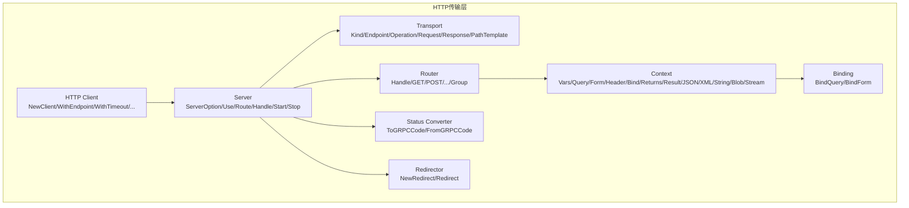
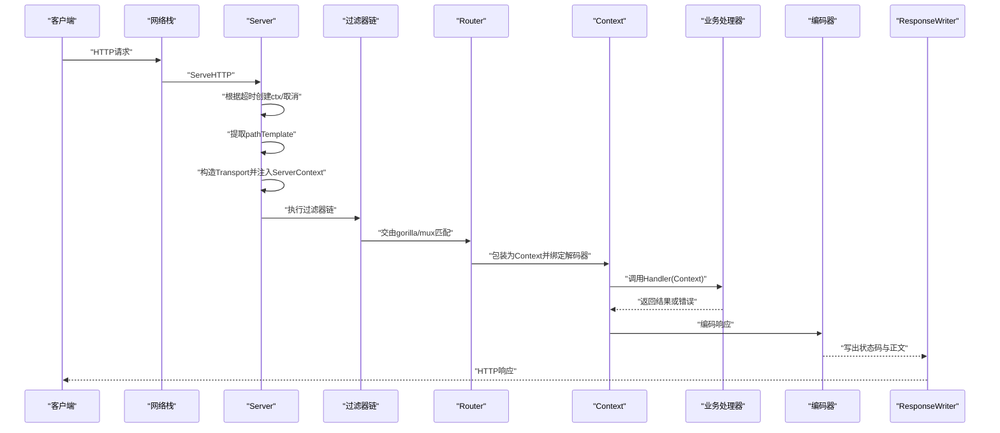
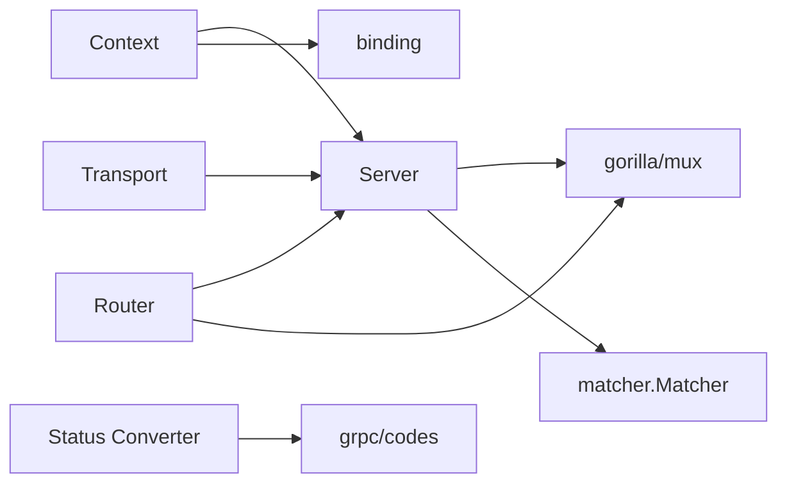

# HTTP传输层API

<cite>
**本文引用的文件**
- [transport.go](file://transport/http/transport.go)
- [server.go](file://transport/http/server.go)
- [router.go](file://transport/http/router.go)
- [context.go](file://transport/http/context.go)
- [status.go](file://transport/http/status/status.go)
- [redirect.go](file://transport/http/redirect.go)
- [bind.go](file://transport/http/binding/bind.go)
- [client.go](file://transport/http/client.go)
- [server_test.go](file://transport/http/server_test.go)
- [router_test.go](file://transport/http/router_test.go)
- [context_test.go](file://transport/http/context_test.go)
</cite>

## 目录
1. [简介](#简介)
2. [项目结构](#项目结构)
3. [核心组件](#核心组件)
4. [架构总览](#架构总览)
5. [组件详解](#组件详解)
6. [依赖关系分析](#依赖关系分析)
7. [性能与可用性](#性能与可用性)
8. [故障排查指南](#故障排查指南)
9. [结论](#结论)
10. [附录：示例与最佳实践](#附录示例与最佳实践)

## 简介
本文件面向HTTP传输层API的使用者与维护者，聚焦以下目标：
- 深入解析transport.go中HTTPTransport接口（通过Transport类型）的实现机制，明确GetKind、GetEndpoint等方法的行为边界与返回值语义。
- 全面说明server.go中Server结构体的配置选项（WithAddress、WithTimeout、WithRouter等），并给出参数约束与典型用法。
- 解释HTTP路由系统在router.go中的实现原理，包括路由匹配、中间件集成与上下文传递机制。
- 文档化context.go中的上下文扩展能力，说明如何在请求处理链中传递元数据。
- 覆盖错误处理、状态码映射与重定向机制在status.go与redirect.go中的实现。
- 提供服务端启动、路由注册与客户端调用的完整示例路径，以及常见使用模式与最佳实践。

## 项目结构
HTTP传输层位于transport/http子包，核心文件如下：
- transport.go：HTTP传输载体与Header Carrier实现，暴露Kind、Endpoint、Operation、Request、Response、PathTemplate等访问器。
- server.go：HTTP服务端封装，提供Server结构体及ServerOption配置项、路由注册入口、中间件与过滤器集成、生命周期管理。
- router.go：高层路由DSL，基于gorilla/mux，提供Handle/GET/POST等便捷方法，支持分组与过滤器链。
- context.go：HTTP上下文抽象，统一请求/响应读写、绑定解码、编码返回、中间件链接入点。
- status/status.go：HTTP与gRPC状态码互转工具。
- redirect.go：重定向器接口与实现，支持状态码与目标URL组合。
- binding/bind.go：查询参数、表单参数绑定工具。
- client.go：HTTP客户端封装（用于演示客户端调用流程）。
- 测试文件：server_test.go、router_test.go、context_test.go，展示典型用法与行为验证。

图表来源
- [transport.go](file://transport/http/transport.go#L1-L152)
- [server.go](file://transport/http/server.go#L1-L375)
- [router.go](file://transport/http/router.go#L1-L102)
- [context.go](file://transport/http/context.go#L1-L188)
- [status.go](file://transport/http/status/status.go#L1-L113)
- [redirect.go](file://transport/http/redirect.go#L1-L19)
- [bind.go](file://transport/http/binding/bind.go#L1-L30)
- [client.go](file://transport/http/client.go#L1-L200)

章节来源
- [transport.go](file://transport/http/transport.go#L1-L152)
- [server.go](file://transport/http/server.go#L1-L375)
- [router.go](file://transport/http/router.go#L1-L102)
- [context.go](file://transport/http/context.go#L1-L188)
- [status.go](file://transport/http/status/status.go#L1-L113)
- [redirect.go](file://transport/http/redirect.go#L1-L19)
- [bind.go](file://transport/http/binding/bind.go#L1-L30)
- [client.go](file://transport/http/client.go#L1-L200)

## 核心组件
- Transport（HTTP传输载体）
  - 提供Kind、Endpoint、Operation、Request、RequestHeader、Response、ReplyHeader、PathTemplate等访问器。
  - 支持设置操作名、写入Cookie、从上下文提取Request与ResponseWriter。
- Server（HTTP服务端）
  - 通过ServerOption构建，支持网络、地址、超时、中间件、过滤器、编解码器、TLS、StrictSlash、监听器、路由前缀等配置。
  - 提供Route、Handle、HandleFunc、HandleHeader、HandlePrefix等路由注册方法；提供Start/Stop生命周期管理。
- Router（HTTP路由DSL）
  - 基于gorilla/mux，提供Handle与各HTTP方法快捷方法；支持分组与过滤器链叠加。
- Context（HTTP上下文）
  - 统一请求/响应读写、绑定解码、编码返回、中间件链接入点；支持Deadline/Done/Err/Value等上下文能力。
- Status Converter（状态码转换）
  - 提供HTTP与gRPC状态码双向映射。
- Redirector（重定向）
  - 提供重定向目标URL与状态码组合。

章节来源
- [transport.go](file://transport/http/transport.go#L1-L152)
- [server.go](file://transport/http/server.go#L1-L375)
- [router.go](file://transport/http/router.go#L1-L102)
- [context.go](file://transport/http/context.go#L1-L188)
- [status.go](file://transport/http/status/status.go#L1-L113)
- [redirect.go](file://transport/http/redirect.go#L1-L19)

## 架构总览
下图展示了HTTP服务端从请求进入、路由匹配、中间件链、业务处理到响应写出的整体流程。

图表来源
- [server.go](file://transport/http/server.go#L269-L308)
- [router.go](file://transport/http/router.go#L44-L56)
- [context.go](file://transport/http/context.go#L62-L115)
- [transport.go](file://transport/http/transport.go#L29-L78)

## 组件详解

### Transport（HTTP传输载体）
- 接口与实现
  - Transport实现了Transporter与ResponseTransporter接口，提供Kind、Endpoint、Operation、Request、RequestHeader、Response、ReplyHeader、PathTemplate等方法。
  - headerCarrier对http.Header进行适配，提供Get/Set/Add/Keys/Values等操作。
- 关键方法行为
  - Kind：返回传输类型为HTTP。
  - Endpoint：返回服务端注册的endpoint字符串。
  - Operation：返回当前请求的操作名（通常为pathTemplate）。
  - Request/Response：分别返回底层的http.Request与http.ResponseWriter。
  - PathTemplate：返回当前匹配到的路由模板。
  - SetOperation：在服务端上下文中设置操作名。
  - SetCookie：向ResponseWriter写入Set-Cookie头。
  - RequestFromServerContext/ResponseWriterFromServerContext：从上下文中安全提取Request与ResponseWriter。
- 使用建议
  - 在中间件或业务逻辑中，优先通过transport.FromServerContext获取Transport实例，再调用对应方法。
  - 使用SetCookie时确保Cookie名称有效，避免被静默丢弃。

章节来源
- [transport.go](file://transport/http/transport.go#L1-L152)

### Server（HTTP服务端）
- 配置选项（ServerOption）
  - Network：网络协议（默认tcp）。
  - Address：监听地址（默认:0）。
  - Endpoint：显式指定服务端地址（可包含scheme与是否安全信息）。
  - Timeout：请求超时；>0使用带超时的context，否则使用带取消的context。
  - Logger：已废弃（建议使用全局日志）。
  - Middleware：按选择器应用服务级中间件。
  - Filter：HTTP过滤器（如CORS、鉴权等）。
  - RequestVarsDecoder/RequestQueryDecoder/RequestDecoder：请求参数解码器。
  - ResponseEncoder/ErrorEncoder：响应与错误编码器。
  - TLSConfig：TLS配置。
  - StrictSlash：是否启用严格斜杠（301/302重定向）。
  - Listener：自定义监听器。
  - PathPrefix：将路由注册到子路由器前缀下。
  - NotFoundHandler/MethodNotAllowedHandler：自定义未命中与方法不匹配处理器。
- 路由注册
  - Route(prefix string, filters ...FilterFunc)：创建路由分组。
  - Handle/HandleFunc/HandleHeader/HandlePrefix：直接注册路由。
  - WalkRoute/WalkHandle：遍历所有路由并回调。
- 生命周期
  - Start(ctx)：监听并启动HTTP服务，支持TLS。
  - Stop(ctx)：优雅关闭，超时则强制关闭。
  - Endpoint()：返回最终注册的endpoint。
- 过滤器与上下文
  - filter()中间件负责：
    - 根据超时创建ctx/取消；
    - 从当前路由提取pathTemplate；
    - 构造Transport并注入ServerContext；
    - 将请求交给后续处理器。
- 参数约束与注意事项
  - Timeout<=0时使用取消语义，可能影响Graceful Shutdown策略。
  - StrictSlash开启时，末尾斜杠与无斜杠路径会触发重定向。
  - 若未设置Listener，将自动创建监听器；若未设置Endpoint，将基于监听地址推导。

章节来源
- [server.go](file://transport/http/server.go#L1-L375)

### Router（HTTP路由DSL）
- 设计要点
  - 基于gorilla/mux，Handle支持指定HTTP方法与相对路径，内部拼接prefix形成完整路径。
  - 支持Group(prefix, filters...)进行分组与过滤器叠加。
  - 内部将Handler包装为http.Handler，先执行过滤器链，再调用业务Handler。
- 方法族
  - Handle(method, relativePath, handler, filters...)
  - GET/HEAD/POST/PUT/PATCH/DELETE/CONNECT/OPTIONS/TRACE
- 处理流程
  - 包装为Context；
  - 执行错误编码器（当handler返回非空错误）；
  - 应用过滤器链（路由级filters与Server级filters叠加）；
  - 注册到mux.Router并限制方法。

章节来源
- [router.go](file://transport/http/router.go#L1-L102)

### Context（HTTP上下文）
- 能力概览
  - 请求/响应：Header/Vars/Query/Form/Request/Response。
  - 中间件：Middleware(handler)返回按Transport.Operation或URL.Path匹配的服务端中间件链。
  - 绑定：Bind/BindVars/BindQuery/BindForm，分别绑定主体、路径变量、查询参数、表单。
  - 返回：Returns/Result/JSON/XML/String/Blob/Stream，统一封装编码与状态码设置。
  - 上下文：Deadline/Done/Err/Value，透传底层请求上下文。
- 实现细节
  - wrapper内嵌responseWriter，WriteHeader记录状态码，Write时统一写出状态码与正文。
  - Vars()基于gorilla/mux.Vars转换为url.Values。
  - Form()先ParseForm再返回。
  - Middleware()优先使用Transport.Operation（来自pathTemplate），否则回退到URL.Path。
- 使用建议
  - 优先使用Returns(Result)返回对象，避免手动设置Header与状态码。
  - 对于流式输出，使用Stream以减少内存占用。
  - 使用Bind系列方法时，确保解码器与Content-Type匹配。

章节来源
- [context.go](file://transport/http/context.go#L1-L188)
- [bind.go](file://transport/http/binding/bind.go#L1-L30)

### 错误处理、状态码映射与重定向
- 错误处理
  - Router在业务Handler返回错误时，调用Server的ErrorEncoder进行编码。
  - Server.Start/Stop提供日志与优雅关闭能力。
- 状态码映射（status/status.go）
  - Converter接口提供ToGRPCCode/FromGRPCCode双向映射，默认实现覆盖常用HTTP与gRPC状态码。
  - 特殊码：ClientClosed（499）映射Canceled。
- 重定向（redirect.go）
  - Redirector接口定义Redirect()返回URL与状态码。
  - NewRedirect(url, code)构造重定向器，支持相对路径与3xx状态码。
  - 若未设置Content-Type，会自动设置"text/html; charset=utf-8"并写入简短HTML体。

章节来源
- [router.go](file://transport/http/router.go#L44-L56)
- [status.go](file://transport/http/status/status.go#L1-L113)
- [redirect.go](file://transport/http/redirect.go#L1-L19)

## 依赖关系分析
- 组件耦合
  - Server依赖gorilla/mux进行路由匹配与中间件注入。
  - Router依赖Server的编解码器与错误编码器。
  - Context依赖Server的解码器与中间件匹配器。
  - Transport作为上下文载体，贯穿请求全链路。
- 可能的循环依赖
  - 当前文件组织清晰，未见循环导入迹象。
- 外部依赖
  - gorilla/mux用于路由与中间件。
  - google.golang.org/grpc/codes用于状态码映射。
  - 标准库net/http、crypto/tls、encoding等。

图表来源
- [server.go](file://transport/http/server.go#L1-L375)
- [router.go](file://transport/http/router.go#L1-L102)
- [context.go](file://transport/http/context.go#L1-L188)
- [status.go](file://transport/http/status/status.go#L1-L113)

## 性能与可用性
- 超时控制
  - Server在filter()中根据Timeout创建带超时或带取消的上下文，有助于防止慢请求拖垮服务。
- 编解码与绑定
  - 默认解码器与编码器可替换，建议针对大对象使用流式编码（Stream）以降低内存峰值。
- 中间件链
  - 服务端中间件按Transport.Operation匹配，建议合理划分前缀与选择器，避免链过长。
- 重定向与StrictSlash
  - 启用StrictSlash会产生额外重定向，建议在生产环境谨慎使用，或通过反向代理统一处理。

[本节为通用指导，无需列出具体文件来源]

## 故障排查指南
- 无法获取Transport或ResponseWriter
  - 确认请求已进入Server过滤器链并成功注入ServerContext。
  - 使用RequestFromServerContext/ResponseWriterFromServerContext进行安全提取。
- 路由不匹配或方法不匹配
  - 使用Server.WalkRoute/WalkHandle检查已注册路由。
  - 检查Router.Handle注册时的方法与路径是否正确。
- 中间件未生效
  - 确认Server.Use选择器与请求路径匹配。
  - 检查Context.Middleware返回的链是否为空。
- 状态码异常
  - 检查ErrorEncoder是否正确设置状态码。
  - 使用Status Converter进行HTTP与gRPC状态码互转时，确认映射规则符合预期。
- 重定向问题
  - 检查StrictSlash与路由末尾斜杠的一致性。
  - 使用NewRedirect时确保状态码在3xx范围内且URL合法。

章节来源
- [server.go](file://transport/http/server.go#L215-L241)
- [router.go](file://transport/http/router.go#L44-L56)
- [context.go](file://transport/http/context.go#L94-L115)
- [status.go](file://transport/http/status/status.go#L1-L113)
- [redirect.go](file://transport/http/redirect.go#L1-L19)

## 结论
本HTTP传输层API以Transport为核心载体，围绕Server、Router、Context构建了清晰的请求处理链：从过滤器与路由匹配，到中间件链与业务处理，再到编码返回与错误处理。通过Transport.Operation与Context.Middleware，系统实现了按路径模板的中间件选择；通过Status Converter与Redirector，提供了跨协议的状态码映射与重定向能力。配合丰富的ServerOption与Router DSL，开发者可以快速搭建高性能、可扩展的HTTP服务。

[本节为总结性内容，无需列出具体文件来源]

## 附录：示例与最佳实践

### 示例一：服务端启动与路由注册
- 服务端启动
  - 使用NewServer创建实例，设置Address、Timeout、Middleware、Filter等选项。
  - 通过Route注册路由，使用GET/POST等方法绑定业务处理器。
  - 调用Start(ctx)启动服务，Stop(ctx)优雅关闭。
- 参考路径
  - [server_test.go](file://transport/http/server_test.go#L84-L116)
  - [server_test.go](file://transport/http/server_test.go#L172-L200)

章节来源
- [server.go](file://transport/http/server.go#L177-L204)
- [server.go](file://transport/http/server.go#L243-L262)
- [server.go](file://transport/http/server.go#L322-L354)
- [server_test.go](file://transport/http/server_test.go#L84-L116)

### 示例二：路由注册与中间件集成
- 路由分组与过滤器
  - 使用Server.Route("/v1")创建分组，再在分组上注册GET/POST等方法。
  - 在Handle/GET等方法中传入FilterFunc，实现CORS、鉴权等横切关注点。
  - 使用Server.Use(selector, m...)为服务端中间件设置选择器。
- 参考路径
  - [router_test.go](file://transport/http/router_test.go#L55-L95)
  - [router_test.go](file://transport/http/router_test.go#L97-L175)

章节来源
- [router.go](file://transport/http/router.go#L36-L56)
- [router.go](file://transport/http/router.go#L58-L102)
- [server.go](file://transport/http/server.go#L206-L214)

### 示例三：上下文扩展与数据传递
- 绑定与返回
  - 使用Context.Bind/BindVars/BindQuery/BindForm进行参数绑定。
  - 使用Context.Returns/Result/JSON/XML/String/Blob/Stream统一返回。
  - 使用Context.Middleware按Transport.Operation匹配中间件链。
- 参考路径
  - [context_test.go](file://transport/http/context_test.go#L1-L200)
  - [context.go](file://transport/http/context.go#L94-L153)

章节来源
- [context.go](file://transport/http/context.go#L62-L153)
- [bind.go](file://transport/http/binding/bind.go#L1-L30)

### 示例四：错误处理与状态码映射
- 错误编码
  - Router在Handler返回错误时调用Server的ErrorEncoder进行编码。
- 状态码映射
  - 使用Status.Converter.ToGRPCCode/FromGRPCCode在HTTP与gRPC之间转换。
- 参考路径
  - [router.go](file://transport/http/router.go#L44-L56)
  - [status.go](file://transport/http/status/status.go#L1-L113)

章节来源
- [router.go](file://transport/http/router.go#L44-L56)
- [status.go](file://transport/http/status/status.go#L1-L113)

### 示例五：重定向机制
- 使用NewRedirect(url, code)创建重定向器，返回Redirect()组合URL与状态码。
- 注意：若未设置Content-Type，会自动设置默认类型并写入简短HTML体。
- 参考路径
  - [redirect.go](file://transport/http/redirect.go#L1-L19)

章节来源
- [redirect.go](file://transport/http/redirect.go#L1-L19)

### 示例六：客户端调用
- 客户端创建与调用
  - 使用NewClient创建HTTP客户端，设置WithEndpoint、WithTimeout、WithMiddleware等选项。
  - 通过Do发起请求，接收响应并解析。
- 参考路径
  - [client.go](file://transport/http/client.go#L161-L200)
  - [server_test.go](file://transport/http/server_test.go#L172-L200)

章节来源
- [client.go](file://transport/http/client.go#L1-L200)
- [server_test.go](file://transport/http/server_test.go#L172-L200)

### 最佳实践
- 路由设计
  - 使用Route分组管理版本与模块，保持路径前缀一致。
  - 合理设置StrictSlash，避免不必要的重定向。
- 中间件
  - 将CORS、鉴权、限流等中间件放在过滤器链前端，减少无效处理。
  - 使用Server.Use选择器精确匹配路径范围。
- 编解码
  - 对大对象使用流式编码（Stream），避免一次性加载到内存。
  - 明确Content-Type，确保Bind/Encode正确工作。
- 错误处理
  - 在业务Handler中返回结构化错误，由ErrorEncoder统一编码。
  - 使用Status Converter在多协议场景下保持一致性。
- 重定向
  - 仅在必要时使用重定向，优先通过反向代理统一处理路径规范化。

[本节为通用指导，无需列出具体文件来源]