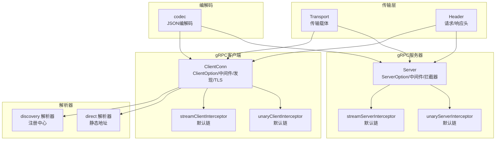
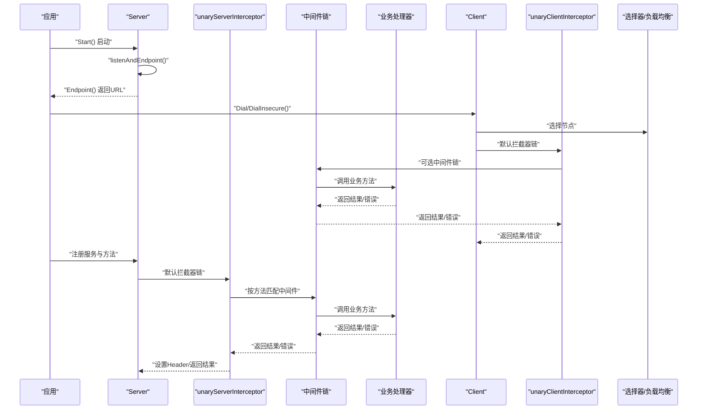
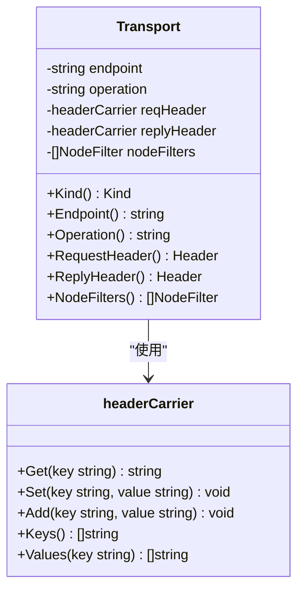
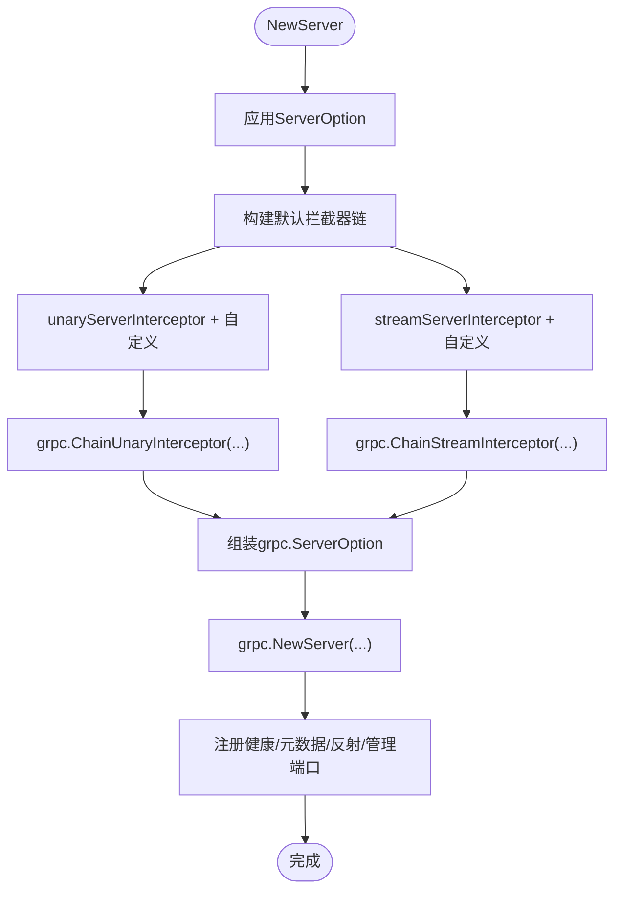
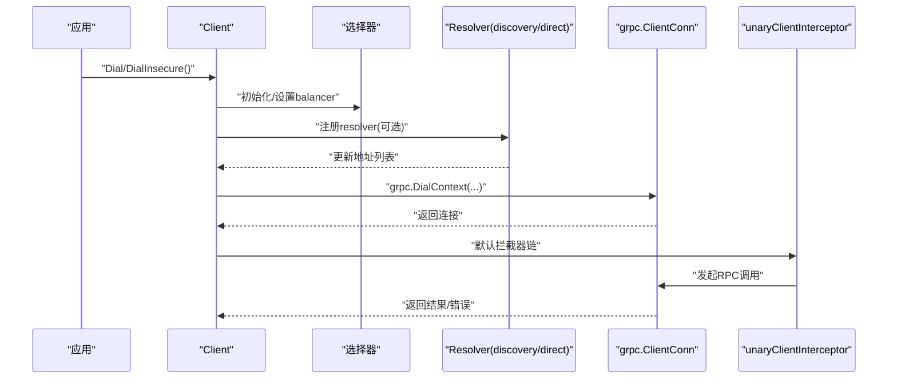
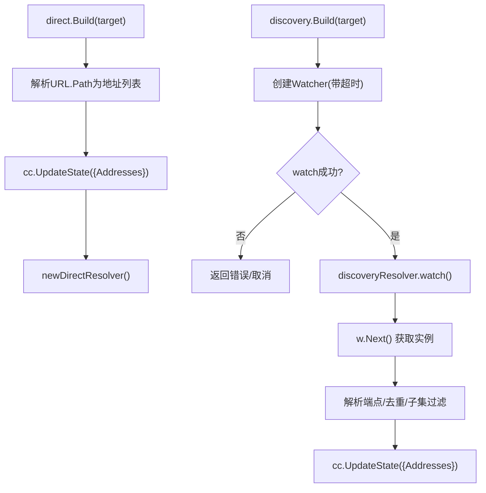
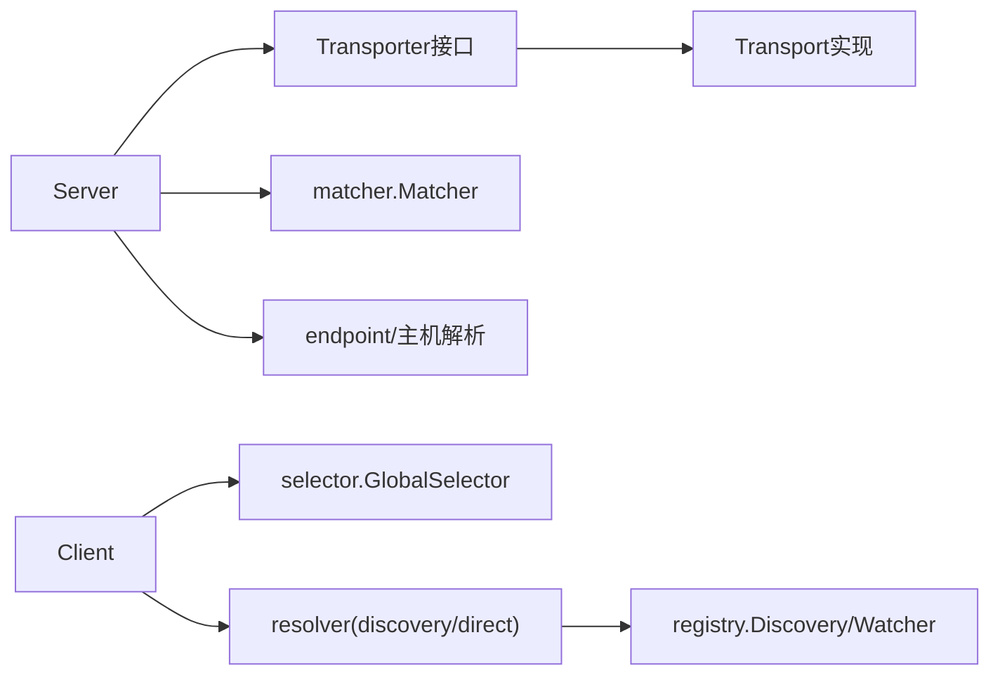

# gRPC传输层API

<cite>
**本文引用的文件列表**
- [transport/grpc/transport.go](file://transport/grpc/transport.go)
- [transport/grpc/server.go](file://transport/grpc/server.go)
- [transport/grpc/interceptor.go](file://transport/grpc/interceptor.go)
- [transport/grpc/client.go](file://transport/grpc/client.go)
- [transport/grpc/codec.go](file://transport/grpc/codec.go)
- [transport/grpc/resolver/direct/builder.go](file://transport/grpc/resolver/direct/builder.go)
- [transport/grpc/resolver/direct/resolver.go](file://transport/grpc/resolver/direct/resolver.go)
- [transport/grpc/resolver/discovery/builder.go](file://transport/grpc/resolver/discovery/builder.go)
- [transport/grpc/resolver/discovery/resolver.go](file://transport/grpc/resolver/discovery/resolver.go)
- [transport/transport.go](file://transport/transport.go)
- [internal/testdata/helloworld/helloworld.proto](file://internal/testdata/helloworld/helloworld.proto)
- [transport/grpc/server_test.go](file://transport/grpc/server_test.go)
- [transport/grpc/client_test.go](file://transport/grpc/client_test.go)
</cite>

## 目录
1. [简介](#简介)
2. [项目结构](#项目结构)
3. [核心组件](#核心组件)
4. [架构总览](#架构总览)
5. [详细组件分析](#详细组件分析)
6. [依赖关系分析](#依赖关系分析)
7. [性能考量](#性能考量)
8. [故障排查指南](#故障排查指南)
9. [结论](#结论)
10. [附录：服务定义、启动与调用示例](#附录服务定义启动与调用示例)

## 简介
本文件面向gRPC传输层API，系统性梳理Kratos框架在transport/grpc子包中的设计与实现，重点覆盖：
- GRPCTransport接口（即Transport类型）的设计原理与方法语义
- server.go中gRPC Server的配置选项与拦截器注册机制
- interceptor.go中默认拦截器链的构建方式与扩展点
- 服务端与客户端的创建流程、服务注册、方法绑定与调用选项配置
- resolver包中direct与discovery两种解析器的实现差异与使用场景
- 完整的gRPC服务定义、启动与调用示例，以及与Protobuf的集成方式
- 上下文传递、错误码映射与性能调优建议

## 项目结构
transport/grpc子包围绕“传输载体”“服务器”“客户端”“拦截器”“解析器”“编解码器”等模块组织，形成清晰的分层职责：
- 传输载体：定义统一的Transport接口及Header抽象，贯穿服务端与客户端
- 服务器：封装grpc.Server，提供ServerOption配置、中间件匹配、健康检查、反射与管理端口注册
- 客户端：封装grpc.ClientConn，提供ClientOption配置、中间件链、负载均衡、发现与TLS
- 拦截器：为Unary/Stream分别注入默认拦截器链，支持自定义拦截器叠加
- 解析器：direct用于静态地址解析；discovery基于注册中心动态拉取实例
- 编解码器：以JSON编码作为默认codec，兼容Protobuf消息

图表来源
- [transport/grpc/transport.go](file://transport/grpc/transport.go#L1-L85)
- [transport/grpc/server.go](file://transport/grpc/server.go#L1-L278)
- [transport/grpc/interceptor.go](file://transport/grpc/interceptor.go#L1-L149)
- [transport/grpc/client.go](file://transport/grpc/client.go#L1-L334)
- [transport/grpc/resolver/direct/builder.go](file://transport/grpc/resolver/direct/builder.go#L1-L42)
- [transport/grpc/resolver/discovery/builder.go](file://transport/grpc/resolver/discovery/builder.go#L1-L131)
- [transport/grpc/codec.go](file://transport/grpc/codec.go#L1-L39)

章节来源
- [transport/grpc/transport.go](file://transport/grpc/transport.go#L1-L85)
- [transport/grpc/server.go](file://transport/grpc/server.go#L1-L278)
- [transport/grpc/client.go](file://transport/grpc/client.go#L1-L334)
- [transport/grpc/interceptor.go](file://transport/grpc/interceptor.go#L1-L149)
- [transport/grpc/resolver/direct/builder.go](file://transport/grpc/resolver/direct/builder.go#L1-L42)
- [transport/grpc/resolver/discovery/builder.go](file://transport/grpc/resolver/discovery/builder.go#L1-L131)
- [transport/grpc/codec.go](file://transport/grpc/codec.go#L1-L39)

## 核心组件
- Transport（传输载体）
  - 提供Kind、Endpoint、Operation、RequestHeader、ReplyHeader、NodeFilters等方法，统一gRPC上下文中的传输信息
  - headerCarrier实现Header接口，适配metadata.MD
- Server（gRPC服务器）
  - 通过ServerOption组合网络、地址、超时、中间件、拦截器、TLS、监听器、gRPC原生选项等
  - 默认注入unary/stream拦截器链，支持自定义拦截器追加
  - 注册健康检查、元数据服务、反射与管理端口
- Client（gRPC客户端）
  - 通过ClientOption组合端点、超时、中间件、流中间件、发现、TLS、拦截器、gRPC原生选项、节点过滤器等
  - 默认注入unary/stream拦截器链，支持自定义拦截器追加
  - 基于全局选择器与负载均衡策略进行节点选择
- 解析器（Resolver）
  - direct：scheme为direct，直接从目标路径解析逗号分隔的地址列表
  - discovery：scheme为discovery，基于注册中心Watcher动态推送实例，支持子集过滤与调试日志
- 编解码器（Codec）
  - 默认注册JSON编解码器，兼容Protobuf消息序列化

章节来源
- [transport/grpc/transport.go](file://transport/grpc/transport.go#L1-L85)
- [transport/grpc/server.go](file://transport/grpc/server.go#L1-L278)
- [transport/grpc/client.go](file://transport/grpc/client.go#L1-L334)
- [transport/grpc/resolver/direct/builder.go](file://transport/grpc/resolver/direct/builder.go#L1-L42)
- [transport/grpc/resolver/discovery/builder.go](file://transport/grpc/resolver/discovery/builder.go#L1-L131)
- [transport/grpc/codec.go](file://transport/grpc/codec.go#L1-L39)

## 架构总览
下图展示了gRPC服务端与客户端在Kratos中的关键交互路径，包括默认拦截器链、中间件匹配、Header传递与上下文传播。

图表来源
- [transport/grpc/server.go](file://transport/grpc/server.go#L153-L203)
- [transport/grpc/interceptor.go](file://transport/grpc/interceptor.go#L16-L48)
- [transport/grpc/client.go](file://transport/grpc/client.go#L153-L215)

## 详细组件分析

### 传输载体：GRPCTransport（Transport）
- 设计要点
  - 统一Kind、Endpoint、Operation、Header访问，屏蔽底层协议差异
  - headerCarrier对metadata.MD进行适配，提供Get/Set/Add/Keys/Values操作
  - NodeFilters用于客户端节点过滤
- 方法语义
  - Kind：返回传输类型标识
  - Endpoint：返回服务端或客户端端点字符串
  - Operation：返回完整方法名（如“/pkg.Service/Method”）
  - RequestHeader/ReplyHeader：分别提供请求与响应头访问
  - NodeFilters：客户端侧节点过滤器集合

图表来源
- [transport/grpc/transport.go](file://transport/grpc/transport.go#L1-L85)

章节来源
- [transport/grpc/transport.go](file://transport/grpc/transport.go#L1-L85)
- [transport/transport.go](file://transport/transport.go#L1-L96)

### 服务器：Server配置与拦截器链
- 配置选项（ServerOption）
  - Network/Address/Endpoint：网络与监听地址
  - Timeout：默认超时
  - Middleware/StreamMiddleware：按路径匹配的中间件
  - TLSConfig：TLS配置
  - Listener：自定义监听器
  - UnaryInterceptor/StreamInterceptor：追加拦截器
  - Options：透传grpc.ServerOption
  - CustomHealth/DisableReflection：健康检查与反射开关
- 默认拦截器链
  - unaryServerInterceptor：合并baseCtx、提取入站metadata、构造Transport、注入超时、匹配中间件、设置出站Header
  - streamServerInterceptor：包装ServerStream，按方法匹配中间件，转发SendMsg/RecvMsg到中间件链
- 服务注册
  - 注册健康检查、元数据服务、反射与管理端口

图表来源
- [transport/grpc/server.go](file://transport/grpc/server.go#L153-L203)
- [transport/grpc/interceptor.go](file://transport/grpc/interceptor.go#L16-L48)

章节来源
- [transport/grpc/server.go](file://transport/grpc/server.go#L1-L278)
- [transport/grpc/interceptor.go](file://transport/grpc/interceptor.go#L1-L149)

### 客户端：连接、拦截器与发现
- 连接选项（ClientOption）
  - WithEndpoint/WithTimeout/WithMiddleware/WithStreamMiddleware/WithDiscovery/WithTLSConfig/WithUnaryInterceptor/WithStreamInterceptor/WithOptions/WithNodeFilter/WithHealthCheck/WithPrintDiscoveryDebugLog
- 默认拦截器链
  - unaryClientInterceptor：构造Transport、注入超时、将请求头写入出站metadata、执行中间件链、记录Peer信息
  - streamClientInterceptor：包装ClientStream，按方法匹配中间件，转发SendMsg/RecvMsg到中间件链
- 发现与负载均衡
  - 若配置discovery，则通过discovery.NewBuilder注册resolver，支持子集过滤与调试日志
  - 全局选择器默认使用wrr（加权轮询），可替换为其他balancer

图表来源
- [transport/grpc/client.go](file://transport/grpc/client.go#L153-L215)
- [transport/grpc/resolver/discovery/builder.go](file://transport/grpc/resolver/discovery/builder.go#L81-L125)
- [transport/grpc/resolver/direct/builder.go](file://transport/grpc/resolver/direct/builder.go#L25-L37)

章节来源
- [transport/grpc/client.go](file://transport/grpc/client.go#L1-L334)
- [transport/grpc/resolver/discovery/builder.go](file://transport/grpc/resolver/discovery/builder.go#L1-L131)
- [transport/grpc/resolver/direct/builder.go](file://transport/grpc/resolver/direct/builder.go#L1-L42)

### 解析器：direct与discovery
- direct解析器
  - scheme为direct，目标格式示例：direct://<authority>/127.0.0.1:9000,127.0.0.2:9000
  - Build阶段将逗号分隔的地址列表写入ClientConn.State
- discovery解析器
  - scheme为discovery，通过注册中心Watcher持续拉取实例
  - 支持超时控制、子集过滤、调试日志、安全标志与属性透传
  - watch循环处理Next()返回的实例列表，去重后写入ClientConn.State

图表来源
- [transport/grpc/resolver/direct/builder.go](file://transport/grpc/resolver/direct/builder.go#L25-L37)
- [transport/grpc/resolver/direct/resolver.go](file://transport/grpc/resolver/direct/resolver.go#L1-L16)
- [transport/grpc/resolver/discovery/builder.go](file://transport/grpc/resolver/discovery/builder.go#L81-L125)
- [transport/grpc/resolver/discovery/resolver.go](file://transport/grpc/resolver/discovery/resolver.go#L31-L98)

章节来源
- [transport/grpc/resolver/direct/builder.go](file://transport/grpc/resolver/direct/builder.go#L1-L42)
- [transport/grpc/resolver/direct/resolver.go](file://transport/grpc/resolver/direct/resolver.go#L1-L16)
- [transport/grpc/resolver/discovery/builder.go](file://transport/grpc/resolver/discovery/builder.go#L1-L131)
- [transport/grpc/resolver/discovery/resolver.go](file://transport/grpc/resolver/discovery/resolver.go#L1-L116)

### 编解码器：与Protobuf集成
- 默认注册JSON编解码器，内部将Protobuf消息委托给JSON编解码器
- 适用于gRPC默认codec场景，便于调试与跨语言互通

章节来源
- [transport/grpc/codec.go](file://transport/grpc/codec.go#L1-L39)

## 依赖关系分析
- 传输接口
  - transport.Transporter定义了Kind/Endpoint/Operation/Header等能力，Transport实现该接口
- 服务器依赖
  - Server实现transport.Server与transport.Endpointer
  - 依赖matcher.Matcher进行中间件匹配
  - 依赖internal/host与internal/endpoint生成最终注册端点
- 客户端依赖
  - ClientOption组合多种配置，dial函数组装grpc.DialOption
  - 依赖selector.GlobalSelector与balancerName进行负载均衡
- 解析器依赖
  - discovery依赖registry.Discovery与registry.Watcher
  - direct依赖标准resolver.Builder

图表来源
- [transport/transport.go](file://transport/transport.go#L1-L96)
- [transport/grpc/server.go](file://transport/grpc/server.go#L1-L278)
- [transport/grpc/client.go](file://transport/grpc/client.go#L1-L334)
- [transport/grpc/resolver/discovery/builder.go](file://transport/grpc/resolver/discovery/builder.go#L1-L131)
- [transport/grpc/resolver/direct/builder.go](file://transport/grpc/resolver/direct/builder.go#L1-L42)

章节来源
- [transport/transport.go](file://transport/transport.go#L1-L96)
- [transport/grpc/server.go](file://transport/grpc/server.go#L1-L278)
- [transport/grpc/client.go](file://transport/grpc/client.go#L1-L334)

## 性能考量
- 超时控制
  - 服务器端：通过Timeout选项设置默认超时，拦截器内为每个请求创建带超时的context
  - 客户端：通过WithTimeout设置默认超时，拦截器内为每次调用创建带超时的context
- 负载均衡与选择器
  - 客户端默认使用wrr选择器，可结合NodeFilter进行节点过滤
  - discovery解析器支持子集过滤，减少连接数与抖动
- 中间件链
  - 仅在匹配到对应路径/方法时才启用中间件，避免不必要的开销
- 编解码
  - JSON编解码便于调试，生产环境可根据需要切换更高效的codec
- 反射与健康检查
  - 生产环境建议关闭反射，仅保留必要健康检查

[本节为通用指导，不直接分析具体文件]

## 故障排查指南
- 服务器优雅停机
  - Stop采用GracefulStop，若在超时内无法优雅停止则强制Stop，并输出警告日志
- 解析器问题
  - discovery解析器watch失败会记录错误日志，注意检查注册中心可用性与网络连通性
  - direct解析器需确保URL格式正确且地址列表有效
- 中间件异常
  - 服务器端与客户端均在拦截器内捕获panic并返回错误，确保服务稳定性
- 示例参考
  - server_test与client_test提供了典型启动、调用与断言逻辑，可对照定位问题

章节来源
- [transport/grpc/server.go](file://transport/grpc/server.go#L236-L257)
- [transport/grpc/resolver/discovery/resolver.go](file://transport/grpc/resolver/discovery/resolver.go#L31-L49)
- [transport/grpc/server_test.go](file://transport/grpc/server_test.go#L378-L483)
- [transport/grpc/client_test.go](file://transport/grpc/client_test.go#L1-L168)

## 结论
Kratos的gRPC传输层通过Transport统一抽象、Server/Client的丰富配置项、默认拦截器链与中间件匹配机制，以及direct/discovery解析器，实现了高可扩展、易维护的gRPC通信栈。开发者可在不改变业务代码的前提下，灵活配置TLS、超时、中间件、负载均衡与服务发现，满足不同场景下的性能与可靠性需求。

[本节为总结性内容，不直接分析具体文件]

## 附录：服务定义、启动与调用示例

### Protobuf服务定义
- 示例服务：Greeter，包含SayHello与SayHelloStream两个方法
- 服务与消息定义位于测试数据目录，可作为实际工程模板

章节来源
- [internal/testdata/helloworld/helloworld.proto](file://internal/testdata/helloworld/helloworld.proto#L1-L30)

### 服务端启动与方法绑定
- 创建Server并应用选项（如中间件、拦截器、TLS、监听器等）
- 注册服务与方法实现
- Endpoint()获取真实监听地址
- Start()启动服务，Stop()优雅停机

章节来源
- [transport/grpc/server.go](file://transport/grpc/server.go#L153-L203)
- [transport/grpc/server_test.go](file://transport/grpc/server_test.go#L73-L111)

### 客户端调用
- Dial/DialInsecure建立连接，支持TLS与发现
- 通过ClientOption配置中间件、超时、拦截器与节点过滤
- 使用生成的客户端调用服务方法，支持Unary与Stream

章节来源
- [transport/grpc/client.go](file://transport/grpc/client.go#L153-L215)
- [transport/grpc/server_test.go](file://transport/grpc/server_test.go#L112-L172)

### 上下文传递与Header
- 服务器端：unaryServerInterceptor与streamServerInterceptor将Transport注入ServerContext，ReplyHeader可用于设置响应头
- 客户端：unaryClientInterceptor将Transport注入ClientContext，RequestHeader可用于设置请求头

章节来源
- [transport/grpc/interceptor.go](file://transport/grpc/interceptor.go#L16-L48)
- [transport/grpc/interceptor.go](file://transport/grpc/interceptor.go#L69-L103)
- [transport/grpc/client.go](file://transport/grpc/client.go#L217-L249)

### 错误码映射
- 服务器端与客户端均通过中间件链与拦截器进行错误处理，示例中使用自定义错误类型进行映射
- 测试用例展示了错误与panic的处理路径

章节来源
- [transport/grpc/server_test.go](file://transport/grpc/server_test.go#L32-L71)