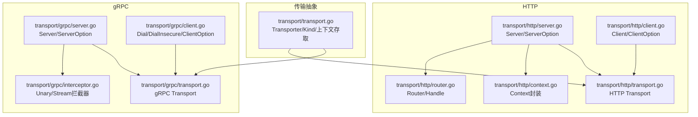
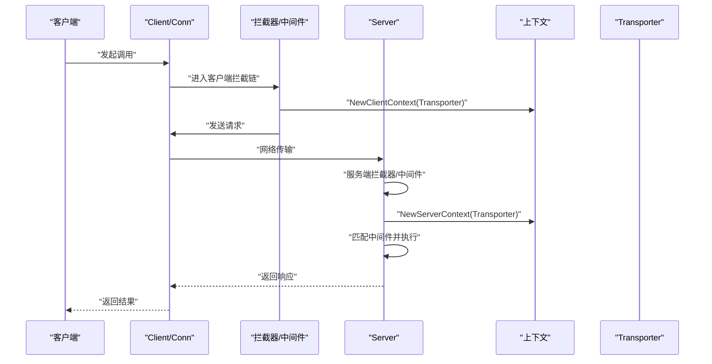
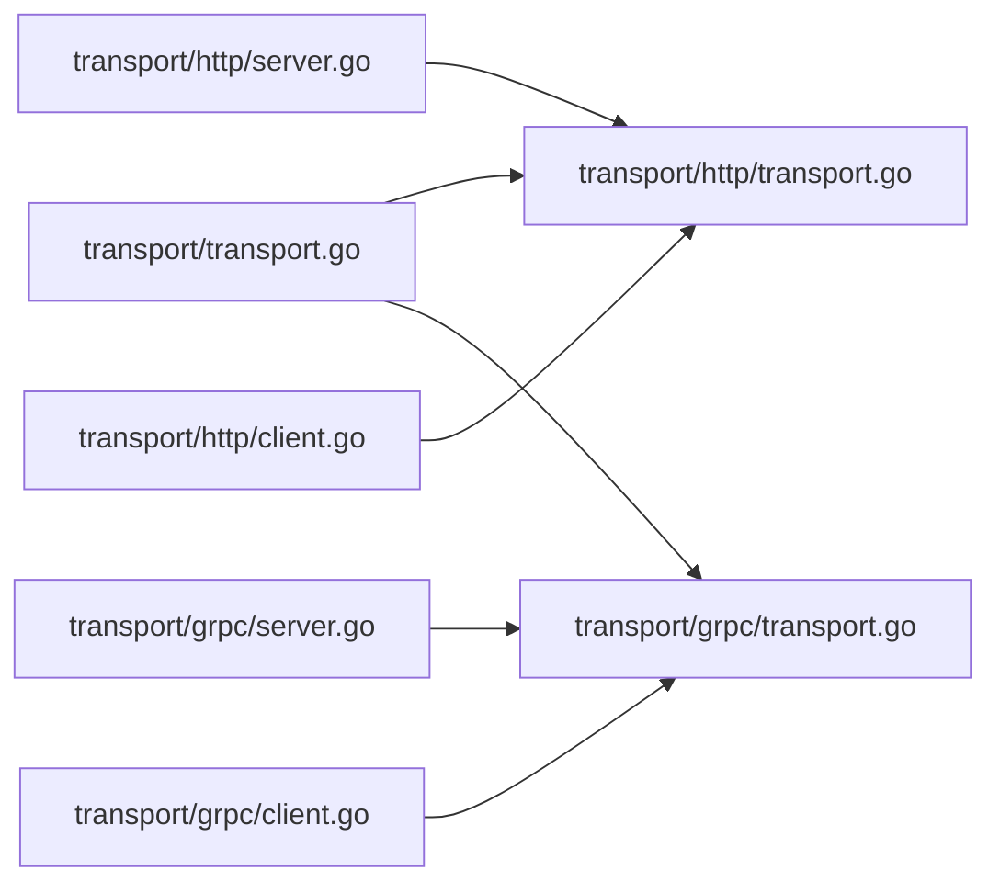

# 传输层API

<cite>
**本文引用的文件**
- [transport.go](file://transport/transport.go)
- [server.go（HTTP）](file://transport/http/server.go)
- [server.go（gRPC）](file://transport/grpc/server.go)
- [client.go（HTTP）](file://transport/http/client.go)
- [client.go（gRPC）](file://transport/grpc/client.go)
- [interceptor.go（gRPC）](file://transport/grpc/interceptor.go)
- [transport.go（HTTP）](file://transport/http/transport.go)
- [transport.go（gRPC）](file://transport/grpc/transport.go)
- [router.go（HTTP）](file://transport/http/router.go)
- [context.go（HTTP）](file://transport/http/context.go)
- [helloworld_grpc.pb.go（示例）](file://internal/testdata/helloworld/helloworld_grpc.pb.go)
</cite>

## 目录
1. [简介](#简介)
2. [项目结构](#项目结构)
3. [核心组件](#核心组件)
4. [架构总览](#架构总览)
5. [详细组件分析](#详细组件分析)
6. [依赖关系分析](#依赖关系分析)
7. [性能与选型建议](#性能与选型建议)
8. [故障排查指南](#故障排查指南)
9. [结论](#结论)

## 简介
本文件面向开发者，系统性梳理 Kratos 传输层API，覆盖 HTTP 与 gRPC 两种传输协议。重点文档化：
- Transport 接口的 GetKind、GetEndpoint 等方法在 HTTP/gRPC 中的实现语义
- HTTP 传输层 Server 的配置项（WithAddress、WithTimeout 等）
- gRPC 传输层 ServerOption 配置与拦截器集成方式
- 服务端与客户端的创建示例路径
- 端点管理、上下文传递与错误处理机制
- 性能特征与适用场景对比及选型建议

## 项目结构
传输层位于 transport 子目录，按协议拆分：
- transport/transport.go：统一的传输抽象与上下文存取
- transport/http：HTTP 协议的服务端、客户端、路由、上下文包装
- transport/grpc：gRPC 协议的服务端、客户端、拦截器、传输载体

图表来源
- [transport.go](file://transport/transport.go#L1-L96)
- [server.go（HTTP）](file://transport/http/server.go#L1-L375)
- [server.go（gRPC）](file://transport/grpc/server.go#L1-L278)
- [client.go（HTTP）](file://transport/http/client.go#L1-L385)
- [client.go（gRPC）](file://transport/grpc/client.go#L1-L334)
- [interceptor.go（gRPC）](file://transport/grpc/interceptor.go#L1-L149)
- [transport.go（HTTP）](file://transport/http/transport.go#L1-L152)
- [transport.go（gRPC）](file://transport/grpc/transport.go#L1-L85)
- [router.go（HTTP）](file://transport/http/router.go#L1-L102)
- [context.go（HTTP）](file://transport/http/context.go#L1-L188)

章节来源
- [transport.go](file://transport/transport.go#L1-L96)
- [server.go（HTTP）](file://transport/http/server.go#L1-L375)
- [server.go（gRPC）](file://transport/grpc/server.go#L1-L278)
- [client.go（HTTP）](file://transport/http/client.go#L1-L385)
- [client.go（gRPC）](file://transport/grpc/client.go#L1-L334)
- [interceptor.go（gRPC）](file://transport/grpc/interceptor.go#L1-L149)
- [transport.go（HTTP）](file://transport/http/transport.go#L1-L152)
- [transport.go（gRPC）](file://transport/grpc/transport.go#L1-L85)
- [router.go（HTTP）](file://transport/http/router.go#L1-L102)
- [context.go（HTTP）](file://transport/http/context.go#L1-L188)

## 核心组件
- 统一传输抽象
  - Transporter 接口：定义 Kind、Endpoint、Operation、RequestHeader、ReplyHeader 等能力
  - Kind：区分 grpc/http
  - 上下文存取：NewServerContext/NewClientContext 与 FromServerContext/FromClientContext
- HTTP Server
  - ServerOption：Network、Address、Endpoint、Timeout、Middleware、Filter、TLSConfig、Listener、PathPrefix、StrictSlash、NotFoundHandler、MethodNotAllowedHandler 等
  - 路由与中间件：Use、Route、Handle/Header/Func、WalkRoute/WalkHandle
  - 生命周期：Start、Stop、Endpoint
- gRPC Server
  - ServerOption：Network、Address、Endpoint、Timeout、Middleware、StreamMiddleware、UnaryInterceptor、StreamInterceptor、TLSConfig、Listener、Options、CustomHealth、DisableReflection
  - 生命周期：Start、Stop、Endpoint
- HTTP Client
  - ClientOption：WithTimeout、WithUserAgent、WithMiddleware、WithEndpoint、WithRequestEncoder、WithResponseDecoder、WithErrorDecoder、WithDiscovery、WithNodeFilter、WithBlock、WithTLSConfig、WithTransport、WithSubset
  - 调用：Invoke/Do，内置默认编解码器与错误解码器
- gRPC Client
  - ClientOption：WithEndpoint、WithTimeout、WithMiddleware、WithStreamMiddleware、WithDiscovery、WithTLSConfig、WithUnaryInterceptor、WithStreamInterceptor、WithOptions、WithNodeFilter、WithHealthCheck、WithOptions、WithPrintDiscoveryDebugLog
  - 连接：Dial/DialInsecure，支持发现与负载均衡

章节来源
- [transport.go](file://transport/transport.go#L1-L96)
- [server.go（HTTP）](file://transport/http/server.go#L1-L375)
- [server.go（gRPC）](file://transport/grpc/server.go#L1-L278)
- [client.go（HTTP）](file://transport/http/client.go#L1-L385)
- [client.go（gRPC）](file://transport/grpc/client.go#L1-L334)

## 架构总览
HTTP 与 gRPC 在传输层均通过统一的 Transporter 抽象承载请求元信息，并在服务端启动时注入到上下文中，供中间件与业务逻辑使用；客户端在调用前将 Transporter 注入上下文，拦截器/中间件可从上下文读取操作名、头部、端点等信息。

图表来源
- [client.go（HTTP）](file://transport/http/client.go#L209-L279)
- [client.go（gRPC）](file://transport/grpc/client.go#L217-L249)
- [interceptor.go（gRPC）](file://transport/grpc/interceptor.go#L16-L48)
- [transport.go（HTTP）](file://transport/http/transport.go#L30-L78)
- [transport.go（gRPC）](file://transport/grpc/transport.go#L12-L49)

## 详细组件分析

### Transporter 接口与 Kind/Endpoint 语义
- Kind：标识传输类型（grpc/http），用于选择不同的头部载体与中间件匹配策略
- Endpoint：服务端为注册中心提供的地址字符串；客户端为目标地址或发现标识
- Operation：HTTP 使用路径模板或变量替换后的模板；gRPC 使用完整方法名（如 /pkg.Svc/Method）
- RequestHeader/ReplyHeader：分别封装请求与响应头访问（HTTP 使用 http.Header，gRPC 使用 metadata.MD）

章节来源
- [transport.go](file://transport/transport.go#L15-L57)
- [transport.go（HTTP）](file://transport/http/transport.go#L30-L78)
- [transport.go（gRPC）](file://transport/grpc/transport.go#L12-L49)

### HTTP 传输层 Server 配置与生命周期
- ServerOption
  - Network/Address/Endpoint：监听网络、绑定地址、显式端点
  - Timeout：请求超时控制（过滤器内基于 context.WithTimeout）
  - Middleware：基于路径/方法的选择器中间件
  - Filter：HTTP 层过滤器链
  - Request/Query/Body 编码器与 Response/Error 编码器
  - TLSConfig、Listener、StrictSlash、PathPrefix、NotFoundHandler、MethodNotAllowedHandler
- 路由与中间件
  - Use(selector, ...middleware)：按选择器挂载中间件
  - Route/Handle/Header/Func：注册路由
  - WalkRoute/WalkHandle：遍历已注册路由
- 生命周期
  - Start：监听并启动 HTTP 服务器（支持 TLS）
  - Stop：优雅关闭（超时则强制停止）
  - Endpoint：计算监听地址并生成注册端点

章节来源
- [server.go（HTTP）](file://transport/http/server.go#L28-L204)
- [server.go（HTTP）](file://transport/http/server.go#L206-L375)
- [router.go（HTTP）](file://transport/http/router.go#L1-L102)
- [context.go（HTTP）](file://transport/http/context.go#L1-L188)

### gRPC 传输层 Server 配置与拦截器
- ServerOption
  - Network/Address/Endpoint/Timeout/TLSConfig/Listener/Options
  - Middleware/StreamMiddleware：分别对 Unary 与 Stream 类型挂载中间件
  - UnaryInterceptor/StreamInterceptor：追加 gRPC 原生拦截器
  - CustomHealth/DisableReflection：健康检查与反射开关
- 拦截器集成
  - NewServer 内部将框架中间件与用户拦截器以链式方式注入
  - unaryServerInterceptor/streamServerInterceptor 将 Transporter 注入上下文，并根据 Operation 匹配中间件
- 生命周期
  - Start：监听并 Serve，恢复健康检查
  - Stop：GracefulStop，超时则 Stop 强制停止

章节来源
- [server.go（gRPC）](file://transport/grpc/server.go#L31-L203)
- [server.go（gRPC）](file://transport/grpc/server.go#L205-L278)
- [interceptor.go（gRPC）](file://transport/grpc/interceptor.go#L16-L103)

### HTTP 客户端与 gRPC 客户端
- HTTP Client
  - ClientOption：WithTimeout、WithUserAgent、WithMiddleware、WithEndpoint、WithRequestEncoder、WithResponseDecoder、WithErrorDecoder、WithDiscovery、WithNodeFilter、WithBlock、WithTLSConfig、WithTransport、WithSubset
  - Invoke/Do：构造请求、注入 Transporter 到上下文、应用中间件、解析响应与错误
  - 默认编解码器与错误解码器：支持多种内容类型，错误映射为统一错误结构
- gRPC Client
  - ClientOption：WithEndpoint、WithTimeout、WithMiddleware、WithStreamMiddleware、WithDiscovery、WithTLSConfig、WithUnaryInterceptor、WithStreamInterceptor、WithOptions、WithNodeFilter、WithHealthCheck、WithOptions、WithPrintDiscoveryDebugLog
  - Dial/DialInsecure：构建连接，支持发现、负载均衡、健康检查、TLS
  - 客户端拦截器：unaryClientInterceptor/streamClientInterceptor 将 Transporter 注入上下文，转发请求头到 metadata

章节来源
- [client.go（HTTP）](file://transport/http/client.go#L38-L207)
- [client.go（HTTP）](file://transport/http/client.go#L209-L339)
- [client.go（gRPC）](file://transport/grpc/client.go#L33-L151)
- [client.go（gRPC）](file://transport/grpc/client.go#L153-L215)
- [client.go（gRPC）](file://transport/grpc/client.go#L217-L334)

### 端点管理、上下文传递与错误处理
- 端点管理
  - HTTP：listenAndEndpoint 计算监听地址与端点 URL；Endpoint 返回注册用端点
  - gRPC：listenAndEndpoint 同理，Endpoint 返回注册用端点
- 上下文传递
  - 服务端：filter/拦截器在请求进入时创建带超时的 ctx，并注入 Transporter（Kind、Endpoint、Operation、Headers）
  - 客户端：调用前注入 Transporter（Endpoint、Operation、Headers），拦截器/中间件从上下文读取并生效
- 错误处理
  - HTTP：默认错误解码器将非 2xx 映射为统一错误结构；客户端 Do/Invoke 后进行错误解码
  - gRPC：拦截器/中间件可设置回复头；客户端拦截器将请求头写入 metadata

章节来源
- [server.go（HTTP）](file://transport/http/server.go#L310-L375)
- [server.go（gRPC）](file://transport/grpc/server.go#L214-L278)
- [interceptor.go（gRPC）](file://transport/grpc/interceptor.go#L16-L48)
- [client.go（HTTP）](file://transport/http/client.go#L332-L385)
- [client.go（gRPC）](file://transport/grpc/client.go#L217-L249)

### 示例：服务端与客户端创建（路径指引）
- HTTP 服务端
  - 创建：参考 [server.go（HTTP）](file://transport/http/server.go#L177-L204)，使用 NewServer(...ServerOption...) 并调用 Start/Stop
  - 路由注册：参考 [router.go（HTTP）](file://transport/http/router.go#L44-L102)，使用 Router.Group/Handle/GET/POST 等
- gRPC 服务端
  - 创建：参考 [server.go（gRPC）](file://transport/grpc/server.go#L153-L203)，使用 NewServer(...ServerOption...) 并调用 Start/Stop
  - 注册服务：参考 [helloworld_grpc.pb.go（示例）](file://internal/testdata/helloworld/helloworld_grpc.pb.go#L109-L112)
- HTTP 客户端
  - 创建：参考 [client.go（HTTP）](file://transport/http/client.go#L161-L207)，使用 NewClient(ctx, ...ClientOption...)
  - 调用：参考 [client.go（HTTP）](file://transport/http/client.go#L209-L279)，Invoke/Do
- gRPC 客户端
  - 创建：参考 [client.go（gRPC）](file://transport/grpc/client.go#L153-L215)，使用 Dial/DialInsecure
  - 调用：参考 [helloworld_grpc.pb.go（示例）](file://internal/testdata/helloworld/helloworld_grpc.pb.go#L21-L46)

章节来源
- [server.go（HTTP）](file://transport/http/server.go#L177-L204)
- [router.go（HTTP）](file://transport/http/router.go#L44-L102)
- [server.go（gRPC）](file://transport/grpc/server.go#L153-L203)
- [helloworld_grpc.pb.go（示例）](file://internal/testdata/helloworld/helloworld_grpc.pb.go#L109-L112)
- [client.go（HTTP）](file://transport/http/client.go#L161-L207)
- [client.go（HTTP）](file://transport/http/client.go#L209-L279)
- [client.go（gRPC）](file://transport/grpc/client.go#L153-L215)
- [helloworld_grpc.pb.go（示例）](file://internal/testdata/helloworld/helloworld_grpc.pb.go#L21-L46)

## 依赖关系分析
- 统一抽象
  - transport/transport.go 定义 Transporter/Kind/上下文存取，被 HTTP/gRPC Transport 实现复用
- HTTP
  - Server 依赖 gorilla/mux、internal/endpoint、internal/host、matcher、log、middleware
  - Client 依赖 encoding、errors、internal/host、internal/httputil、registry、selector
- gRPC
  - Server 依赖 google.golang.org/grpc、admin、health、reflection、internal/endpoint、internal/host、matcher、log、middleware
  - Client 依赖 google.golang.org/grpc、credentials、resolver/discovery、selector

图表来源
- [transport.go](file://transport/transport.go#L1-L96)
- [transport.go（HTTP）](file://transport/http/transport.go#L1-L152)
- [transport.go（gRPC）](file://transport/grpc/transport.go#L1-L85)
- [server.go（HTTP）](file://transport/http/server.go#L1-L375)
- [client.go（HTTP）](file://transport/http/client.go#L1-L385)
- [server.go（gRPC）](file://transport/grpc/server.go#L1-L278)
- [client.go（gRPC）](file://transport/grpc/client.go#L1-L334)

章节来源
- [transport.go](file://transport/transport.go#L1-L96)
- [server.go（HTTP）](file://transport/http/server.go#L1-L375)
- [server.go（gRPC）](file://transport/grpc/server.go#L1-L278)
- [client.go（HTTP）](file://transport/http/client.go#L1-L385)
- [client.go（gRPC）](file://transport/grpc/client.go#L1-L334)

## 性能与选型建议
- HTTP
  - 优点：生态成熟、浏览器友好、调试便利、中间件丰富、路由灵活
  - 适用：对外 Web API、浏览器直连、跨语言客户端广泛、需要长连接以外的场景
  - 性能要点：合理设置 Timeout、启用压缩、选择合适的编解码器、避免大对象频繁序列化
- gRPC
  - 优点：基于 HTTP/2、双向流、强类型接口、高吞吐低延迟、内置健康检查与反射
  - 适用：微服务间通信、高并发、低延迟要求、需要双向流与复杂消息编解码
  - 性能要点：启用 keepalive、合理设置超时、使用二进制编码、开启压缩、利用拦截器做限流/熔断
- 选型建议
  - 若需浏览器直连或通用 REST 场景，优先选择 HTTP
  - 微服务内部通信、对延迟敏感且强类型契约明确，优先选择 gRPC
  - 复杂双向流或需要服务发现与负载均衡，gRPC 更具优势

[本节为通用指导，不直接分析具体文件]

## 故障排查指南
- HTTP
  - Listen/Endpoint 失败：检查 Address/Network/TLS 配置；确认端口占用
  - 路由未命中：确认 PathTemplate 与 StrictSlash 设置；使用 WalkRoute/WalkHandle 排查
  - 超时：检查 Timeout 设置；确认上游中间件未覆盖
  - 错误解码：确认 Content-Type 与编解码器；查看 DefaultErrorDecoder 行为
- gRPC
  - 连接失败：检查 Endpoint/TLS/健康检查；确认发现配置与负载均衡
  - 拦截器异常：核对 Unary/Stream 拦截器链顺序；确认中间件匹配 Operation
  - 健康检查：CustomHealth 关闭时需自定义健康检查逻辑

章节来源
- [server.go（HTTP）](file://transport/http/server.go#L310-L375)
- [client.go（HTTP）](file://transport/http/client.go#L332-L385)
- [server.go（gRPC）](file://transport/grpc/server.go#L214-L278)
- [client.go（gRPC）](file://transport/grpc/client.go#L153-L215)
- [interceptor.go（gRPC）](file://transport/grpc/interceptor.go#L16-L103)

## 结论
Kratos 传输层通过统一的 Transporter 抽象，为 HTTP 与 gRPC 提供一致的上下文与中间件模型。HTTP 侧重易用与生态，gRPC 侧重性能与强类型契约。结合 ServerOption/ClientOption 与拦截器/中间件，可在不同场景下实现灵活的端点管理、上下文传递与错误处理。选型时应综合考虑协议特性、性能需求与生态兼容性。