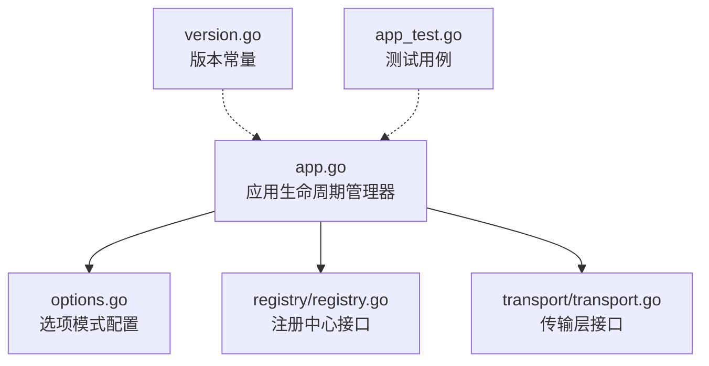
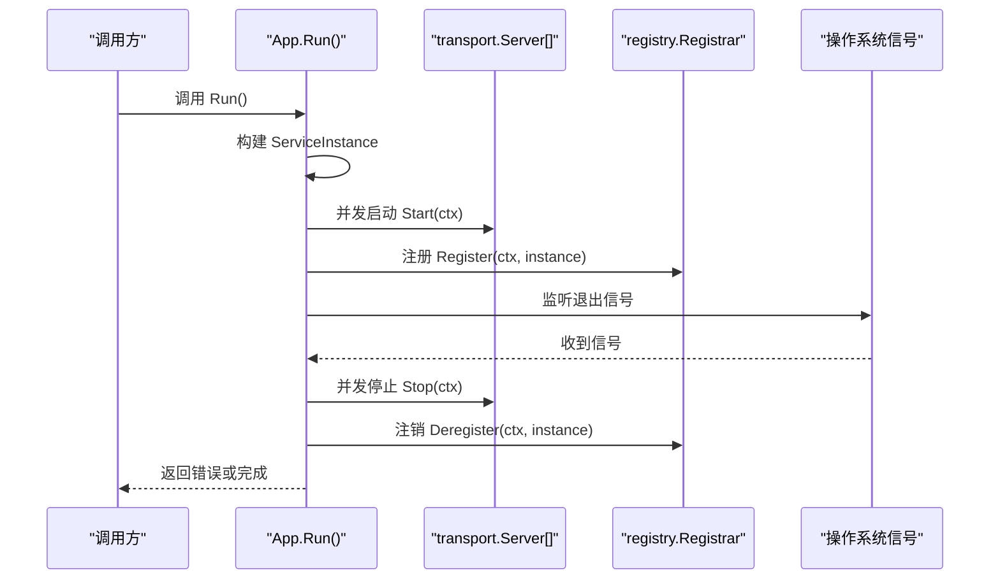
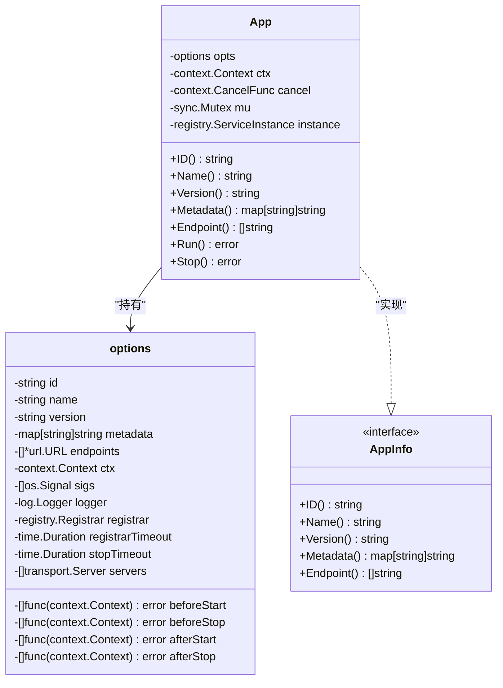
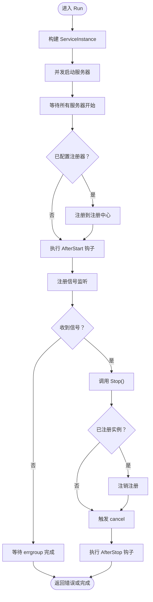
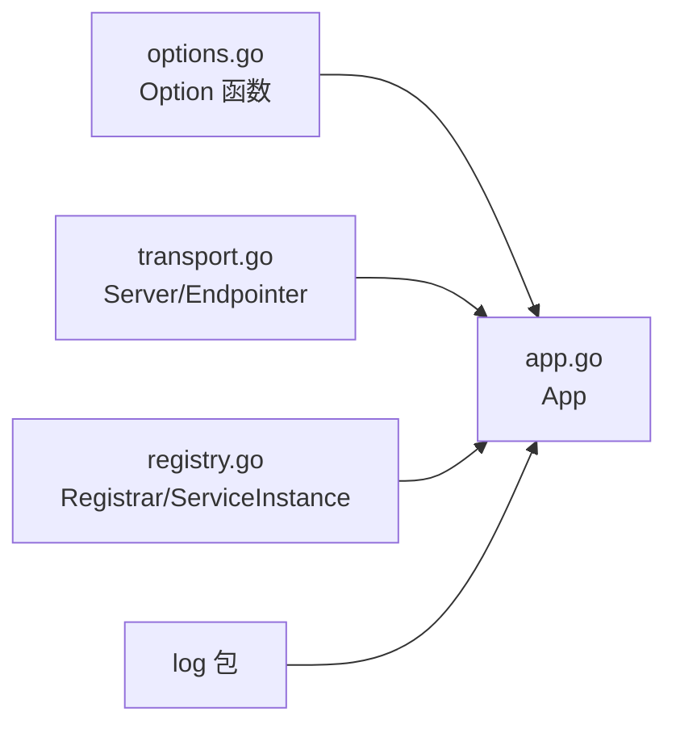

# 应用核心API

<cite>
**本文引用的文件列表**
- [app.go](file://app.go)
- [options.go](file://options.go)
- [version.go](file://version.go)
- [registry.go](file://registry/registry.go)
- [transport.go](file://transport/transport.go)
- [app_test.go](file://app_test.go)
</cite>

## 目录
1. [简介](#简介)
2. [项目结构](#项目结构)
3. [核心组件](#核心组件)
4. [架构总览](#架构总览)
5. [详细组件分析](#详细组件分析)
6. [依赖关系分析](#依赖关系分析)
7. [性能考量](#性能考量)
8. [故障排查指南](#故障排查指南)
9. [结论](#结论)
10. [附录](#附录)

## 简介
本文件为 Kratos 应用核心 API 的权威参考，聚焦于应用生命周期管理器 Application（在源码中以 App 结构体表示）及其选项模式配置。内容涵盖：
- Application 结构体与生命周期方法（New、Run、Stop）
- 所有 Option 配置项的参数类型、默认行为与使用场景
- Start/Stop 的执行流程、信号处理机制与错误返回类型
- 版本信息获取方式
- 与传输层（transport.Server）和注册中心（registry.Registrar）的集成方式
- 常见配置错误与调试方法

## 项目结构
围绕应用核心 API 的关键文件如下：
- app.go：应用生命周期管理器 App 的实现，包含 New、Run、Stop 及上下文工具
- options.go：选项模式的 Option 函数集合，用于配置 App
- version.go：框架版本常量 Release
- registry/registry.go：服务注册与发现接口与 ServiceInstance 数据模型
- transport/transport.go：传输层抽象 Server 接口与 Endpointer 接口
- app_test.go：对 App 行为的测试用例，可作为使用示例参考

图表来源
- [app.go](file://app.go#L1-L213)
- [options.go](file://options.go#L1-L130)
- [registry.go](file://registry/registry.go#L1-L96)
- [transport.go](file://transport/transport.go#L1-L96)
- [version.go](file://version.go#L1-L5)
- [app_test.go](file://app_test.go#L1-L301)

章节来源
- [app.go](file://app.go#L1-L213)
- [options.go](file://options.go#L1-L130)
- [version.go](file://version.go#L1-L5)
- [registry.go](file://registry/registry.go#L1-L96)
- [transport.go](file://transport/transport.go#L1-L96)
- [app_test.go](file://app_test.go#L1-L301)

## 核心组件
- Application（App）：负责应用生命周期管理，包括服务启动、注册、信号监听与优雅停止
- 选项模式（Option）：通过可组合的 Option 函数配置 App 的运行时行为
- 传输层（transport.Server）：统一的服务器抽象，支持 HTTP/GRPC 等
- 注册中心（registry.Registrar）：服务注册与注销接口
- ServiceInstance：注册中心的服务实例描述

章节来源
- [app.go](file://app.go#L1-L213)
- [options.go](file://options.go#L1-L130)
- [registry.go](file://registry/registry.go#L1-L96)
- [transport.go](file://transport/transport.go#L1-L96)

## 架构总览
下图展示了应用启动与停止的关键交互路径，包括传输层服务器并发启动、注册中心注册、信号监听与优雅停止。

图表来源
- [app.go](file://app.go#L82-L151)
- [registry.go](file://registry/registry.go#L9-L15)
- [transport.go](file://transport/transport.go#L15-L24)

## 详细组件分析

### Application 结构体与生命周期
- 结构体字段
  - opts：应用选项（ID、名称、版本、元数据、端点、上下文、信号、日志、注册器、超时、服务器、钩子函数等）
  - ctx/cancel：应用级上下文与取消函数
  - mu：保护 instance 的互斥锁
  - instance：当前服务实例（注册后填充）

- 生命周期方法
  - New：初始化默认选项（含默认信号集、注册超时、可选日志设置），合并传入 Option
  - Run：构建 ServiceInstance，启动所有 transport.Server，注册到注册中心，监听信号，收到信号后优雅停止
  - Stop：执行 beforeStop 钩子，注销注册，触发 cancel，返回 afterStop 钩子的错误（若有）

- 上下文工具
  - NewContext/FromContext：在 context 中携带 AppInfo（ID、Name、Version、Metadata、Endpoint）

章节来源
- [app.go](file://app.go#L20-L213)

#### 类图：App 与相关接口

图表来源
- [app.go](file://app.go#L20-L80)
- [options.go](file://options.go#L17-L39)

### 选项模式（Option）详解
以下为所有 Option 的参数类型、默认值与使用场景说明。默认值来自 New 初始化逻辑；若未显式设置，则采用默认行为。

- ID(id string)
  - 参数：字符串
  - 默认：由 UUID 生成（New 内部尝试生成）
  - 使用场景：显式指定服务实例 ID
  - 参考路径：[ID](file://options.go#L41-L44)

- Name(name string)
  - 参数：字符串
  - 默认：空字符串
  - 使用场景：设置服务名称
  - 参考路径：[Name](file://options.go#L46-L49)

- Version(version string)
  - 参数：字符串
  - 默认：空字符串
  - 使用场景：设置服务版本
  - 参考路径：[Version](file://options.go#L51-L54)

- Metadata(md map[string]string)
  - 参数：键值映射
  - 默认：nil
  - 使用场景：附加服务元数据（如环境、构建信息）
  - 参考路径：[Metadata](file://options.go#L56-L59)

- Endpoint(endpoints ...*url.URL)
  - 参数：URL 切片
  - 默认：空切片
  - 使用场景：显式指定服务端点；若不设置，将从实现了 Endpointer 的服务器推导
  - 参考路径：[Endpoint](file://options.go#L61-L64)

- Context(ctx context.Context)
  - 参数：上下文
  - 默认：背景上下文
  - 使用场景：注入自定义上下文（如携带全局配置）
  - 参考路径：[Context](file://options.go#L66-L69)

- Logger(logger log.Logger)
  - 参数：日志接口
  - 默认：nil
  - 使用场景：替换全局日志实现
  - 参考路径：[Logger](file://options.go#L71-L74)

- Server(srv ...transport.Server)
  - 参数：传输层服务器切片
  - 默认：空切片
  - 使用场景：注册多个 HTTP/GRPC 服务器
  - 参考路径：[Server](file://options.go#L76-L79)

- Signal(sigs ...os.Signal)
  - 参数：信号切片
  - 默认：SIGTERM、SIGQUIT、SIGINT
  - 使用场景：自定义退出信号集
  - 参考路径：[Signal](file://options.go#L81-L84)

- Registrar(r registry.Registrar)
  - 参数：注册器接口
  - 默认：nil（不注册）
  - 使用场景：启用服务注册与注销
  - 参考路径：[Registrar](file://options.go#L86-L89)

- RegistrarTimeout(t time.Duration)
  - 参数：持续时间
  - 默认：10 秒
  - 使用场景：控制注册/注销的超时
  - 参考路径：[RegistrarTimeout](file://options.go#L91-L94)

- StopTimeout(t time.Duration)
  - 参数：持续时间
  - 默认：0（无超时）
  - 使用场景：限制服务器停止等待时间，超时后强制停止
  - 参考路径：[StopTimeout](file://options.go#L96-L99)

- BeforeStart(fn func(context.Context) error)
  - 参数：函数
  - 默认：空列表
  - 使用场景：启动前执行初始化任务（如数据库连接、缓存预热）
  - 参考路径：[BeforeStart](file://options.go#L103-L108)

- BeforeStop(fn func(context.Context) error)
  - 参数：函数
  - 默认：空列表
  - 使用场景：停止前执行清理任务（如释放资源、关闭连接）
  - 参考路径：[BeforeStop](file://options.go#L111-L115)

- AfterStart(fn func(context.Context) error)
  - 参数：函数
  - 默认：空列表
  - 使用场景：启动后执行回调（如健康检查、指标上报）
  - 参考路径：[AfterStart](file://options.go#L117-L122)

- AfterStop(fn func(context.Context) error)
  - 参数：函数
  - 默认：空列表
  - 使用场景：停止后执行收尾工作（如日志刷写、持久化）
  - 参考路径：[AfterStop](file://options.go#L124-L129)

章节来源
- [options.go](file://options.go#L1-L130)

### New 函数与默认行为
- 默认信号集：SIGTERM、SIGQUIT、SIGINT
- 默认注册超时：10 秒
- 默认日志：若设置了 Logger，则替换全局日志
- 默认 ID：若无法生成 UUID，则保持空字符串
- 默认上下文：使用传入的 ctx 或背景上下文

章节来源
- [app.go](file://app.go#L38-L60)

### Run 方法执行流程与信号处理
- 构建 ServiceInstance：优先使用显式 Endpoint，否则从实现了 Endpointer 的服务器推导
- 启动服务器：使用 errgroup 并发启动所有 transport.Server；先等待所有服务器开始运行，再进行注册
- 注册到注册中心：在注册超时内完成注册；失败则直接返回错误
- 启动后回调：执行 AfterStart 钩子
- 信号监听：注册信号通道，收到信号后调用 Stop
- 等待结束：等待所有 goroutine 完成；忽略 context.Canceled 错误
- 停止阶段：执行 BeforeStop 钩子，注销注册，触发 cancel，执行 AfterStop 钩子并返回其错误

图表来源
- [app.go](file://app.go#L82-L151)

章节来源
- [app.go](file://app.go#L82-L151)

### Stop 方法执行流程
- 执行 BeforeStop 钩子
- 若存在注册器且有实例，执行注销
- 触发 cancel
- 返回 AfterStop 钩子的错误（若有）

章节来源
- [app.go](file://app.go#L153-L174)

### 版本信息获取
- 框架版本常量位于 version.go
- 获取方式：导入包后读取 Release 常量

章节来源
- [version.go](file://version.go#L1-L5)

### 与传输层（Server）的集成
- 传输层抽象：transport.Server 提供 Start/Stop 接口
- Endpointer：当未显式设置 Endpoint 时，App 会尝试从实现了 Endpointer 的服务器推导端点
- 实际使用：通过 Server(...) 选项注册多个服务器（如 HTTP/GRPC）

章节来源
- [transport.go](file://transport/transport.go#L15-L24)
- [app.go](file://app.go#L176-L199)

### 与注册中心（Registrar）的集成
- Registrar 接口：提供 Register/Deregister 方法
- ServiceInstance：包含 ID、Name、Version、Metadata、Endpoints
- 集成方式：通过 Registrar(...) 选项启用注册；注册超时由 RegistrarTimeout 控制

章节来源
- [registry.go](file://registry/registry.go#L9-L15)
- [registry.go](file://registry/registry.go#L36-L51)
- [app.go](file://app.go#L120-L126)

### 使用示例（基于测试用例）
以下示例展示了如何通过选项模式构建与启动应用实例，具体代码请参考测试文件中的路径：
- 基本启动与注册：[示例路径](file://app_test.go#L43-L74)
- 设置 ID/Name/Version/Metadata/Endpoint：[示例路径](file://app_test.go#L132-L183)
- 上下文传递与钩子：[示例路径](file://app_test.go#L185-L284)
- 停止超时与上下文取消：[示例路径](file://app_test.go#L287-L301)

章节来源
- [app_test.go](file://app_test.go#L1-L301)

## 依赖关系分析
- App 对 options 的依赖：通过 Option 组合配置
- App 对 transport.Server 的依赖：统一启动/停止
- App 对 registry.Registrar 的依赖：可选注册/注销
- App 对 log 的依赖：可选替换全局日志
- App 对 transport.Endpointer 的依赖：推导端点

图表来源
- [options.go](file://options.go#L1-L130)
- [app.go](file://app.go#L1-L213)
- [transport.go](file://transport/transport.go#L1-L96)
- [registry.go](file://registry/registry.go#L1-L96)

章节来源
- [options.go](file://options.go#L1-L130)
- [app.go](file://app.go#L1-L213)
- [transport.go](file://transport/transport.go#L1-L96)
- [registry.go](file://registry/registry.go#L1-L96)

## 性能考量
- 并发启动：Run 使用 errgroup 并发启动服务器，提高启动效率
- 等待策略：先等待所有服务器开始运行，再进行注册，避免过早暴露未就绪实例
- 停止超时：StopTimeout 可限制停止等待时间，防止阻塞导致进程无法退出
- 日志替换：通过 Logger 选项替换全局日志，便于在高并发场景下选择高性能日志实现

[本节为通用建议，无需列出具体文件来源]

## 故障排查指南
- 启动失败
  - 检查 Server 列表是否为空或启动异常
  - 查看 BeforeStart 钩子是否返回错误
  - 参考路径：[Run 流程](file://app.go#L82-L131)
- 注册失败
  - 检查 Registrar 是否正确实现，RegistrarTimeout 是否过短
  - 参考路径：[注册逻辑](file://app.go#L120-L126)
- 停止卡住
  - 设置 StopTimeout 并确保服务器实现 Stop 时遵循上下文超时
  - 参考路径：[Stop 流程](file://app.go#L153-L174)
- 端点缺失
  - 显式设置 Endpoint 或确保服务器实现 Endpointer
  - 参考路径：[端点推导](file://app.go#L176-L199)
- 日志问题
  - 通过 Logger 选项替换全局日志，确认日志级别与输出目标
  - 参考路径：[New 中的日志设置](file://app.go#L51-L53)

章节来源
- [app.go](file://app.go#L82-L174)

## 结论
本文系统梳理了 Kratos 应用核心 API 的设计与使用要点，重点覆盖了 Application 的生命周期管理、选项模式配置、与传输层和注册中心的集成方式，并提供了版本信息获取与常见问题排查方法。建议在生产环境中合理设置 StopTimeout、RegistrarTimeout，并通过钩子函数完成必要的初始化与收尾工作，以确保应用的稳定性与可观测性。

[本节为总结性内容，无需列出具体文件来源]

## 附录

### API 一览（按功能分组）
- 构造与查询
  - New(...Option)：创建应用实例
  - ID()/Name()/Version()/Metadata()/Endpoint()：查询应用信息
  - 参考路径：[构造与查询](file://app.go#L38-L80)

- 生命周期
  - Run()：启动并运行
  - Stop()：优雅停止
  - 参考路径：[生命周期](file://app.go#L82-L174)

- 选项模式
  - ID/Name/Version/Metadata/Endpoint/Context/Logger/Server/Signal/Registrar/RegistrarTimeout/StopTimeout/BeforeStart/BeforeStop/AfterStart/AfterStop
  - 参考路径：[选项模式](file://options.go#L41-L129)

- 版本
  - Release：框架版本常量
  - 参考路径：[版本](file://version.go#L1-L5)

- 传输层与注册中心
  - transport.Server：Start/Stop
  - transport.Endpointer：Endpoint
  - registry.Registrar：Register/Deregister
  - registry.ServiceInstance：服务实例模型
  - 参考路径：[传输层](file://transport/transport.go#L15-L24)，[注册中心](file://registry/registry.go#L9-L15)，[服务实例](file://registry/registry.go#L36-L51)