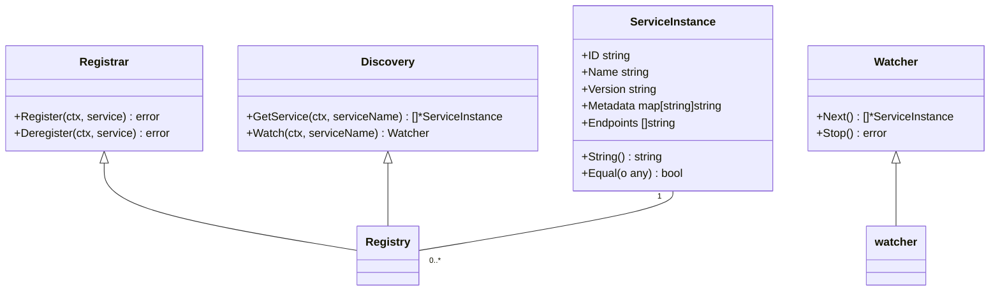
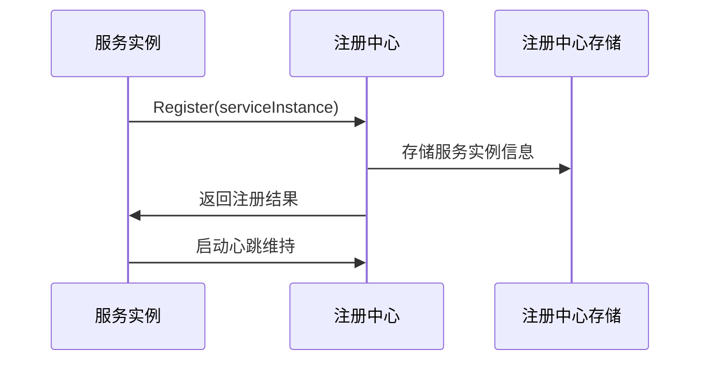
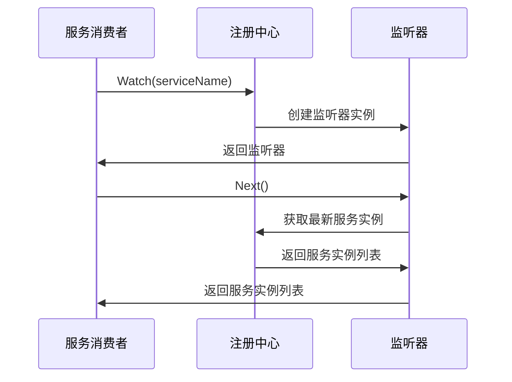
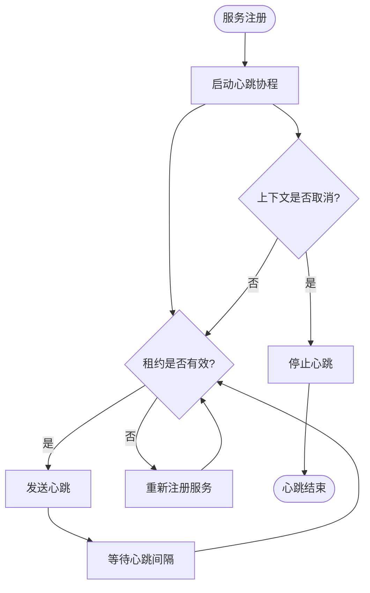
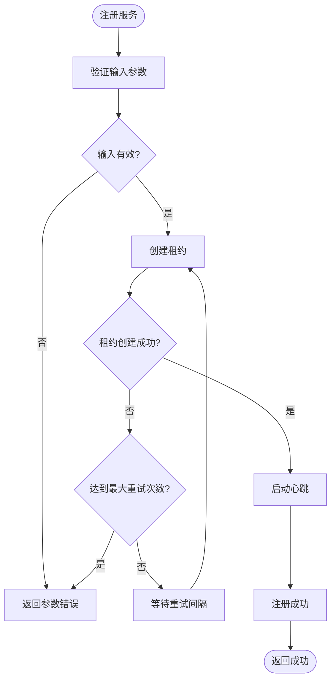

# 注册中心API

<cite>
**本文档中引用的文件**  
- [registry.go](file://registry/registry.go)
- [etcd/registry.go](file://contrib/registry/etcd/registry.go)
- [nacos/registry.go](file://contrib/registry/nacos/registry.go)
- [polaris/registry.go](file://contrib/registry/polaris/registry.go)
- [etcd/watcher.go](file://contrib/registry/etcd/watcher.go)
- [nacos/watcher.go](file://contrib/registry/nacos/watcher.go)
- [consul/registry.go](file://contrib/registry/consul/registry.go)
- [kubernetes/registry.go](file://contrib/registry/kubernetes/registry.go)
</cite>

## 目录
1. [介绍](#介绍)
2. [核心接口与结构体](#核心接口与结构体)
3. [服务注册与注销](#服务注册与注销)
4. [服务发现与监听机制](#服务发现与监听机制)
5. [健康检查与心跳维持](#健康检查与心跳维持)
6. [主流注册中心集成](#主流注册中心集成)
7. [服务注册流程与错误处理](#服务注册流程与错误处理)
8. [分布式环境下的幂等性保证](#分布式环境下的幂等性保证)

## 介绍
本文档详细介绍了Kratos框架中注册中心API的设计与实现，重点关注服务注册、发现、健康检查等核心功能。文档深入分析了Registry接口的Register、Deregister和Watch方法，详细说明了ServiceInstance结构体的字段定义，并解释了与Etcd、Nacos等主流注册中心的集成方式。

## 核心接口与结构体

注册中心的核心功能由`Registrar`、`Discovery`和`Watcher`三个接口定义，以及`ServiceInstance`结构体组成。



**图源**
- [registry.go](file://registry/registry.go#L9-L95)

**本节来源**
- [registry.go](file://registry/registry.go#L9-L95)

## 服务注册与注销

### Register方法
`Register`方法用于将服务实例注册到注册中心。该方法接收一个`ServiceInstance`对象，包含服务的ID、名称、版本、元数据和端点信息。注册成功后，服务将对其他服务可见。

### Deregister方法
`Deregister`方法用于从注册中心注销服务实例。当服务停止或需要下线时，应调用此方法以确保服务消费者不会尝试连接到已不可用的服务。



**图源**
- [registry.go](file://registry/registry.go#L12-L14)
- [etcd/registry.go](file://contrib/registry/etcd/registry.go#L86-L107)

**本节来源**
- [registry.go](file://registry/registry.go#L12-L14)
- [etcd/registry.go](file://contrib/registry/etcd/registry.go#L86-L107)

## 服务发现与监听机制

### GetService方法
`GetService`方法根据服务名称从注册中心获取可用的服务实例列表。该方法返回内存中缓存的服务实例，避免了频繁的网络请求。

### Watch方法
`Watch`方法创建一个监听器，用于监控指定服务的实例变化。当服务实例发生添加、删除或更新时，监听器会收到通知。



**图源**
- [registry.go](file://registry/registry.go#L20-L22)
- [etcd/watcher.go](file://contrib/registry/etcd/watcher.go#L44-L63)

**本节来源**
- [registry.go](file://registry/registry.go#L20-L22)
- [etcd/watcher.go](file://contrib/registry/etcd/watcher.go#L44-L63)

## 健康检查与心跳维持

注册中心通过心跳机制来维护服务实例的健康状态。服务实例在注册后需要定期发送心跳，以证明其仍然存活。如果注册中心在一定时间内未收到心跳，则认为该实例已下线。

### 心跳维持策略
- **Etcd实现**：使用Lease机制，服务注册时创建一个租约，然后通过KeepAlive维持租约有效。
- **Nacos实现**：在注册时设置服务为临时实例，客户端需要定期发送心跳。
- **Consul实现**：支持TTL心跳和HTTP健康检查两种方式。



**图源**
- [etcd/registry.go](file://contrib/registry/etcd/registry.go#L175-L242)
- [nacos/registry.go](file://contrib/registry/nacos/registry.go#L136-L138)

**本节来源**
- [etcd/registry.go](file://contrib/registry/etcd/registry.go#L175-L242)
- [nacos/registry.go](file://contrib/registry/nacos/registry.go#L136-L138)

## 主流注册中心集成

Kratos框架支持与多种主流注册中心集成，包括Etcd、Nacos、Consul和Polaris等。

### Etcd集成
Etcd集成通过`contrib/registry/etcd`包实现，使用etcd的Lease机制来管理服务实例的生命周期。

```go
// 示例：Etcd配置选项
etcd.WithNamespace("/microservices")
etcd.WithRegisterTTL(15 * time.Second)
etcd.WithMaxRetry(5)
```

### Nacos集成
Nacos集成通过`contrib/registry/nacos`包实现，利用Nacos的服务发现和健康检查功能。

```go
// 示例：Nacos配置选项
nacos.WithGroup("DEFAULT_GROUP")
nacos.WithCluster("DEFAULT")
nacos.WithWeight(100)
nacos.WithDefaultKind("grpc")
```

### Consul集成
Consul集成通过`contrib/registry/consul`包实现，支持Consul的健康检查和服务注册功能。

```go
// 示例：Consul配置选项
consul.WithHealthCheck(true)
consul.WithTimeout(10 * time.Second)
consul.WithHeartbeat(true)
consul.WithHealthCheckInterval(10)
```

**本节来源**
- [etcd/registry.go](file://contrib/registry/etcd/registry.go#L19-L47)
- [nacos/registry.go](file://contrib/registry/nacos/registry.go#L35-L61)
- [consul/registry.go](file://contrib/registry/consul/registry.go#L23-L78)

## 服务注册流程与错误处理

### 服务注册完整流程
1. 服务启动时创建`ServiceInstance`对象
2. 调用`Register`方法注册服务
3. 注册中心验证服务信息
4. 在注册中心存储中创建服务实例记录
5. 启动心跳维持协程
6. 返回注册结果

### 错误处理与重试机制
当注册失败时，系统会根据配置的重试策略进行重试。Etcd实现中包含了详细的重试逻辑，包括指数退避和随机延迟。



**图源**
- [etcd/registry.go](file://contrib/registry/etcd/registry.go#L86-L107)
- [etcd/registry.go](file://contrib/registry/etcd/registry.go#L187-L220)

**本节来源**
- [etcd/registry.go](file://contrib/registry/etcd/registry.go#L86-L107)
- [etcd/registry.go](file://contrib/registry/etcd/registry.go#L187-L220)

## 分布式环境下的幂等性保证

在分布式环境下，服务注册需要保证幂等性，即多次注册同一服务实例不会产生副作用。

### 幂等性实现机制
- **服务实例ID**：每个服务实例都有唯一的ID，作为注册的唯一标识
- **Equal方法**：`ServiceInstance`结构体实现了`Equal`方法，用于比较两个实例是否相等
- **注册中心去重**：注册中心在处理注册请求时会检查是否存在相同的服务实例

```go
// ServiceInstance.Equal方法实现
func (i *ServiceInstance) Equal(o any) bool {
    // 比较ID、Name、Version
    // 比较Endpoints（排序后比较）
    // 比较Metadata
    return i.ID == t.ID && i.Name == t.Name && i.Version == t.Version
}
```

**本节来源**
- [registry.go](file://registry/registry.go#L58-L94)
- [etcd/registry.go](file://contrib/registry/etcd/registry.go#L86-L107)