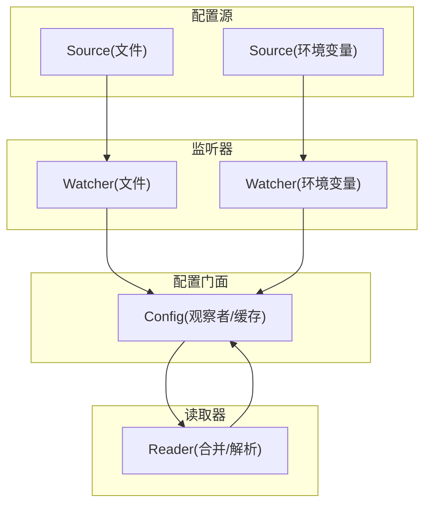
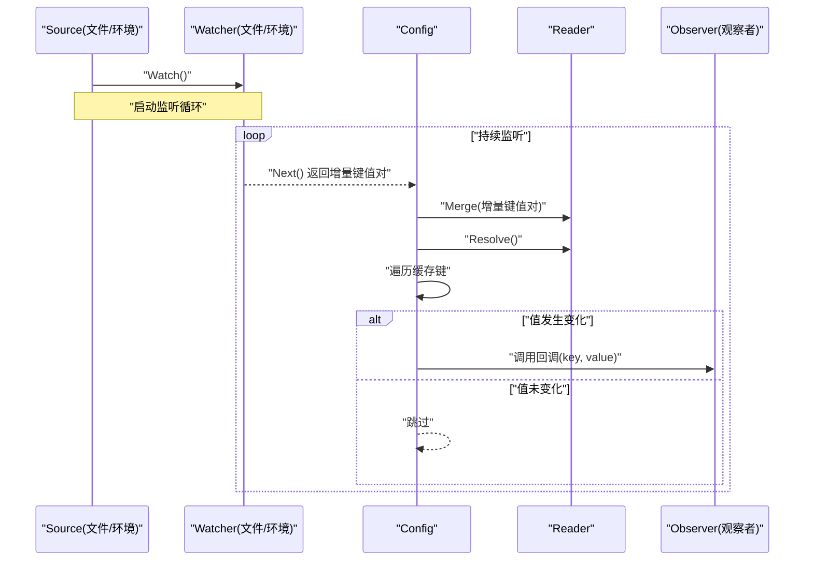
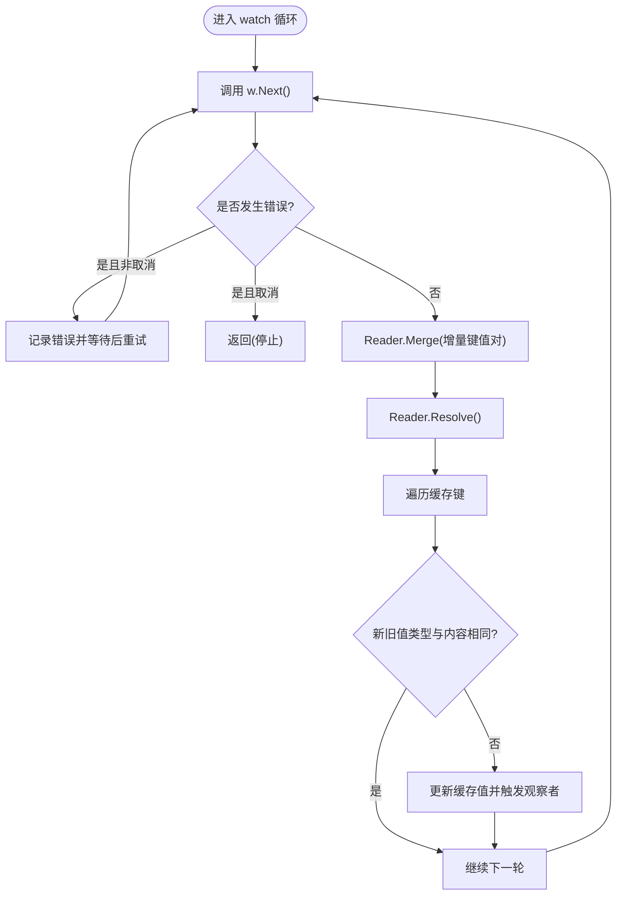
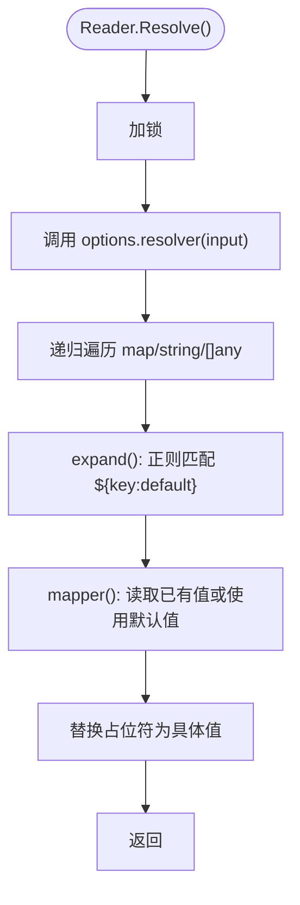
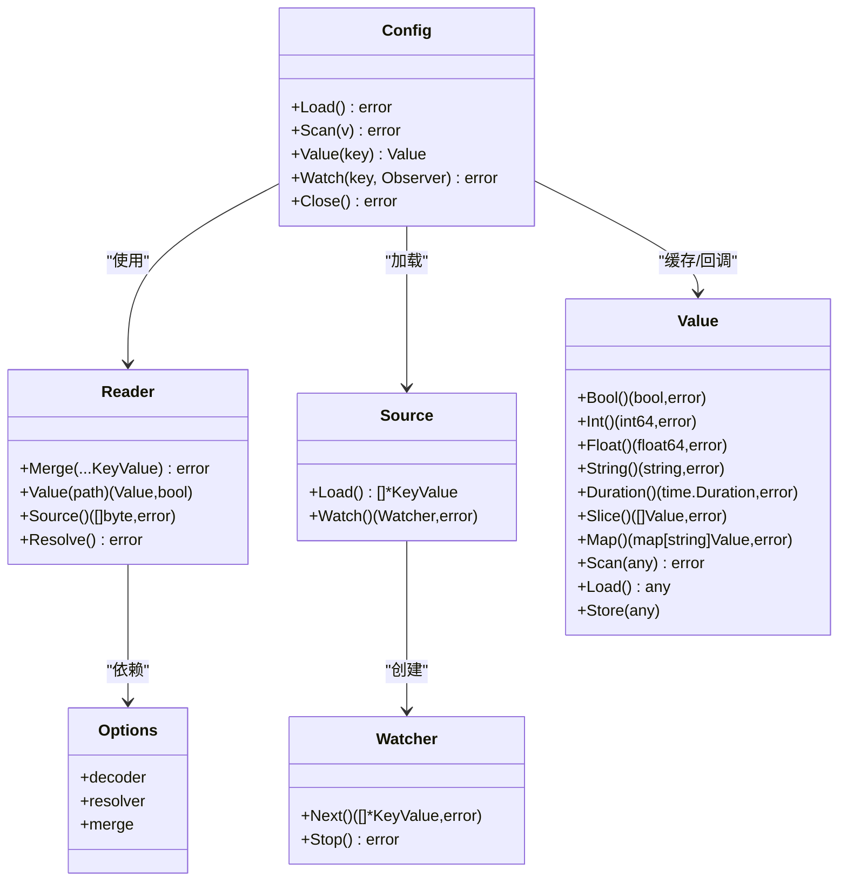

# 动态配置更新

<cite>
**本文引用的文件列表**
- [config.go](file://config/config.go)
- [reader.go](file://config/reader.go)
- [options.go](file://config/options.go)
- [value.go](file://config/value.go)
- [source.go](file://config/source.go)
- [file.go](file://config/file/file.go)
- [file_watcher.go](file://config/file/watcher.go)
- [env.go](file://config/env/env.go)
- [env_watcher.go](file://config/env/watcher.go)
- [config_test.go](file://config/config_test.go)
- [reader_test.go](file://config/reader_test.go)
</cite>

## 目录
1. [简介](#简介)
2. [项目结构与关键组件](#项目结构与关键组件)
3. [核心组件](#核心组件)
4. [架构总览](#架构总览)
5. [详细组件分析](#详细组件分析)
6. [依赖关系分析](#依赖关系分析)
7. [性能与并发特性](#性能与并发特性)
8. [故障排查指南](#故障排查指南)
9. [结论](#结论)
10. [附录：测试与监控建议](#附录测试与监控建议)

## 简介
本文件聚焦于 Kratos 配置子系统中的“动态配置更新”机制，围绕以下目标展开：
- 深入解析 config.go 中 watch 方法的实现原理与 goroutine 管理机制
- 解释如何通过 Watch 接口监听配置变化并触发回调（Observer）
- 详解 reader.go 中 Resolve 方法如何处理配置解析与占位符替换
- 提供配置变更事件处理的最佳实践（观察者模式、并发安全、错误重试策略）
- 给出动态配置更新的测试方法与监控指标收集建议

## 项目结构与关键组件
Kratos 的配置系统采用“Source + Watcher + Reader + Config”的分层设计：
- Source：配置数据源（如文件、环境变量等），负责加载初始配置与启动 Watcher
- Watcher：监听配置源变化，返回增量键值对
- Reader：合并多源配置、解析占位符、提供按路径读取能力
- Config：对外暴露统一的配置访问接口，并维护观察者与缓存

图表来源
- [config.go](file://config/config.go#L96-L158)
- [reader.go](file://config/reader.go#L1-L77)
- [file.go](file://config/file/file.go#L63-L81)
- [file_watcher.go](file://config/file/watcher.go#L35-L69)
- [env.go](file://config/env/env.go#L18-L53)
- [env_watcher.go](file://config/env/watcher.go#L21-L31)

章节来源
- [config.go](file://config/config.go#L1-L159)
- [reader.go](file://config/reader.go#L1-L173)
- [options.go](file://config/options.go#L1-L197)
- [value.go](file://config/value.go#L1-L194)
- [source.go](file://config/source.go#L1-L21)
- [file.go](file://config/file/file.go#L1-L81)
- [file_watcher.go](file://config/file/watcher.go#L1-L69)
- [env.go](file://config/env/env.go#L1-L63)
- [env_watcher.go](file://config/env/watcher.go#L1-L31)

## 核心组件
- Config 接口与实现：提供 Load、Scan、Value、Watch、Close 等能力；内部维护 Reader、缓存、观察者集合与 Watcher 列表
- Reader 接口与实现：负责合并多源配置、解析占位符、按路径读取值
- Options：解码器、解析器、合并器可插拔配置
- Value/atomicValue：线程安全的配置值容器
- Source/Watcher：抽象配置源与监听器接口

章节来源
- [config.go](file://config/config.go#L24-L159)
- [reader.go](file://config/reader.go#L17-L77)
- [options.go](file://config/options.go#L12-L197)
- [value.go](file://config/value.go#L21-L194)
- [source.go](file://config/source.go#L1-L21)

## 架构总览
下面以序列图展示一次“动态配置更新”的完整流程：Source 加载初始配置并启动 Watcher；Watcher 在配置变化时返回增量键值对；Config 将增量合并到 Reader 并解析占位符；随后遍历缓存键，比较新旧值，触发观察者回调。

图表来源
- [config.go](file://config/config.go#L96-L158)
- [reader.go](file://config/reader.go#L39-L77)
- [file_watcher.go](file://config/file/watcher.go#L35-L69)
- [env_watcher.go](file://config/env/watcher.go#L21-L31)

## 详细组件分析

### 1) watch 方法与 goroutine 管理
- 循环逻辑：在 goroutine 中持续调用 w.Next() 获取增量键值对
- 错误处理：若 Next 报错且非 context.Canceled，则记录错误并休眠后继续；context.Canceled 表示停止信号，优雅退出
- 合并与解析：将增量键值对合并到 Reader，并执行占位符解析
- 观察者触发：遍历缓存中的键，比较新旧值类型与内容，若变化则更新缓存并调用对应观察者回调
- goroutine 生命周期：每个 Source 启动一个独立的 watcher goroutine；Close 时逐个调用 Watcher.Stop()

图表来源
- [config.go](file://config/config.go#L62-L94)

章节来源
- [config.go](file://config/config.go#L62-L158)

### 2) Watch 接口与观察者模式
- Watch(key, Observer)：注册观察者，仅当该键已存在有效值时才允许订阅
- Observer 回调签名：Observer(string, Value)，参数为键名与当前值对象
- 观察者存储：使用并发安全的 sync.Map 存储键到回调函数的映射
- 触发时机：每次配置变更后，Config 会对比缓存中的旧值与 Reader 新值，若类型一致且内容不同则触发回调

章节来源
- [config.go](file://config/config.go#L24-L34)
- [config.go](file://config/config.go#L143-L149)

### 3) Resolve 方法与占位符替换
- Reader.Resolve()：委托 options.resolver 对内部 values 执行解析
- 默认解析器 defaultResolver：递归扫描 map/string/[]any，将字符串中的占位符 ${key:default} 替换为同层级或上层配置值
- 可选类型转换：WithResolveActualTypes 可启用将字符串解析为布尔、浮点、整数等实际类型
- 占位符映射器 mapper：根据路径读取已有值，支持默认值回退

图表来源
- [reader.go](file://config/reader.go#L73-L77)
- [options.go](file://config/options.go#L101-L197)

章节来源
- [reader.go](file://config/reader.go#L73-L77)
- [options.go](file://config/options.go#L101-L197)

### 4) Merge 与并发安全
- Reader.Merge：克隆当前 values，逐个解码并合并到临时副本，最后原子性地替换为合并后的结果
- 并发控制：使用互斥锁保护 values 的读写；Value/Source/cloneMap 均在临界区内操作
- 原子值容器：Value 使用 atomic.Value 存储，确保读取端无锁、写入端通过 Store 更新

章节来源
- [reader.go](file://config/reader.go#L39-L71)
- [value.go](file://config/value.go#L35-L41)

### 5) Source/Watcher 实现要点
- 文件源 file.Source：支持单文件与目录两种加载模式；目录模式会忽略隐藏文件
- 文件监听器 file.Watcher：基于 fsnotify 监听文件系统事件；Rename 事件会自动重新 Add 监听
- 环境变量源 env.Source：从进程环境变量构建键值对，支持前缀过滤
- 环境变量监听器 env.Watcher：Next 会阻塞直到 Stop 被调用，用于模拟“永不变更”的场景

章节来源
- [file.go](file://config/file/file.go#L23-L81)
- [file_watcher.go](file://config/file/watcher.go#L35-L69)
- [env.go](file://config/env/env.go#L18-L53)
- [env_watcher.go](file://config/env/watcher.go#L21-L31)

## 依赖关系分析
- Config 依赖 Reader、Source、Watcher、Value
- Reader 依赖 options(decoder/resolver/merge) 与并发锁
- Options 定义了解码器、解析器、合并器的可插拔扩展点
- Value/atomicValue 提供线程安全的读取与类型转换

图表来源
- [config.go](file://config/config.go#L24-L159)
- [reader.go](file://config/reader.go#L17-L77)
- [options.go](file://config/options.go#L24-L69)
- [source.go](file://config/source.go#L11-L21)
- [value.go](file://config/value.go#L21-L194)

章节来源
- [config.go](file://config/config.go#L24-L159)
- [reader.go](file://config/reader.go#L17-L77)
- [options.go](file://config/options.go#L24-L69)
- [source.go](file://config/source.go#L11-L21)
- [value.go](file://config/value.go#L21-L194)

## 性能与并发特性
- 并发读取：Value 使用 atomic.Value，读取无锁；Writer 侧通过互斥锁保护合并过程
- 合并成本：Merge 克隆当前 map，再逐个解码合并，复杂度与键数量成正比
- 解析成本：Resolve 递归遍历所有字符串/数组/字典元素，复杂度与叶子节点数量成正比
- 观察者触发：遍历缓存键进行比较，触发条件严格（类型一致且内容不同）
- goroutine 管理：每个 Source 一个 watcher goroutine；关闭时逐一 Stop，避免资源泄漏

章节来源
- [reader.go](file://config/reader.go#L39-L71)
- [config.go](file://config/config.go#L62-L94)
- [value.go](file://config/value.go#L35-L41)

## 故障排查指南
- Next 报错但非取消：watch 循环会记录错误并等待后重试，检查底层 Watcher 是否异常（如文件权限、fsnotify 失败）
- Merge 失败：检查解码器与格式是否匹配，确认 KeyValue.Format 与编码库一致
- Resolve 失败：检查占位符语法与键是否存在；必要时开启 WithResolveActualTypes 进行类型转换
- 观察者未触发：确认 Watch 注册的键已存在有效值；比较类型与内容差异需满足“类型一致且内容不同”
- 关闭失败：Close 会依次调用各 Watcher.Stop，若某 Watcher 停止失败，应定位具体 Source/Watcher 实现

章节来源
- [config.go](file://config/config.go#L62-L94)
- [options.go](file://config/options.go#L71-L92)
- [options.go](file://config/options.go#L101-L136)
- [config_test.go](file://config/config_test.go#L111-L189)

## 结论
Kratos 的动态配置更新机制通过“Source + Watcher + Reader + Config”的清晰分层，实现了高内聚、低耦合的配置管理。watch 方法以 goroutine 驱动的循环监听与合并解析为核心，结合 Reader 的占位符解析与 Config 的观察者回调，形成完整的变更传播链路。并发安全通过互斥锁与原子值容器保障，错误处理采用稳健的重试与日志记录策略。配合合适的测试与监控手段，可实现生产级的动态配置更新能力。

## 附录：测试与监控建议

### 测试方法
- 单元测试覆盖
  - Reader 合并与解析：验证 Merge/Resolve 的行为与边界情况
  - Config 观察者：验证 Watch 注册、值变化触发回调
  - 文件源与监听器：验证 fsnotify 事件、Rename 自动重监听
  - 环境变量源与监听器：验证前缀过滤、Next 阻塞行为
- 集成测试建议
  - 使用自定义 Source/Watcher 模拟网络配置中心（如 Nacos）的变更推送
  - 验证多 Source 合并顺序与冲突覆盖策略
  - 验证占位符解析与类型转换开关的行为差异

章节来源
- [reader_test.go](file://config/reader_test.go#L1-L331)
- [config_test.go](file://config/config_test.go#L1-L189)
- [file.go](file://config/file/file.go#L63-L81)
- [file_watcher.go](file://config/file/watcher.go#L35-L69)
- [env.go](file://config/env/env.go#L18-L53)
- [env_watcher.go](file://config/env/watcher.go#L21-L31)

### 监控指标建议
- 配置加载与解析
  - 加载耗时：记录 Load/Resolve 的耗时分布
  - 解码失败次数：统计不同格式的解码错误计数
- 监听与合并
  - Watcher Next 错误率：区分取消与非取消错误
  - 合并失败次数：统计 Merge 失败原因（格式不匹配、解码失败）
- 观察者回调
  - 回调触发次数：按键维度统计变更触发频次
  - 回调延迟：从 Next 返回到回调完成的时间
- 资源与健康
  - Watcher 数量：跟踪活跃 Watcher 数量
  - 内存占用：Reader.values 的大小与 GC 指标
  - 并发锁等待：Reader 临界区耗时与等待队列长度