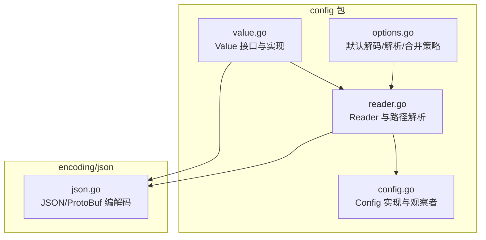
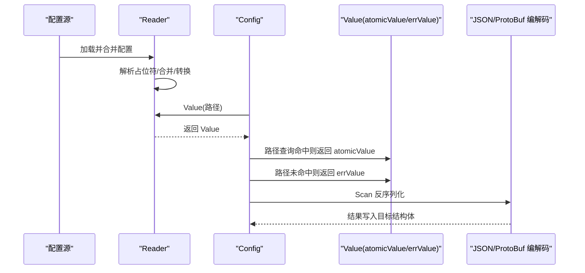
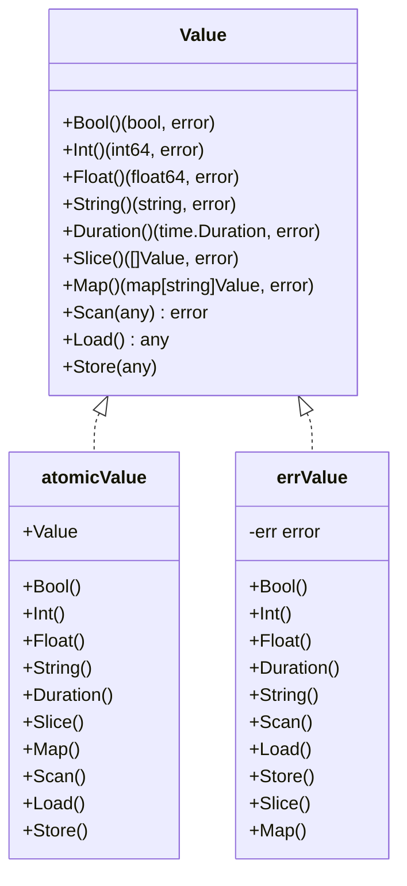
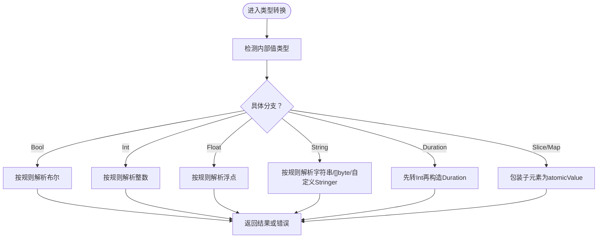
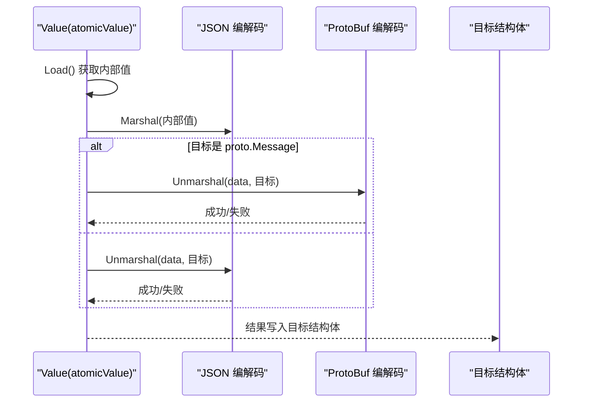
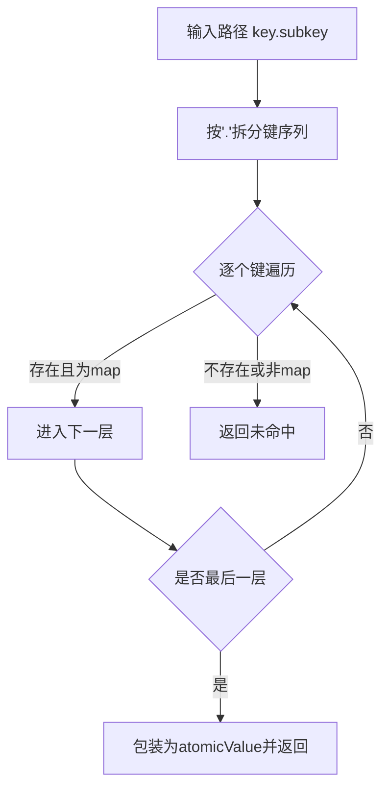
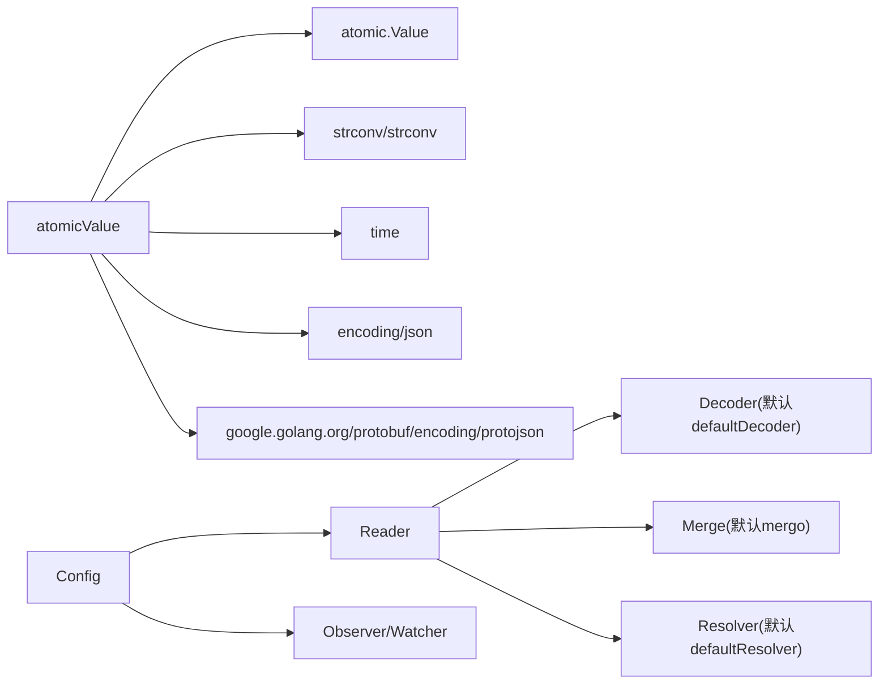

# 配置值访问

<cite>
**本文引用的文件列表**
- [config/value.go](file://config/value.go)
- [config/reader.go](file://config/reader.go)
- [config/config.go](file://config/config.go)
- [config/options.go](file://config/options.go)
- [config/value_test.go](file://config/value_test.go)
- [config/reader_test.go](file://config/reader_test.go)
- [config/config_test.go](file://config/config_test.go)
- [encoding/json/json.go](file://encoding/json/json.go)
</cite>

## 目录
1. [简介](#简介)
2. [项目结构](#项目结构)
3. [核心组件](#核心组件)
4. [架构总览](#架构总览)
5. [详细组件分析](#详细组件分析)
6. [依赖关系分析](#依赖关系分析)
7. [性能考量](#性能考量)
8. [故障排查指南](#故障排查指南)
9. [结论](#结论)
10. [附录](#附录)

## 简介
本文件围绕配置值访问的实现进行深入解析，重点覆盖以下内容：
- Value 接口及其实现类型 atomicValue 与 errValue 的差异与适用场景
- 各类类型转换方法（Bool、Int、Float、String、Duration、Slice、Map）的实现细节与错误处理
- Scan 方法如何将配置值反序列化到结构体，支持 ProtoBuf 与 JSON 格式
- 配置路径查询（如“key.subkey”）的工作流程与使用示例
- 类型转换错误处理与默认值设置技巧
- 性能优化建议与最佳实践

## 项目结构
与配置值访问直接相关的核心模块位于 config 包内，涉及接口定义、读取器、配置对象以及选项解析器；同时，编码层（encoding/json）为 Scan 提供了 JSON/ProtoBuf 的编解码能力。

图表来源
- [config/value.go](file://config/value.go#L1-L194)
- [config/reader.go](file://config/reader.go#L1-L173)
- [config/config.go](file://config/config.go#L1-L159)
- [config/options.go](file://config/options.go#L1-L197)
- [encoding/json/json.go](file://encoding/json/json.go#L1-L69)

章节来源
- [config/value.go](file://config/value.go#L1-L194)
- [config/reader.go](file://config/reader.go#L1-L173)
- [config/config.go](file://config/config.go#L1-L159)
- [config/options.go](file://config/options.go#L1-L197)
- [encoding/json/json.go](file://encoding/json/json.go#L1-L69)

## 核心组件
- Value 接口：统一的配置值访问抽象，提供布尔、整数、浮点、字符串、时长、切片、映射、扫描、加载与存储等方法。
- atomicValue：基于原子值的 Value 实现，支持并发安全的读写与类型转换。
- errValue：错误值实现，所有方法返回预设错误，用于表示键不存在或解析失败。
- Reader：负责合并多源配置、解析占位符、按路径提取值并导出原始数据。
- Config：高层配置管理器，提供加载、监听、扫描到结构体等能力，并通过缓存提升路径查询性能。

章节来源
- [config/value.go](file://config/value.go#L21-L33)
- [config/value.go](file://config/value.go#L35-L113)
- [config/value.go](file://config/value.go#L180-L194)
- [config/reader.go](file://config/reader.go#L17-L23)
- [config/config.go](file://config/config.go#L27-L34)

## 架构总览
下图展示了从配置源到 Value 访问与反序列化的整体流程。

图表来源
- [config/reader.go](file://config/reader.go#L61-L71)
- [config/config.go](file://config/config.go#L124-L133)
- [config/value.go](file://config/value.go#L169-L178)
- [encoding/json/json.go](file://encoding/json/json.go#L31-L69)

## 详细组件分析

### Value 接口与实现
- 接口方法概览
  - Bool/Int/Float/String/Duration/Slice/Map/Scan/Load/Store
- atomicValue
  - 基于原子值，线程安全；内部通过 Load/Store 保存任意类型值
  - 类型转换方法对常见数值、字符串、字节切片、fmt.Stringer 等进行兼容处理
  - Duration 通过 Int 转换后构造 time.Duration
  - Slice/Map 将容器元素包装为新的 atomicValue，便于链式访问
  - Scan 先将内部值 JSON 序列化，再根据目标是否为 proto.Message 决定使用 JSON 或 protojson 解码
- errValue
  - 所有方法均返回预设错误，Value(key) 未命中时返回该实现，避免上层重复判断

图表来源
- [config/value.go](file://config/value.go#L21-L33)
- [config/value.go](file://config/value.go#L35-L113)
- [config/value.go](file://config/value.go#L169-L194)

章节来源
- [config/value.go](file://config/value.go#L21-L33)
- [config/value.go](file://config/value.go#L35-L113)
- [config/value.go](file://config/value.go#L169-L194)

### 类型转换方法实现细节
- Bool
  - 支持 bool、整型、浮点、字符串等输入；字符串采用宽松解析策略
  - 失败时返回类型断言错误
- Int/Float
  - 支持多种整型、浮点、字符串输入；字符串解析失败返回错误
- String
  - 支持 string、bool、整型、浮点、[]byte、fmt.Stringer 等
  - []byte 转 string；fmt.Stringer 调用 String()
- Duration
  - 基于 Int() 的结果构造 time.Duration
- Slice/Map
  - 将容器元素逐一包装为 atomicValue，便于后续链式访问
  - 类型断言失败返回错误

图表来源
- [config/value.go](file://config/value.go#L43-L113)
- [config/value.go](file://config/value.go#L161-L167)

章节来源
- [config/value.go](file://config/value.go#L43-L113)
- [config/value.go](file://config/value.go#L161-L167)

### Scan 方法：反序列化到结构体（ProtoBuf 与 JSON）
- 工作流程
  - 将 Value 内部值 JSON 序列化为字节
  - 若目标实现了 proto.Message，则使用 protojson 进行反序列化
  - 否则使用标准 JSON 反序列化
- 支持格式
  - JSON：标准 JSON 解码
  - ProtoBuf：当目标结构体字段对应 proto.Message 或可识别的 proto 消息类型时，使用 protojson
- 使用建议
  - 目标结构体应带有 JSON 标签以便正确映射
  - 对于 ProtoBuf 消息，确保已注册相应编解码器

图表来源
- [config/value.go](file://config/value.go#L169-L178)
- [encoding/json/json.go](file://encoding/json/json.go#L31-L69)

章节来源
- [config/value.go](file://config/value.go#L169-L178)
- [encoding/json/json.go](file://encoding/json/json.go#L31-L69)

### 配置路径查询（如“key.subkey”）
- Reader.Value(path)
  - 通过字符串分割路径，逐级在嵌套 map 中查找
  - 最终命中时以 atomicValue 包装内部值返回；未命中返回 false
- Config.Value(key)
  - 先查缓存，未命中再委托 Reader.Value 并缓存结果
  - 未命中返回 errValue，携带“键不存在”错误
- 示例
  - “a.b.c”：若 a 为 map，b 为 map，c 为具体值，则返回对应的 atomicValue
  - 任何中间层级非 map 或键不存在，均视为未命中

图表来源
- [config/reader.go](file://config/reader.go#L132-L158)
- [config/config.go](file://config/config.go#L124-L133)

章节来源
- [config/reader.go](file://config/reader.go#L132-L158)
- [config/config.go](file://config/config.go#L124-L133)

### 默认值与占位符解析
- defaultResolver
  - 占位符格式：${key:default}
  - 支持字符串、数组、嵌套 map 的递归解析
  - 当启用实际类型转换时，会尝试将解析后的字符串转换为 bool/float/int
- mapper
  - 从配置树中读取键值，若不存在则回退到默认值
- 使用示例
  - ${PORT:"8081"}：若环境变量 PORT 不存在则使用默认值
  - ${ENABLE:false}：布尔默认值
  - ${RATE}：无默认值时保持原样

章节来源
- [config/options.go](file://config/options.go#L101-L197)
- [config/reader_test.go](file://config/reader_test.go#L131-L166)

## 依赖关系分析
- Value 实现依赖
  - atomicValue 依赖 Go 原子值、字符串解析、时间类型
  - Scan 依赖 JSON 编解码与 protojson
- Reader 依赖
  - 解码器（默认使用 encoding.GetCodec），合并策略（默认使用 mergo），解析器（默认占位符解析）
- Config 依赖
  - Reader、缓存、观察者、Watcher

图表来源
- [config/value.go](file://config/value.go#L1-L20)
- [config/reader.go](file://config/reader.go#L1-L23)
- [config/options.go](file://config/options.go#L1-L71)
- [config/config.go](file://config/config.go#L1-L34)

章节来源
- [config/value.go](file://config/value.go#L1-L20)
- [config/reader.go](file://config/reader.go#L1-L23)
- [config/options.go](file://config/options.go#L1-L71)
- [config/config.go](file://config/config.go#L1-L34)

## 性能考量
- 命中路径的缓存
  - Config.Value(key) 会在首次查询后缓存 atomicValue，后续直接返回，避免重复解析
- 并发安全
  - atomicValue 使用原子值，读写操作轻量且线程安全
- 类型转换成本
  - 字符串到数值的解析为 O(1)，但频繁调用可能带来开销；建议在业务侧复用 Value 实例
- Scan 成本
  - JSON/ProtoBuf 编解码为 O(n)（n 为结构体大小），尽量避免在热路径中频繁反序列化大对象
- 路径解析
  - readValue 为 O(k)（k 为路径层级），建议合理设计配置层级，避免过深嵌套

章节来源
- [config/config.go](file://config/config.go#L124-L133)
- [config/reader.go](file://config/reader.go#L132-L158)
- [config/value.go](file://config/value.go#L43-L113)

## 故障排查指南
- 键不存在
  - Config.Value(key) 返回 errValue，调用各类型转换方法会返回错误
  - 建议在上层捕获错误并提供兜底逻辑
- 类型转换失败
  - 输入与期望类型不匹配（如字符串无法解析为整数）
  - 建议检查配置源与占位符解析结果，必要时启用实际类型转换
- Scan 失败
  - 目标结构体字段标签不匹配或类型不兼容
  - ProtoBuf 场景需确保消息类型与字段类型一致
- 观察者未触发
  - Watch 未绑定有效键或缓存未更新，检查缓存与合并逻辑

章节来源
- [config/config.go](file://config/config.go#L124-L133)
- [config/value.go](file://config/value.go#L180-L194)
- [config/options.go](file://config/options.go#L101-L197)

## 结论
- atomicValue 提供了高性能、线程安全的配置值访问能力，覆盖常用类型转换与容器包装
- errValue 统一了“键不存在”的错误语义，简化上层调用
- Scan 支持 JSON 与 ProtoBuf，满足不同序列化需求
- 路径查询与占位符解析使配置具备良好的灵活性与可维护性
- 在高并发与热路径场景下，建议结合缓存与合理的配置层级设计，以获得更佳性能

## 附录

### 使用示例与最佳实践
- 路径查询示例
  - 通过 Config.Value("a.b.c") 获取嵌套值，随后调用 String()/Int()/Bool() 等
  - 若不确定键是否存在，先判断返回的 Value 是否为 errValue
- 默认值设置
  - 使用占位符 ${KEY:default} 设置默认值；启用实际类型转换可自动推断 bool/float/int
- 类型转换错误处理
  - 对每个转换调用检查 error，必要时提供兜底值
- 性能优化建议
  - 复用 Value 实例，减少重复解析
  - 控制配置层级深度，避免深层嵌套带来的路径解析成本
  - 在热路径中避免频繁 Scan 大对象，优先使用 Value 的类型转换方法

章节来源
- [config/reader_test.go](file://config/reader_test.go#L131-L166)
- [config/config_test.go](file://config/config_test.go#L149-L188)
- [config/options.go](file://config/options.go#L101-L197)