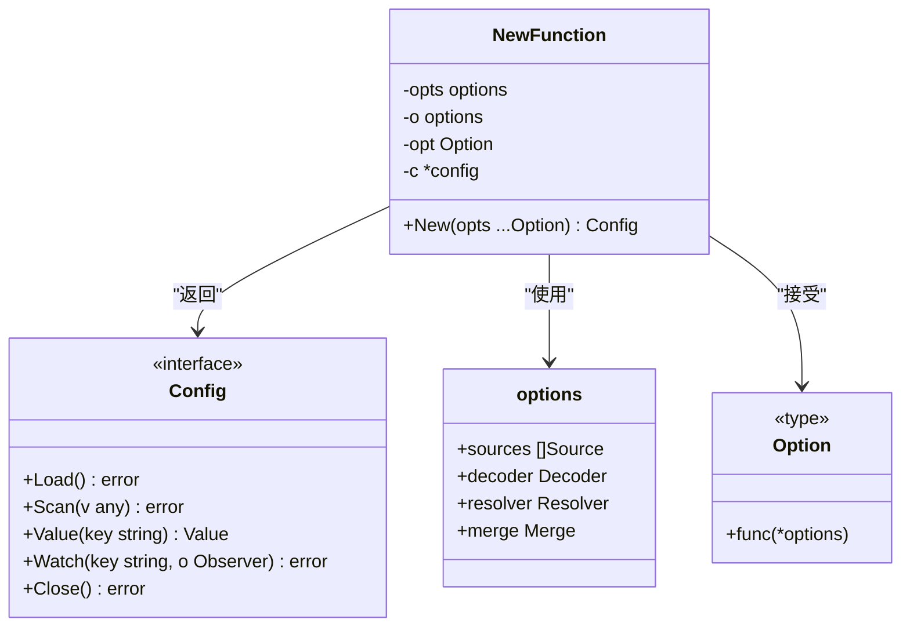

# 配置初始化

<cite>
**本文档中引用的文件**   
- [config.go](file://config/config.go)
- [options.go](file://config/options.go)
- [source.go](file://config/source.go)
- [reader.go](file://config/reader.go)
- [value.go](file://config/value.go)
- [file/file.go](file://config/file/file.go)
- [env/env.go](file://config/env/env.go)
- [contrib/config/apollo/apollo.go](file://contrib/config/apollo/apollo.go)
- [contrib/config/consul/config.go](file://contrib/config/consul/config.go)
- [contrib/config/nacos/config.go](file://contrib/config/nacos/config.go)
</cite>

## 目录
1. [简介](#简介)
2. [配置初始化流程](#配置初始化流程)
3. [New函数实现机制](#new函数实现机制)
4. [Option配置方式](#option配置方式)
5. [配置源集成](#配置源集成)
6. [配置解析处理](#配置解析处理)
7. [占位符替换与类型转换](#占位符替换与类型转换)
8. [配置合并策略](#配置合并策略)
9. [最佳实践示例](#最佳实践示例)
10. [错误处理与调试](#错误处理与调试)

## 简介
配置初始化是应用程序启动过程中的关键环节，负责加载和管理应用程序的各种配置参数。本文档详细说明了Kratos框架中配置初始化的核心机制，重点分析config.go中New函数的实现原理和options.go中各种Option的配置方式。文档涵盖了配置源集成、配置解析、占位符替换、类型转换和配置合并等核心功能，为开发者提供全面的配置管理指导。

## 配置初始化流程
配置初始化流程是应用程序启动时加载和管理配置的核心过程。该流程通过New函数创建配置实例，并通过一系列Option配置项来定制配置行为。初始化流程主要包括配置源加载、配置解析、占位符替换和配置合并等关键步骤。

**Diagram sources**
- [config.go](file://config/config.go#L44-L60)
- [options.go](file://config/options.go#L21-L29)

**Section sources**
- [config.go](file://config/config.go#L44-L158)
- [options.go](file://config/options.go#L21-L69)

## New函数实现机制
New函数是配置初始化的核心入口，负责创建配置实例并应用各种配置选项。该函数接受可变数量的Option参数，通过函数式选项模式来配置配置实例的行为。

**Diagram sources**
- [config.go](file://config/config.go#L44-L60)
- [options.go](file://config/options.go#L21-L29)

**Section sources**
- [config.go](file://config/config.go#L44-L60)
- [options.go](file://config/options.go#L21-L29)

## Option配置方式
Option配置方式采用函数式选项模式，通过一系列With前缀的函数来配置配置实例的各种行为。这些Option函数接受一个指向options结构体的指针，可以在函数内部修改配置选项。

**Diagram sources**
- [options.go](file://config/options.go#L31-L69)

**Section sources**
- [options.go](file://config/options.go#L31-L69)

## 配置源集成
配置源集成机制通过Source接口统一管理不同类型的配置源，包括文件、环境变量和远程配置中心。每种配置源都实现了Source接口的Load和Watch方法，实现了配置的加载和监听功能。

**Diagram sources**
- [source.go](file://config/source.go#L10-L20)
- [file/file.go](file://config/file/file.go#L12-L21)
- [env/env.go](file://config/env/env.go#L14-L21)
- [contrib/config/apollo/apollo.go](file://contrib/config/apollo/apollo.go#L110-L130)
- [contrib/config/consul/config.go](file://contrib/config/consul/config.go#L41-L59)
- [contrib/config/nacos/config.go](file://contrib/config/nacos/config.go#L40-L46)

**Section sources**
- [source.go](file://config/source.go#L10-L20)
- [file/file.go](file://config/file/file.go#L12-L81)
- [env/env.go](file://config/env/env.go#L14-L63)
- [contrib/config/apollo/apollo.go](file://contrib/config/apollo/apollo.go#L110-L130)
- [contrib/config/consul/config.go](file://contrib/config/consul/config.go#L41-L59)
- [contrib/config/nacos/config.go](file://contrib/config/nacos/config.go#L40-L46)

## 配置解析处理
配置解析处理机制通过Decoder接口处理不同格式的配置解析。系统支持JSON、YAML、XML等多种配置格式，并通过encoding包提供的编解码器进行格式转换。

**Diagram sources**
- [options.go](file://config/options.go#L13-L14)
- [reader.go](file://config/reader.go#L39-L58)
- [encoding](file://encoding)

**Section sources**
- [options.go](file://config/options.go#L71-L92)
- [reader.go](file://config/reader.go#L39-L58)

## 占位符替换与类型转换
占位符替换与类型转换机制通过Resolver接口实现配置中的占位符替换和类型转换功能。系统支持${key:default}格式的占位符，并可选择是否将字符串值转换为实际数据类型。

**Diagram sources**
- [options.go](file://config/options.go#L16-L18)
- [options.go](file://config/options.go#L101-L136)

**Section sources**
- [options.go](file://config/options.go#L49-L62)
- [options.go](file://config/options.go#L101-L136)

## 配置合并策略
配置合并策略通过Merge函数实现不同配置源之间的合并操作。系统默认使用mergo库的Map函数进行合并，并支持自定义合并函数来实现特定的合并逻辑。

**Diagram sources**
- [config.go](file://config/config.go#L49-L51)
- [options.go](file://config/options.go#L18-L19)
- [reader.go](file://config/reader.go#L50-L53)

**Section sources**
- [config.go](file://config/config.go#L49-L51)
- [options.go](file://config/options.go#L64-L68)
- [reader.go](file://config/reader.go#L50-L53)

## 最佳实践示例
最佳实践示例展示了如何在实际项目中使用配置初始化功能，包括多环境配置加载顺序、优先级管理和复杂配置场景的处理方法。

**Diagram sources**
- [config.go](file://config/config.go#L96-L120)
- [options.go](file://config/options.go#L31-L35)

**Section sources**
- [config_test.go](file://config/config_test.go#L111-L188)
- [file/file_test.go](file://config/file/file_test.go#L194-L206)
- [env/env_test.go](file://config/env/env_test.go#L59-L62)

## 错误处理与调试
错误处理与调试机制提供了完善的错误报告和调试功能，帮助开发者快速定位和解决配置相关的问题。

**Diagram sources**
- [config.go](file://config/config.go#L22-L23)
- [config.go](file://config/config.go#L105-L107)
- [config.go](file://config/config.go#L117-L119)
- [reader.go](file://config/reader.go#L47-L48)
- [reader.go](file://config/reader.go#L51-L52)

**Section sources**
- [config.go](file://config/config.go#L22-L23)
- [config.go](file://config/config.go#L105-L119)
- [reader.go](file://config/reader.go#L47-L52)
- [value.go](file://config/value.go#L180-L194)