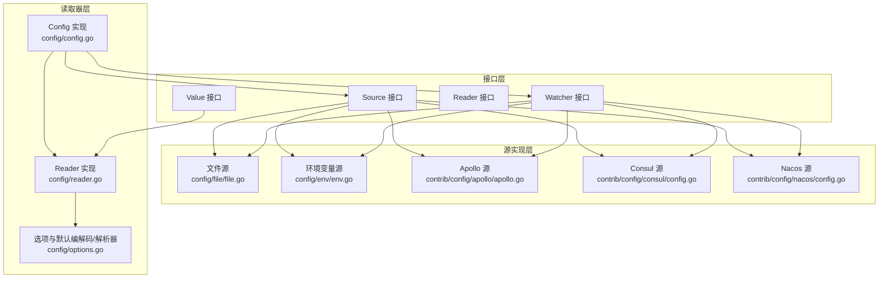
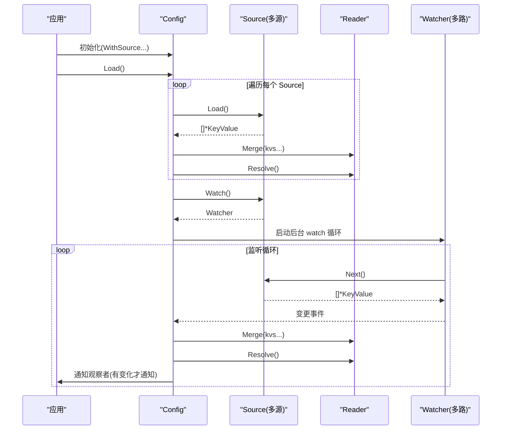
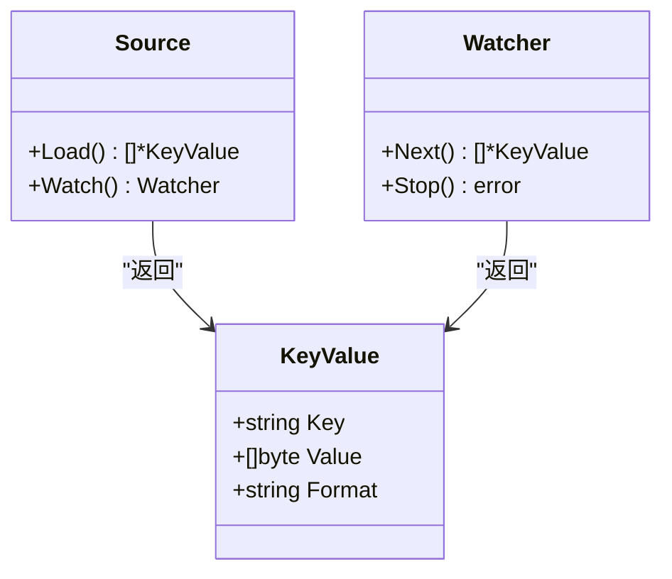
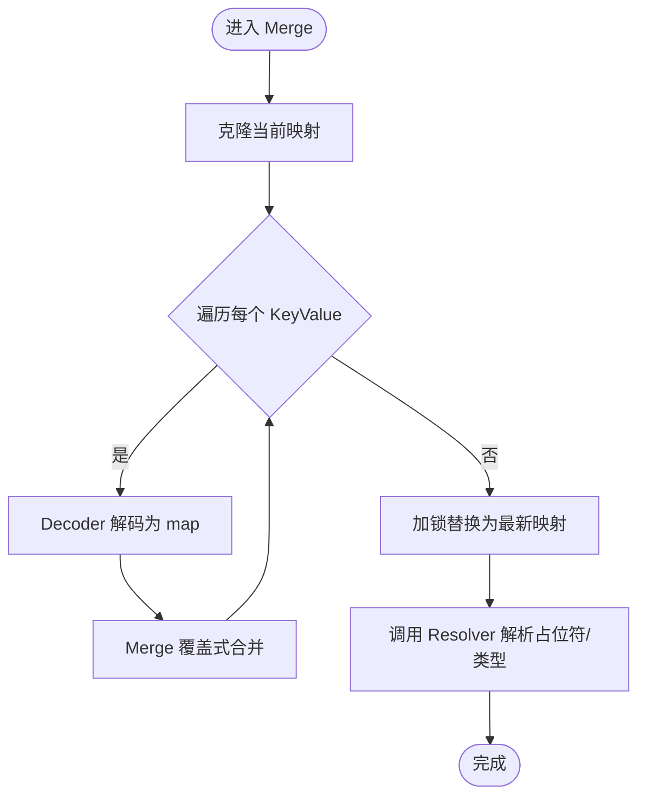
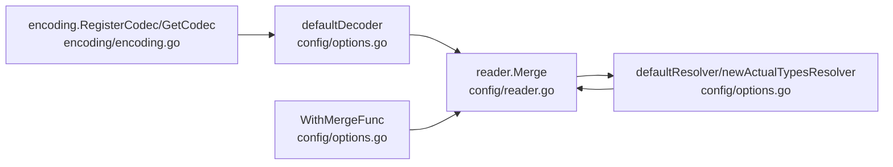

# 配置源管理

<cite>
**本文引用的文件列表**
- [config/source.go](file://config/source.go)
- [config/reader.go](file://config/reader.go)
- [config/value.go](file://config/value.go)
- [config/config.go](file://config/config.go)
- [config/options.go](file://config/options.go)
- [config/file/file.go](file://config/file/file.go)
- [config/file/format.go](file://config/file/format.go)
- [config/env/env.go](file://config/env/env.go)
- [contrib/config/apollo/apollo.go](file://contrib/config/apollo/apollo.go)
- [contrib/config/consul/config.go](file://contrib/config/consul/config.go)
- [contrib/config/nacos/config.go](file://contrib/config/nacos/config.go)
- [encoding/encoding.go](file://encoding/encoding.go)
</cite>

## 目录
1. [简介](#简介)
2. [项目结构](#项目结构)
3. [核心组件](#核心组件)
4. [架构总览](#架构总览)
5. [详细组件分析](#详细组件分析)
6. [依赖关系分析](#依赖关系分析)
7. [性能与并发特性](#性能与并发特性)
8. [故障排查指南](#故障排查指南)
9. [结论](#结论)
10. [附录：自定义配置源实现指南](#附录自定义配置源实现指南)

## 简介
本文件围绕 Kratos 配置子系统，系统性梳理“配置源管理”的设计与实现，重点解释：
- Source 与 Watcher 接口的设计原理与职责边界
- KeyValue 结构体的 Key、Value、Format 字段语义及在不同后端的应用方式
- Reader 的 Merge 方法如何将多源数据合并至统一内存存储，并进行类型解析与占位符替换
- 如何实现自定义配置源（实现 Load 与 Watch），以适配新的配置存储后端
- 配置源加载顺序、冲突解决策略与性能优化建议

## 项目结构
Kratos 配置模块采用“接口抽象 + 多源实现 + 统一读取器”的分层设计：
- 接口层：定义 Source、Watcher、Reader、Value 等核心接口
- 源实现层：文件、环境变量、Apollo、Consul、Nacos 等具体后端
- 读取器层：负责解码、合并、解析与缓存访问
- 上层应用：通过 Config 统一加载、监听与消费配置

图表来源
- [config/source.go](file://config/source.go#L1-L21)
- [config/reader.go](file://config/reader.go#L1-L173)
- [config/options.go](file://config/options.go#L1-L197)
- [config/file/file.go](file://config/file/file.go#L1-L81)
- [config/env/env.go](file://config/env/env.go#L1-L63)
- [contrib/config/apollo/apollo.go](file://contrib/config/apollo/apollo.go#L1-L287)
- [contrib/config/consul/config.go](file://contrib/config/consul/config.go#L1-L91)
- [contrib/config/nacos/config.go](file://contrib/config/nacos/config.go#L1-L82)

章节来源
- [config/source.go](file://config/source.go#L1-L21)
- [config/reader.go](file://config/reader.go#L1-L173)
- [config/options.go](file://config/options.go#L1-L197)
- [config/file/file.go](file://config/file/file.go#L1-L81)
- [config/env/env.go](file://config/env/env.go#L1-L63)
- [contrib/config/apollo/apollo.go](file://contrib/config/apollo/apollo.go#L1-L287)
- [contrib/config/consul/config.go](file://contrib/config/consul/config.go#L1-L91)
- [contrib/config/nacos/config.go](file://contrib/config/nacos/config.go#L1-L82)

## 核心组件
- Source 接口：定义 Load 与 Watch 两个能力，分别用于一次性拉取配置与持续监听变更
- Watcher 接口：定义 Next 与 Stop，Next 返回增量或全量的 KeyValue 列表，Stop 停止监听
- KeyValue：承载单个配置项的键、值与格式信息
- Reader 接口：负责 Merge、Value、Source、Resolve 四项能力，统一内存存储与查询
- Value 接口：对任意类型的配置值进行类型化读取与扫描

章节来源
- [config/source.go](file://config/source.go#L1-L21)
- [config/reader.go](file://config/reader.go#L1-L173)
- [config/value.go](file://config/value.go#L1-L194)

## 架构总览
下图展示从配置初始化到运行时监听与更新的完整流程，包括加载顺序、合并策略与观察者通知机制。

图表来源
- [config/config.go](file://config/config.go#L62-L122)
- [config/reader.go](file://config/reader.go#L39-L77)
- [config/options.go](file://config/options.go#L49-L69)

章节来源
- [config/config.go](file://config/config.go#L62-L122)
- [config/reader.go](file://config/reader.go#L39-L77)
- [config/options.go](file://config/options.go#L49-L69)

## 详细组件分析

### Source 与 Watcher 接口设计
- Source.Load：返回当前所有配置项的 KeyValue 列表；格式由 KeyValue.Format 决定
- Source.Watch：返回一个 Watcher，用于后续 Next 轮询获取变更
- Watcher.Next：返回一次变更的 KeyValue 列表；错误为上下文取消时应优雅退出
- Watcher.Stop：停止监听，释放资源

图表来源
- [config/source.go](file://config/source.go#L1-L21)

章节来源
- [config/source.go](file://config/source.go#L1-L21)

### KeyValue 字段语义与后端应用
- Key：配置项的路径或标识，如“server.http.addr”、“namespace.key”
- Value：配置内容字节流，通常为序列化后的数据
- Format：内容格式，决定如何反序列化到 map[string]interface{} 中

不同后端对 KeyValue 的使用要点：
- 文件源：根据文件扩展名推导 Format，Key 使用文件名或相对路径键
- 环境变量源：Key 为去除前缀后的键名，Value 为原始字符串值
- Apollo/Consul/Nacos：Key 为命名空间或键路径，Value 为服务端返回的内容，Format 由扩展名或约定决定

章节来源
- [config/file/file.go](file://config/file/file.go#L23-L42)
- [config/file/format.go](file://config/file/format.go#L1-L11)
- [config/env/env.go](file://config/env/env.go#L18-L45)
- [contrib/config/apollo/apollo.go](file://contrib/config/apollo/apollo.go#L180-L211)
- [contrib/config/consul/config.go](file://contrib/config/consul/config.go#L61-L85)
- [contrib/config/nacos/config.go](file://contrib/config/nacos/config.go#L48-L64)

### Reader.Merge 合并与解析流程
Reader.Merge 将多个 KeyValue 合并到统一内存存储，并执行以下步骤：
1) 克隆当前内存映射，避免并发写入竞争
2) 对每个 KeyValue 使用 Decoder 解码为 map[string]interface{}（依据 Format 或键路径展开）
3) 使用 Merge 函数将新映射覆盖式合并到克隆后的映射
4) 加锁替换为最新映射
5) 调用 Resolver 执行占位符解析与可选的实际类型转换

图表来源
- [config/reader.go](file://config/reader.go#L39-L77)
- [config/options.go](file://config/options.go#L71-L92)
- [config/options.go](file://config/options.go#L101-L136)

章节来源
- [config/reader.go](file://config/reader.go#L39-L77)
- [config/options.go](file://config/options.go#L71-L92)
- [config/options.go](file://config/options.go#L101-L136)

### Value 类型化读取与扫描
- Value 接口提供 Bool、Int、Float、String、Duration、Slice、Map、Scan、Load、Store 等方法
- atomicValue 基于原子值实现线程安全的读取与更新
- errValue 在键不存在时返回错误，便于上层判断

章节来源
- [config/value.go](file://config/value.go#L1-L194)

### 默认编解码与占位符解析
- defaultDecoder：当 Format 为空时，按点号路径展开为嵌套 map；否则按 Format 使用注册的 Codec 反序列化
- defaultResolver：递归扫描 map，识别 ${key:default} 占位符并替换；可选启用实际类型转换
- WithMergeFunc：可替换为深度合并等策略，默认使用覆盖式合并

章节来源
- [config/options.go](file://config/options.go#L71-L92)
- [config/options.go](file://config/options.go#L101-L136)
- [config/options.go](file://config/options.go#L138-L197)

### 典型配置源实现对比
- 文件源：支持目录与单文件，自动推断 Format，提供文件级 Watcher
- 环境变量源：按前缀过滤，Key 为去除前缀后的名称，提供进程级 Watcher
- Apollo 源：支持多命名空间，按命名空间扩展名选择格式，支持原生内容与解析内容两种模式
- Consul 源：KV 列表读取，Key 去除路径前缀，Format 由扩展名推断
- Nacos 源：按 dataID/group 获取内容，Format 由扩展名推断

章节来源
- [config/file/file.go](file://config/file/file.go#L1-L81)
- [config/env/env.go](file://config/env/env.go#L1-L63)
- [contrib/config/apollo/apollo.go](file://contrib/config/apollo/apollo.go#L132-L223)
- [contrib/config/consul/config.go](file://contrib/config/consul/config.go#L61-L91)
- [contrib/config/nacos/config.go](file://contrib/config/nacos/config.go#L48-L82)

## 依赖关系分析
- 编解码注册：通过 encoding.RegisterCodec 注册各格式编解码器，供 defaultDecoder 使用
- 合并策略：默认使用覆盖式合并，可通过 WithMergeFunc 自定义
- 解析器：defaultResolver 与 newActualTypesResolver 提供占位符解析与类型转换

图表来源
- [encoding/encoding.go](file://encoding/encoding.go#L1-L43)
- [config/options.go](file://config/options.go#L71-L92)
- [config/options.go](file://config/options.go#L101-L136)
- [config/reader.go](file://config/reader.go#L39-L77)

章节来源
- [encoding/encoding.go](file://encoding/encoding.go#L1-L43)
- [config/options.go](file://config/options.go#L71-L92)
- [config/options.go](file://config/options.go#L101-L136)
- [config/reader.go](file://config/reader.go#L39-L77)

## 性能与并发特性
- 并发安全
  - Reader 内部使用互斥锁保护 values 映射，读取与写入均加锁
  - Value 使用原子值实现线程安全读取
- 克隆与覆盖
  - Merge 前克隆当前映射，避免写时复制带来的竞态
  - 默认覆盖式合并，复杂度与合并数据量成正比
- 解析与序列化
  - 解析阶段递归扫描 map，时间复杂度与键数量成正比
  - Source() 输出 JSON 时优先使用 protojson，兼容 Protobuf Message
- 监听与通知
  - Watch 循环在 Next 错误时短暂退避，避免忙等
  - 仅在值发生变化且类型未变时触发观察者回调，减少无效通知

章节来源
- [config/reader.go](file://config/reader.go#L39-L102)
- [config/value.go](file://config/value.go#L1-L194)
- [config/config.go](file://config/config.go#L62-L94)

## 故障排查指南
- 加载失败
  - 检查 Source.Load 是否返回错误；确认 Format 是否与内容匹配
  - 查看日志输出，定位解码失败或合并失败的具体 KeyValue
- 监听异常
  - Watch 循环会记录 Next 错误并短暂休眠；若频繁报错，检查后端连接与权限
  - 确认 Watcher.Stop 正常关闭，避免资源泄漏
- 占位符未解析
  - 确认 defaultResolver 已启用；检查占位符格式 ${key:default}
  - 若启用实际类型转换，注意字符串引号与布尔/数值格式
- 观察者未触发
  - 仅在值变化且类型未变时通知；检查类型一致性与值是否真正改变

章节来源
- [config/config.go](file://config/config.go#L62-L94)
- [config/reader.go](file://config/reader.go#L39-L77)
- [config/options.go](file://config/options.go#L101-L136)

## 结论
Kratos 配置子系统通过清晰的接口分层与可插拔的源实现，提供了统一的配置加载、合并、解析与监听能力。KeyValue 的三元组设计使得不同后端可以以一致的方式接入；Reader.Merge 与默认解析器确保了跨源配置的一致性与可用性。通过合理设置合并策略与解析器，可在保证性能的同时满足复杂的配置场景需求。

## 附录：自定义配置源实现指南
实现一个新的配置源需满足以下要求：
- 实现 Source 接口
  - Load：返回 []*KeyValue，其中 Key 为配置路径或标识，Value 为序列化内容，Format 为内容格式
  - Watch：返回 Watcher，Next 应返回变更的 KeyValue 列表；Stop 释放资源
- 设计建议
  - Format 选择：尽量使用标准扩展名（如 json、yaml、xml、properties），便于 defaultDecoder 正确解码
  - Key 设计：建议使用点号分隔的层级路径，便于 Reader 展开与 Value 查询
  - 变更粒度：Next 返回最小必要变更集合，避免一次性全量推送
  - 错误处理：对网络/权限类错误进行重试与降级，Context 取消时优雅退出
- 示例参考
  - 文件源：参考文件读取与格式推断
  - 环境变量源：参考前缀过滤与键名清洗
  - Apollo/Consul/Nacos：参考命名空间/键路径与格式推断

章节来源
- [config/source.go](file://config/source.go#L1-L21)
- [config/file/file.go](file://config/file/file.go#L1-L81)
- [config/env/env.go](file://config/env/env.go#L1-L63)
- [contrib/config/apollo/apollo.go](file://contrib/config/apollo/apollo.go#L132-L223)
- [contrib/config/consul/config.go](file://contrib/config/consul/config.go#L61-L91)
- [contrib/config/nacos/config.go](file://contrib/config/nacos/config.go#L48-L82)