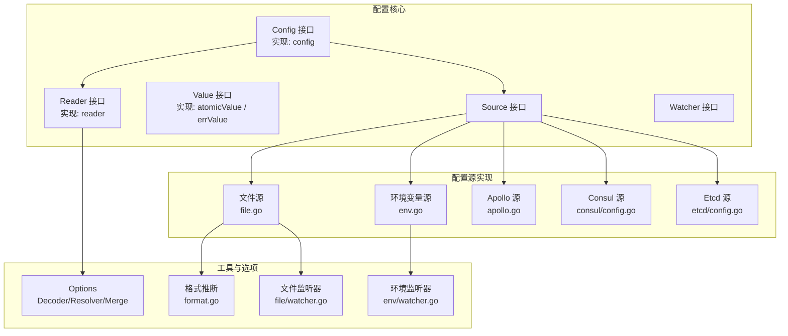
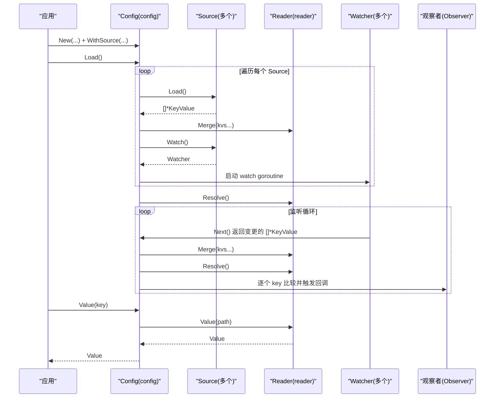
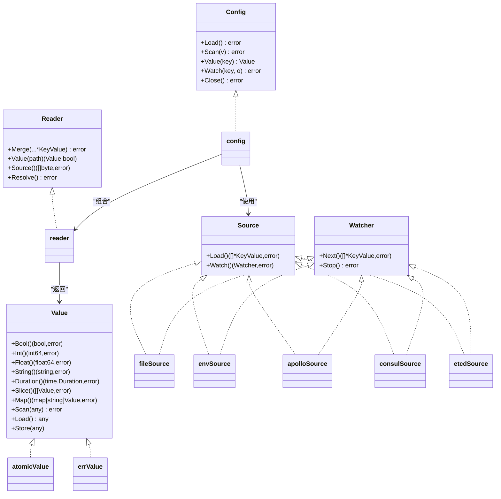

# 配置管理API

<cite>
**本文引用的文件**
- [config.go](file://config/config.go)
- [options.go](file://config/options.go)
- [reader.go](file://config/reader.go)
- [value.go](file://config/value.go)
- [source.go](file://config/source.go)
- [file.go](file://config/file/file.go)
- [format.go](file://config/file/format.go)
- [file_watcher.go](file://config/file/watcher.go)
- [env.go](file://config/env/env.go)
- [env_watcher.go](file://config/env/watcher.go)
- [apollo.go](file://contrib/config/apollo/apollo.go)
- [consul_config.go](file://contrib/config/consul/config.go)
- [etcd_config.go](file://contrib/config/etcd/config.go)
- [config_test.go](file://config/config_test.go)
- [options_test.go](file://config/options_test.go)
- [reader_test.go](file://config/reader_test.go)
- [value_test.go](file://config/value_test.go)
</cite>

## 目录
1. [简介](#简介)
2. [项目结构](#项目结构)
3. [核心组件](#核心组件)
4. [架构总览](#架构总览)
5. [详细组件分析](#详细组件分析)
6. [依赖关系分析](#依赖关系分析)
7. [性能与并发特性](#性能与并发特性)
8. [故障排查指南](#故障排查指南)
9. [结论](#结论)
10. [附录：最佳实践与示例](#附录最佳实践与示例)

## 简介
本文件面向使用者与维护者，系统性梳理 Kratos 配置管理子系统的 API 设计与实现要点，重点覆盖：
- Config 结构体的初始化流程与加载机制
- New 函数支持的配置源（文件、环境变量、远程配置中心）及 WithSource 选项
- 读取器（Reader）的解析规则与格式支持（JSON、YAML、Properties 等）
- 动态配置更新的监听机制与事件处理
- 配置值提取（Value）的类型转换方法与默认值设置技巧
- 多环境配置管理与敏感信息处理的最佳实践

## 项目结构
配置管理位于 config 包，核心接口与实现如下：
- 接口与核心实现：Config、Reader、Value、Source、Watcher
- 默认实现：config（Config）、reader（Reader）、atomicValue（Value）
- 配置源实现：文件源、环境变量源、Apollo、Consul、Etcd
- 工具与选项：Options、Decoder、Resolver、Merge 策略

图表来源
- [config.go](file://config/config.go#L1-L159)
- [reader.go](file://config/reader.go#L1-L173)
- [value.go](file://config/value.go#L1-L194)
- [source.go](file://config/source.go#L1-L21)
- [file.go](file://config/file/file.go#L1-L81)
- [format.go](file://config/file/format.go#L1-L11)
- [file_watcher.go](file://config/file/watcher.go#L1-L69)
- [env.go](file://config/env/env.go#L1-L63)
- [env_watcher.go](file://config/env/watcher.go#L1-L31)
- [apollo.go](file://contrib/config/apollo/apollo.go#L1-L287)
- [consul_config.go](file://contrib/config/consul/config.go#L1-L91)
- [etcd_config.go](file://contrib/config/etcd/config.go#L1-L97)

章节来源
- [config.go](file://config/config.go#L1-L159)
- [options.go](file://config/options.go#L1-L197)
- [reader.go](file://config/reader.go#L1-L173)
- [value.go](file://config/value.go#L1-L194)
- [source.go](file://config/source.go#L1-L21)

## 核心组件
- Config 接口与实现
  - 提供 Load、Scan、Value、Watch、Close 等能力
  - 内部持有 Reader、多个 Watcher、观察者映射与缓存
- Reader 接口与实现
  - 负责合并 KeyValue、路径查询、导出原始数据、占位符解析
  - 支持并发安全（互斥锁保护）
- Value 接口与实现
  - 原子存储任意类型值，提供 Bool/Int/Float/String/Duration/Slice/Map/Scan 等类型转换
- Options 与解析器
  - Decoder：将 KeyValue 解码为 map[string]any
  - Resolver：占位符展开与可选的实际类型转换
  - Merge：合并策略（默认覆盖）

章节来源
- [config.go](file://config/config.go#L24-L159)
- [reader.go](file://config/reader.go#L17-L173)
- [value.go](file://config/value.go#L21-L194)
- [options.go](file://config/options.go#L1-L197)

## 架构总览
配置加载与动态更新的总体流程如下：

图表来源
- [config.go](file://config/config.go#L96-L159)
- [reader.go](file://config/reader.go#L39-L77)
- [source.go](file://config/source.go#L1-L21)

## 详细组件分析

### Config 初始化与加载流程
- New
  - 接受 Option 列表，默认设置 decoder、resolver、merge
  - 返回 config 实例并构造 reader
- Load
  - 依次调用每个 Source 的 Load，合并到 Reader
  - 为每个 Source 启动 Watcher 并启动 watch goroutine
  - 最后执行 Resolve 完成占位符解析
- Value
  - 先查本地缓存，未命中则从 Reader 查询
  - 不存在返回带错误的 Value
- Watch
  - 注册观察者，仅当对应 key 存在时有效
- Close
  - 关闭所有 Watcher

章节来源
- [config.go](file://config/config.go#L45-L159)

### Reader 解析与合并
- Merge
  - 克隆当前 values，对每个 KeyValue 使用 decoder 解码为目标 map
  - 使用 merge 策略合并到克隆后的 map，再原子替换
- Value
  - 通过点号路径分段查找，返回原子 Value
- Source
  - 导出当前 values 的 JSON 字节（支持 proto.Message 序列化）
- Resolve
  - 执行 resolver 对 values 进行占位符替换

章节来源
- [reader.go](file://config/reader.go#L39-L173)

### Options 与解析规则
- Decoder
  - 若 Format 为空：将键名按“.”拆分为嵌套 map，值直接放入
  - 若 Format 非空：通过编码库获取编解码器进行反序列化
- Resolver
  - 默认：占位符格式 ${key:default}，支持字符串、数组、嵌套 map 的递归替换
  - 可启用实际类型转换：WithResolveActualTypes(true)
- Merge
  - 默认使用覆盖合并策略

章节来源
- [options.go](file://config/options.go#L31-L197)

### Value 类型转换与默认值
- 类型转换
  - Bool/Int/Float/String/Duration/Slice/Map/Scan
  - 支持多种输入类型到目标类型的转换
- 默认值
  - 占位符 ${key:default} 在找不到 key 时使用默认值
  - WithResolveActualTypes(true) 可将字符串默认值转为布尔/整数/浮点等

章节来源
- [value.go](file://config/value.go#L21-L194)
- [options.go](file://config/options.go#L101-L197)

### 配置源与监听器

#### 文件源（file）
- 加载
  - 支持单文件或目录；目录下忽略隐藏文件
  - 通过文件名后缀推断格式
- 监听
  - 基于 fsnotify，自动重监听被重命名的文件
  - 目录模式下根据事件定位具体文件

章节来源
- [file.go](file://config/file/file.go#L1-L81)
- [format.go](file://config/file/format.go#L1-L11)
- [file_watcher.go](file://config/file/watcher.go#L1-L69)

#### 环境变量源（env）
- 加载
  - 读取进程环境变量，可指定前缀过滤
  - 将匹配的键名去除前缀后作为配置键
- 监听
  - 环境变量不支持动态监听，返回一个永远阻塞的 Watcher（Stop 后退出）

章节来源
- [env.go](file://config/env/env.go#L1-L63)
- [env_watcher.go](file://config/env/watcher.go#L1-L31)

#### Apollo 源（contrib/config/apollo）
- 加载
  - 支持多个命名空间；根据后缀选择格式（yaml/yml/json/properties）
  - 可启用原始配置（不解析）以保留原生内容
- 监听
  - 基于 Apollo 客户端事件驱动

章节来源
- [apollo.go](file://contrib/config/apollo/apollo.go#L1-L287)

#### Consul 源（contrib/config/consul）
- 加载
  - 通过 KV 列表读取，路径前缀可配置
  - 根据键名后缀推断格式
- 监听
  - 基于 Consul Watcher

章节来源
- [consul_config.go](file://contrib/config/consul/config.go#L1-L91)

#### Etcd 源（contrib/config/etcd）
- 加载
  - 支持前缀扫描或单键读取
  - 根据键名后缀推断格式
- 监听
  - 基于 etcd Watcher

章节来源
- [etcd_config.go](file://contrib/config/etcd/config.go#L1-L97)

### 动态更新与事件处理
- watch 循环
  - 从 Watcher.Next 获取变更的 KeyValue
  - 合并并解析，比较缓存中的值是否变化，若变化则更新缓存并触发观察者回调
- 错误处理
  - 监听循环内捕获错误并重试，避免 goroutine 退出
  - Watcher 上下文取消时优雅退出

章节来源
- [config.go](file://config/config.go#L62-L94)

## 依赖关系分析

图表来源
- [config.go](file://config/config.go#L24-L159)
- [reader.go](file://config/reader.go#L17-L173)
- [value.go](file://config/value.go#L21-L194)
- [source.go](file://config/source.go#L1-L21)
- [file.go](file://config/file/file.go#L1-L81)
- [env.go](file://config/env/env.go#L1-L63)
- [apollo.go](file://contrib/config/apollo/apollo.go#L1-L287)
- [consul_config.go](file://contrib/config/consul/config.go#L1-L91)
- [etcd_config.go](file://contrib/config/etcd/config.go#L1-L97)

## 性能与并发特性
- 并发安全
  - Reader 内部使用互斥锁保护 values 的读写
  - Value 使用原子存储，读取无锁
- 合并策略
  - 默认覆盖合并，适合配置叠加场景
- 解析与转换
  - 占位符解析采用递归遍历，复杂度与键数量线性相关
- 监听开销
  - 文件源基于 fsnotify，事件驱动；环境源为阻塞等待，适合静态配置
- 编解码
  - 通过编码库按格式反序列化，避免重复解析

章节来源
- [reader.go](file://config/reader.go#L39-L173)
- [value.go](file://config/value.go#L21-L194)
- [options.go](file://config/options.go#L1-L197)

## 故障排查指南
- 常见问题
  - 占位符未生效：检查占位符格式 ${key:default} 是否正确，以及 key 是否存在于已解析的 values 中
  - 类型转换失败：确认传入值可被转换为目标类型，或使用 WithResolveActualTypes(true) 自动转换
  - 文件监听无效：确认 fsnotify 可监听的路径与权限，目录模式下注意重命名事件
  - 环境变量监听无效：环境变量源不支持动态监听，需重启应用或使用其他动态源
- 调试建议
  - 使用 Scan 将当前配置导出为 JSON/Proto，核对最终状态
  - 在 Watch 回调中记录 key 与新旧值，定位变更范围

章节来源
- [config.go](file://config/config.go#L62-L159)
- [reader.go](file://config/reader.go#L67-L173)
- [options.go](file://config/options.go#L101-L197)
- [env_watcher.go](file://config/env/watcher.go#L1-L31)

## 结论
该配置管理子系统以接口抽象为核心，通过 Source/Watcher 的插件化设计实现了多源统一加载与动态更新；Reader 提供了灵活的解码、合并与解析能力；Value 则提供了丰富的类型转换与默认值处理。结合测试用例与源码实现，用户可以安全地在不同环境中使用文件、环境变量与远程配置中心，并通过占位符与类型转换实现灵活的配置管理。

## 附录：最佳实践与示例

### 新建配置实例与加载
- 使用 New 创建配置实例，通过 WithSource 注入多个配置源
- 建议先加载本地文件，再加载远程配置中心，以便本地覆盖远程
- 示例参考
  - [config_test.go](file://config/config_test.go#L111-L189)

章节来源
- [config_test.go](file://config/config_test.go#L111-L189)

### 配置源选择与组合
- 文件源：适用于开发与静态配置
- 环境变量源：适用于容器化部署与最小化配置注入
- 远程配置中心：适用于生产环境动态配置与灰度发布
- 示例参考
  - [file.go](file://config/file/file.go#L1-L81)
  - [env.go](file://config/env/env.go#L1-L63)
  - [apollo.go](file://contrib/config/apollo/apollo.go#L1-L287)
  - [consul_config.go](file://contrib/config/consul/config.go#L1-L91)
  - [etcd_config.go](file://contrib/config/etcd/config.go#L1-L97)

### 占位符与默认值
- 使用 ${key:default} 设置默认值
- 启用 WithResolveActualTypes(true) 可将字符串默认值转为布尔/整数/浮点
- 示例参考
  - [options_test.go](file://config/options_test.go#L45-L200)
  - [options_test.go](file://config/options_test.go#L202-L358)

### 类型转换与导出
- 使用 Value 的 Bool/Int/Float/String/Duration/Slice/Map/Scan 方法
- 使用 Scan 将当前配置导出为 JSON 或 Proto
- 示例参考
  - [value_test.go](file://config/value_test.go#L1-L225)
  - [reader.go](file://config/reader.go#L160-L173)

### 动态更新与观察者
- 使用 Watch 注册观察者，监听特定 key 的变化
- 在 watch 循环中，系统会自动合并、解析并触发回调
- 示例参考
  - [config.go](file://config/config.go#L62-L159)
  - [config_test.go](file://config/config_test.go#L151-L189)

### 多环境配置管理
- 开发：优先本地文件源
- 测试：引入环境变量源，用于覆盖关键参数
- 生产：引入远程配置中心，结合灰度发布策略
- 示例参考
  - [file.go](file://config/file/file.go#L1-L81)
  - [env.go](file://config/env/env.go#L1-L63)
  - [apollo.go](file://contrib/config/apollo/apollo.go#L1-L287)

### 敏感信息处理
- 不将明文敏感信息写入文件或环境变量
- 使用远程配置中心的密文存储与解密能力
- 通过占位符引用密钥，避免硬编码
- 示例参考
  - [apollo.go](file://contrib/config/apollo/apollo.go#L1-L287)