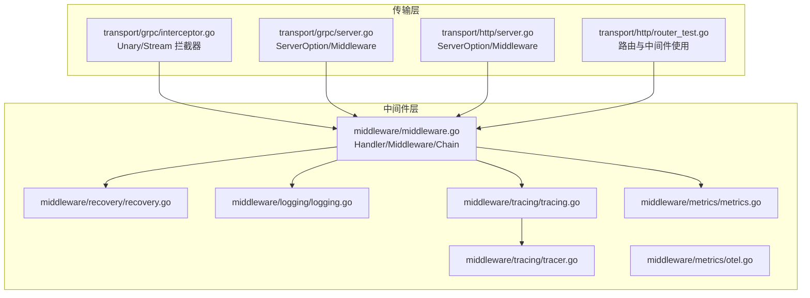
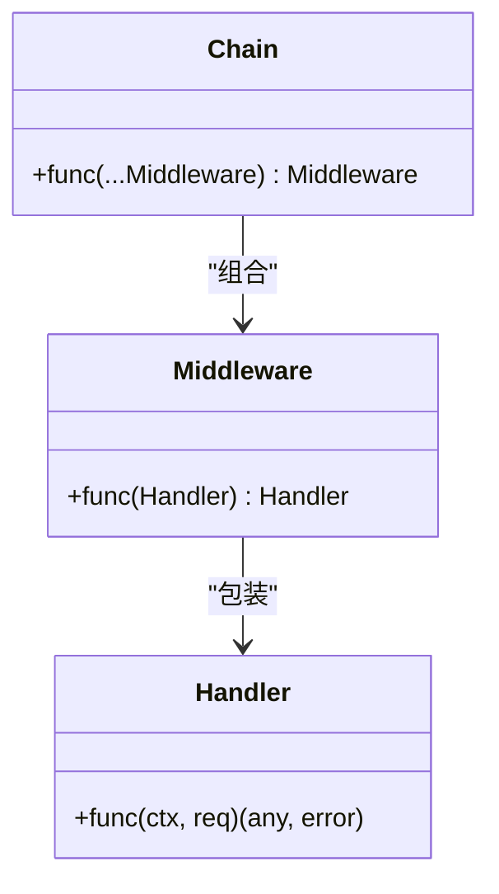
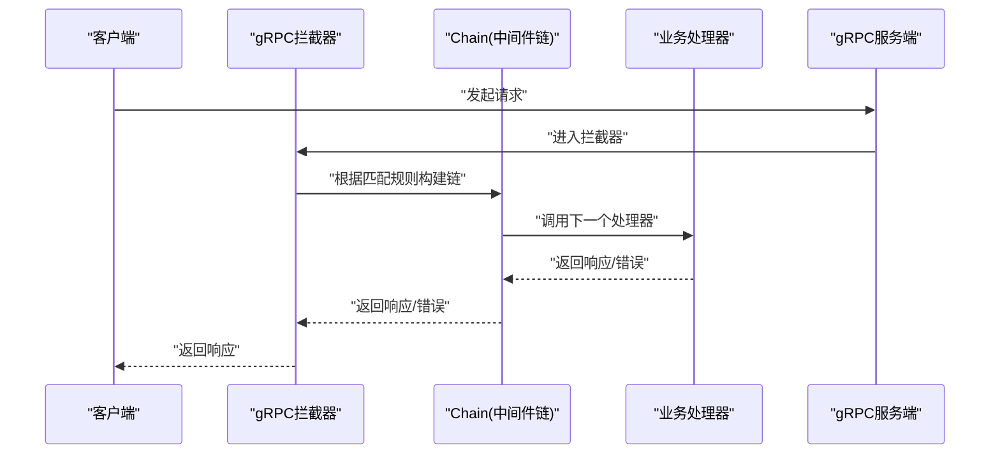
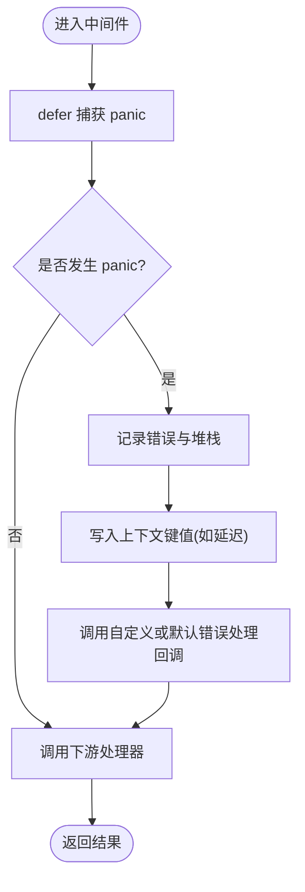
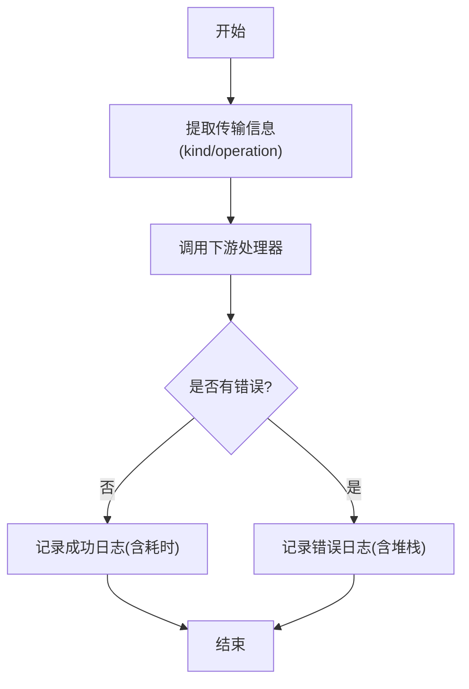
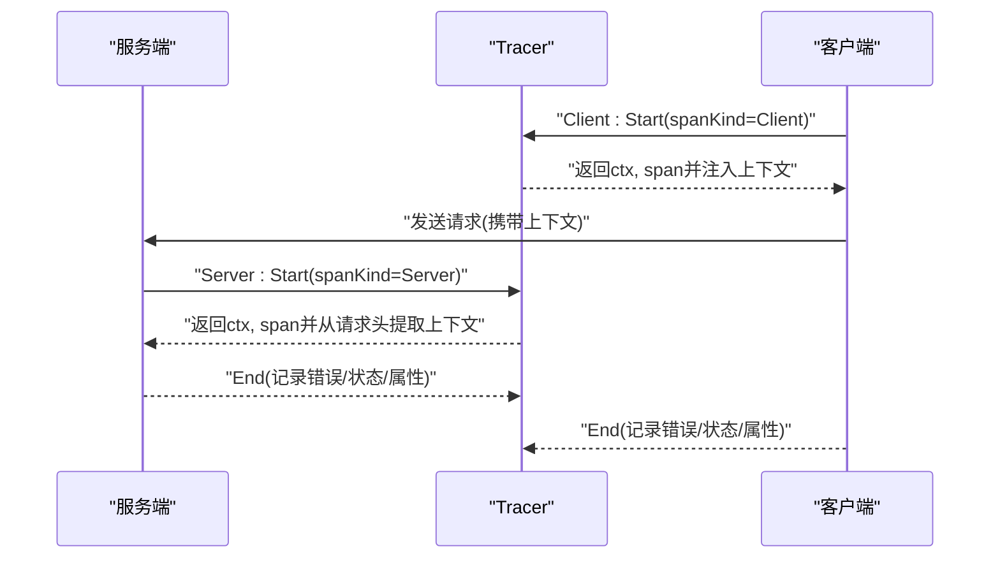
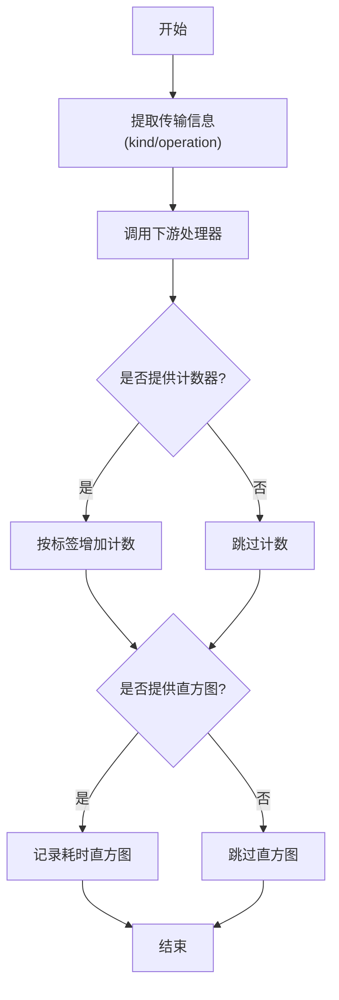
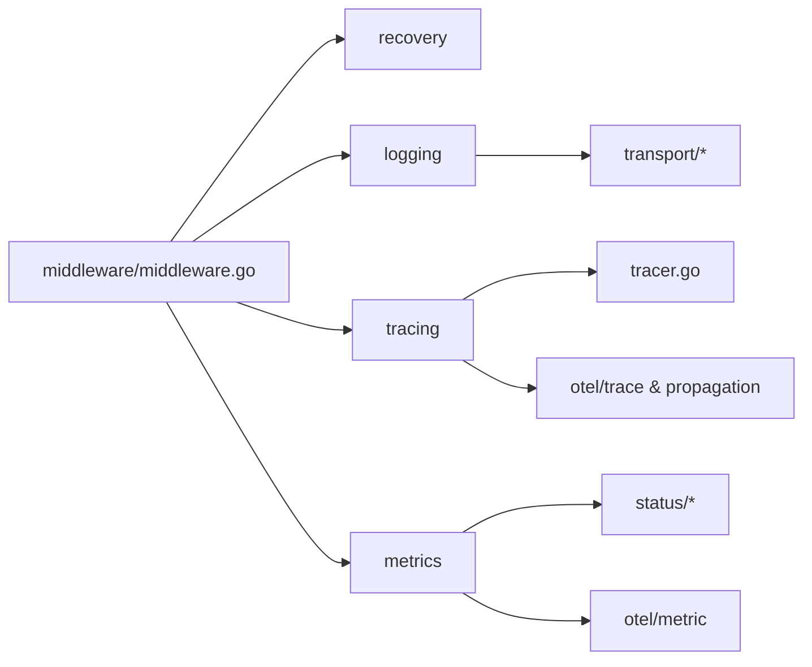

# 中间件系统

<cite>
**本文引用的文件列表**
- [middleware.go](file://middleware/middleware.go)
- [middleware_test.go](file://middleware/middleware_test.go)
- [recovery.go](file://middleware/recovery/recovery.go)
- [logging.go](file://middleware/logging/logging.go)
- [tracing.go](file://middleware/tracing/tracing.go)
- [tracer.go](file://middleware/tracing/tracer.go)
- [metrics.go](file://middleware/metrics/metrics.go)
- [otel.go](file://middleware/metrics/otel.go)
- [server.go](file://transport/grpc/server.go)
- [interceptor.go](file://transport/grpc/interceptor.go)
- [server.go](file://transport/http/server.go)
- [router_test.go](file://transport/http/router_test.go)
- [grpc_server_test.go](file://transport/grpc/server_test.go)
</cite>

## 目录
1. [引言](#引言)
2. [项目结构](#项目结构)
3. [核心组件](#核心组件)
4. [架构总览](#架构总览)
5. [组件详解](#组件详解)
6. [依赖关系分析](#依赖关系分析)
7. [性能与可扩展性](#性能与可扩展性)
8. [故障排查指南](#故障排查指南)
9. [结论](#结论)
10. [附录：自定义中间件与最佳实践](#附录自定义中间件与最佳实践)

## 引言
本文件系统化阐述 Kratos 中间件系统的函数式链式调用设计，重点围绕 middleware.go 中的 HandlerFunc 类型与 Chain 函数，解释请求在中间件链中的传递机制，并深入解析框架内置的关键中间件：recovery（服务自愈）、logging（请求日志）、tracing（OpenTelemetry 分布式追踪）与 metrics（服务指标）。文档同时提供配置与使用示例，以及如何编写自定义中间件以满足特定业务需求。

## 项目结构
中间件系统位于 middleware 目录，按功能拆分为多个子包：
- 基础类型与链式组合：middleware/middleware.go
- 自愈中间件：middleware/recovery/recovery.go
- 日志中间件：middleware/logging/logging.go
- 追踪中间件：middleware/tracing/tracing.go、middleware/tracing/tracer.go
- 指标中间件：middleware/metrics/metrics.go、middleware/metrics/otel.go
- 传输层接入：transport/grpc/interceptor.go、transport/grpc/server.go、transport/http/server.go、transport/http/router_test.go

图表来源
- [middleware.go](file://middleware/middleware.go#L1-L21)
- [recovery.go](file://middleware/recovery/recovery.go#L1-L63)
- [logging.go](file://middleware/logging/logging.go#L1-L120)
- [tracing.go](file://middleware/tracing/tracing.go#L1-L97)
- [tracer.go](file://middleware/tracing/tracer.go#L1-L83)
- [metrics.go](file://middleware/metrics/metrics.go#L1-L211)
- [otel.go](file://middleware/metrics/otel.go#L1-L8)
- [interceptor.go](file://transport/grpc/interceptor.go#L1-L130)
- [server.go](file://transport/grpc/server.go#L1-L200)
- [server.go](file://transport/http/server.go#L1-L200)
- [router_test.go](file://transport/http/router_test.go#L51-L111)

章节来源
- [middleware.go](file://middleware/middleware.go#L1-L21)
- [server.go](file://transport/grpc/server.go#L1-L200)
- [interceptor.go](file://transport/grpc/interceptor.go#L1-L130)
- [server.go](file://transport/http/server.go#L1-L200)
- [router_test.go](file://transport/http/router_test.go#L51-L111)

## 核心组件
- Handler 与 Middleware
  - Handler 定义为接收上下文与请求对象并返回响应与错误的函数类型。
  - Middleware 是对 Handler 的包装函数，输入一个 Handler 返回另一个 Handler。
- Chain
  - 将多个中间件按逆序组合成单一中间件，形成“洋葱模型”的执行顺序：外层先入栈后出栈，内层后入栈先出栈。

图表来源
- [middleware.go](file://middleware/middleware.go#L1-L21)

章节来源
- [middleware.go](file://middleware/middleware.go#L1-L21)
- [middleware_test.go](file://middleware/middleware_test.go#L1-L62)

## 架构总览
中间件链在传输层被注入到请求处理流程中：
- gRPC：通过拦截器在进入业务处理器前构建链式中间件，并在处理完成后设置响应头。
- HTTP：通过 ServerOption 注册全局中间件，路由层支持在路由级别挂载中间件。

图表来源
- [interceptor.go](file://transport/grpc/interceptor.go#L1-L130)
- [server.go](file://transport/grpc/server.go#L1-L200)
- [middleware.go](file://middleware/middleware.go#L1-L21)

章节来源
- [interceptor.go](file://transport/grpc/interceptor.go#L1-L130)
- [server.go](file://transport/grpc/server.go#L1-L200)
- [server.go](file://transport/http/server.go#L1-L200)
- [router_test.go](file://transport/http/router_test.go#L51-L111)

## 组件详解

### recovery 中间件（服务自愈）
- 职责：捕获 panic 并恢复，记录堆栈，将错误转换为统一错误格式，便于上层处理。
- 关键点：
  - 使用 defer 在处理结束后检查是否发生 panic。
  - 记录请求参数与堆栈信息，便于定位问题。
  - 可通过选项注入自定义错误处理回调，覆盖默认未知错误行为。
  - 提供上下文键值用于传递延迟时间等信息。

图表来源
- [recovery.go](file://middleware/recovery/recovery.go#L1-L63)

章节来源
- [recovery.go](file://middleware/recovery/recovery.go#L1-L63)

使用示例
- 在 gRPC 服务中注册 recovery 中间件，确保服务在出现异常时不会崩溃。
- 在 HTTP 服务中同样可注册，配合日志与指标中间件进行统一观测。

### logging 中间件（请求日志）
- 职责：记录请求与响应的关键信息，包括组件类型、操作名、参数、状态码、原因、耗时与错误堆栈。
- 关键点：
  - 支持服务端与客户端两种日志形态。
  - 从传输上下文中提取 kind 与 operation，增强可观测性。
  - 参数输出支持 Redacter 接口与 Stringer 接口，避免敏感信息泄露。
  - 错误级别根据是否存在错误自动选择。

图表来源
- [logging.go](file://middleware/logging/logging.go#L1-L120)

章节来源
- [logging.go](file://middleware/logging/logging.go#L1-L120)

使用示例
- 在 HTTP 与 gRPC 服务中分别注册 Server/Client 日志中间件，统一输出结构化日志。

### tracing 中间件（OpenTelemetry 分布式追踪）
- 职责：为服务端与客户端创建/注入/提取 Span，记录错误与状态码，支持自定义传播器与 TracerProvider。
- 关键点：
  - 通过 NewTracer 创建 Tracer，支持自定义 Tracer 名称与 Provider。
  - Server 端从请求头提取上下文，Client 端向请求头注入上下文。
  - 结束时根据错误设置状态与属性，记录消息大小等元数据。

图表来源
- [tracing.go](file://middleware/tracing/tracing.go#L1-L97)
- [tracer.go](file://middleware/tracing/tracer.go#L1-L83)

章节来源
- [tracing.go](file://middleware/tracing/tracing.go#L1-L97)
- [tracer.go](file://middleware/tracing/tracer.go#L1-L83)

使用示例
- 在 HTTP 与 gRPC 服务中分别注册 Server/Client 追踪中间件，结合日志中间件输出 TraceID/SpanID。

### metrics 中间件（服务指标）
- 职责：采集请求计数与耗时直方图，支持服务端与客户端维度，标签包含 kind、operation、code、reason。
- 关键点：
  - 默认提供计数器与直方图的构造方法，支持自定义 Meter。
  - 可通过选项注入已有的 Int64Counter 与 Float64Histogram 实例。
  - 提供默认直方图视图，便于 SDK 配置边界。
  - 提供启用 OTEL Exemplar 的环境变量工具。

图表来源
- [metrics.go](file://middleware/metrics/metrics.go#L1-L211)
- [otel.go](file://middleware/metrics/otel.go#L1-L8)

章节来源
- [metrics.go](file://middleware/metrics/metrics.go#L1-L211)
- [otel.go](file://middleware/metrics/otel.go#L1-L8)

使用示例
- 在 HTTP 与 gRPC 服务中分别注册 Server/Client 指标中间件，结合默认视图与 MeterProvider 输出 Prometheus 指标。

## 依赖关系分析
- 中间件基础类型与链式组合
  - middleware/middleware.go 定义 Handler/Middleware/Chain，是所有中间件的基础契约。
- 传输层接入
  - gRPC 通过拦截器在进入业务处理器前构建链式中间件，并在处理完成后设置响应头。
  - HTTP 通过 ServerOption 注册全局中间件，路由层支持在路由级别挂载中间件。
- 中间件内部依赖
  - logging 依赖 transport 与 errors，用于提取传输信息与错误映射。
  - tracing 依赖 OpenTelemetry 的 trace 与 propagation，Tracer 负责 Start/End 与上下文传播。
  - metrics 依赖 OpenTelemetry 的 metric 与 status，负责计数与直方图记录。

图表来源
- [middleware.go](file://middleware/middleware.go#L1-L21)
- [recovery.go](file://middleware/recovery/recovery.go#L1-L63)
- [logging.go](file://middleware/logging/logging.go#L1-L120)
- [tracing.go](file://middleware/tracing/tracing.go#L1-L97)
- [tracer.go](file://middleware/tracing/tracer.go#L1-L83)
- [metrics.go](file://middleware/metrics/metrics.go#L1-L211)

章节来源
- [interceptor.go](file://transport/grpc/interceptor.go#L1-L130)
- [server.go](file://transport/grpc/server.go#L1-L200)
- [server.go](file://transport/http/server.go#L1-L200)
- [router_test.go](file://transport/http/router_test.go#L51-L111)

## 性能与可扩展性
- 执行顺序与开销
  - Chain 采用逆序组合，外层中间件先执行，内层后执行。合理安排中间件顺序可减少不必要的计算。
  - tracing 与 metrics 会引入额外的上下文传播与指标记录开销，建议在生产环境中按需启用。
- 指标直方图边界
  - 默认直方图边界针对常见延迟分布进行了优化，可根据业务场景调整以提升精度与性能。
- 日志与错误处理
  - logging 对参数输出有安全考虑（Redacter/Stringer），避免敏感信息泄露；recovery 仅在 panic 发生时记录堆栈，降低正常路径开销。

[本节为通用指导，不直接分析具体文件]

## 故障排查指南
- panic 恢复
  - 若服务出现异常崩溃，确认 recovery 中间件已注册；检查日志中是否包含堆栈信息与请求参数。
- 追踪缺失
  - 确认 tracing 中间件已在服务端/客户端注册；检查请求头是否正确注入/提取上下文。
- 指标未上报
  - 确认已提供计数器与直方图实例，或使用默认构造方法；检查 MeterProvider 视图配置与边界。
- 日志不完整
  - 确认 logging 中间件已注册；检查 Redacter/Stringer 实现是否正确输出参数。

章节来源
- [recovery.go](file://middleware/recovery/recovery.go#L1-L63)
- [logging.go](file://middleware/logging/logging.go#L1-L120)
- [tracing.go](file://middleware/tracing/tracing.go#L1-L97)
- [metrics.go](file://middleware/metrics/metrics.go#L1-L211)

## 结论
Kratos 的中间件系统以函数式链式调用为核心，通过 Handler/Middleware/Chain 构建了清晰、可组合、可扩展的横切能力体系。内置的 recovery、logging、tracing、metrics 中间件覆盖了服务自愈、可观测性与治理的关键需求。在传输层的 gRPC 与 HTTP 中均可无缝接入，开发者可按需组合并扩展自定义中间件，满足复杂微服务场景下的多样化需求。

[本节为总结性内容，不直接分析具体文件]

## 附录：自定义中间件与最佳实践

### 编写自定义中间件
- 设计原则
  - 保持纯函数式：中间件只处理上下文与请求，不改变外部状态。
  - 明确职责边界：每个中间件专注单一职责，避免过度耦合。
  - 保证链路完整性：在调用下游处理器前后分别处理前置与后置逻辑。
- 示例步骤
  - 定义中间件函数：接收一个 Handler 并返回一个新的 Handler。
  - 在传输层注册：在 gRPC 的 ServerOption 或 HTTP 的 ServerOption 中注册中间件。
  - 组合使用：通过 Chain 或传输层提供的匹配器按需组合中间件。

章节来源
- [middleware.go](file://middleware/middleware.go#L1-L21)
- [server.go](file://transport/grpc/server.go#L1-L200)
- [server.go](file://transport/http/server.go#L1-L200)
- [router_test.go](file://transport/http/router_test.go#L51-L111)

### 配置与使用示例（路径指引）
- gRPC 服务端
  - 注册中间件：参考 [grpc_server_test.go](file://transport/grpc/server_test.go#L73-L102)，在 NewServer 时通过 Middleware 选项注入自定义中间件。
  - 拦截器链：参考 [interceptor.go](file://transport/grpc/interceptor.go#L1-L130)，在拦截器中使用 Chain 构建链式中间件。
- HTTP 服务端
  - 注册中间件：参考 [server.go](file://transport/http/server.go#L60-L70)，通过 Middleware 选项注册全局中间件。
  - 路由级中间件：参考 [router_test.go](file://transport/http/router_test.go#L51-L111)，在路由层挂载中间件。
- recovery
  - 注册与选项：参考 [recovery.go](file://middleware/recovery/recovery.go#L1-L63)，通过 WithHandler 注入自定义错误处理回调。
- logging
  - 注册与参数输出：参考 [logging.go](file://middleware/logging/logging.go#L1-L120)，实现 Redacter/Stringer 控制参数输出。
- tracing
  - 注册与传播器：参考 [tracing.go](file://middleware/tracing/tracing.go#L1-L97)，通过 WithPropagator/WithTracerProvider/WithTracerName 自定义传播与 Tracer。
- metrics
  - 注册与视图：参考 [metrics.go](file://middleware/metrics/metrics.go#L1-L211)，通过 WithRequests/WithSeconds 注入指标实例；参考 [otel.go](file://middleware/metrics/otel.go#L1-L8) 启用 Exemplar。

章节来源
- [grpc_server_test.go](file://transport/grpc/server_test.go#L73-L102)
- [interceptor.go](file://transport/grpc/interceptor.go#L1-L130)
- [server.go](file://transport/http/server.go#L60-L70)
- [router_test.go](file://transport/http/router_test.go#L51-L111)
- [recovery.go](file://middleware/recovery/recovery.go#L1-L63)
- [logging.go](file://middleware/logging/logging.go#L1-L120)
- [tracing.go](file://middleware/tracing/tracing.go#L1-L97)
- [metrics.go](file://middleware/metrics/metrics.go#L1-L211)
- [otel.go](file://middleware/metrics/otel.go#L1-L8)