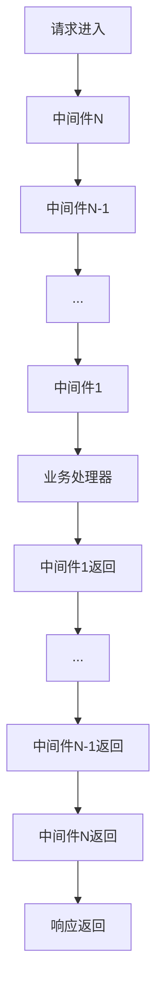

# 内置中间件

<cite>
**本文档中引用的文件**
- [middleware.go](file://middleware/middleware.go)
- [recovery.go](file://middleware/recovery/recovery.go)
- [logging.go](file://middleware/logging/logging.go)
- [tracing.go](file://middleware/tracing/tracing.go)
- [metrics.go](file://middleware/metrics/metrics.go)
- [ratelimit.go](file://middleware/ratelimit/ratelimit.go)
- [validate.go](file://middleware/validate/validate.go)
- [jwt.go](file://middleware/auth/jwt/jwt.go)
- [circuitbreaker.go](file://middleware/circuitbreaker/circuitbreaker.go)
- [metadata.go](file://middleware/metadata/metadata.go)
- [selector.go](file://middleware/selector/selector.go)
- [tracer.go](file://middleware/tracing/tracer.go)
- [otel.go](file://middleware/metrics/otel.go)
- [validate.go](file://contrib/middleware/validate/validate.go)
- [recovery_test.go](file://middleware/recovery/recovery_test.go)
- [logging_test.go](file://middleware/logging/logging_test.go)
- [tracing_test.go](file://middleware/tracing/tracing_test.go)
</cite>

## 目录
1. [介绍](#介绍)
2. [中间件链与执行顺序](#中间件链与执行顺序)
3. [recovery中间件](#recovery中间件)
4. [logging中间件](#logging中间件)
5. [tracing中间件](#tracing中间件)
6. [metrics中间件](#metrics中间件)
7. [ratelimit中间件](#ratelimit中间件)
8. [validate中间件](#validate中间件)
9. [auth/jwt中间件](#authjwt中间件)
10. [circuitbreaker中间件](#circuitbreaker中间件)
11. [最佳实践](#最佳实践)

## 介绍
Kratos框架提供了一套完整的内置中间件，用于微服务治理。这些中间件覆盖了服务稳定性、日志记录、分布式追踪、系统监控、请求限流、参数校验、认证授权和熔断保护等关键领域。本文档详细介绍了各类内置中间件的功能、配置方式、启用示例和最佳实践。

**Section sources**
- [middleware.go](file://middleware/middleware.go#L1-L22)

## 中间件链与执行顺序
Kratos框架通过`Chain`函数将多个中间件组合成一个中间件链。中间件的执行遵循后进先出（LIFO）的原则，即最后添加的中间件最先执行。这种设计允许开发者灵活地控制中间件的执行顺序，确保关键的治理功能（如recovery）能够在最外层执行，从而捕获所有内部异常。



**Diagram sources**
- [middleware.go](file://middleware/middleware.go#L13-L21)

## recovery中间件
recovery中间件通过Go语言的`defer`和`recover`机制捕获Panic，防止服务因未处理的异常而崩溃，从而保障服务的稳定性。当发生Panic时，中间件会记录详细的错误日志（包括堆栈信息），并将错误转换为标准的内部服务器错误响应。

### 配置方式
```go
// 使用默认配置
recovery.Recovery()

// 使用自定义处理函数
recovery.Recovery(recovery.WithHandler(func(ctx context.Context, req, err any) error {
    return errors.InternalServer("RECOVERY", fmt.Sprintf("panic triggered: %v", err))
}))
```

### 启用示例
```go
app := kratos.New(
    kratos.Name("helloworld"),
    kratos.Server(
        httpSrv,
        grpcSrv,
    ),
    kratos.Middleware(
        recovery.Recovery(),
        logging.Server(logger),
        tracing.Server(),
    ),
)
```

### 最佳实践
- 将recovery中间件放在中间件链的最外层，确保能捕获所有内部异常
- 配置自定义的错误处理函数以返回更友好的错误信息
- 结合日志中间件，确保Panic信息被完整记录

**Section sources**
- [recovery.go](file://middleware/recovery/recovery.go#L36-L62)
- [recovery_test.go](file://middleware/recovery/recovery_test.go#L11-L43)

## logging中间件
logging中间件用于记录请求的进出日志，支持结构化输出。它能够捕获请求的上下文信息，包括传输类型、操作名称、请求参数、响应码、错误原因和执行耗时等，并以结构化的格式输出到日志系统。

### 配置方式
```go
// 服务器端日志中间件
logging.Server(logger)

// 客户端日志中间件
logging.Client(logger)
```

### 启用示例
```go
app := kratos.New(
    kratos.Name("helloworld"),
    kratos.Server(
        httpSrv,
        grpcSrv,
    ),
    kratos.Middleware(
        recovery.Recovery(),
        logging.Server(logger),
        tracing.Server(),
    ),
)
```

### 最佳实践
- 实现`Redacter`接口以控制敏感信息的输出
- 使用`fmt.Stringer`接口来自定义对象的字符串表示
- 结合OpenTelemetry，将trace_id和span_id注入日志，实现日志与追踪的关联

**Section sources**
- [logging.go](file://middleware/logging/logging.go#L23-L59)
- [logging_test.go](file://middleware/logging/logging_test.go#L42-L236)

## tracing中间件
tracing中间件集成了OpenTelemetry，实现了分布式链路追踪。它能够自动创建和传播追踪上下文，记录服务调用的完整链路，帮助开发者分析系统性能瓶颈和排查问题。

### 配置方式
```go
// 服务器端追踪中间件
tracing.Server(
    tracing.WithTracerProvider(tp),
    tracing.WithPropagator(propagation.NewCompositeTextMapPropagator(propagation.Baggage{}, propagation.TraceContext{})),
)

// 客户端追踪中间件
tracing.Client(
    tracing.WithTracerProvider(tp),
    tracing.WithPropagator(propagation.NewCompositeTextMapPropagator(propagation.Baggage{}, propagation.TraceContext{})),
)
```

### 启用示例
```go
app := kratos.New(
    kratos.Name("helloworld"),
    kratos.Server(
        httpSrv,
        grpcSrv,
    ),
    kratos.Middleware(
        recovery.Recovery(),
        logging.Server(logger),
        tracing.Server(),
    ),
)
```

### 最佳实践
- 配置合适的传播器（如TraceContext和Baggage）以确保跨服务的上下文传递
- 使用`TraceID()`和`SpanID()`作为日志字段，实现日志与追踪的关联
- 在高并发场景下，合理配置采样率以平衡性能和追踪数据的完整性

**Section sources**
- [tracing.go](file://middleware/tracing/tracing.go#L47-L59)
- [tracer.go](file://middleware/tracing/tracer.go#L24-L82)
- [tracing_test.go](file://middleware/tracing/tracing_test.go#L79-L240)

## metrics中间件
metrics中间件暴露Prometheus指标，支持系统监控。它能够自动收集和记录服务的请求次数、响应耗时等关键指标，并以Prometheus兼容的格式暴露，便于集成到现有的监控系统中。

### 配置方式
```go
// 服务器端指标中间件
metrics.Server(
    metrics.WithRequests(requestsCounter),
    metrics.WithSeconds(secondsHistogram),
)

// 客户端指标中间件
metrics.Client(
    metrics.WithRequests(requestsCounter),
    metrics.WithSeconds(secondsHistogram),
)
```

### 启用示例
```go
meter := otel.GetMeterProvider().Meter("kratos")
requestsCounter, _ := metrics.DefaultRequestsCounter(meter, metrics.DefaultServerRequestsCounterName)
secondsHistogram, _ := metrics.DefaultSecondsHistogram(meter, metrics.DefaultServerSecondsHistogramName)

app := kratos.New(
    kratos.Name("helloworld"),
    kratos.Server(
        httpSrv,
        grpcSrv,
    ),
    kratos.Middleware(
        recovery.Recovery(),
        logging.Server(logger),
        tracing.Server(),
        metrics.Server(metrics.WithRequests(requestsCounter), metrics.WithSeconds(secondsHistogram)),
    ),
)
```

### 最佳实践
- 使用`DefaultRequestsCounter`和`DefaultSecondsHistogram`创建标准的指标
- 配置`DefaultSecondsHistogramView`以定义合适的直方图边界
- 启用OTEL示例功能以支持更精细的性能分析

**Section sources**
- [metrics.go](file://middleware/metrics/metrics.go#L102-L157)
- [otel.go](file://middleware/metrics/otel.go#L5-L7)

## ratelimit中间件
ratelimit中间件实现请求限流，防止服务过载。它使用BBR（Bimodal Increase Rate）算法，根据服务的实时负载动态调整限流阈值，既能有效保护服务，又能充分利用系统资源。

### 配置方式
```go
// 使用默认的BBR限流器
ratelimit.Server()

// 使用自定义的限流器
ratelimit.Server(ratelimit.WithLimiter(customLimiter))
```

### 启用示例
```go
app := kratos.New(
    kratos.Name("helloworld"),
    kratos.Server(
        httpSrv,
        grpcSrv,
    ),
    kratos.Middleware(
        recovery.Recovery(),
        logging.Server(logger),
        tracing.Server(),
        ratelimit.Server(),
    ),
)
```

### 最佳实践
- 将限流中间件放在认证和授权之后，避免对非法请求进行不必要的限流计算
- 根据服务的SLA和资源情况合理配置限流阈值
- 结合熔断器，实现更全面的服务保护

**Section sources**
- [ratelimit.go](file://middleware/ratelimit/ratelimit.go#L32-L52)

## validate中间件
validate中间件基于Protobuf验证规则自动校验请求参数。它能够根据Protobuf消息定义中的验证规则，在请求处理前自动验证参数的合法性，减少业务代码中的校验逻辑。

### 配置方式
```go
// 使用旧的验证器（基于protoc-gen-validate）
validate.Validator()

// 使用新的验证器（基于protovalidate）
validate.ProtoValidate()
```

### 启用示例
```go
app := kratos.New(
    kratos.Name("helloworld"),
    kratos.Server(
        httpSrv,
        grpcSrv,
    ),
    kratos.Middleware(
        recovery.Recovery(),
        logging.Server(logger),
        tracing.Server(),
        validate.ProtoValidate(),
    ),
)
```

### 最佳实践
- 在Protobuf消息定义中使用`buf.validate`规则来定义验证逻辑
- 将验证中间件放在业务处理之前，确保进入业务逻辑的请求都是合法的
- 结合错误处理中间件，返回标准化的验证错误响应

**Section sources**
- [validate.go](file://middleware/validate/validate.go#L17-L28)
- [validate.go](file://contrib/middleware/validate/validate.go#L18-L37)

## auth/jwt中间件
auth/jwt中间件实现基于JWT的认证授权。它能够解析和验证JWT令牌，提取用户身份信息，并将其注入到请求上下文中，供后续的业务逻辑使用。

### 配置方式
```go
// 服务器端JWT中间件
jwt.Server(func(token *jwt.Token) (interface{}, error) {
    return []byte("your-secret-key"), nil
})

// 客户端JWT中间件
jwt.Client(func(token *jwt.Token) (interface{}, error) {
    return []byte("your-secret-key"), nil
})
```

### 启用示例
```go
app := kratos.New(
    kratos.Name("helloworld"),
    kratos.Server(
        httpSrv,
        grpcSrv,
    ),
    kratos.Middleware(
        recovery.Recovery(),
        logging.Server(logger),
        tracing.Server(),
        jwt.Server(func(token *jwt.Token) (interface{}, error) {
            return []byte("your-secret-key"), nil
        }),
    ),
)
```

### 最佳实践
- 使用安全的密钥和算法（如HS256或RS256）
- 在JWT令牌中包含必要的用户信息和权限声明
- 设置合理的令牌有效期，并实现刷新机制
- 结合RBAC（基于角色的访问控制）实现细粒度的权限管理

**Section sources**
- [jwt.go](file://middleware/auth/jwt/jwt.go#L79-L127)

## circuitbreaker中间件
circuitbreaker中间件实现熔断保护，避免级联故障。当后端服务出现故障时，熔断器会快速失败，避免大量的请求堆积，给后端服务留出恢复的时间。

### 配置方式
```go
// 使用默认的SRE熔断器
circuitbreaker.Client()

// 使用自定义的熔断器组
circuitbreaker.Client(circuitbreaker.WithGroup(customGroup))

// 使用自定义的熔断器生成函数
circuitbreaker.Client(circuitbreaker.WithCircuitBreaker(func() circuitbreaker.CircuitBreaker {
    return sre.NewBreaker()
}))
```

### 启用示例
```go
app := kratos.New(
    kratos.Name("helloworld"),
    kratos.Server(
        httpSrv,
        grpcSrv,
    ),
    kratos.Middleware(
        recovery.Recovery(),
        logging.Server(logger),
        tracing.Server(),
        circuitbreaker.Client(),
    ),
)
```

### 最佳实践
- 将熔断器放在客户端，保护后端服务
- 根据服务的SLA和故障恢复时间合理配置熔断器的参数
- 结合重试机制，实现更智能的故障恢复
- 监控熔断器的状态，及时发现和处理服务异常

**Section sources**
- [circuitbreaker.go](file://middleware/circuitbreaker/circuitbreaker.go#L44-L74)

## 最佳实践
在使用Kratos框架的内置中间件时，应遵循以下最佳实践：

1. **中间件顺序**：将recovery中间件放在最外层，确保能捕获所有异常；将认证授权中间件放在业务处理之前，确保安全性。

2. **监控与告警**：结合metrics和tracing中间件，建立全面的监控体系，及时发现和处理性能瓶颈和异常。

3. **服务保护**：使用ratelimit和circuitbreaker中间件保护服务，防止过载和级联故障。

4. **日志管理**：使用logging中间件记录结构化日志，结合trace_id和span_id实现日志与追踪的关联。

5. **参数校验**：使用validate中间件进行请求参数校验，减少业务代码中的校验逻辑。

6. **认证授权**：使用auth/jwt中间件实现基于JWT的认证授权，确保服务的安全性。

通过合理配置和使用这些内置中间件，可以构建出稳定、可靠、可维护的微服务系统。

**Section sources**
- [middleware.go](file://middleware/middleware.go#L13-L21)
- [recovery.go](file://middleware/recovery/recovery.go#L36-L62)
- [logging.go](file://middleware/logging/logging.go#L23-L59)
- [tracing.go](file://middleware/tracing/tracing.go#L47-L59)
- [metrics.go](file://middleware/metrics/metrics.go#L102-L157)
- [ratelimit.go](file://middleware/ratelimit/ratelimit.go#L32-L52)
- [validate.go](file://middleware/validate/validate.go#L17-L28)
- [jwt.go](file://middleware/auth/jwt/jwt.go#L79-L127)
- [circuitbreaker.go](file://middleware/circuitbreaker/circuitbreaker.go#L44-L74)