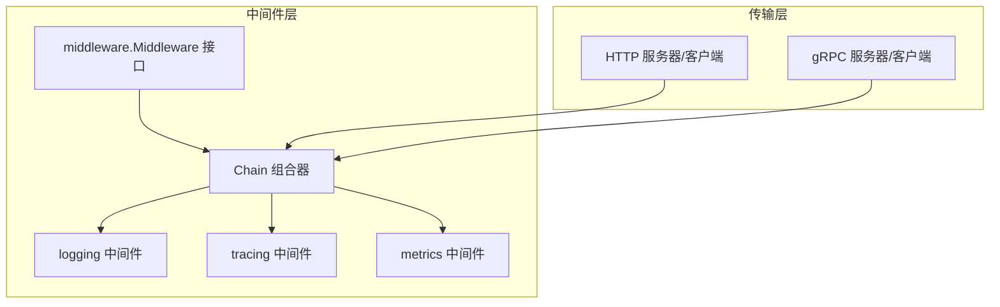
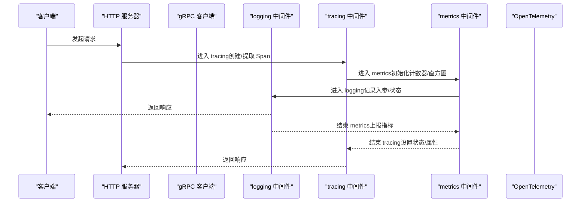
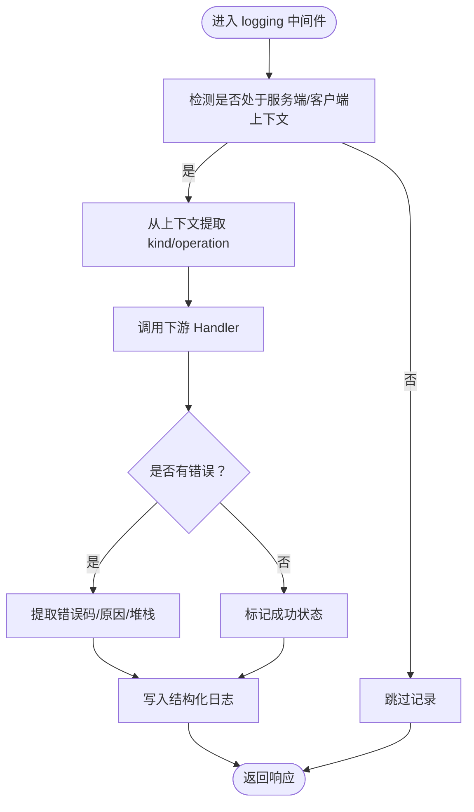
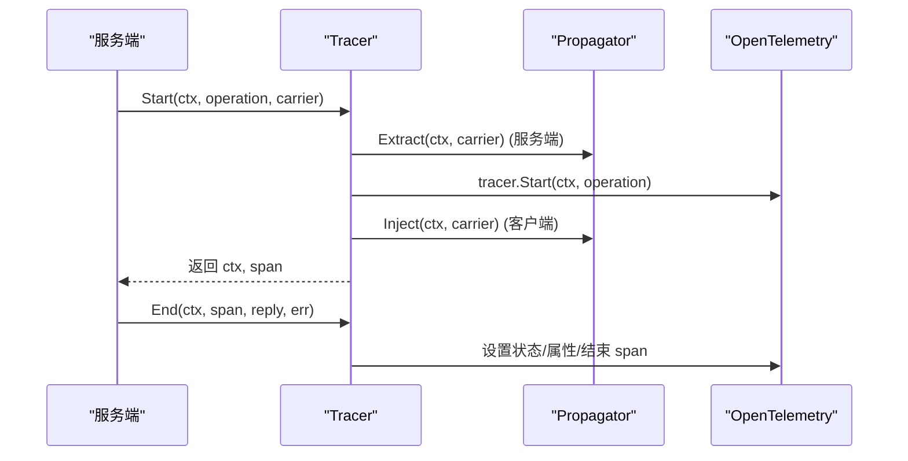
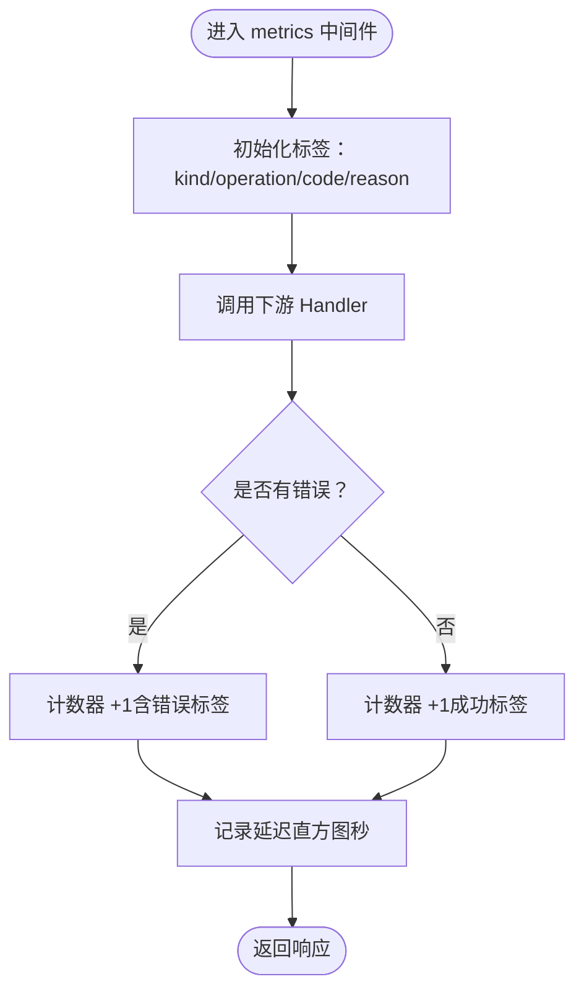
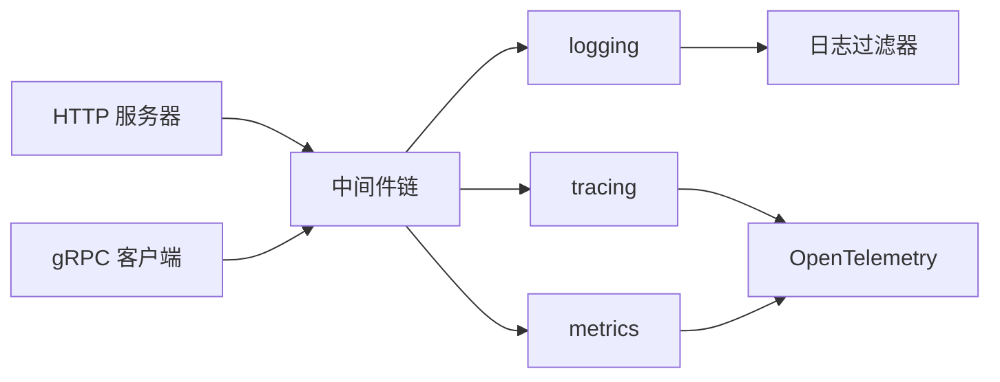

# 可观测性中间件

<cite>
**本文引用的文件**
- [middleware/middleware.go](file://middleware/middleware.go)
- [middleware/logging/logging.go](file://middleware/logging/logging.go)
- [middleware/tracing/tracing.go](file://middleware/tracing/tracing.go)
- [middleware/tracing/tracer.go](file://middleware/tracing/tracer.go)
- [middleware/tracing/span.go](file://middleware/tracing/span.go)
- [middleware/metrics/metrics.go](file://middleware/metrics/metrics.go)
- [middleware/metrics/otel.go](file://middleware/metrics/otel.go)
- [transport/transport.go](file://transport/transport.go)
- [transport/http/server.go](file://transport/http/server.go)
- [transport/grpc/client.go](file://transport/grpc/client.go)
- [log/filter.go](file://log/filter.go)
- [middleware/logging/logging_test.go](file://middleware/logging/logging_test.go)
- [middleware/tracing/tracing_test.go](file://middleware/tracing/tracing_test.go)
- [middleware/metrics/metrics_test.go](file://middleware/metrics/metrics_test.go)
</cite>

## 目录
1. [简介](#简介)
2. [项目结构](#项目结构)
3. [核心组件](#核心组件)
4. [架构总览](#架构总览)
5. [组件详解](#组件详解)
6. [依赖关系分析](#依赖关系分析)
7. [性能考量](#性能考量)
8. [故障排查指南](#故障排查指南)
9. [结论](#结论)
10. [附录：配置与启用示例](#附录配置与启用示例)

## 简介
本文件系统性介绍 Kratos 框架提供的可观测性中间件，覆盖 logging、tracing 和 metrics 三大模块：
- logging 中间件：记录请求进入与退出的日志，支持结构化输出与字段过滤；
- tracing 中间件：集成 OpenTelemetry，生成与传播分布式链路追踪上下文，支持 Span 的创建与注解；
- metrics 中间件：暴露 Prometheus 指标（请求数、延迟、错误率），支持自定义指标注册与视图配置。

文档还说明三者如何协同工作，构建完整的监控体系；给出配置示例与启用方式；明确中间件在中间件链中的典型位置；并讨论性能开销与采样策略及生产优化建议。

## 项目结构
可观测性中间件位于 middleware 子目录，分别对应 logging、tracing、metrics 三个子包。它们通过统一的中间件接口与链式组合机制接入到传输层（HTTP/GRPC）服务端与客户端。

图表来源
- [middleware/middleware.go](file://middleware/middleware.go#L1-L22)
- [transport/http/server.go](file://transport/http/server.go#L66-L70)
- [transport/grpc/client.go](file://transport/grpc/client.go#L299-L300)

章节来源
- [middleware/middleware.go](file://middleware/middleware.go#L1-L22)
- [transport/transport.go](file://transport/transport.go#L47-L95)

## 核心组件
- 中间件接口与链式组合
  - 中间件以函数形式存在，接收 Handler 并返回新的 Handler，形成可叠加的链式调用。
  - Chain 提供从右到左的组合顺序，确保后添加的中间件先执行。
- 传输上下文注入
  - 服务端/客户端上下文中注入 transport.Transporter，便于中间件读取请求类型、操作名、头信息等。
- 日志中间件
  - 记录请求入/出、错误级别、原因、耗时等；支持 Redacter 接口进行敏感字段脱敏。
- 链路追踪中间件
  - 基于 OpenTelemetry，自动创建/提取 Span，注入/导出上下文，设置语义属性。
- 指标中间件
  - 以 OpenTelemetry 指标为载体，上报请求数总量与延迟直方图，支持自定义计数器与直方图。

章节来源
- [middleware/middleware.go](file://middleware/middleware.go#L1-L22)
- [transport/transport.go](file://transport/transport.go#L47-L95)
- [middleware/logging/logging.go](file://middleware/logging/logging.go#L1-L120)
- [middleware/tracing/tracing.go](file://middleware/tracing/tracing.go#L1-L97)
- [middleware/metrics/metrics.go](file://middleware/metrics/metrics.go#L1-L211)

## 架构总览
下图展示了 HTTP/gRPC 服务在请求生命周期中，三类可观测性中间件如何协作：

图表来源
- [middleware/tracing/tracing.go](file://middleware/tracing/tracing.go#L46-L76)
- [middleware/metrics/metrics.go](file://middleware/metrics/metrics.go#L101-L157)
- [middleware/logging/logging.go](file://middleware/logging/logging.go#L22-L60)
- [transport/http/server.go](file://transport/http/server.go#L66-L70)
- [transport/grpc/client.go](file://transport/grpc/client.go#L299-L300)

## 组件详解

### logging 中间件
- 功能要点
  - 支持服务端与客户端两种形态，分别记录请求进入与退出；
  - 自动识别错误码与原因，按错误级别输出日志；
  - 输出字段包含 kind、component、operation、args、code、reason、stack、latency 等；
  - 请求参数支持 Redacter 接口进行结构化脱敏输出，否则回退到字符串化。
- 结构化输出与字段过滤
  - 通过 log.Valuer 将 traceId/spamId 注入日志上下文，便于关联链路；
  - 日志过滤器支持按键或值模糊化，避免敏感信息泄露。
- 典型位置
  - 通常置于 metrics 之后、业务处理之前，以便在业务失败时仍能记录完整上下文。

图表来源
- [middleware/logging/logging.go](file://middleware/logging/logging.go#L22-L120)
- [log/filter.go](file://log/filter.go#L58-L94)

章节来源
- [middleware/logging/logging.go](file://middleware/logging/logging.go#L1-L120)
- [log/filter.go](file://log/filter.go#L58-L94)
- [middleware/logging/logging_test.go](file://middleware/logging/logging_test.go#L1-L236)

### tracing 中间件
- 功能要点
  - 支持 Server/Client 两端，自动创建/提取 Span；
  - 默认使用复合 TextMapPropagator（Metadata/Baggage/TraceContext），保证跨进程传播；
  - 设置语义属性（HTTP 方法/路由/目标、gRPC 服务/方法、对端地址、消息大小等）；
  - 结束时根据错误设置状态与属性，并记录错误。
- OpenTelemetry 集成
  - 通过 Tracer.Start/End 管理 Span 生命周期；
  - 提供 TraceID()/SpanID() Valuer，便于日志中携带链路标识。
- 典型位置
  - 通常置于 metrics 之后、业务处理之前，确保指标与链路一致。

图表来源
- [middleware/tracing/tracing.go](file://middleware/tracing/tracing.go#L46-L76)
- [middleware/tracing/tracer.go](file://middleware/tracing/tracer.go#L17-L83)
- [middleware/tracing/span.go](file://middleware/tracing/span.go#L20-L99)

章节来源
- [middleware/tracing/tracing.go](file://middleware/tracing/tracing.go#L1-L97)
- [middleware/tracing/tracer.go](file://middleware/tracing/tracer.go#L1-L83)
- [middleware/tracing/span.go](file://middleware/tracing/span.go#L1-L153)
- [middleware/tracing/tracing_test.go](file://middleware/tracing/tracing_test.go#L1-L240)

### metrics 中间件
- 功能要点
  - 上报两类指标：
    - 请求数总量（Int64Counter）：按 kind、operation、code、reason 聚合；
    - 延迟直方图（Float64Histogram）：按 kind、operation 聚合；
  - 默认直方图边界与单位可配置，支持自定义 MeterProvider 与 View；
  - 支持启用 OTEL exemplars，便于关联具体样本。
- 指标命名与标签
  - 默认名称包含 server/client 前缀与 bucket/total 后缀；
  - 标签键包括 kind、operation、code、reason。
- 典型位置
  - 通常置于业务处理之前，确保无论成功/失败均能统计。

图表来源
- [middleware/metrics/metrics.go](file://middleware/metrics/metrics.go#L101-L210)
- [middleware/metrics/otel.go](file://middleware/metrics/otel.go#L1-L8)

章节来源
- [middleware/metrics/metrics.go](file://middleware/metrics/metrics.go#L1-L211)
- [middleware/metrics/otel.go](file://middleware/metrics/otel.go#L1-L8)
- [middleware/metrics/metrics_test.go](file://middleware/metrics/metrics_test.go#L1-L257)

## 依赖关系分析
- 中间件链与传输层
  - HTTP 服务器通过选项注入中间件链；
  - gRPC 客户端拦截器在发送/接收消息时匹配并应用中间件链。
- 三者耦合度
  - logging 与 tracing 通过日志 Valuer 关联 traceId/spanId；
  - metrics 与 tracing 共享 OpenTelemetry Provider，指标可携带 SpanID/TraceID。
- 外部依赖
  - tracing 依赖 OpenTelemetry trace/propagation；
  - metrics 依赖 OpenTelemetry metric/sdk/metric。

图表来源
- [transport/http/server.go](file://transport/http/server.go#L66-L70)
- [transport/grpc/client.go](file://transport/grpc/client.go#L299-L300)
- [middleware/logging/logging.go](file://middleware/logging/logging.go#L22-L120)
- [middleware/tracing/tracing.go](file://middleware/tracing/tracing.go#L46-L76)
- [middleware/metrics/metrics.go](file://middleware/metrics/metrics.go#L101-L210)
- [log/filter.go](file://log/filter.go#L58-L94)

章节来源
- [transport/http/server.go](file://transport/http/server.go#L66-L70)
- [transport/grpc/client.go](file://transport/grpc/client.go#L299-L300)
- [log/filter.go](file://log/filter.go#L58-L94)

## 性能考量
- 开销来源
  - logging：字符串化请求参数、错误堆栈、时间计算；
  - tracing：Span 创建/结束、属性设置、上下文传播；
  - metrics：计数器/直方图写入、标签枚举、可能的 exemplars。
- 采样与阈值
  - tracing：可通过 TracerProvider 的 Sampler 控制采样率；
  - metrics：直方图边界与聚合视图影响内存与 CPU；
  - logging：可通过日志过滤器减少高成本字段输出。
- 生产优化建议
  - 降低日志级别或启用字段过滤，避免敏感字段与大对象输出；
  - 在高并发场景下调低 tracing 采样率或仅对关键路径开启；
  - 使用默认直方图边界与视图，避免过多桶导致内存膨胀；
  - 对高频接口采用选择性中间件（结合 selector/匹配器）；
  - 合理设置指标导出周期与批处理大小。

[本节为通用指导，不直接分析具体文件]

## 故障排查指南
- 日志未输出或字段缺失
  - 检查是否正确注入了 transport 上下文；
  - 确认 logging 中间件在链中的位置是否过晚；
  - 使用日志过滤器验证键/值是否被屏蔽。
- 链路断点或 traceId 不一致
  - 确认 Propagator 是否正确配置（Metadata/Baggage/TraceContext）；
  - 检查客户端是否在请求头中注入了上下文，服务端是否正确提取。
- 指标缺失或异常
  - 确认已设置 MeterProvider 与 PeriodicReader；
  - 检查直方图视图是否正确映射；
  - 验证标签键是否与默认常量一致。

章节来源
- [middleware/logging/logging_test.go](file://middleware/logging/logging_test.go#L1-L236)
- [middleware/tracing/tracing_test.go](file://middleware/tracing/tracing_test.go#L1-L240)
- [middleware/metrics/metrics_test.go](file://middleware/metrics/metrics_test.go#L1-L257)

## 结论
Kratos 的 logging、tracing、metrics 中间件通过统一的中间件接口与链式组合，实现了可观测性的闭环：日志记录请求全貌，链路追踪贯穿调用链，指标量化系统健康状况。三者协同工作，既满足开发调试需求，也适合生产环境的监控与告警。

[本节为总结，不直接分析具体文件]

## 附录：配置与启用示例

- 中间件链典型位置
  - HTTP 服务端：在服务启动时通过选项注入中间件链，通常顺序为 tracing -> metrics -> logging -> 业务处理。
  - gRPC 客户端：在拦截器中匹配 operation 并应用中间件链。

- 启用方式（步骤概述）
  - 初始化 OpenTelemetry Provider（TracerProvider/MeterProvider）；
  - 为 metrics 配置 PeriodicReader 与视图（如需自定义直方图边界）；
  - 在 HTTP 服务器选项中注入中间件链；
  - 在 gRPC 客户端拦截器中匹配 operation 并应用中间件链；
  - 如需日志中携带 traceId/spanId，使用 tracing 提供的 Valuer 注入。

- 配置要点
  - tracing：设置 TracerProvider、Propagator、TracerName；
  - metrics：注册 Int64Counter 与 Float64Histogram，必要时启用 OTEL exemplars；
  - logging：配置日志过滤器，避免敏感字段泄露。

章节来源
- [transport/http/server.go](file://transport/http/server.go#L66-L70)
- [transport/grpc/client.go](file://transport/grpc/client.go#L299-L300)
- [middleware/tracing/tracing.go](file://middleware/tracing/tracing.go#L15-L45)
- [middleware/metrics/metrics.go](file://middleware/metrics/metrics.go#L32-L66)
- [middleware/metrics/otel.go](file://middleware/metrics/otel.go#L1-L8)
- [middleware/logging/logging.go](file://middleware/logging/logging.go#L22-L60)