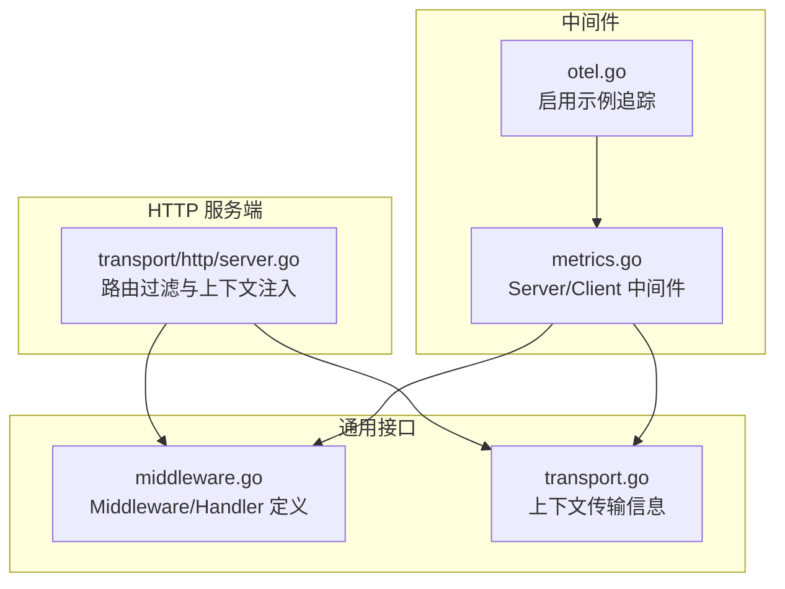
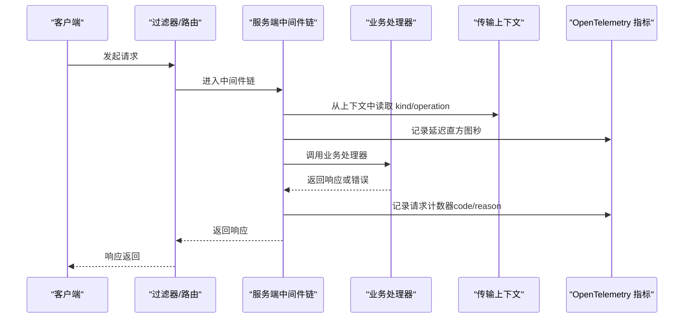
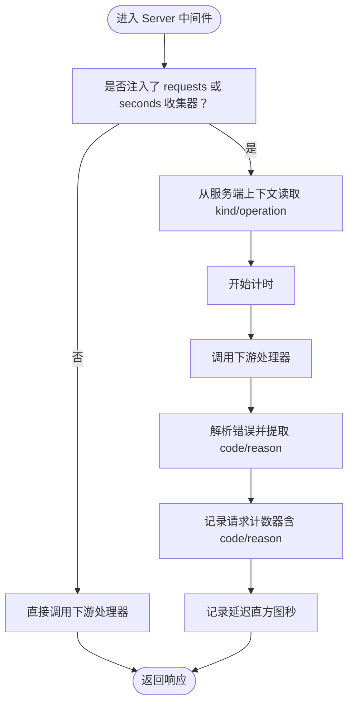
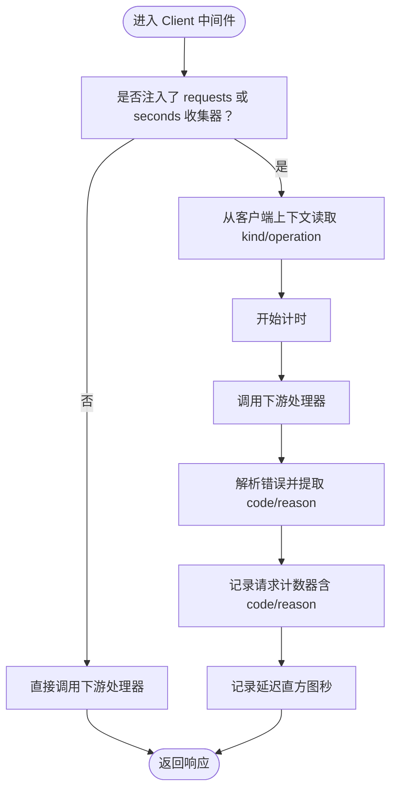
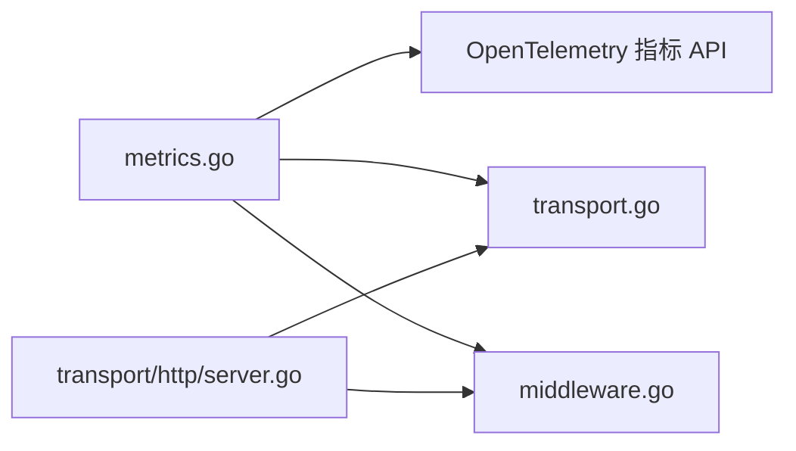

# 指标中间件

<cite>
**本文引用的文件列表**
- [metrics.go](file://middleware/metrics/metrics.go)
- [otel.go](file://middleware/metrics/otel.go)
- [metrics_test.go](file://middleware/metrics/metrics_test.go)
- [middleware.go](file://middleware/middleware.go)
- [transport.go](file://transport/transport.go)
- [server.go](file://transport/http/server.go)
</cite>

## 目录
1. [简介](#简介)
2. [项目结构](#项目结构)
3. [核心组件](#核心组件)
4. [架构总览](#架构总览)
5. [组件详解](#组件详解)
6. [依赖关系分析](#依赖关系分析)
7. [性能考量](#性能考量)
8. [故障排查指南](#故障排查指南)
9. [结论](#结论)
10. [附录](#附录)

## 简介
本文件系统性阐述 Kratos 框架中的指标中间件，重点说明：
- Server 和 Client 中间件如何记录请求总量（Counter）与延迟（Histogram）
- 默认指标名称：server_requests_seconds_bucket 与 server_requests_code_total
- WithRequests 与 WithSeconds 如何注入自定义指标收集器
- DefaultRequestsCounter 与 DefaultSecondsHistogram 如何创建标准指标
- 指标的标签体系（kind、operation、code、reason）及 Prometheus 查询方式
- 与 OpenTelemetry Meter 的集成方法，包括注册指标视图（View）与配置桶边界
- 高频请求场景下的性能优化策略（异步上报、指标聚合）

## 项目结构
指标中间件位于 middleware/metrics 目录，围绕 OpenTelemetry 指标 API 构建，同时通过 transport 上下文获取传输层信息（如 kind、operation），并在 HTTP/gRPC 两端分别统计服务端与客户端的请求量与耗时。

图表来源
- [metrics.go](file://middleware/metrics/metrics.go#L1-L211)
- [otel.go](file://middleware/metrics/otel.go#L1-L8)
- [middleware.go](file://middleware/middleware.go#L1-L22)
- [transport.go](file://transport/transport.go#L1-L96)
- [server.go](file://transport/http/server.go#L273-L308)

章节来源
- [metrics.go](file://middleware/metrics/metrics.go#L1-L211)
- [middleware.go](file://middleware/middleware.go#L1-L22)
- [transport.go](file://transport/transport.go#L1-L96)
- [server.go](file://transport/http/server.go#L273-L308)

## 核心组件
- Server 中间件：在服务端处理请求前后，基于 transport 上下文提取 kind、operation，并根据错误码与原因记录 Counter 与 Histogram
- Client 中间件：在客户端发起请求前后，同样提取 kind、operation，并记录 Counter 与 Histogram
- 指标收集器注入：WithRequests 注入 Int64Counter；WithSeconds 注入 Float64Histogram
- 默认指标工厂：DefaultRequestsCounter 与 DefaultSecondsHistogram 创建标准指标
- 视图配置：DefaultSecondsHistogramView 用于 SDK MeterProvider 的 View 注册，配置显式桶边界

章节来源
- [metrics.go](file://middleware/metrics/metrics.go#L1-L211)

## 架构总览
指标中间件通过 OpenTelemetry 指标 API 记录两类指标：
- 请求总量计数器（Counter）：按 kind、operation、code、reason 聚合
- 延迟直方图（Histogram）：按 kind、operation 聚合

默认指标名称：
- 服务端：server_requests_seconds_bucket（延迟直方图）、server_requests_code_total（请求计数器）
- 客户端：client_requests_seconds_bucket（延迟直方图）、client_requests_code_total（请求计数器）

图表来源
- [metrics.go](file://middleware/metrics/metrics.go#L101-L157)
- [transport.go](file://transport/transport.go#L75-L95)
- [server.go](file://transport/http/server.go#L273-L308)

## 组件详解

### Server 中间件
- 功能要点
  - 若未注入任何指标收集器，则直接透传
  - 从服务端传输上下文读取 kind 与 operation
  - 记录延迟直方图（单位秒）
  - 记录请求计数器（包含 code 与 reason）
- 标签体系
  - kind：传输类型（如 http、grpc）
  - operation：服务全名/方法路径
  - code：错误码（来自错误包装）
  - reason：错误原因（来自错误包装）
- 默认指标名称
  - server_requests_seconds_bucket（延迟直方图）
  - server_requests_code_total（请求计数器）

图表来源
- [metrics.go](file://middleware/metrics/metrics.go#L101-L157)
- [transport.go](file://transport/transport.go#L75-L95)

章节来源
- [metrics.go](file://middleware/metrics/metrics.go#L101-L157)
- [transport.go](file://transport/transport.go#L75-L95)

### Client 中间件
- 功能要点
  - 从客户端传输上下文读取 kind 与 operation
  - 记录延迟直方图（单位秒）
  - 记录请求计数器（包含 code 与 reason）
- 默认指标名称
  - client_requests_seconds_bucket（延迟直方图）
  - client_requests_code_total（请求计数器）

图表来源
- [metrics.go](file://middleware/metrics/metrics.go#L159-L210)
- [transport.go](file://transport/transport.go#L86-L95)

章节来源
- [metrics.go](file://middleware/metrics/metrics.go#L159-L210)
- [transport.go](file://transport/transport.go#L86-L95)

### 指标收集器注入与默认工厂
- WithRequests：注入 Int64Counter，用于记录请求总量
- WithSeconds：注入 Float64Histogram，用于记录延迟分布
- DefaultRequestsCounter：创建带单位 {call} 的 Int64Counter
- DefaultSecondsHistogram：创建带单位 s 的 Float64Histogram，并设置显式桶边界
- DefaultSecondsHistogramView：返回 View，用于 SDK MeterProvider 的显式桶配置

章节来源
- [metrics.go](file://middleware/metrics/metrics.go#L35-L92)

### OpenTelemetry 集成与视图配置
- 在测试中展示了如何启用示例追踪（EnableOTELExemplar），并通过 SDK MeterProvider 注册 PeriodicReader 与 View
- 可将 DefaultSecondsHistogramView 注册到 MeterProvider，确保直方图使用指定桶边界进行聚合

章节来源
- [otel.go](file://middleware/metrics/otel.go#L1-L8)
- [metrics_test.go](file://middleware/metrics/metrics_test.go#L67-L90)

### 标签体系与 Prometheus 查询
- 标签键
  - kind：传输类型（http、grpc）
  - operation：服务全名/方法路径
  - code：错误码
  - reason：错误原因
- Prometheus 查询建议
  - 请求总量（按服务/方法/状态码聚合）：sum by (operation, code) (server_requests_code_total)
  - 延迟分位（按服务/方法）：histogram_quantile(0.95, sum by (operation, le) (rate(server_requests_seconds_bucket[5m])))

章节来源
- [metrics.go](file://middleware/metrics/metrics.go#L18-L30)
- [metrics_test.go](file://middleware/metrics/metrics_test.go#L182-L196)

## 依赖关系分析
- Server/Client 中间件依赖
  - OpenTelemetry 指标 API：Int64Counter、Float64Histogram、Meter、View
  - Kratos transport 上下文：从服务端/客户端上下文中读取 kind、operation
  - Kratos middleware 接口：Handler、Middleware、Chain
- HTTP 服务端
  - 在路由过滤阶段将 Transport 注入服务端上下文，供中间件读取

图表来源
- [metrics.go](file://middleware/metrics/metrics.go#L1-L211)
- [transport.go](file://transport/transport.go#L1-L96)
- [middleware.go](file://middleware/middleware.go#L1-L22)
- [server.go](file://transport/http/server.go#L273-L308)

章节来源
- [metrics.go](file://middleware/metrics/metrics.go#L1-L211)
- [transport.go](file://transport/transport.go#L1-L96)
- [middleware.go](file://middleware/middleware.go#L1-L22)
- [server.go](file://transport/http/server.go#L273-L308)

## 性能考量
- 异步上报
  - 使用 SDK MeterProvider 的 PeriodicReader 将指标采集与上报分离，降低对请求路径的影响
  - 在高频场景下，建议缩短上报周期但控制采样与聚合策略
- 指标聚合
  - 合理设置直方图桶边界，避免过多桶导致内存与 CPU 开销上升
  - 对高频 endpoint 的 operation 标签进行聚合（如按前缀或模板化路径）
- 减少上下文开销
  - 仅在必要时注入指标中间件，避免在无错误码/原因的路径上重复计算
- 批量与去重
  - 在导出器侧进行批量写入与去重，减少网络与存储压力

[本节为通用性能建议，不直接分析具体文件]

## 故障排查指南
- 指标未出现
  - 确认已注入 WithRequests 与 WithSeconds 收集器
  - 确认已正确初始化 Meter 并注册到全局 Provider
- 标签缺失
  - 确认服务端/客户端上下文中存在 Transport 信息（operation、kind）
  - 确认错误包装中包含 code 与 reason
- 直方图桶异常
  - 确认已注册 DefaultSecondsHistogramView 或自定义 View
  - 检查桶边界是否覆盖预期延迟范围

章节来源
- [metrics_test.go](file://middleware/metrics/metrics_test.go#L67-L90)
- [metrics.go](file://middleware/metrics/metrics.go#L101-L210)
- [transport.go](file://transport/transport.go#L75-L95)

## 结论
指标中间件通过 OpenTelemetry 提供统一的指标采集能力，Server/Client 两端分别记录请求总量与延迟分布，并以标准化标签体系支撑 Prometheus 查询。通过 WithRequests/WithSeconds 注入自定义收集器与 DefaultSecondsHistogramView 配置桶边界，可灵活适配不同观测需求。在高频场景下，结合异步上报与指标聚合策略，可在保证可观测性的同时兼顾性能。

[本节为总结性内容，不直接分析具体文件]

## 附录

### 关键 API 一览
- Server(opts ...Option) middleware.Middleware
- Client(opts ...Option) middleware.Middleware
- WithRequests(c metric.Int64Counter) Option
- WithSeconds(histogram metric.Float64Histogram) Option
- DefaultRequestsCounter(meter metric.Meter, name string) (metric.Int64Counter, error)
- DefaultSecondsHistogram(meter metric.Meter, name string) (metric.Float64Histogram, error)
- DefaultSecondsHistogramView(name string) metricsdk.View
- EnableOTELExemplar() error

章节来源
- [metrics.go](file://middleware/metrics/metrics.go#L35-L92)
- [otel.go](file://middleware/metrics/otel.go#L1-L8)