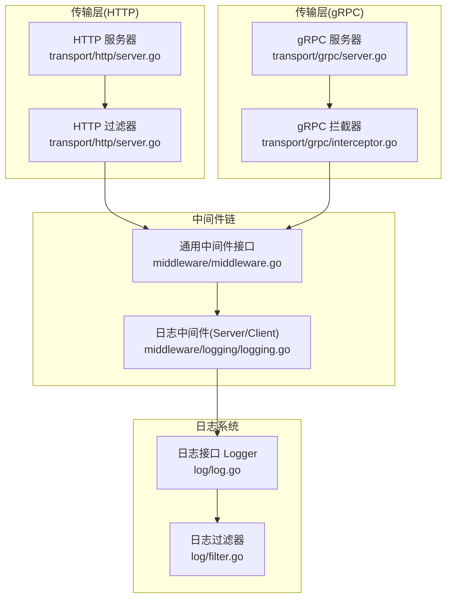
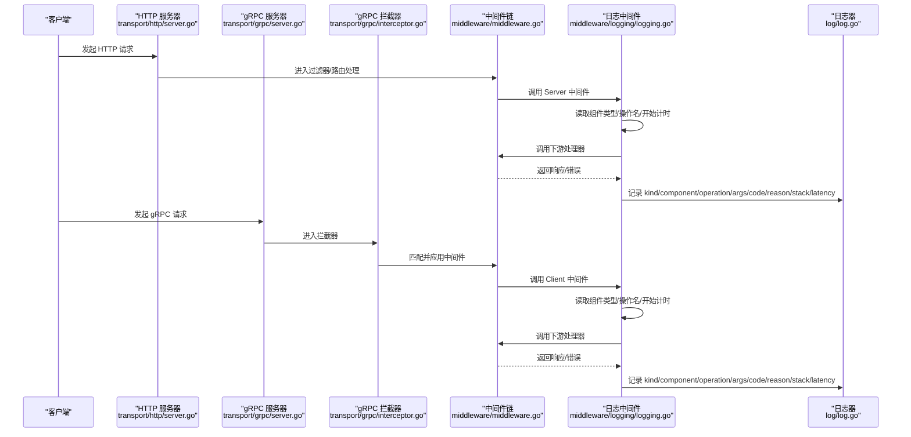
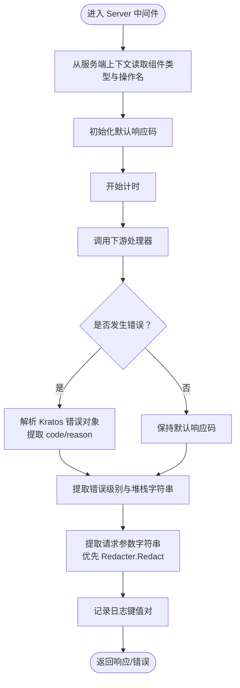
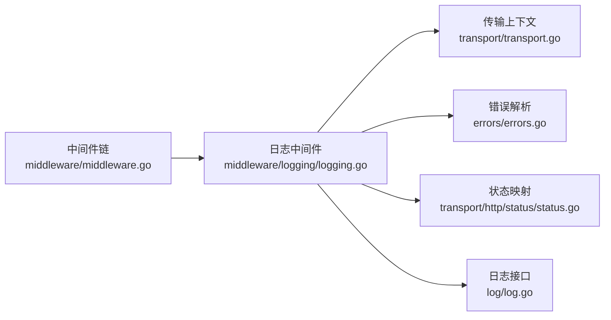

# 日志中间件

<cite>
**本文引用的文件列表**
- [middleware/logging/logging.go](file://middleware/logging/logging.go)
- [middleware/logging/logging_test.go](file://middleware/logging/logging_test.go)
- [middleware/middleware.go](file://middleware/middleware.go)
- [transport/transport.go](file://transport/transport.go)
- [transport/http/server.go](file://transport/http/server.go)
- [transport/grpc/server.go](file://transport/grpc/server.go)
- [transport/grpc/interceptor.go](file://transport/grpc/interceptor.go)
- [log/log.go](file://log/log.go)
- [log/filter.go](file://log/filter.go)
- [errors/errors.go](file://errors/errors.go)
- [transport/http/status/status.go](file://transport/http/status/status.go)
</cite>

## 目录
1. [简介](#简介)
2. [项目结构与定位](#项目结构与定位)
3. [核心组件](#核心组件)
4. [架构总览](#架构总览)
5. [详细组件分析](#详细组件分析)
6. [依赖关系分析](#依赖关系分析)
7. [性能与采样建议](#性能与采样建议)
8. [故障排查指南](#故障排查指南)
9. [结论](#结论)

## 简介
本文件系统性阐述 Kratos 框架中“日志中间件”的实现原理与使用方法，覆盖以下关键点：
- Server 与 Client 两类中间件如何拦截请求与响应，记录请求的出入日志
- 日志记录的关键字段：kind、component、operation、args、code、reason、stack、latency
- 参数脱敏与错误堆栈提取：extractArgs 与 extractError 的工作机制，以及 Redacter 接口的使用场景
- 在 HTTP 与 gRPC 服务中启用日志中间件的配置方式，以及如何通过 log.Logger 注入自定义日志器
- 中间件链中的典型位置（通常靠近外层）及性能开销与生产环境采样策略建议

## 项目结构与定位
- 日志中间件位于 middleware/logging/logging.go，提供 Server 与 Client 两种中间件工厂函数，分别用于服务端与客户端请求的日志记录。
- 传输层（HTTP/gRPC）通过各自的 Server 构造器与拦截器/过滤器，在进入业务处理前/后注入中间件链，从而捕获请求上下文与结果。
- 日志输出依赖 log.Logger 接口，支持通过全局日志器或 WithContext 包装注入自定义日志器。

图表来源
- [transport/http/server.go](file://transport/http/server.go#L177-L203)
- [transport/grpc/server.go](file://transport/grpc/server.go#L153-L202)
- [transport/grpc/interceptor.go](file://transport/grpc/interceptor.go#L16-L47)
- [middleware/middleware.go](file://middleware/middleware.go#L7-L12)
- [middleware/logging/logging.go](file://middleware/logging/logging.go#L22-L99)
- [log/log.go](file://log/log.go#L11-L13)
- [log/filter.go](file://log/filter.go#L58-L94)

章节来源
- [middleware/logging/logging.go](file://middleware/logging/logging.go#L22-L99)
- [transport/http/server.go](file://transport/http/server.go#L177-L203)
- [transport/grpc/server.go](file://transport/grpc/server.go#L153-L202)
- [transport/grpc/interceptor.go](file://transport/grpc/interceptor.go#L16-L47)
- [log/log.go](file://log/log.go#L11-L13)
- [log/filter.go](file://log/filter.go#L58-L94)

## 核心组件
- Redacter 接口：用于对请求参数进行脱敏输出，实现安全可控的日志内容。
- Server 中间件：记录服务端请求的组件类型、操作名、请求参数、响应码、错误原因、堆栈与耗时。
- Client 中间件：记录客户端请求的组件类型、操作名、请求参数、响应码、错误原因、堆栈与耗时。
- extractArgs：优先调用 Redacter.Redact 输出脱敏字符串；否则尝试 fmt.Stringer.String；最后回退到格式化打印。
- extractError：根据是否存在错误返回不同日志级别，并输出错误堆栈字符串。

章节来源
- [middleware/logging/logging.go](file://middleware/logging/logging.go#L17-L21)
- [middleware/logging/logging.go](file://middleware/logging/logging.go#L22-L59)
- [middleware/logging/logging.go](file://middleware/logging/logging.go#L62-L99)
- [middleware/logging/logging.go](file://middleware/logging/logging.go#L102-L111)
- [middleware/logging/logging.go](file://middleware/logging/logging.go#L113-L119)

## 架构总览
下图展示了 HTTP 与 gRPC 服务在启动与运行过程中，日志中间件如何被挂载到中间件链，并从传输层上下文中读取组件类型与操作名，最终输出统一格式的日志键值对。

图表来源
- [transport/http/server.go](file://transport/http/server.go#L273-L307)
- [transport/grpc/server.go](file://transport/grpc/server.go#L153-L202)
- [transport/grpc/interceptor.go](file://transport/grpc/interceptor.go#L16-L47)
- [middleware/middleware.go](file://middleware/middleware.go#L7-L12)
- [middleware/logging/logging.go](file://middleware/logging/logging.go#L22-L99)
- [log/log.go](file://log/log.go#L11-L13)

## 详细组件分析

### Server 中间件（服务端）
- 功能要点
  - 从服务端上下文读取传输信息：组件类型（Kind）、操作名（Operation）
  - 记录默认响应码为 gRPC OK 对应的 HTTP 状态码
  - 执行下游处理器，捕获错误并解析 Kratos 错误对象，提取 code 与 reason
  - 使用 extractError 提取错误级别与堆栈字符串
  - 使用 extractArgs 输出请求参数，支持 Redacter 接口脱敏
  - 记录耗时 latency（秒）

- 关键字段说明
  - kind：固定为 "server"
  - component：来自传输上下文的 Kind 字符串
  - operation：来自传输上下文的 Operation
  - args：请求参数字符串（优先 Redacter.Redact，其次 Stringer.String，最后格式化）
  - code：响应码（默认 gRPC OK 对应 HTTP 状态码）
  - reason：当错误存在时，来自 Kratos 错误对象的 Reason
  - stack：错误堆栈字符串（无错误为空）
  - latency：请求耗时（秒）

- 典型调用流程

图表来源
- [middleware/logging/logging.go](file://middleware/logging/logging.go#L22-L59)
- [transport/transport.go](file://transport/transport.go#L80-L83)
- [errors/errors.go](file://errors/errors.go#L127-L151)
- [transport/http/status/status.go](file://transport/http/status/status.go#L21-L21)
- [middleware/logging/logging.go](file://middleware/logging/logging.go#L102-L111)
- [middleware/logging/logging.go](file://middleware/logging/logging.go#L113-L119)

章节来源
- [middleware/logging/logging.go](file://middleware/logging/logging.go#L22-L59)
- [transport/transport.go](file://transport/transport.go#L80-L83)
- [errors/errors.go](file://errors/errors.go#L127-L151)
- [transport/http/status/status.go](file://transport/http/status/status.go#L21-L21)
- [middleware/logging/logging.go](file://middleware/logging/logging.go#L102-L111)
- [middleware/logging/logging.go](file://middleware/logging/logging.go#L113-L119)

### Client 中间件（客户端）
- 功能要点
  - 从客户端上下文读取传输信息：组件类型（Kind）、操作名（Operation）
  - 记录默认响应码为 gRPC OK 对应的 HTTP 状态码
  - 执行下游处理器，捕获错误并解析 Kratos 错误对象，提取 code 与 reason
  - 使用 extractError 提取错误级别与堆栈字符串
  - 使用 extractArgs 输出请求参数，支持 Redacter 接口脱敏
  - 记录耗时 latency（秒）

- 关键字段说明
  - kind：固定为 "client"
  - component：来自传输上下文的 Kind 字符串
  - operation：来自传输上下文的 Operation
  - args：请求参数字符串（优先 Redacter.Redact，其次 Stringer.String，最后格式化）
  - code：响应码（默认 gRPC OK 对应 HTTP 状态码）
  - reason：当错误存在时，来自 Kratos 错误对象的 Reason
  - stack：错误堆栈字符串（无错误为空）
  - latency：请求耗时（秒）

- 典型调用流程

图表来源
- [middleware/logging/logging.go](file://middleware/logging/logging.go#L62-L99)
- [transport/transport.go](file://transport/transport.go#L91-L94)
- [errors/errors.go](file://errors/errors.go#L127-L151)
- [transport/http/status/status.go](file://transport/http/status/status.go#L21-L21)
- [middleware/logging/logging.go](file://middleware/logging/logging.go#L102-L111)
- [middleware/logging/logging.go](file://middleware/logging/logging.go#L113-L119)

章节来源
- [middleware/logging/logging.go](file://middleware/logging/logging.go#L62-L99)
- [transport/transport.go](file://transport/transport.go#L91-L94)
- [errors/errors.go](file://errors/errors.go#L127-L151)
- [transport/http/status/status.go](file://transport/http/status/status.go#L21-L21)
- [middleware/logging/logging.go](file://middleware/logging/logging.go#L102-L111)
- [middleware/logging/logging.go](file://middleware/logging/logging.go#L113-L119)

### 参数脱敏与错误堆栈提取
- Redacter 接口
  - 当请求参数实现了 Redacter 接口时，extractArgs 会直接调用 Redacter.Redact 输出脱敏后的字符串，避免敏感信息泄露。
- Stringer 回退
  - 若未实现 Redacter，则尝试 fmt.Stringer.String；若仍不可用，则使用格式化打印。
- 错误堆栈提取
  - extractError 根据是否存在错误返回不同日志级别，并将错误对象转换为字符串（包含堆栈信息）。

章节来源
- [middleware/logging/logging.go](file://middleware/logging/logging.go#L17-L21)
- [middleware/logging/logging.go](file://middleware/logging/logging.go#L102-L111)
- [middleware/logging/logging.go](file://middleware/logging/logging.go#L113-L119)

### 在 HTTP 与 gRPC 中启用日志中间件
- HTTP 服务器
  - 通过 NewServer 的 ServerOption 注入中间件：Use(selector, m...) 或 Middleware(...) 将日志中间件加入匹配器。
  - HTTP 服务器在 filter 阶段创建传输上下文，随后进入中间件链。
- gRPC 服务器
  - 通过 NewServer 的 ServerOption 注入中间件：Use(selector, m...) 将日志中间件加入匹配器。
  - gRPC 服务器在拦截器阶段创建传输上下文，随后进入中间件链。
- 客户端
  - gRPC 客户端通过 WithMiddleware 注入 Client 中间件；HTTP 客户端通过 Invoke/Do 等方法在客户端上下文中携带传输信息。

章节来源
- [transport/http/server.go](file://transport/http/server.go#L177-L203)
- [transport/http/server.go](file://transport/http/server.go#L273-L307)
- [transport/grpc/server.go](file://transport/grpc/server.go#L153-L202)
- [transport/grpc/interceptor.go](file://transport/grpc/interceptor.go#L16-L47)

### 通过 log.Logger 注入自定义日志器
- 日志中间件接收一个 log.Logger 实例，所有日志均通过该实例输出。
- 可通过 WithContext 将自定义日志器与上下文绑定，实现按请求维度的差异化日志输出。
- 建议结合日志过滤器（如按级别过滤、字段脱敏）控制日志体量与敏感信息。

章节来源
- [middleware/logging/logging.go](file://middleware/logging/logging.go#L22-L59)
- [middleware/logging/logging.go](file://middleware/logging/logging.go#L62-L99)
- [log/log.go](file://log/log.go#L11-L13)
- [log/filter.go](file://log/filter.go#L58-L94)

## 依赖关系分析
- 中间件链
  - middleware.Chain 提供中间件组合能力，Server/Client 中间件作为链上节点包裹下游处理器。
- 传输上下文
  - 通过 transport.FromServerContext/transport.FromClientContext 从上下文中读取 Kind 与 Operation。
- 错误解析
  - errors.FromError 将标准错误转换为 Kratos 错误对象，便于提取 code 与 reason。
- HTTP 状态映射
  - transport/http/status.FromGRPCCode 将 gRPC 状态码映射为 HTTP 状态码，作为默认 code。

图表来源
- [middleware/middleware.go](file://middleware/middleware.go#L7-L12)
- [middleware/logging/logging.go](file://middleware/logging/logging.go#L22-L99)
- [transport/transport.go](file://transport/transport.go#L80-L83)
- [errors/errors.go](file://errors/errors.go#L127-L151)
- [transport/http/status/status.go](file://transport/http/status/status.go#L21-L21)
- [log/log.go](file://log/log.go#L11-L13)

章节来源
- [middleware/middleware.go](file://middleware/middleware.go#L7-L12)
- [middleware/logging/logging.go](file://middleware/logging/logging.go#L22-L99)
- [transport/transport.go](file://transport/transport.go#L80-L83)
- [errors/errors.go](file://errors/errors.go#L127-L151)
- [transport/http/status/status.go](file://transport/http/status/status.go#L21-L21)
- [log/log.go](file://log/log.go#L11-L13)

## 性能与采样建议
- 性能开销
  - 日志中间件主要开销来源于：时间测量、错误堆栈字符串化、参数字符串化（尤其是大对象）、日志写入。
  - 对于高频接口，建议采用采样策略降低日志量。
- 生产环境采样策略
  - 按路径/方法采样：仅对特定接口或错误率高的接口开启完整日志。
  - 按错误采样：仅在发生错误时记录完整日志，成功请求只记录关键指标。
  - 按请求大小采样：对超大请求体或响应体进行采样或脱敏。
  - 结合日志过滤器：在日志层面对敏感字段进行脱敏与级别过滤，减少无效日志。
- 参数脱敏
  - 通过实现 Redacter 接口对敏感字段进行脱敏输出，避免将明文密码、令牌等写入日志。
- 耗时统计
  - 使用 latency 字段进行慢请求识别与告警，辅助容量规划与性能优化。

[本节为通用指导，不直接分析具体文件]

## 故障排查指南
- 日志未输出
  - 确认已正确注入 log.Logger 并在中间件链中处于外层位置。
  - 检查日志级别过滤器是否屏蔽了相应级别的日志。
- 参数未脱敏
  - 确认请求参数实现了 Redacter 接口，或至少实现了 fmt.Stringer 接口。
- 错误未显示堆栈
  - 确认错误对象为 Kratos 错误类型，以便 extractError 正确提取堆栈字符串。
- gRPC 客户端日志缺失
  - 确认客户端上下文中已设置传输信息（Operation/Kind），并在客户端中间件链中正确挂载。

章节来源
- [middleware/logging/logging_test.go](file://middleware/logging/logging_test.go#L1-L115)
- [middleware/logging/logging_test.go](file://middleware/logging/logging_test.go#L124-L178)
- [middleware/logging/logging_test.go](file://middleware/logging/logging_test.go#L185-L235)
- [log/filter.go](file://log/filter.go#L58-L94)

## 结论
日志中间件通过在 HTTP 与 gRPC 传输层的上下文基础上，统一记录请求的组件类型、操作名、参数、响应码、错误原因、堆栈与耗时，形成一致的日志规范。结合 Redacter 接口与日志过滤器，可在保证可观测性的前提下兼顾安全性与性能。建议在生产环境中采用采样与脱敏策略，确保日志系统的可持续性与合规性。