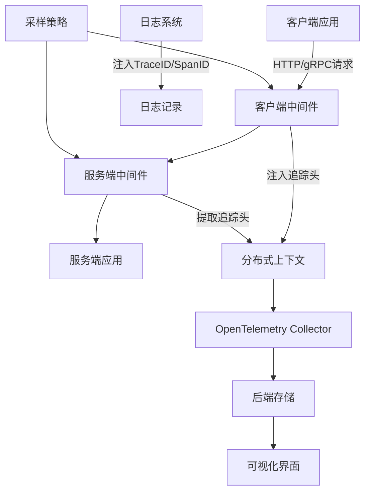
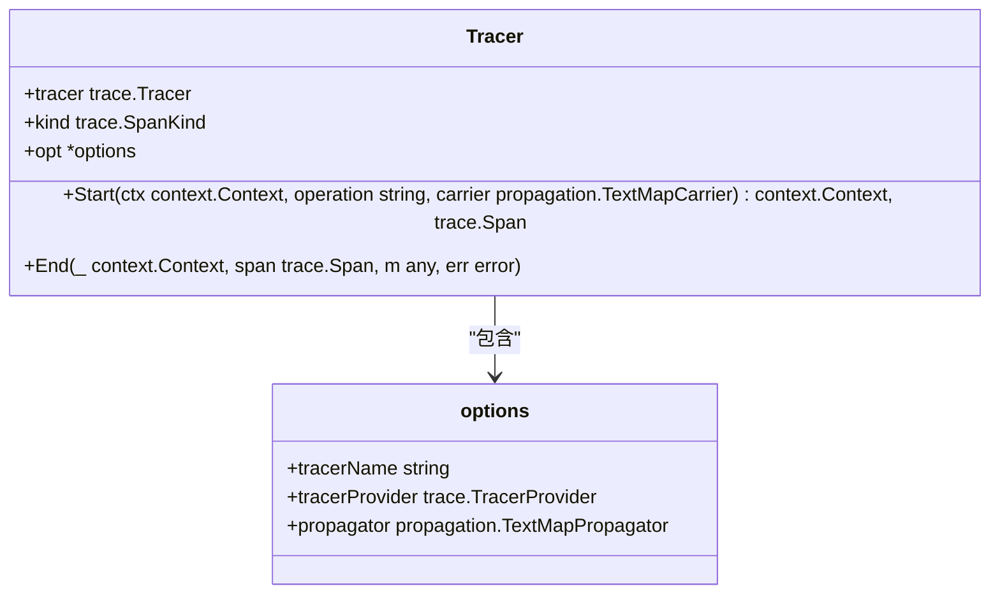
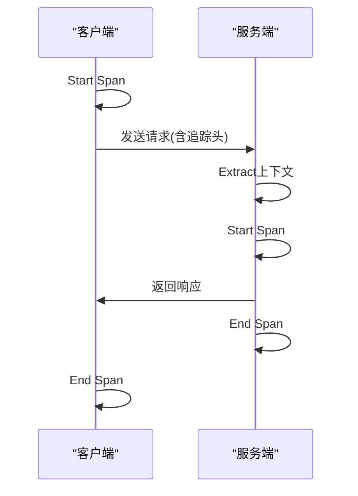
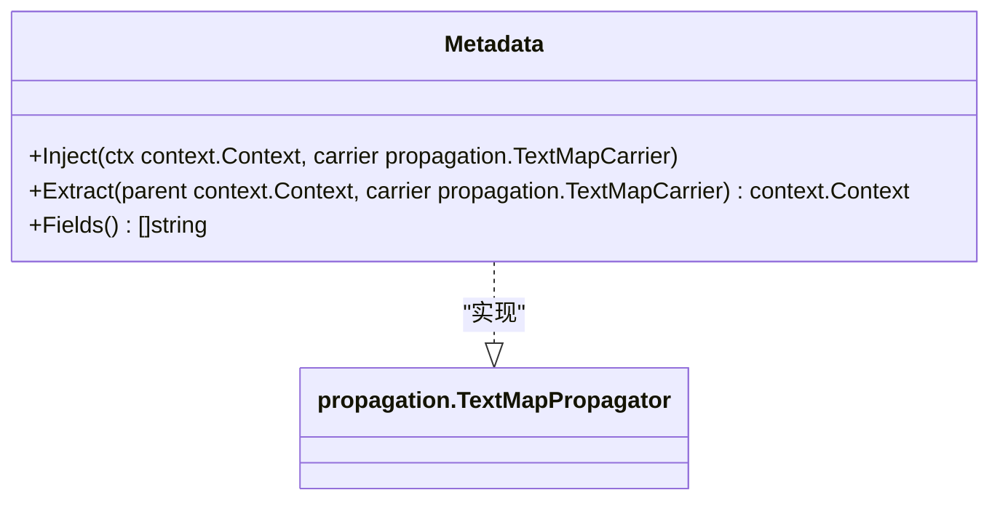
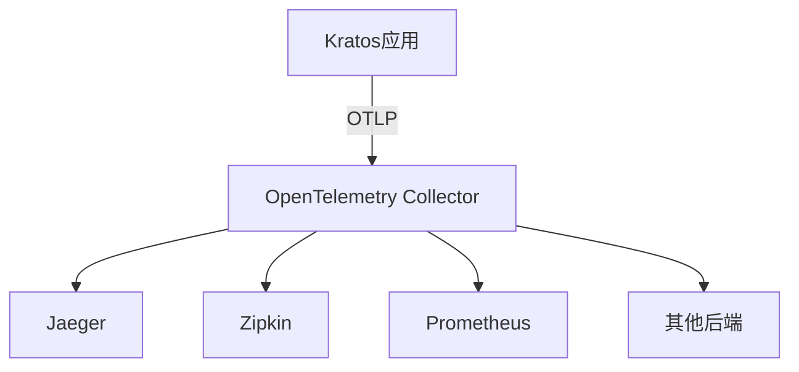

# 追踪中间件

<cite>
**本文档引用的文件**  
- [tracing.go](file://middleware/tracing/tracing.go)
- [tracer.go](file://middleware/tracing/tracer.go)
- [span.go](file://middleware/tracing/span.go)
- [metadata.go](file://middleware/tracing/metadata.go)
- [transport.go](file://transport/transport.go)
</cite>

## 目录
1. [引言](#引言)
2. [追踪中间件架构](#追踪中间件架构)
3. [核心组件分析](#核心组件分析)
4. [分布式上下文传播机制](#分布式上下文传播机制)
5. [Span生命周期管理](#span生命周期管理)
6. [日志与追踪关联](#日志与追踪关联)
7. [OpenTelemetry Collector集成](#opentelemetry-collector集成)
8. [性能影响与生产建议](#性能影响与生产建议)
9. [结论](#结论)

## 引言

Kratos框架的追踪中间件基于OpenTelemetry实现分布式链路追踪功能，为微服务架构提供了完整的可观测性支持。该中间件通过在服务端和客户端自动创建Span，实现了跨服务调用的链路追踪。中间件利用WithPropagator、WithTracerProvider等Option函数进行灵活配置，支持与各种OpenTelemetry后端系统集成。通过TraceID和SpanID两个log.Valuer函数，实现了追踪上下文与日志系统的无缝关联，便于问题排查和性能分析。本文档将深入分析追踪中间件的实现原理和使用方法，为开发者提供全面的技术指导。

## 追踪中间件架构

**图示来源**  
- [tracing.go](file://middleware/tracing/tracing.go#L47-L76)
- [transport.go](file://transport/transport.go#L75-L95)

## 核心组件分析

### 服务端与客户端中间件

追踪中间件的核心是Server和Client两个函数，它们分别在服务端和客户端创建OpenTelemetry追踪。Server函数创建服务端中间件，当请求到达时自动创建Span；Client函数创建客户端中间件，在发起请求时创建Span。两个中间件都通过transport.FromServerContext和transport.FromClientContext从上下文中获取传输信息，包括操作名称和请求头，用于Span的创建和属性设置。

**组件来源**  
- [tracing.go](file://middleware/tracing/tracing.go#L47-L76)

### Tracer实现

Tracer结构体是OpenTelemetry Span追踪器的核心实现，包含tracer、kind和opt三个字段。NewTracer函数创建Tracer实例，支持通过Option函数进行配置。Start方法启动追踪Span，根据Span类型（服务端或客户端）执行不同的上下文处理逻辑。End方法结束追踪Span，记录错误信息和状态码，并设置消息大小等属性。

**类图来源**  
- [tracer.go](file://middleware/tracing/tracer.go#L18-L44)

### Span属性填充

setServerSpan和setClientSpan函数负责填充Span的属性信息。这些函数根据传输类型（HTTP或gRPC）提取相关信息，包括HTTP方法、路由、目标地址、RPC服务和方法等。对于gRPC调用，还会提取对等方的IP地址和端口信息。这些属性遵循OpenTelemetry语义约定，确保了跨系统的兼容性和一致性。

**组件来源**  
- [span.go](file://middleware/tracing/span.go#L20-L99)

## 分布式上下文传播机制

### 上下文传递流程

分布式上下文传播是实现跨服务链路追踪的关键。在服务调用过程中，追踪上下文通过请求头在服务间传递。客户端在发起请求时，将当前Span的上下文注入到请求头中；服务端在接收请求时，从请求头中提取追踪上下文，创建新的Span并建立父子关系。这种机制确保了整个调用链路的连续性。

**序列图来源**  
- [tracer.go](file://middleware/tracing/tracer.go#L48-L59)
- [transport.go](file://transport/transport.go#L75-L95)

### Metadata传播器

Metadata结构体实现了OpenTelemetry的TextMapPropagator接口，用于在追踪过程中传播服务名称。Inject方法将服务名称注入到传输头中，Extract方法从传输头中提取服务名称并存储到元数据中。Fields方法返回传播器设置的键名列表。这种自定义传播器扩展了标准的追踪功能，提供了额外的上下文信息。

**类图来源**  
- [metadata.go](file://middleware/tracing/metadata.go#L15-L47)

## Span生命周期管理

### Start和End方法

Start方法负责启动追踪Span，根据Span类型执行不同的上下文处理逻辑。对于服务端Span，首先从传输头中提取追踪上下文；对于客户端Span，在Span创建后将上下文注入到传输头中。End方法负责结束追踪Span，记录错误信息、状态码和消息大小等属性。这两个方法共同管理Span的完整生命周期，确保了追踪数据的准确性和完整性。

**方法来源**  
- [tracer.go](file://middleware/tracing/tracer.go#L47-L82)

### 错误处理

在End方法中，当发生错误时，会调用span.RecordError记录错误信息，并根据错误类型设置相应的状态码。对于Kratos框架的自定义错误，还会提取错误码作为RPC状态码属性。这种细粒度的错误处理机制有助于在追踪系统中准确反映服务调用的状态，便于问题定位和分析。

**错误处理来源**  
- [tracer.go](file://middleware/tracing/tracer.go#L64-L72)

## 日志与追踪关联

### TraceID和SpanID Valuer

TraceID和SpanID函数返回log.Valuer实例，用于将追踪上下文注入日志系统。TraceID函数从上下文中提取TraceID，SpanID函数提取SpanID。这些函数可以在日志记录时作为字段值，实现日志与追踪的关联。通过在日志中包含追踪ID，可以方便地在分布式系统中关联和分析跨服务的日志记录。

**Valuer函数来源**  
- [tracing.go](file://middleware/tracing/tracing.go#L78-L96)

### 日志集成示例

在实际使用中，可以通过log.With函数将TraceID和SpanID添加到日志记录器中。这样，所有通过该记录器输出的日志都会自动包含追踪上下文信息。这种集成方式简单而有效，无需修改现有的日志记录代码，即可实现日志与追踪的关联。

**集成示例来源**  
- [tracing_test.go](file://middleware/tracing/tracing_test.go#L127-L129)

## OpenTelemetry Collector集成

### 配置示例

要将Kratos应用与OpenTelemetry Collector集成，需要配置TracerProvider和Propagator。通常使用OTLP exporter将追踪数据发送到Collector。配置时可以通过WithTracerProvider设置自定义的TracerProvider，通过WithPropagator设置复合传播器，包含TraceContext、Baggage和自定义的Metadata传播器。

**集成架构来源**  
- [tracer.go](file://middleware/tracing/tracer.go#L27-L28)
- [tracing_test.go](file://middleware/tracing/tracing_test.go#L87-L89)

### 服务启用

在Kratos服务中启用追踪中间件，需要在服务创建时添加Server和Client中间件。可以通过Middleware选项将追踪中间件添加到服务的中间件链中。配置时可以根据需要设置TracerProvider、Propagator和TracerName等选项，以满足不同的部署需求。

**服务启用来源**  
- [tracing.go](file://middleware/tracing/tracing.go#L47-L76)

## 性能影响与生产建议

### 采样策略

分布式追踪会对系统性能产生一定影响，特别是在高并发场景下。为了平衡可观测性和性能，建议在生产环境中使用适当的采样策略。OpenTelemetry提供了多种采样器，如TraceIDRatioBased采样器，可以根据TraceID的比例进行采样。对于关键业务或问题排查，可以临时提高采样率。

**采样策略来源**  
- [tracing_test.go](file://middleware/tracing/tracing_test.go#L81)

### 生产环境部署建议

在生产环境中部署追踪中间件时，建议遵循以下最佳实践：首先，合理配置采样策略，避免对系统性能造成过大影响；其次，确保OpenTelemetry Collector的高可用性，避免单点故障；再次，监控追踪数据的生成和传输情况，及时发现和解决问题；最后，定期评估追踪数据的价值，优化追踪配置，确保投入产出比。

**生产建议来源**  
- [tracer.go](file://middleware/tracing/tracer.go#L33-L35)
- [tracing.go](file://middleware/tracing/tracing.go#L25-L28)

## 结论

Kratos框架的追踪中间件基于OpenTelemetry实现了完整的分布式链路追踪功能，为微服务架构提供了强大的可观测性支持。通过服务端和客户端中间件的协同工作，实现了跨服务调用的自动追踪。灵活的配置选项和标准的API设计，使得中间件易于集成和使用。与日志系统的无缝集成，进一步增强了问题排查和性能分析的能力。在生产环境中，通过合理的采样策略和部署规划，可以在保证系统性能的同时，获得有价值的追踪数据。总体而言，该追踪中间件是构建可观测微服务系统的重要组件，值得在生产环境中广泛应用。