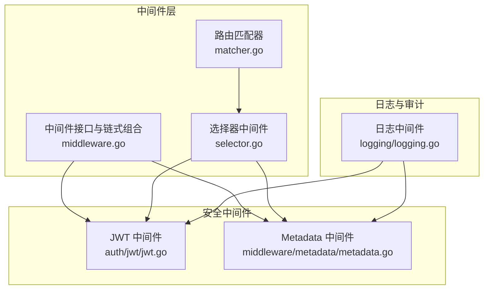
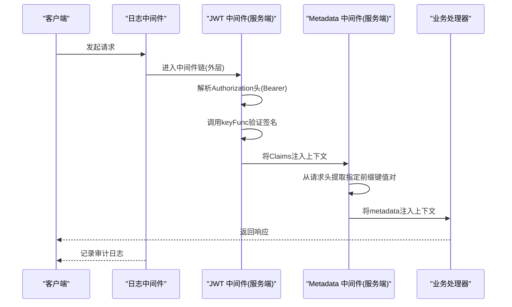
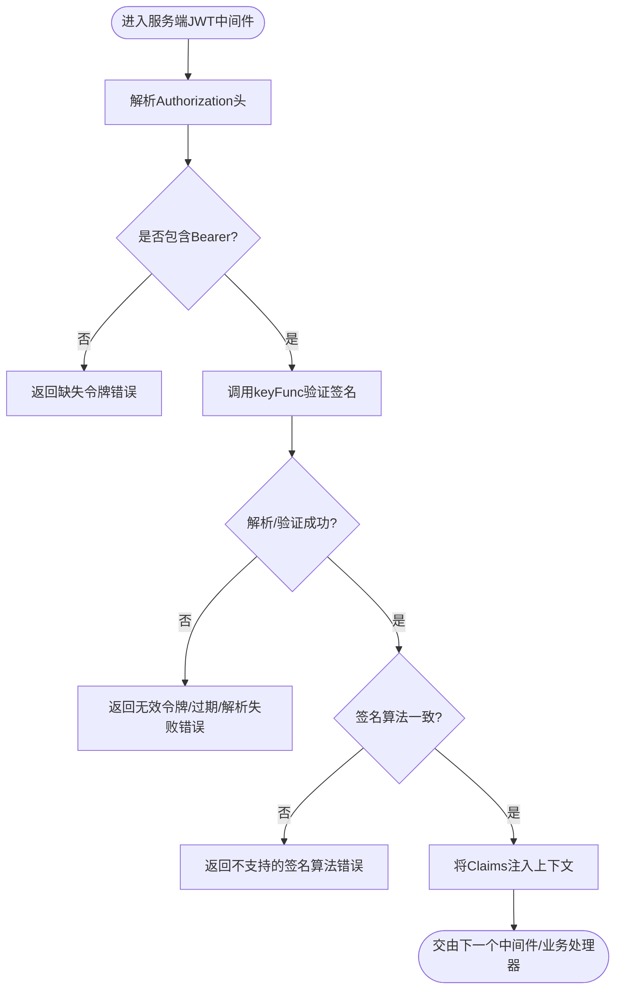
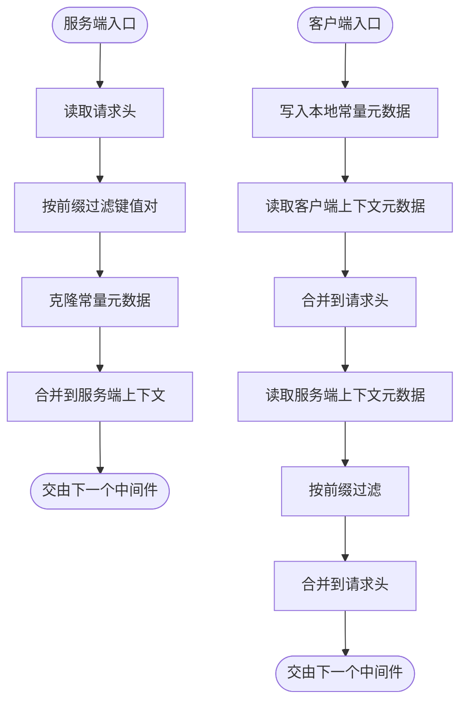
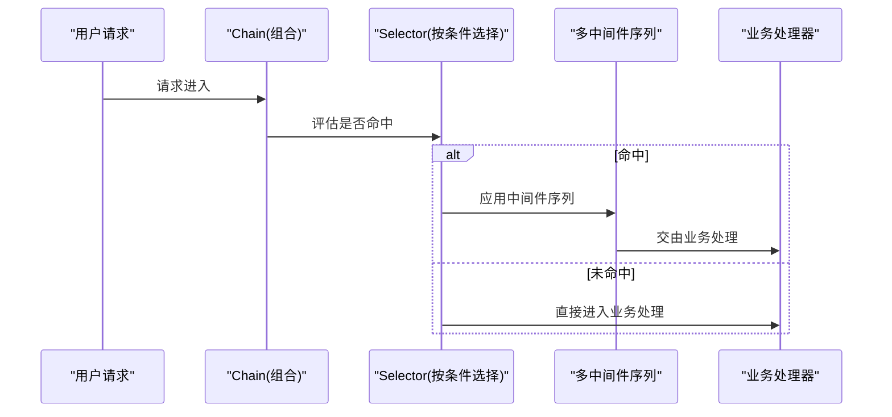
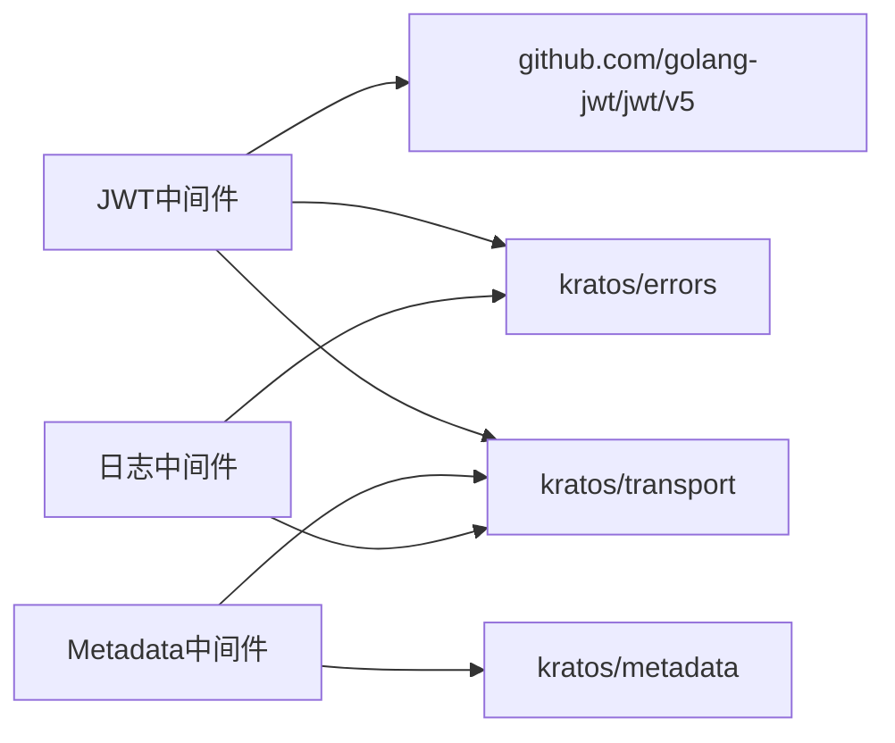

# 安全控制中间件

<cite>
**本文引用的文件列表**
- [jwt.go](file://middleware/auth/jwt/jwt.go)
- [jwt_test.go](file://middleware/auth/jwt/jwt_test.go)
- [metadata.go](file://middleware/metadata/metadata.go)
- [metadata_test.go](file://middleware/metadata/metadata_test.go)
- [middleware.go](file://middleware/middleware.go)
- [logging.go](file://middleware/logging/logging.go)
- [selector.go](file://middleware/selector/selector.go)
- [matcher.go](file://internal/matcher/middleware.go)
- [metadata包.go](file://metadata/metadata.go)
</cite>

## 目录
1. [简介](#简介)
2. [项目结构与定位](#项目结构与定位)
3. [核心组件](#核心组件)
4. [架构总览](#架构总览)
5. [组件详解](#组件详解)
6. [依赖关系分析](#依赖关系分析)
7. [性能与安全特性](#性能与安全特性)
8. [配置与使用示例](#配置与使用示例)
9. [常见问题排查](#常见问题排查)
10. [结论](#结论)

## 简介
本章节聚焦 Kratos 框架中的安全控制中间件，重点覆盖：
- auth/jwt 中间件：负责解析与验证 JWT 令牌，校验签名算法，提取用户身份信息并注入请求上下文；支持 HS256、RS256 等常用算法；提供密钥函数、自定义 Claims、令牌头扩展等配置项。
- metadata 中间件：在请求间传递安全相关的元数据（如认证信息、权限标签），支持常量注入与前缀传播策略。
- 中间件链位置与集成：说明在中间件链中的典型位置（通常在外层，早于业务逻辑），并与日志中间件协同实现安全审计。
- 配置示例与最佳实践：密钥管理、白名单路径设置、错误处理与安全加固建议。

## 项目结构与定位
- auth/jwt 中间件位于 middleware/auth/jwt，提供服务端与客户端两套能力：
  - 服务端：从 Authorization 头解析 Bearer 令牌，调用 keyFunc 校验签名，按需自定义 Claims 类型，最终将 Claims 注入上下文供后续业务使用。
  - 客户端：通过 keyProvider 获取密钥，生成签名令牌，写入 Authorization 头随请求发送。
- metadata 中间件位于 middleware/metadata，提供服务端与客户端两侧的元数据传播：
  - 服务端：从请求头中提取指定前缀的键值对，合并到服务端上下文的 metadata 中。
  - 客户端：将本地常量元数据、客户端上下文中的元数据以及服务端上下文中的全局元数据（按前缀过滤）写入请求头。
- 中间件链与选择器：
  - middleware/middleware.go 定义了通用的中间件类型与链式组合函数。
  - middleware/selector/selector.go 提供基于路径、前缀、正则与自定义匹配的中间件选择器，便于为不同路由或操作设置差异化安全策略。
  - internal/matcher/middleware.go 提供基于通配符前缀的匹配器，可作为更灵活的路由级中间件装配工具。

图表来源
- [middleware.go](file://middleware/middleware.go#L1-L22)
- [selector.go](file://middleware/selector/selector.go#L1-L145)
- [matcher.go](file://internal/matcher/middleware.go#L1-L62)
- [jwt.go](file://middleware/auth/jwt/jwt.go#L1-L178)
- [metadata.go](file://middleware/metadata/metadata.go#L1-L117)
- [logging.go](file://middleware/logging/logging.go#L1-L120)

章节来源
- [middleware.go](file://middleware/middleware.go#L1-L22)
- [selector.go](file://middleware/selector/selector.go#L1-L145)
- [matcher.go](file://internal/matcher/middleware.go#L1-L62)
- [jwt.go](file://middleware/auth/jwt/jwt.go#L1-L178)
- [metadata.go](file://middleware/metadata/metadata.go#L1-L117)
- [logging.go](file://middleware/logging/logging.go#L1-L120)

## 核心组件
- JWT 中间件（服务端/客户端）
  - 服务端：解析 Authorization 头中的 Bearer 令牌，调用 keyFunc 进行签名验证；支持自定义 Claims 类型；校验签名算法一致性；将 Claims 注入上下文。
  - 客户端：通过 keyProvider 获取密钥，构造 Claims 并签名，将令牌写入 Authorization 头。
  - 关键配置项：签名算法、自定义 Claims、令牌头扩展、密钥函数/提供者。
- Metadata 中间件
  - 服务端：从请求头中提取指定前缀的键值对，合并到服务端上下文的 metadata。
  - 客户端：将本地常量元数据、客户端上下文元数据、服务端上下文中的全局元数据（按前缀过滤）写入请求头。
  - 关键配置项：常量元数据、前缀传播策略。
- 中间件链与选择器
  - 通过 Chain 组合多个中间件；通过 Selector 或 Matcher 为不同路由设置差异化安全策略。

章节来源
- [jwt.go](file://middleware/auth/jwt/jwt.go#L1-L178)
- [metadata.go](file://middleware/metadata/metadata.go#L1-L117)
- [middleware.go](file://middleware/middleware.go#L1-L22)
- [selector.go](file://middleware/selector/selector.go#L1-L145)
- [matcher.go](file://internal/matcher/middleware.go#L1-L62)

## 架构总览
下图展示了 JWT 与 Metadata 在中间件链中的典型位置与交互流程，以及与日志中间件的协作以实现安全审计。

图表来源
- [jwt.go](file://middleware/auth/jwt/jwt.go#L79-L128)
- [metadata.go](file://middleware/metadata/metadata.go#L44-L72)
- [logging.go](file://middleware/logging/logging.go#L23-L59)

## 组件详解

### JWT 中间件（auth/jwt）
- 功能要点
  - 服务端：从 Authorization 头解析 Bearer 令牌，调用 keyFunc 校验签名；支持自定义 Claims 类型；校验签名算法一致性；将 Claims 注入上下文。
  - 客户端：通过 keyProvider 获取密钥，构造 Claims 并签名，将令牌写入 Authorization 头。
  - 错误处理：针对缺失令牌、无效令牌、过期、解析失败、不支持的签名算法、上下文错误、缺少密钥提供者等场景返回明确的 UNAUTHORIZED 错误。
- 支持的签名算法
  - 默认使用 HS256；可通过 WithSigningMethod 指定其他算法（如 RS256）。
  - 服务端会校验 token 的 Method 是否与配置一致，防止降级攻击。
- 配置选项
  - WithSigningMethod：设置签名算法。
  - WithClaims：设置自定义 Claims 工厂函数（服务端每次需返回新实例，避免并发写冲突；客户端可复用单例以提升性能）。
  - WithTokenHeader：为令牌头添加自定义字段（如 kid、cty 等）。
- 上下文注入
  - NewContext/FromContext：将 Claims 注入/从上下文中提取，供业务逻辑使用。

图表来源
- [jwt.go](file://middleware/auth/jwt/jwt.go#L79-L128)

章节来源
- [jwt.go](file://middleware/auth/jwt/jwt.go#L1-L178)
- [jwt_test.go](file://middleware/auth/jwt/jwt_test.go#L1-L486)

### Metadata 中间件（middleware/metadata）
- 功能要点
  - 服务端：遍历请求头，筛选指定前缀的键值对，克隆常量元数据，注入服务端上下文。
  - 客户端：将本地常量元数据、客户端上下文中的元数据、服务端上下文中的全局元数据（按前缀过滤）写入请求头。
  - 前缀策略：默认服务端传播前缀为 x-md-，客户端默认传播前缀为 x-md-global-。
- 配置选项
  - WithConstants：设置常量元数据。
  - WithPropagatedPrefix：设置需要传播的键前缀集合。

图表来源
- [metadata.go](file://middleware/metadata/metadata.go#L44-L117)
- [metadata包.go](file://metadata/metadata.go#L1-L126)

章节来源
- [metadata.go](file://middleware/metadata/metadata.go#L1-L117)
- [metadata_test.go](file://middleware/metadata/metadata_test.go#L1-L200)
- [metadata包.go](file://metadata/metadata.go#L1-L126)

### 中间件链与选择器
- 中间件链
  - middleware.Chain 将多个中间件按逆序组合，形成统一的处理链。
- 选择器
  - selector.Server/Client 提供基于路径、前缀、正则与自定义匹配的中间件应用策略，适合为登录页、健康检查等“白名单”路径排除安全中间件。
- 匹配器
  - internal/matcher 提供通配符前缀匹配，便于按路由前缀批量装配中间件。

图表来源
- [middleware.go](file://middleware/middleware.go#L13-L21)
- [selector.go](file://middleware/selector/selector.go#L40-L83)

章节来源
- [middleware.go](file://middleware/middleware.go#L1-L22)
- [selector.go](file://middleware/selector/selector.go#L1-L145)
- [matcher.go](file://internal/matcher/middleware.go#L1-L62)

## 依赖关系分析
- JWT 中间件依赖
  - golang-jwt/jwt/v5：令牌解析与签名验证。
  - kratos/errors：统一错误码与原因。
  - kratos/transport：从上下文获取请求头。
- Metadata 中间件依赖
  - kratos/metadata：元数据结构与上下文存取。
  - kratos/transport：从上下文获取请求头。
- 日志中间件
  - 与安全中间件同级，记录请求维度的审计信息，便于追踪异常与安全事件。

图表来源
- [jwt.go](file://middleware/auth/jwt/jwt.go#L1-L43)
- [metadata.go](file://middleware/metadata/metadata.go#L1-L20)
- [logging.go](file://middleware/logging/logging.go#L1-L20)

章节来源
- [jwt.go](file://middleware/auth/jwt/jwt.go#L1-L43)
- [metadata.go](file://middleware/metadata/metadata.go#L1-L20)
- [logging.go](file://middleware/logging/logging.go#L1-L20)

## 性能与安全特性
- 性能
  - 客户端 Claims 使用单例对象以减少分配开销；服务端每次解析均创建新的 Claims 实例，避免并发写冲突。
  - 令牌解析与签名验证在中间件链早期执行，尽早失败，减少后续处理成本。
- 安全
  - 明确区分服务端与客户端的上下文来源，防止跨端上下文污染。
  - 严格校验签名算法一致性，防止算法降级攻击。
  - 对令牌过期、格式错误、不可验证等情况进行细粒度错误分类，便于审计与告警。
  - 元数据传播采用前缀过滤，默认仅传播受控键空间，降低敏感信息泄露风险。

章节来源
- [jwt.go](file://middleware/auth/jwt/jwt.go#L62-L76)
- [jwt_test.go](file://middleware/auth/jwt/jwt_test.go#L1-L200)
- [metadata.go](file://middleware/metadata/metadata.go#L44-L117)

## 配置与使用示例
以下为常见配置与使用方式的步骤化说明（不直接展示代码片段）：
- 密钥管理
  - 服务端：提供 keyFunc，根据 token.Header 的 kid 等字段选择对应密钥；确保密钥轮换与缓存策略合理。
  - 客户端：提供 keyProvider，按需从密钥管理服务获取密钥；注意密钥获取失败时的错误处理。
- 签名算法
  - 默认 HS256；如需 RS256，使用 WithSigningMethod 指定算法；服务端会校验 token.Method 与配置一致。
- 自定义 Claims
  - 服务端：通过 WithClaims 注册自定义 Claims 工厂函数；每次解析返回新实例。
  - 客户端：通过 WithClaims 注册自定义 Claims；可结合 WithTokenHeader 添加 kid 等头部字段。
- 白名单路径设置
  - 使用 selector.Server().Prefix()/Regex()/Path()/Match() 为特定路由排除安全中间件（如登录接口、健康检查）。
  - 或使用 internal/matcher 为路由前缀批量装配中间件。
- 元数据传播
  - 服务端：默认传播以 x-md- 开头的键；可通过 WithPropagatedPrefix 自定义前缀集合。
  - 客户端：默认传播以 x-md-global- 开头的键；可通过 WithConstants 注入常量元数据。
- 中间件链位置
  - 将 JWT 与 Metadata 放在中间件链外层，早于业务逻辑执行；日志中间件可紧随其后，用于安全审计。
- 完整调用链示例（步骤）
  - 组装中间件链：Chain(MetadataServer, JWTServer, LoggingServer, BusinessHandler)
  - 为特定路由启用白名单：Selector(Server).Path("/login").Build()(Chain(LoggingServer, BusinessHandler))

章节来源
- [jwt.go](file://middleware/auth/jwt/jwt.go#L56-L76)
- [jwt_test.go](file://middleware/auth/jwt/jwt_test.go#L275-L320)
- [metadata.go](file://middleware/metadata/metadata.go#L30-L43)
- [selector.go](file://middleware/selector/selector.go#L40-L83)
- [matcher.go](file://internal/matcher/middleware.go#L18-L62)
- [middleware.go](file://middleware/middleware.go#L13-L21)

## 常见问题排查
- 缺失 Authorization 头或格式不正确
  - 现象：返回缺失令牌错误。
  - 排查：确认请求头是否为 Bearer 格式；检查大小写与空格。
- 令牌无效或已过期
  - 现象：返回无效令牌或过期错误。
  - 排查：核对签发时间、过期时间；检查系统时间同步；确认密钥正确。
- 不支持的签名算法
  - 现象：返回不支持的签名算法错误。
  - 排查：确保服务端配置的签名算法与客户端一致；避免降级攻击。
- 上下文错误
  - 现象：返回上下文错误。
  - 排查：确认中间件在正确的传输上下文内运行（服务端/客户端）。
- 密钥提供者缺失或获取失败
  - 现象：返回缺少令牌提供者或获取密钥错误。
  - 排查：检查 keyProvider 实现；确保密钥服务可用且返回有效密钥。

章节来源
- [jwt.go](file://middleware/auth/jwt/jwt.go#L32-L43)
- [jwt_test.go](file://middleware/auth/jwt/jwt_test.go#L321-L486)

## 结论
- JWT 中间件提供了完善的令牌解析与验证能力，支持多种签名算法与自定义 Claims，能够安全地将用户身份信息注入上下文。
- Metadata 中间件实现了安全相关的元数据在请求间的可控传播，配合前缀策略降低敏感信息泄露风险。
- 通过中间件链与选择器/匹配器，可以灵活地为不同路由设置差异化安全策略，并与日志中间件协同实现安全审计。
- 建议在生产环境中结合密钥轮换、令牌有效期控制、白名单路径治理与日志审计，构建纵深防御的安全体系。