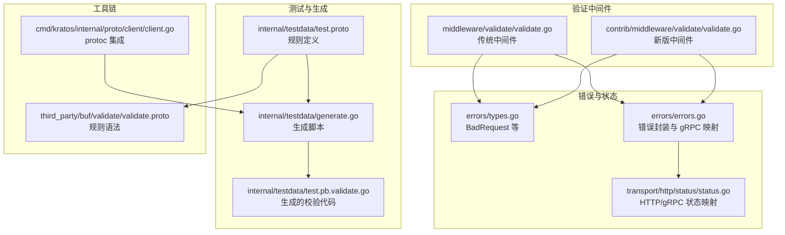
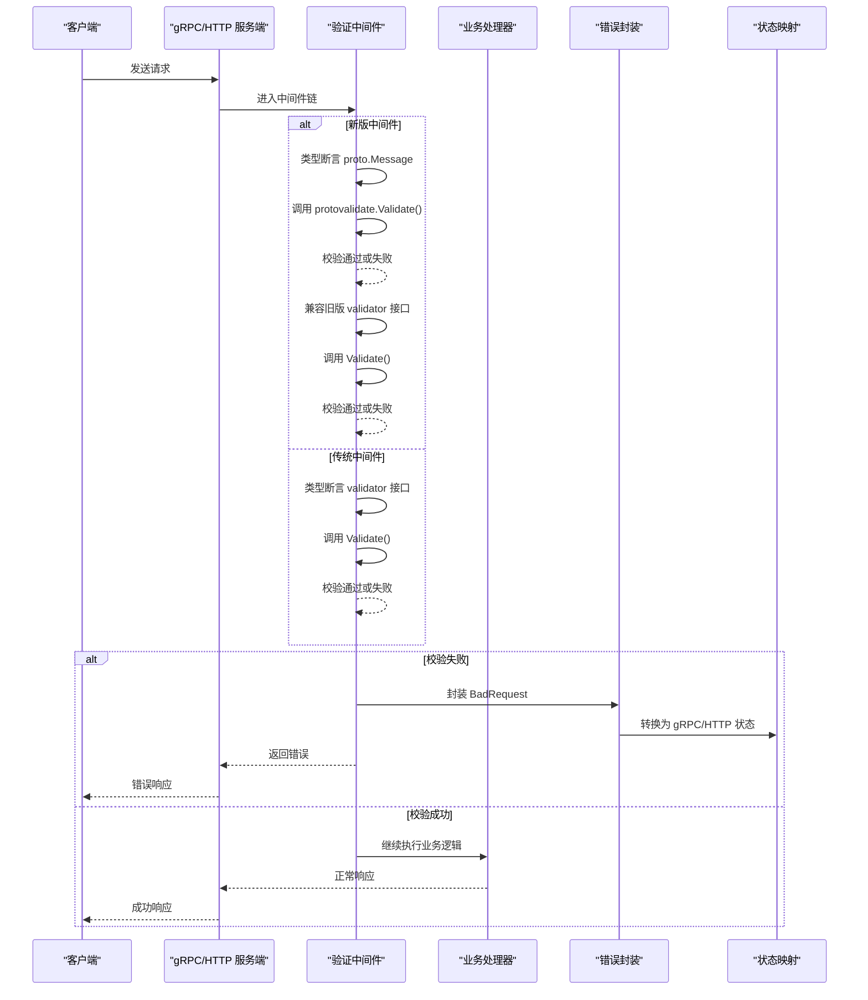
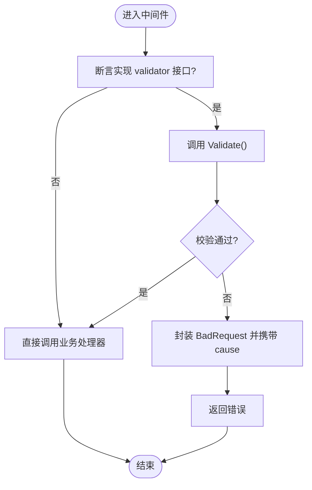
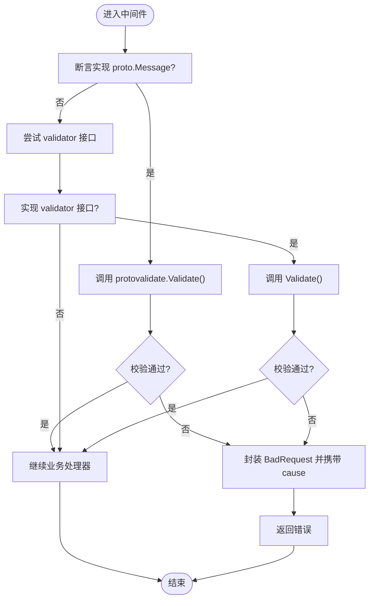
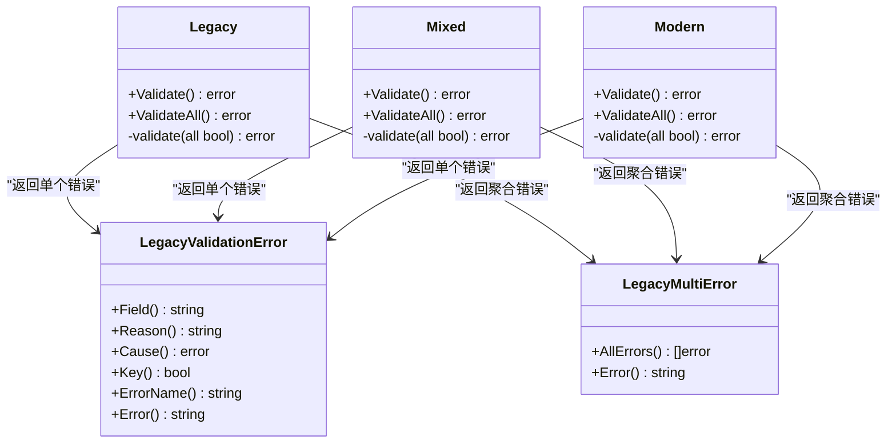
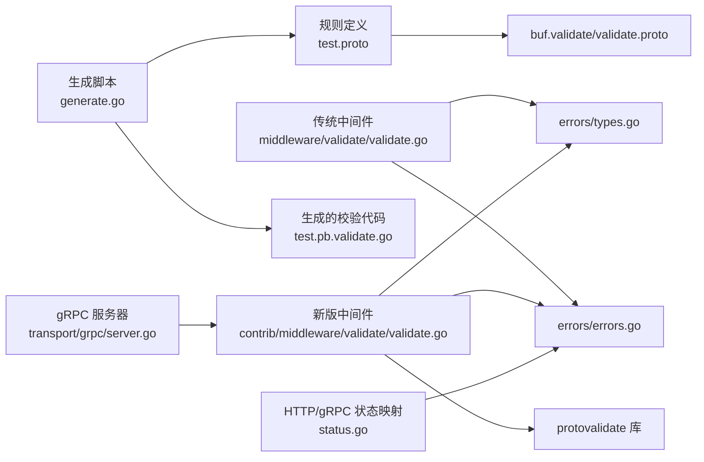

# 参数校验中间件

<cite>
**本文引用的文件列表**
- [middleware/validate/validate.go](file://middleware/validate/validate.go)
- [middleware/validate/validate_test.go](file://middleware/validate/validate_test.go)
- [contrib/middleware/validate/validate.go](file://contrib/middleware/validate/validate.go)
- [contrib/middleware/validate/README.md](file://contrib/middleware/validate/README.md)
- [contrib/middleware/validate/internal/testdata/test.proto](file://contrib/middleware/validate/internal/testdata/test.proto)
- [contrib/middleware/validate/internal/testdata/test.pb.validate.go](file://contrib/middleware/validate/internal/testdata/test.pb.validate.go)
- [contrib/middleware/validate/internal/testdata/generate.go](file://contrib/middleware/validate/internal/testdata/generate.go)
- [third_party/buf/validate/validate.proto](file://third_party/buf/validate/validate.proto)
- [errors/errors.go](file://errors/errors.go)
- [errors/types.go](file://errors/types.go)
- [transport/http/status/status.go](file://transport/http/status/status.go)
- [transport/grpc/server.go](file://transport/grpc/server.go)
- [cmd/kratos/internal/proto/client/client.go](file://cmd/kratos/internal/proto/client/client.go)
</cite>

## 目录
1. [简介](#简介)
2. [项目结构](#项目结构)
3. [核心组件](#核心组件)
4. [架构总览](#架构总览)
5. [详细组件分析](#详细组件分析)
6. [依赖关系分析](#依赖关系分析)
7. [性能考量](#性能考量)
8. [故障排查指南](#故障排查指南)
9. [结论](#结论)
10. [附录](#附录)

## 简介
本文件系统性阐述 Kratos 框架中的参数校验中间件，重点覆盖以下方面：
- 传统 validate 中间件通过 validator 接口（含 Validate() 方法）对请求对象进行自动校验的机制
- 在 Protobuf 消息中使用 buf.validate 规则生成校验代码，并解析 test.pb.validate.go 中 Generated validate 方法的结构（字段长度、数值范围等）
- Validator 中间件如何在请求进入业务逻辑前触发校验，以及校验失败时如何返回标准化的 BadRequest 错误
- Protobuf 定义示例与 Go 调用示例，强调与 protoc-gen-go-validate 工具链的集成关系
- 中间件的性能影响、与 gRPC 状态码的映射、多语言支持能力
- 已标记为 Deprecated 的现状与迁移路径：推荐使用 contrib/middleware/validate/v2.ProtoValidate

## 项目结构
与参数校验相关的模块主要分布在如下位置：
- 传统 validate 中间件：middleware/validate
- 新版 validate 中间件（兼容旧版）：contrib/middleware/validate
- 测试数据与生成脚本：contrib/middleware/validate/internal/testdata
- buf.validate 规则定义：third_party/buf/validate/validate.proto
- 错误类型与状态映射：errors、transport/http/status

图表来源
- [middleware/validate/validate.go](file://middleware/validate/validate.go#L1-L29)
- [contrib/middleware/validate/validate.go](file://contrib/middleware/validate/validate.go#L1-L38)
- [contrib/middleware/validate/internal/testdata/test.proto](file://contrib/middleware/validate/internal/testdata/test.proto#L1-L24)
- [contrib/middleware/validate/internal/testdata/generate.go](file://contrib/middleware/validate/internal/testdata/generate.go#L1-L4)
- [contrib/middleware/validate/internal/testdata/test.pb.validate.go](file://contrib/middleware/validate/internal/testdata/test.pb.validate.go#L1-L370)
- [third_party/buf/validate/validate.proto](file://third_party/buf/validate/validate.proto#L1-L200)
- [errors/types.go](file://errors/types.go#L1-L46)
- [errors/errors.go](file://errors/errors.go#L1-L153)
- [transport/http/status/status.go](file://transport/http/status/status.go#L1-L113)
- [cmd/kratos/internal/proto/client/client.go](file://cmd/kratos/internal/proto/client/client.go#L99-L122)

章节来源
- [middleware/validate/validate.go](file://middleware/validate/validate.go#L1-L29)
- [contrib/middleware/validate/validate.go](file://contrib/middleware/validate/validate.go#L1-L38)
- [contrib/middleware/validate/README.md](file://contrib/middleware/validate/README.md#L1-L16)
- [contrib/middleware/validate/internal/testdata/test.proto](file://contrib/middleware/validate/internal/testdata/test.proto#L1-L24)
- [contrib/middleware/validate/internal/testdata/generate.go](file://contrib/middleware/validate/internal/testdata/generate.go#L1-L4)
- [contrib/middleware/validate/internal/testdata/test.pb.validate.go](file://contrib/middleware/validate/internal/testdata/test.pb.validate.go#L1-L370)
- [third_party/buf/validate/validate.proto](file://third_party/buf/validate/validate.proto#L1-L200)
- [errors/types.go](file://errors/types.go#L1-L46)
- [errors/errors.go](file://errors/errors.go#L1-L153)
- [transport/http/status/status.go](file://transport/http/status/status.go#L1-L113)
- [cmd/kratos/internal/proto/client/client.go](file://cmd/kratos/internal/proto/client/client.go#L99-L122)

## 核心组件
- 传统 validate 中间件
  - 通过接口断言检测请求对象是否实现 validator 接口
  - 若实现，则在进入业务处理前调用 Validate() 进行校验
  - 校验失败时返回标准化的 BadRequest 错误
- 新版 validate 中间件（兼容旧版）
  - 先尝试使用 protovalidate 对 proto.Message 进行校验
  - 为兼容旧项目，同时保留对 validator 接口的校验逻辑
  - 同样在校验失败时返回标准化的 BadRequest 错误
- 生成的校验代码
  - 基于 buf.validate 规则生成的 Validate()/ValidateAll() 方法
  - 提供单个错误与聚合错误的能力，便于统一处理
- 错误与状态映射
  - BadRequest 返回 HTTP 400
  - 错误对象可转换为 gRPC 状态，便于在 gRPC 场景下保持一致语义

章节来源
- [middleware/validate/validate.go](file://middleware/validate/validate.go#L1-L29)
- [contrib/middleware/validate/validate.go](file://contrib/middleware/validate/validate.go#L1-L38)
- [errors/types.go](file://errors/types.go#L1-L46)
- [errors/errors.go](file://errors/errors.go#L1-L153)

## 架构总览
下面以序列图展示请求在进入业务逻辑前的校验流程，涵盖传统中间件与新版中间件的差异。

图表来源
- [contrib/middleware/validate/validate.go](file://contrib/middleware/validate/validate.go#L1-L38)
- [middleware/validate/validate.go](file://middleware/validate/validate.go#L1-L29)
- [errors/types.go](file://errors/types.go#L1-L46)
- [errors/errors.go](file://errors/errors.go#L1-L153)
- [transport/http/status/status.go](file://transport/http/status/status.go#L1-L113)

## 详细组件分析

### 传统 validate 中间件
- 设计要点
  - 仅依赖 validator 接口，不关心具体消息类型
  - 在 handler 执行前进行校验，失败即短路返回
- 错误处理
  - 使用 BadRequest(reason, message) 创建错误
  - 可附加底层 cause，便于追踪
- 兼容性
  - 适用于手动实现 validator 接口的请求对象

图表来源
- [middleware/validate/validate.go](file://middleware/validate/validate.go#L1-L29)
- [errors/types.go](file://errors/types.go#L1-L46)
- [errors/errors.go](file://errors/errors.go#L1-L153)

章节来源
- [middleware/validate/validate.go](file://middleware/validate/validate.go#L1-L29)
- [middleware/validate/validate_test.go](file://middleware/validate/validate_test.go#L1-L44)
- [errors/types.go](file://errors/types.go#L1-L46)
- [errors/errors.go](file://errors/errors.go#L1-L153)

### 新版 validate 中间件（兼容旧版）
- 设计要点
  - 优先对 proto.Message 使用 protovalidate.Validate() 校验
  - 为兼容旧项目，保留对 validator 接口的校验逻辑
  - 失败时同样返回标准化 BadRequest
- 工具链集成
  - 通过 protoc-gen-validate 生成校验代码
  - 支持 buf.validate 与 validate 两种规则风格（混合使用）

图表来源
- [contrib/middleware/validate/validate.go](file://contrib/middleware/validate/validate.go#L1-L38)
- [contrib/middleware/validate/README.md](file://contrib/middleware/validate/README.md#L1-L16)

章节来源
- [contrib/middleware/validate/validate.go](file://contrib/middleware/validate/validate.go#L1-L38)
- [contrib/middleware/validate/README.md](file://contrib/middleware/validate/README.md#L1-L16)

### 生成的校验代码结构（test.pb.validate.go）
- 自动生成的 Validate()/ValidateAll() 方法
  - Validate() 返回首个违反规则的错误
  - ValidateAll() 返回聚合错误，便于收集所有违规项
- 错误类型
  - 单个错误：包含字段名、原因、cause、是否键错误等
  - 聚合错误：包含多个子错误，支持 AllErrors() 列表化
- 规则示例
  - 字符串最小长度、整数大于某个阈值等
- 生成脚本
  - 使用 protoc-gen-validate 生成 Go 校验代码

图表来源
- [contrib/middleware/validate/internal/testdata/test.pb.validate.go](file://contrib/middleware/validate/internal/testdata/test.pb.validate.go#L1-L370)

章节来源
- [contrib/middleware/validate/internal/testdata/test.pb.validate.go](file://contrib/middleware/validate/internal/testdata/test.pb.validate.go#L1-L370)
- [contrib/middleware/validate/internal/testdata/test.proto](file://contrib/middleware/validate/internal/testdata/test.proto#L1-L24)
- [contrib/middleware/validate/internal/testdata/generate.go](file://contrib/middleware/validate/internal/testdata/generate.go#L1-L4)

### Protobuf 定义与工具链集成
- 规则定义
  - 引入 buf.validate/validate.proto 与 validate/validate.proto
  - 在字段上使用规则注解（如字符串最小长度、整数范围等）
- 生成脚本
  - generate.go 中通过 protoc 与 --validate_out 生成校验代码
- 工具链集成
  - cmd/kratos/internal/proto/client/client.go 自动检测导入 validate/validate.proto 并追加 --validate_out 参数

章节来源
- [contrib/middleware/validate/internal/testdata/test.proto](file://contrib/middleware/validate/internal/testdata/test.proto#L1-L24)
- [contrib/middleware/validate/internal/testdata/generate.go](file://contrib/middleware/validate/internal/testdata/generate.go#L1-L4)
- [cmd/kratos/internal/proto/client/client.go](file://cmd/kratos/internal/proto/client/client.go#L99-L122)
- [third_party/buf/validate/validate.proto](file://third_party/buf/validate/validate.proto#L1-L200)

### 错误与状态映射
- BadRequest
  - 返回 HTTP 400
  - 可携带原因与元数据
- gRPC 映射
  - 错误对象可转换为 gRPC 状态
  - HTTP 400 对应 gRPC InvalidArgument
- HTTP/gRPC 状态转换器
  - 提供双向映射，确保跨协议一致性

章节来源
- [errors/types.go](file://errors/types.go#L1-L46)
- [errors/errors.go](file://errors/errors.go#L1-L153)
- [transport/http/status/status.go](file://transport/http/status/status.go#L1-L113)

## 依赖关系分析
- 传统中间件依赖
  - errors.BadRequest 与错误封装
  - 请求对象需实现 validator 接口
- 新版中间件依赖
  - protovalidate 库用于 proto.Message 校验
  - 兼容旧版 validator 接口
  - errors.BadRequest 与错误封装
- 生成代码依赖
  - buf.validate 规则定义
  - protoc-gen-validate 工具链
- 传输层依赖
  - gRPC 服务器拦截器链
  - HTTP/gRPC 状态映射

图表来源
- [middleware/validate/validate.go](file://middleware/validate/validate.go#L1-L29)
- [contrib/middleware/validate/validate.go](file://contrib/middleware/validate/validate.go#L1-L38)
- [errors/types.go](file://errors/types.go#L1-L46)
- [errors/errors.go](file://errors/errors.go#L1-L153)
- [contrib/middleware/validate/internal/testdata/generate.go](file://contrib/middleware/validate/internal/testdata/generate.go#L1-L4)
- [contrib/middleware/validate/internal/testdata/test.pb.validate.go](file://contrib/middleware/validate/internal/testdata/test.pb.validate.go#L1-L370)
- [contrib/middleware/validate/internal/testdata/test.proto](file://contrib/middleware/validate/internal/testdata/test.proto#L1-L24)
- [third_party/buf/validate/validate.proto](file://third_party/buf/validate/validate.proto#L1-L200)
- [transport/grpc/server.go](file://transport/grpc/server.go#L1-L200)
- [transport/http/status/status.go](file://transport/http/status/status.go#L1-L113)

章节来源
- [middleware/validate/validate.go](file://middleware/validate/validate.go#L1-L29)
- [contrib/middleware/validate/validate.go](file://contrib/middleware/validate/validate.go#L1-L38)
- [contrib/middleware/validate/internal/testdata/generate.go](file://contrib/middleware/validate/internal/testdata/generate.go#L1-L4)
- [contrib/middleware/validate/internal/testdata/test.pb.validate.go](file://contrib/middleware/validate/internal/testdata/test.pb.validate.go#L1-L370)
- [contrib/middleware/validate/internal/testdata/test.proto](file://contrib/middleware/validate/internal/testdata/test.proto#L1-L24)
- [third_party/buf/validate/validate.proto](file://third_party/buf/validate/validate.proto#L1-L200)
- [transport/grpc/server.go](file://transport/grpc/server.go#L1-L200)
- [transport/http/status/status.go](file://transport/http/status/status.go#L1-L113)

## 性能考量
- 校验开销
  - 生成的校验代码基于规则直接判断，通常为 O(n) 或常数级判断
  - ValidateAll() 会收集全部错误，可能带来额外内存与遍历成本
- 中间件链顺序
  - 将 validate 中间件置于较前位置，可尽早失败，减少后续处理开销
- 并发与批量
  - 对于高并发场景，建议结合限流与熔断中间件，避免瞬时压力放大
- 生成代码优化
  - 合理使用 ignore 策略（如忽略未填充字段），减少不必要的校验
- 与 protovalidate 的关系
  - protovalidate 无需构建时代码生成，运行时校验，具备更好的可维护性与扩展性

[本节为通用性能讨论，不直接分析具体文件]

## 故障排查指南
- 常见问题
  - 未实现 validator 接口导致未触发校验
  - 生成的校验代码缺失或未更新
  - 规则注解写法错误或版本不匹配
- 排查步骤
  - 确认请求对象是否实现 validator 接口
  - 检查 generate.go 是否正确执行，生成文件是否存在
  - 校验 test.proto 中规则注解是否符合 buf.validate/validate.proto 语法
  - 在 gRPC 场景下确认错误被转换为 gRPC 状态
- 单元测试参考
  - 传统中间件测试验证 BadRequest 匹配
  - 新版中间件测试覆盖 Legacy/Mixed/Modern 三类消息的校验场景

章节来源
- [middleware/validate/validate_test.go](file://middleware/validate/validate_test.go#L1-L44)
- [contrib/middleware/validate/validate_test.go](file://contrib/middleware/validate/validate_test.go#L1-L62)

## 结论
- 传统 validate 中间件通过 validator 接口在请求进入业务逻辑前完成参数校验，失败时返回标准化 BadRequest
- 新版 validate 中间件在保持向后兼容的同时，引入 protovalidate 对 proto.Message 进行校验，进一步提升可维护性与扩展性
- 通过 buf.validate 规则与 protoc-gen-validate 工具链，可自动生成高效的校验代码
- 错误与状态映射保证了在 HTTP/gRPC 场景下的一致性
- 已标记为 Deprecated，推荐迁移至 contrib/middleware/validate/v2.ProtoValidate

[本节为总结性内容，不直接分析具体文件]

## 附录

### Protobuf 定义示例（字段规则）
- 字段最小长度、数值范围等规则注解
- 支持 buf.validate 与 validate 两种风格混用

章节来源
- [contrib/middleware/validate/internal/testdata/test.proto](file://contrib/middleware/validate/internal/testdata/test.proto#L1-L24)
- [third_party/buf/validate/validate.proto](file://third_party/buf/validate/validate.proto#L1-L200)

### Go 调用示例（概念性说明）
- 传统中间件
  - 在业务处理器前挂载 Validator() 中间件
  - 请求对象需实现 validator 接口
- 新版中间件
  - 在业务处理器前挂载 ProtoValidate() 中间件
  - 支持 proto.Message 与旧版 validator 接口

章节来源
- [middleware/validate/validate.go](file://middleware/validate/validate.go#L1-L29)
- [contrib/middleware/validate/validate.go](file://contrib/middleware/validate/validate.go#L1-L38)

### 迁移路径
- 从传统 validate 中间件迁移到新版
  - 逐步替换中间件为 ProtoValidate()
  - 对手动实现 validator 接口的对象，按需保留或迁移
  - 确保生成的校验代码与规则注解保持一致

章节来源
- [contrib/middleware/validate/README.md](file://contrib/middleware/validate/README.md#L1-L16)
- [contrib/middleware/validate/validate.go](file://contrib/middleware/validate/validate.go#L1-L38)