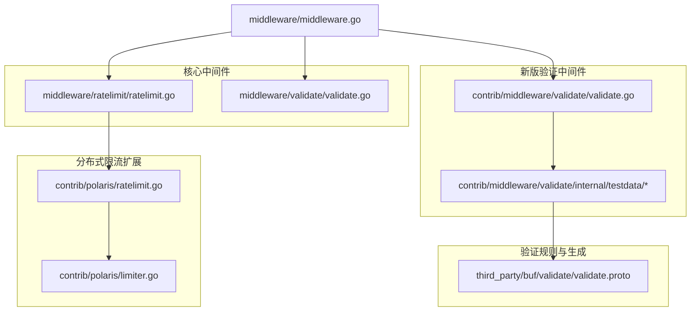
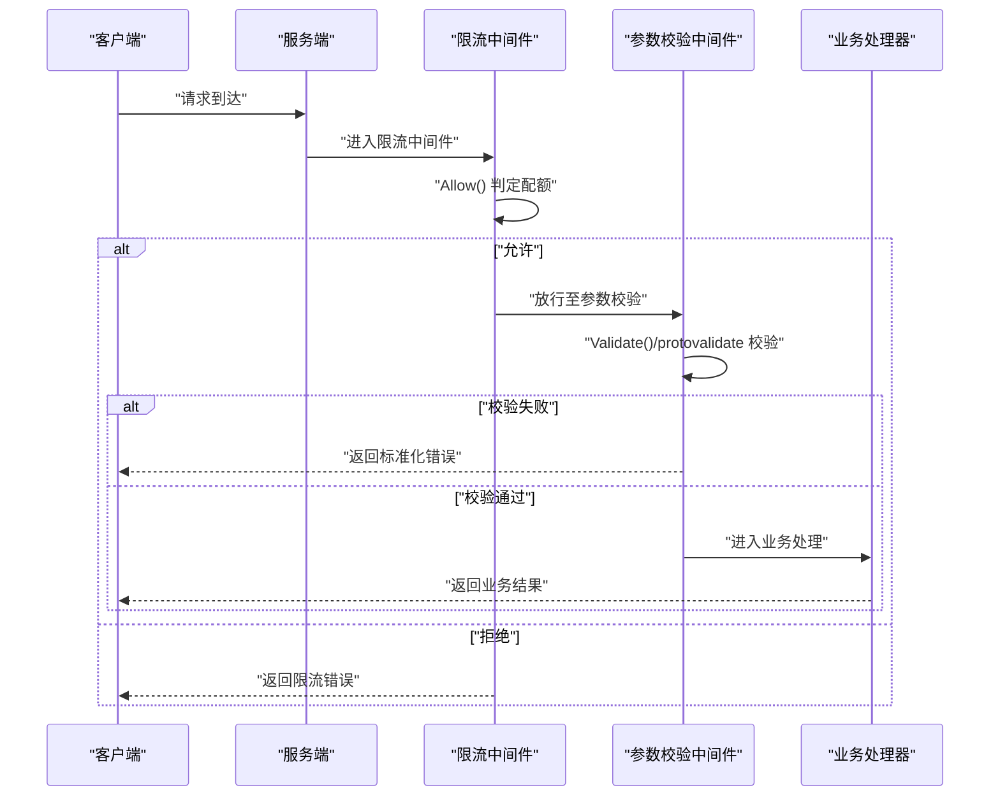
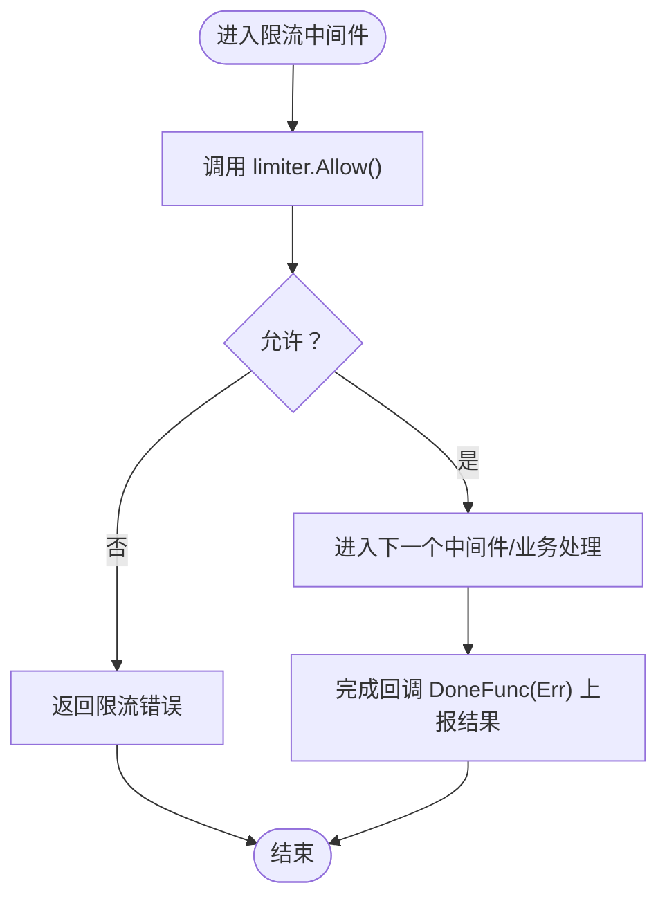
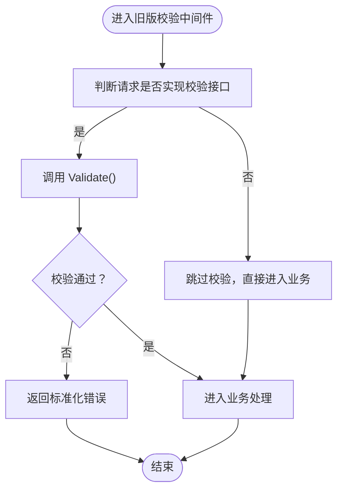
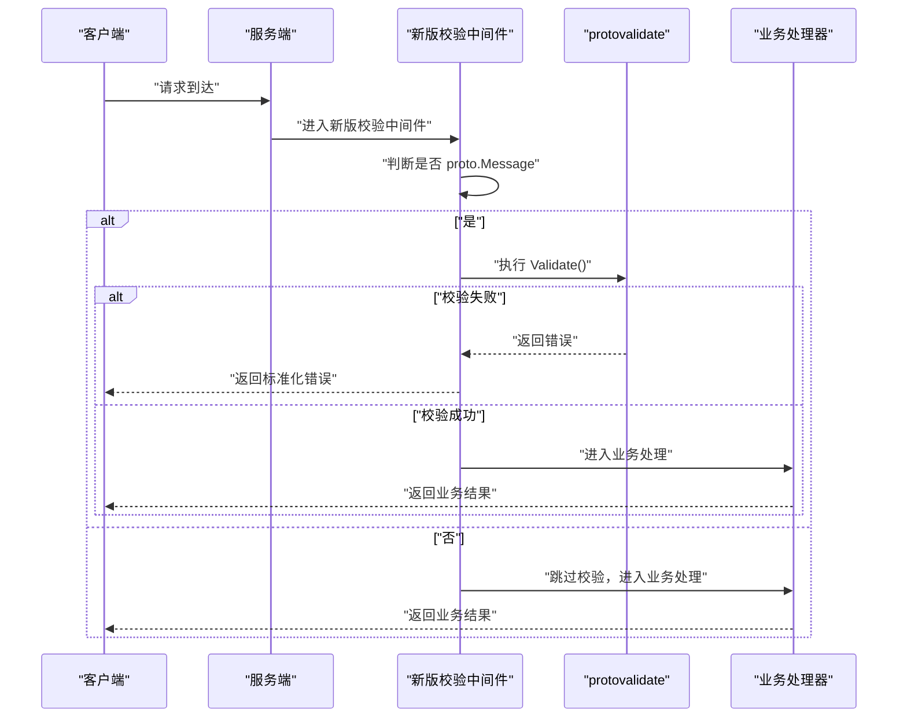
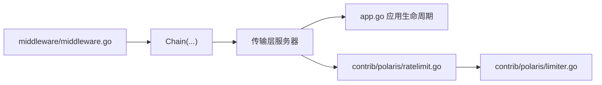

# 流量治理中间件

<cite>
**本文引用的文件**
- [middleware/ratelimit/ratelimit.go](file://middleware/ratelimit/ratelimit.go)
- [middleware/ratelimit/ratelimit_test.go](file://middleware/ratelimit/ratelimit_test.go)
- [contrib/polaris/ratelimit.go](file://contrib/polaris/ratelimit.go)
- [contrib/polaris/limiter.go](file://contrib/polaris/limiter.go)
- [middleware/validate/validate.go](file://middleware/validate/validate.go)
- [middleware/validate/validate_test.go](file://middleware/validate/validate_test.go)
- [contrib/middleware/validate/validate.go](file://contrib/middleware/validate/validate.go)
- [contrib/middleware/validate/validate_test.go](file://contrib/middleware/validate/validate_test.go)
- [contrib/middleware/validate/internal/testdata/test.proto](file://contrib/middleware/validate/internal/testdata/test.proto)
- [contrib/middleware/validate/internal/testdata/test.pb.go](file://contrib/middleware/validate/internal/testdata/test.pb.go)
- [contrib/middleware/validate/internal/testdata/test.pb.validate.go](file://contrib/middleware/validate/internal/testdata/test.pb.validate.go)
- [third_party/buf/validate/validate.proto](file://third_party/buf/validate/validate.proto)
- [middleware/middleware.go](file://middleware/middleware.go)
- [app.go](file://app.go)
</cite>

## 目录
1. [引言](#引言)
2. [项目结构](#项目结构)
3. [核心组件](#核心组件)
4. [架构总览](#架构总览)
5. [详细组件分析](#详细组件分析)
6. [依赖关系分析](#依赖关系分析)
7. [性能考量](#性能考量)
8. [故障排查指南](#故障排查指南)
9. [结论](#结论)
10. [附录](#附录)

## 引言
本文件聚焦于Kratos框架中的两类流量治理中间件：ratelimit与validate。前者用于请求限流，后者用于请求参数的自动校验。文档将从实现原理、配置方式、执行时机、在中间件链中的典型位置、分布式限流挑战、参数校验性能影响等方面进行系统化说明，并提供可直接定位到源码的路径指引，帮助读者快速理解与落地。

## 项目结构
围绕流量治理的相关代码主要分布在以下模块：
- 核心中间件：middleware/ratelimit、middleware/validate
- 分布式限流扩展：contrib/polaris（包含限流器与中间件）
- 新版验证中间件：contrib/middleware/validate（基于protovalidate）
- 验证规则定义与生成：third_party/buf/validate/validate.proto 与内部测试数据
- 中间件链工具：middleware/middleware.go
- 应用生命周期与服务注册：app.go

图表来源
- [middleware/ratelimit/ratelimit.go](file://middleware/ratelimit/ratelimit.go#L1-L53)
- [middleware/validate/validate.go](file://middleware/validate/validate.go#L1-L29)
- [contrib/polaris/ratelimit.go](file://contrib/polaris/ratelimit.go#L1-L54)
- [contrib/polaris/limiter.go](file://contrib/polaris/limiter.go#L1-L106)
- [contrib/middleware/validate/validate.go](file://contrib/middleware/validate/validate.go#L1-L38)
- [contrib/middleware/validate/internal/testdata/test.proto](file://contrib/middleware/validate/internal/testdata/test.proto#L1-L23)
- [third_party/buf/validate/validate.proto](file://third_party/buf/validate/validate.proto#L1-L33)
- [middleware/middleware.go](file://middleware/middleware.go#L1-L22)

章节来源
- [middleware/ratelimit/ratelimit.go](file://middleware/ratelimit/ratelimit.go#L1-L53)
- [middleware/validate/validate.go](file://middleware/validate/validate.go#L1-L29)
- [contrib/polaris/ratelimit.go](file://contrib/polaris/ratelimit.go#L1-L54)
- [contrib/polaris/limiter.go](file://contrib/polaris/limiter.go#L1-L106)
- [contrib/middleware/validate/validate.go](file://contrib/middleware/validate/validate.go#L1-L38)
- [contrib/middleware/validate/internal/testdata/test.proto](file://contrib/middleware/validate/internal/testdata/test.proto#L1-L23)
- [third_party/buf/validate/validate.proto](file://third_party/buf/validate/validate.proto#L1-L33)
- [middleware/middleware.go](file://middleware/middleware.go#L1-L22)

## 核心组件
- ratelimit中间件：提供统一的限流入口，通过注入的Limiter接口决定是否放行请求，并在处理完成后回调DoneFunc上报结果。
- validate中间件（旧版）：对实现了特定接口的请求对象执行Validate方法，失败时返回标准化错误。
- validate中间件（新版）：基于protovalidate对proto消息进行校验，兼容旧版protoc-gen-validate规则，失败时返回标准化错误。
- 分布式限流（Polaris）：在HTTP传输上下文中提取请求头与查询参数作为限流维度，调用远端配额接口判定配额是否可用。

章节来源
- [middleware/ratelimit/ratelimit.go](file://middleware/ratelimit/ratelimit.go#L1-L53)
- [middleware/validate/validate.go](file://middleware/validate/validate.go#L1-L29)
- [contrib/middleware/validate/validate.go](file://contrib/middleware/validate/validate.go#L1-L38)
- [contrib/polaris/ratelimit.go](file://contrib/polaris/ratelimit.go#L1-L54)

## 架构总览
下图展示了请求在进入业务处理前的典型中间件链路，validate通常位于更内层（靠近业务），而ratelimit位于更外层（靠近网络入口），以尽早拒绝过载请求。

图表来源
- [middleware/ratelimit/ratelimit.go](file://middleware/ratelimit/ratelimit.go#L1-L53)
- [middleware/validate/validate.go](file://middleware/validate/validate.go#L1-L29)
- [contrib/middleware/validate/validate.go](file://contrib/middleware/validate/validate.go#L1-L38)

## 详细组件分析

### ratelimit中间件
- 实现要点
  - 默认使用BBR限流器，可通过选项注入自定义Limiter。
  - 在请求进入业务处理前调用Allow()，若返回错误则直接拒绝；否则放行。
  - 业务处理完成后，通过DoneFunc上报错误状态，以便限流器统计与动态调整。
- 典型配置
  - 使用WithLimiter注入自定义限流器实例。
  - 可结合contrib/polaris的Limiter实现，将限流决策委托给远端配额中心。
- 执行时机
  - 在validate之后、业务处理之前，确保过载请求被尽早拦截。
- 分布式实现
  - Polaris版本会从传输上下文提取请求头与查询参数，构造模型参数参与配额判定。
  - 当远端调用异常时，默认忽略错误并放行，保证可用性。

图表来源
- [middleware/ratelimit/ratelimit.go](file://middleware/ratelimit/ratelimit.go#L1-L53)
- [contrib/polaris/ratelimit.go](file://contrib/polaris/ratelimit.go#L1-L54)

章节来源
- [middleware/ratelimit/ratelimit.go](file://middleware/ratelimit/ratelimit.go#L1-L53)
- [middleware/ratelimit/ratelimit_test.go](file://middleware/ratelimit/ratelimit_test.go#L1-L65)
- [contrib/polaris/ratelimit.go](file://contrib/polaris/ratelimit.go#L1-L54)
- [contrib/polaris/limiter.go](file://contrib/polaris/limiter.go#L1-L106)

### validate中间件（旧版）
- 实现要点
  - 仅对实现了特定接口的请求对象执行Validate()。
  - 校验失败时返回标准化的错误类型，便于上层统一处理。
- 典型配置
  - 将该中间件置于业务处理前，确保所有入参均经过校验。
- 性能影响
  - Validate()为同步阻塞调用，建议在消息体较小或规则简单时使用；复杂规则需评估开销。

图表来源
- [middleware/validate/validate.go](file://middleware/validate/validate.go#L1-L29)

章节来源
- [middleware/validate/validate.go](file://middleware/validate/validate.go#L1-L29)
- [middleware/validate/validate_test.go](file://middleware/validate/validate_test.go#L1-L44)

### validate中间件（新版，基于protovalidate）
- 实现要点
  - 对实现了proto.Message的请求对象执行protovalidate.Validate()。
  - 同时兼容旧版protoc-gen-validate生成的Validate()方法。
  - 校验失败时返回标准化错误。
- 规则来源
  - 通过导入Buf Validate或Validate第三方规则，在proto文件中定义字段级与消息级规则。
  - 生成的*.pb.validate.go包含具体的校验逻辑与错误类型。
- 典型配置
  - 将该中间件置于业务处理前，确保所有入参均经过校验。
- 性能影响
  - 基于规则的校验可能比手写Validate()更重，建议：
    - 合理拆分消息，避免冗余字段；
    - 仅在必要字段启用严格规则；
    - 对热点接口评估校验成本，必要时采用缓存或降级策略。

图表来源
- [contrib/middleware/validate/validate.go](file://contrib/middleware/validate/validate.go#L1-L38)
- [contrib/middleware/validate/internal/testdata/test.pb.validate.go](file://contrib/middleware/validate/internal/testdata/test.pb.validate.go#L1-L370)

章节来源
- [contrib/middleware/validate/validate.go](file://contrib/middleware/validate/validate.go#L1-L38)
- [contrib/middleware/validate/validate_test.go](file://contrib/middleware/validate/validate_test.go#L1-L83)
- [contrib/middleware/validate/internal/testdata/test.proto](file://contrib/middleware/validate/internal/testdata/test.proto#L1-L23)
- [contrib/middleware/validate/internal/testdata/test.pb.go](file://contrib/middleware/validate/internal/testdata/test.pb.go#L1-L259)
- [contrib/middleware/validate/internal/testdata/test.pb.validate.go](file://contrib/middleware/validate/internal/testdata/test.pb.validate.go#L1-L370)
- [third_party/buf/validate/validate.proto](file://third_party/buf/validate/validate.proto#L1-L33)

## 依赖关系分析
- 中间件链工具
  - middleware/middleware.go提供Chain函数，按传入顺序从右到左包裹中间件，形成最终的处理链。
- 应用生命周期
  - app.go负责服务启动与停止，中间件链在具体传输层（HTTP/GRPC）中被组装并生效。
- 分布式限流
  - contrib/polaris/ratelimit.go从传输上下文中提取请求头与查询参数，构造模型参数后调用Limiter.Allow()，实现跨节点的统一限流。

图表来源
- [middleware/middleware.go](file://middleware/middleware.go#L1-L22)
- [app.go](file://app.go#L1-L213)
- [contrib/polaris/ratelimit.go](file://contrib/polaris/ratelimit.go#L1-L54)
- [contrib/polaris/limiter.go](file://contrib/polaris/limiter.go#L1-L106)

章节来源
- [middleware/middleware.go](file://middleware/middleware.go#L1-L22)
- [app.go](file://app.go#L1-L213)
- [contrib/polaris/ratelimit.go](file://contrib/polaris/ratelimit.go#L1-L54)
- [contrib/polaris/limiter.go](file://contrib/polaris/limiter.go#L1-L106)

## 性能考量
- 校验性能
  - 新版validate中间件基于protovalidate，规则越多、越复杂，校验开销越大。建议：
    - 仅对关键字段启用严格规则；
    - 对热点接口进行压测，评估校验耗时；
    - 必要时对高频字段做预校验或缓存校验结果。
- 限流性能
  - ratelimit中间件本身轻量，但分布式限流（Polaris）涉及远程调用，需关注：
    - 远端配额接口的延迟与可用性；
    - 当远端异常时默认放行的策略权衡；
    - 限流器实现的并发安全与统计精度。
- 中间件链顺序
  - validate在业务前，ratelimit在外层，可减少无效请求进入业务逻辑的成本。

[本节为通用指导，不直接分析具体文件]

## 故障排查指南
- 限流未生效
  - 检查是否正确注入了Limiter（默认使用BBR），或是否使用了contrib/polaris的Limiter。
  - 确认中间件链顺序：ratelimit应在validate之前。
  - 参考测试用例验证行为。
- 参数校验失败
  - 确认请求对象是否实现了对应校验接口或满足protovalidate规则。
  - 查看生成的*.pb.validate.go中的错误信息，定位具体字段与原因。
- 错误响应
  - validate中间件返回标准化错误，可在上层统一捕获与转换。
  - ratelimit中间件返回限流错误，状态码与错误码可参考实现。

章节来源
- [middleware/ratelimit/ratelimit_test.go](file://middleware/ratelimit/ratelimit_test.go#L1-L65)
- [middleware/validate/validate_test.go](file://middleware/validate/validate_test.go#L1-L44)
- [contrib/middleware/validate/validate_test.go](file://contrib/middleware/validate/validate_test.go#L1-L83)
- [contrib/middleware/validate/internal/testdata/test.pb.validate.go](file://contrib/middleware/validate/internal/testdata/test.pb.validate.go#L1-L370)

## 结论
- ratelimit中间件通过统一的Limiter接口实现灵活的限流策略，默认使用BBR，亦可接入分布式限流（Polaris）。
- validate中间件提供两代方案：旧版基于接口Validate()，新版基于protovalidate，支持现代与兼容规则，提升参数校验的自动化与一致性。
- 在中间件链中，validate应置于业务前，ratelimit应置于更外层，以最大化保护后端资源。
- 分布式限流需要权衡远端调用的可用性与性能；参数校验应结合业务场景进行取舍与优化。

[本节为总结，不直接分析具体文件]

## 附录

### 配置与使用示例（路径指引）
- 定义验证规则（proto）
  - 示例：在proto文件中导入Buf Validate或Validate规则，并为字段添加约束。
  - 路径参考：
    - [contrib/middleware/validate/internal/testdata/test.proto](file://contrib/middleware/validate/internal/testdata/test.proto#L1-L23)
    - [third_party/buf/validate/validate.proto](file://third_party/buf/validate/validate.proto#L1-L33)
- 生成校验代码
  - 生成的*.pb.validate.go包含Validate()与错误类型，供新版validate中间件使用。
  - 路径参考：
    - [contrib/middleware/validate/internal/testdata/test.pb.validate.go](file://contrib/middleware/validate/internal/testdata/test.pb.validate.go#L1-L370)
- 注入自定义限流器
  - 使用WithLimiter选项注入自定义Limiter实例。
  - 路径参考：
    - [middleware/ratelimit/ratelimit.go](file://middleware/ratelimit/ratelimit.go#L1-L53)
- 使用分布式限流（Polaris）
  - 在HTTP传输上下文中提取请求头与查询参数，调用远端配额接口。
  - 路径参考：
    - [contrib/polaris/ratelimit.go](file://contrib/polaris/ratelimit.go#L1-L54)
    - [contrib/polaris/limiter.go](file://contrib/polaris/limiter.go#L1-L106)

### 中间件链顺序最佳实践
- validate中间件通常放在业务逻辑前，确保参数合法性。
- ratelimit中间件放在更外层，尽早拒绝过载请求。
- 中间件链由middleware/middleware.go的Chain函数组织，顺序从右到左包裹。

章节来源
- [middleware/middleware.go](file://middleware/middleware.go#L1-L22)
- [middleware/ratelimit/ratelimit.go](file://middleware/ratelimit/ratelimit.go#L1-L53)
- [contrib/middleware/validate/validate.go](file://contrib/middleware/validate/validate.go#L1-L38)