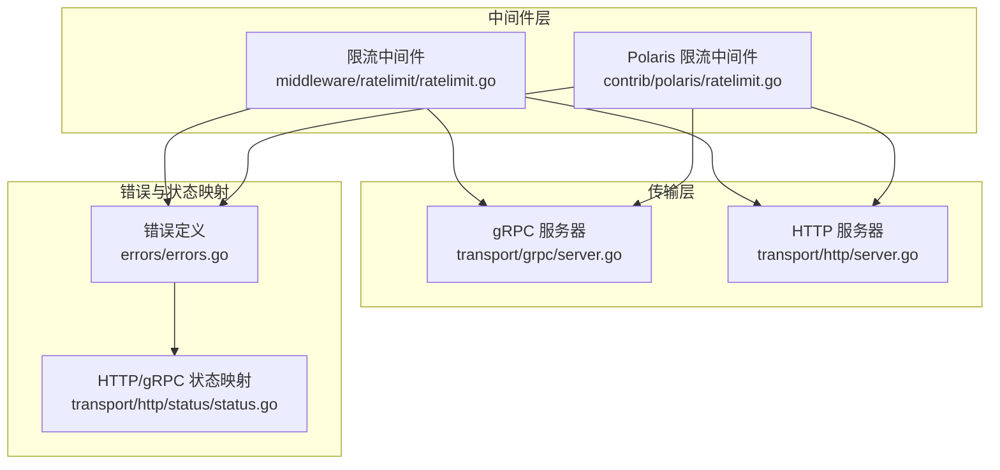
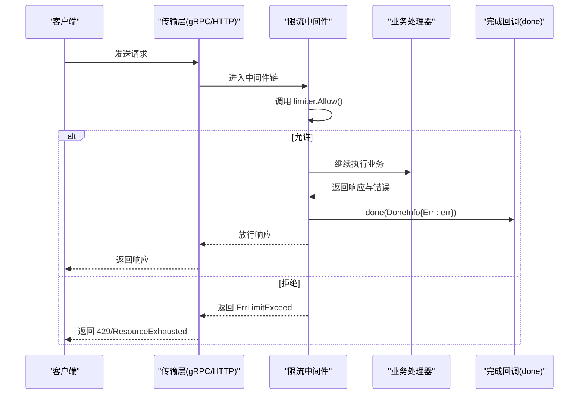
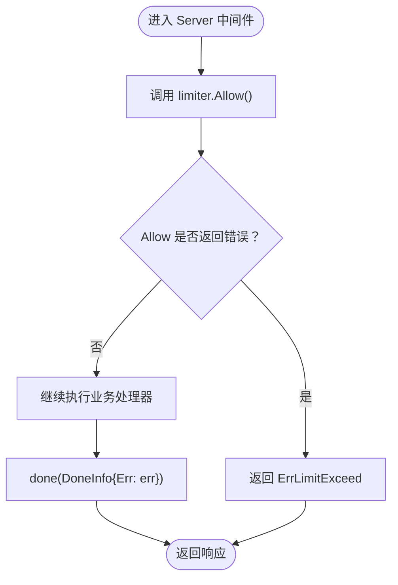
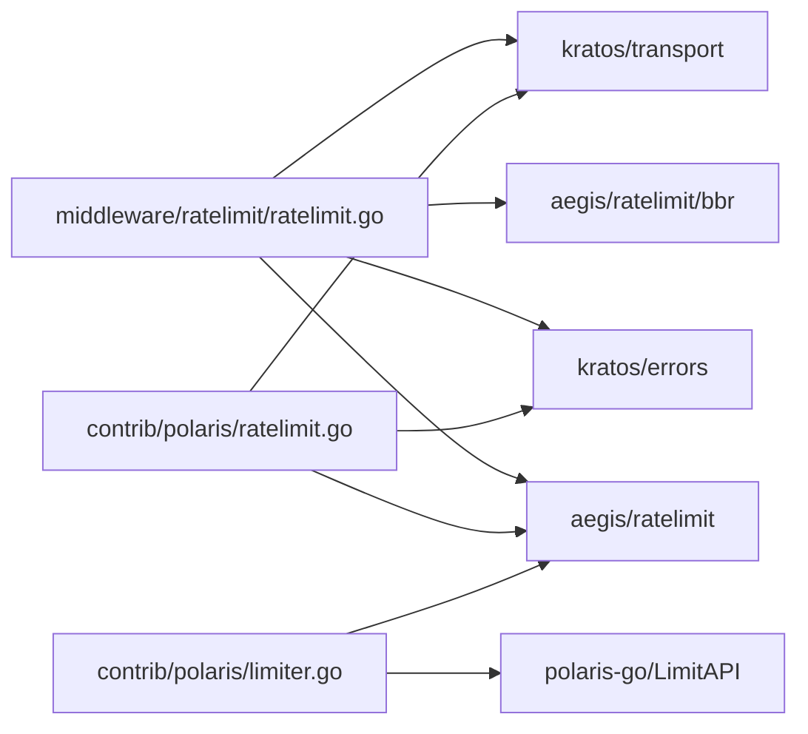

# 限流中间件

<cite>
**本文引用的文件**
- [middleware/ratelimit/ratelimit.go](file://middleware/ratelimit/ratelimit.go)
- [middleware/ratelimit/ratelimit_test.go](file://middleware/ratelimit/ratelimit_test.go)
- [contrib/polaris/limiter.go](file://contrib/polaris/limiter.go)
- [contrib/polaris/ratelimit.go](file://contrib/polaris/ratelimit.go)
- [transport/http/status/status.go](file://transport/http/status/status.go)
- [errors/errors.go](file://errors/errors.go)
- [transport/grpc/server.go](file://transport/grpc/server.go)
- [transport/http/server.go](file://transport/http/server.go)
</cite>

## 目录
1. [简介](#简介)
2. [项目结构](#项目结构)
3. [核心组件](#核心组件)
4. [架构总览](#架构总览)
5. [详细组件分析](#详细组件分析)
6. [依赖关系分析](#依赖关系分析)
7. [性能考量](#性能考量)
8. [故障排查指南](#故障排查指南)
9. [结论](#结论)
10. [附录](#附录)

## 简介
本文件系统性梳理 Kratos 框架中的限流中间件实现，重点围绕默认基于 BBR（二态速率限制）的限流策略、WithLimiter 注入选项注入自定义限流器（如令牌桶、漏桶等）、Server 中间件在请求处理链中的拦截与放行逻辑、ErrLimitExceed 错误的定义及在 HTTP/gRPC 协议中的映射方式。同时结合实际场景讨论限流在防止突发流量导致服务雪崩中的作用，分析性能开销与分布式环境下的挑战，并给出与注册中心、配置中心集成实现集群限流的最佳实践建议。

## 项目结构
限流中间件位于 middleware/ratelimit 目录，核心文件为 ratelimit.go；配套测试位于 ratelimit_test.go。此外，contrib/polaris 提供了基于 Polaris 的远程限流实现，包括 Limiter 与 Ratelimit 中间件，用于演示如何注入自定义限流器并在 HTTP/gRPC 传输层进行参数透传。

图表来源
- [middleware/ratelimit/ratelimit.go](file://middleware/ratelimit/ratelimit.go#L1-L52)
- [contrib/polaris/ratelimit.go](file://contrib/polaris/ratelimit.go#L1-L53)
- [transport/grpc/server.go](file://transport/grpc/server.go#L153-L202)
- [transport/http/server.go](file://transport/http/server.go#L177-L203)
- [errors/errors.go](file://errors/errors.go#L48-L152)
- [transport/http/status/status.go](file://transport/http/status/status.go#L1-L112)

章节来源
- [middleware/ratelimit/ratelimit.go](file://middleware/ratelimit/ratelimit.go#L1-L52)
- [contrib/polaris/ratelimit.go](file://contrib/polaris/ratelimit.go#L1-L53)
- [transport/grpc/server.go](file://transport/grpc/server.go#L153-L202)
- [transport/http/server.go](file://transport/http/server.go#L177-L203)
- [errors/errors.go](file://errors/errors.go#L48-L152)
- [transport/http/status/status.go](file://transport/http/status/status.go#L1-L112)

## 核心组件
- 默认限流器：基于 BBR 的限流器作为默认实现，通过 bbr.NewLimiter() 初始化。
- 自定义限流器注入：WithLimiter 选项允许替换默认限流器，支持令牌桶、漏桶等任意实现。
- Server 中间件：在请求进入业务处理前调用 limiter.Allow() 判断是否放行；若拒绝则返回 ErrLimitExceed；若放行则继续执行业务处理器，并在完成后调用 done(ratelimit.DoneInfo{Err: err}) 上报结果。
- ErrLimitExceed：统一的“速率超限”错误，HTTP 状态码 429，Reason 为 RATELIMIT。
- HTTP/gRPC 映射：HTTP 层通过 status 转换器将 429 映射为 gRPC ResourceExhausted；gRPC 层通过错误对象的 GRPCStatus 将 HTTP 状态转换回对应 gRPC 状态。

章节来源
- [middleware/ratelimit/ratelimit.go](file://middleware/ratelimit/ratelimit.go#L13-L51)
- [errors/errors.go](file://errors/errors.go#L48-L152)
- [transport/http/status/status.go](file://transport/http/status/status.go#L1-L112)

## 架构总览
下图展示了限流中间件在 gRPC/HTTP 传输层中的工作流程，以及与错误映射的关系。

图表来源
- [middleware/ratelimit/ratelimit.go](file://middleware/ratelimit/ratelimit.go#L31-L51)
- [transport/grpc/server.go](file://transport/grpc/server.go#L153-L202)
- [transport/http/server.go](file://transport/http/server.go#L177-L203)
- [errors/errors.go](file://errors/errors.go#L48-L152)
- [transport/http/status/status.go](file://transport/http/status/status.go#L1-L112)

## 详细组件分析

### 基于 BBR 的默认限流策略
- 默认行为：Server 中间件初始化时使用 bbr.NewLimiter() 作为默认限流器，确保在未显式注入自定义限流器时仍具备基本的速率控制能力。
- BBR 特点：二态速率限制通常能在突发流量与稳定流量之间取得平衡，避免过度保守导致吞吐下降，也不至于在突发时被压垮。

章节来源
- [middleware/ratelimit/ratelimit.go](file://middleware/ratelimit/ratelimit.go#L31-L35)

### WithLimiter 注入选项与自定义限流器
- WithLimiter：通过选项函数将自定义 Limiter 实现注入到中间件内部 options 结构体中，从而覆盖默认 BBR 限流器。
- 自定义实现：可实现令牌桶、漏桶、滑动窗口等任意限流算法，只要满足 ratelimit.Limiter 接口的 Allow() 返回 DoneFunc 和 error。

章节来源
- [middleware/ratelimit/ratelimit.go](file://middleware/ratelimit/ratelimit.go#L16-L25)

### Server 中间件拦截与放行逻辑
- 拦截时机：在业务处理器之前调用 limiter.Allow()。
- 放行条件：Allow() 返回 error 为 nil 时放行；否则直接返回 ErrLimitExceed。
- 完成上报：放行后业务处理器返回后，调用 done(DoneInfo{Err: err}) 上报错误信息，便于限流器统计与后续决策。

图表来源
- [middleware/ratelimit/ratelimit.go](file://middleware/ratelimit/ratelimit.go#L31-L51)

章节来源
- [middleware/ratelimit/ratelimit.go](file://middleware/ratelimit/ratelimit.go#L31-L51)

### ErrLimitExceed 错误定义与协议映射
- 错误定义：ErrLimitExceed 是一个 HTTP 429 的错误对象，Reason 为 RATELIMIT。
- HTTP 映射：当 HTTP 层收到 429 时，会映射为 gRPC 的 ResourceExhausted；反之亦然。
- gRPC 映射：错误对象的 GRPCStatus() 方法将 HTTP 状态转换为对应的 gRPC 状态码，便于跨协议传播。

章节来源
- [middleware/ratelimit/ratelimit.go](file://middleware/ratelimit/ratelimit.go#L13-L14)
- [errors/errors.go](file://errors/errors.go#L48-L152)
- [transport/http/status/status.go](file://transport/http/status/status.go#L1-L112)

### Polaris 集成：注入远程限流器
- Limiter：基于 Polaris 的 LimitAPI 获取配额，若配额不足则返回 ratelimit.ErrLimitExceed；成功则返回空 error 表示允许。
- Ratelimit 中间件：从传输上下文中提取请求头与查询参数，构造模型参数，调用 l.Allow(operation, args...) 进行远程配额校验。
- 适用场景：需要在多实例间共享限流规则、动态下发策略、与注册中心/配置中心联动的集群限流。

章节来源
- [contrib/polaris/limiter.go](file://contrib/polaris/limiter.go#L1-L105)
- [contrib/polaris/ratelimit.go](file://contrib/polaris/ratelimit.go#L1-L53)

### 在 gRPC/HTTP 传输层的应用
- gRPC：中间件通过 unaryServerInterceptor/streamServerInterceptor 将匹配的中间件链路注入到 gRPC 服务器中，限流在拦截器链上生效。
- HTTP：中间件通过路由过滤器与中间件匹配器注入到 HTTP 服务器中，限流在 ServeHTTP 前置处理阶段生效。

章节来源
- [transport/grpc/server.go](file://transport/grpc/server.go#L153-L202)
- [transport/http/server.go](file://transport/http/server.go#L177-L203)

## 依赖关系分析
- 中间件依赖：
  - aegis/ratelimit：提供 Limiter 接口、DoneFunc、DoneInfo 等抽象。
  - aegis/ratelimit/bbr：提供默认 BBR 限流器实现。
  - kratos/errors：提供统一错误对象与 GRPCStatus 能力。
  - kratos/transport：提供传输上下文与 gRPC/HTTP 服务器集成。
- Polaris 集成：
  - 使用 polaris-go 的 LimitAPI 获取配额，支持命名空间、服务名、超时、重试次数、令牌数等参数化配置。

图表来源
- [middleware/ratelimit/ratelimit.go](file://middleware/ratelimit/ratelimit.go#L1-L15)
- [contrib/polaris/ratelimit.go](file://contrib/polaris/ratelimit.go#L1-L21)
- [contrib/polaris/limiter.go](file://contrib/polaris/limiter.go#L1-L20)

章节来源
- [middleware/ratelimit/ratelimit.go](file://middleware/ratelimit/ratelimit.go#L1-L15)
- [contrib/polaris/ratelimit.go](file://contrib/polaris/ratelimit.go#L1-L21)
- [contrib/polaris/limiter.go](file://contrib/polaris/limiter.go#L1-L20)

## 性能考量
- 开销评估：
  - 限流检查为 O(1) 操作，通常由内存计数器或轻量状态机实现，对延迟影响较小。
  - BBR 在突发场景下能快速适应，减少频繁拒绝带来的抖动。
- 并发安全：
  - 限流器实现需保证并发安全，避免竞态导致的误判。
- 分布式一致性：
  - 本地限流适合单实例限流；跨实例需要集中式限流（如 Polaris），会引入网络 RTT 与一致性权衡。
- 资源占用：
  - 高并发下建议使用无锁或低锁竞争的数据结构；避免在 done 回调中做重 IO 操作。

[本节为通用指导，不直接分析具体文件]

## 故障排查指南
- 现象：大量 429/ResourceExhausted
  - 可能原因：限流阈值过小、突发流量超出配额、远程限流服务不可用。
  - 排查步骤：
    - 检查 WithLimiter 注入的限流器是否正确生效。
    - 对比 Polaris 配额与实际请求量，确认命名空间/服务名/参数是否匹配。
    - 观察 done 回调是否被调用，以确认错误上报路径正常。
- 测试验证：
  - 使用 ratelimit_test 中的 Mock 限流器验证 Allow 返回与 done 回调的触发逻辑。

章节来源
- [middleware/ratelimit/ratelimit_test.go](file://middleware/ratelimit/ratelimit_test.go#L1-L65)

## 结论
Kratos 的限流中间件以简洁的接口与默认 BBR 实现为核心，既满足单实例限流需求，又通过 WithLimiter 选项与 Polaris 集成支持分布式集群限流。配合 HTTP/gRPC 的错误与状态映射，可在多协议环境中一致地表达“速率超限”。在生产实践中，应根据流量特征选择合适的限流算法与阈值，并结合注册中心/配置中心实现动态、可观测的集群限流。

[本节为总结性内容，不直接分析具体文件]

## 附录

### 配置示例与最佳实践（文字描述）
- 全局限流
  - 在应用启动时通过 Server(...) 注入 WithLimiter(...)，传入自定义限流器（如令牌桶/漏桶）。
  - 将该中间件挂载到全局匹配器，使所有路由均受控。
- 基于上下文的动态限流
  - 在自定义 Limiter 的 Allow 中读取上下文中的用户标识、IP、租户等维度，按维度动态调整配额。
  - 对 Polaris 集成，可通过 Limiter 参数化配置（命名空间、服务名、超时、重试、令牌数）实现不同租户/实例的差异化策略。
- 与注册中心/配置中心集成
  - 通过配置中心拉取限流阈值、算法参数、维度键等，运行时热更新。
  - 与注册中心联动，自动感知服务实例变化，结合 Polaris 的命名空间/服务名实现集群级限流。
- 防雪崩策略
  - 在网关/入口处设置宽松阈值，内部服务设置更严格阈值，形成“多层防护”。
  - 对关键接口单独限流，对非关键接口采用宽松策略，保障核心链路稳定性。

[本节为概念性说明，不直接分析具体文件]