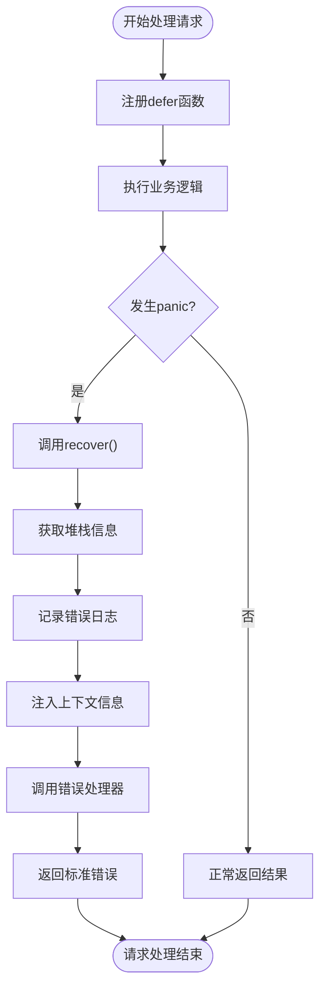
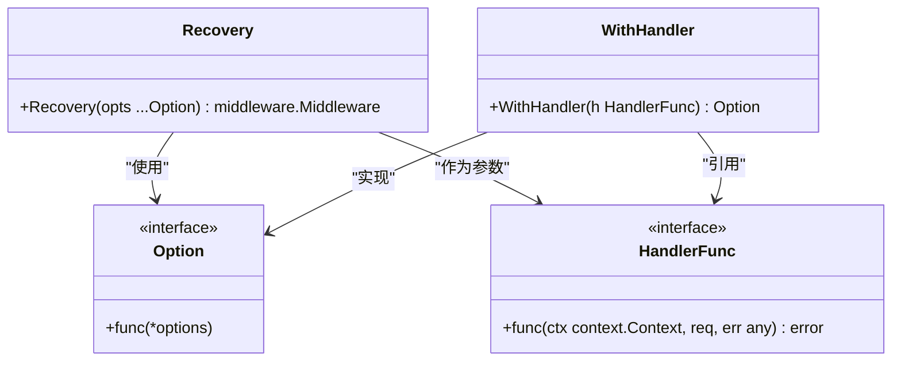
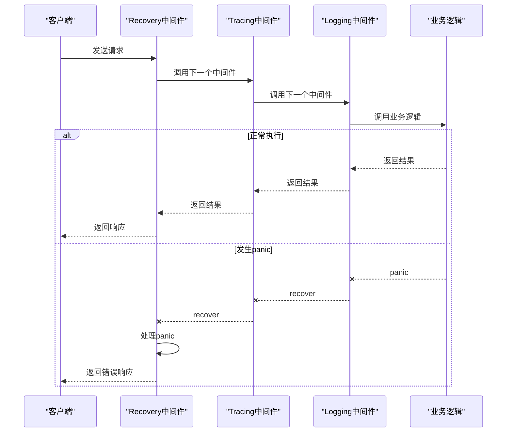
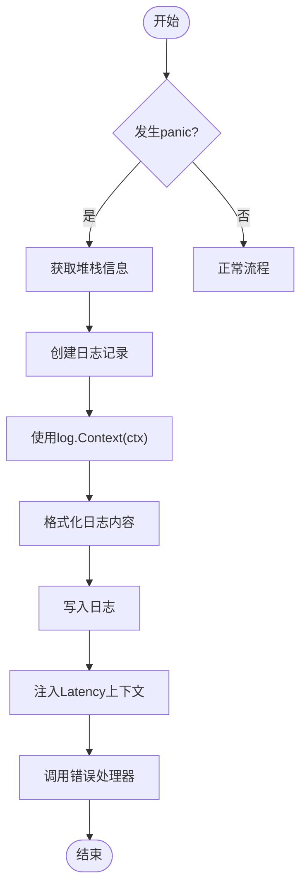
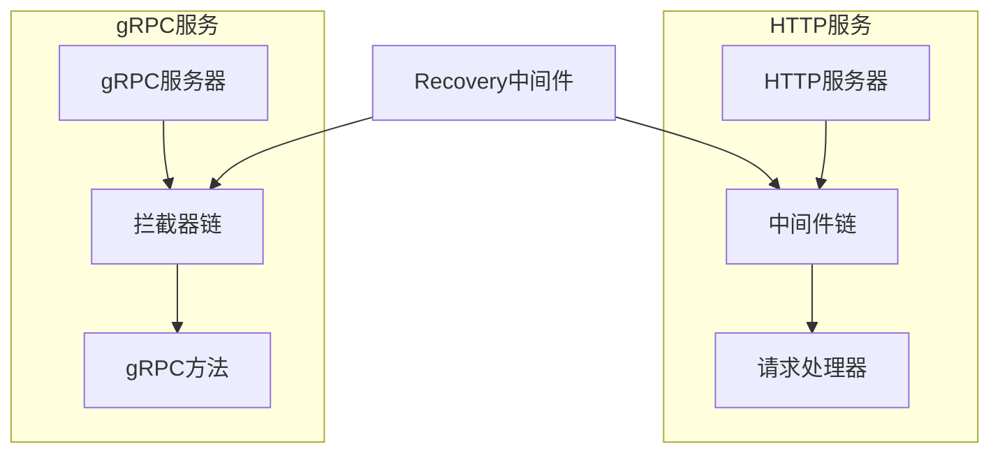
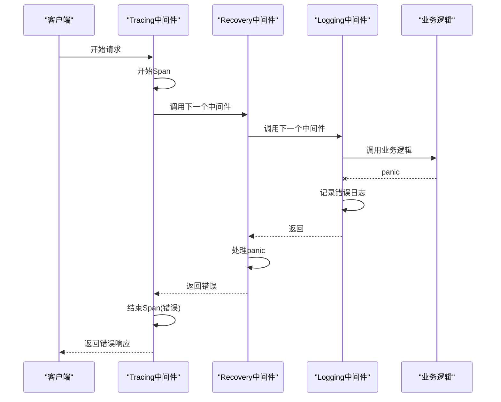
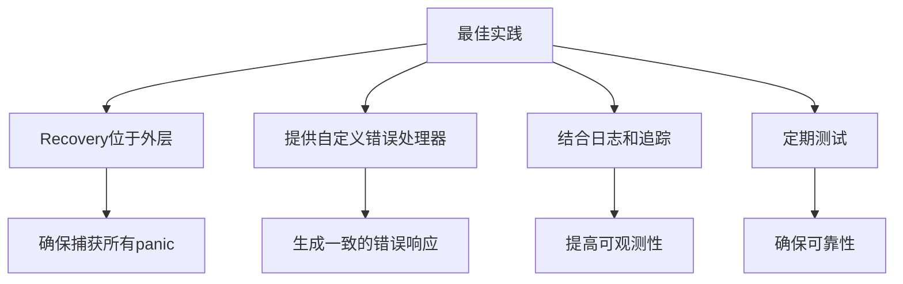

# Recovery中间件

<cite>
**本文档中引用的文件**  
- [recovery.go](file://middleware/recovery/recovery.go)
- [recovery_test.go](file://middleware/recovery/recovery_test.go)
- [middleware.go](file://middleware/middleware.go)
- [log.go](file://log/log.go)
- [global.go](file://log/global.go)
- [server.go](file://transport/http/server.go)
- [server.go](file://transport/grpc/server.go)
- [interceptor.go](file://transport/grpc/interceptor.go)
- [tracing.go](file://middleware/tracing/tracing.go)
- [logging.go](file://middleware/logging/logging.go)
- [errors.go](file://errors/errors.go)
- [status.go](file://transport/http/status/status.go)
</cite>

## 目录
1. [简介](#简介)
2. [核心实现机制](#核心实现机制)
3. [配置选项与自定义错误处理器](#配置选项与自定义错误处理器)
4. [执行时机与中间件链](#执行时机与中间件链)
5. [日志记录与可观测性](#日志记录与可观测性)
6. [HTTP与gRPC服务集成](#http与grpc服务集成)
7. [与其他中间件的协同工作](#与其他中间件的协同工作)
8. [常见问题与最佳实践](#常见问题与最佳实践)
9. [结论](#结论)

## 简介
Recovery中间件是Kratos框架中用于保障服务稳定性的关键组件。它通过Go语言的defer+recover机制，捕获服务处理过程中发生的panic，防止程序崩溃。当panic发生时，Recovery中间件会记录详细的错误日志，并将panic信息转换为框架标准错误返回给客户端，确保服务的优雅降级和可观测性。

**Section sources**
- [recovery.go](file://middleware/recovery/recovery.go#L36-L62)

## 核心实现机制
Recovery中间件的核心实现基于Go语言的defer+recover机制。在中间件的执行函数中，使用defer关键字注册一个匿名函数，该函数在当前函数返回前执行。在defer函数中调用recover()函数来捕获可能发生的panic。

当panic发生时，recover()函数会返回panic的值，然后中间件会执行以下操作：
1. 获取当前goroutine的堆栈信息
2. 通过日志组件记录panic详情和请求信息
3. 将上下文中的执行时长信息注入到context中
4. 调用配置的错误处理器生成标准错误
5. 将生成的错误作为返回值传递

这种实现方式确保了即使在业务逻辑中发生未预期的panic，服务也不会崩溃，而是能够优雅地处理错误并返回适当的响应。



**Diagram sources**
- [recovery.go](file://middleware/recovery/recovery.go#L46-L61)

**Section sources**
- [recovery.go](file://middleware/recovery/recovery.go#L46-L61)

## 配置选项与自定义错误处理器
Recovery中间件提供了灵活的配置选项，其中最重要的功能是通过WithHandler选项来自定义错误处理器。

### 配置选项
Recovery中间件使用函数式选项模式（Functional Options Pattern）进行配置，主要配置项包括：

- **WithHandler**: 设置自定义的错误处理函数，用于将panic转换为框架标准错误

### 自定义错误处理器
通过WithHandler选项，开发者可以提供自定义的HandlerFunc来处理panic。HandlerFunc的定义如下：
```go
type HandlerFunc func(ctx context.Context, req, err any) error
```

在自定义处理器中，可以访问：
- context.Context: 包含请求上下文信息
- req: 发生panic时的请求参数
- err: recover()捕获的panic值

自定义处理器可以基于这些信息生成更详细的错误响应，例如包含trace ID、请求ID等上下文信息的错误。



**Diagram sources**
- [recovery.go](file://middleware/recovery/recovery.go#L19-L34)

**Section sources**
- [recovery.go](file://middleware/recovery/recovery.go#L19-L34)
- [recovery_test.go](file://middleware/recovery/recovery_test.go#L21-L27)

## 执行时机与中间件链
Recovery中间件在中间件链中的执行时机至关重要。为了确保能够捕获所有内部中间件和业务逻辑中的panic，Recovery中间件通常需要位于中间件链的外层。

### 中间件链执行顺序
在Kratos框架中，中间件链的执行顺序遵循"先进后出"的原则。当多个中间件被组合时，它们的执行顺序如下：

1. 外层中间件的前置逻辑
2. 内层中间件的前置逻辑
3. 业务逻辑
4. 内层中间件的后置逻辑
5. 外层中间件的后置逻辑

因此，将Recovery中间件放在链的外层可以确保它能够捕获所有内层中间件和业务逻辑中的panic。

### 中间件链示例
以下是一个典型的中间件链执行流程：



**Diagram sources**
- [middleware.go](file://middleware/middleware.go#L14-L21)
- [recovery.go](file://middleware/recovery/recovery.go#L46-L61)

**Section sources**
- [middleware.go](file://middleware/middleware.go#L14-L21)
- [recovery.go](file://middleware/recovery/recovery.go#L46-L61)

## 日志记录与可观测性
Recovery中间件与日志组件紧密集成，确保panic信息能够被完整记录，提高系统的可观测性。

### 日志记录机制
当panic发生时，Recovery中间件会通过以下方式记录日志：

1. 使用log.Context(ctx)获取上下文相关的日志记录器
2. 记录panic值、请求参数和完整的堆栈信息
3. 使用Errorf级别记录错误，确保错误能够被正确分类和处理

日志记录的格式包含三个主要部分：
- panic值：%v
- 请求参数：%+v
- 堆栈信息：%s

### 上下文信息注入
Recovery中间件还会将执行时长信息注入到context中，使用Latency{}作为key。这个信息可以被后续的中间件（如Logging中间件）使用，用于记录请求的完整执行时间。



**Diagram sources**
- [recovery.go](file://middleware/recovery/recovery.go#L50-L57)
- [global.go](file://log/global.go#L48-L51)

**Section sources**
- [recovery.go](file://middleware/recovery/recovery.go#L50-L57)
- [global.go](file://log/global.go#L48-L51)

## HTTP与gRPC服务集成
Recovery中间件可以无缝集成到HTTP和gRPC服务中，为不同类型的传输层提供统一的panic处理机制。

### HTTP服务集成
在HTTP服务中，Recovery中间件通过HTTP服务器的Middleware选项进行配置。HTTP服务器使用gorilla/mux路由器，并通过中间件链处理请求。

集成步骤：
1. 创建HTTP服务器实例
2. 通过Middleware选项添加Recovery中间件
3. 在路由处理链中应用中间件

### gRPC服务集成
在gRPC服务中，Recovery中间件通过gRPC服务器的Middleware选项进行配置。gRPC服务器使用拦截器（Interceptor）机制，在请求处理前后执行中间件逻辑。

集成步骤：
1. 创建gRPC服务器实例
2. 通过Middleware选项添加Recovery中间件
3. 在拦截器链中应用中间件

两种集成方式都遵循相同的中间件模式，确保了API的一致性和使用的便捷性。



**Diagram sources**
- [server.go](file://transport/http/server.go#L66-L69)
- [server.go](file://transport/grpc/server.go#L68-L72)
- [interceptor.go](file://transport/grpc/interceptor.go#L17-L47)

**Section sources**
- [server.go](file://transport/http/server.go#L66-L69)
- [server.go](file://transport/grpc/server.go#L68-L72)
- [interceptor.go](file://transport/grpc/interceptor.go#L17-L47)

## 与其他中间件的协同工作
Recovery中间件需要与日志、追踪等其他中间件协同工作，以提供完整的错误处理和可观测性解决方案。

### 与日志中间件的协同
Logging中间件负责记录请求的详细信息，包括请求参数、响应结果、执行时长等。当Recovery中间件捕获到panic时，Logging中间件能够记录完整的错误上下文，包括：

- 请求的执行时长
- 请求参数
- 错误代码和原因
- 堆栈信息

### 与追踪中间件的协同
Tracing中间件负责分布式追踪，为每个请求生成trace ID和span ID。当panic发生时，Recovery中间件能够利用这些追踪信息，帮助开发者快速定位问题。

协同工作流程：
1. Tracing中间件开始一个新的span
2. 业务逻辑执行过程中发生panic
3. Recovery中间件捕获panic并记录日志
4. Logging中间件记录包含trace ID的错误日志
5. Tracing中间件结束span并标记为错误

这种协同工作模式确保了错误信息的完整性和可追溯性。



**Diagram sources**
- [tracing.go](file://middleware/tracing/tracing.go#L47-L58)
- [logging.go](file://middleware/logging/logging.go#L23-L58)
- [recovery.go](file://middleware/recovery/recovery.go#L46-L61)

**Section sources**
- [tracing.go](file://middleware/tracing/tracing.go#L47-L58)
- [logging.go](file://middleware/logging/logging.go#L23-L58)
- [recovery.go](file://middleware/recovery/recovery.go#L46-L61)

## 常见问题与最佳实践
在使用Recovery中间件时，可能会遇到一些常见问题。以下是问题分析和最佳实践建议。

### 常见问题

#### 1. recover被后续中间件阻断
如果Recovery中间件不是位于中间件链的最外层，内层的中间件可能会在panic发生后无法被外层的Recovery捕获。

#### 2. 日志信息不完整
如果没有正确配置日志组件，可能会导致panic的堆栈信息或请求参数记录不完整。

#### 3. 错误处理不一致
不同的错误处理器可能会生成不一致的错误响应格式，影响客户端的错误处理逻辑。

### 最佳实践

#### 1. 确保Recovery中间件位于外层
在配置中间件链时，确保Recovery中间件是第一个被添加的中间件，或者明确将其放置在链的外层。

#### 2. 提供有意义的错误处理器
使用WithHandler选项提供自定义的错误处理器，生成包含足够上下文信息的标准错误。

#### 3. 结合日志和追踪
确保Recovery中间件与日志、追踪中间件协同工作，提供完整的可观测性。

#### 4. 定期测试错误处理
通过单元测试验证Recovery中间件的行为，确保在各种panic场景下都能正确处理。



**Diagram sources**
- [recovery_test.go](file://middleware/recovery/recovery_test.go#L11-L29)
- [recovery.go](file://middleware/recovery/recovery.go#L36-L62)

**Section sources**
- [recovery_test.go](file://middleware/recovery/recovery_test.go#L11-L29)
- [recovery.go](file://middleware/recovery/recovery.go#L36-L62)

## 结论
Recovery中间件是Kratos框架中保障服务稳定性的重要组件。通过Go语言的defer+recover机制，它能够有效地捕获服务处理过程中的panic，防止程序崩溃。中间件提供了灵活的配置选项，特别是WithHandler自定义错误处理器，使得开发者可以根据具体需求定制错误处理逻辑。

在实际使用中，应确保Recovery中间件位于中间件链的外层，以便捕获所有内部panic。同时，应将其与日志、追踪等中间件协同工作，提供完整的错误处理和可观测性解决方案。通过遵循最佳实践，可以确保服务在面对异常情况时能够优雅降级，提高系统的可靠性和可维护性。