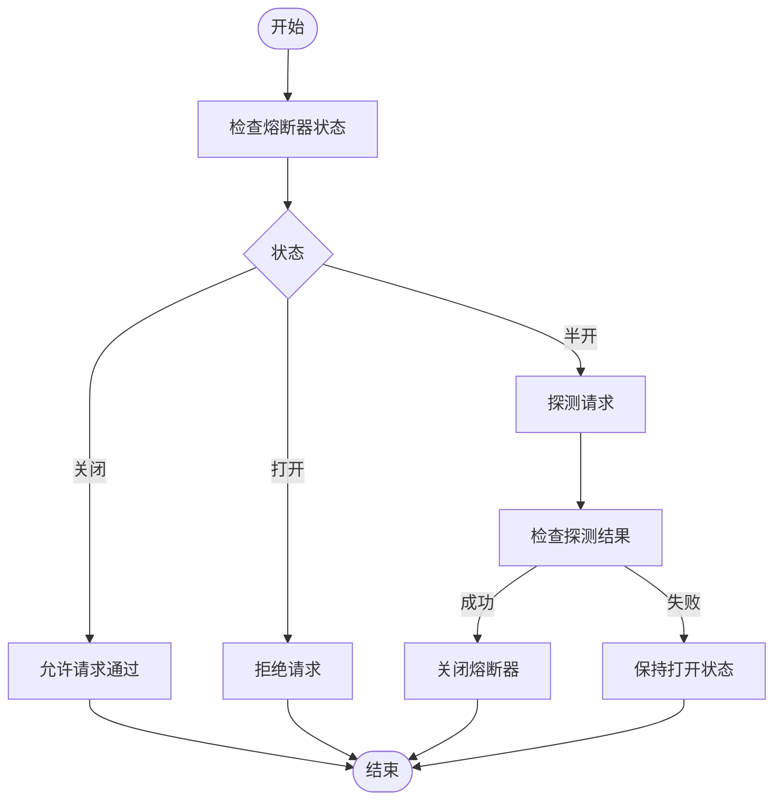
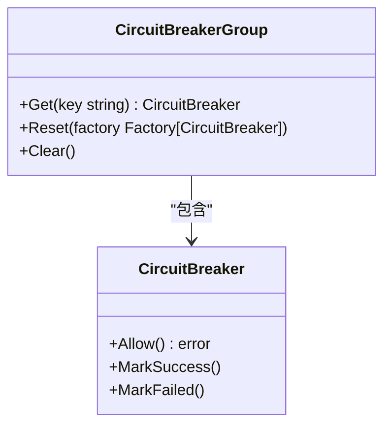
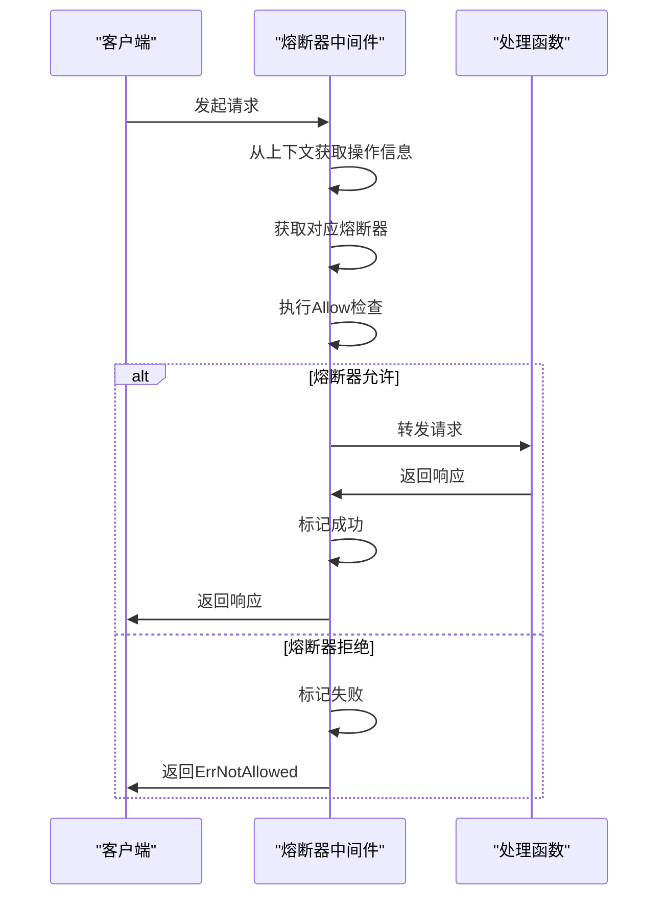

# 熔断器中间件

<cite>
**本文档引用的文件**
- [circuitbreaker.go](file://middleware/circuitbreaker/circuitbreaker.go)
- [circuitbreaker_test.go](file://middleware/circuitbreaker/circuitbreaker_test.go)
- [errors.go](file://errors/errors.go)
- [group.go](file://internal/group/group.go)
- [transport.go](file://transport/transport.go)
- [client.go](file://transport/http/client.go)
- [client.go](file://transport/grpc/client.go)
</cite>

## 目录
1. [简介](#简介)
2. [核心工作原理](#核心工作原理)
3. [SRE熔断算法实现](#sre熔断算法实现)
4. [配置方式](#配置方式)
5. [客户端中间件执行流程](#客户端中间件执行流程)
6. [错误处理机制](#错误处理机制)
7. [实际应用示例](#实际应用示例)
8. [常见配置误区](#常见配置误区)
9. [生产环境最佳实践](#生产环境最佳实践)

## 简介
熔断器中间件是Kratos框架中用于实现服务保护的重要组件，旨在防止因下游服务故障导致的级联雪崩效应。该中间件基于SRE（Site Reliability Engineering）熔断算法，通过监控服务调用的成功率和失败率来动态控制流量，当检测到服务异常时自动触发熔断机制，拒绝新的请求以保护系统稳定性。本文档详细阐述了熔断器中间件的工作原理、配置使用方法以及在HTTP和gRPC调用中的实际应用。

## 核心工作原理
熔断器中间件的核心工作原理是通过在客户端拦截请求，根据预设的熔断策略决定是否允许请求通过。当熔断器处于关闭状态时，请求正常转发；当检测到服务调用失败率超过阈值时，熔断器切换到打开状态，直接拒绝后续请求并返回预定义的错误。经过一段时间后，熔断器进入半开状态，允许少量请求通过以探测服务恢复情况，根据探测结果决定是否完全恢复或重新进入打开状态。

**Section sources**
- [circuitbreaker.go](file://middleware/circuitbreaker/circuitbreaker.go#L1-L74)

## SRE熔断算法实现
熔断器中间件采用SRE熔断算法实现，该算法通过统计一段时间内的请求成功率来判断服务健康状况。算法核心是维护一个滑动窗口，记录最近一段时间内的请求成功和失败次数。当失败率超过预设阈值（默认为50%）时，触发熔断机制。SRE算法的优势在于能够快速响应服务异常，同时避免因短暂波动导致的误触发。

**Diagram sources**
- [circuitbreaker.go](file://middleware/circuitbreaker/circuitbreaker.go#L44-L74)

## 配置方式
熔断器中间件提供了两种配置方式：通过WithGroup指定自定义熔断器组，或通过WithCircuitBreaker提供熔断器生成函数。

### 使用WithGroup配置自定义熔断器组
WithGroup方法允许用户传入一个预先创建的熔断器组，该组可以包含多个熔断器实例，适用于需要精细控制不同服务熔断策略的场景。

**Diagram sources**
- [circuitbreaker.go](file://middleware/circuitbreaker/circuitbreaker.go#L23-L27)
- [group.go](file://internal/group/group.go#L18-L27)

### 使用WithCircuitBreaker配置熔断器生成函数
WithCircuitBreaker方法允许用户传入一个熔断器生成函数，该函数在需要时动态创建熔断器实例，适用于需要根据不同条件创建不同熔断器策略的场景。

**Section sources**
- [circuitbreaker.go](file://middleware/circuitbreaker/circuitbreaker.go#L29-L35)

## 客户端中间件执行流程
客户端中间件的执行流程包括从传输上下文中获取操作信息、查询对应熔断器、执行Allow检查、以及根据请求结果标记成功或失败。

**Diagram sources**
- [circuitbreaker.go](file://middleware/circuitbreaker/circuitbreaker.go#L54-L73)

## 错误处理机制
当熔断器触发时，中间件返回ErrNotAllowed错误，该错误由errors包定义，包含503状态码和"CIRCUITBREAKER"原因。这种设计使得错误处理更加统一和可预测，便于上层应用进行错误分类和处理。

**Section sources**
- [circuitbreaker.go](file://middleware/circuitbreaker/circuitbreaker.go#L16)
- [errors.go](file://errors/errors.go#L68-L75)

## 实际应用示例
以下是在HTTP和gRPC调用中集成熔断器的实际代码示例。

### HTTP调用示例
在HTTP客户端中集成熔断器中间件，通过WithMiddleware选项添加熔断器。

**Section sources**
- [client.go](file://transport/http/client.go#L88-L93)

### gRPC调用示例
在gRPC客户端中集成熔断器中间件，通过WithMiddleware选项添加熔断器。

**Section sources**
- [client.go](file://transport/grpc/client.go#L58-L63)

## 常见配置误区
常见的配置误区包括阈值设置不合理导致误触发或失效。例如，将失败率阈值设置过低可能导致正常波动被误判为服务异常，而设置过高则可能无法及时保护系统。建议根据服务的历史调用数据和业务需求合理设置阈值。

## 生产环境最佳实践
在生产环境中使用熔断器中间件的最佳实践包括：合理设置熔断阈值和恢复时间、监控熔断器状态变化、结合其他容错机制如重试和降级、定期评估和调整熔断策略。此外，建议在非生产环境中充分测试熔断器配置，确保其在各种场景下都能正确工作。