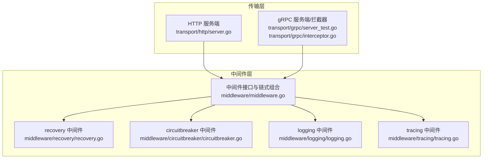
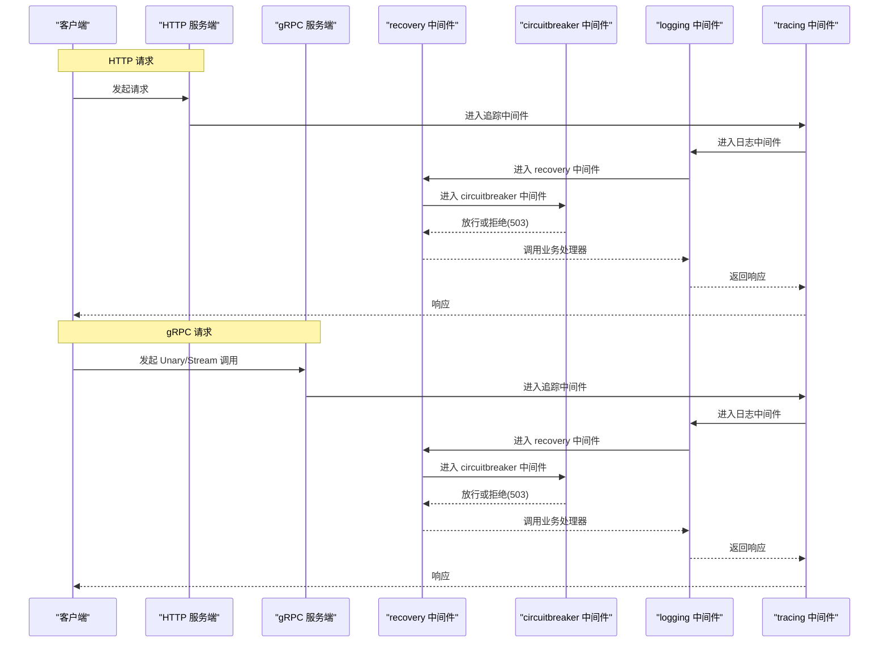
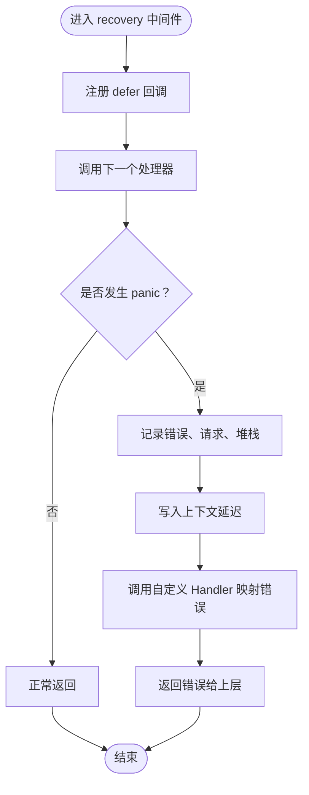
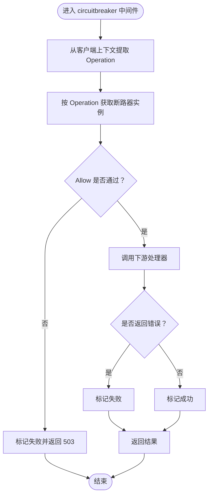
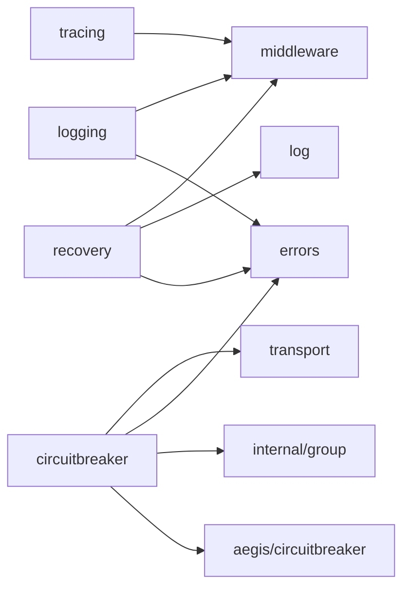

# 错误处理中间件

<cite>
**本文引用的文件**
- [middleware/recovery/recovery.go](file://middleware/recovery/recovery.go)
- [middleware/recovery/recovery_test.go](file://middleware/recovery/recovery_test.go)
- [middleware/circuitbreaker/circuitbreaker.go](file://middleware/circuitbreaker/circuitbreaker.go)
- [middleware/circuitbreaker/circuitbreaker_test.go](file://middleware/circuitbreaker/circuitbreaker_test.go)
- [middleware/middleware.go](file://middleware/middleware.go)
- [middleware/logging/logging.go](file://middleware/logging/logging.go)
- [middleware/tracing/tracing.go](file://middleware/tracing/tracing.go)
- [transport/http/server.go](file://transport/http/server.go)
- [transport/grpc/server_test.go](file://transport/grpc/server_test.go)
- [transport/grpc/interceptor.go](file://transport/grpc/interceptor.go)
- [contrib/errortracker/sentry/sentry.go](file://contrib/errortracker/sentry/sentry.go)
</cite>

## 目录
1. [简介](#简介)
2. [项目结构](#项目结构)
3. [核心组件](#核心组件)
4. [架构总览](#架构总览)
5. [组件详解](#组件详解)
6. [依赖关系分析](#依赖关系分析)
7. [性能考量](#性能考量)
8. [故障排查指南](#故障排查指南)
9. [结论](#结论)
10. [附录](#附录)

## 简介
本章节系统性介绍 Kratos 框架中的两类关键错误处理中间件：recovery（恢复/兜底）与 circuitbreaker（熔断）。recovery 中间件通过 defer + recover 机制捕获服务端/客户端的 Panic，避免进程崩溃，统一返回可控错误并记录堆栈；circuitbreaker 中间件基于断路器策略（如错误率、超时等）对下游调用进行限流保护，防止级联故障。文档将阐明两者的配置参数、启用方式、执行时机、在中间件链中的典型位置（通常靠近外层），以及与日志、追踪中间件的协同工作方式，并给出常见误区与最佳实践。

## 项目结构
围绕错误处理中间件的相关模块分布如下：
- middleware/recovery：服务端/客户端通用的 Panic 恢复中间件
- middleware/circuitbreaker：客户端侧断路器中间件
- middleware/middleware.go：中间件类型定义与链式组合工具
- middleware/logging：服务端/客户端日志中间件
- middleware/tracing：OpenTelemetry 追踪中间件
- transport/http/server.go：HTTP 服务端中间件注入点
- transport/grpc/server_test.go：gRPC 服务端拦截器与中间件使用示例
- transport/grpc/interceptor.go：gRPC 流式拦截器与中间件匹配逻辑
- contrib/errortracker/sentry：可选的 Sentry 错误追踪中间件（演示 recover 的扩展）

图表来源
- [middleware/middleware.go](file://middleware/middleware.go#L1-L21)
- [middleware/recovery/recovery.go](file://middleware/recovery/recovery.go#L1-L62)
- [middleware/circuitbreaker/circuitbreaker.go](file://middleware/circuitbreaker/circuitbreaker.go#L1-L74)
- [middleware/logging/logging.go](file://middleware/logging/logging.go#L1-L120)
- [middleware/tracing/tracing.go](file://middleware/tracing/tracing.go#L1-L97)
- [transport/http/server.go](file://transport/http/server.go#L1-L200)
- [transport/grpc/server_test.go](file://transport/grpc/server_test.go#L53-L102)
- [transport/grpc/interceptor.go](file://transport/grpc/interceptor.go#L85-L130)

章节来源
- [middleware/middleware.go](file://middleware/middleware.go#L1-L21)
- [transport/http/server.go](file://transport/http/server.go#L1-L200)

## 核心组件
- recovery 中间件
  - 作用：捕获 Panic，记录请求与堆栈，统一返回可控错误，向上下文写入延迟信息
  - 关键点：defer + recover；可自定义 HandlerFunc；默认返回未知请求错误
- circuitbreaker 中间件
  - 作用：在客户端侧根据断路器策略拒绝高风险请求，统计成功/失败并更新状态，避免级联故障
  - 关键点：按 Operation 分组管理断路器；允许时放行，拒绝时直接返回 503；异常时标记失败，正常时标记成功

章节来源
- [middleware/recovery/recovery.go](file://middleware/recovery/recovery.go#L1-L62)
- [middleware/circuitbreaker/circuitbreaker.go](file://middleware/circuitbreaker/circuitbreaker.go#L1-L74)

## 架构总览
下图展示了 HTTP 与 gRPC 服务在接入 recovery 与 circuitbreaker 后的典型调用链与中间件顺序。

图表来源
- [transport/http/server.go](file://transport/http/server.go#L60-L120)
- [transport/grpc/server_test.go](file://transport/grpc/server_test.go#L53-L102)
- [transport/grpc/interceptor.go](file://transport/grpc/interceptor.go#L85-L130)
- [middleware/recovery/recovery.go](file://middleware/recovery/recovery.go#L1-L62)
- [middleware/circuitbreaker/circuitbreaker.go](file://middleware/circuitbreaker/circuitbreaker.go#L1-L74)
- [middleware/logging/logging.go](file://middleware/logging/logging.go#L1-L120)
- [middleware/tracing/tracing.go](file://middleware/tracing/tracing.go#L1-L97)

## 组件详解

### recovery 中间件
- 设计要点
  - 使用 defer 在进入业务处理器前包裹，确保任何 Panic 都能被捕获
  - 捕获后记录错误、请求对象与堆栈，便于定位问题
  - 将处理耗时写入上下文，供后续中间件（如日志）使用
  - 可通过 WithHandler 注入自定义错误转换逻辑，默认返回“未知请求”错误
- 执行时机
  - 在中间件链最外层（靠近外层）放置，确保能捕获后续中间件与业务处理器抛出的 Panic
- 典型配置
  - WithHandler：自定义 Panic 到业务错误的映射
- 与日志/追踪协同
  - 日志中间件读取上下文中的延迟值，输出耗时
  - 追踪中间件为每个请求创建 Span，recovery 不影响追踪生命周期
- 常见误区
  - 若后续中间件在 defer 前再次 panic 并未被外层 recovery 捕获，需调整中间件顺序
  - 自定义 Handler 忘记返回标准错误码，导致上层无法正确识别
- 最佳实践
  - 将 recovery 放置在中间件链最外层
  - 为 Handler 提供统一的错误格式化与可观测性输出
  - 对于外部依赖的 panic，优先在上游（客户端）使用 circuitbreaker，减少对主流程的影响

图表来源
- [middleware/recovery/recovery.go](file://middleware/recovery/recovery.go#L1-L62)

章节来源
- [middleware/recovery/recovery.go](file://middleware/recovery/recovery.go#L1-L62)
- [middleware/recovery/recovery_test.go](file://middleware/recovery/recovery_test.go#L1-L43)
- [middleware/logging/logging.go](file://middleware/logging/logging.go#L1-L120)
- [middleware/tracing/tracing.go](file://middleware/tracing/tracing.go#L1-L97)

### circuitbreaker 中间件
- 设计要点
  - 客户端侧中间件，按 Operation 获取断路器实例
  - Allow 成功则放行，失败则本地拒绝并返回 503
  - 根据返回错误类型判断标记成功或失败，维持断路器状态
  - 默认使用 SRE 断路器，可通过 WithCircuitBreaker 或 WithGroup 自定义
- 执行时机
  - 通常放在日志/追踪之后、业务处理器之前，确保拒绝路径与统计路径完整
- 典型配置
  - WithCircuitBreaker：自定义断路器生成函数
  - WithGroup：自定义断路器分组（按 Operation）
- 与日志/追踪协同
  - circuitbreaker 仅负责放行/拒绝与计数，不影响追踪生命周期
  - 日志中间件记录最终的错误码与耗时
- 常见误区
  - 断路器阈值设置过严导致服务不可用
  - 未区分内部错误与网络超时，导致误判
- 最佳实践
  - 结合 SRE 断路器默认策略，逐步调优阈值与时间窗口
  - 对不同 Operation 单独分组，避免互相影响
  - 与 recovery 配合：recovery 捕获异常，circuitbreaker 控制流量

图表来源
- [middleware/circuitbreaker/circuitbreaker.go](file://middleware/circuitbreaker/circuitbreaker.go#L1-L74)

章节来源
- [middleware/circuitbreaker/circuitbreaker.go](file://middleware/circuitbreaker/circuitbreaker.go#L1-L74)
- [middleware/circuitbreaker/circuitbreaker_test.go](file://middleware/circuitbreaker/circuitbreaker_test.go#L1-L81)

### 中间件链与执行顺序
- 中间件链由 middleware.Chain 组合，采用“从外到内”的包裹式执行
- 推荐顺序（从外到内）
  - tracing（追踪）
  - logging（日志）
  - recovery（恢复）
  - circuitbreaker（熔断）
  - 业务处理器
- HTTP 与 gRPC 的注入点
  - HTTP：通过 transport/http/server.go 的 Middleware 选项注入
  - gRPC：通过拦截器与 Matcher 匹配中间件

章节来源
- [middleware/middleware.go](file://middleware/middleware.go#L1-L21)
- [transport/http/server.go](file://transport/http/server.go#L60-L120)
- [transport/grpc/server_test.go](file://transport/grpc/server_test.go#L53-L102)
- [transport/grpc/interceptor.go](file://transport/grpc/interceptor.go#L85-L130)

## 依赖关系分析
- recovery 依赖
  - errors：构造统一错误
  - log：记录错误与堆栈
  - middleware：中间件类型与链式组合
- circuitbreaker 依赖
  - go-kratos/aegis/circuitbreaker：断路器接口与 SRE 实现
  - internal/group：按 Operation 分组管理断路器
  - errors：识别内部错误、服务不可用、网关超时
  - transport：从客户端上下文提取 Operation
- 与日志/追踪的协作
  - logging 与 tracing 作为独立中间件，不改变错误处理逻辑，但增强可观测性

图表来源
- [middleware/recovery/recovery.go](file://middleware/recovery/recovery.go#L1-L62)
- [middleware/circuitbreaker/circuitbreaker.go](file://middleware/circuitbreaker/circuitbreaker.go#L1-L74)
- [middleware/logging/logging.go](file://middleware/logging/logging.go#L1-L120)
- [middleware/tracing/tracing.go](file://middleware/tracing/tracing.go#L1-L97)

章节来源
- [middleware/recovery/recovery.go](file://middleware/recovery/recovery.go#L1-L62)
- [middleware/circuitbreaker/circuitbreaker.go](file://middleware/circuitbreaker/circuitbreaker.go#L1-L74)
- [middleware/logging/logging.go](file://middleware/logging/logging.go#L1-L120)
- [middleware/tracing/tracing.go](file://middleware/tracing/tracing.go#L1-L97)

## 性能考量
- recovery
  - defer + recover 的开销极低，主要成本在堆栈采集与日志输出
  - 建议在生产环境开启堆栈记录，但控制日志级别与采样率
- circuitbreaker
  - 断路器状态切换与计数开销很小
  - 合理设置时间窗口与阈值，避免频繁抖动
  - 对不同 Operation 单独分组，降低误判概率

[本节为通用指导，无需列出具体文件来源]

## 故障排查指南
- recovery 未生效
  - 检查是否将 recovery 放置在中间件链最外层
  - 确认 Handler 返回了标准错误，以便上层识别
  - 参考测试用例验证上下文延迟值是否写入
- circuitbreaker 拒绝过多
  - 检查断路器阈值与时间窗口是否过严
  - 区分内部错误与网络超时，避免误判
  - 对不同 Operation 单独分组，观察各组指标
- 与日志/追踪协同问题
  - 确保 logging/tracing 在 recovery/circuitbreaker 内部执行，以便记录最终结果
  - 如需上报异常，可参考 Sentry 中间件的 recover 模式（非框架内置）

章节来源
- [middleware/recovery/recovery_test.go](file://middleware/recovery/recovery_test.go#L1-L43)
- [middleware/circuitbreaker/circuitbreaker_test.go](file://middleware/circuitbreaker/circuitbreaker_test.go#L1-L81)
- [contrib/errortracker/sentry/sentry.go](file://contrib/errortracker/sentry/sentry.go#L97-L145)

## 结论
recovery 与 circuitbreaker 是保障服务稳定性的两大基石。recovery 通过 defer + recover 防止服务崩溃，circuitbreaker 通过断路策略避免级联故障。两者应配合日志与追踪中间件，在中间件链中靠外层放置，确保可观测性与稳定性兼顾。结合默认 SRE 断路器策略与合理的阈值调优，可在保证用户体验的同时提升系统韧性。

[本节为总结性内容，无需列出具体文件来源]

## 附录

### 在 HTTP 与 gRPC 中集成示例（路径指引）
- HTTP 服务端
  - 使用 transport/http/server.go 的 Middleware 选项注入中间件链
  - 参考路径：[transport/http/server.go](file://transport/http/server.go#L60-L120)
- gRPC 服务端
  - 使用拦截器与 Matcher 匹配中间件
  - 参考路径：[transport/grpc/server_test.go](file://transport/grpc/server_test.go#L53-L102)、[transport/grpc/interceptor.go](file://transport/grpc/interceptor.go#L85-L130)
- recovery 与 circuitbreaker 的 Handler/Option
  - recovery：WithHandler、Recovery
    - 参考路径：[middleware/recovery/recovery.go](file://middleware/recovery/recovery.go#L1-L62)
  - circuitbreaker：WithCircuitBreaker、WithGroup、Client
    - 参考路径：[middleware/circuitbreaker/circuitbreaker.go](file://middleware/circuitbreaker/circuitbreaker.go#L1-L74)

### 与日志、追踪中间件的协同
- logging：记录请求、错误码、原因、堆栈与耗时
  - 参考路径：[middleware/logging/logging.go](file://middleware/logging/logging.go#L1-L120)
- tracing：创建/结束 Span，支持 TraceID/SpanID 输出
  - 参考路径：[middleware/tracing/tracing.go](file://middleware/tracing/tracing.go#L1-L97)