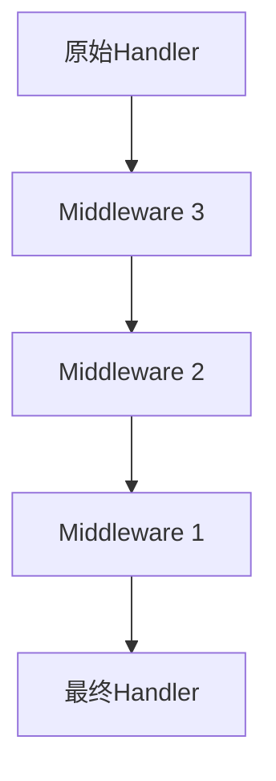
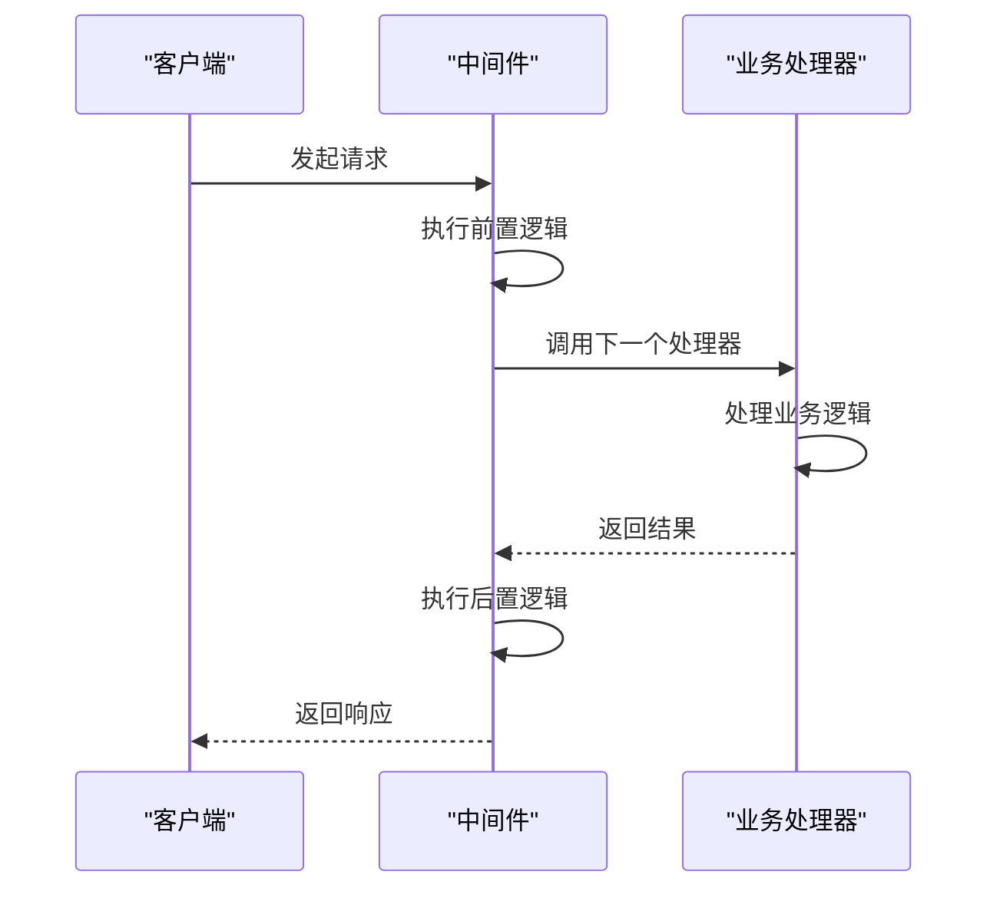
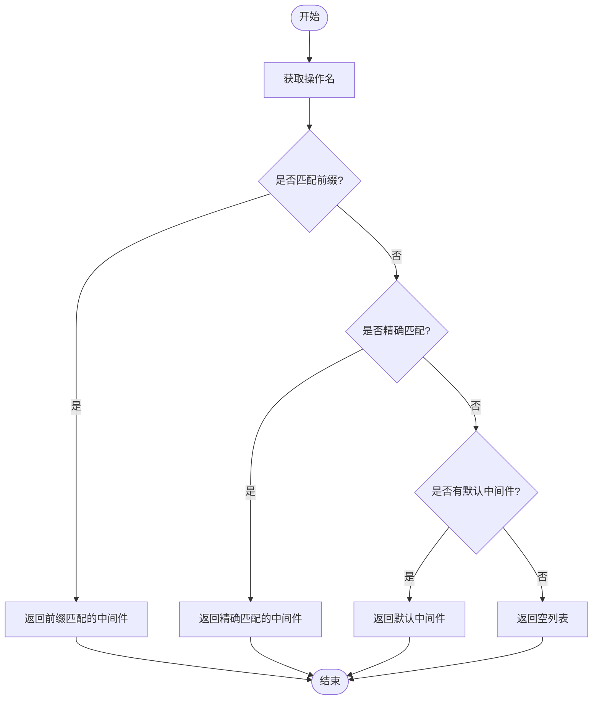
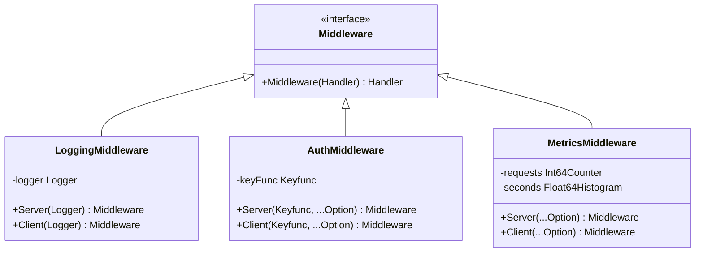
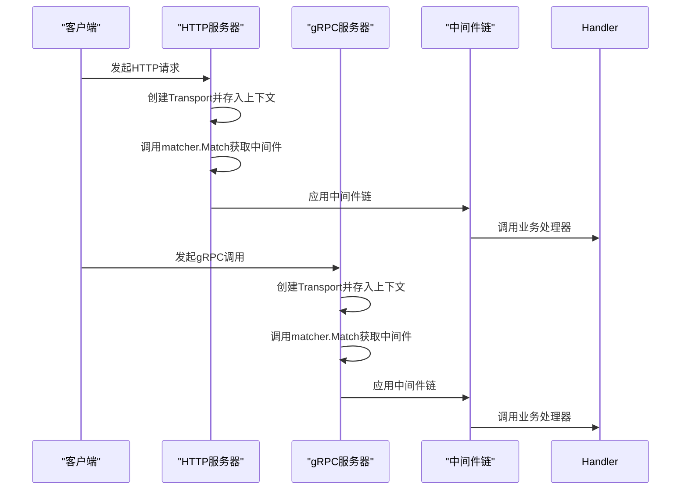

# 自定义中间件开发

<cite>
**本文档中引用的文件**  
- [middleware.go](file://middleware/middleware.go)
- [selector.go](file://middleware/selector/selector.go)
- [logging.go](file://middleware/logging/logging.go)
- [jwt.go](file://middleware/auth/jwt/jwt.go)
- [metrics.go](file://middleware/metrics/metrics.go)
- [server.go](file://transport/http/server.go)
- [server.go](file://transport/grpc/server.go)
- [interceptor.go](file://transport/grpc/interceptor.go)
- [middleware.go](file://internal/matcher/middleware.go)
</cite>

## 目录
1. [中间件核心类型与链式组合机制](#中间件核心类型与链式组合机制)
2. [标准中间件编写方法](#标准中间件编写方法)
3. [基于请求条件的中间件选择机制](#基于请求条件的中间件选择机制)
4. [常见中间件实现示例](#常见中间件实现示例)
5. [中间件在HTTP与gRPC服务中的注入方式](#中间件在http与grpc服务中的注入方式)
6. [中间件测试方法与常见陷阱](#中间件测试方法与常见陷阱)

## 中间件核心类型与链式组合机制

Kratos框架中的中间件基于函数式编程范式设计，核心类型定义在`middleware.go`文件中。`Middleware`类型被定义为一个函数，接收一个`Handler`并返回一个新的`Handler`，形成函数的链式调用。`Handler`本身也是一个函数类型，接收上下文和请求参数，返回响应和错误。

中间件链的组合通过`Chain`函数实现，该函数采用逆序组合机制。当多个中间件被组合时，它们按照从右到左的顺序被应用。这意味着最后一个被添加的中间件会最先执行其前置逻辑，而最先被添加的中间件会最后执行其后置逻辑。这种逆序机制确保了中间件的嵌套调用栈能够正确地展开和回溯。

**图示来源**
- [middleware.go](file://middleware/middleware.go#L10-L21)

**本节来源**
- [middleware.go](file://middleware/middleware.go#L7-L21)

## 标准中间件编写方法

开发一个符合Kratos框架规范的自定义中间件，需要遵循特定的模式。中间件函数接收一个`Handler`作为参数，并返回一个新的`Handler`。在这个新的`Handler`内部，可以嵌入前置处理逻辑（在调用下一个`Handler`之前执行）和后置处理逻辑（在`Handler`执行完毕后执行）。

前置逻辑通常用于日志记录、请求验证、上下文信息提取等操作。后置逻辑则适用于结果处理、错误捕获、性能监控等场景。通过这种方式，中间件可以在不修改业务逻辑代码的情况下，为服务添加横切关注点。

**图示来源**
- [middleware.go](file://middleware/middleware.go#L10-L21)
- [logging.go](file://middleware/logging/logging.go#L23-L58)

**本节来源**
- [middleware.go](file://middleware/middleware.go#L7-L21)
- [logging.go](file://middleware/logging/logging.go#L23-L58)

## 基于请求条件的中间件选择机制

Kratos框架提供了灵活的中间件选择机制，允许开发者根据请求路径、操作名或自定义条件来选择性地应用中间件。这一功能主要通过`selector.go`文件中的`Builder`结构体实现。

`Builder`提供了多种匹配方法，包括`Prefix`、`Regex`、`Path`和`Match`。`Prefix`方法用于匹配以指定前缀开头的操作名，`Regex`方法使用正则表达式进行匹配，`Path`方法进行精确路径匹配，而`Match`方法则允许传入一个自定义的`MatchFunc`函数，提供最大的灵活性。

在HTTP和gRPC服务器的实现中，`matcher.Matcher`接口被用来管理这些选择规则。`Use`方法设置默认中间件，`Add`方法根据选择器添加特定中间件，`Match`方法则根据操作名返回应应用的中间件列表。选择器支持通配符`*`，用于匹配某个服务下的所有方法。

**图示来源**
- [selector.go](file://middleware/selector/selector.go#L12-L145)
- [middleware.go](file://internal/matcher/middleware.go#L10-L63)

**本节来源**
- [selector.go](file://middleware/selector/selector.go#L12-L145)
- [middleware.go](file://internal/matcher/middleware.go#L10-L63)

## 常见中间件实现示例

### 日志中间件
日志中间件是典型的中间件应用，用于记录请求的详细信息。它在`logging.go`文件中实现，通过`Server`和`Client`两个函数分别创建服务端和客户端的日志中间件。该中间件记录请求的类型、操作名、参数、响应码、错误原因和执行耗时等信息。

### 认证中间件
认证中间件负责处理用户身份验证，如JWT令牌的验证。在`jwt.go`文件中实现的JWT中间件，从请求头中提取JWT令牌，验证其有效性，并将解析出的用户信息存入上下文中，供后续处理器使用。

### 自定义指标中间件
指标中间件用于收集服务的性能数据，如请求次数和响应时间。`metrics.go`文件中的实现利用OpenTelemetry SDK，将这些数据上报到监控系统。它通过`WithRequests`和`WithSeconds`选项配置计数器和直方图。

**图示来源**
- [logging.go](file://middleware/logging/logging.go#L23-L58)
- [jwt.go](file://middleware/auth/jwt/jwt.go#L79-L127)
- [metrics.go](file://middleware/metrics/metrics.go#L102-L157)

**本节来源**
- [logging.go](file://middleware/logging/logging.go#L23-L58)
- [jwt.go](file://middleware/auth/jwt/jwt.go#L79-L127)
- [metrics.go](file://middleware/metrics/metrics.go#L102-L157)

## 中间件在HTTP与gRPC服务中的注入方式

中间件可以通过`WithMiddleware`选项注入到HTTP或gRPC服务中。在`server.go`文件中，HTTP和gRPC服务器都提供了`Middleware`选项函数，用于设置中间件。

对于HTTP服务器，中间件通过`mux`路由器的`Use`方法应用。在`filter`函数中，服务器创建一个`Transport`对象并将其存入上下文，然后调用`matcher.Matcher`的`Match`方法获取应应用的中间件链，并通过`Chain`函数组合它们。

对于gRPC服务器，中间件通过gRPC的拦截器机制应用。在`interceptor.go`文件中，`unaryServerInterceptor`和`streamServerInterceptor`函数实现了这一逻辑。它们从上下文中提取操作名，使用`matcher.Matcher`匹配相应的中间件，并将其组合成一个处理链。

**图示来源**
- [server.go](file://transport/http/server.go#L273-L307)
- [server.go](file://transport/grpc/server.go#L167-L182)
- [interceptor.go](file://transport/grpc/interceptor.go#L17-L47)

**本节来源**
- [server.go](file://transport/http/server.go#L273-L307)
- [server.go](file://transport/grpc/server.go#L167-L182)
- [interceptor.go](file://transport/grpc/interceptor.go#L17-L47)

## 中间件测试方法与常见陷阱

测试中间件时，应重点关注其前置和后置逻辑的正确性，以及与其他中间件的组合行为。常见的测试方法包括单元测试和集成测试。单元测试可以模拟`Handler`的调用，验证中间件在不同输入下的行为。集成测试则需要启动一个完整的服务器，通过真实的HTTP或gRPC请求来测试中间件。

常见的陷阱包括：
1. **上下文管理不当**：在中间件中修改上下文后，必须确保将其正确传递给下一个处理器。
2. **错误处理不完整**：中间件应正确处理并传递错误，避免掩盖底层错误。
3. **性能开销过大**：复杂的前置或后置逻辑可能增加请求延迟，应进行性能评估。
4. **并发安全问题**：在中间件中共享状态时，必须考虑并发访问的安全性。

**本节来源**
- [middleware_test.go](file://middleware/middleware_test.go)
- [logging_test.go](file://middleware/logging/logging_test.go)
- [jwt_test.go](file://middleware/auth/jwt/jwt_test.go)
- [metrics_test.go](file://middleware/metrics/metrics_test.go)