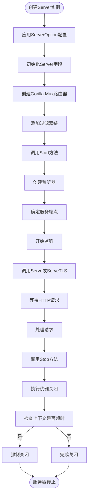
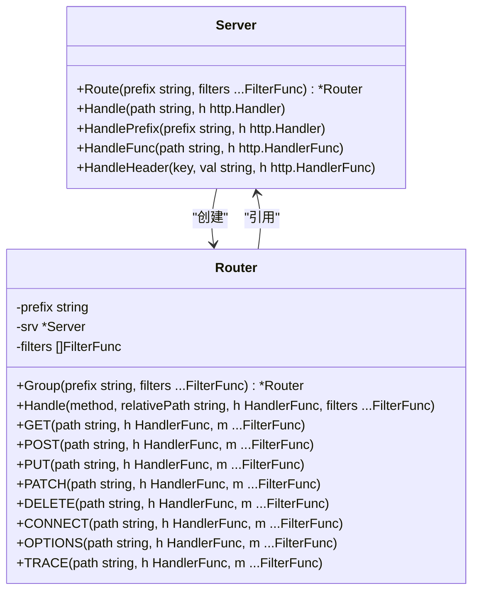
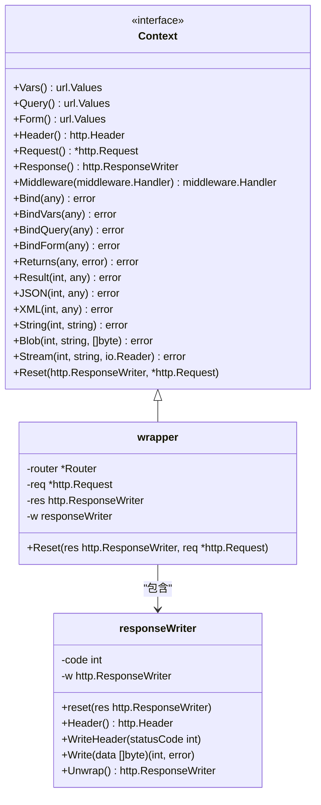
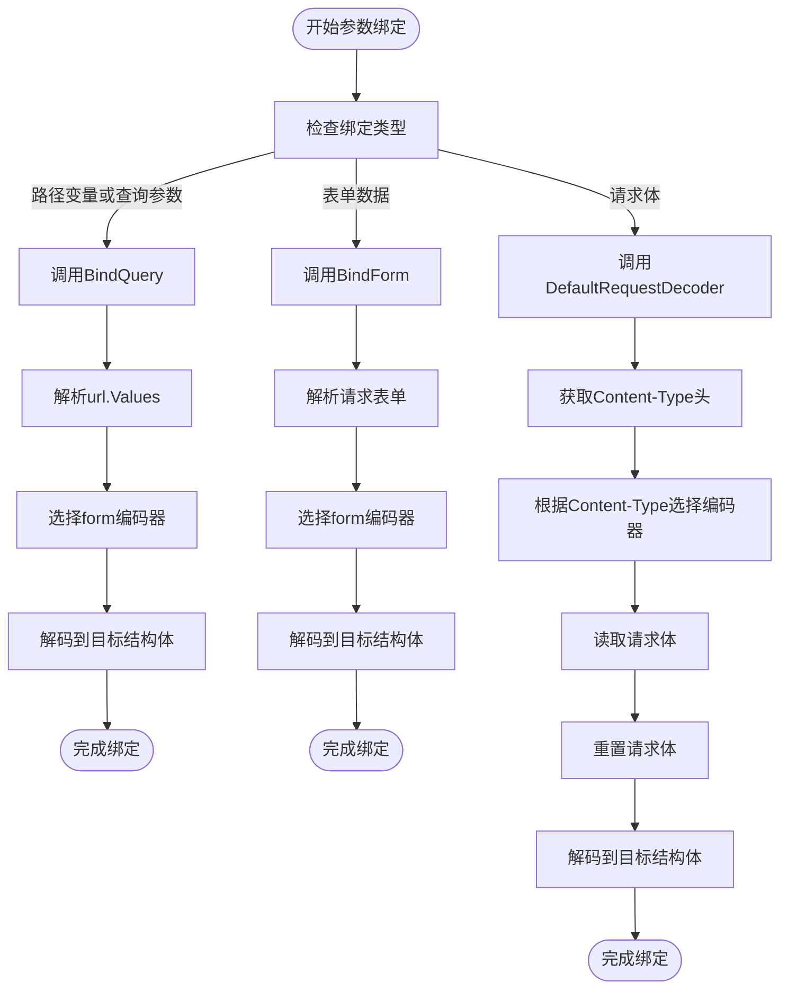
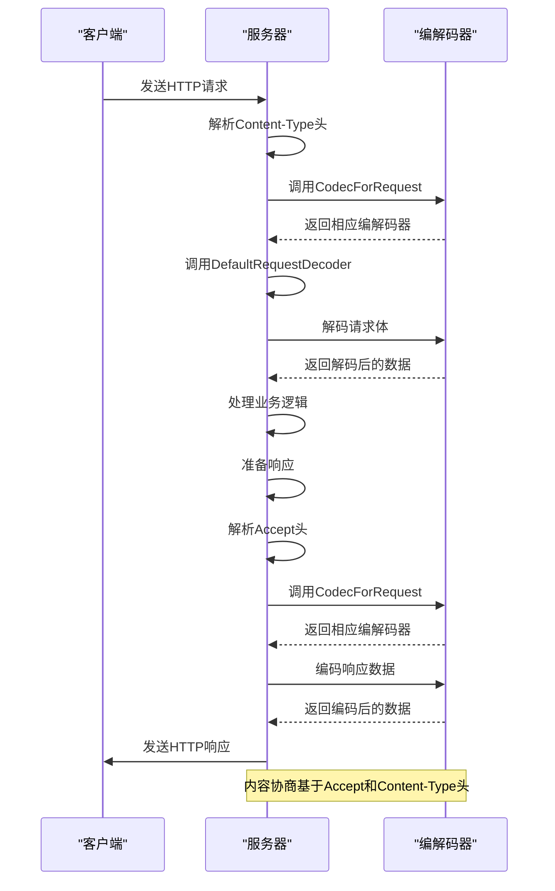
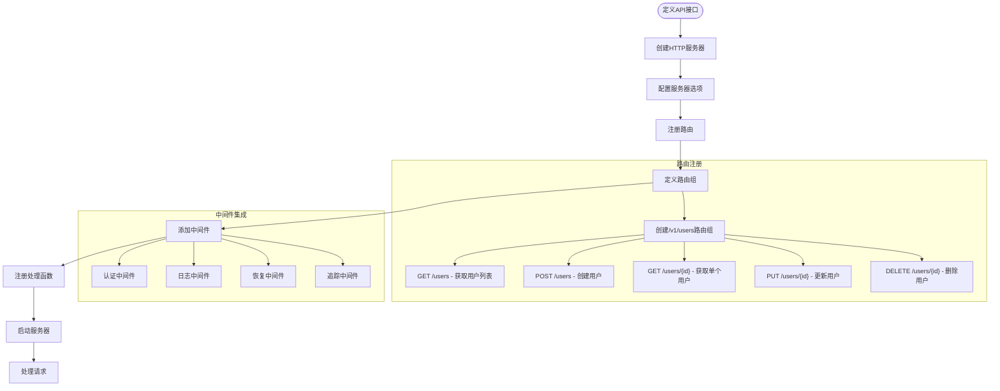
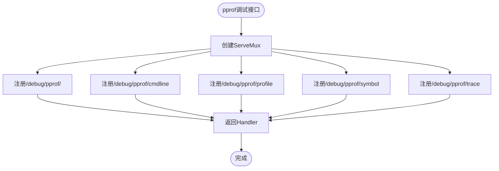
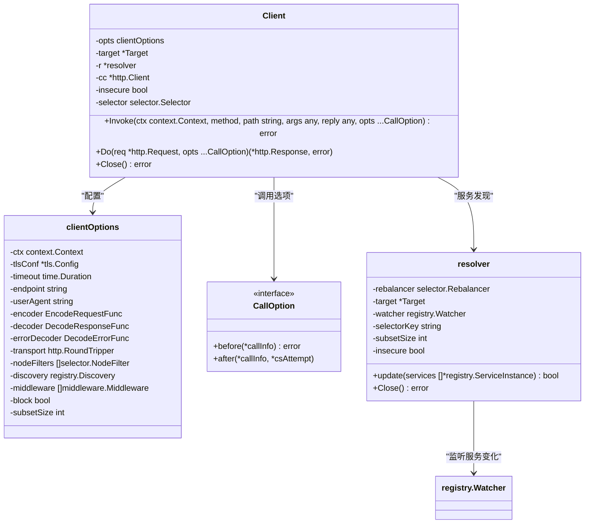

# HTTP传输

<cite>
**本文档引用的文件**
- [server.go](file://transport/http/server.go)
- [router.go](file://transport/http/router.go)
- [context.go](file://transport/http/context.go)
- [binding/bind.go](file://transport/http/binding/bind.go)
- [codec.go](file://transport/http/codec.go)
- [redirect.go](file://transport/http/redirect.go)
- [pprof/pprof.go](file://transport/http/pprof/pprof.go)
- [calloption.go](file://transport/http/calloption.go)
- [resolver.go](file://transport/http/resolver.go)
- [client.go](file://transport/http/client.go)
- [form.go](file://encoding/form/form.go)
- [http.go](file://internal/httputil/http.go)
</cite>

## 目录
1. [HTTP服务器启动流程](#http服务器启动流程)
2. [路由注册机制](#路由注册机制)
3. [请求上下文管理](#请求上下文管理)
4. [参数绑定功能](#参数绑定功能)
5. [HTTP Codec编解码机制](#http-codec编解码机制)
6. [RESTful API示例](#restful-api示例)
7. [高级特性](#高级特性)
8. [HTTP客户端实现](#http客户端实现)

## HTTP服务器启动流程

HTTP服务器的启动流程通过`Server`结构体实现，该结构体封装了`net/http`的`http.Server`并提供了Kratos框架特有的功能。服务器通过`NewServer`函数创建，接受一系列`ServerOption`选项来配置服务器行为。

服务器启动时，首先通过`listenAndEndpoint`方法创建监听器并确定服务端点。如果未提供监听器，则根据网络类型和地址创建新的监听器。然后设置`BaseContext`为传入的上下文，记录启动日志，并根据是否配置了TLS来决定调用`ServeTLS`或`Serve`方法。

服务器停止时，通过`Stop`方法执行优雅关闭。该方法首先调用`Shutdown`方法，如果在上下文超时时间内未能完成关闭，则执行强制关闭。

**Diagram sources**
- [server.go](file://transport/http/server.go#L157-L374)

**Section sources**
- [server.go](file://transport/http/server.go#L157-L374)

## 路由注册机制

路由注册机制基于Gorilla Mux路由器实现，提供了灵活的路由匹配和分组功能。`Server`结构体通过`Route`方法创建`Router`实例，该实例允许在特定路径前缀下注册路由。

`Router`结构体提供了多种HTTP方法的快捷注册方法，如`GET`、`POST`、`PUT`等，这些方法最终都调用`Handle`方法。`Handle`方法创建一个包装的HTTP处理器，该处理器将`http.Request`和`http.ResponseWriter`封装到`Context`接口中，然后调用用户提供的处理函数。

路由分组通过`Group`方法实现，该方法创建一个新的`Router`实例，其路径前缀为父路由器前缀与新前缀的组合。这允许创建层次化的路由结构。

**Diagram sources**
- [server.go](file://transport/http/server.go#L157-L374)
- [router.go](file://transport/http/router.go#L21-L102)

**Section sources**
- [server.go](file://transport/http/server.go#L244-L266)
- [router.go](file://transport/http/router.go#L21-L102)

## 请求上下文管理

请求上下文管理通过`Context`接口实现，该接口扩展了标准的`context.Context`接口，提供了HTTP特定的功能。`wrapper`结构体实现了`Context`接口，封装了HTTP请求和响应对象。

`Context`接口提供了多种方法来访问请求数据，包括`Vars`（路径变量）、`Query`（查询参数）、`Form`（表单数据）、`Header`（请求头）等。它还提供了绑定方法，如`Bind`、`BindVars`、`BindQuery`和`BindForm`，用于将请求数据映射到Go结构体。

响应处理方面，`Context`提供了`Returns`、`Result`、`JSON`、`XML`、`String`、`Blob`和`Stream`等方法，用于生成不同类型的响应。

**Diagram sources**
- [context.go](file://transport/http/context.go#L22-L188)

**Section sources**
- [context.go](file://transport/http/context.go#L22-L188)

## 参数绑定功能

参数绑定功能通过`binding`包实现，支持将HTTP请求的不同部分自动映射到Protobuf消息或其他Go结构体。该功能支持路径变量、查询参数、表单数据和请求体的绑定。

`BindQuery`函数用于绑定查询参数和路径变量，它使用`form`编码器将`url.Values`解码到目标结构体。`BindForm`函数用于绑定表单数据，它首先解析请求表单，然后使用`form`编码器进行解码。

对于请求体绑定，`DefaultRequestDecoder`函数根据`Content-Type`头选择适当的编码器。支持的编码格式包括JSON、Protobuf、XML、YAML和表单编码。

**Diagram sources**
- [binding/bind.go](file://transport/http/binding/bind.go#L12-L30)
- [codec.go](file://transport/http/codec.go#L60-L81)

**Section sources**
- [binding/bind.go](file://transport/http/binding/bind.go#L12-L30)
- [codec.go](file://transport/http/codec.go#L60-L81)

## HTTP Codec编解码机制

HTTP Codec机制通过`CodecForRequest`和`CodecForResponse`函数实现，根据`Accept`和`Content-Type`头信息选择适当的编解码器。系统支持多种编码格式，包括JSON、Protobuf、XML、YAML和表单编码。

`DefaultRequestDecoder`函数根据`Content-Type`头选择解码器，读取请求体并解码到目标结构体。`DefaultResponseEncoder`函数根据`Accept`头选择编码器，将响应对象编码并写入响应。

错误处理通过`DefaultErrorEncoder`函数实现，它将错误转换为标准的错误响应格式，并根据`Accept`头选择适当的编码格式。

**Diagram sources**
- [codec.go](file://transport/http/codec.go#L120-L130)
- [client.go](file://transport/http/client.go#L377-L384)

**Section sources**
- [codec.go](file://transport/http/codec.go#L18-L130)

## RESTful API示例

以下示例展示了如何定义和配置RESTful API：

实际代码示例展示了如何使用`Router`的快捷方法注册不同HTTP方法的处理函数，以及如何使用过滤器和中间件来增强路由功能。

**Section sources**
- [router_test.go](file://transport/http/router_test.go#L55-L95)

## 高级特性

### HTTP/2支持

HTTP/2支持通过标准的`net/http`服务器实现。当配置了TLS时，服务器自动支持HTTP/2协议。客户端可以通过HTTP/2连接到服务器，享受多路复用、头部压缩等特性。

### 重定向处理

重定向处理通过`Redirector`接口实现。`NewRedirect`函数创建一个重定向响应，包含目标URL和状态码。`DefaultResponseEncoder`函数检测到响应实现了`Redirector`接口时，会调用`http.Redirect`执行重定向。

### pprof调试接口

pprof调试接口通过`pprof.NewHandler`函数提供。该函数创建一个`ServeMux`，注册了pprof的各种调试端点，如`/debug/pprof/`、`/debug/pprof/profile`等。这些端点可以用于性能分析和调试。

**Diagram sources**
- [redirect.go](file://transport/http/redirect.go#L1-L19)
- [pprof/pprof.go](file://transport/http/pprof/pprof.go#L1-L18)

**Section sources**
- [redirect.go](file://transport/http/redirect.go#L1-L19)
- [pprof/pprof.go](file://transport/http/pprof/pprof.go#L1-L18)

## HTTP客户端实现

HTTP客户端通过`Client`结构体实现，支持服务发现、负载均衡和中间件。客户端使用`NewClient`函数创建，接受一系列`ClientOption`来配置客户端行为。

客户端支持通过`WithDiscovery`选项集成服务发现，使用`resolver`将服务名称解析为实际的端点地址。负载均衡通过`selector`实现，支持多种负载均衡算法。

调用选项通过`CallOption`接口实现，允许在调用前修改请求或在调用后处理响应。支持的调用选项包括`ContentType`、`Operation`、`PathTemplate`和`Header`。

**Diagram sources**
- [client.go](file://transport/http/client.go#L152-L385)
- [calloption.go](file://transport/http/calloption.go#L9-L116)
- [resolver.go](file://transport/http/resolver.go#L45-L155)

**Section sources**
- [client.go](file://transport/http/client.go#L152-L385)
- [calloption.go](file://transport/http/calloption.go#L9-L116)
- [resolver.go](file://transport/http/resolver.go#L19-L155)