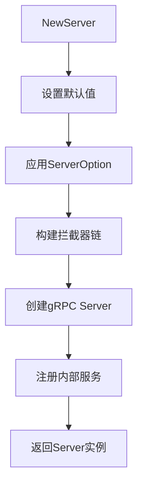

# gRPC传输

<cite>
**本文档引用的文件**
- [server.go](file://transport/grpc/server.go)
- [interceptor.go](file://transport/grpc/interceptor.go)
- [balancer.go](file://transport/grpc/balancer.go)
- [codec.go](file://transport/grpc/codec.go)
- [client.go](file://transport/grpc/client.go)
- [transport.go](file://transport/grpc/transport.go)
- [resolver/direct/builder.go](file://transport/grpc/resolver/direct/builder.go)
- [resolver/direct/resolver.go](file://transport/grpc/resolver/direct/resolver.go)
- [resolver/discovery/builder.go](file://transport/grpc/resolver/discovery/builder.go)
- [resolver/discovery/resolver.go](file://transport/grpc/resolver/discovery/resolver.go)
- [middleware.go](file://middleware/middleware.go)
</cite>

## 目录
1. [引言](#引言)
2. [gRPC服务器初始化与服务注册](#grpc服务器初始化与服务注册)
3. [拦截器链机制](#拦截器链机制)
4. [gRPC编解码器与框架编码系统集成](#grpc编解码器与框架编码系统集成)
5. [客户端负载均衡器](#客户端负载均衡器)
6. [服务发现解析器](#服务发现解析器)
7. [最佳实践示例](#最佳实践示例)
8. [性能优化技巧](#性能优化技巧)
9. [结论](#结论)

## 引言

gRPC作为一种高性能、开源的远程过程调用（RPC）框架，广泛应用于微服务架构中。本技术文档深入探讨了`google.golang.org/grpc`在Kratos框架中的集成实现，重点分析了gRPC服务器的初始化过程、服务注册机制、拦截器链的作用、编解码器与框架编码系统的集成、客户端负载均衡器的工作原理以及服务发现解析器的两种模式。通过详细的代码分析和架构图解，本文旨在为开发者提供全面的技术指导，帮助他们更好地理解和应用gRPC技术。

## gRPC服务器初始化与服务注册

gRPC服务器的初始化过程是整个通信流程的起点。在Kratos框架中，`NewServer`函数负责创建一个gRPC服务器实例。该函数接受一系列`ServerOption`参数，这些参数用于配置服务器的各种属性，如网络类型、地址、超时时间、TLS配置等。



**图解来源**
- [server.go](file://transport/grpc/server.go#L154-L203)

在`NewServer`函数中，首先会设置一些默认值，例如网络类型为"tcp"，地址为":0"，超时时间为1秒。然后，通过遍历传入的`ServerOption`参数，将这些配置应用到服务器实例上。接下来，构建拦截器链，包括一元拦截器和流式拦截器。最后，使用`grpc.NewServer`创建一个gRPC服务器实例，并注册内部服务，如健康检查服务和元数据服务。

服务注册是gRPC服务器的核心功能之一。通过`RegisterGreeterServer`等函数，可以将具体的业务逻辑服务注册到gRPC服务器上。这些服务通常实现了特定的接口，如`GreeterServer`接口，该接口定义了服务的方法，如`SayHello`和`SayHelloStream`。

**本节来源**
- [server.go](file://transport/grpc/server.go#L154-L203)
- [helloworld_grpc.pb.go](file://internal/testdata/helloworld/helloworld_grpc.pb.go#L82-L111)

## 拦截器链机制

拦截器链是gRPC中用于处理请求和响应的强大机制。在Kratos框架中，拦截器链分为一元拦截器和流式拦截器，分别用于处理一元调用和流式调用。

### 一元拦截器

一元拦截器通过`UnaryInterceptor`函数注册，它接受一个或多个`grpc.UnaryServerInterceptor`类型的函数。这些函数会在每个一元调用的处理过程中被调用，可以用于实现日志记录、身份验证、错误处理等功能。

```go
func (s *Server) unaryServerInterceptor() grpc.UnaryServerInterceptor {
    return func(ctx context.Context, req any, info *grpc.UnaryServerInfo, handler grpc.UnaryHandler) (any, error) {
        ctx, cancel := ic.Merge(ctx, s.baseCtx)
        defer cancel()
        md, _ := grpcmd.FromIncomingContext(ctx)
        replyHeader := grpcmd.MD{}
        tr := &Transport{
            operation:   info.FullMethod,
            reqHeader:   headerCarrier(md),
            replyHeader: headerCarrier(replyHeader),
        }
        if s.endpoint != nil {
            tr.endpoint = s.endpoint.String()
        }
        ctx = transport.NewServerContext(ctx, tr)
        if s.timeout > 0 {
            ctx, cancel = context.WithTimeout(ctx, s.timeout)
            defer cancel()
        }
        h := func(ctx context.Context, req any) (any, error) {
            return handler(ctx, req)
        }
        if next := s.middleware.Match(tr.Operation()); len(next) > 0 {
            h = middleware.Chain(next...)(h)
        }
        reply, err := h(ctx, req)
        if len(replyHeader) > 0 {
            _ = grpc.SetHeader(ctx, replyHeader)
        }
        return reply, err
    }
}
```

**本节来源**
- [interceptor.go](file://transport/grpc/interceptor.go#L17-L47)

### 流式拦截器

流式拦截器通过`StreamInterceptor`函数注册，它接受一个或多个`grpc.StreamServerInterceptor`类型的函数。这些函数会在每个流式调用的处理过程中被调用，可以用于实现流式日志记录、流式身份验证、流式错误处理等功能。

```go
func (s *Server) streamServerInterceptor() grpc.StreamServerInterceptor {
    return func(srv any, ss grpc.ServerStream, info *grpc.StreamServerInfo, handler grpc.StreamHandler) error {
        ctx, cancel := ic.Merge(ss.Context(), s.baseCtx)
        defer cancel()
        md, _ := grpcmd.FromIncomingContext(ctx)
        replyHeader := grpcmd.MD{}
        ctx = transport.NewServerContext(ctx, &Transport{
            endpoint:    s.endpoint.String(),
            operation:   info.FullMethod,
            reqHeader:   headerCarrier(md),
            replyHeader: headerCarrier(replyHeader),
        })

        h := func(_ context.Context, _ any) (any, error) {
            return handler(srv, ss), nil
        }

        if next := s.streamMiddleware.Match(info.FullMethod); len(next) > 0 {
            middleware.Chain(next...)(h)
        }

        ctx = context.WithValue(ctx, stream{
            ServerStream:     ss,
            streamMiddleware: s.streamMiddleware,
        }, ss)
        ws := NewWrappedStream(ctx, ss, s.streamMiddleware)

        err := handler(srv, ws)
        if len(replyHeader) > 0 {
            _ = grpc.SetHeader(ctx, replyHeader)
        }
        return err
    }
}
```

**本节来源**
- [interceptor.go](file://transport/grpc/interceptor.go#L70-L102)

## gRPC编解码器与框架编码系统集成

gRPC默认使用Protocol Buffers作为其序列化格式，但Kratos框架通过`codec.go`文件实现了与框架编码系统的集成，支持多种消息格式的序列化与反序列化。

### 编解码器实现

`codec`结构体实现了`encoding.Codec`接口，提供了`Marshal`和`Unmarshal`方法，用于序列化和反序列化数据。在`Marshal`方法中，首先检查传入的数据是否为`proto.Message`类型，如果不是，则返回错误。然后，使用`enc.GetCodec(json.Name).Marshal`方法将数据序列化为JSON格式。

```go
func init() {
    encoding.RegisterCodec(codec{})
}

type codec struct{}

func (codec) Marshal(v any) ([]byte, error) {
    vv, ok := v.(proto.Message)
    if !ok {
        return nil, fmt.Errorf("failed to marshal, message is %T, want proto.Message", v)
    }
    return enc.GetCodec(json.Name).Marshal(vv)
}

func (codec) Unmarshal(data []byte, v any) error {
    vv, ok := v.(proto.Message)
    if !ok {
        return fmt.Errorf("failed to unmarshal, message is %T, want proto.Message", v)
    }
    return enc.GetCodec(json.Name).Unmarshal(data, vv)
}

func (codec) Name() string {
    return json.Name
}
```

**本节来源**
- [codec.go](file://transport/grpc/codec.go#L13-L39)

### 编码系统集成

Kratos框架的编码系统支持多种编码格式，如JSON、XML、YAML等。通过`encoding.RegisterCodec`函数，可以将自定义的编解码器注册到框架中。在`init`函数中，`codec`实例被注册为默认的gRPC编解码器，从而实现了与框架编码系统的无缝集成。

## 客户端负载均衡器

客户端负载均衡器是gRPC中用于分发请求到多个后端服务器的重要组件。在Kratos框架中，`balancer.go`文件实现了基于选择器的负载均衡器。

### 负载均衡器构建

`balancerBuilder`结构体实现了`base.PickerBuilder`接口，用于构建负载均衡器。在`init`函数中，通过`base.NewBalancerBuilder`创建了一个新的负载均衡器构建器，并将其注册到gRPC中。

```go
func init() {
    b := base.NewBalancerBuilder(
        balancerName,
        &balancerBuilder{
            builder: selector.GlobalSelector(),
        },
        base.Config{HealthCheck: true},
    )
    balancer.Register(b)
}
```

**本节来源**
- [balancer.go](file://transport/grpc/balancer.go#L22-L31)

### 负载均衡策略

`balancerPicker`结构体实现了`balancer.Picker`接口，用于选择一个后端服务器来处理请求。在`Pick`方法中，首先从上下文中获取节点过滤器，然后使用选择器选择一个合适的节点。

```go
func (p *balancerPicker) Pick(info balancer.PickInfo) (balancer.PickResult, error) {
    var filters []selector.NodeFilter
    if tr, ok := transport.FromClientContext(info.Ctx); ok {
        if gtr, ok := tr.(*Transport); ok {
            filters = gtr.NodeFilters()
        }
    }

    n, done, err := p.selector.Select(info.Ctx, selector.WithNodeFilter(filters...))
    if err != nil {
        return balancer.PickResult{}, err
    }

    return balancer.PickResult{
        SubConn: n.(*grpcNode).subConn,
        Done: func(di balancer.DoneInfo) {
            done(info.Ctx, selector.DoneInfo{
                Err:           di.Err,
                BytesSent:     di.BytesSent,
                BytesReceived: di.BytesReceived,
                ReplyMD:       Trailer(di.Trailer),
            })
        },
    }, nil
}
```

**本节来源**
- [balancer.go](file://transport/grpc/balancer.go#L63-L88)

## 服务发现解析器

服务发现解析器是gRPC中用于解析服务地址的重要组件。在Kratos框架中，提供了两种模式的服务发现解析器：直连模式和基于注册中心的发现模式。

### 直连模式

直连模式通过`direct`包实现，允许客户端直接连接到指定的服务器地址。`directBuilder`结构体实现了`resolver.Builder`接口，用于构建直连解析器。

```go
func NewBuilder() resolver.Builder {
    return &directBuilder{}
}

func (d *directBuilder) Build(target resolver.Target, cc resolver.ClientConn, _ resolver.BuildOptions) (resolver.Resolver, error) {
    addrs := make([]resolver.Address, 0)
    for _, addr := range strings.Split(strings.TrimPrefix(target.URL.Path, "/"), ",") {
        addrs = append(addrs, resolver.Address{Addr: addr})
    }
    err := cc.UpdateState(resolver.State{
        Addresses: addrs,
    })
    if err != nil {
        return nil, err
    }
    return newDirectResolver(), nil
}
```

**本节来源**
- [builder.go](file://transport/grpc/resolver/direct/builder.go#L21-L42)

### 基于注册中心的发现模式

基于注册中心的发现模式通过`discovery`包实现，允许客户端通过注册中心动态发现服务实例。`discoveryBuilder`结构体实现了`resolver.Builder`接口，用于构建基于注册中心的解析器。

```go
func NewBuilder(d registry.Discovery, opts ...Option) resolver.Builder {
    b := &builder{
        discoverer: d,
        timeout:    time.Second * 10,
        insecure:   false,
        debugLog:   true,
        subsetSize: 25,
    }
    for _, o := range opts {
        o(b)
    }
    return b
}

func (b *builder) Build(target resolver.Target, cc resolver.ClientConn, _ resolver.BuildOptions) (resolver.Resolver, error) {
    watchRes := &struct {
        err error
        w   registry.Watcher
    }{}
    done := make(chan struct{}, 1)
    ctx, cancel := context.WithCancel(context.Background())
    go func() {
        w, err := b.discoverer.Watch(ctx, strings.TrimPrefix(target.URL.Path, "/"))
        watchRes.w = w
        watchRes.err = err
        close(done)
    }()

    var err error
    if b.timeout > 0 {
        select {
        case <-done:
            err = watchRes.err
        case <-time.After(b.timeout):
            err = ErrWatcherCreateTimeout
        }
    } else {
        <-done
        err = watchRes.err
    }
    if err != nil {
        cancel()
        return nil, err
    }

    r := &discoveryResolver{
        w:           watchRes.w,
        cc:          cc,
        ctx:         ctx,
        cancel:      cancel,
        insecure:    b.insecure,
        debugLog:    b.debugLog,
        subsetSize:  b.subsetSize,
        selectorKey: uuid.New().String(),
    }
    go r.watch()
    return r, nil
}
```

**本节来源**
- [builder.go](file://transport/grpc/resolver/discovery/builder.go#L67-L125)

## 最佳实践示例

### 服务定义

在定义gRPC服务时，应遵循以下最佳实践：

1. **使用Protocol Buffers**：使用`.proto`文件定义服务接口和消息类型，确保跨语言兼容性。
2. **版本控制**：为服务接口和消息类型添加版本号，以便在未来进行非破坏性更新。
3. **文档注释**：为服务接口和消息类型添加详细的文档注释，方便其他开发者理解和使用。

### 启动配置

在启动gRPC服务器时，应遵循以下最佳实践：

1. **配置超时时间**：设置合理的超时时间，避免长时间等待导致资源浪费。
2. **启用TLS**：在生产环境中启用TLS加密，确保通信安全。
3. **注册健康检查服务**：注册健康检查服务，便于监控和管理。

### 客户端调用

在客户端调用gRPC服务时，应遵循以下最佳实践：

1. **使用连接池**：使用连接池复用连接，减少连接建立的开销。
2. **设置超时时间**：为每个调用设置合理的超时时间，避免阻塞。
3. **处理错误**：正确处理调用过程中可能出现的错误，如网络错误、服务不可用等。

## 性能优化技巧

### 连接复用

连接复用是提高gRPC性能的关键。通过复用已建立的连接，可以显著减少连接建立的开销。在Kratos框架中，可以通过`Dial`函数的`grpc.WithBlock`选项来实现连接复用。

### 流式调用处理

流式调用可以有效减少网络延迟，提高数据传输效率。在处理流式调用时，应注意以下几点：

1. **合理设置缓冲区大小**：根据实际需求设置合适的缓冲区大小，避免内存溢出。
2. **及时关闭流**：在流式调用完成后，及时关闭流，释放资源。

### 元数据传递

元数据传递可以用于传递额外的信息，如认证信息、跟踪ID等。在Kratos框架中，可以通过`transport.NewClientContext`函数将元数据附加到请求上下文中。

```go
ctx = transport.NewClientContext(ctx, &Transport{
    endpoint:    cc.Target(),
    operation:   method,
    reqHeader:   headerCarrier{},
    nodeFilters: filters,
})
```

**本节来源**
- [client.go](file://transport/grpc/client.go#L219-L224)

## 结论

本文详细介绍了gRPC在Kratos框架中的集成实现，涵盖了gRPC服务器的初始化过程、服务注册机制、拦截器链的作用、编解码器与框架编码系统的集成、客户端负载均衡器的工作原理以及服务发现解析器的两种模式。通过这些技术细节的分析，开发者可以更好地理解和应用gRPC技术，构建高性能、高可用的微服务系统。未来，随着gRPC技术的不断发展，我们可以期待更多创新的应用场景和优化方案。