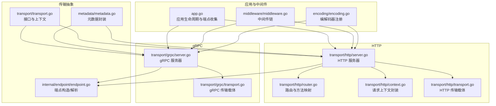
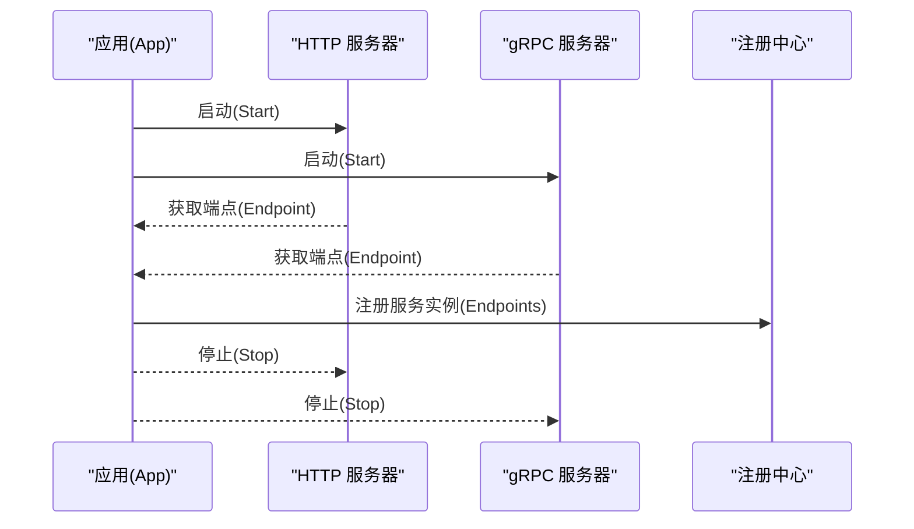
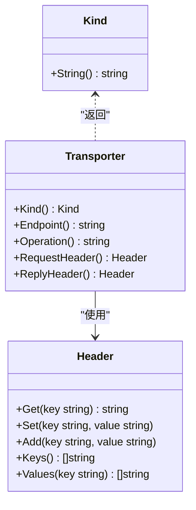
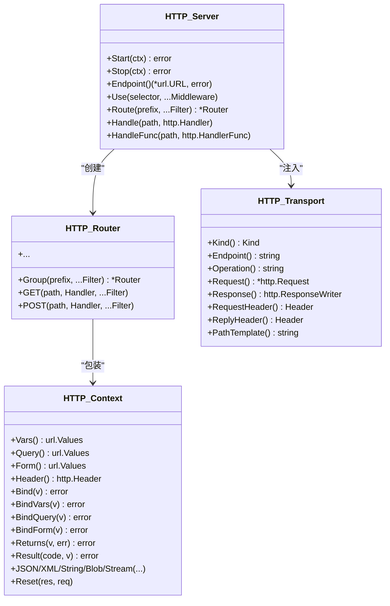
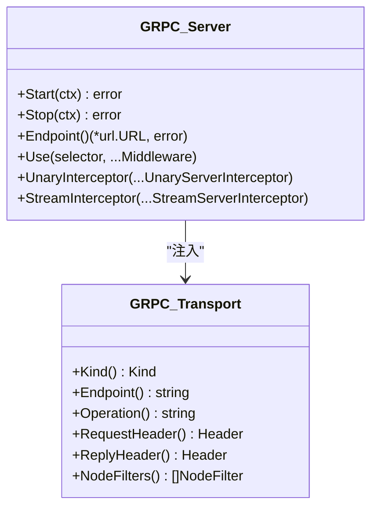
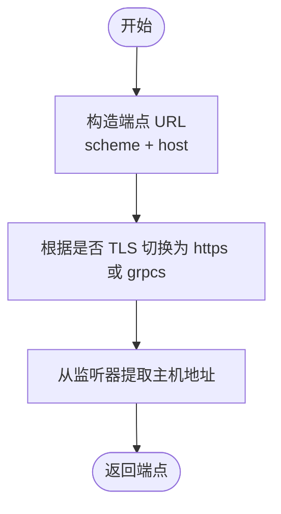
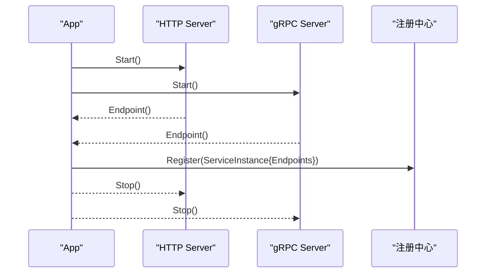
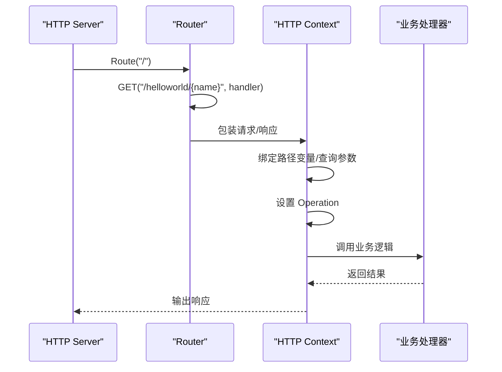
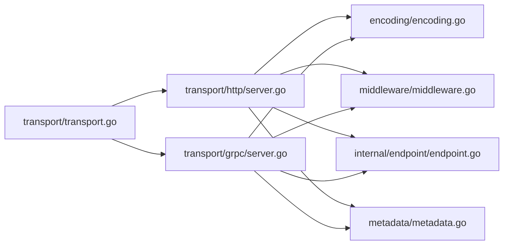

# 传输层

<cite>
**本文引用的文件**
- [transport/transport.go](file://transport/transport.go)
- [transport/http/server.go](file://transport/http/server.go)
- [transport/http/transport.go](file://transport/http/transport.go)
- [transport/http/router.go](file://transport/http/router.go)
- [transport/http/context.go](file://transport/http/context.go)
- [transport/grpc/server.go](file://transport/grpc/server.go)
- [transport/grpc/transport.go](file://transport/grpc/transport.go)
- [internal/endpoint/endpoint.go](file://internal/endpoint/endpoint.go)
- [metadata/metadata.go](file://metadata/metadata.go)
- [app.go](file://app.go)
- [middleware/middleware.go](file://middleware/middleware.go)
- [encoding/encoding.go](file://encoding/encoding.go)
- [internal/testdata/helloworld/helloworld_http.pb.go](file://internal/testdata/helloworld/helloworld_http.pb.go)
- [internal/testdata/helloworld/helloworld_grpc.pb.go](file://internal/testdata/helloworld/helloworld_grpc.pb.go)
</cite>

## 目录
1. [简介](#简介)
2. [项目结构](#项目结构)
3. [核心组件](#核心组件)
4. [架构总览](#架构总览)
5. [详细组件分析](#详细组件分析)
6. [依赖关系分析](#依赖关系分析)
7. [性能考量](#性能考量)
8. [故障排查指南](#故障排查指南)
9. [结论](#结论)
10. [附录](#附录)

## 简介
本章节阐述 Kratos 框架的传输层设计与实现，重点围绕 Transport 接口如何抽象不同通信协议（HTTP 与 gRPC），并解释 Endpoint、Endpoint 返回的元数据信息、Header 抽象、以及如何在同一个服务中同时暴露 HTTP 和 gRPC 接口。文档还提供对比 HTTP 与 gRPC 的实现差异、协议选择的权衡因素，并给出如何定义与注册 HTTP 路由及 gRPC 服务的示例路径。

## 项目结构
传输层相关代码主要分布在以下模块：
- transport：统一的传输抽象接口与上下文工具
- transport/http：HTTP 服务器、路由、上下文封装、传输载体
- transport/grpc：gRPC 服务器、拦截器、传输载体
- internal/endpoint：端点 URL 构造与解析
- metadata：跨传输的元数据封装
- app：应用生命周期管理，负责启动/停止多个传输服务器并收集端点
- middleware：中间件链式组合
- encoding：编解码器注册与选择

图表来源
- [transport/transport.go](file://transport/transport.go#L1-L96)
- [transport/http/server.go](file://transport/http/server.go#L1-L375)
- [transport/http/router.go](file://transport/http/router.go#L1-L102)
- [transport/http/context.go](file://transport/http/context.go#L1-L188)
- [transport/http/transport.go](file://transport/http/transport.go#L1-L152)
- [transport/grpc/server.go](file://transport/grpc/server.go#L1-L278)
- [transport/grpc/transport.go](file://transport/grpc/transport.go#L1-L85)
- [internal/endpoint/endpoint.go](file://internal/endpoint/endpoint.go#L1-L35)
- [metadata/metadata.go](file://metadata/metadata.go#L1-L126)
- [app.go](file://app.go#L1-L213)
- [middleware/middleware.go](file://middleware/middleware.go#L1-L22)
- [encoding/encoding.go](file://encoding/encoding.go#L1-L42)

章节来源
- [transport/transport.go](file://transport/transport.go#L1-L96)
- [transport/http/server.go](file://transport/http/server.go#L1-L375)
- [transport/grpc/server.go](file://transport/grpc/server.go#L1-L278)
- [internal/endpoint/endpoint.go](file://internal/endpoint/endpoint.go#L1-L35)
- [metadata/metadata.go](file://metadata/metadata.go#L1-L126)
- [app.go](file://app.go#L1-L213)
- [middleware/middleware.go](file://middleware/middleware.go#L1-L22)
- [encoding/encoding.go](file://encoding/encoding.go#L1-L42)

## 核心组件
- Transport 接口：统一抽象传输类型、端点、操作名、请求/响应头等能力，提供服务端与客户端上下文注入与提取。
- HTTP Server：基于 net/http，提供路由注册、过滤器、中间件、超时控制、TLS 支持、端点生成等。
- gRPC Server：基于 google.golang.org/grpc，提供拦截器链、健康检查、反射、Admin、TLS、端点生成等。
- Endpoint：统一的端点 URL 构造与解析，支持 http/https、grpc/grpcs 等方案。
- Header：统一的头部读写接口，分别适配 http.Header 与 metadata.MD。
- Context：HTTP 请求上下文封装，提供参数绑定、响应输出、中间件选择等。
- 编解码器：注册与选择内容编解码器，用于请求/响应序列化。

章节来源
- [transport/transport.go](file://transport/transport.go#L1-L96)
- [transport/http/server.go](file://transport/http/server.go#L1-L375)
- [transport/grpc/server.go](file://transport/grpc/server.go#L1-L278)
- [internal/endpoint/endpoint.go](file://internal/endpoint/endpoint.go#L1-L35)
- [transport/http/context.go](file://transport/http/context.go#L1-L188)
- [encoding/encoding.go](file://encoding/encoding.go#L1-L42)

## 架构总览
传输层通过 Transport 接口抽象 HTTP 与 gRPC，二者均实现 Server、Endpointer、Transporter 等能力。应用层通过 App 统一启动多个传输服务器，并从每个 Endpointer 收集端点，形成服务实例的 Endpoints 列表，供注册中心使用。

图表来源
- [app.go](file://app.go#L153-L213)
- [transport/http/server.go](file://transport/http/server.go#L310-L375)
- [transport/grpc/server.go](file://transport/grpc/server.go#L214-L278)

章节来源
- [app.go](file://app.go#L153-L213)
- [transport/http/server.go](file://transport/http/server.go#L310-L375)
- [transport/grpc/server.go](file://transport/grpc/server.go#L214-L278)

## 详细组件分析

### Transport 接口与上下文
- Transporter：定义 Kind、Endpoint、Operation、RequestHeader、ReplyHeader 等，统一 HTTP 与 gRPC 的传输上下文。
- Header：统一的头部读写接口，分别由 http.Header 与 metadata.MD 实现。
- 上下文工具：NewServerContext/FromServerContext、NewClientContext/FromClientContext，用于在请求上下文中携带 Transporter。

图表来源
- [transport/transport.go](file://transport/transport.go#L1-L96)

章节来源
- [transport/transport.go](file://transport/transport.go#L1-L96)

### HTTP 传输实现
- Server：封装 http.Server，支持网络、地址、端点、超时、TLS、中间件、过滤器、严格斜杠、监听器、子路由前缀等选项。
- Router：提供按方法注册路由的能力，内部使用 gorilla/mux，支持分组与过滤器链。
- Context：封装 http 请求/响应，提供参数绑定（路径变量、查询、表单）、中间件选择、结果输出（JSON/XML/String/Blob/Stream）。
- Transport：实现 Transporter，封装 http 请求/响应、请求/响应头、路径模板、操作名等。

图表来源
- [transport/http/server.go](file://transport/http/server.go#L1-L375)
- [transport/http/router.go](file://transport/http/router.go#L1-L102)
- [transport/http/context.go](file://transport/http/context.go#L1-L188)
- [transport/http/transport.go](file://transport/http/transport.go#L1-L152)

章节来源
- [transport/http/server.go](file://transport/http/server.go#L1-L375)
- [transport/http/router.go](file://transport/http/router.go#L1-L102)
- [transport/http/context.go](file://transport/http/context.go#L1-L188)
- [transport/http/transport.go](file://transport/http/transport.go#L1-L152)

### gRPC 传输实现
- Server：封装 grpc.Server，支持网络、地址、端点、超时、TLS、中间件、流式中间件、自定义健康检查、反射、Admin、拦截器链等。
- Transport：实现 Transporter，封装 metadata.MD 请求/响应头、节点过滤器等。

图表来源
- [transport/grpc/server.go](file://transport/grpc/server.go#L1-L278)
- [transport/grpc/transport.go](file://transport/grpc/transport.go#L1-L85)

章节来源
- [transport/grpc/server.go](file://transport/grpc/server.go#L1-L278)
- [transport/grpc/transport.go](file://transport/grpc/transport.go#L1-L85)

### 端点与元数据
- Endpoint：统一构造 http/https、grpc/grpcs 端点 URL，支持从监听地址提取主机信息。
- 元数据：Metadata 提供键值对存储与遍历，支持服务端/客户端上下文传递。

图表来源
- [internal/endpoint/endpoint.go](file://internal/endpoint/endpoint.go#L1-L35)
- [transport/http/server.go](file://transport/http/server.go#L356-L375)
- [transport/grpc/server.go](file://transport/grpc/server.go#L259-L278)

章节来源
- [internal/endpoint/endpoint.go](file://internal/endpoint/endpoint.go#L1-L35)
- [transport/http/server.go](file://transport/http/server.go#L356-L375)
- [transport/grpc/server.go](file://transport/grpc/server.go#L259-L278)
- [metadata/metadata.go](file://metadata/metadata.go#L1-L126)

### 多传输协议共存
- 应用层通过 App 同时启动多个 Server（HTTP、gRPC 等），并在启动后从每个 Endpointer 收集端点，形成服务实例的 Endpoints 列表。
- 这样一个服务即可同时暴露 HTTP 与 gRPC 接口，便于客户端按需选择。

图表来源
- [app.go](file://app.go#L153-L213)
- [transport/http/server.go](file://transport/http/server.go#L310-L375)
- [transport/grpc/server.go](file://transport/grpc/server.go#L214-L278)

章节来源
- [app.go](file://app.go#L153-L213)

### 定义与注册 HTTP 路由与 gRPC 服务
- HTTP：通过 Server.Route 创建 Router，使用 GET/POST 等方法注册路由，内部绑定参数、设置 Operation、应用中间件、返回结果。
- gRPC：通过生成的注册函数注册服务，客户端通过 FullMethod 调用。

图表来源
- [transport/http/server.go](file://transport/http/server.go#L243-L262)
- [transport/http/router.go](file://transport/http/router.go#L44-L102)
- [transport/http/context.go](file://transport/http/context.go#L94-L114)
- [internal/testdata/helloworld/helloworld_http.pb.go](file://internal/testdata/helloworld/helloworld_http.pb.go#L26-L51)

章节来源
- [transport/http/server.go](file://transport/http/server.go#L243-L262)
- [transport/http/router.go](file://transport/http/router.go#L44-L102)
- [transport/http/context.go](file://transport/http/context.go#L94-L114)
- [internal/testdata/helloworld/helloworld_http.pb.go](file://internal/testdata/helloworld/helloworld_http.pb.go#L26-L51)
- [internal/testdata/helloworld/helloworld_grpc.pb.go](file://internal/testdata/helloworld/helloworld_grpc.pb.go#L109-L112)

## 依赖关系分析
- 传输抽象与具体实现：transport/transport.go 定义接口，http/grpc 分别实现 Server、Endpointer、Transporter。
- 中间件：middleware/middleware.go 提供链式组合，HTTP/gRPC 服务器均支持中间件与过滤器。
- 编解码器：encoding/encoding.go 提供编解码器注册与选择，HTTP 服务器默认注册多种编码器。
- 端点与元数据：internal/endpoint/endpoint.go 提供端点构造/解析；metadata/metadata.go 提供跨传输元数据封装。

图表来源
- [transport/transport.go](file://transport/transport.go#L1-L96)
- [transport/http/server.go](file://transport/http/server.go#L1-L375)
- [transport/grpc/server.go](file://transport/grpc/server.go#L1-L278)
- [encoding/encoding.go](file://encoding/encoding.go#L1-L42)
- [middleware/middleware.go](file://middleware/middleware.go#L1-L22)
- [internal/endpoint/endpoint.go](file://internal/endpoint/endpoint.go#L1-L35)
- [metadata/metadata.go](file://metadata/metadata.go#L1-L126)

章节来源
- [transport/transport.go](file://transport/transport.go#L1-L96)
- [transport/http/server.go](file://transport/http/server.go#L1-L375)
- [transport/grpc/server.go](file://transport/grpc/server.go#L1-L278)
- [encoding/encoding.go](file://encoding/encoding.go#L1-L42)
- [middleware/middleware.go](file://middleware/middleware.go#L1-L22)
- [internal/endpoint/endpoint.go](file://internal/endpoint/endpoint.go#L1-L35)
- [metadata/metadata.go](file://metadata/metadata.go#L1-L126)

## 性能考量
- 协议选择
  - gRPC：基于二进制协议，具备更高效的序列化与传输开销，适合高并发、低延迟场景；内置拦截器链、健康检查、反射与 Admin，便于可观测与运维。
  - HTTP：基于文本协议，易调试、跨语言生态丰富；适合 Web 场景、浏览器直连或网关代理。
- 中间件与过滤器：HTTP 与 gRPC 均支持中间件链，合理选择匹配规则可减少不必要的中间件执行。
- 编解码器：HTTP 服务器默认注册多种编码器，可根据业务选择合适的编解码器以优化序列化性能。
- 端点与 TLS：HTTP/HTTPS 与 gRPC/GRPCS 的端点切换与 TLS 配置会影响连接建立成本与安全性。

[本节为通用性能讨论，不直接分析具体文件]

## 故障排查指南
- 端点为空或解析失败
  - 检查监听器是否成功创建与端点提取逻辑。
  - 参考路径：[transport/http/server.go](file://transport/http/server.go#L356-L375)、[transport/grpc/server.go](file://transport/grpc/server.go#L259-L278)、[internal/endpoint/endpoint.go](file://internal/endpoint/endpoint.go#L1-L35)
- 中间件未生效
  - 确认中间件选择器与 Operation/路径匹配是否正确。
  - 参考路径：[transport/http/server.go](file://transport/http/server.go#L206-L214)、[transport/grpc/server.go](file://transport/grpc/server.go#L205-L213)
- HTTP 参数绑定失败
  - 检查绑定函数(decVars/decQuery/decBody)与请求体格式。
  - 参考路径：[transport/http/context.go](file://transport/http/context.go#L94-L114)
- gRPC 响应头设置无效
  - 确认 ReplyHeader 在服务端上下文中设置且客户端可见。
  - 参考路径：[transport/grpc/server.go](file://transport/grpc/server.go#L34-L41)、[transport/grpc/transport.go](file://transport/grpc/transport.go#L36-L44)

章节来源
- [transport/http/server.go](file://transport/http/server.go#L356-L375)
- [transport/grpc/server.go](file://transport/grpc/server.go#L259-L278)
- [internal/endpoint/endpoint.go](file://internal/endpoint/endpoint.go#L1-L35)
- [transport/http/context.go](file://transport/http/context.go#L94-L114)
- [transport/grpc/transport.go](file://transport/grpc/transport.go#L36-L44)

## 结论
Kratos 的传输层通过 Transport 接口实现了 HTTP 与 gRPC 的统一抽象，结合中间件、编解码器、端点与元数据机制，既保证了协议间的可替换性，又提供了灵活的扩展能力。应用层可同时启用多种传输协议，满足不同客户端与部署场景的需求。在实际选型中，应综合考虑性能、易用性与跨语言支持等因素。

[本节为总结性内容，不直接分析具体文件]

## 附录
- 示例路径参考
  - 定义与注册 HTTP 路由：[internal/testdata/helloworld/helloworld_http.pb.go](file://internal/testdata/helloworld/helloworld_http.pb.go#L26-L51)
  - 注册 gRPC 服务：[internal/testdata/helloworld/helloworld_grpc.pb.go](file://internal/testdata/helloworld/helloworld_grpc.pb.go#L109-L112)
  - 应用启动与端点收集：[app.go](file://app.go#L153-L213)