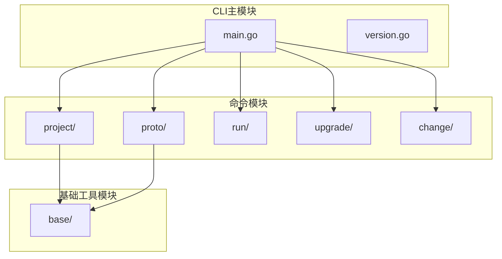
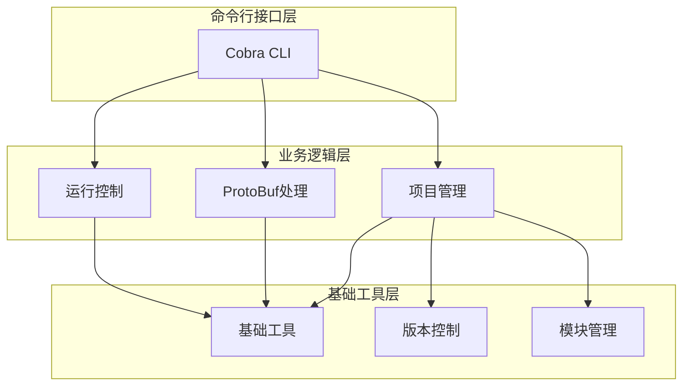
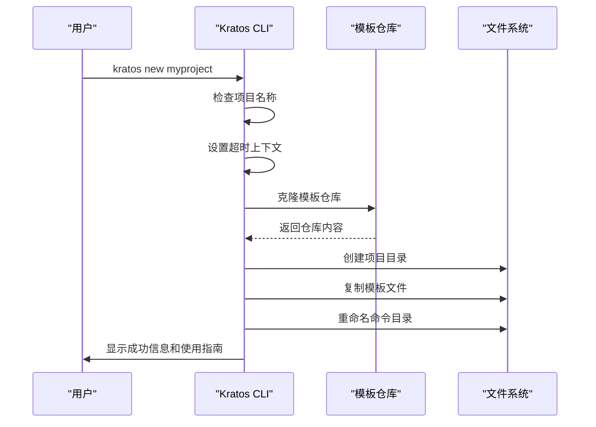
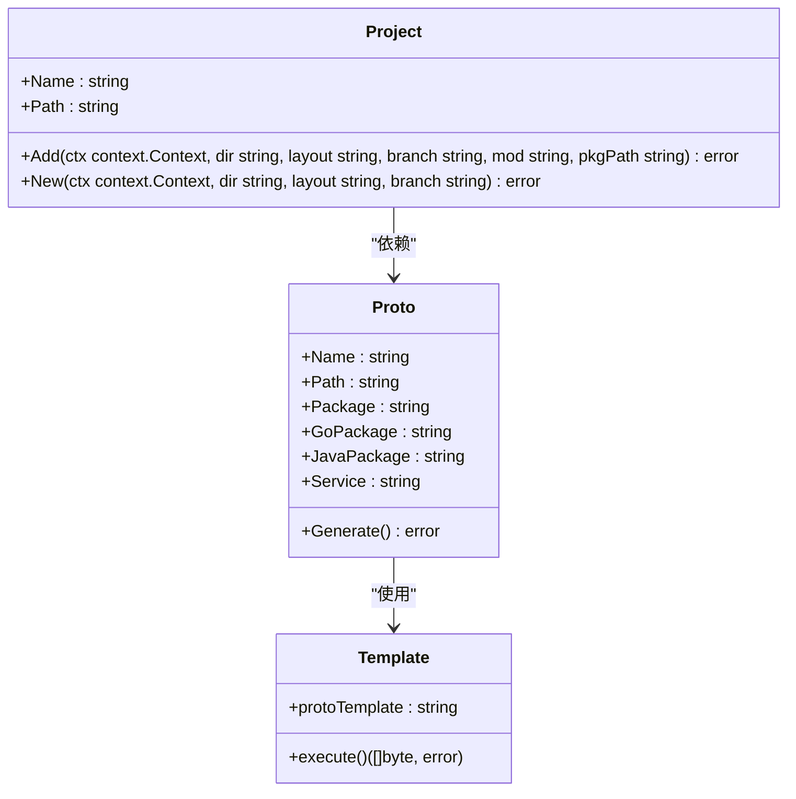
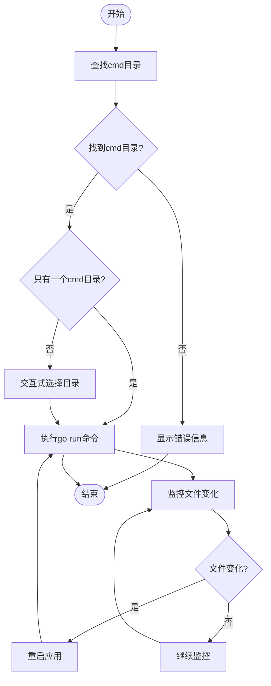
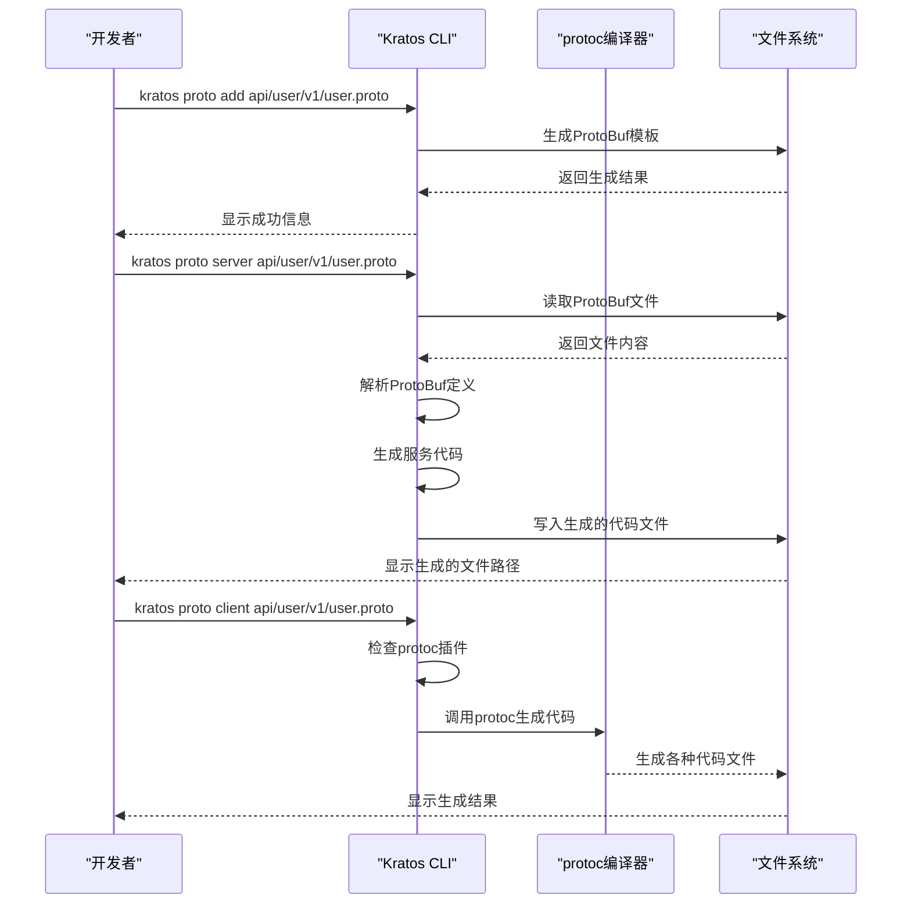
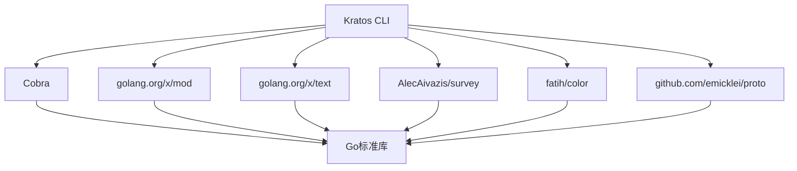

# CLI工具

<cite>
**本文档中引用的文件**  
- [main.go](file://cmd/kratos/main.go)
- [new.go](file://cmd/kratos/internal/project/new.go)
- [add.go](file://cmd/kratos/internal/project/add.go)
- [run.go](file://cmd/kratos/internal/run/run.go)
- [project.go](file://cmd/kratos/internal/project/project.go)
- [proto.go](file://cmd/kratos/internal/proto/proto.go)
- [add.go](file://cmd/kratos/internal/proto/add/add.go)
- [server.go](file://cmd/kratos/internal/proto/server/server.go)
- [client.go](file://cmd/kratos/internal/proto/client/client.go)
- [template.go](file://cmd/kratos/internal/proto/add/template.go)
- [server/template.go](file://cmd/kratos/internal/proto/server/template.go)
- [mod.go](file://cmd/kratos/internal/base/mod.go)
- [version.go](file://cmd/kratos/version.go)
</cite>

## 目录
1. [简介](#简介)
2. [项目结构](#项目结构)
3. [核心组件](#核心组件)
4. [架构概述](#架构概述)
5. [详细组件分析](#详细组件分析)
6. [依赖分析](#依赖分析)
7. [性能考虑](#性能考虑)
8. [故障排除指南](#故障排除指南)
9. [结论](#结论)

## 简介
Kratos CLI工具是一个优雅的Go微服务工具包，旨在简化微服务项目的创建、管理和开发流程。该工具提供了`kratos new`、`kratos add`、`kratos run`等命令，帮助开发者快速初始化项目、添加服务接口并启动应用。通过集成ProtoBuf模板生成和代码骨架自动生成功能，Kratos显著提升了开发效率。本文档详细介绍了CLI工具的使用方法、命令参数、工作流程以及内部实现机制。

## 项目结构
Kratos CLI工具的代码结构遵循清晰的模块化设计，主要分为命令行接口、项目管理、ProtoBuf处理和基础工具等模块。工具的核心功能通过Cobra库实现命令行解析，各功能模块独立封装，便于维护和扩展。

**图示来源**  
- [main.go](file://cmd/kratos/main.go#L1-L38)
- [project.go](file://cmd/kratos/internal/project/project.go#L1-L151)

**本节来源**  
- [main.go](file://cmd/kratos/main.go#L1-L38)
- [project.go](file://cmd/kratos/internal/project/project.go#L1-L151)

## 核心组件
Kratos CLI工具的核心组件包括项目创建、服务添加、应用运行和ProtoBuf代码生成等模块。这些组件协同工作，为开发者提供完整的微服务开发体验。`kratos new`命令负责初始化项目结构，`kratos add`命令用于添加新的服务或API接口，`kratos run`命令支持应用启动和热重载，而ProtoBuf相关命令则实现了接口定义和代码骨架的自动生成。

**本节来源**  
- [main.go](file://cmd/kratos/main.go#L1-L38)
- [project.go](file://cmd/kratos/internal/project/project.go#L1-L151)
- [run.go](file://cmd/kratos/internal/run/run.go#L1-L146)

## 架构概述
Kratos CLI工具采用分层架构设计，上层为命令行接口，中层为业务逻辑处理，底层为基础工具支持。这种架构确保了各功能模块的独立性和可维护性，同时提供了良好的扩展性。

**图示来源**  
- [main.go](file://cmd/kratos/main.go#L1-L38)
- [project.go](file://cmd/kratos/internal/project/project.go#L1-L151)
- [run.go](file://cmd/kratos/internal/run/run.go#L1-L146)

## 详细组件分析

### kratos new 命令分析
`kratos new`命令是项目初始化的核心功能，负责创建新的微服务项目。该命令通过远程模板仓库克隆项目结构，自动配置基础文件，并提供交互式参数输入。

**图示来源**  
- [project.go](file://cmd/kratos/internal/project/project.go#L19-L151)
- [new.go](file://cmd/kratos/internal/project/new.go#L21-L65)

**本节来源**  
- [project.go](file://cmd/kratos/internal/project/project.go#L19-L151)
- [new.go](file://cmd/kratos/internal/project/new.go#L21-L65)

### kratos add 命令分析
`kratos add`命令用于向现有项目添加新的服务或API接口。该命令自动生成ProtoBuf定义文件和相应的Go代码骨架，简化了服务开发的初始设置。

**图示来源**  
- [add.go](file://cmd/kratos/internal/proto/add/add.go#L1-L87)
- [template.go](file://cmd/kratos/internal/proto/add/template.go#L1-L53)
- [project.go](file://cmd/kratos/internal/project/project.go#L1-L151)

**本节来源**  
- [add.go](file://cmd/kratos/internal/proto/add/add.go#L1-L87)
- [template.go](file://cmd/kratos/internal/proto/add/template.go#L1-L53)

### kratos run 命令分析
`kratos run`命令负责启动和运行Kratos应用，支持热重载功能，提高了开发效率。该命令自动查找项目中的命令目录，并执行相应的Go运行命令。

**图示来源**  
- [run.go](file://cmd/kratos/internal/run/run.go#L1-L146)
- [findCMD](file://cmd/kratos/internal/run/run.go#L90-L138)

**本节来源**  
- [run.go](file://cmd/kratos/internal/run/run.go#L1-L146)

### ProtoBuf代码生成分析
Kratos提供了完整的ProtoBuf代码生成工具链，包括`kratos proto add`、`kratos proto server`和`kratos proto client`等命令，实现了从ProtoBuf定义到Go代码的完整转换。

**图示来源**  
- [proto.go](file://cmd/kratos/internal/proto/proto.go#L1-L25)
- [add.go](file://cmd/kratos/internal/proto/add/add.go#L1-L87)
- [server.go](file://cmd/kratos/internal/proto/server/server.go#L1-L121)
- [client.go](file://cmd/kratos/internal/proto/client/client.go#L1-L131)

**本节来源**  
- [proto.go](file://cmd/kratos/internal/proto/proto.go#L1-L25)
- [add.go](file://cmd/kratos/internal/proto/add/add.go#L1-L87)
- [server.go](file://cmd/kratos/internal/proto/server/server.go#L1-L121)

## 依赖分析
Kratos CLI工具的依赖关系清晰，各模块之间耦合度低，便于维护和扩展。工具主要依赖Cobra库实现命令行解析，使用golang.org/x/mod处理Go模块，以及golang.org/x/text进行文本处理。

**图示来源**  
- [go.mod](file://cmd/kratos/go.mod)
- [main.go](file://cmd/kratos/main.go#L6-L12)

**本节来源**  
- [go.mod](file://cmd/kratos/go.mod)
- [main.go](file://cmd/kratos/main.go#L6-L12)

## 性能考虑
Kratos CLI工具在设计时考虑了性能因素，通过并发处理、缓存机制和资源优化等手段确保了良好的执行效率。工具使用上下文超时机制防止命令执行无限期挂起，同时通过合理的错误处理确保了稳定性。

## 故障排除指南
当使用Kratos CLI工具遇到问题时，可以参考以下常见问题的解决方案：

**本节来源**  
- [run.go](file://cmd/kratos/internal/run/run.go#L34-L49)
- [client.go](file://cmd/kratos/internal/proto/client/client.go#L42-L51)

## 结论
Kratos CLI工具通过精心设计的命令体系和模块化架构，为Go微服务开发提供了完整的解决方案。工具的`kratos new`、`kratos add`和`kratos run`等命令极大地简化了项目初始化、服务添加和应用运行的流程。通过集成ProtoBuf代码生成功能，Kratos实现了从接口定义到代码实现的自动化，显著提升了开发效率。该工具的设计体现了良好的软件工程实践，具有高内聚、低耦合的特点，为微服务开发提供了可靠的支持。