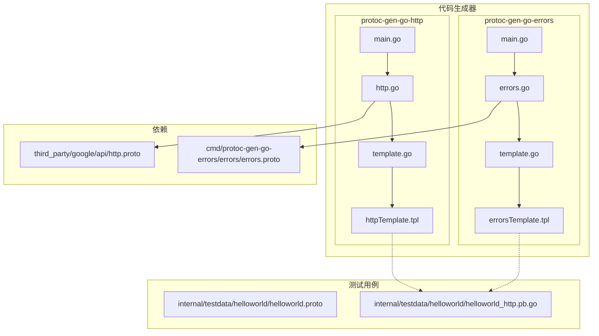
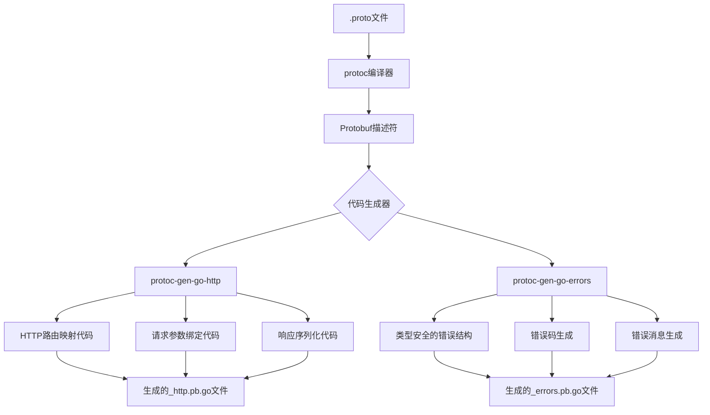
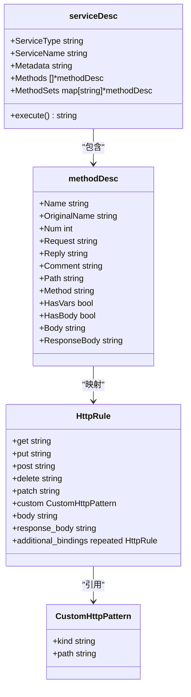
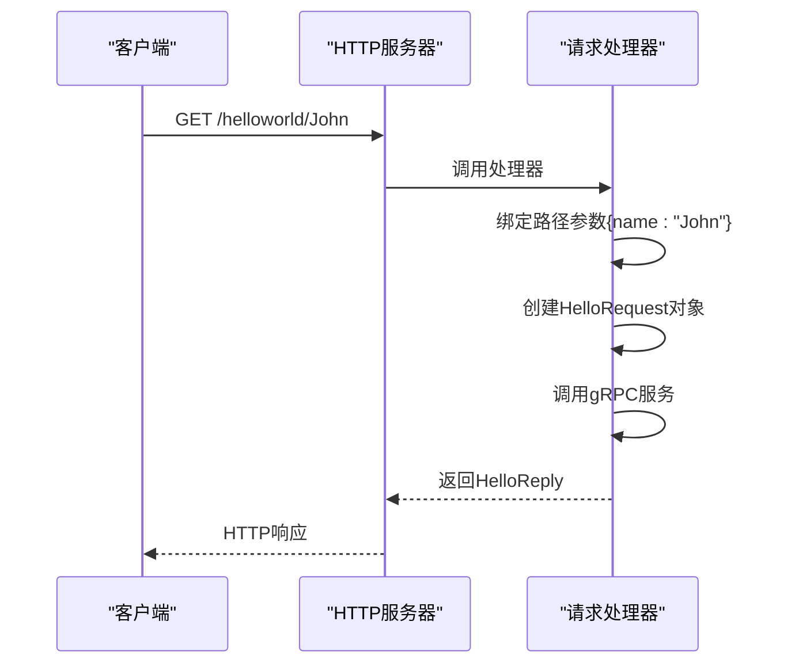
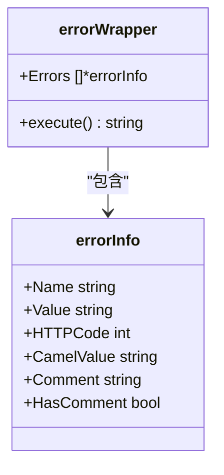
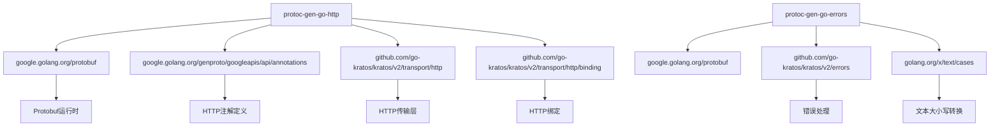

# 代码生成器

<cite>
**本文档中引用的文件**   
- [main.go](file://cmd/protoc-gen-go-http/main.go)
- [http.go](file://cmd/protoc-gen-go-http/http.go)
- [template.go](file://cmd/protoc-gen-go-http/template.go)
- [httpTemplate.tpl](file://cmd/protoc-gen-go-http/httpTemplate.tpl)
- [main.go](file://cmd/protoc-gen-go-errors/main.go)
- [errors.go](file://cmd/protoc-gen-go-errors/errors.go)
- [template.go](file://cmd/protoc-gen-go-errors/template.go)
- [errorsTemplate.tpl](file://cmd/protoc-gen-go-errors/errorsTemplate.tpl)
- [errors.proto](file://cmd/protoc-gen-go-errors/errors/errors.proto)
- [helloworld.proto](file://internal/testdata/helloworld/helloworld.proto)
- [http.proto](file://third_party/google/api/http.proto)
- [helloworld_http.pb.go](file://internal/testdata/helloworld/helloworld_http.pb.go)
- [metadata_http.pb.go](file://api/metadata/metadata_http.pb.go)
</cite>

## 目录
1. [引言](#引言)
2. [项目结构](#项目结构)
3. [核心组件](#核心组件)
4. [架构概述](#架构概述)
5. [详细组件分析](#详细组件分析)
6. [依赖分析](#依赖分析)
7. [性能考虑](#性能考虑)
8. [故障排除指南](#故障排除指南)
9. [结论](#结论)

## 引言
本文档深入讲解基于Protobuf的代码生成器工作原理和使用方法，重点分析protoc-gen-go-http和protoc-gen-go-errors两个代码生成插件。文档详细说明了protoc-gen-go-http如何解析.proto文件中的google.api.http注解，并自动生成HTTP路由映射、请求参数绑定和响应序列化代码；解释了protoc-gen-go-errors如何将.proto中的错误定义转换为类型安全的Go错误结构，包括错误码、消息和元数据的生成。通过完整的示例展示了从编写.proto文件到执行protoc命令的工作流程，以及生成代码的结构和调用方式。同时分析了代码生成模板的设计原理和可扩展性。

## 项目结构
Kratos项目的代码生成器主要位于cmd目录下，包含两个核心的protoc插件：protoc-gen-go-http和protoc-gen-go-errors。这些插件通过解析.proto文件中的特定注解，自动生成相应的Go代码，实现了gRPC服务与HTTP REST API的无缝映射，以及类型安全的错误处理机制。



**图表来源**
- [main.go](file://cmd/protoc-gen-go-http/main.go)
- [http.go](file://cmd/protoc-gen-go-http/http.go)
- [template.go](file://cmd/protoc-gen-go-http/template.go)
- [httpTemplate.tpl](file://cmd/protoc-gen-go-http/httpTemplate.tpl)
- [main.go](file://cmd/protoc-gen-go-errors/main.go)
- [errors.go](file://cmd/protoc-gen-go-errors/errors.go)
- [template.go](file://cmd/protoc-gen-go-errors/template.go)
- [errorsTemplate.tpl](file://cmd/protoc-gen-go-errors/errorsTemplate.tpl)
- [errors.proto](file://cmd/protoc-gen-go-errors/errors/errors.proto)
- [helloworld.proto](file://internal/testdata/helloworld/helloworld.proto)

## 核心组件
本项目的核心组件是两个Protobuf代码生成插件：protoc-gen-go-http和protoc-gen-go-errors。protoc-gen-go-http负责解析.proto文件中的google.api.http注解，生成HTTP路由映射、请求参数绑定和响应序列化代码；protoc-gen-go-errors则将.proto文件中的错误定义转换为类型安全的Go错误结构。这两个组件共同实现了从gRPC服务到HTTP REST API的完整映射和类型安全的错误处理机制。

**章节来源**
- [main.go](file://cmd/protoc-gen-go-http/main.go)
- [http.go](file://cmd/protoc-gen-go-http/http.go)
- [main.go](file://cmd/protoc-gen-go-errors/main.go)
- [errors.go](file://cmd/protoc-gen-go-errors/errors.go)

## 架构概述
代码生成器的整体架构基于Protobuf的插件系统，通过实现protoc-gen-go的插件接口，接收.proto文件的解析结果，然后根据特定的注解生成相应的Go代码。protoc-gen-go-http和protoc-gen-go-errors都遵循这一架构模式，但在处理的注解类型和生成的代码内容上有所不同。



**图表来源**
- [main.go](file://cmd/protoc-gen-go-http/main.go)
- [http.go](file://cmd/protoc-gen-go-http/http.go)
- [main.go](file://cmd/protoc-gen-go-errors/main.go)
- [errors.go](file://cmd/protoc-gen-go-errors/errors.go)

## 详细组件分析

### protoc-gen-go-http分析
protoc-gen-go-http是Kratos框架中的一个Protobuf代码生成插件，负责将gRPC服务映射到HTTP REST API。它通过解析.proto文件中的google.api.http注解，自动生成HTTP路由映射、请求参数绑定和响应序列化代码。

#### 工作原理
protoc-gen-go-http的工作流程如下：首先，插件读取.proto文件的解析结果，然后遍历所有服务和方法，查找带有google.api.http注解的方法。对于每个匹配的方法，插件解析其HTTP规则（如GET、POST等），提取路径模板、请求体和响应体信息。接着，插件构建一个包含这些信息的serviceDesc结构，并使用Go模板引擎生成最终的Go代码。



**图表来源**
- [http.go](file://cmd/protoc-gen-go-http/http.go#L13-L53)
- [template.go](file://cmd/protoc-gen-go-http/template.go#L13-L37)

#### HTTP路由映射
protoc-gen-go-http通过解析google.api.http注解中的HTTP方法和路径模板，生成相应的HTTP路由映射。例如，当在.proto文件中定义一个GET方法时：

```protobuf
rpc SayHello (HelloRequest) returns (HelloReply) {
  option (google.api.http) = {
    get: "/helloworld/{name}",
  };
}
```

插件会生成相应的HTTP路由注册代码：

```go
func RegisterGreeterHTTPServer(s *http.Server, srv GreeterHTTPServer) {
    r := s.Route("/")
    r.GET("/helloworld/{name}", _Greeter_SayHello0_HTTP_Handler(srv))
}
```

#### 请求参数绑定
插件根据HTTP规则中的body字段，生成相应的请求参数绑定代码。如果body字段为"*"，则表示整个请求体都需要绑定；如果指定了具体的字段，则只绑定该字段。对于路径参数和查询参数，插件也会生成相应的绑定代码。



**图表来源**
- [http.go](file://cmd/protoc-gen-go-http/http.go#L27-L341)
- [httpTemplate.tpl](file://cmd/protoc-gen-go-http/httpTemplate.tpl#L1-L93)

### protoc-gen-go-errors分析
protoc-gen-go-errors是另一个重要的Protobuf代码生成插件，负责将.proto文件中的错误定义转换为类型安全的Go错误结构。

#### 工作原理
protoc-gen-go-errors的工作流程与protoc-gen-go-http类似，但它关注的是.proto文件中的枚举类型和errors.code注解。插件遍历所有枚举类型，查找带有errors.code注解的枚举值，然后为每个匹配的枚举值生成相应的错误处理函数。



**图表来源**
- [errors.go](file://cmd/protoc-gen-go-errors/errors.go#L12-L36)
- [template.go](file://cmd/protoc-gen-go-errors/template.go#L12-L36)

#### 错误码生成
插件根据errors.code注解中的值，生成相应的错误码和错误消息。例如，当在.proto文件中定义一个错误枚举时：

```protobuf
enum ErrorReason {
  option (errors.default_code) = 500;
  
  UNKNOWN = 0 [(errors.code) = 500];
  NOT_FOUND = 1 [(errors.code) = 404];
  INVALID_ARGUMENT = 2 [(errors.code) = 400];
}
```

插件会生成相应的错误处理函数：

```go
func IsUnknown(err error) bool {
    if err == nil {
        return false
    }
    e := errors.FromError(err)
    return e.Reason == "UNKNOWN" && e.Code == 500
}

func ErrorUnknown(format string, args ...interface{}) *errors.Error {
    return errors.New(500, "UNKNOWN", fmt.Sprintf(format, args...))
}
```

## 依赖分析
代码生成器的依赖关系清晰明确，主要依赖于Protobuf的官方库和Kratos框架的核心组件。protoc-gen-go-http依赖于google.golang.org/genproto/googleapis/api/annotations包来解析google.api.http注解，而protoc-gen-go-errors则依赖于自定义的errors.proto文件来定义错误注解。



**图表来源**
- [main.go](file://cmd/protoc-gen-go-http/main.go)
- [http.go](file://cmd/protoc-gen-go-http/http.go)
- [main.go](file://cmd/protoc-gen-go-errors/main.go)
- [errors.go](file://cmd/protoc-gen-go-errors/errors.go)

## 性能考虑
代码生成器的设计充分考虑了性能因素。通过在编译时生成代码，避免了运行时的反射和动态解析开销。生成的代码直接使用Go的类型系统，确保了类型安全和高性能。此外，生成的HTTP路由映射使用了高效的路由匹配算法，能够快速定位到相应的处理器函数。

## 故障排除指南
在使用代码生成器时，可能会遇到一些常见问题。例如，如果.proto文件中的字段名与路径模板不匹配，生成器会在编译时输出错误信息。同样，如果错误码超出有效范围（0-600），生成器也会抛出panic。建议在编写.proto文件时，仔细检查字段名和注解的正确性。

**章节来源**
- [http.go](file://cmd/protoc-gen-go-http/http.go#L195-L197)
- [errors.go](file://cmd/protoc-gen-go-errors/errors.go#L68-L81)

## 结论
protoc-gen-go-http和protoc-gen-go-errors是Kratos框架中两个重要的代码生成插件，它们通过解析.proto文件中的特定注解，自动生成相应的Go代码，实现了gRPC服务与HTTP REST API的无缝映射和类型安全的错误处理机制。这种基于注解的代码生成方式，不仅提高了开发效率，还确保了代码的一致性和可维护性。通过深入理解这两个插件的工作原理，开发者可以更好地利用Kratos框架构建高性能、可扩展的微服务应用。