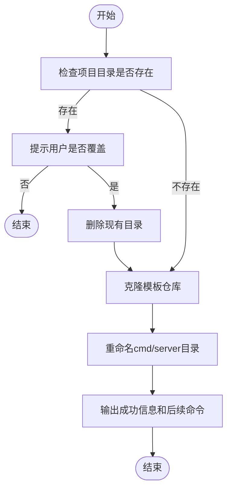
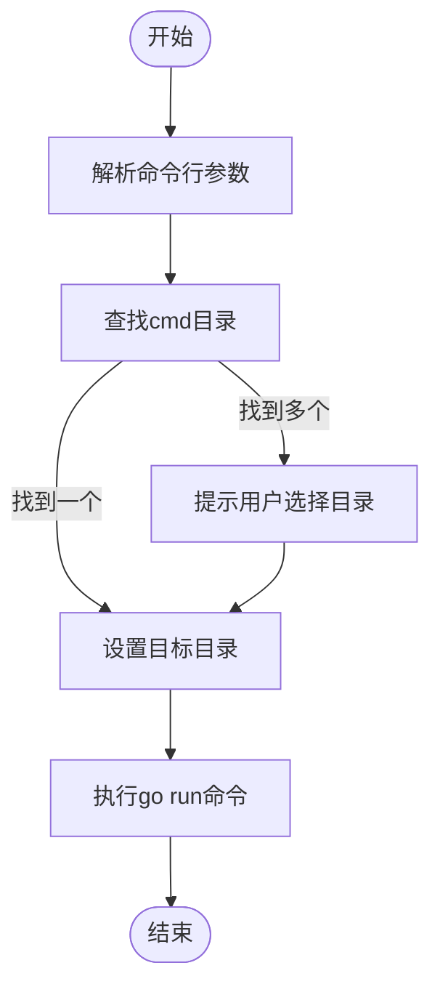
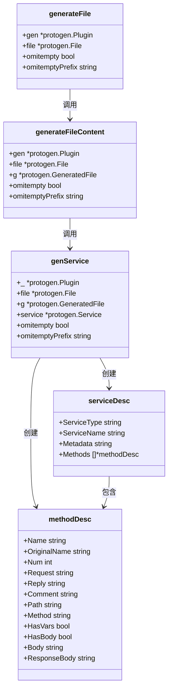
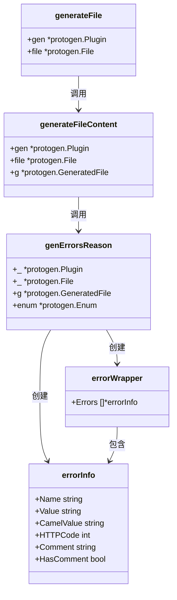

# 工具链

<cite>
**本文档中引用的文件**  
- [main.go](file://cmd/kratos/main.go)
- [new.go](file://cmd/kratos/internal/project/new.go)
- [add.go](file://cmd/kratos/internal/project/add.go)
- [run.go](file://cmd/kratos/internal/run/run.go)
- [project.go](file://cmd/kratos/internal/project/project.go)
- [proto.go](file://cmd/kratos/internal/proto/proto.go)
- [server.go](file://cmd/kratos/internal/proto/server/server.go)
- [template.go](file://cmd/kratos/internal/proto/server/template.go)
- [add.go](file://cmd/kratos/internal/proto/add/add.go)
- [template.go](file://cmd/kratos/internal/proto/add/template.go)
- [main.go](file://cmd/protoc-gen-go-http/main.go)
- [http.go](file://cmd/protoc-gen-go-http/http.go)
- [httpTemplate.tpl](file://cmd/protoc-gen-go-http/httpTemplate.tpl)
- [main.go](file://cmd/protoc-gen-go-errors/main.go)
- [errors.go](file://cmd/protoc-gen-go-errors/errors.go)
- [errorsTemplate.tpl](file://cmd/protoc-gen-go-errors/errorsTemplate.tpl)
- [version.go](file://cmd/kratos/version.go)
</cite>

## 目录
1. [简介](#简介)
2. [Kratos CLI工具](#kratos-cli工具)
3. [基于Protobuf的代码生成器](#基于protobuf的代码生成器)
4. [完整使用流程示例](#完整使用流程示例)
5. [总结](#总结)

## 简介
Kratos框架提供了一套完整的开发工具链，旨在提升微服务开发效率，减少样板代码。该工具链主要包括两个核心部分：Kratos命令行工具（CLI）和基于Protobuf的代码生成器。Kratos CLI提供了项目创建、服务添加和项目运行等便捷命令，而代码生成器则能根据Protobuf定义自动生成HTTP路由、参数绑定和错误类型等代码，极大地简化了开发流程。

**文档来源**
- [main.go](file://cmd/kratos/main.go)
- [version.go](file://cmd/kratos/version.go)

## Kratos CLI工具
Kratos CLI工具是开发Kratos微服务的核心命令行工具，提供了`kratos new`、`kratos add`、`kratos run`等子命令，覆盖了项目生命周期的各个阶段。

### kratos new - 创建项目
`kratos new`命令用于创建一个新的Kratos项目。它会从指定的模板仓库（默认为`https://github.com/go-kratos/kratos-layout.git`）克隆项目模板，并根据用户输入的项目名称进行初始化。

该命令支持以下参数：
- `--repo-url` 或 `-r`：指定项目模板仓库地址
- `--branch` 或 `-b`：指定模板仓库的分支
- `--timeout` 或 `-t`：设置项目创建超时时间
- `--nomod`：保留go mod配置

当执行`kratos new`命令时，工具会：
1. 检查目标目录是否已存在，若存在则提示用户是否覆盖
2. 从指定的模板仓库克隆代码
3. 重命名`cmd/server`目录为项目名称
4. 输出项目创建成功的提示信息，并提供后续操作的命令示例



**图示来源**
- [project.go](file://cmd/kratos/internal/project/project.go#L18-L151)
- [new.go](file://cmd/kratos/internal/project/new.go#L21-L65)

**章节来源**
- [project.go](file://cmd/kratos/internal/project/project.go#L18-L151)
- [new.go](file://cmd/kratos/internal/project/new.go#L21-L65)

### kratos add - 添加服务
`kratos add`命令用于在现有项目中添加新的服务。它与`kratos new`类似，也是基于模板创建，但会保留现有的`go.mod`文件，并将新服务添加到现有项目结构中。

该命令的主要参数与`kratos new`相同，包括`--repo-url`、`--branch`等。执行流程如下：
1. 检查目标服务目录是否已存在，若存在则提示用户是否覆盖
2. 从模板仓库克隆代码
3. 重命名`cmd/server`目录为服务名称
4. 输出服务添加成功的提示信息


**图示来源**
- [add.go](file://cmd/kratos/internal/project/add.go#L19-L69)

**章节来源**
- [add.go](file://cmd/kratos/internal/project/add.go#L19-L69)

### kratos run - 运行项目
`kratos run`命令用于运行Kratos项目。它会自动查找项目中的`cmd`目录，并执行相应的可执行文件。

该命令支持以下参数：
- `--work` 或 `-w`：指定工作目录

执行流程如下：
1. 解析命令行参数，分离`kratos run`的参数和目标程序的参数
2. 查找包含`cmd`子目录的根目录
3. 如果找到多个`cmd`目录，则提示用户选择要运行的目录
4. 使用`go run`命令执行目标程序



**图示来源**
- [run.go](file://cmd/kratos/internal/run/run.go#L27-L146)

**章节来源**
- [run.go](file://cmd/kratos/internal/run/run.go#L27-L146)

## 基于Protobuf的代码生成器
Kratos框架提供了两个基于Protobuf的代码生成器：`protoc-gen-go-http`和`protoc-gen-go-errors`，它们能够根据Protobuf文件中的注解自动生成相应的Go代码。

### protoc-gen-go-http - HTTP路由和参数绑定生成器
`protoc-gen-go-http`是一个Protobuf代码生成插件，它能够根据Protobuf文件中的HTTP注解自动生成HTTP路由和参数绑定代码。

#### 工作原理
当`protoc`编译器处理Protobuf文件时，会调用`protoc-gen-go-http`插件。插件会：
1. 解析Protobuf文件中的服务和方法定义
2. 检查方法是否包含HTTP注解（如`google.api.http`）
3. 根据HTTP注解生成相应的HTTP路由注册代码和请求处理函数

#### 生成内容
对于每个包含HTTP注解的方法，`protoc-gen-go-http`会生成以下内容：
- HTTP路由注册函数
- 请求处理函数，负责参数绑定和调用服务方法
- HTTP客户端接口和实现

生成的代码会包含在`_http.pb.go`文件中，与原始的Protobuf生成文件位于同一目录。



**图示来源**
- [http.go](file://cmd/protoc-gen-go-http/http.go#L27-L341)
- [httpTemplate.tpl](file://cmd/protoc-gen-go-http/httpTemplate.tpl#L1-L93)

**章节来源**
- [http.go](file://cmd/protoc-gen-go-http/http.go#L27-L341)
- [main.go](file://cmd/protoc-gen-go-http/main.go#L17-L36)

### protoc-gen-go-errors - 错误类型生成器
`protoc-gen-go-errors`是一个Protobuf代码生成插件，它能够根据Protobuf文件中的错误定义生成对应的Go错误类型。

#### 工作原理
`protoc-gen-go-errors`插件会：
1. 解析Protobuf文件中的枚举类型
2. 检查枚举是否包含`errors.code`扩展
3. 为每个包含错误代码的枚举值生成相应的错误创建函数和判断函数

#### 生成内容
对于每个包含错误代码的枚举值，`protoc-gen-go-errors`会生成两个函数：
- `Error{Reason}`：创建一个具有指定错误码和理由的错误
- `Is{Reason}`：判断一个错误是否为指定类型的错误

生成的代码会包含在`_errors.pb.go`文件中。



**图示来源**
- [errors.go](file://cmd/protoc-gen-go-errors/errors.go#L25-L136)
- [errorsTemplate.tpl](file://cmd/protoc-gen-go-errors/errorsTemplate.tpl#L1-L18)

**章节来源**
- [errors.go](file://cmd/protoc-gen-go-errors/errors.go#L25-L136)
- [main.go](file://cmd/protoc-gen-go-errors/main.go#L13-L33)

## 完整使用流程示例
以下是一个从编写Protobuf文件到生成可运行代码的完整流程示例。

### 1. 编写Protobuf文件
首先创建一个`.proto`文件，定义服务和错误：

```protobuf
syntax = "proto3";

package helloworld;

import "google/api/annotations.proto";
import "errors/errors.proto";

option go_package = "github.com/go-kratos/kratos-layout/api/helloworld;helloworld";

// 定义错误码
enum ErrorReason {
  option (errors.default_code) = 500;
  NAME_NOT_FOUND = 0 [(errors.code) = 404];
  INVALID_ARGUMENT = 1 [(errors.code) = 400];
}

// 定义服务
service Greeter {
  rpc SayHello (HelloRequest) returns (HelloReply) {
    option (google.api.http) = {
      get: "/helloworld/{name}"
    };
  }
}

message HelloRequest {
  string name = 1;
}

message HelloReply {
  string message = 1;
}
```

### 2. 生成Go代码
使用`protoc`命令生成Go代码：

```bash
protoc --go_out=. --go_opt=paths=source_relative \
       --go-grpc_out=. --go-grpc_opt=paths=source_relative \
       --go-http_out=. --go-http_opt=paths=source_relative \
       --go-errors_out=. --go-errors_opt=paths=source_relative \
       api/helloworld/helloworld.proto
```

该命令会生成以下文件：
- `helloworld.pb.go`：Protobuf结构体和gRPC服务接口
- `helloworld_grpc.pb.go`：gRPC服务实现
- `helloworld_http.pb.go`：HTTP路由和参数绑定代码
- `helloworld_errors.pb.go`：错误类型代码

### 3. 创建服务实现
使用`kratos proto server`命令生成服务实现模板：

```bash
kratos proto server api/helloworld/helloworld.proto --target-dir=internal/service
```

该命令会解析Protobuf文件，并根据服务定义生成服务实现模板。

### 4. 运行项目
最后使用`kratos run`命令运行项目：

```bash
kratos run
```

**章节来源**
- [server.go](file://cmd/kratos/internal/proto/server/server.go#L29-L121)
- [template.go](file://cmd/kratos/internal/proto/server/template.go#L8-L148)
- [http.go](file://cmd/protoc-gen-go-http/http.go#L27-L341)
- [errors.go](file://cmd/protoc-gen-go-errors/errors.go#L25-L136)

## 总结
Kratos框架的工具链通过Kratos CLI和基于Protobuf的代码生成器，极大地提升了微服务开发效率。Kratos CLI提供了项目创建、服务添加和项目运行等便捷命令，而代码生成器则能根据Protobuf定义自动生成HTTP路由、参数绑定和错误类型等代码，减少了大量样板代码的编写。这种基于声明式定义的开发模式，使得开发者可以更专注于业务逻辑的实现，提高了开发效率和代码质量。