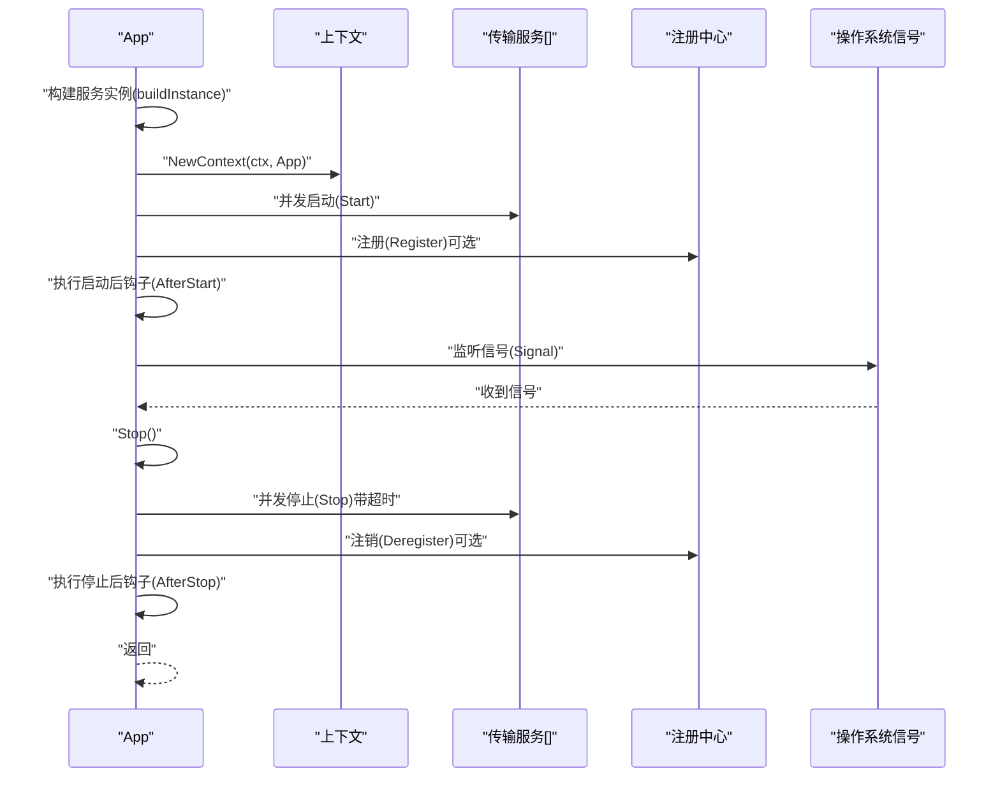
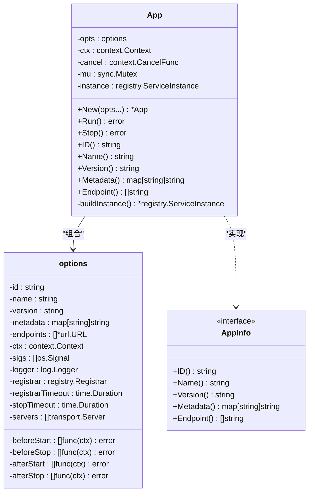
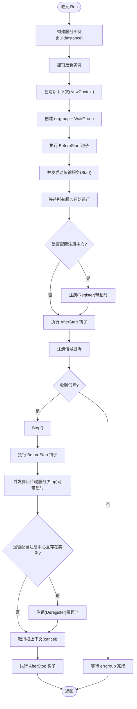
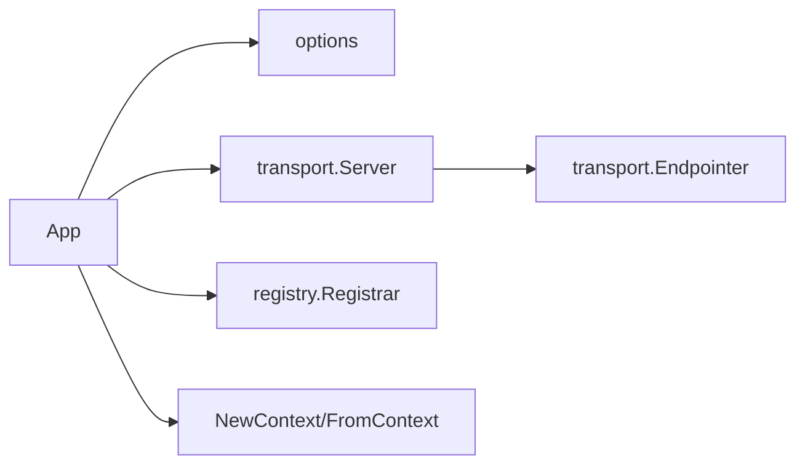

# 应用管理

<cite>
**本文引用的文件列表**
- [app.go](file://app.go)
- [options.go](file://options.go)
- [app_test.go](file://app_test.go)
- [options_test.go](file://options_test.go)
- [registry/registry.go](file://registry/registry.go)
- [transport/transport.go](file://transport/transport.go)
- [transport/http/server.go](file://transport/http/server.go)
- [transport/grpc/server.go](file://transport/grpc/server.go)
</cite>

## 目录
1. [简介](#简介)
2. [项目结构](#项目结构)
3. [核心组件](#核心组件)
4. [架构总览](#架构总览)
5. [详细组件分析](#详细组件分析)
6. [依赖关系分析](#依赖关系分析)
7. [性能考量](#性能考量)
8. [故障排查指南](#故障排查指南)
9. [结论](#结论)
10. [附录](#附录)

## 简介
本文件围绕 Kratos 框架的应用管理模块，系统性阐述 App 结构体及其生命周期管理机制，重点覆盖：
- App 的创建过程与 Option 模式配置项（服务名、版本、信号处理、启动前后钩子、传输服务、注册中心等）
- Run 方法内部工作流：如何依次启动注册中心、传输服务、执行启动后钩子，并通过系统信号实现优雅关闭
- 所有 With* 配置函数的语义与使用方式
- App 如何与 Transport、Registry 组件集成
- 通过自定义钩子函数扩展应用行为
- 高并发场景下的最佳实践与潜在陷阱

## 项目结构
与应用管理直接相关的核心文件如下：
- app.go：App 结构体、生命周期管理、上下文注入
- options.go：Option 模式配置项集合与 With* 函数
- registry/registry.go：注册中心接口与服务实例模型
- transport/transport.go：传输层接口（Server、Endpointer）与上下文工具
- transport/http/server.go、transport/grpc/server.go：HTTP/gRPC 传输服务实现（作为 App 可启动的服务）

```mermaid
graph TB
subgraph "应用层"
App["App<br/>生命周期管理"]
Ctx["NewContext/FromContext<br/>应用上下文注入"]
end
subgraph "配置层"
Opts["options<br/>With* 配置项"]
WithID["WithID"]
WithName["WithName"]
WithVersion["WithVersion"]
WithMetadata["WithMetadata"]
WithEndpoint["WithEndpoint"]
WithContext["WithContext"]
WithLogger["WithLogger"]
WithServer["WithServer"]
WithSignal["WithSignal"]
WithRegistrar["WithRegistrar"]
WithRegistrarTimeout["WithRegistrarTimeout"]
WithStopTimeout["WithStopTimeout"]
WithBeforeStart["WithBeforeStart"]
WithBeforeStop["WithBeforeStop"]
WithAfterStart["WithAfterStart"]
WithAfterStop["WithAfterStop"]
end
subgraph "传输层"
TServer["transport.Server<br/>Start/Stop 接口"]
TEndp["transport.Endpointer<br/>Endpoint()"]
end
subgraph "注册中心"
Reg["registry.Registrar<br/>Register/Deregister"]
SvcInst["registry.ServiceInstance<br/>ID/Name/Version/Metadata/Endpoints"]
end
App --> Opts
App --> TServer
App --> Reg
App --> SvcInst
App --> Ctx
Opts --> WithID
Opts --> WithName
Opts --> WithVersion
Opts --> WithMetadata
Opts --> WithEndpoint
Opts --> WithContext
Opts --> WithLogger
Opts --> WithServer
Opts --> WithSignal
Opts --> WithRegistrar
Opts --> WithRegistrarTimeout
Opts --> WithStopTimeout
Opts --> WithBeforeStart
Opts --> WithBeforeStop
Opts --> WithAfterStart
Opts --> WithAfterStop
TServer --> TEndp
```

图表来源
- [app.go](file://app.go#L1-L213)
- [options.go](file://options.go#L1-L130)
- [registry/registry.go](file://registry/registry.go#L1-L96)
- [transport/transport.go](file://transport/transport.go#L1-L96)

章节来源
- [app.go](file://app.go#L1-L213)
- [options.go](file://options.go#L1-L130)

## 核心组件
- App：应用生命周期管理器，负责构建服务实例、启动传输服务、注册/注销、执行钩子函数、监听系统信号并优雅关闭。
- options：以 Option 模式聚合所有可配置项，包含服务标识、名称、版本、元数据、端点、上下文、日志器、传输服务、信号集、注册器、注册超时、停止超时、以及四类钩子函数列表。
- Registry 接口：抽象注册中心能力，支持注册与注销服务实例。
- Transport Server 接口：统一的传输服务抽象，要求实现 Start/Stop 生命周期方法；Endpointer 可暴露服务端点。

章节来源
- [app.go](file://app.go#L1-L213)
- [options.go](file://options.go#L1-L130)
- [registry/registry.go](file://registry/registry.go#L1-L96)
- [transport/transport.go](file://transport/transport.go#L1-L96)

## 架构总览
下图展示 App 在运行期的关键交互：构建服务实例、并发启动传输服务、注册到注册中心、执行启动后钩子、监听信号触发优雅关闭、执行停止后钩子并注销实例。

图表来源
- [app.go](file://app.go#L82-L174)
- [registry/registry.go](file://registry/registry.go#L1-L16)
- [transport/transport.go](file://transport/transport.go#L15-L19)

## 详细组件分析

### App 结构体与生命周期
- 字段
  - opts：应用配置（options）
  - ctx/cancel：应用级根上下文与取消函数
  - mu：保护服务实例的互斥锁
  - instance：当前服务实例（用于注册/注销）
- 关键方法
  - New：初始化默认配置（含默认信号集、注册超时）、设置日志器、创建应用上下文
  - Run：执行启动前钩子、并发启动传输服务、等待服务启动完成、注册实例、执行启动后钩子、监听信号并触发 Stop、执行停止后钩子
  - Stop：执行停止前钩子、注销实例、取消根上下文
  - buildInstance：根据显式端点或传输服务 Endpointer 自动推导端点，生成 ServiceInstance
  - 上下文工具：NewContext/FromContext，向上下文中注入 AppInfo

图表来源
- [app.go](file://app.go#L20-L213)
- [options.go](file://options.go#L17-L39)

章节来源
- [app.go](file://app.go#L20-L213)
- [options.go](file://options.go#L17-L39)

### Run 方法内部工作流详解
- 构建服务实例：优先使用显式端点，否则从实现了 Endpointer 的传输服务自动提取
- 并发启动传输服务：使用 errgroup 并发启动，确保所有服务均开始运行后再进行注册
- 注册服务实例：可选，使用带超时的上下文调用 Registrar.Register
- 启动后钩子：在注册完成后执行
- 信号监听：注册信号通道，收到信号后调用 Stop
- 停止阶段：先执行停止前钩子，再并发停止各传输服务（可带超时），注销实例，最后执行停止后钩子

图表来源
- [app.go](file://app.go#L82-L174)
- [registry/registry.go](file://registry/registry.go#L1-L16)
- [transport/transport.go](file://transport/transport.go#L15-L19)

章节来源
- [app.go](file://app.go#L82-L174)

### Stop 方法与优雅关闭
- 执行 BeforeStop 钩子
- 注销实例（若配置了注册中心且存在实例）
- 取消根上下文，使传输服务的 Start/Stop 能尽快响应
- AfterStop 钩子按顺序执行

章节来源
- [app.go](file://app.go#L153-L174)

### 服务实例构建逻辑
- 若显式设置了端点，则直接使用
- 否则遍历传输服务，对实现 Endpointer 的服务调用 Endpoint 获取地址
- 生成 ServiceInstance，包含 ID、Name、Version、Metadata、Endpoints

章节来源
- [app.go](file://app.go#L176-L199)
- [transport/transport.go](file://transport/transport.go#L21-L24)

### 与传输服务的集成
- App 通过 Server 列表启动多个传输服务，每个服务需实现 transport.Server 接口
- HTTP/gRPC 服务均实现了 Server 与 Endpointer，可被 App 自动发现端点
- 传输服务的 Start/Stop 生命周期由 App 统一调度

章节来源
- [transport/transport.go](file://transport/transport.go#L15-L24)
- [transport/http/server.go](file://transport/http/server.go#L1-L200)
- [transport/grpc/server.go](file://transport/grpc/server.go#L1-L200)

### 与注册中心的集成
- App 支持可选的 Registrar，用于注册/注销服务实例
- 注册/注销均使用带超时的上下文，避免阻塞
- ServiceInstance 包含服务标识、名称、版本、元数据与端点列表

章节来源
- [app.go](file://app.go#L120-L131)
- [registry/registry.go](file://registry/registry.go#L1-L96)

### 钩子函数扩展点
- BeforeStart/AfterStart：在启动传输服务前后执行
- BeforeStop/AfterStop：在停止传输服务前后执行
- 钩子函数接收上下文，便于与 App 的根上下文协作（如取消、超时控制）

章节来源
- [options.go](file://options.go#L101-L129)
- [app.go](file://app.go#L95-L131)

## 依赖关系分析
- App 依赖 options 提供的配置项
- App 依赖 transport.Server 启动/停止传输服务
- App 依赖 registry.Registrar 进行注册/注销
- App 通过 Endpointer 自动推导传输服务端点
- App 通过 NewContext/FromContext 在上下文中注入 AppInfo

图表来源
- [app.go](file://app.go#L1-L213)
- [options.go](file://options.go#L1-L130)
- [registry/registry.go](file://registry/registry.go#L1-L96)
- [transport/transport.go](file://transport/transport.go#L1-L96)

章节来源
- [app.go](file://app.go#L1-L213)
- [options.go](file://options.go#L1-L130)
- [registry/registry.go](file://registry/registry.go#L1-L96)
- [transport/transport.go](file://transport/transport.go#L1-L96)

## 性能考量
- 并发启动传输服务：使用 errgroup 并发启动，WaitGroup 确保所有服务开始运行后再注册，避免注册早于服务就绪导致的失败
- 停止阶段并发停止：同样使用 errgroup 并发停止，结合 StopTimeout 控制最大停机时间
- 注册/注销超时：通过 RegistrarTimeout 控制注册/注销的最长等待时间，防止阻塞
- 日志器设置：通过 WithLogger 将全局日志器注入，避免在 Run 中重复设置带来的开销
- 信号监听：仅注册一次信号通道，避免重复监听造成的资源浪费

章节来源
- [app.go](file://app.go#L92-L145)
- [options.go](file://options.go#L86-L99)

## 故障排查指南
- 启动失败
  - 检查 BeforeStart 钩子是否返回错误
  - 检查传输服务 Start 是否抛出异常
  - 检查注册中心配置与网络连通性
- 注册失败
  - 确认 Registrar 实现正确，检查 RegistrarTimeout 设置是否过短
  - 确认 ServiceInstance 的端点是否有效
- 停止卡住
  - 检查 StopTimeout 是否过短
  - 检查传输服务是否正确响应上下文取消
- 优雅关闭未生效
  - 确认 WithSignal 设置的信号集是否包含目标信号
  - 确认 Stop 被调用且 BeforeStop/AfterStop 正常执行

章节来源
- [app.go](file://app.go#L82-L174)
- [options.go](file://options.go#L81-L99)

## 结论
App 通过 Option 模式提供了高度可配置的应用生命周期管理能力，结合传输服务与注册中心，实现了从启动到优雅关闭的完整闭环。通过钩子函数与上下文工具，开发者可以灵活扩展应用行为并在高并发场景中保持稳定与可控。

## 附录

### 配置选项一览（With* 函数）
- WithID：设置服务实例 ID
- WithName：设置服务名称
- WithVersion：设置服务版本
- WithMetadata：设置服务元数据
- WithEndpoint：设置服务端点（优先使用）
- WithContext：设置应用根上下文
- WithLogger：设置全局日志器
- WithServer：添加传输服务（可多实例）
- WithSignal：设置监听的系统信号集
- WithRegistrar：设置注册中心
- WithRegistrarTimeout：设置注册/注销超时
- WithStopTimeout：设置停止阶段超时
- WithBeforeStart：启动前钩子
- WithBeforeStop：停止前钩子
- WithAfterStart：启动后钩子
- WithAfterStop：停止后钩子

章节来源
- [options.go](file://options.go#L41-L129)

### 使用示例（路径参考）
- 创建应用并配置传输服务、钩子函数与注册中心
  - 示例路径：[app_test.go](file://app_test.go#L43-L74)
- 验证 ID/Name/Version/Metadata/Endpoint
  - 示例路径：[app_test.go](file://app_test.go#L76-L130)
- 验证 ServiceInstance 构建结果
  - 示例路径：[app_test.go](file://app_test.go#L132-L183)
- 验证上下文注入与读取
  - 示例路径：[app_test.go](file://app_test.go#L185-L284)
- 验证 StopTimeout 对传输服务停止的影响
  - 示例路径：[app_test.go](file://app_test.go#L287-L301)
- 验证 With* 配置项的行为
  - 示例路径：[options_test.go](file://options_test.go#L17-L200)