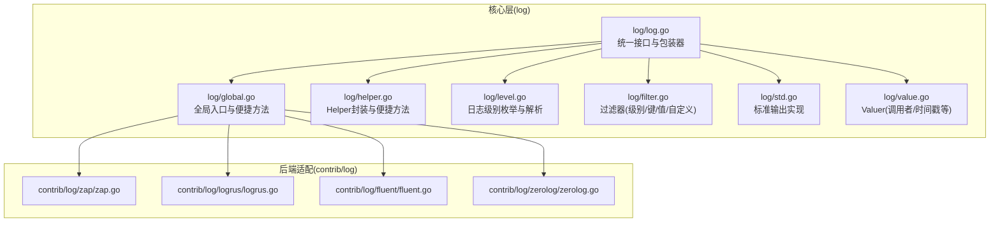
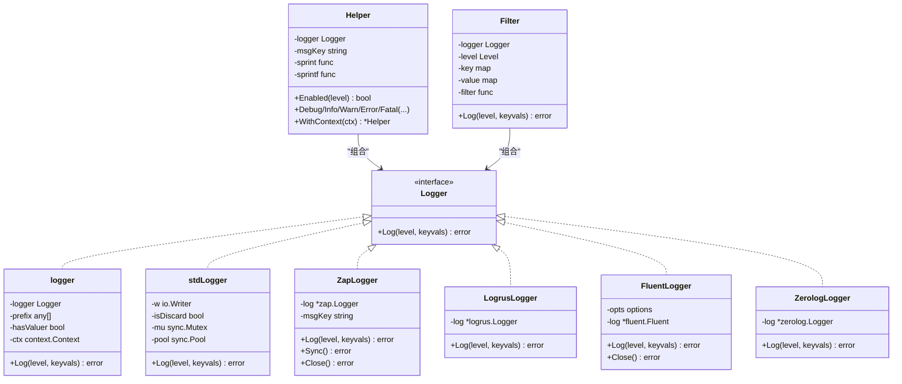
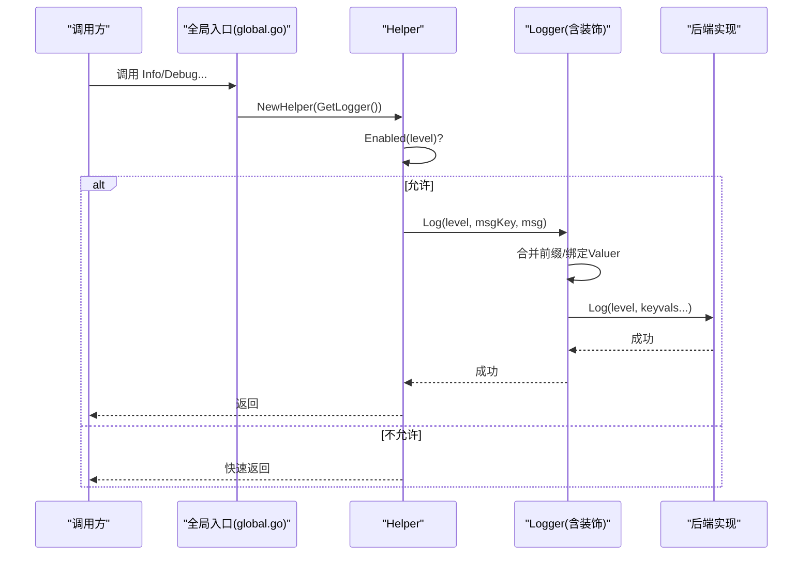
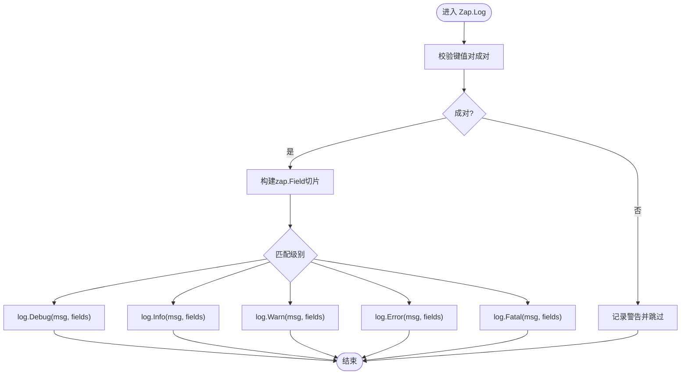

# 日志系统

<cite>
**本文引用的文件列表**
- [log/log.go](file://log/log.go)
- [log/global.go](file://log/global.go)
- [log/helper.go](file://log/helper.go)
- [log/level.go](file://log/level.go)
- [log/filter.go](file://log/filter.go)
- [log/std.go](file://log/std.go)
- [log/value.go](file://log/value.go)
- [contrib/log/zap/zap.go](file://contrib/log/zap/zap.go)
- [contrib/log/logrus/logrus.go](file://contrib/log/logrus/logrus.go)
- [contrib/log/fluent/fluent.go](file://contrib/log/fluent/fluent.go)
- [contrib/log/zerolog/zerolog.go](file://contrib/log/zerolog/zerolog.go)
- [log/README.md](file://log/README.md)
- [log/global_test.go](file://log/global_test.go)
- [log/helper_test.go](file://log/helper_test.go)
- [contrib/log/zap/zap_test.go](file://contrib/log/zap/zap_test.go)
</cite>

## 目录
1. [简介](#简介)
2. [项目结构](#项目结构)
3. [核心组件](#核心组件)
4. [架构总览](#架构总览)
5. [组件详解](#组件详解)
6. [依赖关系分析](#依赖关系分析)
7. [性能与优化](#性能与优化)
8. [故障排查指南](#故障排查指南)
9. [结论](#结论)
10. [附录：配置与示例](#附录配置与示例)

## 简介
本文件系统性介绍 Kratos 框架的日志子系统，包括：
- 标准化的日志接口设计与实现
- 通过 log.Helper 简化日志记录的使用体验
- 日志级别（Debug、Info、Warn、Error、Fatal）的语义与最佳实践
- 多后端集成能力（Zap、Logrus、Fluent、Zerolog）
- 结构化日志、日志上下文（trace_id 等）传递
- 输出到文件、控制台与远程日志系统的配置思路
- 性能优化策略与常见问题排查

## 项目结构
日志系统由核心层与后端适配层组成：
- 核心层位于 log 包，定义统一接口、级别、全局入口、辅助工具、过滤器与标准输出实现
- 后端适配层位于 contrib/log 下，提供对第三方日志库的桥接实现

图表来源
- [log/log.go](file://log/log.go#L1-L66)
- [log/global.go](file://log/global.go#L1-L130)
- [log/helper.go](file://log/helper.go#L1-L189)
- [log/level.go](file://log/level.go#L1-L61)
- [log/filter.go](file://log/filter.go#L1-L95)
- [log/std.go](file://log/std.go#L1-L62)
- [log/value.go](file://log/value.go#L1-L66)
- [contrib/log/zap/zap.go](file://contrib/log/zap/zap.go#L1-L81)
- [contrib/log/logrus/logrus.go](file://contrib/log/logrus/logrus.go#L1-L73)
- [contrib/log/fluent/fluent.go](file://contrib/log/fluent/fluent.go#L1-L178)
- [contrib/log/zerolog/zerolog.go](file://contrib/log/zerolog/zerolog.go#L1-L55)

章节来源
- [log/README.md](file://log/README.md#L1-L63)

## 核心组件
- 统一接口与包装器
  - 定义 Logger 接口与默认实现 DefaultLogger，并提供 With/WithContext 等装饰能力，支持前缀字段与上下文 Valuer 绑定
- 全局入口与便捷方法
  - 提供 SetLogger/GetLogger 与 Debug/Info/Warn/Error/Fatal 系列方法，支持格式化与键值对两种写法
- Helper 封装
  - 对 Logger 进行二次封装，提供 Enabled 判断、消息键名定制、便捷打印方法
- 日志级别
  - 定义 Level 枚举与字符串映射，支持解析
- 过滤器
  - 支持按级别、键、值、自定义函数进行过滤；可与 Helper 协作
- 标准输出实现
  - 基于标准库 log 的 Writer 实现，线程安全，带缓冲池
- Valuer 上下文绑定
  - 提供 Caller、Timestamp 等常用 Valuer，并在日志写入时动态绑定

章节来源
- [log/log.go](file://log/log.go#L1-L66)
- [log/global.go](file://log/global.go#L1-L130)
- [log/helper.go](file://log/helper.go#L1-L189)
- [log/level.go](file://log/level.go#L1-L61)
- [log/filter.go](file://log/filter.go#L1-L95)
- [log/std.go](file://log/std.go#L1-L62)
- [log/value.go](file://log/value.go#L1-L66)

## 架构总览
下面的类图展示了核心接口与关键实现之间的关系：

图表来源
- [log/log.go](file://log/log.go#L1-L66)
- [log/helper.go](file://log/helper.go#L1-L189)
- [log/filter.go](file://log/filter.go#L1-L95)
- [log/std.go](file://log/std.go#L1-L62)
- [contrib/log/zap/zap.go](file://contrib/log/zap/zap.go#L1-L81)
- [contrib/log/logrus/logrus.go](file://contrib/log/logrus/logrus.go#L1-L73)
- [contrib/log/fluent/fluent.go](file://contrib/log/fluent/fluent.go#L1-L178)
- [contrib/log/zerolog/zerolog.go](file://contrib/log/zerolog/zerolog.go#L1-L55)

## 组件详解

### Logger 接口与实现
- 接口职责
  - 统一的日志输出抽象，接收 Level 与键值对参数
- 默认实现
  - DefaultLogger 基于标准库 log.Writer 创建
- 装饰器模式
  - With 可叠加前缀键值
  - WithContext 可为日志注入上下文，支持 Valuer 动态取值
- 写入流程
  - 合并前缀与上下文 Valuer 绑定后的键值对，再委托底层 Logger.Log

章节来源
- [log/log.go](file://log/log.go#L1-L66)

### 全局入口与便捷方法
- 全局代理
  - loggerAppliance 提供 SetLogger/GetLogger，支持运行时替换
- 便捷方法
  - Debug/Info/Warn/Error/Fatal 提供三种写法：直接内容、格式化、键值对
- 上下文助手
  - Context(ctx) 返回基于当前全局 Logger 的 Helper，便于在请求生命周期内传递

章节来源
- [log/global.go](file://log/global.go#L1-L130)

### Helper 封装与最佳实践
- 能力
  - Enabled 判断级别是否允许，避免无效开销
  - 自定义消息键名（默认 msg），自定义 Sprint/Sprintf
  - WithContext 复制 Helper 并更新上下文
- 使用建议
  - 在模块初始化处创建 Helper，贯穿该模块生命周期
  - 通过 With 注入固定字段（如 module、version），通过 WithContext 注入 trace_id 等动态字段

章节来源
- [log/helper.go](file://log/helper.go#L1-L189)

### 日志级别与语义
- 级别定义
  - DEBUG/INFO/WARN/ERROR/FATAL，字符串映射与解析
- 使用场景
  - DEBUG：开发调试、内部状态
  - INFO：常规运行信息
  - WARN：潜在问题但可恢复
  - ERROR：错误事件
  - FATAL：致命错误，通常伴随退出
- 最佳实践
  - 生产环境建议至少 INFO，必要时临时提升至 DEBUG
  - 错误日志应包含上下文键值（如操作、用户、资源标识）

章节来源
- [log/level.go](file://log/level.go#L1-L61)

### 过滤器（Filter）
- 功能
  - 按级别阈值过滤
  - 按键或值模糊处理（掩码）
  - 自定义过滤函数
- 与 Helper 协作
  - 可在 Helper 层启用过滤，减少无效日志写出

章节来源
- [log/filter.go](file://log/filter.go#L1-L95)

### 标准输出实现（stdLogger）
- 特点
  - 线程安全，使用 sync.Pool 缓冲区
  - 自动补齐奇数个键值对
  - 输出格式为“级别 键=值”逐行
- 适用场景
  - 控制台输出、简单场景、兼容标准库

章节来源
- [log/std.go](file://log/std.go#L1-L62)

### Valuer 上下文绑定（Caller/Timestamp/自定义）
- 默认 Valuer
  - DefaultCaller：自动定位调用文件与行号
  - DefaultTimestamp：按指定布局生成时间戳
- 绑定机制
  - 在 With 中传入键值对，值为 Valuer 函数；写入时根据上下文动态计算
- 传递 trace_id
  - 通过 context.WithValue 注入 traceKey，配合 Valuer 动态读取

章节来源
- [log/value.go](file://log/value.go#L1-L66)

### 第三方后端适配

#### Zap（高性能）
- 特点
  - 零分配路径优化，支持 JSON 编码
  - 与 zapcore.Level 对齐，提前判断是否启用
- 使用要点
  - 建议使用 JSON 编码器，便于下游检索
  - 通过 NewLogger 包装 zap.Logger，保持统一接口

章节来源
- [contrib/log/zap/zap.go](file://contrib/log/zap/zap.go#L1-L81)

#### Logrus（灵活性）
- 特点
  - 插件生态丰富，支持多种输出与格式
  - 与 logrus.Level 映射，按 Level 过滤
- 使用要点
  - 可结合 Hooks 实现异步、重试、采样等

章节来源
- [contrib/log/logrus/logrus.go](file://contrib/log/logrus/logrus.go#L1-L73)

#### Fluent（集中式日志收集）
- 特点
  - 通过 TCP 或 Unix Socket 发送到 fluentd
  - 支持超时、缓冲、重试、异步发送等选项
- 使用要点
  - 地址支持 tcp://host:port 或 unix://path
  - 会将键值对转换为字符串映射发送

章节来源
- [contrib/log/fluent/fluent.go](file://contrib/log/fluent/fluent.go#L1-L178)

#### Zerolog（轻量高效）
- 特点
  - 以零分配为目标，适合高吞吐场景
  - 通过 Any 方法将任意类型字段写入

章节来源
- [contrib/log/zerolog/zerolog.go](file://contrib/log/zerolog/zerolog.go#L1-L55)

### 关键流程时序

#### 全局日志写入序列

图表来源
- [log/global.go](file://log/global.go#L1-L130)
- [log/helper.go](file://log/helper.go#L1-L189)
- [log/log.go](file://log/log.go#L1-L66)

#### 结构化日志写入流程（Zap）

图表来源
- [contrib/log/zap/zap.go](file://contrib/log/zap/zap.go#L1-L81)

## 依赖关系分析
- 松耦合
  - 所有后端均实现统一 Logger 接口，应用层仅依赖接口
- 过滤与包装
  - Filter 与 logger 装饰器可叠加使用，形成链式处理
- 上下文传播
  - WithContext 与 Valuer 保证 trace_id 等上下文信息贯穿日志

图表来源
- [log/helper.go](file://log/helper.go#L1-L189)
- [log/filter.go](file://log/filter.go#L1-L95)
- [log/log.go](file://log/log.go#L1-L66)
- [contrib/log/zap/zap.go](file://contrib/log/zap/zap.go#L1-L81)
- [contrib/log/logrus/logrus.go](file://contrib/log/logrus/logrus.go#L1-L73)
- [contrib/log/fluent/fluent.go](file://contrib/log/fluent/fluent.go#L1-L178)
- [contrib/log/zerolog/zerolog.go](file://contrib/log/zerolog/zerolog.go#L1-L55)

## 性能与优化
- 避免无效日志
  - 使用 Helper.Enabled 在高频路径中快速短路
  - 使用 Filter 设置合理级别阈值
- 字符串拼接与缓冲
  - stdLogger 使用 sync.Pool 缓冲区，减少内存分配
  - Zap/ZeroLog 采用零分配策略，适合高并发
- 键值对成对
  - 确保 keyvals 成对出现，避免后端警告与额外处理
- 异步与批处理
  - Fluent 支持异步发送与缓冲限制，建议在生产环境开启
- 采样与降噪
  - 可通过 FilterFunc 实现采样或屏蔽敏感键值

[本节为通用指导，无需列出章节来源]

## 故障排查指南
- 日志未输出
  - 检查 SetLogger 是否在首次使用前设置
  - 确认全局 Logger 是否被后续 SetLogger 替换
- 级别不生效
  - 确认 FilterLevel 阈值设置是否正确
  - 检查 Helper.Enabled 是否被上层过滤器影响
- 键值对不成对
  - 后端实现会记录警告并跳过，修正调用侧键值对
- trace_id 为空
  - 确认 WithContext(ctx, logger) 已在全局或模块层设置
  - 确认 Valuer 返回值存在且非空
- Fluent 发送失败
  - 检查地址格式（tcp/unix）、网络连通性、缓冲与重试参数

章节来源
- [log/global_test.go](file://log/global_test.go#L1-L140)
- [log/helper_test.go](file://log/helper_test.go#L1-L108)
- [contrib/log/zap/zap_test.go](file://contrib/log/zap/zap_test.go#L1-L65)

## 结论
Kratos 日志系统通过统一接口、装饰器与 Helper 封装，提供了简洁而强大的日志能力。借助 Valuer 与上下文，可轻松实现结构化与上下文传递；通过多后端适配，既能满足高性能需求，也能对接集中式日志平台。建议在生产环境中：
- 使用 Filter 设置合理阈值
- 通过 Helper.Enabled 降低无效调用
- 选择合适的后端（Zap/ZeroLog 高性能；Logrus 灵活；Fluent 集中式）
- 统一结构化字段命名与编码规范

[本节为总结，无需列出章节来源]

## 附录：配置与示例

### 基础结构化日志与 Helper 使用
- 在模块初始化处创建 Logger，并注入固定字段与上下文 Valuer
- 使用 Helper 的 Info/Debug 等便捷方法
- 可叠加 Filter 以屏蔽敏感键值或降低噪声

章节来源
- [log/README.md](file://log/README.md#L1-L63)
- [log/helper_test.go](file://log/helper_test.go#L1-L108)

### 输出到控制台/文件
- 使用 NewStdLogger 包装 os.Stdout/os.File
- 通过 With 注入 ts/caller/module 等字段
- 通过 SetLogger 替换全局 Logger

章节来源
- [log/std.go](file://log/std.go#L1-L62)
- [log/global.go](file://log/global.go#L1-L130)
- [log/global_test.go](file://log/global_test.go#L1-L140)

### 输出到远程日志系统（Fluent）
- 使用 NewLogger(addr, options...) 创建 FluentLogger
- 支持 TCP/Unix Socket，配置超时、缓冲、重试、异步发送等
- 通过 Log(level, keyvals...) 发送

章节来源
- [contrib/log/fluent/fluent.go](file://contrib/log/fluent/fluent.go#L1-L178)

### 使用 Zap/Logrus/Zerolog
- Zap：推荐 JSON 编码，零分配路径优化
- Logrus：插件丰富，适合灵活格式与输出
- Zerolog：极致轻量，适合高吞吐

章节来源
- [contrib/log/zap/zap.go](file://contrib/log/zap/zap.go#L1-L81)
- [contrib/log/logrus/logrus.go](file://contrib/log/logrus/logrus.go#L1-L73)
- [contrib/log/zerolog/zerolog.go](file://contrib/log/zerolog/zerolog.go#L1-L55)

### 日志上下文（trace_id）传递
- 在 With 中注入 "trace_id" 字段，值为 Valuer
- 在请求上下文中设置 traceKey/value
- 通过 WithContext(ctx, logger) 使日志携带 trace_id

章节来源
- [log/global_test.go](file://log/global_test.go#L1-L140)
- [log/helper_test.go](file://log/helper_test.go#L1-L108)
- [log/value.go](file://log/value.go#L1-L66)