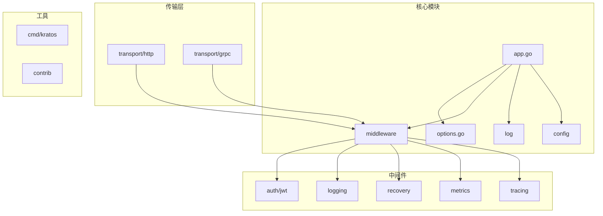
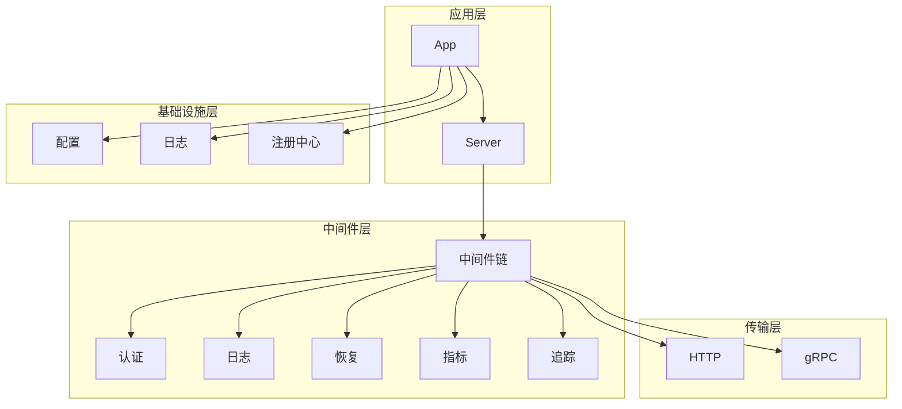
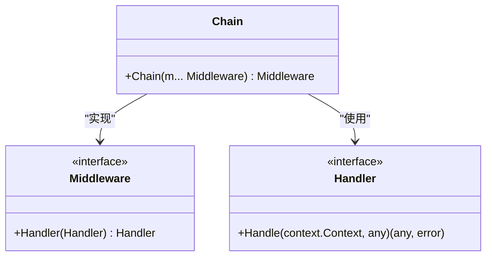
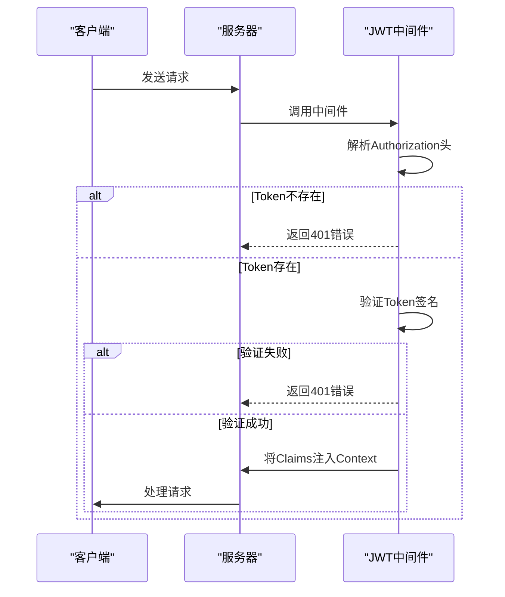
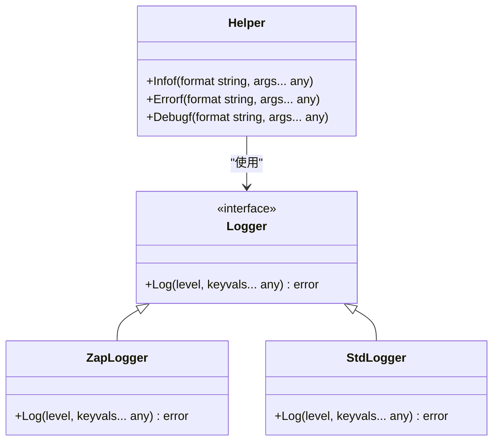
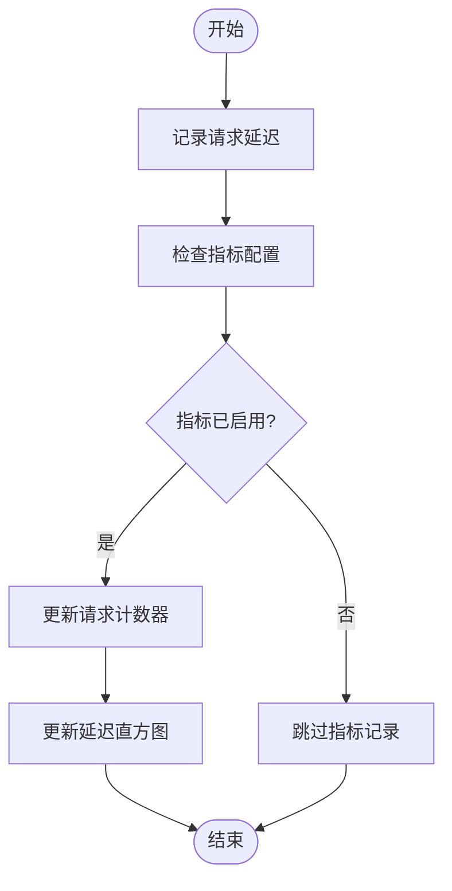
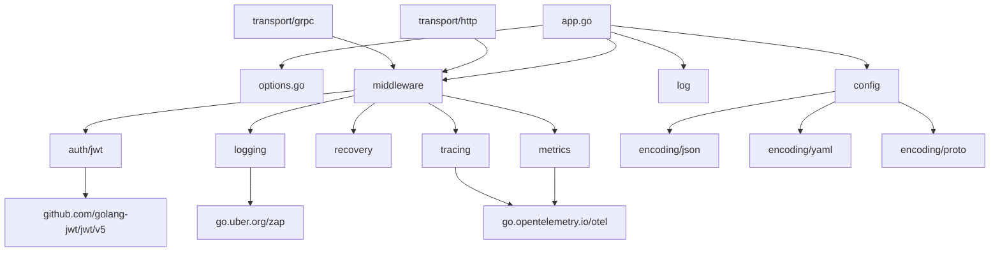

# 最佳实践

<cite>
**本文档中引用的文件**  
- [app.go](file://app.go)
- [options.go](file://options.go)
- [middleware.go](file://middleware/middleware.go)
- [log.go](file://log/log.go)
- [config.go](file://config/config.go)
- [jwt.go](file://middleware/auth/jwt/jwt.go)
- [zap.go](file://contrib/log/zap/zap.go)
- [server.go](file://transport/http/server.go)
- [server.go](file://transport/grpc/server.go)
- [logging.go](file://middleware/logging/logging.go)
- [recovery.go](file://middleware/recovery/recovery.go)
- [metrics.go](file://middleware/metrics/metrics.go)
- [tracing.go](file://middleware/tracing/tracing.go)
- [pprof.go](file://transport/http/pprof/pprof.go)
- [main.go](file://cmd/kratos/main.go)
</cite>

## 目录
1. [简介](#简介)
2. [项目结构](#项目结构)
3. [核心组件](#核心组件)
4. [架构概述](#架构概述)
5. [详细组件分析](#详细组件分析)
6. [依赖分析](#依赖分析)
7. [性能考虑](#性能考虑)
8. [故障排除指南](#故障排除指南)
9. [结论](#结论)

## 简介
本指南为开发者提供在生产环境中部署Kratos框架应用的权威建议。涵盖性能优化、安全、部署、监控和开发流程等方面的最佳实践。

## 项目结构
Kratos框架采用模块化设计，主要包含API定义、命令行工具、配置管理、日志、中间件、传输层等核心组件。



**Diagram sources**
- [app.go](file://app.go)
- [options.go](file://options.go)
- [middleware/middleware.go](file://middleware/middleware.go)
- [log/log.go](file://log/log.go)
- [config/config.go](file://config/config.go)
- [transport/http/server.go](file://transport/http/server.go)
- [transport/grpc/server.go](file://transport/grpc/server.go)

**Section sources**
- [app.go](file://app.go)
- [options.go](file://options.go)
- [middleware/middleware.go](file://middleware/middleware.go)
- [log/log.go](file://log/log.go)
- [config/config.go](file://config/config.go)

## 核心组件

Kratos框架的核心组件包括应用生命周期管理、中间件链、日志系统、配置管理和传输层。

**Section sources**
- [app.go](file://app.go)
- [options.go](file://options.go)
- [middleware/middleware.go](file://middleware/middleware.go)
- [log/log.go](file://log/log.go)
- [config/config.go](file://config/config.go)

## 架构概述

Kratos框架采用分层架构，从上到下分别为应用层、中间件层、传输层和基础设施层。



**Diagram sources**
- [app.go](file://app.go)
- [transport/http/server.go](file://transport/http/server.go)
- [transport/grpc/server.go](file://transport/grpc/server.go)
- [middleware/middleware.go](file://middleware/middleware.go)

## 详细组件分析

### 中间件分析
Kratos框架的中间件系统采用函数式编程模式，通过链式调用实现功能组合。

#### 中间件链实现


**Diagram sources**
- [middleware/middleware.go](file://middleware/middleware.go)

**Section sources**
- [middleware/middleware.go](file://middleware/middleware.go)

### 认证授权分析
JWT中间件提供基于JSON Web Token的认证授权功能。

#### JWT认证流程


**Diagram sources**
- [middleware/auth/jwt/jwt.go](file://middleware/auth/jwt/jwt.go)

**Section sources**
- [middleware/auth/jwt/jwt.go](file://middleware/auth/jwt/jwt.go)

### 日志系统分析
Kratos框架提供灵活的日志系统，支持多种日志库集成。

#### 日志系统架构


**Diagram sources**
- [log/log.go](file://log/log.go)
- [contrib/log/zap/zap.go](file://contrib/log/zap/zap.go)

**Section sources**
- [log/log.go](file://log/log.go)
- [contrib/log/zap/zap.go](file://contrib/log/zap/zap.go)

### 性能监控分析
Kratos框架集成OpenTelemetry，提供全面的性能监控能力。

#### 监控中间件流程


**Diagram sources**
- [middleware/metrics/metrics.go](file://middleware/metrics/metrics.go)
- [middleware/tracing/tracing.go](file://middleware/tracing/tracing.go)

**Section sources**
- [middleware/metrics/metrics.go](file://middleware/metrics/metrics.go)
- [middleware/tracing/tracing.go](file://middleware/tracing/tracing.go)

## 依赖分析

Kratos框架的依赖关系清晰，各组件之间耦合度低。



**Diagram sources**
- [go.mod](file://go.mod)
- [app.go](file://app.go)
- [transport/http/server.go](file://transport/http/server.go)
- [transport/grpc/server.go](file://transport/grpc/server.go)

**Section sources**
- [go.mod](file://go.mod)
- [app.go](file://app.go)
- [transport/http/server.go](file://transport/http/server.go)
- [transport/grpc/server.go](file://transport/grpc/server.go)

## 性能考虑

### 中间件顺序优化
中间件的执行顺序对性能有重要影响，建议按以下顺序配置：

1. recovery - 最外层，捕获所有panic
2. metrics - 记录请求指标
3. tracing - 分布式追踪
4. logging - 请求日志记录
5. auth - 认证授权
6. validate - 参数验证

### 日志优化
使用Zap日志库可以获得最佳性能：

```go
// 使用Zap作为日志后端
logger := zap.NewProduction()
kratosLogger := contriblogzap.NewLogger(logger)
kratos.SetLogger(kratosLogger)
```

### Protobuf序列化优化
Kratos框架内置对Protobuf的支持，建议使用proto3语法并合理设计消息结构。

## 故障排除指南

### pprof性能分析
Kratos框架内置pprof支持，可通过以下方式启用：

```go
// 在HTTP服务器中添加pprof处理器
import _ "net/http/pprof"

// 或使用专用的pprof中间件
server.HandlePrefix("/debug/pprof", pprof.NewHandler())
```

常用pprof命令：
- `go tool pprof http://localhost:8080/debug/pprof/profile` - CPU性能分析
- `go tool pprof http://localhost:8080/debug/pprof/heap` - 内存分析
- `go tool pprof http://localhost:8080/debug/pprof/goroutine` - 协程分析

### 日志追踪
通过TraceID和SpanID进行请求追踪：

```go
// 在日志中包含追踪信息
logger := log.WithContext(ctx, log.GetLogger())
logger.Log(log.LevelInfo, "message", "处理请求", 
    "trace_id", tracing.TraceID()(ctx),
    "span_id", tracing.SpanID()(ctx))
```

**Section sources**
- [transport/http/pprof/pprof.go](file://transport/http/pprof/pprof.go)
- [middleware/tracing/tracing.go](file://middleware/tracing/tracing.go)
- [log/log.go](file://log/log.go)

## 结论
Kratos框架提供了完整的微服务开发解决方案，通过合理的配置和最佳实践，可以构建高性能、高可用的生产级应用。