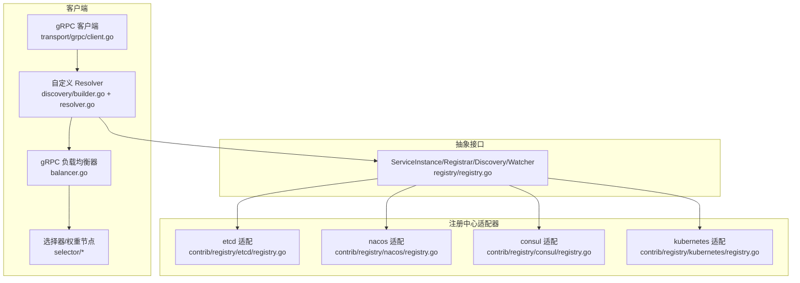
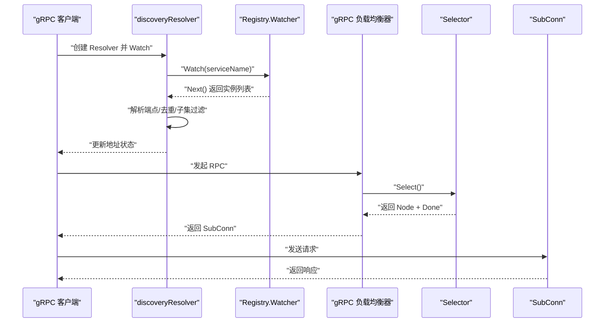
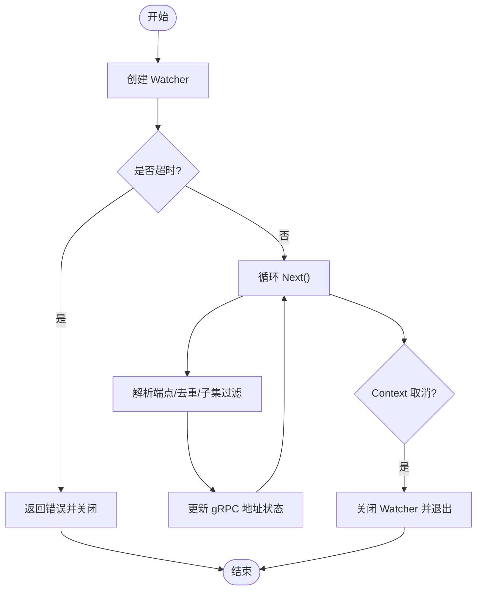
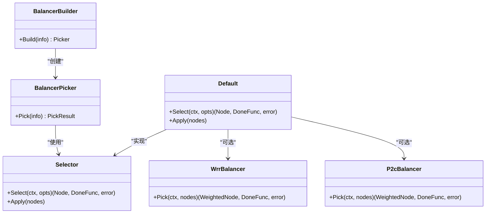
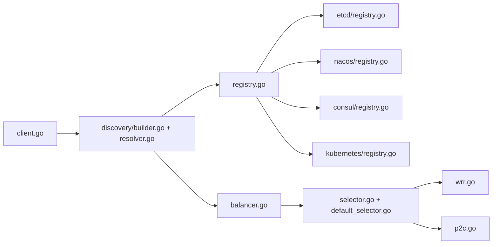

# 服务注册与发现

<cite>
**本文引用的文件**
- [registry/registry.go](file://registry/registry.go)
- [transport/grpc/resolver/discovery/resolver.go](file://transport/grpc/resolver/discovery/resolver.go)
- [transport/grpc/resolver/discovery/builder.go](file://transport/grpc/resolver/discovery/builder.go)
- [transport/grpc/balancer.go](file://transport/grpc/balancer.go)
- [transport/grpc/client.go](file://transport/grpc/client.go)
- [selector/selector.go](file://selector/selector.go)
- [selector/default_selector.go](file://selector/default_selector.go)
- [selector/wrr/wrr.go](file://selector/wrr/wrr.go)
- [selector/p2c/p2c.go](file://selector/p2c/p2c.go)
- [contrib/registry/etcd/registry.go](file://contrib/registry/etcd/registry.go)
- [contrib/registry/nacos/registry.go](file://contrib/registry/nacos/registry.go)
- [contrib/registry/consul/registry.go](file://contrib/registry/consul/registry.go)
- [contrib/registry/kubernetes/registry.go](file://contrib/registry/kubernetes/registry.go)
</cite>

## 目录
1. [引言](#引言)
2. [项目结构](#项目结构)
3. [核心组件](#核心组件)
4. [架构总览](#架构总览)
5. [详细组件分析](#详细组件分析)
6. [依赖关系分析](#依赖关系分析)
7. [性能考量](#性能考量)
8. [故障排查指南](#故障排查指南)
9. [结论](#结论)

## 引言
本文件面向希望在微服务中实现“服务注册与发现”的开发者，系统性梳理 Kratos 框架中的注册中心抽象、客户端 gRPC 解析与负载均衡、以及健康检查与故障转移机制。文档重点覆盖：
- ServiceInstance 结构体字段语义与用途
- Registry 接口的 Register/Deregister 工作方式
- 与多种注册中心（etcd、consul、nacos、kubernetes 等）的适配与统一接入
- 客户端侧 gRPC 调用链：通过自定义 Resolver 从注册中心拉取实例，再由 Selector（如 wrr、p2c）选择实例
- 健康检查与故障转移策略

## 项目结构
围绕服务注册与发现的关键目录与文件：
- 注册中心抽象层：registry/registry.go
- gRPC 客户端解析与负载均衡：transport/grpc/resolver/discovery/*、transport/grpc/balancer.go、transport/grpc/client.go
- 选择器与负载均衡算法：selector/*
- 注册中心适配器：contrib/registry/*/registry.go
- 示例与测试：各适配器目录下的测试文件

图表来源
- [transport/grpc/client.go](file://transport/grpc/client.go#L154-L215)
- [transport/grpc/resolver/discovery/builder.go](file://transport/grpc/resolver/discovery/builder.go#L81-L125)
- [transport/grpc/resolver/discovery/resolver.go](file://transport/grpc/resolver/discovery/resolver.go#L31-L98)
- [transport/grpc/balancer.go](file://transport/grpc/balancer.go#L22-L88)
- [selector/selector.go](file://selector/selector.go#L12-L75)
- [selector/default_selector.go](file://selector/default_selector.go#L21-L86)
- [contrib/registry/etcd/registry.go](file://contrib/registry/etcd/registry.go#L85-L129)
- [contrib/registry/nacos/registry.go](file://contrib/registry/nacos/registry.go#L87-L140)
- [contrib/registry/consul/registry.go](file://contrib/registry/consul/registry.go#L134-L142)
- [contrib/registry/kubernetes/registry.go](file://contrib/registry/kubernetes/registry.go#L111-L163)

章节来源
- [transport/grpc/client.go](file://transport/grpc/client.go#L154-L215)
- [transport/grpc/resolver/discovery/builder.go](file://transport/grpc/resolver/discovery/builder.go#L81-L125)
- [transport/grpc/resolver/discovery/resolver.go](file://transport/grpc/resolver/discovery/resolver.go#L31-L98)
- [transport/grpc/balancer.go](file://transport/grpc/balancer.go#L22-L88)
- [selector/selector.go](file://selector/selector.go#L12-L75)
- [selector/default_selector.go](file://selector/default_selector.go#L21-L86)
- [contrib/registry/etcd/registry.go](file://contrib/registry/etcd/registry.go#L85-L129)
- [contrib/registry/nacos/registry.go](file://contrib/registry/nacos/registry.go#L87-L140)
- [contrib/registry/consul/registry.go](file://contrib/registry/consul/registry.go#L134-L142)
- [contrib/registry/kubernetes/registry.go](file://contrib/registry/kubernetes/registry.go#L111-L163)

## 核心组件
- ServiceInstance：服务实例的统一抽象，包含唯一 ID、服务名、版本、元数据、端点地址等
- Registrar/Discovery/Watcher：注册、发现、监听的统一接口
- 自定义 Resolver：基于 Discovery 的 gRPC Resolver，负责把注册中心的实例列表转换为 gRPC 地址
- gRPC 负载均衡器：将 ReadySCs 转换为 Node 列表，交由 Selector 选择
- Selector：通用选择器接口，支持过滤、权重计算、回调 DoneFunc
- 负载均衡算法：wrr（加权轮询）、p2c（二选一）等

章节来源
- [registry/registry.go](file://registry/registry.go#L36-L96)
- [transport/grpc/resolver/discovery/resolver.go](file://transport/grpc/resolver/discovery/resolver.go#L18-L29)
- [transport/grpc/balancer.go](file://transport/grpc/balancer.go#L22-L88)
- [selector/selector.go](file://selector/selector.go#L12-L75)
- [selector/default_selector.go](file://selector/default_selector.go#L21-L86)

## 架构总览
下图展示一次 gRPC 客户端调用的完整链路：客户端通过 discovery Resolver 订阅注册中心，解析为 gRPC 地址；gRPC 内置负载均衡器使用 Selector 选择实例，最终发起请求。

图表来源
- [transport/grpc/resolver/discovery/resolver.go](file://transport/grpc/resolver/discovery/resolver.go#L31-L98)
- [transport/grpc/resolver/discovery/builder.go](file://transport/grpc/resolver/discovery/builder.go#L81-L125)
- [transport/grpc/balancer.go](file://transport/grpc/balancer.go#L33-L88)
- [selector/selector.go](file://selector/selector.go#L12-L75)

## 详细组件分析

### ServiceInstance 字段语义
- ID：服务实例唯一标识
- Name：服务名称
- Version：服务版本
- Metadata：键值对元数据，可用于版本、区域、协议等标签
- Endpoints：实例的多个端点地址，格式包含协议与地址，例如 http 或 grpc

章节来源
- [registry/registry.go](file://registry/registry.go#L36-L51)

### Registrar/Discovery/Watcher 接口
- Registrar：提供 Register/Deregister，用于服务注册与注销
- Discovery：提供 GetService/Wather，用于查询与监听服务实例
- Watcher：Next/Stop，持续推送实例变更

章节来源
- [registry/registry.go](file://registry/registry.go#L10-L34)

### 自定义 Resolver（discovery）
- 构建阶段：根据 Discovery 创建 Watcher，并在超时时间内完成初始化
- 运行阶段：循环调用 Watcher.Next 获取实例，解析端点、去重、可选子集过滤，写入 gRPC 地址状态
- 关闭阶段：取消上下文并停止 Watcher

图表来源
- [transport/grpc/resolver/discovery/builder.go](file://transport/grpc/resolver/discovery/builder.go#L81-L125)
- [transport/grpc/resolver/discovery/resolver.go](file://transport/grpc/resolver/discovery/resolver.go#L31-L98)

章节来源
- [transport/grpc/resolver/discovery/builder.go](file://transport/grpc/resolver/discovery/builder.go#L81-L125)
- [transport/grpc/resolver/discovery/resolver.go](file://transport/grpc/resolver/discovery/resolver.go#L31-L98)

### gRPC 负载均衡器与 Selector
- gRPC 负载均衡器：将 ReadySCs 转换为 Node 列表，构建 Selector 并 Apply 实例
- Selector：支持 NodeFilter 过滤、权重节点、Done 回调，返回选定 Node
- 默认全局 Selector：若未设置，初始化为 wrr

图表来源
- [transport/grpc/balancer.go](file://transport/grpc/balancer.go#L22-L88)
- [selector/selector.go](file://selector/selector.go#L12-L75)
- [selector/default_selector.go](file://selector/default_selector.go#L21-L86)
- [selector/wrr/wrr.go](file://selector/wrr/wrr.go#L58-L127)
- [selector/p2c/p2c.go](file://selector/p2c/p2c.go#L53-L100)

章节来源
- [transport/grpc/balancer.go](file://transport/grpc/balancer.go#L22-L88)
- [selector/selector.go](file://selector/selector.go#L12-L75)
- [selector/default_selector.go](file://selector/default_selector.go#L21-L86)
- [selector/wrr/wrr.go](file://selector/wrr/wrr.go#L58-L127)
- [selector/p2c/p2c.go](file://selector/p2c/p2c.go#L53-L100)

### 与注册中心的集成（contrib/registry）
- etcd：支持 TTL 心跳、租约续期、失败重试、并发心跳管理
- nacos：按端点解析协议，注入 kind/version 元数据，支持分组/集群/权重
- consul：可配置健康检查、心跳、TTL、检查间隔、注销临界时间
- kubernetes：基于 Pod 标签/注解解析服务实例，通过 Informer 监听变化

章节来源
- [contrib/registry/etcd/registry.go](file://contrib/registry/etcd/registry.go#L85-L129)
- [contrib/registry/etcd/registry.go](file://contrib/registry/etcd/registry.go#L175-L242)
- [contrib/registry/nacos/registry.go](file://contrib/registry/nacos/registry.go#L87-L140)
- [contrib/registry/nacos/registry.go](file://contrib/registry/nacos/registry.go#L171-L209)
- [contrib/registry/consul/registry.go](file://contrib/registry/consul/registry.go#L134-L142)
- [contrib/registry/kubernetes/registry.go](file://contrib/registry/kubernetes/registry.go#L111-L163)

### 客户端 gRPC 配置与启动
- 默认全局 Selector：初始化为 wrr
- Dial 时可指定 Discovery、子集大小、健康检查、调试日志等
- 通过 WithResolvers 注入 discovery 解析器

章节来源
- [transport/grpc/client.go](file://transport/grpc/client.go#L27-L31)
- [transport/grpc/client.go](file://transport/grpc/client.go#L154-L215)

## 依赖关系分析
- 客户端 gRPC 依赖 discovery Resolver，Resolver 依赖 Discovery 接口
- Resolver 将实例转换为 gRPC 地址，gRPC 负载均衡器依赖 Selector
- Selector 依赖 WeightedNode/Node 抽象，具体算法（wrr/p2c）实现 Balancer
- 各注册中心实现统一的 Registrar/Discovery 接口，供 Resolver 使用

图表来源
- [transport/grpc/client.go](file://transport/grpc/client.go#L154-L215)
- [transport/grpc/resolver/discovery/builder.go](file://transport/grpc/resolver/discovery/builder.go#L81-L125)
- [transport/grpc/resolver/discovery/resolver.go](file://transport/grpc/resolver/discovery/resolver.go#L31-L98)
- [transport/grpc/balancer.go](file://transport/grpc/balancer.go#L22-L88)
- [selector/selector.go](file://selector/selector.go#L12-L75)
- [selector/default_selector.go](file://selector/default_selector.go#L21-L86)
- [selector/wrr/wrr.go](file://selector/wrr/wrr.go#L58-L127)
- [selector/p2c/p2c.go](file://selector/p2c/p2c.go#L53-L100)
- [registry/registry.go](file://registry/registry.go#L10-L34)
- [contrib/registry/etcd/registry.go](file://contrib/registry/etcd/registry.go#L85-L129)
- [contrib/registry/nacos/registry.go](file://contrib/registry/nacos/registry.go#L87-L140)
- [contrib/registry/consul/registry.go](file://contrib/registry/consul/registry.go#L134-L142)
- [contrib/registry/kubernetes/registry.go](file://contrib/registry/kubernetes/registry.go#L111-L163)

## 性能考量
- 子集过滤：Resolver 支持子集大小参数，减少 gRPC 地址数量，降低连接与负载均衡压力
- 去重与过滤：解析端点时去重冗余地址，避免重复连接
- 心跳与重试：etcd 适配器内置租约与心跳续期，失败时指数回退重试
- 负载均衡算法：
  - wrr：基于有效权重的轮询，节点变更时清理过期权重映射
  - p2c：二选一策略，结合 EWMA 成功率与延迟，必要时强制选择未被选过的节点以触发更新
- 健康检查：gRPC 负载均衡器启用 HealthCheck，结合注册中心健康检查（如 consul TTL/检查）

章节来源
- [transport/grpc/resolver/discovery/resolver.go](file://transport/grpc/resolver/discovery/resolver.go#L51-L98)
- [contrib/registry/etcd/registry.go](file://contrib/registry/etcd/registry.go#L175-L242)
- [selector/wrr/wrr.go](file://selector/wrr/wrr.go#L58-L127)
- [selector/p2c/p2c.go](file://selector/p2c/p2c.go#L53-L100)
- [transport/grpc/balancer.go](file://transport/grpc/balancer.go#L22-L31)

## 故障排查指南
- Watcher 初始化超时：builder 提供超时选项，超时会返回特定错误
- 解析端点失败：Resolver 在解析端点时记录错误日志并跳过无效条目
- 无可用节点：Selector 返回“无可用节点”错误，检查注册中心是否正确注册、过滤条件是否过于严格
- etcd 心跳异常：心跳通道关闭或租约失效时，自动尝试重新注册并保持 KeepAlive
- consul 健康检查：可配置 TTL/检查间隔/注销临界时间，确保异常实例及时摘除

章节来源
- [transport/grpc/resolver/discovery/builder.go](file://transport/grpc/resolver/discovery/builder.go#L15-L20)
- [transport/grpc/resolver/discovery/resolver.go](file://transport/grpc/resolver/discovery/resolver.go#L31-L49)
- [selector/selector.go](file://selector/selector.go#L9-L11)
- [contrib/registry/etcd/registry.go](file://contrib/registry/etcd/registry.go#L175-L242)
- [contrib/registry/consul/registry.go](file://contrib/registry/consul/registry.go#L134-L142)

## 结论
Kratos 的服务注册与发现体系以统一的 ServiceInstance/Registrar/Discovery/Watcher 抽象为核心，通过 discovery Resolver 将注册中心实例无缝对接到 gRPC 地址空间，并借助 Selector 与负载均衡算法实现高可用与高性能的动态通信。配合各注册中心适配器的健康检查与心跳机制，可在多云/混合部署场景下稳定地实现服务发现与故障转移。