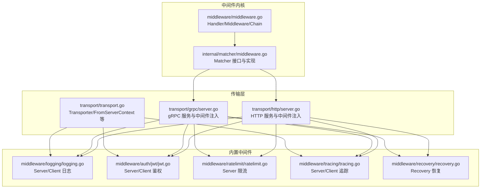
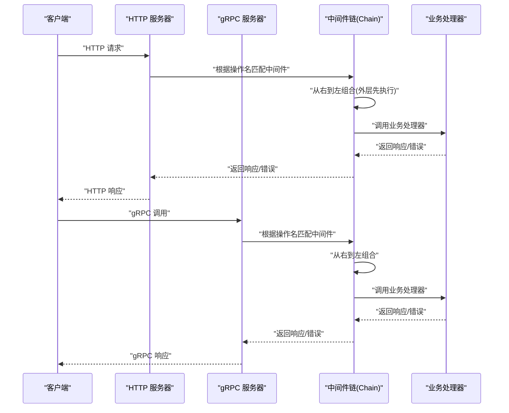
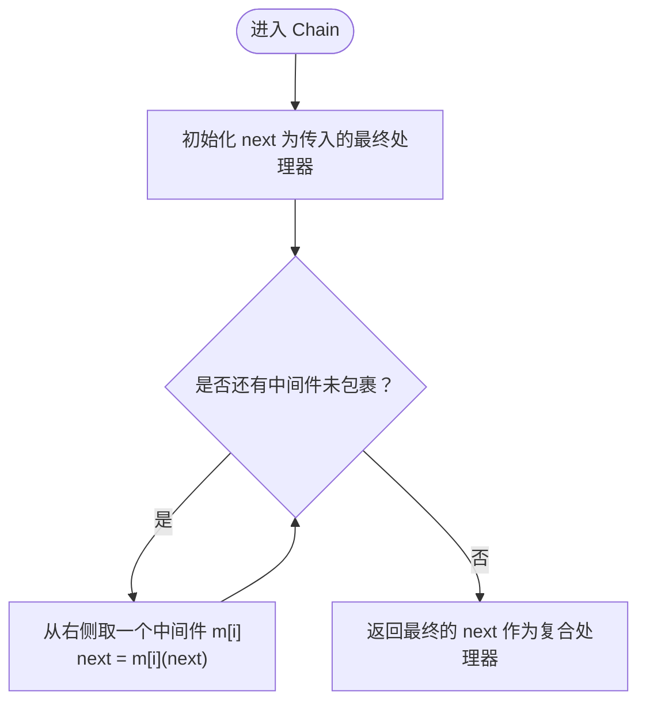
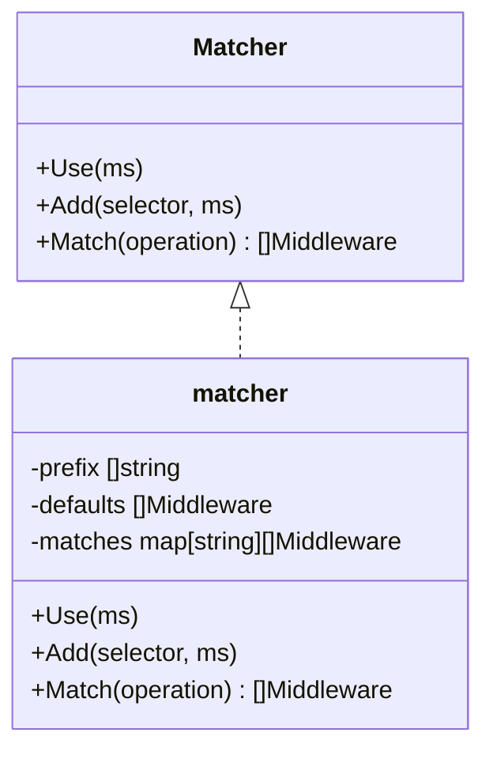
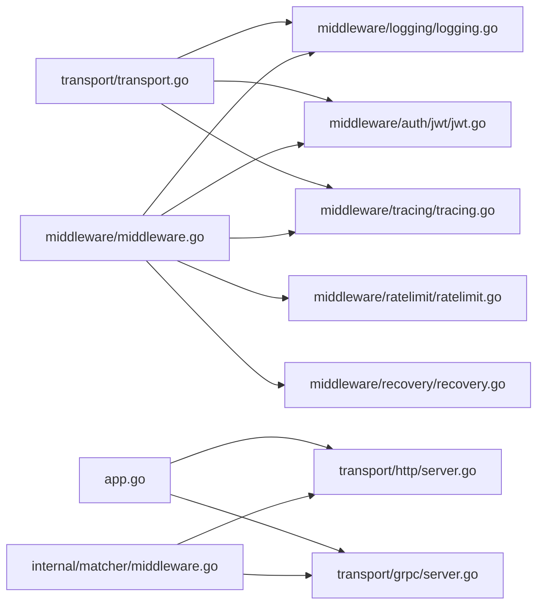

# 中间件模式

<cite>
**本文引用的文件列表**
- [middleware.go](file://middleware/middleware.go)
- [middleware_test.go](file://middleware/middleware_test.go)
- [matcher.go](file://internal/matcher/middleware.go)
- [logging.go](file://middleware/logging/logging.go)
- [jwt.go](file://middleware/auth/jwt/jwt.go)
- [ratelimit.go](file://middleware/ratelimit/ratelimit.go)
- [tracing.go](file://middleware/tracing/tracing.go)
- [recovery.go](file://middleware/recovery/recovery.go)
- [server.go (HTTP)](file://transport/http/server.go)
- [server.go (gRPC)](file://transport/grpc/server.go)
- [transport.go](file://transport/transport.go)
- [app.go](file://app.go)
</cite>

## 目录
1. [引言](#引言)
2. [项目结构与总体设计](#项目结构与总体设计)
3. [核心组件](#核心组件)
4. [架构总览](#架构总览)
5. [详细组件分析](#详细组件分析)
6. [依赖关系分析](#依赖关系分析)
7. [性能考量与优化建议](#性能考量与优化建议)
8. [故障排查指南](#故障排查指南)
9. [结论](#结论)

## 引言
本文件系统性阐述 Kratos 框架中的“中间件模式”，聚焦函数式中间件的设计哲学与实现细节。文档围绕 Handler 与 Middleware 两个核心接口展开，解释 func(Handler) Handler 的高阶函数模式如何实现请求处理链的动态编织；深入剖析 Chain 函数的组合顺序为何采用从右到左，以确保正确的执行流程；并通过验证、追踪、日志等内置中间件示例，展示如何将多个中间件组合为复合中间件，并说明其在 HTTP 与 gRPC 协议下的统一应用方式。此外，文档还讨论了中间件在请求处理流程中的执行时机、如何通过 context.Context 实现跨中间件数据传递，以及内置中间件的使用方法与性能优化建议。

## 项目结构与总体设计
- 中间件内核位于 middleware 包，定义 Handler 与 Middleware 类型及 Chain 组合函数。
- 内置中间件分布在 middleware 子目录下，涵盖鉴权、限流、日志、追踪、恢复等能力。
- 传输层（HTTP/gRPC）通过匹配器（matcher）将中间件按操作路径或前缀选择性地织入处理链。
- 传输上下文（transport.Context）提供从 context 中提取请求元信息的能力，支撑中间件对请求头、操作名等的访问。

图表来源
- [middleware.go](file://middleware/middleware.go#L1-L21)
- [matcher.go](file://internal/matcher/middleware.go#L1-L62)
- [logging.go](file://middleware/logging/logging.go#L1-L120)
- [jwt.go](file://middleware/auth/jwt/jwt.go#L1-L178)
- [ratelimit.go](file://middleware/ratelimit/ratelimit.go#L1-L53)
- [tracing.go](file://middleware/tracing/tracing.go#L1-L97)
- [recovery.go](file://middleware/recovery/recovery.go#L1-L63)
- [server.go (HTTP)](file://transport/http/server.go#L1-L200)
- [server.go (gRPC)](file://transport/grpc/server.go#L1-L200)
- [transport.go](file://transport/transport.go#L47-L95)

章节来源
- [middleware.go](file://middleware/middleware.go#L1-L21)
- [matcher.go](file://internal/matcher/middleware.go#L1-L62)
- [server.go (HTTP)](file://transport/http/server.go#L1-L200)
- [server.go (gRPC)](file://transport/grpc/server.go#L1-L200)
- [transport.go](file://transport/transport.go#L47-L95)

## 核心组件
- Handler：统一的请求处理器签名，接收 context.Context 和任意请求对象，返回响应对象与错误。
- Middleware：函数式中间件类型，接收一个 Handler 并返回一个新的 Handler，形成可叠加的处理链。
- Chain：将多个中间件从右到左组合，返回最终的复合 Handler，保证调用顺序符合“外层先执行，内层后执行”的语义。

章节来源
- [middleware.go](file://middleware/middleware.go#L1-L21)

## 架构总览
中间件模式在 HTTP 与 gRPC 服务中保持一致的抽象与组合方式：
- 传输层通过 matcher.Matcher 将默认中间件与按操作路径/前缀匹配的中间件合并。
- HTTP 使用路由与过滤器链，gRPC 使用拦截器链，二者均以中间件组合后的 Handler 作为末端节点。
- 中间件通过 transport.Context 提供的 FromServerContext/FromClientContext 获取请求元信息，实现跨协议统一。

图表来源
- [server.go (HTTP)](file://transport/http/server.go#L1-L200)
- [server.go (gRPC)](file://transport/grpc/server.go#L1-L200)
- [matcher.go](file://internal/matcher/middleware.go#L1-L62)
- [middleware.go](file://middleware/middleware.go#L1-L21)

## 详细组件分析

### Handler 与 Middleware 设计哲学
- Handler 抽象了“请求-响应”处理过程，屏蔽协议差异，使中间件可以无感地作用于不同传输层。
- Middleware 采用函数式组合，每个中间件只关心“如何包裹下一个处理器”，从而实现横切关注点的模块化与可插拔。

章节来源
- [middleware.go](file://middleware/middleware.go#L1-L21)

### Chain 组合机制与执行顺序
- Chain 通过从右到左的遍历顺序，将中间件逐个包裹到 next 上，形成“外层先执行，内层后执行”的调用链。
- 测试用例验证了组合顺序与副作用累积的正确性，展示了中间件链的执行时序。

图表来源
- [middleware.go](file://middleware/middleware.go#L1-L21)
- [middleware_test.go](file://middleware/middleware_test.go#L1-L62)

章节来源
- [middleware.go](file://middleware/middleware.go#L1-L21)
- [middleware_test.go](file://middleware/middleware_test.go#L1-L62)

### 匹配器（Matcher）与按操作选择中间件
- Matcher 支持 Use 默认中间件与 Add 按路径/前缀匹配的中间件集合。
- Match 会先合并默认中间件，再根据精确匹配或最长前缀匹配返回最终中间件序列。
- HTTP 与 gRPC 服务均通过 ServerOption 注入 Matcher，实现按操作维度的中间件选择。

图表来源
- [matcher.go](file://internal/matcher/middleware.go#L1-L62)

章节来源
- [matcher.go](file://internal/matcher/middleware.go#L1-L62)
- [server.go (HTTP)](file://transport/http/server.go#L1-L200)
- [server.go (gRPC)](file://transport/grpc/server.go#L1-L200)

### 日志中间件（Logging）
- Server/Client 分别记录服务端与客户端侧的日志，包含组件类型、操作名、请求参数、状态码、原因、堆栈与耗时。
- 通过 transport.Context 提取请求元信息，支持 HTTP 与 gRPC 的统一日志输出。

章节来源
- [logging.go](file://middleware/logging/logging.go#L1-L120)
- [transport.go](file://transport/transport.go#L47-L95)

### JWT 鉴权中间件（Auth/JWT）
- Server：从请求头解析 Bearer Token，校验签名方法与有效性，将 Claims 写入 context，供后续处理器使用。
- Client：基于 Key Provider 生成签名 Token，并写入请求头，实现跨服务鉴权。
- 提供 WithSigningMethod、WithClaims、WithTokenHeader 等选项以灵活配置。

章节来源
- [jwt.go](file://middleware/auth/jwt/jwt.go#L1-L178)
- [transport.go](file://transport/transport.go#L47-L95)

### 限流中间件（RateLimit）
- Server：基于限流器（默认 BBR）判断是否允许请求，允许则调用下游处理器，并在完成后回调 DoneInfo。
- 支持自定义限流器实现，便于集成不同策略。

章节来源
- [ratelimit.go](file://middleware/ratelimit/ratelimit.go#L1-L53)

### 追踪中间件（Tracing）
- Server/Client：基于 OpenTelemetry Tracer 创建 Span，记录请求与响应信息，结束时上报结果。
- 支持自定义 Propagator、TracerProvider 与 Tracer 名称，适配不同观测平台。

章节来源
- [tracing.go](file://middleware/tracing/tracing.go#L1-L97)
- [transport.go](file://transport/transport.go#L47-L95)

### 恢复中间件（Recovery）
- Recovery：捕获 panic，记录堆栈与请求信息，将错误转换为统一格式，同时可通过 context 传递延迟等指标。

章节来源
- [recovery.go](file://middleware/recovery/recovery.go#L1-L63)

### HTTP 与 gRPC 的统一应用
- HTTP：通过 ServerOption.Middleware 注入中间件，结合路由与过滤器链，最终由路由处理器调用组合后的 Handler。
- gRPC：通过 ServerOption.Middleware/StreamMiddleware 注入中间件，内部以拦截器链形式串联，最终由业务方法调用组合后的 Handler。

章节来源
- [server.go (HTTP)](file://transport/http/server.go#L1-L200)
- [server.go (gRPC)](file://transport/grpc/server.go#L1-L200)

## 依赖关系分析
- 中间件内核（Handler/Middleware/Chain）被所有内置中间件依赖，形成稳定的横切层。
- 传输层（HTTP/gRPC）通过 matcher.Matcher 与 transport.Context 解耦协议细节，实现中间件的统一注入与执行。
- 应用生命周期（App）负责启动/停止各传输层服务，确保中间件链在服务运行期间生效。

图表来源
- [middleware.go](file://middleware/middleware.go#L1-L21)
- [logging.go](file://middleware/logging/logging.go#L1-L120)
- [jwt.go](file://middleware/auth/jwt/jwt.go#L1-L178)
- [ratelimit.go](file://middleware/ratelimit/ratelimit.go#L1-L53)
- [tracing.go](file://middleware/tracing/tracing.go#L1-L97)
- [recovery.go](file://middleware/recovery/recovery.go#L1-L63)
- [matcher.go](file://internal/matcher/middleware.go#L1-L62)
- [server.go (HTTP)](file://transport/http/server.go#L1-L200)
- [server.go (gRPC)](file://transport/grpc/server.go#L1-L200)
- [transport.go](file://transport/transport.go#L47-L95)
- [app.go](file://app.go#L1-L200)

## 性能考量与优化建议
- 中间件顺序与职责划分：将轻量且快速的中间件置于链前端（如限流、恢复），重负载中间件（如日志、追踪）置于后端，减少对高频路径的影响。
- 日志与追踪：在高并发场景下，建议开启采样或异步落盘，避免阻塞请求处理主路径。
- 限流策略：优先使用本地限流器（如 BBR）以降低外部依赖开销；对于跨实例限流，需评估一致性与性能权衡。
- 上下文传递：尽量避免在中间件中频繁创建大对象，通过 context 传递必要信息，减少拷贝与分配。
- 中间件组合：合理拆分中间件职责，避免单个中间件承担过多逻辑，提升可维护性与可测试性。

## 故障排查指南
- 鉴权失败：检查 Authorization 头格式与签名方法是否匹配，确认 KeyFunc 正确配置。
- 限流拒绝：查看限流器状态与阈值配置，确认请求是否被正确放行。
- 追踪缺失：确认 TracerProvider/Propagator 配置正确，请求头传播是否生效。
- 恢复异常：关注 panic 堆栈与请求上下文，定位问题根因并修复上游逻辑。
- 日志不完整：检查日志中间件是否正确包裹，确认 transport.Context 是否包含请求元信息。

章节来源
- [jwt.go](file://middleware/auth/jwt/jwt.go#L1-L178)
- [ratelimit.go](file://middleware/ratelimit/ratelimit.go#L1-L53)
- [tracing.go](file://middleware/tracing/tracing.go#L1-L97)
- [recovery.go](file://middleware/recovery/recovery.go#L1-L63)
- [logging.go](file://middleware/logging/logging.go#L1-L120)

## 结论
Kratos 的中间件模式以函数式组合为核心，通过 Handler 与 Middleware 的清晰抽象，实现了 HTTP 与 gRPC 的统一中间件体系。Chain 从右到左的组合顺序确保了外层中间件先执行、内层后执行的语义，配合 matcher 的按操作选择与 transport.Context 的上下文能力，使得中间件可以在不同协议与场景下灵活、高效地工作。内置中间件覆盖鉴权、限流、日志、追踪与恢复等关键能力，开发者可按需组合，构建稳定、可观测、可扩展的服务处理链。