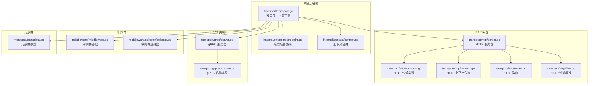
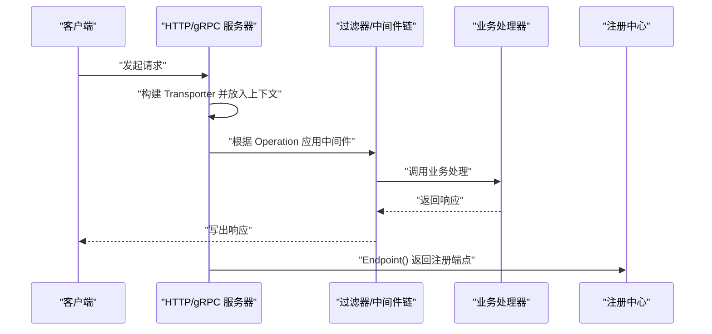
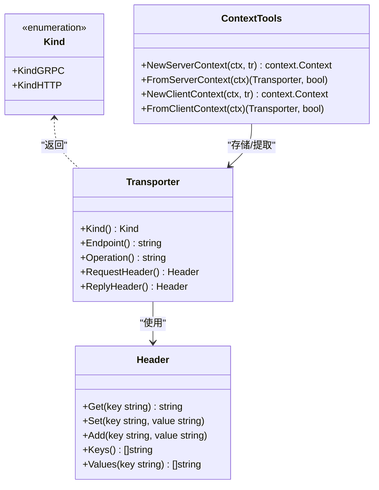
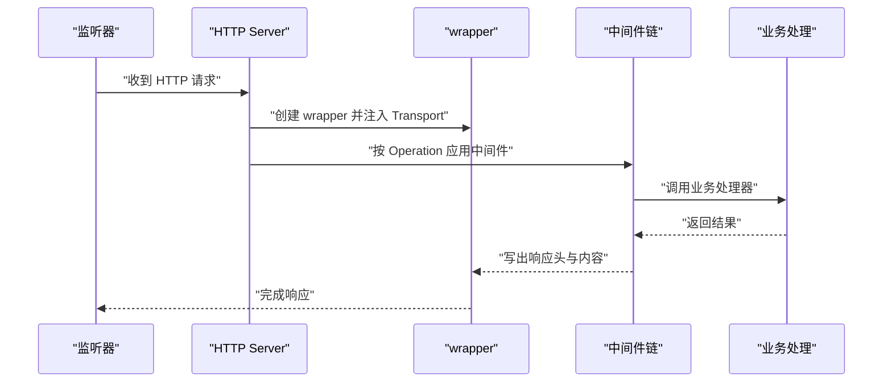
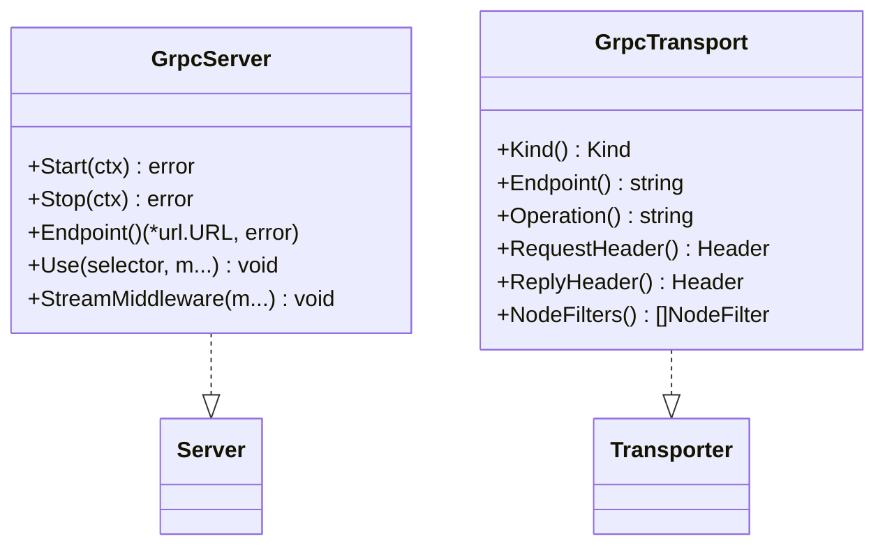
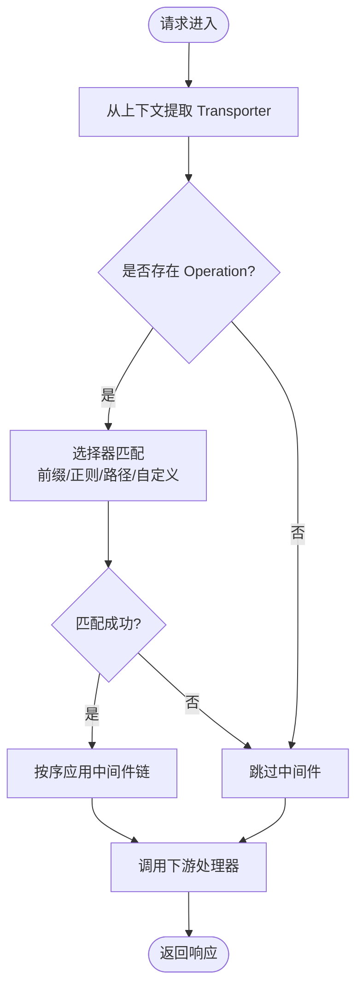
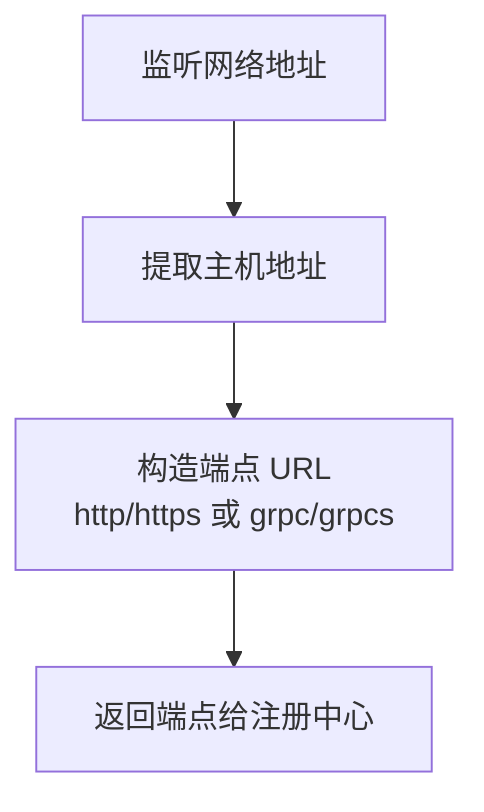
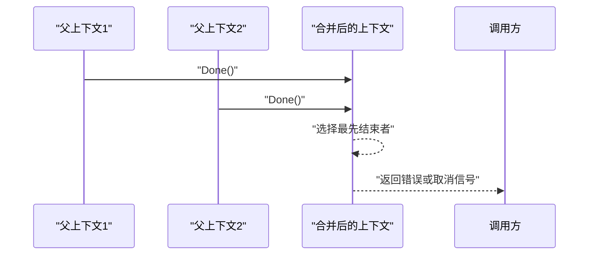
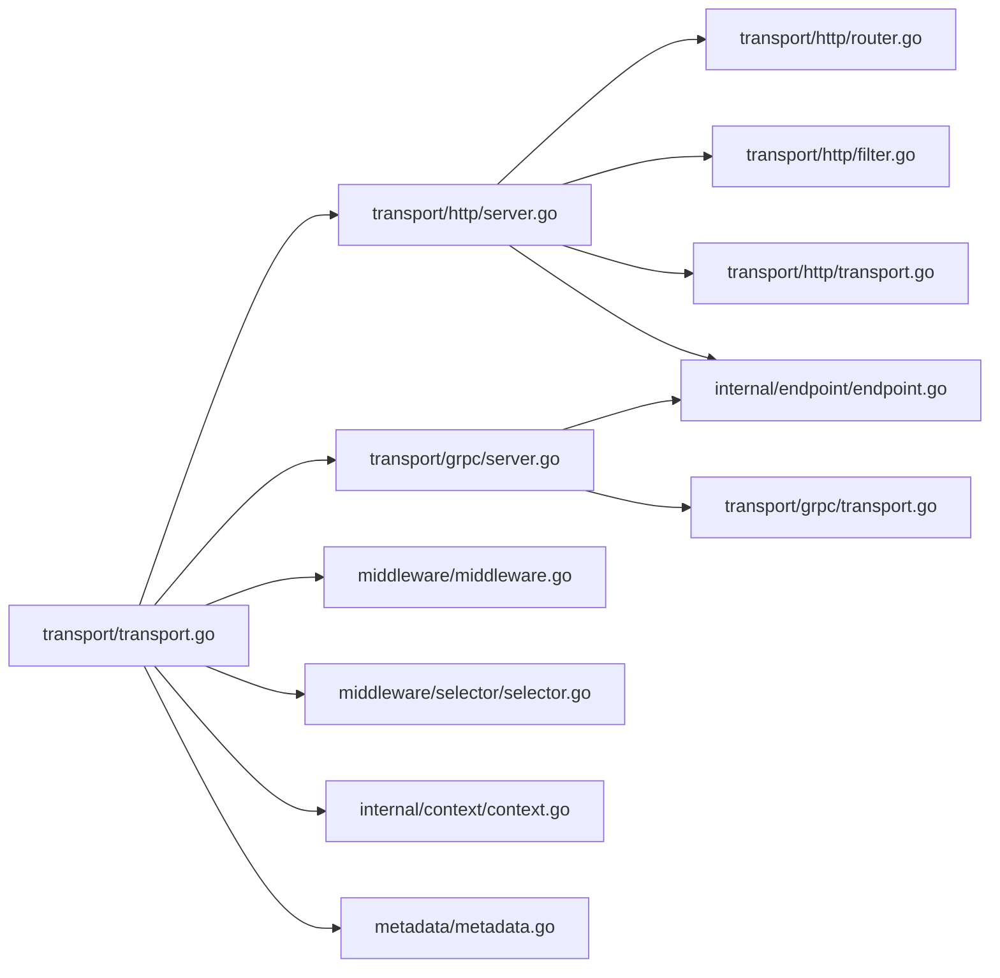

# 传输层抽象

<cite>
**本文引用的文件列表**
- [transport/transport.go](file://transport/transport.go)
- [transport/grpc/server.go](file://transport/grpc/server.go)
- [transport/grpc/transport.go](file://transport/grpc/transport.go)
- [transport/http/server.go](file://transport/http/server.go)
- [transport/http/transport.go](file://transport/http/transport.go)
- [transport/http/context.go](file://transport/http/context.go)
- [transport/http/router.go](file://transport/http/router.go)
- [transport/http/filter.go](file://transport/http/filter.go)
- [internal/endpoint/endpoint.go](file://internal/endpoint/endpoint.go)
- [internal/context/context.go](file://internal/context/context.go)
- [middleware/middleware.go](file://middleware/middleware.go)
- [middleware/selector/selector.go](file://middleware/selector/selector.go)
- [metadata/metadata.go](file://metadata/metadata.go)
</cite>

## 目录
1. [引言](#引言)
2. [项目结构](#项目结构)
3. [核心组件](#核心组件)
4. [架构总览](#架构总览)
5. [详细组件分析](#详细组件分析)
6. [依赖关系分析](#依赖关系分析)
7. [性能考量](#性能考量)
8. [故障排查指南](#故障排查指南)
9. [结论](#结论)
10. [附录](#附录)

## 引言
本文件系统性梳理 Kratos 传输层抽象，围绕 Transporter 接口如何统一 HTTP 与 gRPC 两种通信协议展开，重点解释 KindGRPC 与 KindHTTP 的枚举定义及其在中间件路由中的作用；阐述 Server 与 Endpointer 接口的设计原理，说明 Start/Stop 方法如何实现服务的启动与关闭，Endpoint 方法如何暴露服务地址供注册中心发现；深入分析上下文传递机制，包括 NewServerContext/FromServerContext 与 NewClientContext/FromClientContext 函数如何在请求链路中传递传输层元数据；结合代码示例路径展示如何为 HTTP 和 gRPC 服务器设置自定义 Endpoint；说明 RequestHeader 与 ReplyHeader 接口如何抽象不同协议的头部操作；最后讨论传输层与中间件系统的集成方式，以及如何通过统一接口简化跨协议的治理策略实现。

## 项目结构
传输层相关代码主要分布在 transport 子包中，分别提供 HTTP 与 gRPC 的具体实现，同时在 transport 根目录下定义了通用接口、枚举与上下文工具。内部 endpoint 包负责端点 URL 的构造与解析，internal/context 提供上下文合并能力，middleware 与 middleware/selector 提供中间件与选择器能力。

图表来源
- [transport/transport.go](file://transport/transport.go#L1-L96)
- [transport/http/server.go](file://transport/http/server.go#L1-L375)
- [transport/http/transport.go](file://transport/http/transport.go#L1-L152)
- [transport/http/context.go](file://transport/http/context.go#L1-L188)
- [transport/http/router.go](file://transport/http/router.go#L1-L102)
- [transport/http/filter.go](file://transport/http/filter.go#L1-L17)
- [transport/grpc/server.go](file://transport/grpc/server.go#L1-L278)
- [transport/grpc/transport.go](file://transport/grpc/transport.go#L1-L85)
- [internal/endpoint/endpoint.go](file://internal/endpoint/endpoint.go#L1-L35)
- [internal/context/context.go](file://internal/context/context.go#L1-L116)
- [middleware/middleware.go](file://middleware/middleware.go#L1-L21)
- [middleware/selector/selector.go](file://middleware/selector/selector.go#L1-L144)
- [metadata/metadata.go](file://metadata/metadata.go#L1-L63)

章节来源
- [transport/transport.go](file://transport/transport.go#L1-L96)
- [transport/http/server.go](file://transport/http/server.go#L1-L375)
- [transport/grpc/server.go](file://transport/grpc/server.go#L1-L278)
- [internal/endpoint/endpoint.go](file://internal/endpoint/endpoint.go#L1-L35)

## 核心组件
- 传输层接口与上下文工具
  - Transporter：统一抽象，包含 Kind、Endpoint、Operation、RequestHeader、ReplyHeader 等方法，用于跨协议传递传输信息。
  - Kind：枚举 KindGRPC 与 KindHTTP，标识传输类型。
  - Header：抽象头部读写接口，屏蔽 HTTP 与 gRPC 的差异。
  - 上下文工具：NewServerContext/NewClientContext/FromServerContext/FromClientContext，用于在请求链路中携带 Transporter。
- 服务器与端点接口
  - Server：统一 Start/Stop 生命周期管理。
  - Endpointer：统一 Endpoint() 返回注册用的端点 URL。
- HTTP 与 gRPC 具体实现
  - HTTP Server：封装 http.Server，支持路由、过滤器、中间件匹配、端点生成等。
  - gRPC Server：封装 grpc.Server，支持健康检查、反射、管理员接口、端点生成等。
  - HTTP 与 gRPC Transport：实现 Transporter 接口，分别适配 http.Header 与 metadata.MD 的头部操作。
- 中间件与选择器
  - middleware：定义中间件链式组合。
  - middleware/selector：基于 Operation 或自定义匹配函数选择性应用中间件。

章节来源
- [transport/transport.go](file://transport/transport.go#L1-L96)
- [transport/http/transport.go](file://transport/http/transport.go#L1-L152)
- [transport/grpc/transport.go](file://transport/grpc/transport.go#L1-L85)
- [middleware/middleware.go](file://middleware/middleware.go#L1-L21)
- [middleware/selector/selector.go](file://middleware/selector/selector.go#L1-L144)

## 架构总览
传输层通过统一接口屏蔽 HTTP 与 gRPC 的差异，使上层业务逻辑无需感知底层协议细节。HTTP 与 gRPC 各自实现 Server、Transporter 与 Endpointer，配合中间件选择器按 Operation 进行路由匹配，最终通过 Endpointer 暴露端点供注册中心使用。

图表来源
- [transport/http/server.go](file://transport/http/server.go#L273-L308)
- [transport/http/transport.go](file://transport/http/transport.go#L1-L152)
- [transport/grpc/server.go](file://transport/grpc/server.go#L225-L234)
- [transport/grpc/transport.go](file://transport/grpc/transport.go#L1-L85)
- [middleware/selector/selector.go](file://middleware/selector/selector.go#L1-L144)

## 详细组件分析

### 传输层接口与上下文传递
- Transporter 接口
  - Kind()：返回 KindGRPC 或 KindHTTP。
  - Endpoint()：返回服务端或客户端端点字符串。
  - Operation()：返回服务全限定名或路径模板，作为中间件匹配依据。
  - RequestHeader()/ReplyHeader()：返回 Header 抽象，屏蔽 HTTP 与 gRPC 头部差异。
- Kind 枚举
  - KindGRPC：标识 gRPC 传输。
  - KindHTTP：标识 HTTP 传输。
- Header 抽象
  - Get/Set/Add/Keys/Values：统一头部读写与遍历。
- 上下文工具
  - NewServerContext/FromServerContext：在服务端请求上下文中存储与提取 Transporter。
  - NewClientContext/FromClientContext：在客户端请求上下文中存储与提取 Transporter。

图表来源
- [transport/transport.go](file://transport/transport.go#L1-L96)

章节来源
- [transport/transport.go](file://transport/transport.go#L1-L96)

### HTTP 服务器与传输实现
- Server
  - Start/Stop：监听端口、启动服务、优雅关闭。
  - Endpoint：生成端点 URL（http 或 https）。
  - Use：基于 Operation 的中间件匹配。
  - ServeHTTP：在请求进入时创建 Transport，注入上下文，应用过滤器与中间件。
- Transport（HTTP）
  - 实现 Transporter 接口，封装 http.Request/http.ResponseWriter。
  - RequestHeader/ReplyHeader：适配 http.Header。
  - PathTemplate：记录路径模板，用于中间件匹配。
- 上下文包装
  - wrapper：实现 Context 接口，提供 Vars/Query/Form/Header/Bind/Returns 等便捷方法，并支持中间件链按 Operation 匹配。

图表来源
- [transport/http/server.go](file://transport/http/server.go#L273-L308)
- [transport/http/transport.go](file://transport/http/transport.go#L1-L152)
- [transport/http/context.go](file://transport/http/context.go#L1-L188)
- [transport/http/router.go](file://transport/http/router.go#L1-L102)

章节来源
- [transport/http/server.go](file://transport/http/server.go#L1-L375)
- [transport/http/transport.go](file://transport/http/transport.go#L1-L152)
- [transport/http/context.go](file://transport/http/context.go#L1-L188)
- [transport/http/router.go](file://transport/http/router.go#L1-L102)

### gRPC 服务器与传输实现
- Server
  - Start/Stop：监听端口、启动服务、优雅停止。
  - Endpoint：生成端点 URL（grpc 或 grpcs）。
  - Use/StreamMiddleware：基于 Operation 的中间件匹配。
  - 注册健康检查、反射与管理员接口。
- Transport（gRPC）
  - 实现 Transporter 接口，封装 metadata.MD。
  - RequestHeader/ReplyHeader：适配 metadata.MD。
  - NodeFilters：客户端节点过滤器集合。

图表来源
- [transport/grpc/server.go](file://transport/grpc/server.go#L1-L278)
- [transport/grpc/transport.go](file://transport/grpc/transport.go#L1-L85)

章节来源
- [transport/grpc/server.go](file://transport/grpc/server.go#L1-L278)
- [transport/grpc/transport.go](file://transport/grpc/transport.go#L1-L85)

### 中间件与路由匹配
- 中间件链
  - middleware.Chain：将多个中间件按顺序组合。
- 选择器
  - middleware/selector：支持前缀、正则、路径精确匹配与自定义 MatchFunc，基于 Transporter.Operation() 决定是否应用中间件。
- HTTP 路由
  - Router/RouteInfo：提供多方法路由注册与遍历。
  - FilterChain：HTTP 层过滤器链组合。

图表来源
- [middleware/selector/selector.go](file://middleware/selector/selector.go#L1-L144)
- [transport/http/context.go](file://transport/http/context.go#L1-L188)
- [transport/http/transport.go](file://transport/http/transport.go#L1-L152)

章节来源
- [middleware/middleware.go](file://middleware/middleware.go#L1-L21)
- [middleware/selector/selector.go](file://middleware/selector/selector.go#L1-L144)
- [transport/http/context.go](file://transport/http/context.go#L1-L188)
- [transport/http/router.go](file://transport/http/router.go#L1-L102)

### 端点生成与注册
- internal/endpoint
  - NewEndpoint：构造端点 URL（scheme:host）。
  - ParseEndpoint：从多个端点中按 scheme 解析 host。
  - Scheme：根据 isSecure 切换 http/https 或 grpc/grpcs。
- HTTP/gRPC Server
  - Endpoint()：在监听后生成端点 URL，供注册中心使用。
  - Start()：启动监听，日志输出监听地址。

图表来源
- [internal/endpoint/endpoint.go](file://internal/endpoint/endpoint.go#L1-L35)
- [transport/http/server.go](file://transport/http/server.go#L310-L375)
- [transport/grpc/server.go](file://transport/grpc/server.go#L214-L278)

章节来源
- [internal/endpoint/endpoint.go](file://internal/endpoint/endpoint.go#L1-L35)
- [transport/http/server.go](file://transport/http/server.go#L310-L375)
- [transport/grpc/server.go](file://transport/grpc/server.go#L214-L278)

### 上下文合并与传输层元数据传递
- internal/context
  - Merge：合并两个上下文，以最先结束者为准，支持 Deadline 与 Value 继承。
- 传输层元数据
  - HTTP：通过 wrapper.Header/ResponseHeader 访问请求/响应头。
  - gRPC：通过 headerCarrier 访问 metadata.MD。
- 元数据模型
  - metadata/Metadata：统一的键值对元数据表示，便于跨协议转换。

图表来源
- [internal/context/context.go](file://internal/context/context.go#L1-L116)
- [transport/http/context.go](file://transport/http/context.go#L1-L188)
- [transport/grpc/transport.go](file://transport/grpc/transport.go#L1-L85)
- [metadata/metadata.go](file://metadata/metadata.go#L1-L63)

章节来源
- [internal/context/context.go](file://internal/context/context.go#L1-L116)
- [transport/http/context.go](file://transport/http/context.go#L1-L188)
- [transport/grpc/transport.go](file://transport/grpc/transport.go#L1-L85)
- [metadata/metadata.go](file://metadata/metadata.go#L1-L63)

## 依赖关系分析
- 低耦合高内聚
  - transport/transport.go 定义通用接口，HTTP/gRPC 分别实现，避免上层依赖具体协议。
- 关键依赖链
  - HTTP Server 依赖 internal/endpoint 生成端点，依赖 gorilla/mux 路由与过滤器。
  - gRPC Server 依赖 google.golang.org/grpc 健康检查、反射与管理员接口。
  - 中间件选择器依赖 transport.Transporter.Operation() 进行匹配。
- 可能的循环依赖
  - 传输层与中间件通过接口解耦，未见直接循环依赖迹象。

图表来源
- [transport/transport.go](file://transport/transport.go#L1-L96)
- [transport/http/server.go](file://transport/http/server.go#L1-L375)
- [transport/http/router.go](file://transport/http/router.go#L1-L102)
- [transport/http/filter.go](file://transport/http/filter.go#L1-L17)
- [transport/http/transport.go](file://transport/http/transport.go#L1-L152)
- [transport/grpc/server.go](file://transport/grpc/server.go#L1-L278)
- [transport/grpc/transport.go](file://transport/grpc/transport.go#L1-L85)
- [internal/endpoint/endpoint.go](file://internal/endpoint/endpoint.go#L1-L35)
- [internal/context/context.go](file://internal/context/context.go#L1-L116)
- [middleware/middleware.go](file://middleware/middleware.go#L1-L21)
- [middleware/selector/selector.go](file://middleware/selector/selector.go#L1-L144)
- [metadata/metadata.go](file://metadata/metadata.go#L1-L63)

章节来源
- [transport/transport.go](file://transport/transport.go#L1-L96)
- [transport/http/server.go](file://transport/http/server.go#L1-L375)
- [transport/grpc/server.go](file://transport/grpc/server.go#L1-L278)

## 性能考量
- 优雅停机
  - HTTP 使用 Shutdown/Close，gRPC 使用 GracefulStop/Stop，均在超时后进行强制停止，减少资源泄漏风险。
- 中间件链
  - middleware.Chain 采用逆序组合，确保中间件执行顺序符合预期；选择器仅在匹配成功时应用，避免不必要的开销。
- 头部访问
  - Header 抽象统一 Get/Set/Add/Keys/Values，减少协议差异带来的额外判断成本。
- 端点生成
  - 在监听后一次性生成端点 URL，避免重复解析与构造。

章节来源
- [transport/http/server.go](file://transport/http/server.go#L343-L354)
- [transport/grpc/server.go](file://transport/grpc/server.go#L236-L257)
- [middleware/middleware.go](file://middleware/middleware.go#L1-L21)
- [transport/transport.go](file://transport/transport.go#L1-L96)

## 故障排查指南
- 端口占用
  - Start() 失败通常由 net.Listen 失败导致，检查 Address/Network 配置与权限。
- 优雅停机失败
  - Stop() 超时后会强制停止，确认上游调用 ctx 是否及时取消。
- 中间件未生效
  - 确认 Operation 是否正确设置（HTTP 使用路径模板，gRPC 使用服务全限定名），选择器匹配条件是否满足。
- 头部读取异常
  - 确认 RequestHeader/ReplyHeader 是否在正确的上下文阶段访问，HTTP 使用 wrapper.Header/ResponseHeader，gRPC 使用 metadata.MD。
- 注册中心不可见
  - 检查 Endpoint() 返回值与注册中心配置，确保 scheme 与 isSecure 正确。

章节来源
- [transport/http/server.go](file://transport/http/server.go#L322-L354)
- [transport/grpc/server.go](file://transport/grpc/server.go#L225-L257)
- [transport/http/transport.go](file://transport/http/transport.go#L1-L152)
- [transport/grpc/transport.go](file://transport/grpc/transport.go#L1-L85)
- [internal/endpoint/endpoint.go](file://internal/endpoint/endpoint.go#L1-L35)

## 结论
通过 Transporter 接口与统一的 Header/上下文工具，Kratos 将 HTTP 与 gRPC 的差异隐藏在传输层之下，实现了跨协议的一致体验。Server/Endpointer 明确了生命周期与端点暴露职责；中间件选择器基于 Operation 的匹配机制，使得治理策略可复用；端点生成与注册流程清晰可靠。该设计既保证了扩展性，又降低了上层复杂度，便于构建统一的微服务治理体系。

## 附录
- 如何为 HTTP 设置自定义 Endpoint
  - 使用 ServerOption Endpoint(*url.URL) 指定端点，或在 Start() 前后通过 Endpoint() 获取动态端点。
  - 参考路径：[transport/http/server.go](file://transport/http/server.go#L1-L375)
- 如何为 gRPC 设置自定义 Endpoint
  - 使用 ServerOption Endpoint(*url.URL) 指定端点，或在 Start() 前后通过 Endpoint() 获取动态端点。
  - 参考路径：[transport/grpc/server.go](file://transport/grpc/server.go#L1-L278)
- 如何在中间件中按 Operation 匹配
  - 使用 middleware/selector 的 Prefix/Regex/Path/Match 构建选择器，基于 Transporter.Operation() 匹配。
  - 参考路径：[middleware/selector/selector.go](file://middleware/selector/selector.go#L1-L144)
- 如何在请求链路中传递传输层元数据
  - 使用 NewServerContext/FromServerContext 或 NewClientContext/FromClientContext 在上下文中携带 Transporter。
  - 参考路径：[transport/transport.go](file://transport/transport.go#L1-L96)