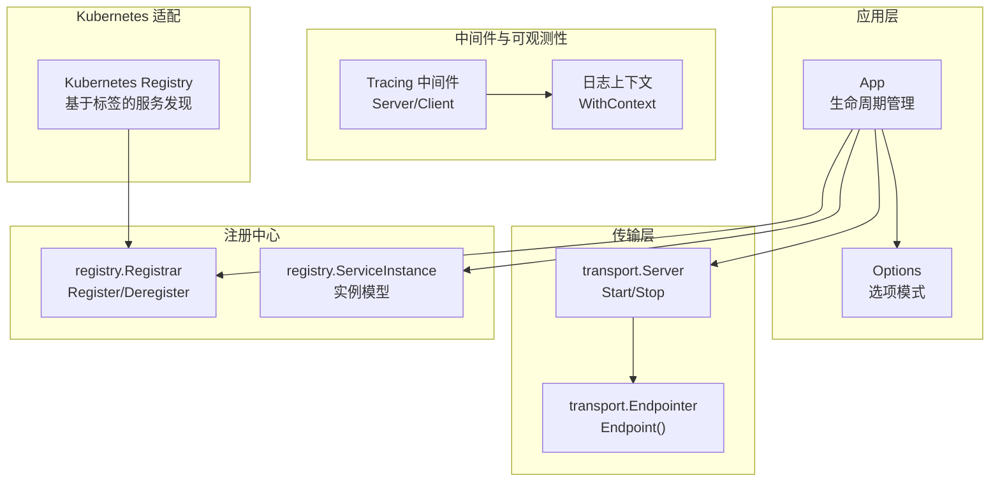
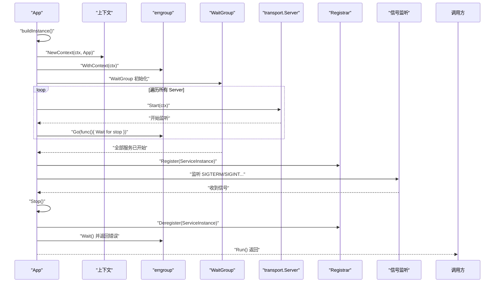
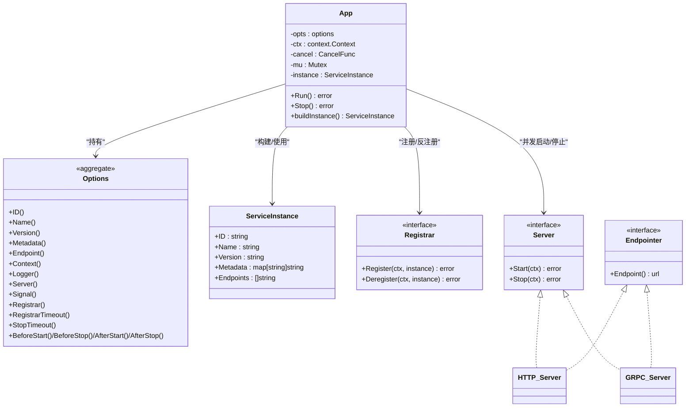

# 应用管理

<cite>
**本文引用的文件列表**
- [app.go](file://app.go)
- [options.go](file://options.go)
- [registry/registry.go](file://registry/registry.go)
- [transport/transport.go](file://transport/transport.go)
- [transport/http/server.go](file://transport/http/server.go)
- [transport/grpc/server.go](file://transport/grpc/server.go)
- [middleware/tracing/tracing.go](file://middleware/tracing/tracing.go)
- [log/global_test.go](file://log/global_test.go)
- [app_test.go](file://app_test.go)
- [contrib/registry/kubernetes/registry.go](file://contrib/registry/kubernetes/registry.go)
</cite>

## 目录
1. [简介](#简介)
2. [项目结构](#项目结构)
3. [核心组件](#核心组件)
4. [架构总览](#架构总览)
5. [组件详解](#组件详解)
6. [依赖关系分析](#依赖关系分析)
7. [性能考量](#性能考量)
8. [故障排查指南](#故障排查指南)
9. [结论](#结论)
10. [附录](#附录)

## 简介
本文件围绕 Kratos 框架中的应用管理模块，系统性阐述 App 结构体如何作为微服务生命周期的核心管理器：如何通过 errgroup 和 sync.WaitGroup 实现并发服务启动与优雅关闭；如何监听 SIGTERM、SIGINT 等信号并触发优雅停机；如何利用选项模式（Functional Options）进行灵活配置注入；如何构建服务实例（ServiceInstance）并与注册中心协同完成注册与反注册；以及 AppInfo 接口在上下文传递中对链路追踪、日志记录等场景的支持。

## 项目结构
与应用管理直接相关的关键文件：
- 应用生命周期与上下文：app.go、options.go
- 注册中心抽象与实例模型：registry/registry.go
- 传输层抽象与服务接口：transport/transport.go
- HTTP/gRPC 服务器实现：transport/http/server.go、transport/grpc/server.go
- 链路追踪与日志上下文：middleware/tracing/tracing.go、log/global_test.go
- Kubernetes 注册中心适配：contrib/registry/kubernetes/registry.go
- 行为验证与示例：app_test.go

图表来源
- [app.go](file://app.go#L1-L213)
- [options.go](file://options.go#L1-L130)
- [registry/registry.go](file://registry/registry.go#L1-L96)
- [transport/transport.go](file://transport/transport.go#L1-L96)
- [transport/http/server.go](file://transport/http/server.go#L1-L375)
- [transport/grpc/server.go](file://transport/grpc/server.go#L1-L278)
- [middleware/tracing/tracing.go](file://middleware/tracing/tracing.go#L1-L97)
- [log/global_test.go](file://log/global_test.go#L112-L139)
- [contrib/registry/kubernetes/registry.go](file://contrib/registry/kubernetes/registry.go#L1-L54)

章节来源
- [app.go](file://app.go#L1-L213)
- [options.go](file://options.go#L1-L130)

## 核心组件
- App：应用生命周期管理器，负责并发启动/停止服务、注册/反注册、信号监听与优雅停机。
- Options：选项模式的承载者，通过一系列 Option 函数对 App 进行配置注入。
- ServiceInstance：服务实例模型，包含服务 ID、名称、版本、元数据与端点列表。
- transport.Server/Endpointer：统一的传输层服务接口与端点解析能力。
- Registrar：注册中心接口，定义注册与反注册行为。
- AppInfo：在上下文中传递的应用信息接口，支持链路追踪、日志等场景。

章节来源
- [app.go](file://app.go#L1-L213)
- [options.go](file://options.go#L1-L130)
- [registry/registry.go](file://registry/registry.go#L1-L96)
- [transport/transport.go](file://transport/transport.go#L1-L96)

## 架构总览
下图展示了 App 在运行时的主流程：构建服务实例、并发启动各传输层服务、注册到注册中心、等待信号或错误、优雅停机并反注册。

图表来源
- [app.go](file://app.go#L82-L151)
- [transport/transport.go](file://transport/transport.go#L15-L24)
- [registry/registry.go](file://registry/registry.go#L9-L15)

## 组件详解

### 1) App 结构体与生命周期
- 字段与职责
  - opts：应用选项集合（名称、版本、元数据、端点、上下文、信号集、注册器、超时、服务器列表、生命周期钩子等）
  - ctx/cancel：根上下文与取消函数，用于传播停机信号
  - mu：保护 ServiceInstance 的并发访问
  - instance：当前服务实例对象
- 关键方法
  - New：初始化默认选项、设置日志、生成唯一 ID，并返回 App 实例
  - Run：构建服务实例、并发启动服务器、注册到注册中心、监听信号并优雅停机
  - Stop：执行 BeforeStop 钩子、反注册、取消根上下文
  - buildInstance：根据显式端点或 Endpointer 自动推断端点，构造 ServiceInstance
  - 上下文工具：NewContext/FromContext，将 AppInfo 注入/提取到上下文

并发与优雅停机要点
- 使用 errgroup.WithContext 将 App 的上下文传递给每个服务协程，统一接收停机信号
- 使用 WaitGroup 确保所有服务都已开始后再进行注册，避免注册早于监听导致的空端点
- Stop 时可选超时控制，确保在超时前尽力优雅停机，否则强制停止
- 反注册发生在取消根上下文之前，保证注册中心能感知到实例即将退出

章节来源
- [app.go](file://app.go#L1-L213)

### 2) 选项模式（Functional Options）设计
- 选项类型与承载
  - Option 是一个函数类型，接收 options 指针并修改其字段
  - options 聚合了所有可配置项，包括 ID、Name、Version、Metadata、Endpoints、Context、Logger、Registrar、RegistrarTimeout、StopTimeout、Servers、Before/After 钩子、信号集等
- 典型选项
  - 基础信息：ID、Name、Version、Metadata、Endpoint
  - 上下文与日志：Context、Logger
  - 传输层：Server（可传入多个）
  - 注册中心：Registrar、RegistrarTimeout
  - 停机策略：StopTimeout
  - 生命周期钩子：BeforeStart/BeforeStop/AfterStart/AfterStop
  - 信号定制：Signal
- 设计优势
  - 明确的命名参数风格，易读且可扩展
  - 支持链式组合，按需注入配置
  - 默认值集中管理，减少调用侧样板代码

章节来源
- [options.go](file://options.go#L1-L130)

### 3) 服务实例（ServiceInstance）构建与注册/反注册
- 构建逻辑
  - 若显式提供了端点，则直接使用
  - 否则遍历所有 Server，若实现了 Endpointer，则调用 Endpoint() 获取真实地址
  - 最终构造 ServiceInstance（含 ID、Name、Version、Metadata、Endpoints）
- 注册与反注册
  - Run 成功后，若配置了 Registrar，则在注册超时内完成 Register
  - Stop 时，若存在实例且配置了 Registrar，则在注册超时内完成 Deregister
- 注册中心抽象
  - Registrar 定义 Register/Deregister
  - ServiceInstance 描述服务实例的标识、版本、元数据与端点

章节来源
- [app.go](file://app.go#L176-L200)
- [registry/registry.go](file://registry/registry.go#L9-L15)
- [registry/registry.go](file://registry/registry.go#L36-L51)

### 4) 传输层服务（HTTP/gRPC）与并发启动
- 传输层接口
  - Server：Start(ctx)、Stop(ctx)
  - Endpointer：Endpoint() 返回服务端点
- HTTP 服务器
  - 提供 Endpoint() 解析真实地址，Start() 监听并 Serve，Stop() 支持优雅关闭
- gRPC 服务器
  - 提供 Endpoint() 解析真实地址，Start() 监听并 Serve，Stop() 支持 GracefulStop 或强制 Stop
- 并发策略
  - Run 中为每个 Server 启动两个 goroutine：一个负责优雅停机（等待 ctx.Done），另一个负责启动服务
  - 使用 WaitGroup 确保所有服务均已开始，再进行注册

章节来源
- [transport/transport.go](file://transport/transport.go#L15-L24)
- [transport/http/server.go](file://transport/http/server.go#L310-L375)
- [transport/grpc/server.go](file://transport/grpc/server.go#L214-L278)
- [app.go](file://app.go#L91-L120)

### 5) 信号监听与优雅停机流程
- 信号订阅
  - 默认监听 SIGTERM、SIGQUIT、SIGINT；可通过 Signal 自定义
- 触发路径
  - Run 中启动一个 goroutine 监听信号，收到信号后调用 Stop()
  - Stop 执行 BeforeStop 钩子、反注册、取消根上下文，随后 errgroup.Wait() 返回
- 超时控制
  - StopTimeout 控制停机阶段的超时，避免无限等待

章节来源
- [app.go](file://app.go#L121-L151)
- [options.go](file://options.go#L81-L99)

### 6) AppInfo 接口与上下文传递（对链路追踪、日志的支持）
- AppInfo 定义
  - 提供 ID、Name、Version、Metadata、Endpoint 方法
- 上下文工具
  - NewContext 将 AppInfo 注入到 context
  - FromContext 从 context 中取出 AppInfo
- 在中间件中的应用
  - Tracing Server/Client 中通过 transport.FromServerContext/FromClientContext 获取 Transporter，结合 AppInfo 的元数据与端点，便于链路追踪与日志关联
  - 日志系统可通过 WithContext 将 trace-id 等上下文值注入日志输出，提升可观测性

章节来源
- [app.go](file://app.go#L20-L27)
- [app.go](file://app.go#L201-L213)
- [middleware/tracing/tracing.go](file://middleware/tracing/tracing.go#L46-L76)
- [log/global_test.go](file://log/global_test.go#L112-L139)

### 7) 在 Kubernetes 环境下的部署与注册
- Kubernetes 注册中心适配
  - 通过标签选择 Pod/Deployment，自动解析服务实例的 ID、名称、版本、元数据与协议端点
  - 与 App 的 Registrar 集成，实现服务注册与反注册
- 示例标签字段
  - kratos-service-id、kratos-service-app、kratos-service-version、kratos-service-metadata、kratos-service-protocols
- 部署建议
  - 在 Pod 模板中添加上述标签，使注册中心能够正确识别服务实例
  - 结合 StopTimeout 与优雅停机策略，确保在滚动更新或节点驱逐时平滑退出

章节来源
- [contrib/registry/kubernetes/registry.go](file://contrib/registry/kubernetes/registry.go#L28-L54)
- [app.go](file://app.go#L120-L151)

## 依赖关系分析
- 组件耦合
  - App 依赖 transport.Server/Endpointer、registry.Registrar、log.Logger、signal
  - Options 仅作为配置载体，不引入外部依赖，降低耦合度
  - ServiceInstance 与 Registrar 解耦，便于替换不同注册中心实现
- 外部依赖
  - golang.org/x/sync/errgroup：并发控制与错误聚合
  - os/signal：信号监听
  - google/uuid：生成服务实例 ID

图表来源
- [app.go](file://app.go#L1-L213)
- [options.go](file://options.go#L1-L130)
- [registry/registry.go](file://registry/registry.go#L9-L15)
- [transport/transport.go](file://transport/transport.go#L15-L24)
- [transport/http/server.go](file://transport/http/server.go#L156-L204)
- [transport/grpc/server.go](file://transport/grpc/server.go#L130-L152)

## 性能考量
- 并发启动与注册顺序
  - 使用 WaitGroup 确保注册前所有服务均已开始监听，避免注册空端点带来的短暂不可用
- 错误聚合与快速失败
  - errgroup 聚合各服务的错误，一旦出现非 context.Canceled 的错误即提前返回
- 停机超时
  - StopTimeout 控制优雅停机窗口，防止长时间阻塞导致资源浪费
- 注册超时
  - RegistrarTimeout 限制注册/反注册的等待时间，避免阻塞主流程

章节来源
- [app.go](file://app.go#L91-L151)

## 故障排查指南
- 无法注册到注册中心
  - 检查 Registrar 是否配置、网络连通性、注册超时是否过短
  - 确认 ServiceInstance 的 Endpoints 是否有效
- 优雅停机未生效
  - 检查 StopTimeout 是否设置过小
  - 确认 Stop() 是否被调用（信号监听是否正常）
- 信号未触发
  - 确认 Signal 选项是否覆盖默认信号集
  - 检查容器/进程是否正确接收 SIGTERM/SIGINT
- 上下文未携带 AppInfo
  - 确认 NewContext 已在 Run 前调用
  - 检查 FromContext 是否正确取值

章节来源
- [app.go](file://app.go#L121-L151)
- [app_test.go](file://app_test.go#L249-L300)

## 结论
App 结构体通过选项模式、传输层抽象、注册中心接口与信号监听，构建了高内聚、低耦合的应用生命周期管理框架。借助 errgroup 与 WaitGroup，实现了并发服务的统一启动与优雅停机；通过 AppInfo 与上下文工具，为链路追踪与日志记录提供了统一入口。在 Kubernetes 环境下，结合注册中心适配，可实现自动化的服务注册与发现，满足生产级微服务部署需求。

## 附录

### A. 初始化 App 与添加 HTTP/gRPC 服务器
- 步骤
  - 使用 New 创建 App，传入 Name、Version、Server(HTTP/GRPC) 等选项
  - 可选：配置 Registrar、RegistrarTimeout、StopTimeout、Before/After 钩子、Signal
  - 调用 Run 开始运行，收到信号或发生错误后优雅停机
- 示例参考
  - 测试用例展示了如何添加 HTTP/gRPC 服务器、注册生命周期钩子、配置 Registrar 并在一秒后主动 Stop()

章节来源
- [app_test.go](file://app_test.go#L43-L74)
- [transport/http/server.go](file://transport/http/server.go#L177-L204)
- [transport/grpc/server.go](file://transport/grpc/server.go#L153-L203)

### B. 使用 AppInfo 支持链路追踪与日志
- 链路追踪
  - 在 Tracing Server 中通过 transport.FromServerContext 获取 Transporter，结合 AppInfo 的元数据与端点，增强 Span 的上下文信息
- 日志
  - 通过 WithContext 将 trace-id 等上下文值注入日志输出，便于跨服务定位问题

章节来源
- [middleware/tracing/tracing.go](file://middleware/tracing/tracing.go#L46-L76)
- [log/global_test.go](file://log/global_test.go#L112-L139)