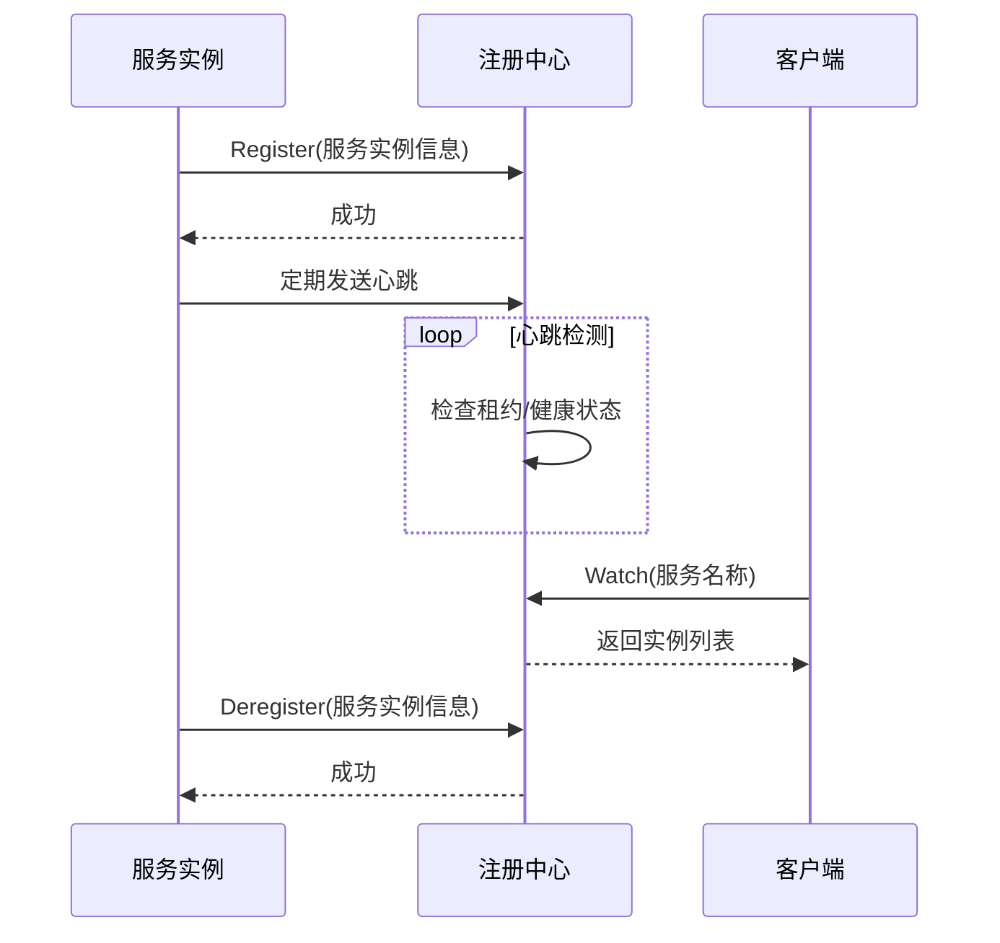
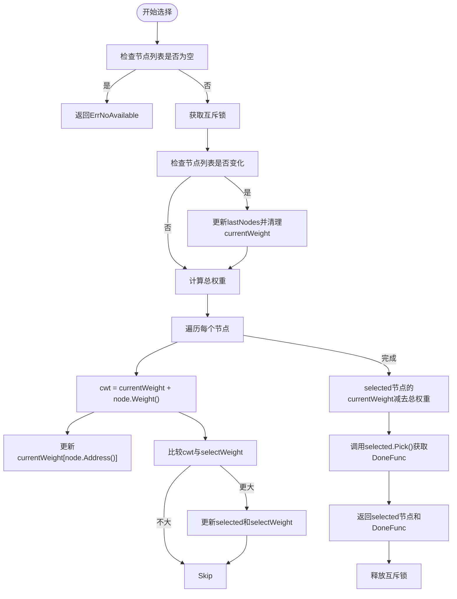
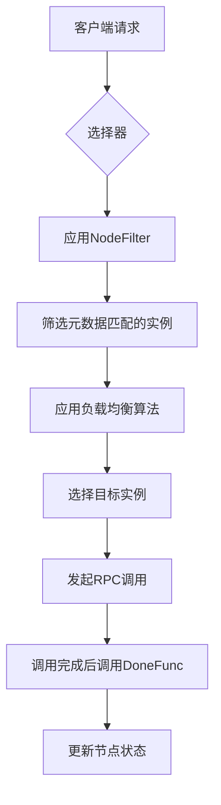

# 服务注册与发现

<cite>
**本文档中引用的文件**  
- [registry/registry.go](file://registry/registry.go)
- [selector/selector.go](file://selector/selector.go)
- [selector/balancer.go](file://selector/balancer.go)
- [selector/wrr/wrr.go](file://selector/wrr/wrr.go)
- [selector/p2c/p2c.go](file://selector/p2c/p2c.go)
- [contrib/registry/consul/registry.go](file://contrib/registry/consul/registry.go)
- [contrib/registry/etcd/registry.go](file://contrib/registry/etcd/registry.go)
- [contrib/registry/discovery/discovery.go](file://contrib/registry/discovery/discovery.go)
- [transport/grpc/resolver/discovery/resolver.go](file://transport/grpc/resolver/discovery/resolver.go)
- [transport/http/resolver.go](file://transport/http/resolver.go)
- [selector/default_selector.go](file://selector/default_selector.go)
- [selector/global.go](file://selector/global.go)
</cite>

## 目录
1. [引言](#引言)
2. [核心接口与数据结构](#核心接口与数据结构)
3. [服务注册与反注册机制](#服务注册与反注册机制)
4. [服务发现与客户端解析](#服务发现与客户端解析)
5. [负载均衡策略实现](#负载均衡策略实现)
6. [注册中心集成示例](#注册中心集成示例)
7. [健康检查与元数据支持](#健康检查与元数据支持)
8. [服务发现模式对比](#服务发现模式对比)
9. [总结](#总结)

## 引言
服务注册与发现是微服务架构中的核心组件，它使得服务实例能够动态地向系统宣告其存在，并允许其他服务通过逻辑名称查找和连接到这些实例。Kratos框架通过抽象化的接口设计，支持多种注册中心（如Consul、Etcd、Nacos等）的集成，同时提供了灵活的负载均衡和服务发现机制。本文档将深入分析Kratos框架中服务注册与发现的实现原理，涵盖核心接口、数据结构、算法机制以及实际应用示例。

## 核心接口与数据结构

### Registry接口与ServiceInstance结构体
Kratos框架通过`Registry`接口抽象了服务注册与发现的核心功能。该接口由`Registrar`和`Discovery`两个子接口组成，分别负责服务的注册/反注册和发现功能。

`ServiceInstance`结构体定义了服务实例的核心属性：
- **ID**: 实例的唯一标识符，在注册中心中用于区分不同实例
- **Name**: 服务的逻辑名称，是服务发现的主要查询键
- **Version**: 服务的版本号，支持多版本部署和灰度发布
- **Metadata**: 键值对元数据，可用于存储环境、区域、权重等附加信息
- **Endpoints**: 实例的端点地址列表，包含协议和查询参数，如`http://127.0.0.1:8000?isSecure=false`

该结构体还实现了`Equal`方法，用于比较两个服务实例是否相等，比较时会考虑ID、Name、Version、Endpoints和Metadata等所有字段。

**Section sources**
- [registry/registry.go](file://registry/registry.go#L36-L95)

### Resolver接口与选择器机制
`Resolver`接口在客户端服务发现中扮演关键角色，它负责根据服务名称获取可用实例列表，并将这些实例信息提供给底层传输层（如gRPC或HTTP客户端）。`Selector`接口是负载均衡的核心，它实现了从一组服务节点中选择一个目标节点的逻辑。

`Selector`接口继承自`Rebalancer`，后者负责在服务实例列表发生变化时更新内部状态。`Selector`的`Select`方法返回一个选中的节点以及一个`DoneFunc`回调函数，该回调用于在RPC调用完成后报告调用结果，以便实现基于响应的负载均衡策略。

**Section sources**
- [selector/selector.go](file://selector/selector.go#L9-L75)
- [selector/balancer.go](file://selector/balancer.go#L8-L39)

## 服务注册与反注册机制

### Registrar接口实现
`Registrar`接口定义了`Register`和`Deregister`两个方法，分别用于向注册中心注册和反注册服务实例。当服务启动时，会调用`Register`方法将自身信息（`ServiceInstance`）发布到注册中心；当服务关闭时，则调用`Deregister`方法将其从注册中心移除。

Kratos框架通过`contrib/registry`目录下的各个实现来支持不同的注册中心。以Consul为例，`Register`方法会创建一个Consul服务定义，并可配置健康检查、标签等选项。对于Etcd，服务注册通过创建带租约（Lease）的键值对实现，租约的TTL（Time To Live）机制确保了服务的心跳检测。

### 健康检查与自动反注册
注册中心通常会与健康检查机制结合使用。在Consul实现中，可以通过`WithHealthCheck`选项启用健康检查，配置检查间隔和失败阈值。当服务实例无法通过健康检查时，注册中心会自动将其标记为不可用或从服务列表中移除。

在Etcd实现中，服务注册与租约绑定，服务需要定期发送心跳来续订租约。如果服务崩溃或网络中断导致心跳停止，租约到期后，Etcd会自动删除对应的服务注册信息，实现自动反注册。



**Diagram sources**
- [contrib/registry/consul/registry.go](file://contrib/registry/consul/registry.go#L134-L142)
- [contrib/registry/etcd/registry.go](file://contrib/registry/etcd/registry.go#L85-L129)

## 服务发现与客户端解析

### Discovery接口与Watcher机制
`Discovery`接口提供了`GetService`和`Watch`两个核心方法。`GetService`用于同步获取指定服务名称的实例列表，而`Watch`则返回一个`Watcher`，允许客户端订阅服务实例的变化事件。

`Watcher`的`Next`方法是一个阻塞调用，当服务实例列表首次获取到或发生变更时，它会返回最新的实例列表。这种机制使得客户端能够实时感知服务拓扑的变化，及时更新本地缓存。

### 客户端解析器实现
在传输层（如gRPC或HTTP），解析器（Resolver）负责与`Discovery`交互。以gRPC为例，`discoveryResolver`会创建一个`Watcher`并启动一个goroutine来监听服务实例的变化。当收到更新事件时，它会将`ServiceInstance`列表转换为gRPC的`resolver.Address`列表，并通过`UpdateState`方法通知gRPC客户端更新连接池。

HTTP客户端的解析器实现类似，它使用`selector.Rebalancer`来管理节点列表，并在实例变化时调用`Apply`方法更新选择器状态。

**Section sources**
- [registry/registry.go](file://registry/registry.go#L17-L34)
- [transport/grpc/resolver/discovery/resolver.go](file://transport/grpc/resolver/discovery/resolver.go#L18-L116)
- [transport/http/resolver.go](file://transport/http/resolver.go#L45-L155)

## 负载均衡策略实现

### WRR（加权轮询）算法
WRR（Weighted Round Robin）是一种基于权重的轮询算法。Kratos的WRR实现采用了Nginx的平滑加权轮询算法。每个节点有一个动态的当前权重（`currentWeight`），初始值为配置的权重。每次选择时，算法会遍历所有节点，将当前权重加上其配置权重，然后选择当前权重最大的节点。选中后，该节点的当前权重减去所有节点的总权重，从而实现平滑的调度。



**Diagram sources**
- [selector/wrr/wrr.go](file://selector/wrr/wrr.go#L58-L107)

### P2C（最少连接数）算法
P2C（Pick of 2 Choices）是一种基于最少连接数的负载均衡算法。它随机选择两个节点，然后从中选择连接数较少（或响应时间较短）的一个。Kratos的P2C实现结合了EWMA（指数加权移动平均）算法来估算节点的延迟。

算法首先随机选择两个节点，然后比较它们的权重（由EWMA节点计算得出）。为了防止长时间未被选中的节点被完全忽略，P2C还实现了"强制选择"机制：如果一个节点在超过3秒的时间内未被选中，它将有更高的概率被强制选中一次，以更新其延迟统计信息。

**Section sources**
- [selector/p2c/p2c.go](file://selector/p2c/p2c.go#L53-L79)

## 注册中心集成示例

### Consul集成
要将服务注册到Consul，首先需要创建一个Consul客户端，然后使用`consul.New`创建一个`Registry`实例。可以通过各种`Option`函数来配置健康检查、数据中心、标签等选项。

```go
// 示例代码路径
// contrib/registry/consul/registry.go
```

### Etcd集成
Etcd集成需要创建一个`clientv3.Client`，然后使用`etcd.New`创建`Registry`实例。可以通过`Namespace`、`RegisterTTL`等选项来配置命名空间和注册TTL。

```go
// 示例代码路径
// contrib/registry/etcd/registry.go
```

### Discovery集成
Discovery是Kratos框架内置的服务发现系统。通过`discovery.New`创建一个`Discovery`实例，并配置节点地址、环境、主机名等信息，即可实现服务注册与发现。

```go
// 示例代码路径
// contrib/registry/discovery/discovery.go
```

**Section sources**
- [contrib/registry/consul/registry.go](file://contrib/registry/consul/registry.go#L112-L132)
- [contrib/registry/etcd/registry.go](file://contrib/registry/etcd/registry.go#L67-L83)
- [contrib/registry/discovery/discovery.go](file://contrib/registry/discovery/discovery.go#L44-L77)

## 健康检查与元数据支持

### 健康检查机制
健康检查是确保服务高可用的关键。Kratos框架通过注册中心的原生健康检查功能来实现。在Consul中，可以配置HTTP、TCP或脚本检查；在Etcd中，通过租约的心跳机制实现。当实例无法通过健康检查时，它会被从服务发现列表中移除，确保流量不会被路由到不可用实例。

### 元数据与灰度发布
`ServiceInstance`的`Metadata`字段为高级场景提供了支持。例如，在灰度发布中，可以将版本信息、区域、用户分组等信息存储在元数据中。客户端在服务发现时，可以使用`NodeFilter`来筛选特定元数据的实例，实现基于元数据的流量路由。



**Diagram sources**
- [selector/selector.go](file://selector/selector.go#L32-L53)
- [selector/default_selector.go](file://selector/default_selector.go#L21-L63)

## 服务发现模式对比

### 基于注册中心的发现模式
这是最常用的服务发现模式。服务实例启动时向注册中心注册，关闭时反注册。客户端通过注册中心发现服务实例。这种模式的优点是解耦了服务提供者和消费者，支持动态扩缩容和故障恢复。

### 直接连接（Direct）模式
直接连接模式适用于简单的场景或测试环境。在这种模式下，客户端直接配置目标服务的地址，无需注册中心。Kratos通过`direct.Builder`实现了这种模式，它简单地将配置的地址作为唯一的节点。

两种模式的选择取决于系统的复杂性和运维要求。生产环境通常推荐使用基于注册中心的模式，以获得更好的可维护性和弹性。

**Section sources**
- [selector/node/direct/direct.go](file://selector/node/direct/direct.go)
- [selector/global.go](file://selector/global.go#L1-L22)

## 总结
Kratos框架通过清晰的接口抽象和模块化设计，提供了一套完整且灵活的服务注册与发现解决方案。`Registry`接口统一了不同注册中心的访问方式，`Selector`机制提供了丰富的负载均衡策略，而`Resolver`则无缝集成了服务发现与底层传输。通过合理配置健康检查和利用元数据，可以构建出高可用、支持灰度发布的微服务系统。开发者可以根据具体需求选择合适的注册中心和负载均衡策略，快速构建健壮的分布式应用。